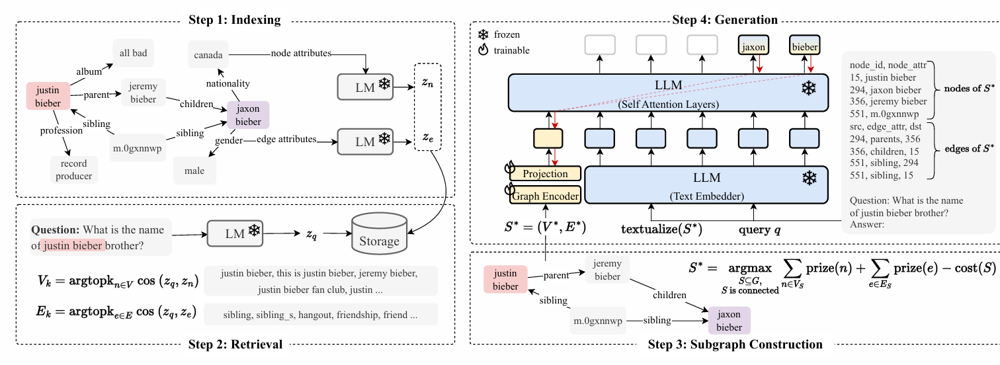

# GraphRAG

앞에는 MCP 조금

TextRAG -> GraphRAG
documents -> graph
Retrieved Text -> Retrieved Triplets

G = (V, E)

knowledge - a set of facts + a set of rules
fact: triple (subject, predicate, object)
    : edge

- Graph-Retrieval
Indexing -> Retrieval -> Sugraph Construction -> Generation

질의가 들어왔을 때, V_k와 E_k 계산. argtopk cos(z_q,z_n). 
steiner tree형태. (keyword search에 자주 사용되던 트리. 이전에LLM 없을땐 썼으나 지금은 쓰면 이상함.)
문제는 Question에 **의미**가 관련된다는 근거 자체가 없음. 운 좋아야 걸려떨어지는 상황.(후보를 찾을 때 키워드위주로되며 subgraph선정도 이상함.)
(작년까지는 이거 썼음.)

(요거말고 다른건 굳이 안 봐도 됨.)

---

DiskANN 
Nearest Nieghbor 구하는 거 연산량 high
(1+eps) Approximate NN
eps값 조정하여 해당 범위 내에 들어오면 ANN candidates.  eps != 0 이지만, eps==0이면 실제 최단거리. 
-> eps값 조정하면 범위내에 들어온 것들은 비교가 어려움. Exact보단 덜 정확하지만 빨라서 씀.

