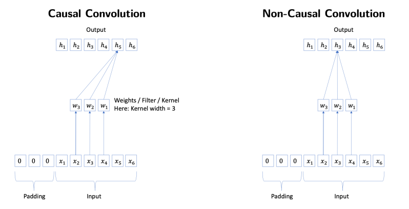
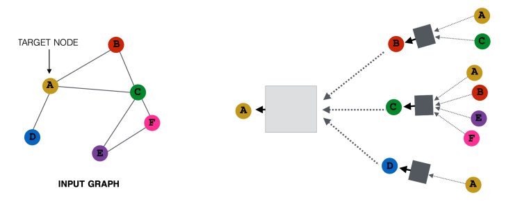

# Data

### TS basic
Evaluation
1. 모델 학습에 필요한 loss function
2. backtesting을 위한 forecast accuracy (하이퍼파라미터 튜닝 등을 위한)
3. stakeholder들에게 report하기위한 forecast accuracy measure

그럼 이제 Model Choice?
길이가 L인 N개의 time series가 있을 때
1. N개에 대해 다른 모델? 글로벌 모델? -> Local Univariate(통계학 등) / Global Univariate(딥러닝)
2. N개사이의 관계를 고려? -> Multivariate Model

## TS advanced

### State space model

error correction : 이전 모델값 + a * (실제값-모델값)으로 예측.
즉, 이전 예측에, 에러값을 일부 비중 적용하여 error에대한 보정. 
이어져 가면 ETS (simple ExponenTial Smoothing) 이라 함. (1-a)를 계속 곱해가며 (1-a)^T z_hat1까지 더해지는 것.
과거값을 모두 사용은 하지만, 최신값에 더 많은 비중을 주게 됨. (a는 [0,1])

Q: 우리가 error correction 부분이 꼭 필요한가? -> No, error를 random variable e_t로 두자.
SSM은 
z_t = a^T_t l_(t-1) + e_t, e_t는 N(0, sigma^2) (즉, gaussian 에러)
-> State transition

근데, 이 SSM은 feature를 사용하는 게 아님. -> Linear regression의 Idea를 추가하여 State Space Model을 만들 수 있음.
-> w^T * x_t를 더해서. 
so, 과거로부터 얻어지는 정보 + Feature 정보를 활용하여 예측하는 게 Linear State Space Models.

### From linear to deep models

linear model에 비선형성 추가하고, 깊게쌓으면 DNN과 같음. -> MLP
-> Toward RNN
eps는 불확실성을 의미하기에, eps는 없는게 나음. 
RNN은 SSM에 비선형성만 추가하면 됨. layer를 쌓는 개념은 잘 안 보임. 비선형함수 or activation함수가 쌓이는게 layer일텐데
non-linear함수가 state가 쌓일수록 sigmoid 적용되기에 RNN 길어짐 -> 비선형성 -> layer 깊어짐

### Convolutional Neural Network

시계열데이터도 크게 다르지 않음.

단, 조금 다른건 kernel의 output이 input보다 시간이 후행하도록 줌. 
RNN은 입력시퀀스의 길이에 상관없이 동작하도록 되어있으나, (gradient 사라지는 건 그럴 수 있지만 일단 설계상으로는)
-> kernel size가 3이나 5냐에 따라 receptive field의 크기가 달라짐. kernel size와 layer수에 비례해 receptive field가 적용되는 부분까지만 input에 들어감
-> 넓은 영역을 보려면 kernel size도 늘리고, layer도 늘려야 함.
-> 그나마 적은 커널사이즈와 레이어로 넓은 영역을 볼 수 있게하는 아이디어 Dilation.

### Encoder-decoder structure

많은 예측 모델은 추가적인 외부변수 X에 의존함. 
Q:만약 변수 X가 현재시점 T까지만 있고, 미래에는 없다면?
-> Autoregressive하게 사용하는 것이 불가. 
-> Encoder-Decoder 구조 채택

Decoder가 꼭 linear할 필요 없음. -> Decoder로 RNN 사용 가능.

지금까지는 Canonical(One to One)이라, 출력이 있으려면 입려이 있어야함.
Many2Many모델에서는 입력이 없어도 Decoder부분으로 아웃풋 생성 가능.
-> Seq2Seq모델이면 출력 h_t는 encoder의 데이터로 h_t+1분 아니라 h_t+h까지 활용됨.
-> 외부입력X없이도 output을 예측할 수 있게됨.

Attention RNN

h_1 ~ h_T까지가 h_T+k의 중요도를 판단하는 변수가 됨.
현재의 디코더 셀이 출력함에 있어 각각의 h가 얼마나 영향을 끼치는지?

all encoder states를 attention때려서 나온 attn score로 현재 decoding cell에서 구할 수 있음
> 다시 확인. Encoder-Decoder부분

## Recommender System

전통적으로는 2개
content-based : 영화나 상품 item의 속성을 보는 것. 
collaborative filtering : item의 정보가 아닌, 여러 user와 item간 interaction을 기반으로 주는 것.
-> 둘을 섞은 hybrid 방식도 있음

gathering ratings
Explicit feedback : user에게 직접 물어봄. ex. 유튜브에서 like/dislike. 얻기 어려움(적극적인 유저만 레이팅해줌)
Implicit feedback : user의 행동으로부터 배움. 싫다는 정보를 얻기 어려움. 영화를 보면 1(like) 안보면 0(no rating)

### Content-based

알고리즘이랄 것 없이 매우 간단함. 좋아요 누른 것과 연관된 item 추천.ㅇㄻㄴㅇㄹㄹ
-> 다른 유저 평가 필요 없고, 오직 컨텐츠에 좋은 정보만 잘 들어가있으면 됨. 
-> 아이템이 추가되고 그럴 때 좋은 퀄리티를 계속 유지하기 어려움. 

### Collaborative filtering

user-side collabo filtering. Utility matrix를 기반으로 비슷한 유저들 찾음.
-> 취향이 비슷한 유저들이 좋아한 item을 추천해줌
-> 비슷한? -> Jaccard similarity(magnitude 고려안해서 이상하기도.) or Cosine similarity (sparse하며, 비어있는 값이 0인데 싫어서 0인지도 모르는데.)
-> So, 장단은 있으나 정답은 없음. 유저간 유사도를 현실성있게 뽑는 것이 중요. 뽑아진 후에는 어렵지 않음.

item-side collabo filtering. item간 similarity를 다 알고있다고 있음. 
item-side가 조금 더 reliable하다. 비교적 시간에 따라 변하지 않음. user의 특성ㅇ느 빠르게 변할 뿐 아니라 하나로 정의되지 않음. 유사도 연산 어려움.

### Latent factor models

(이전까진 training이라는 것이 없었음. 거의 rule기반.)

Latent factor model은 user간 simil을 row로만 비교하고 item간 simil을 column으로만 구분.
고차원, sparse한 것을 저렇게 하는 것보단, utility mat.을 조금 더 잘 반영할 수 있는 latent space라는 게 있고 가정.
CF는 그냥 util mat 쓰는것에 반해, latent는 factor을 추출함.

UV Decomposition ㄱ. k차원으로. UV^T 만들 때 non-blank entries를 잘 복원할 수 있도록. 

## Recommender System advanced

direct vs undirect (방향없는 간선)

Link Prediction?
-> 서로 연결하는거 어떻게되어있는지? ML로.

Node Classification?
-> 각 Node가 뭐로 분류되어있어야할지? (graph에서 link연결된거보면서 해당 node의 성향내지는 분류 가능.)

요새는 두개 합쳐서 graph representational learning.
node든 sub graph든 entire graph든 low dimensional embedding 만들어서 원래 그래프의 구조적인 특성을 잘 보존하게하면 학습 가능.

recommendation task는 link prediction problem과 같음. (User node, Item node로 구성된 graph)

### Graph neural networks

graph를 다루는 NN은 image와 Text보다 어려움.
인접행렬만드는것도 sparse하고 그래서, 새로운 NN 구조가 필요함. 

graph G = (A, X). A는 adjacency mat. X는 node feature mat.  (A라는 인접행렬에 X라는 노드 피쳐 매트릭스.)
Goal은 G를 입력으로 유의미한 그래프 태스크를 풀 수 있는 NN 학습 (Node 분류 혹은 Link prediction 등)

GNN은 각 노드의 representation을 layer를 통해 만들어나감. i번째 노드의 representation은 l-1번째에서 온 것. 그 layer의 representation은 l-2번째에서. 
-> computation graph를 만들어야함. (tree구조)
A를 만들기 위해 B,C,D가 필요하고, B,C,D를 만들기 위한 것들을 쭉 전개해나가면서 update

모든 노드에 대해 tree 그릴 수 있고, 모든 노드에 대해 parallel하게 update되어감. 아래 layer에서 위로 가면서.
(여러 layer가 stack된 형태)

self-reflection 문제.

General Framework
message, aggregation. 어떻게 하냐에 따라 GCN, GraphSAGE, GAT, GIN, etc...

GCN(graph Convolutional Network)

병렬적으로 연산되는 것을, 컴퓨터에서 한번에 수행하기 위해선 matrix-vector ops로 만들어야 함.
- 28page. node별 연산이 matrix 연산으로 변환. 

### Neural graph collaborative filtering
(NGCF)

latent factor model + GNN 합친 거.

user representation과 item representation 만든 후, 
GNN으로 propagate embeddings. 하고나서 dot product해서 연결.

latent model과 다른 점은 연산 중 중간에 GNN을 집어넣은 것.

> 어렵다
