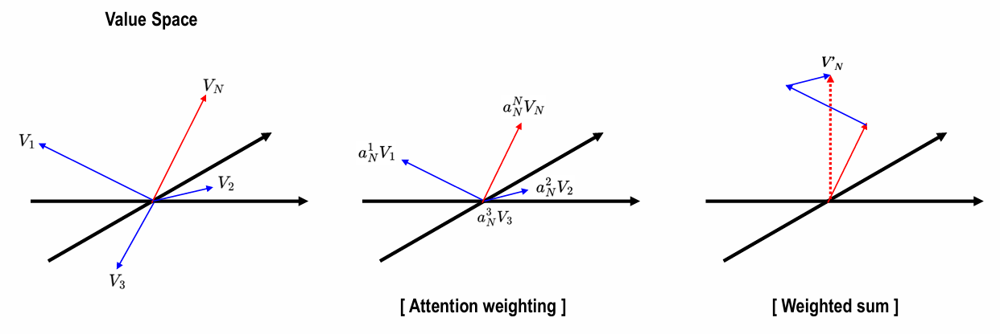
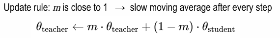

# Vision

## Day3

### Intro
- Evolution of Computer Vision
- 지도학습/비지도학습/ 등
- Background Knowledge -> image sensor 원리, 영상신호처리, 수학(행렬, 미분, 확률통계)

### Basic Architecture (DNN_CNN)

**DNN**

Perceptron -> MLP -> DNN -> Back-propagation
(Back-propagation 시 gradient가 대체로 0근처에 몰려있어서 gradient vanishing이 발생함
그래서 normalize가 필요함.)

logit과 prob은
sigmoid 들어가기 전이 logit, 들어가서 나온 output이 probability.
logit = 승산 = ln(odds), odds = p / (1 - p)

sigmoid function = 위에있는 식 logit식을 l과 p에 관해 정리하면
p = 1 / (1 + e^(-1))

dp/dl = p(1-p) (위 그림상 빨간 점선. 옆으로갈수록 미분값이 0에 가까워지기에 )

softmax 시 max-trick (만약, Output laye의 logit들이 다 크면, overflow남.)
-> m = max(Z_j)라는, logit값 중 가장 큰 값을 m으로 두고, 연산 시 e^(z_i - m)으로 두어 e^m을 미리나눠두기도.

BCE , CE(Cross Entropy)

**CNN**

Convolution (Mirroring -> Moving -> Multiplication -> Addition)
Cross-correlation은 미러링 없이. (사실 CNN은 correlation에 가까움, CNN에서 굳이 미러링을 할 필요가 없음.)

H * W를 줄인다 -> 내용을 압축하겠다.(이미지 크기? Activation map)
Kernel 수(C) 를 늘린다 -> 다양한 특징을 찾겠다.

Deformable Convolutional Networks -> 2017년 논문. 지금까지는 여러가지 조작은 했으나, 커널 자체가 정해진 정사각형 형태인건 안 고침
-> 3x3 커널을 정사가형 모양이 아닌, 여러가지 다른 모양으로 변형(aspect ratio & rotation)시켜서 어떤게 좋을지 학습시켜봄.

**VGGNET** (Very Deep Convolutional Networks for Large Scale Image Recognition)

!! Uniform 3x3 Conv
input 3,224,224
kernel로 3,3,3을 64개
-> 64,224,224 (제로패딩됨)
kernel로 64,3,3을 64개
-> 64,224,224
이후 맥스풀링 등 하면서 계속 3x3 커널 + 제로패딩만 수행

**ResNet** (Deep Residual Learning for Image Recognition)

학습해보니, 각 weight값 (혹은 계수)들이 작아야 좋더라. 조금씩 변해야 Loss landscape이 smooth하더라.
For H(x) = x , 일반적인 연결에서 W1 = W2 = I. But Skip connection에서는 W1 = W2 = 0

(일단, 가기 전 일반적으로 weight가 update될 때 Identitiy matrix로 가는건 잘 학습하지 못했음
-> 이유는 layer가 20개인 경우와 layer가 56개인 경우, I를 잘 학습했다면 layer가 56개라고해서 성능이 떨어질 일은 없었어야 함.)

-> Residual Connection을 하면
H(x) = F(x) + x. 작은값으로 구성된 파라미터를 학습하는 형태로 변함. 그냥 냅다 시키는 것보다는.
-> 0행렬에서 초기화되어 시작하더라도 괜찮음. 
So 기존 Loss landscape에 비해 smooth한 형태를 얻을 수 있어 학습이 용이함.(local minimum에 덜 빠짐)

> 일단, ResNet은 다시 찾아보기. why layer 56이 더 학습이 안되었는지? 
> How Residual을 더해준 게 어떤 영향을 준건지? 왜 weight값이 낮ㄴ은게 좋은지?(이건 smooth쪼일것같음.)
> layer56일때 Vanishing gradient가 아닌건지? 맞지않은지? 뭐 배치노말이랑 가중치초기화했다곤하지만?
> residual 더해줘서 weight값이 대체로 0에 가까운 낮은 값으로 보냈다했는데, 이러면 vanishing gradient가 발생할 확률이 더 높은 게 아닌지?
> (이건, 어차피 미분한값인 그 변화가 중요할 것 같긴한데, 그래도 작은 값에서 작은 값인거다보니.)

Conv Layer(Building block)으로 되어있는 것에서 그 다음레이어로 갈 때 input size가 다른데,
이럴 때 쓰는게 Bottleneck block(1x1 conv를 활용해 채널 맞춰주고, (H,W)는 Stride로 조절 가능)

> 각 Block의 역할에 대해 조금 더 봐야할 것 같음.(특히 1x1 conv. 채널간 정보합치는 건 알겠는데,)
> Group Convolutioneh. Depthwise(separable)convolution도, Transposed convolution도.

### Attention

Vision에서는 Transformer에서 Encoder만 사용.

Encoder의 앞에서 인풋임베딩 + QKV만들때까지 -> Embedding Marix(W_E) 와 W_Q, W_K, W_V가 학습대상. 
QK^T 하고 softmax 때린거랑 V랑 matmul하는데, 여기서 softmax떄리면 QK^T 여기 애가 확률분포(PDF)가 되고
결국 보면 V행렬에서 V1행 V2행 ... Vn행에 weighted Sum을 하는 식. 
> QK^T는 사실상 내적이고, 내적이란 말은 similarity.

깊이방향으로 쌓는 Block과 Multihead는 더 다양한 문맥.너비방향. so themselves가 young, children 가리킬 수 있지만,
다른 Head에서는 solve와 problem을 보고있을 수 있음.

So-> 깊이 그리고 넓게 할 수 있어서 모든 단어가 다른 문맥으로도 생각해볼수있도록 확장할 수 있는 scalable한 구조.

**ViT**

An Image is worth 16x16 words
이미지를 16x16패치로 만들로 잘라놓고, 한 줄로 세운 후 flatten하고 linear projection 넘김.
얘랑 맨 왼쪽에 `*`라는 class 토큰도 두고, 각각에 pos embedding이랑 같이 넣어서 encoder 집어넣음.

Transformer 논문에서는 Post-Norm이였는데 ViT에선 Pre-Norm.
Encoder의 출력으로는 Class 토큰의 결과만을 사용함. Class토큰의 결과가 이미 나머지에 대해 attention을 했기에 정보를 알고있어서.

MSA(Multihead Self Attention)까지한 결과가 다시 (N+1, D)가 됨. 그렇기에 인코더는 본인의 입력과 출력의 사이즈가 동일해서 계속 이어나갈 수 있음.

이후 실험결과 보면, 데이터셋이 작을 땐 기존 CNN(BiT)보다 못하나, 데이터셋이 커졌을 땐 그래도 좋아짐.(완전 이기는 정도는 아님)

Pos embedding 도 알아서 잘 학습되더라, and Head들도 보면 layer가 얕은곳에서는 헤드간 좁은데부터 먼데까지 좀 다양하긴한데, 모델이 깊어지면서 참조(attention)하는 픽셀거리가 멀어짐.
즉, 모든 patch들을 다 attention을 하고있는 상황.
즉, layer가 쌓여갈수록 global attention이 되어가는 중.

> CNN은 kernel사이즈만 보면서 local하게 바라보면서 키워갔음. 물론 쌓여갈수록 넓은 영역을 바라보고는 있으나,
> Attention과는 구조가 좀 다르고 attention은 처음부터 모든 구조를 봄.

## Day4

### Variants of ViT

**DeiT**

Distillation -> Student & Teacher 데이터셋 작은 경우 CNN이 더 잘하기에 Teacher = CNN

-> Student Model의 input에 [CLS] 토큰과 더불어 distillation token을 추가하여 줌.

Soft Distillation : student의 CE와 student&teacher간 KL Divergence의 가중합

Hard Distillation : student의 CE와 student 확률분포,teacher의 정답간 CE를 평균
(Hard Distillation이 대체로 더 성능이 좋음.)

**Swin Transformer**

patch가 고정 크기로만 하니, 분류는 괜찮으나 다른 상황에서 성능이 별로더라.
-> Hierarchical하게 + Shifted windows(CNN때했던거) 를 잘 써보겠다.

window로 해보니, window간에는 서로 attention을 안 함.
-> Shifted된 window를 만들어서 그것에 대해서도 계산을 해봄. (각 윈도우간 경계부분들에 대한.)

Cyclic shift -> masking -> reverse cyclic shift [03.Attention 32pg]

**CLIP** (Contrastive Language-Image Pre-training)

이미지와 텍스트를 Connecting. labeled dataset 비싸고, 어려움.

N개의 Text, Image pair가 있을 때 둘 다 인코더 넣어서 d차원 벡터로 만든 후 matmul하여 NxN 만듦.
-> I1*T1 = 1번 Image와 Text vector의 내적이고, 둘은 유사도가 높아야 함. (cosien similarity)
-> 대각성분들의 값이 높음.

Inference에서는 `A photo of a {object}`라고 집어넣고, image 넣으면 `A photo of a dog`라고 나와야 함.  
-> 단순 label name이 아닌, natural caption style로. 

**DINO** Emerging Properties in Self-Supervised Vision Transformers

labelling 되지 않은 데이터이나, activation map을 보면 어느정도 object segmentations를 보임.

DIstillation with NO labels -> DINO -> Student, Teacher framework

Student는 Global views & Local views, Teacher는 Global views만.
> Global View는 이미지에서 50% 이상 영역을 의미.

Backbone은 layer 수 head 수 등 모두 동일한 ViT

EMA (Exponential Moving Average) 

EMA는 급격하게 변하는 파라미터를 안정화시켜줌.(학생도 변하고 선생도 변하여 parameter 요동 큼)
m은 대체로 매우 큰 값을 가지기에, teacher의 theta는 학생의 이전 값을 조금씩 참고하여 중심이 조금씩 변함.
(sg는 stop gradient로, teacher는 softmax한 결과로 gradient 업데이트 X. EMA로만)

Temperature도 다르게 사용. 학생은 0.1, 선생은 0.04로, teacher는 softmax 후 PMF가 sharp한 모양을 가지게 됨. 
student는 비교적 높은 값을 활용하여 smoothing하였고, -> collapse를 avoid

Output of ViT에 CLS token(384dim)이 있고 -> Logit vector(65,536)
여기서의 Class = semantic cluster. 

> Ch.3 까지 해선 Attention 매우 중요. 

---

