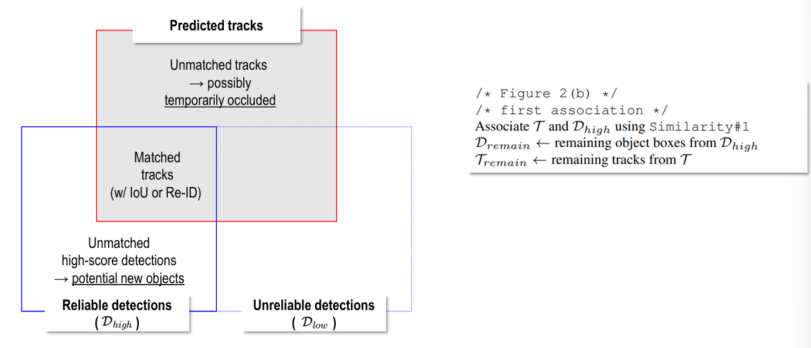

# Vision

## Day3

### Intro
- Evolution of Computer Vision
- 지도학습/비지도학습/ 등
- Background Knowledge -> image sensor 원리, 영상신호처리, 수학(행렬, 미분, 확률통계)

### Basic Architecture (DNN_CNN)

**DNN**

Perceptron -> MLP -> DNN -> Back-propagation
(Back-propagation 시 gradient가 대체로 0근처에 몰려있어서 gradient vanishing이 발생함
그래서 normalize가 필요함.)

logit과 prob은
sigmoid 들어가기 전이 logit, 들어가서 나온 output이 probability.
logit = 승산 = ln(odds), odds = p / (1 - p)

sigmoid function = 위에있는 식 logit식을 l과 p에 관해 정리하면
p = 1 / (1 + e^(-1))

dp/dl = p(1-p) (위 그림상 빨간 점선. 옆으로갈수록 미분값이 0에 가까워지기에 )

softmax 시 max-trick (만약, Output laye의 logit들이 다 크면, overflow남.)
-> m = max(Z_j)라는, logit값 중 가장 큰 값을 m으로 두고, 연산 시 e^(z_i - m)으로 두어 e^m을 미리나눠두기도.

BCE , CE(Cross Entropy)

**CNN**

Convolution (Mirroring -> Moving -> Multiplication -> Addition)
Cross-correlation은 미러링 없이. (사실 CNN은 correlation에 가까움, CNN에서 굳이 미러링을 할 필요가 없음.)

H * W를 줄인다 -> 내용을 압축하겠다.(이미지 크기? Activation map)
Kernel 수(C) 를 늘린다 -> 다양한 특징을 찾겠다.

Deformable Convolutional Networks -> 2017년 논문. 지금까지는 여러가지 조작은 했으나, 커널 자체가 정해진 정사각형 형태인건 안 고침
-> 3x3 커널을 정사가형 모양이 아닌, 여러가지 다른 모양으로 변형(aspect ratio & rotation)시켜서 어떤게 좋을지 학습시켜봄.

**VGGNET** (Very Deep Convolutional Networks for Large Scale Image Recognition)

!! Uniform 3x3 Conv
input 3,224,224
kernel로 3,3,3을 64개
-> 64,224,224 (제로패딩됨)
kernel로 64,3,3을 64개
-> 64,224,224
이후 맥스풀링 등 하면서 계속 3x3 커널 + 제로패딩만 수행

**ResNet** (Deep Residual Learning for Image Recognition)

학습해보니, 각 weight값 (혹은 계수)들이 작아야 좋더라. 조금씩 변해야 Loss landscape이 smooth하더라.
For H(x) = x , 일반적인 연결에서 W1 = W2 = I. But Skip connection에서는 W1 = W2 = 0

(일단, 가기 전 일반적으로 weight가 update될 때 Identitiy matrix로 가는건 잘 학습하지 못했음
-> 이유는 layer가 20개인 경우와 layer가 56개인 경우, I를 잘 학습했다면 layer가 56개라고해서 성능이 떨어질 일은 없었어야 함.)

-> Residual Connection을 하면
H(x) = F(x) + x. 작은값으로 구성된 파라미터를 학습하는 형태로 변함. 그냥 냅다 시키는 것보다는.
-> 0행렬에서 초기화되어 시작하더라도 괜찮음. 
So 기존 Loss landscape에 비해 smooth한 형태를 얻을 수 있어 학습이 용이함.(local minimum에 덜 빠짐)

> 일단, ResNet은 다시 찾아보기. why layer 56이 더 학습이 안되었는지? 
> How Residual을 더해준 게 어떤 영향을 준건지? 왜 weight값이 낮ㄴ은게 좋은지?(이건 smooth쪼일것같음.)
> layer56일때 Vanishing gradient가 아닌건지? 맞지않은지? 뭐 배치노말이랑 가중치초기화했다곤하지만?
> residual 더해줘서 weight값이 대체로 0에 가까운 낮은 값으로 보냈다했는데, 이러면 vanishing gradient가 발생할 확률이 더 높은 게 아닌지?
> (이건, 어차피 미분한값인 그 변화가 중요할 것 같긴한데, 그래도 작은 값에서 작은 값인거다보니.)

Conv Layer(Building block)으로 되어있는 것에서 그 다음레이어로 갈 때 input size가 다른데,
이럴 때 쓰는게 Bottleneck block(1x1 conv를 활용해 채널 맞춰주고, (H,W)는 Stride로 조절 가능)

> 각 Block의 역할에 대해 조금 더 봐야할 것 같음.(특히 1x1 conv. 채널간 정보합치는 건 알겠는데, 아, input size는 유지하면서 Kernel 수로 채널 수를 조정하고 싶을 때)
> Group Convolutioneh. Depthwise(separable)convolution도, Transposed convolution도.

### Attention

Vision에서는 Transformer에서 Encoder만 사용.

Encoder의 앞에서 인풋임베딩 + QKV만들때까지 -> Embedding Marix(W_E) 와 W_Q, W_K, W_V가 학습대상. 
QK^T 하고 softmax 때린거랑 V랑 matmul하는데, 여기서 softmax떄리면 QK^T 여기 애가 확률분포(PDF)가 되고
결국 보면 V행렬에서 V1행 V2행 ... Vn행에 weighted Sum을 하는 식. 
> QK^T는 사실상 내적이고, 내적이란 말은 similarity.

깊이방향으로 쌓는 Block과 Multihead는 더 다양한 문맥.너비방향. so themselves가 young, children 가리킬 수 있지만,
다른 Head에서는 solve와 problem을 보고있을 수 있음.

So-> 깊이 그리고 넓게 할 수 있어서 모든 단어가 다른 문맥으로도 생각해볼수있도록 확장할 수 있는 scalable한 구조.

**ViT**

An Image is worth 16x16 words
이미지를 16x16패치로 만들로 잘라놓고, 한 줄로 세운 후 flatten하고 linear projection 넘김.
얘랑 맨 왼쪽에 `*`라는 class 토큰도 두고, 각각에 pos embedding이랑 같이 넣어서 encoder 집어넣음.

Transformer 논문에서는 Post-Norm이였는데 ViT에선 Pre-Norm.
Encoder의 출력으로는 Class 토큰의 결과만을 사용함. Class토큰의 결과가 이미 나머지에 대해 attention을 했기에 정보를 알고있어서.

MSA(Multihead Self Attention)까지한 결과가 다시 (N+1, D)가 됨. 그렇기에 인코더는 본인의 입력과 출력의 사이즈가 동일해서 계속 이어나갈 수 있음.

이후 실험결과 보면, 데이터셋이 작을 땐 기존 CNN(BiT)보다 못하나, 데이터셋이 커졌을 땐 그래도 좋아짐.(완전 이기는 정도는 아님)

Pos embedding 도 알아서 잘 학습되더라, and Head들도 보면 layer가 얕은곳에서는 헤드간 좁은데부터 먼데까지 좀 다양하긴한데, 모델이 깊어지면서 참조(attention)하는 픽셀거리가 멀어짐.
즉, 모든 patch들을 다 attention을 하고있는 상황.
즉, layer가 쌓여갈수록 global attention이 되어가는 중.

> CNN은 kernel사이즈만 보면서 local하게 바라보면서 키워갔음. 물론 쌓여갈수록 넓은 영역을 바라보고는 있으나,
> Attention과는 구조가 좀 다르고 attention은 처음부터 모든 구조를 봄.

## Day4

### Variants of ViT

**DeiT**

Distillation -> Student & Teacher 데이터셋 작은 경우 CNN이 더 잘하기에 Teacher = CNN

-> Student Model의 input에 [CLS] 토큰과 더불어 distillation token을 추가하여 줌.

Soft Distillation : student의 CE와 student&teacher간 KL Divergence의 가중합

Hard Distillation : student의 CE와 student 확률분포,teacher의 정답간 CE를 평균
(Hard Distillation이 대체로 더 성능이 좋음.)

**Swin Transformer**

patch가 고정 크기로만 하니, 분류는 괜찮으나 다른 상황에서 성능이 별로더라.
-> Hierarchical하게 + Shifted windows(CNN때했던거) 를 잘 써보겠다.

window로 해보니, window간에는 서로 attention을 안 함.
-> Shifted된 window를 만들어서 그것에 대해서도 계산을 해봄. (각 윈도우간 경계부분들에 대한.)

Cyclic shift -> masking -> reverse cyclic shift [03.Attention 32pg]

**CLIP** (Contrastive Language-Image Pre-training)

이미지와 텍스트를 Connecting. labeled dataset 비싸고, 어려움.

N개의 Text, Image pair가 있을 때 둘 다 인코더 넣어서 d차원 벡터로 만든 후 matmul하여 NxN 만듦.
-> I1*T1 = 1번 Image와 Text vector의 내적이고, 둘은 유사도가 높아야 함. (cosien similarity)
-> 대각성분들의 값이 높음.

Inference에서는 `A photo of a {object}`라고 집어넣고, image 넣으면 `A photo of a dog`라고 나와야 함.  
-> 단순 label name이 아닌, natural caption style로. 

**DINO** Emerging Properties in Self-Supervised Vision Transformers

labelling 되지 않은 데이터이나, activation map을 보면 어느정도 object segmentations를 보임.

DIstillation with NO labels -> DINO -> Student, Teacher framework

Student는 Global views & Local views, Teacher는 Global views만.
> Global View는 이미지에서 50% 이상 영역을 의미.

Backbone은 layer 수 head 수 등 모두 동일한 ViT

EMA (Exponential Moving Average) 

EMA는 급격하게 변하는 파라미터를 안정화시켜줌.(학생도 변하고 선생도 변하여 parameter 요동 큼)
m은 대체로 매우 큰 값을 가지기에, teacher의 theta는 학생의 이전 값을 조금씩 참고하여 중심이 조금씩 변함.
(sg는 stop gradient로, teacher는 softmax한 결과로 gradient 업데이트 X. EMA로만)

Temperature도 다르게 사용. 학생은 0.1, 선생은 0.04로, teacher는 softmax 후 PMF가 sharp한 모양을 가지게 됨. 
student는 비교적 높은 값을 활용하여 smoothing하였고, -> collapse를 avoid

Output of ViT에 CLS token(384dim)이 있고 -> Logit vector(65,536)
여기서의 Class = semantic cluster. 

> Ch.3 까지 해선 Attention 매우 중요. 

---

## Applications

### Object Detection

IoU, Recall, Precision, FR Curve, AP, mAP 등

Object Detection은 크게 3가지로 분화됨. (1stage, 2stage, transformer)

One stage : speed에 중점. 그냥 바로 추론
Two stage : `Object proposal`을 두고 거기서 ㄱㄱ

**Two Stage Algorithm** [R-CNN]

Selective search 알고리즘으로 어디에 object가 있을 것 같은지 Object proposal을 줌.
-> Selective search는 color, texture, size, spatial등의 유사도를 계산함.
-> Hierarchical grouping. 이미지당 2천개정도 제안

-> Warped image regions = 각자 다른 proposal들을 모두 같은 크기로 (227x227) 변환
-> Warping된 영역에 대해 ConvNet 돌림. 

위 방법대로 하면, 겹쳐지는 Bbox도 많을 것이며, Object가 아닌 것도 있을 것.
-> Non-Maximum Suppression(NMS)로 Redundant boxes를 제거
-> Confidence score 내림차순, IoU계산하여 많이 겹치면 제거 (threshold 지정)

[Fast(er) R-CNN]

R-CNN이 학습시간과 1개쿼리에 약 50초로 매우 느림.
warping 연산 자체가 매우 느린데 2천개 다 하고, 2천개를 모두 각각 CNN을 통과시키며,또한 Selective Search가 CPU-bound.
-> 차라리 input자체를 CNN에 한번 넣어 input size를 줄이고, 거기서부터 Region proposal하자. 여기서도 warping이 아닌 max-pooling 후 FCs넣어서 결과 산출
기존 49초 -> 2.3초

CPU-bound인건 해결하지 못해서(Region proposal) 이걸 해결한게 [Faster R-CNN]
feature map 나온 거에서 Region Proposal Network 뽑음. CNN으로 또 Classification loss랑 Bbox Regression loss 구하는데,
그럼 같은 CNN이 또 쓰이냐 하기엔, R-CNN의 결과는 multi class classification이지만, RPN은 Object인지 아닌지만 보는 Binary classification

RPN에는 anchors가 나오는데, 하나의 포인트에 대해서 사전정의된 9개의 직사각형이 있음.  (모든 포인트를 다 찍진않고, 어느정도 stride는 있음. 논문에선 16)
의도는 Object의 형상이 꼭 정사각형 아닐텐데, 이 9개 후보군으로 Object냐 아니냐를 조금 더 잘 볼 수 있음.
영상크기가 800x600일 때, 800/16 * 600/16 = 1900개의 grid locations가 있고 그래서 anchors는 1900 * 9 = 17100개.

RPN의 최종 결과는 binary classification(Object vs Background) 과 bounding Box regression(anchor box coordinate refinement)

[CenterNet]

two stage든 one stage든, 앵커박스 너무 많음. 하이퍼파라미터튜니암ㄶ이해야함. 복잡함. 
-> Object일 것 같은 포인트잡기(anchor 없이.) 근데 오브젝트 가운데의 점을 잘 찾기. center heatmap, local offset, object size(w,h)를 추론.

[DETR] 2020 
End to End Object Detection with Transformers  
> ViT는 2021. ViT보다 빨리 나옴.

set prediction problem을 해겨해서 한번에 e2e로 풀어내겠다. NMS나 앵커같은거 안 쓰고.

patch안하고 바로 input을 바로 CNN에 넣음. 그렇게 얻은 feature를 pos encoding이랑 같이 넣어 encoder -> decoder -> prediction heads에서 FFN으로해서 class box, 등등
decoder에서 Object queries가 있음. 얘가 maximum으로 찾을 수 있는 Object 수 = Object queries 수. 즉, 1개의 Object Query당 1개의 Object 찾음.. 논문상에서는 4개로.

-> 2개의 Object만 찾으면 진짜 no object라고 나옴. 

IoU vs GIoU 
IoU는 교집합이 없더라도, 아주 조금 벗어난거랑, 아주 멀리 떨어진거랑 똑같이 0임.
GIoU는 이것을 좀 고려하겠다는 것. 우선, A, B 박스를 포함하는 큰 직사각형 만든 후(C) 이 전체영역(C)에서 A와 B 합친걸 뺌.
GIoU = IoU - ( C - (A+B) ) / C. 즉, A,B를 아우르는 전체박스에서 비어있는 영역이 얼마나 많은가?를 봄. 빈 곳이 클수록(멀수록) GIoU 낮음.

DETR에서 Encoder는 Obejct의 대략적인 위치를 알려주는 Attention map이 나오고, Decoder의 attention에서는 BBOX의 테두리정도가 잘 잡힘. (활성화됨)

### Tracking

[ByteTrack]

기존 detect하다가 ID 놓치는 경우들 보니, 사람이 약간 부분적으로 보일 때 confidence가 낮아지면서 놓침. (Threshold아래로)
-> Association이 놓침. 이 문제를 해결하기 위한 게 ByteTrack

input으로는 Video sequence V, 디텍터 Det, detection score threshold t가 들어감.
결과는Tracks T of the video.

Detection했을 때 d.score가 t보다 크면 D high로, 낮으면 low로. (set에 넣음)
이후 칼만필터 씌움
(track하고있는 이전까지의 object 정보가 있을 때 현재 어디에 있는지?)

그림에서 predicted과 D_high의 교집합은 이미 있었고 잘 트래킹하는 것. Dhigh이지만 나머지애들은 새로 생긴 것.
unmatched tracks는 가리거나 해서 잠깐 안 보이는 애들.(conf자체도없음 Det가 찾지못함. 가렸을듯 나갔거나)

D_low와 Predicted 겹친 애들은 conf가 좀 낮아진 애. 부분적으로 보이거나 블러해진애들. 이런 애들을 잡아낸 (Survived tracks가 이 모델의 핵심)
track 안했고, D_low에 있는 애들은 잘못잡은애.(background clutter) 근야 빼버리면 됨.

Tracing에서 골치 중에도 Unmatched tracks. 기존에는 있었으나 Detector가 찾지도 못한 애는 어떡하지? 
-> 몇초동안 기다리겠다.라는 느낌으로 보유하고있어야함. 얼마동안 기다려줄까?도 threshold.

> 비슷한 형태의 사람이 사라진위치에서 다시 나오면 ID Switch할 수 있음. 이걸 잡기위해 appearnce까지 보는 게 SORT

[TrackFormer]

DETR과 동일함. 다른 점은 다음 이미지에서 이전 결과의 3개 쿼리(논문상 4개중3개잡힘)를 다음에 넣어주고, 그러고나서 또 추ㅏ적인 query들 남아있음. (아마 4개정도를 여유로 두게 잡아둔듯.)
-> 만약 또 1개 더 생겨서 7개쿼리중 4개찾음. 그 다음에 4개를 건내줌. 
-> 근데 만약 4개 중 1개를 놓치고 3개만 나왔다? 그럼 사라진 1개는 짧은 시간동안 갖고 유지.
즉, DETR인데, 다음 시퀀스에 넘겨주는 게 차이.

Track augmentation이라는 것도 나옴.

03_DETR 실습은 13번까지만 나옴. 

`probas = outputs['pred_logits'].softmax(-1)[0, :, :-1]  # 쿼리별 클래스 확률 계산(no-object 제외): shape=(num_queries,num_classes)`

softmax(-1)은 마지막 차원인데, 그 뒤에 [0, :, :-1]에서 맨 뒤가 -1인 이유?
-> pred_logits는 배치, 쿼리, 클래스인데, 클래스 마지막번호가 no-object임.

내부 텐서 추출 시 사용하는 forward hook도 중요. 어떤 layer에 걸었는지에 따라 텐서 의미 다름.
논문에서는 backbone CNN 특징맵, encoder layer 마지막에서 self-attention, decoder layer 마지막에서 cross-attention
`.register_forward_hook`

### Segmentation

mIoU = Mean IoU 클래스별로 IoU한거. Object Detection과 비슷

[FCN] Semantic Segmentation에 CNN을 도입

FFN 없이 Fully Convolution Network. pooling 5번 거치기에 1/32로 줄어들었으나, 
결국 정답으로는 다시 원본이미지만큼 만들어놔야함. -> 32배로 만듦.
-> 억지로 늘린거라 rough한 edge 정보들만 있고, 세밀한 정보 적음.
-> pool5를 2배하면 pool4와 동일한 크기인데 이걸 합쳐서 또 16배 높여서 원본이미지크기로 만듦.
-> 위에서 합치고 뻥튀기하기 전에걸 pool3와 합쳐서 또 8배하는 식으로.

-> 8배 업샘플된 결과를 가져 segmentation했다. -> 뭉개진 그림에서 좀 나아짐.

so 기존 CNN에서 뒷부분을 FCN이 아닌, CNN으로 모두 다 사용함.
결과를 보면 heatmap과 같은 output으로 나오게 되며, 특정확률값이상이면 tabby cat으로 하는 식으로.

[Mask R-CNN]
Faster R-CNN + FCN -> Mask R-CNN (instance segmentation)

[U-Net] 2015논문. Architecture관점 좋음. CNN for Biomedical Image Segmentation

여기서 Skip conntection은 ResNet과 다름. 압축중인 feature를 팽창중인 feature에 concat시킴.
패딩을 안 한 이유? only valid convolutions. 즉, padding을 해서 없는 데이터를 갖고하면 edge쪽에서 오염된 결과가 나온다고 봄.
의료 영상이기에. (종양이 꼭 가운데에 있지 않고, edge쪽에도 있을 수 있는데 패딩 시 오염될 수 있음. feature map이 줄어들지언정 padding ㄴㄴ)

Spatial 정보를 살리기 위해 Skip connection이 있음. 

[Seg-Former] Simple and Efficient Design for Semantic Segmentation with Transformers

Patch를 자를 때 Overlap해서 자름. and CNN처럼 점점 feature map 사이즈를 작아지면서 감. 
Encoder에서 Decoder로 갈 때 MLP에서 이미지를 다시 H/4 W/4로 만들고 채널을 4C로 고정시킴.

Efficient한 이유? 기존 Transformer에서는 N(# of patches)에 대해 O(N^2)였음.
-> O(N^2/R)이 됨. (기존에는 Q는 (N,C), K가 (N/R, C)가 됨.)

Positional Embedding이 없음. why?
zero padding이 위치정보를 주고있다. (2020년 나온 논문 중 있음. feature map에 zero padding 하면서 ㄱ ㄴ 모양을 보고 어느정도 위치정보를 줄 수 있게 됨.)

[SAM] Segment Anything(2023)

Promptable segmentation. 

점 찍거나, 사각형 그리거나, 대충 자유형 도형을 그리거나, 텍스트로 써서 주면 -> 입력 이미지에 valid mask 그려줌.

