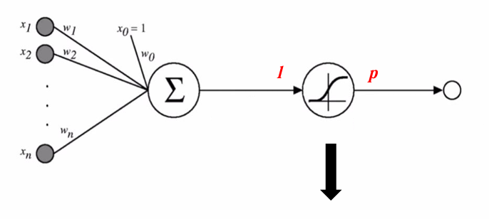
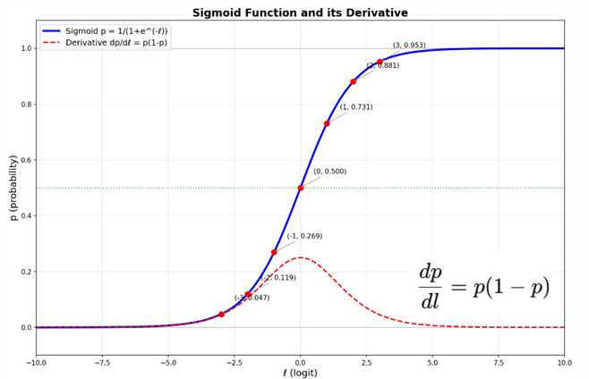
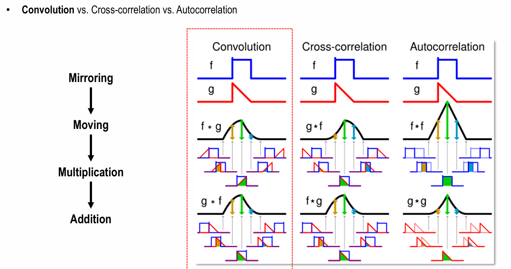

# Vision

## Day1

### Intro
- Evolution of Computer Vision
- 지도학습/비지도학습/ 등
- Background Knowledge -> image sensor 원리, 영상신호처리, 수학(행렬, 미분, 확률통계)

### Basic Architecture (DNN_CNN)

**DNN**

Perceptron -> MLP -> DNN -> Back-propagation
(Back-propagation 시 gradient가 대체로 0근처에 몰려있어서 gradient vanishing이 발생함
그래서 normalize가 필요함.)

logit과 prob은
sigmoid 들어가기 전이 logit, 들어가서 나온 output이 probability.
logit = 승산 = ln(odds), odds = p / (1 - p)

sigmoid function = 위에있는 식 logit식을 l과 p에 관해 정리하면
p = 1 / (1 + e^(-1))

dp/dl = p(1-p) (위 그림상 빨간 점선. 옆으로갈수록 미분값이 0에 가까워지기에 )

softmax 시 max-trick (만약, Output laye의 logit들이 다 크면, overflow남.)
-> m = max(Z_j)라는, logit값 중 가장 큰 값을 m으로 두고, 연산 시 e^(z_i - m)으로 두어 e^m을 미리나눠두기도.

BCE , CE(Cross Entropy)

**CNN**

Convolution (Mirroring -> Moving -> Multiplication -> Addition)
Cross-correlation은 미러링 없이. (사실 CNN은 correlation에 가까움, CNN에서 굳이 미러링을 할 필요가 없음.)

H * W를 줄인다 -> 내용을 압축하겠다.(이미지 크기? Activation map)
Kernel 수(C) 를 늘린다 -> 다양한 특징을 찾겠다.

Deformable Convolutional Networks -> 2017년 논문. 지금까지는 여러가지 조작은 했으나, 커널 자체가 정해진 정사각형 형태인건 안 고침
-> 3x3 커널을 정사가형 모양이 아닌, 여러가지 다른 모양으로 변형(aspect ratio & rotation)시켜서 어떤게 좋을지 학습시켜봄.

**VGGNET** (Very Deep Convolutional Networks for Large Scale Image Recognition)

!! Uniform 3x3 Conv
input 3,224,224
kernel로 3,3,3을 64개
-> 64,224,224 (제로패딩됨)
kernel로 64,3,3을 64개
-> 64,224,224
이후 맥스풀링 등 하면서 계속 3x3 커널 + 제로패딩만 수행

**ResNet** (Deep Residual Learning for Image Recognition)

학습해보니, 각 weight값 (혹은 계수)들이 작아야 좋더라. 조금씩 변해야 Loss landscape이 smooth하더라.
For H(x) = x , 일반적인 연결에서 W1 = W2 = I. But Skip connection에서는 W1 = W2 = 0

(일단, 가기 전 일반적으로 weight가 update될 때 Identitiy matrix로 가는건 잘 학습하지 못했음
-> 이유는 layer가 20개인 경우와 layer가 56개인 경우, I를 잘 학습했다면 layer가 56개라고해서 성능이 떨어질 일은 없었어야 함.)

-> Residual Connection을 하면
H(x) = F(x) + x. 작은값으로 구성된 파라미터를 학습하는 형태로 변함. 그냥 냅다 시키는 것보다는.
-> 0행렬에서 초기화되어 시작하더라도 괜찮음. 
So 기존 Loss landscape에 비해 smooth한 형태를 얻을 수 있어 학습이 용이함.(local minimum에 덜 빠짐)

> 일단, ResNet은 다시 찾아보기. why layer 56이 더 학습이 안되었는지? 
> How Residual을 더해준 게 어떤 영향을 준건지? 왜 weight값이 낮ㄴ은게 좋은지?(이건 smooth쪼일것같음.)
> layer56일때 Vanishing gradient가 아닌건지? 맞지않은지? 뭐 배치노말이랑 가중치초기화했다곤하지만?
> residual 더해줘서 weight값이 대체로 0에 가까운 낮은 값으로 보냈다했는데, 이러면 vanishing gradient가 발생할 확률이 더 높은 게 아닌지?
> (이건, 어차피 미분한값인 그 변화가 중요할 것 같긴한데, 그래도 작은 값에서 작은 값인거다보니.)

Conv Layer(Building block)으로 되어있는 것에서 그 다음레이어로 갈 때 input size가 다른데,
이럴 때 쓰는게 Bottleneck block(1x1 conv를 활용해 채널 맞춰주고, (H,W)는 Stride로 조절 가능)

> 각 Block의 역할에 대해 조금 더 봐야할 것 같음.(특히 1x1 conv. 채널간 정보합치는 건 알겠는데,)
> Group Convolutioneh. Depthwise(separable)convolution도, Transposed convolution도.

