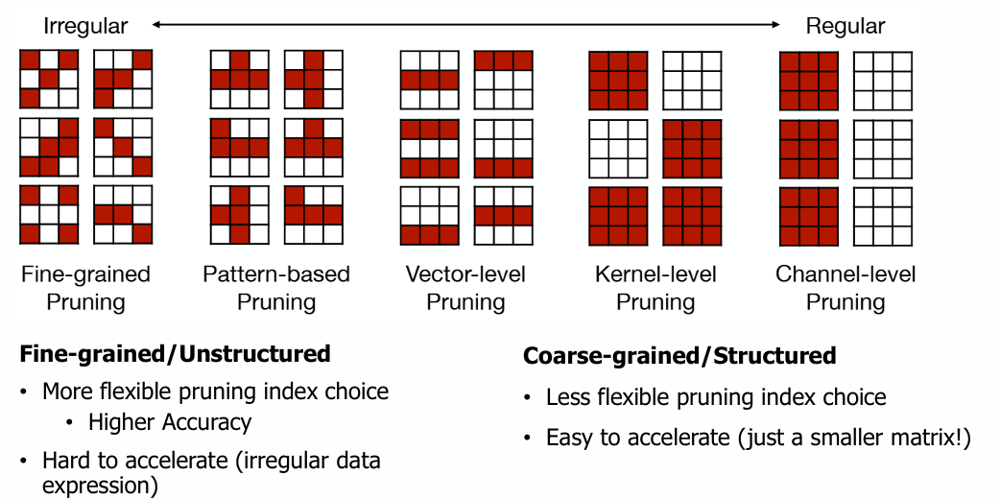
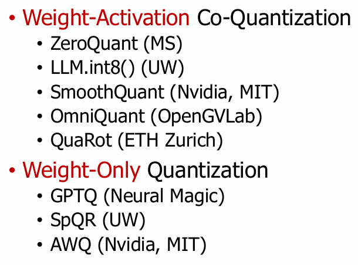

# On-Device AI

OnDevice AI -> Network Pruning -> Quantization -> Knowledge Distillation

DL 모델 개요
Cloud AI vs. On-Device AI
sLLM, Llama.cpp, MLC-LLM, ExecuTorch 등 LLM engine

## Pruning

Network의 Redundancy를 줄이기. 
그냥 프루닝 -> 많이 잘랐을 떄 성능 감소 보임 -> 프루닝 후 파인튜닝
conv layer는 대체로 파라미터가 원래 많지 않기에 조금만 프루닝해도 성능 감소
but, FC Layer는 Redundancy가 많아 Pruning했을 때 효과도 좋음.
+ Regularization도 추가하여 pruning 시 더욱 압축률을 높게 가져갈 수 있음.

### Design choid of Pruning
그럼 프루닝은 어떻게 할 것인가?
- Granularity/Pattern
- Criterion
- Ratio
- Fine-tuning after Pruning or Training Pruned Neural Network?

Range Mapping and Clipping
Clipping을 통해 min~max(256)일 때 그냥 -5~5로 만들고, 256은 5처럼 취급하는 식. clipping.
이게 CNN일 때는 크게 문제 없었음. 256이 큰 값이고, 결과에 영향을 많이 주는 Weight인 것은 맞으나, 
clipped된 값도 크기에 크게 문제가 없었음.
But, LLM에서는 그렇지 않음. 정확도가 많이 깨짐.

**Quantization-Aware Training**

학습 중 Quantization이 되어있으면, backpropagation으로 weight값이 변하더라도, 다시 양자화 시 동일한 weight로 유지되는 문제가 있음.
이로 인해 weight quantization이라는 Q(W)값을 두고 얘가 계산 다 한 후, 실제 weights(fp32)에 반영해두어 계속 누적이 되다보면 결국 값이 바뀜.

And
Backpropagate할 때 미분값이 필요한데, 양자화되어있으면 Step function처럼 되어있어 미분불가능
-> STE(straight through estimator)기법을 두어, forward는 step으로 가는 것이 맞으나, backword로 할 땐 선형으로 가정하고 계산함.

approximation for nonlinear OPs.
softmax때문에 fp32연산이 필요함. (int로는 안되니) -> GELU나 그런걸 활용해서 그나해서 쓸 수 있지 않을까? 
-> I-BERT (Integer-only BERT Quantization (ICML'21))

But, powerful한건 Simulated quantization 중, QK Matmul은 하고나서 Softmx가기전에 dequant, quantize 하고 QV Matmul
(NPU같은 곳에서는 이런거 많이 씀.)

## Distillation

pg95. Forward (mode-covering. CNN) & Reverse (mode-seeking. LLM)
CNN은 Class가 많지 않으나, LLM은 vocab_size가 크기에 forward를 쓰면 어중간한 답이 나오는데, reverse할 경우가 더 적절함.
(하나만 쓰기보다, 둘 다 쓰는 JS Divergence도 있음.)

## Post-Training Quantization(PTQ)

Weight만 Q할것인가, Activation도 같이 Quantization할 것인가?
and, Activation은 Outlier가 많은데, 이건 어떻게 핵려할지?

**SmoothQuant**

Activation은 Outlier가 많아 quantize하기 힘듦.
-> WA니깐 W에는 Scale을 곱해주고, A에는 Scale로 나눔.
-> Activation을 S로 나눠 Smoothing되어 quantize하기 쉬워짐.
-> Weight는 S로 곱해 뾰족해졌으나, 원래 좀 균등해서 어렵지 않음.

-> Activation의 quantize 난이도가 weight쪽으로 넘어갔다

Weight-Only Quantization

W8A8까지는 Activation 내려도 정확도 괜찮은데, 그 밑에까지 하니 정확도가 깨짐.
근데 메모리에 올라가는 거 보면 Weight의 비중이 훨씬 큼.
Weight만 4bit로, Activation은 16bit로 두면 연산자체야 weight도 다시 16비트로 올려서 연산해야하기에
연산속도 이점은 적으나, 메모리 트래픽이 줄어들어 효과가 좋음.
-> W4A16. GPTQ ran OPT-175B를 A100 1대애ㅔ.

RTN = Rounding to Nearest. 단순 PTQ (baseline느낌)

