# 1-ts-basics

Source: `1-ts-basics.pdf`

Pages: 37

## Page 1

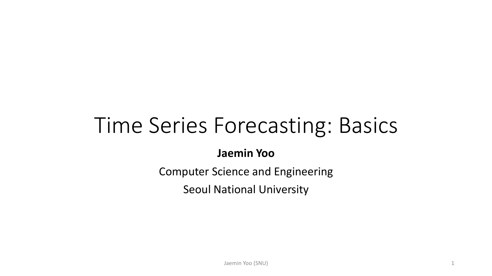

### OCR
- Time Series Forecasting: Basics
- Jaemin Yoo
- Computer Science and Engineering
- Seoul National University
- Jaemin Yoo (SNU)

## Page 2

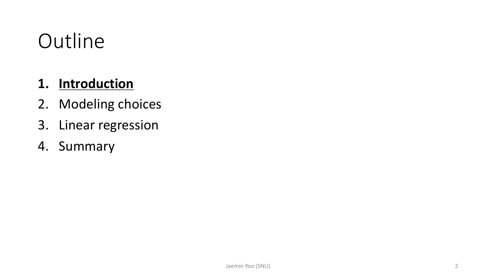

### OCR
- Outline
- Introduction
- 1.
- Modeling choices
- 2.
- 3. Linear regression
- 4. Summary
- Jaemin Yoo (SNU)

## Page 3

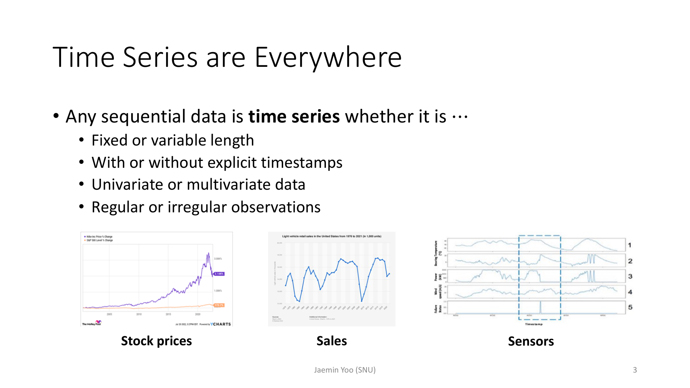

### OCR
- Time Series are Everywhere
- · Any sequential data is time series whether it is ·..
- Fixed or variable length
- With or without explicit timestamps
- Univariate or multivariate data
- Regular or irregular observations
- Nike lnc: Price % Change
- SSP S00 Level % Char
- Sales
- Sensors
- Stock prices
- Jaemin Yoo (SNU)

## Page 4

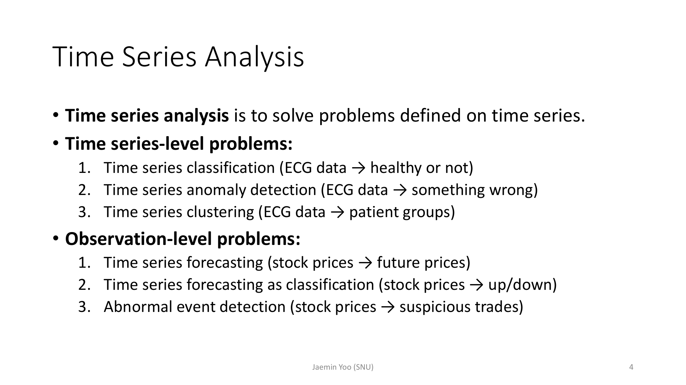

### OCR
- Time Series Analysis
- · Time series analysis is to solve problems defined on time series.
- · Time series-level problems:
- 1. Time series classification (ECG data → healthy or not)
- 2. Time series anomaly detection (ECG data → something wrong)
- 3. Time series clustering (ECG data → patient groups)
- · Observation-level problems:
- 1. Time series forecasting (stock prices → future prices)
- 2. Time series forecasting as classification (stock prices → up/down)
- 3. Abnormal event detection (stock prices → suspicious trades)
- Jaemin Yoo (SNU)

## Page 5

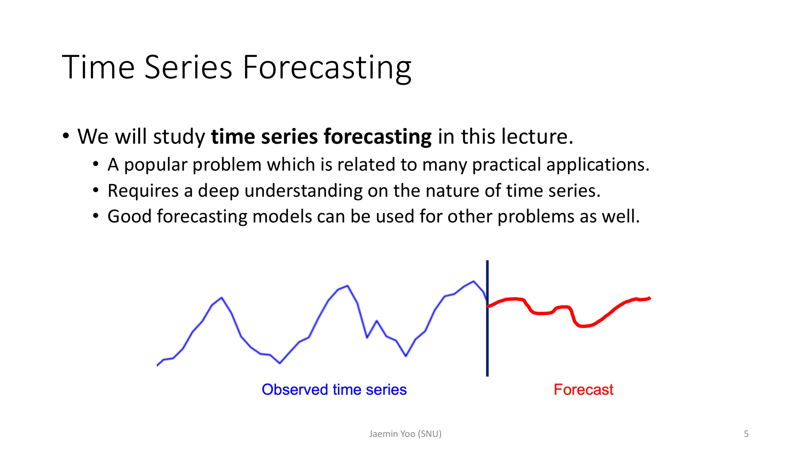

### OCR
- Time Series Forecasting
- · We will study time series forecasting in this lecture.
- · A popular problem which is related to many practical applications.
- Requires a deep understanding on the nature of time series.
- Good forecasting models can be used for other problems as well.
- Observedtimeseries
- Forecast
- JaeminYoo(SNU)

## Page 6

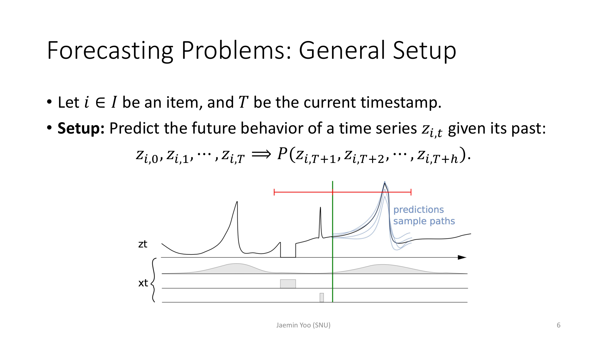

### OCR
- Forecasting Problems: General Setup
- · Let i E I be an item, and T be the current timestamp.
- · Setup: Predict the future behavior of a time series Zi,t given its past:
- Zi,o, Zi,1,..·,Zi,T → P(Zi,T+1, Zi,T+2,.·,Zi,T+h).
- predictions
- sample paths
- zt
- xt
- Jaemin Yoo (SNU)

## Page 7

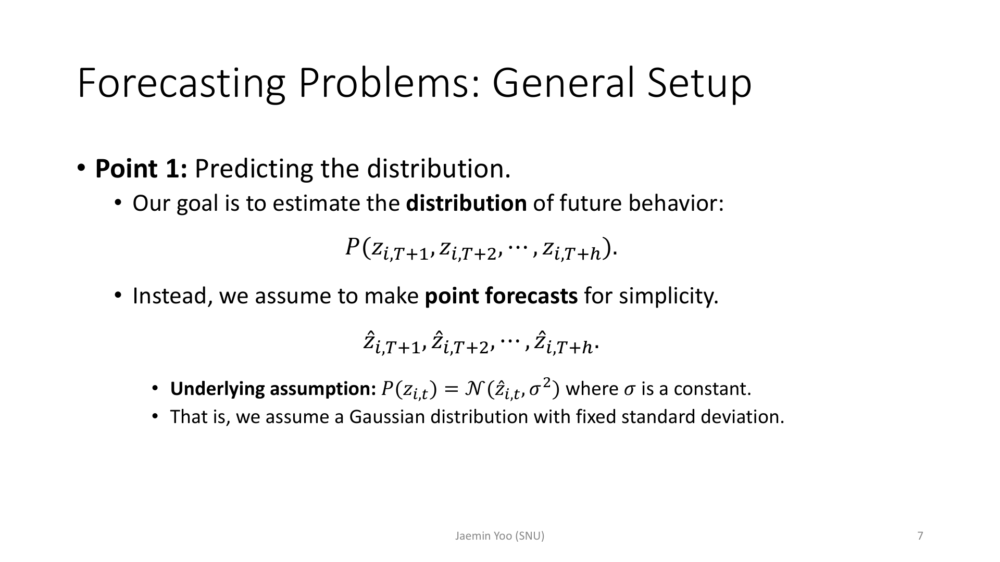

### OCR
- Forecasting Problems: General Setup
- · Point 1: Predicting the distribution.
- · Our goal is to estimate the distribution of future behavior:
- P(Zi,T+1,Zi,T+2,..,Zi,T+h).
- · Instead, we assume to make point forecasts for simplicity.
- Zi,T+1,Zi,T+2,..,Zi,T+h·
- · Underlying assumption: P(zi,t) = N(Zi,t, o?) where o is a constant.
- · That is, we assume a Gaussian distribution with fixed standard deviation.
- Jaemin Yoo (SNU)

## Page 8

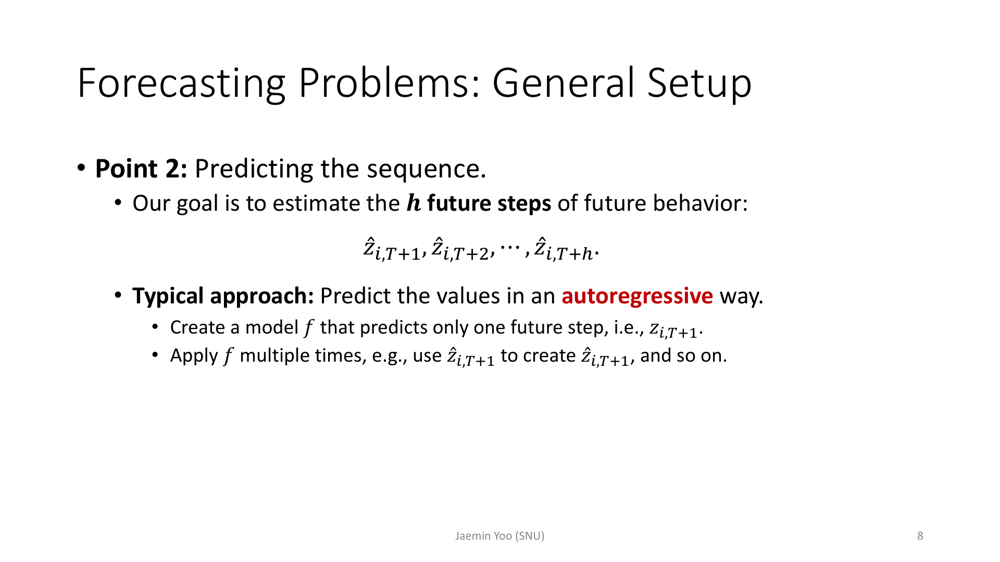

### OCR
- Forecasting Problems: General Setup
- · Point 2: Predicting the sequence.
- · Our goal is to estimate the h future steps of future behavior:
- Zi,T+1, Zi,T+2,..·,Zi,T+h·
- · Typical approach: Predict the values in an autoregressive way.
- · Create a model f that predicts only one future step, i.e., Zi,T+1.
- · Apply f multiple times, e.g., use Zi,T+1 to create Zi,T+1, and so on.
- Jaemin Yoo (SNU)

## Page 9

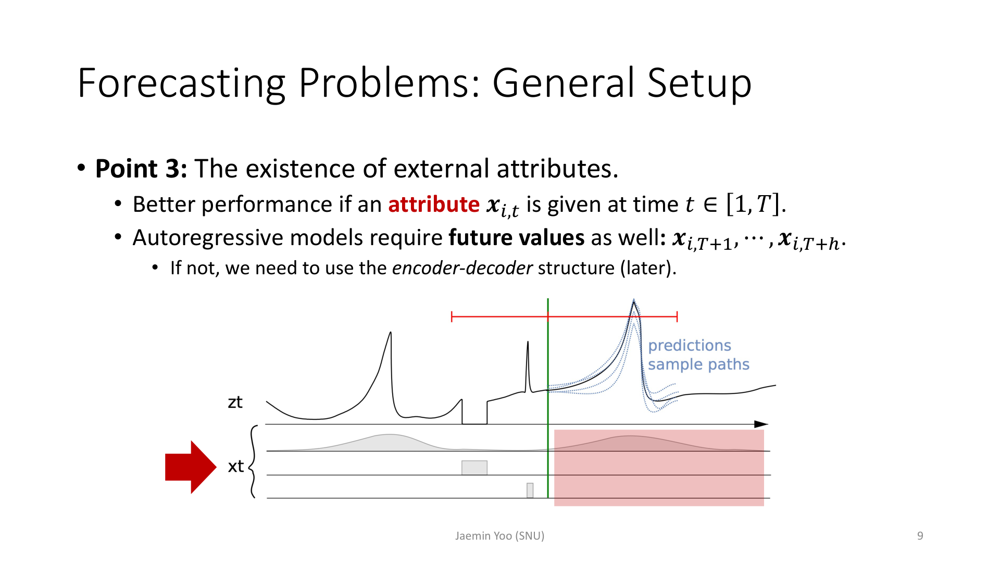

### OCR
- Forecasting Problems: General Setup
- · Point 3: The existence of external attributes.
- · Better performance if an attribute xi,t is given at time t E [1, T].
- · Autoregressive models require future values as well: xi,T+1, " ,Xi,T+h.
- · If not, we need to use the encoder-decoder structure (later).
- predictions
- sample paths
- zt
- xt
- Jaemin Yoo (SNU)

## Page 10

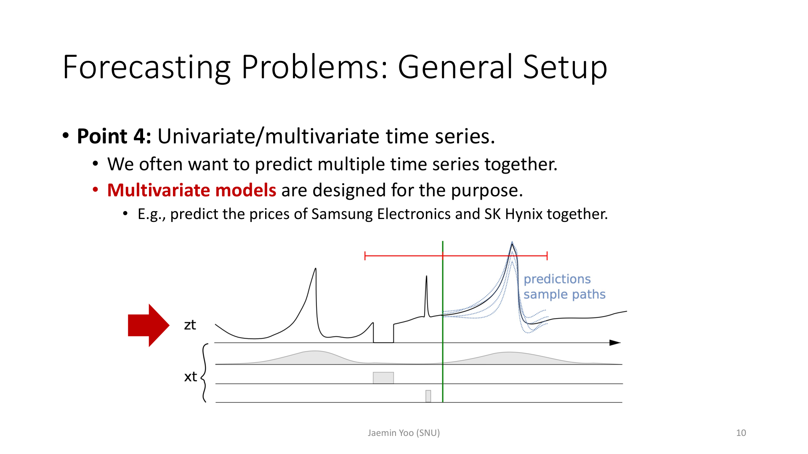

### OCR
- Forecasting Problems: General Setup
- · Point 4: Univariate/multivariate time series.
- We often want to predict multiple time series together.
- Multivariate models are designed for the purpose.
- · E.g., predict the prices of Samsung Electronics and SK Hynix together.
- predictions
- sample paths
- zt
- xt
- Jaemin Yoo (SNU)
- 10

## Page 11

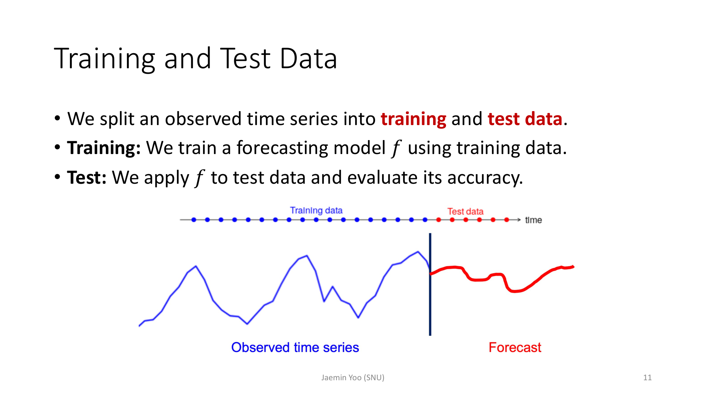

### OCR
- Training and Test Data
- · We split an observed time series into training and test data.
- Training: We train a forecasting model f using training data.
- · Test: We apply f to test data and evaluate its accuracy.
- Training data
- Testdata
- time
- Forecast
- Observedtimeseries
- Jaemin Yoo (SNU)
- 11

## Page 12

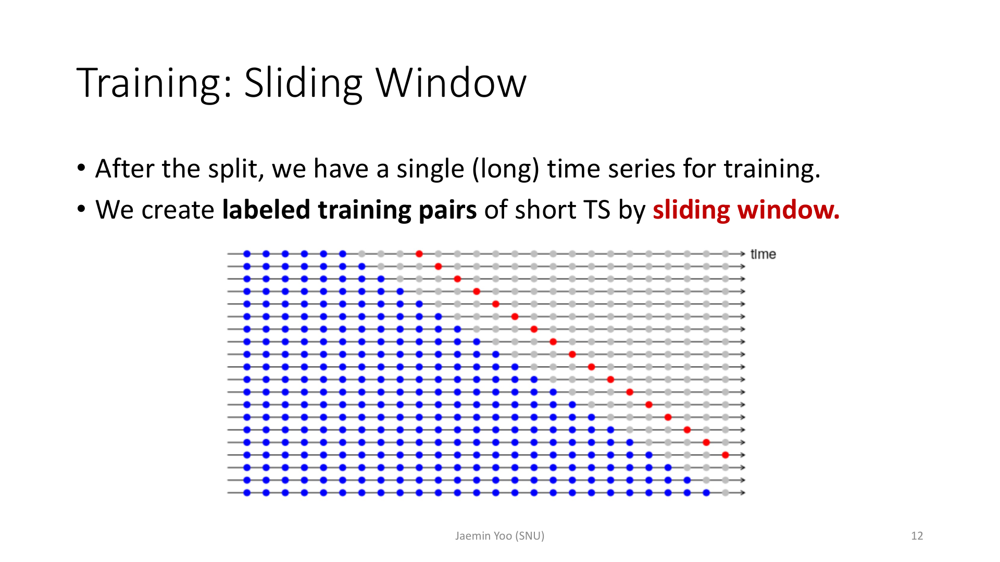

### OCR
- Training: Sliding Window
- · After the split, we have a single (long) time series for training.
- We create labeled training pairs of short TS by sliding window.
- me
- JaeminYoo(SNU)

## Page 13

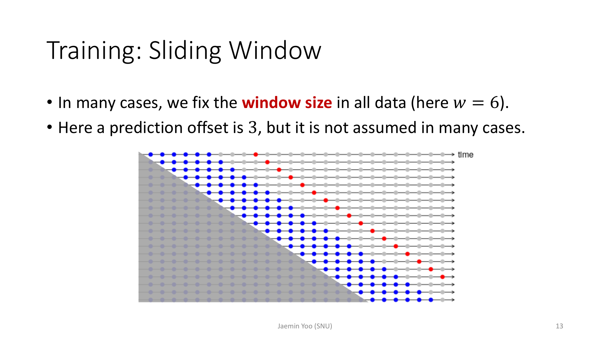

### OCR
- Training: Sliding Window
- In many cases, we fix the window size in all data (here w = 6).
- Here a prediction offset is 3, but it is not assumed in many cases.
- fime
- JaeminYoo(SNU)
- 13

## Page 14

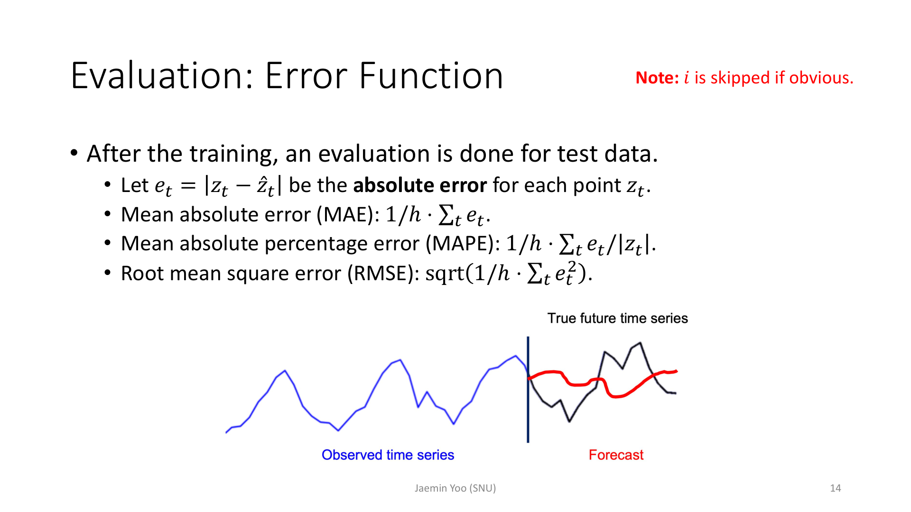

### OCR
- Evaluation: Error Function
- Note: i is skipped if obvious.
- · After the training, an evaluation is done for test data.
- · Let et = IZt - Ztl be the absolute error for each point Zt.
- Mean absolute error (MAE): 1/h · Zt ét.
- Mean absolute percentage error (MAPE): 1/h · Zt et/lztl.
- Root mean square error (RMSE): sqrt(1/h · Zt e?).
- True future time series
- Forecast
- Observed time series
- Jaemin Yoo (SNU)
- 14

## Page 15

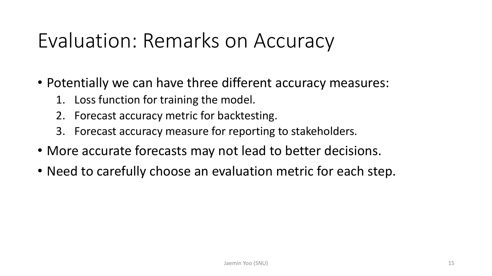

### OCR
- Evaluation: Remarks on Accuracy
- · Potentially we can have three different accuracy measures:
- 1. Loss function for training the model.
- 2. Forecast accuracy metric for backtesting.
- 3. Forecast accuracy measure for reporting to stakeholders.
- · More accurate forecasts may not lead to better decisions.
- · Need to carefully choose an evaluation metric for each step.
- Jaemin Yoo (SNU)
- 15

## Page 16

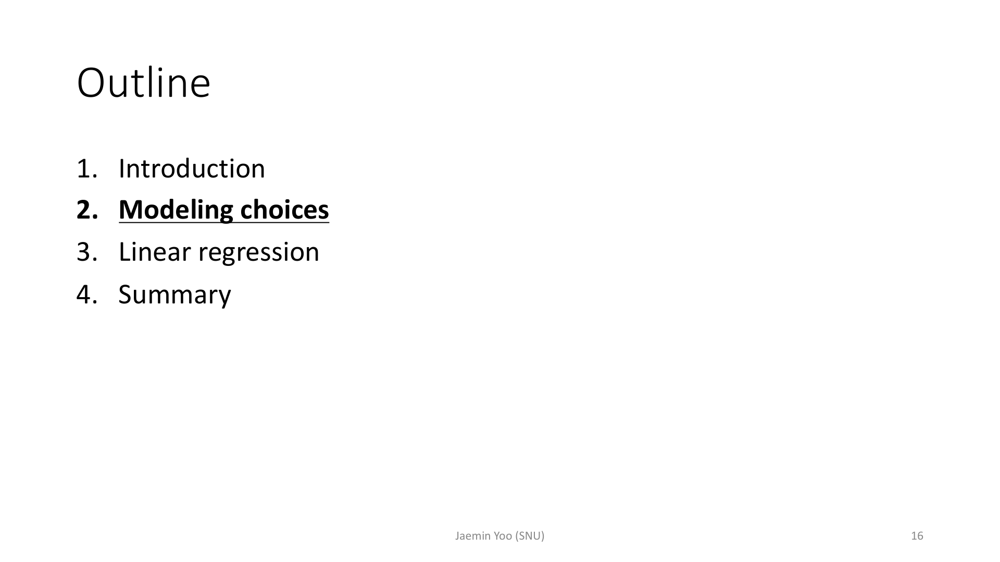

### OCR
- Outline
- 1. Introduction
- Modeling choices
- 2.
- 3. Linear regression
- 4. Summary
- Jaemin Yoo (SNU)
- 16

## Page 17

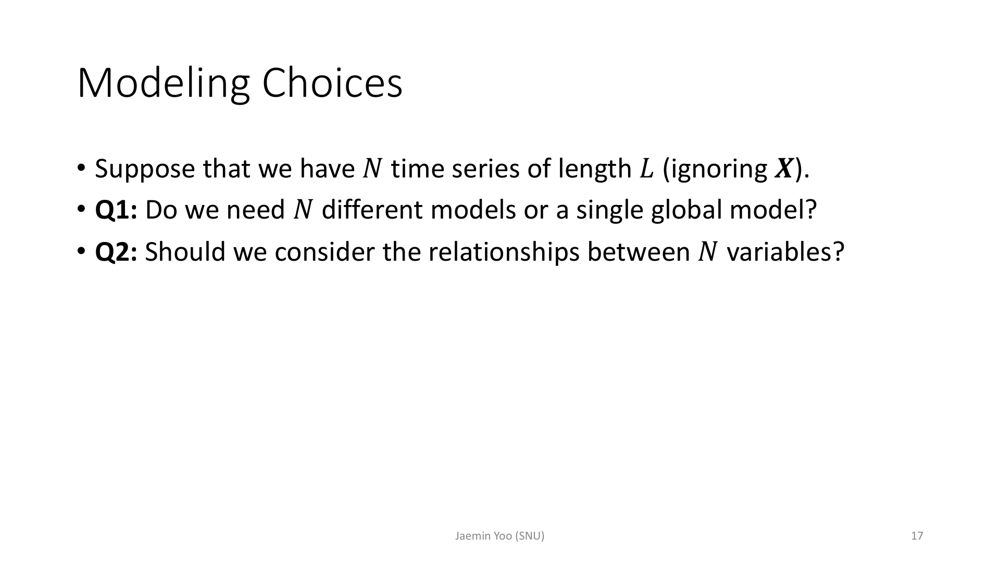

### OCR
- Modeling Choices
- · Suppose that we have N time series of length L (ignoring X).
- · Q2: Should we consider the relationships between N variables?
- Jaemin Yoo (SNU)

## Page 18

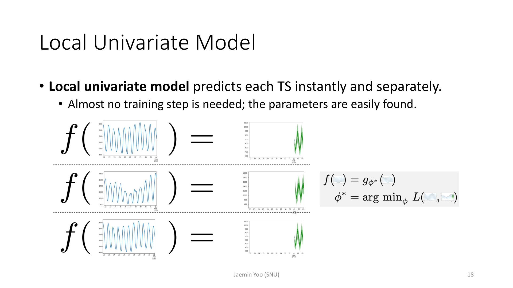

### OCR
- Local Univariate Model
- · Local univariate model predicts each Ts instantly and separately.
- Almost no training step is needed; the parameters are easily found.
- f(
- f() = g*()
- = arg minL(am,m
- D
- JaeminYoo (SNU)
- 18

## Page 19

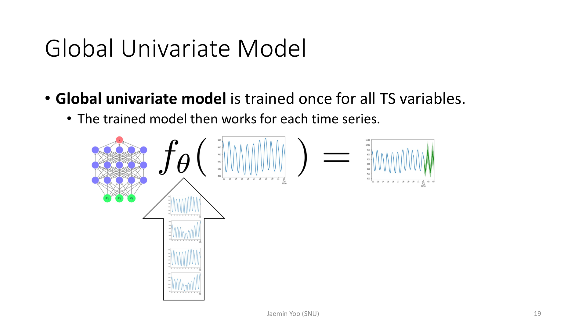

### OCR
- Global Univariate Model
- · Global univariate model is trained once for all TS variables.
- The trained model then works for each time series.
- JaeminYoo (SNU)
- 19

## Page 20

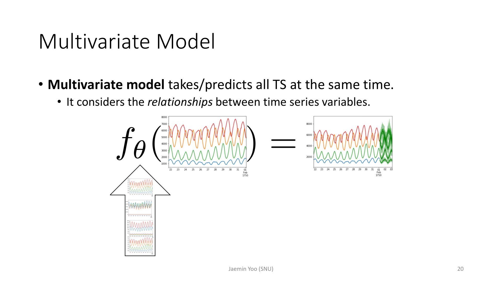

### OCR
- Multivariate Model
- Multivariate model takes/predicts all TS at the same time.
- · It considers the relationships between time series variables.
- 0000
- fo
- 6000
- 6000
- 5000
- 4000
- 4000
- 3000
- 2000
- 2000
- 1000
- 282930
- et
- 1750
- 750
- 00
- WWW
- JaeminYoo(SNU)
- 20

## Page 21

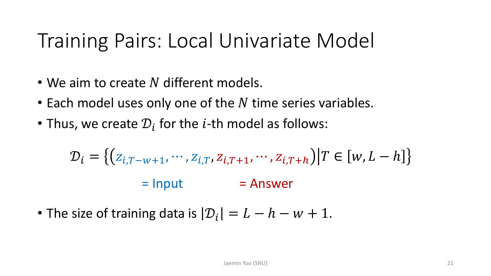

### OCR
- Training Pairs: Local Univariate Model
- · We aim to create N different models.
- · Each model uses only one of the N time series variables.
- · Thus, we create D; for the i-th model as follows:
- Di = {(Zi,T-w+1,….,Zi,r,Zi,T+1...,Zi,T+n)|T ∈ [w,L - h]}
- = Input
- = Answer
- · The size of training data is |D;l = L - h - w + 1.
- Jaemin Yoo (SNU)
- 21

## Page 22

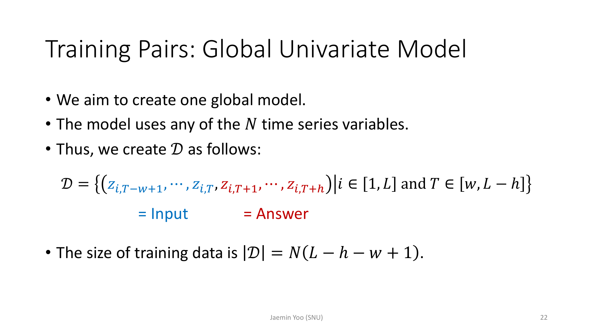

### OCR
- Training Pairs: Global Univariate Model
- · We aim to create one global model.
- · The model uses any of the N time series variables.
- · Thus, we create D as follows:
- D = {(Zi,r-w+1,,Zi,r,Zi,r+1.".,Zi,r+h)li E [1,L] and T E [w,L - h]}
- = Answer
- = Input
- · The size of training data is |D| = N(L - h - w + 1).
- Jaemin Yoo (SNU)
- 22

## Page 23

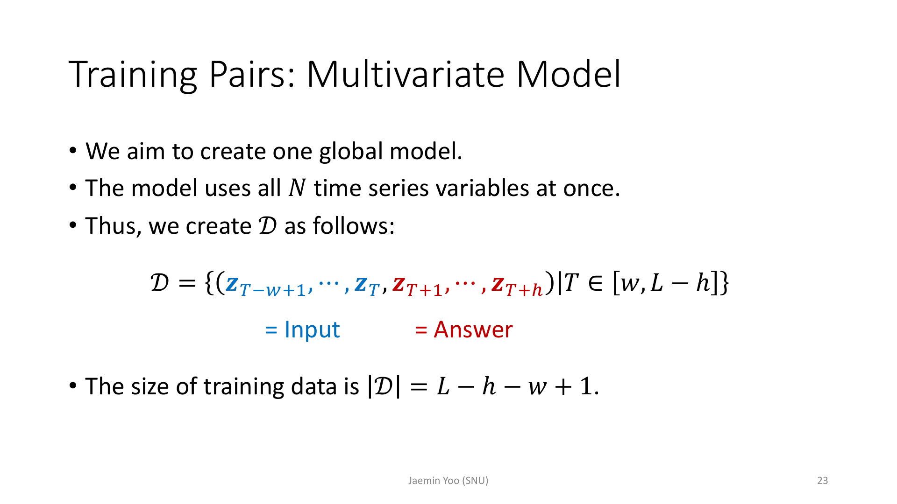

### OCR
- Training Pairs: Multivariate Model
- · We aim to create one global model.
- · The model uses all N time series variables at once.
- · Thus, we create D as follows:
- D = {(ZT-w+1,.,ZT,ZT+1,….,ZT+h)IT ∈[w,L - h]}
- = Answer
- = Input
- · The size of training data is [D| = L - h - w + 1.
- Jaemin Yoo (SNU)
- 23

## Page 24

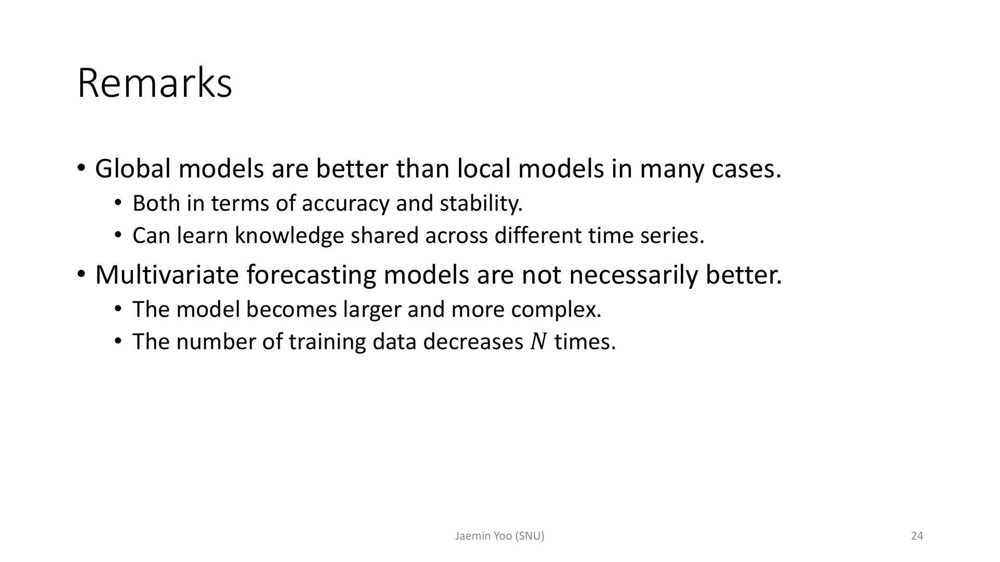

### OCR
- Remarks
- · Global models are better than local models in many cases.
- · Both in terms of accuracy and stability.
- · Can learn knowledge shared across different time series.
- · Multivariate forecasting models are not necessarily better.
- · The model becomes larger and more complex.
- · The number of training data decreases N times.
- Jaemin Yoo (SNU)
- 24

## Page 25

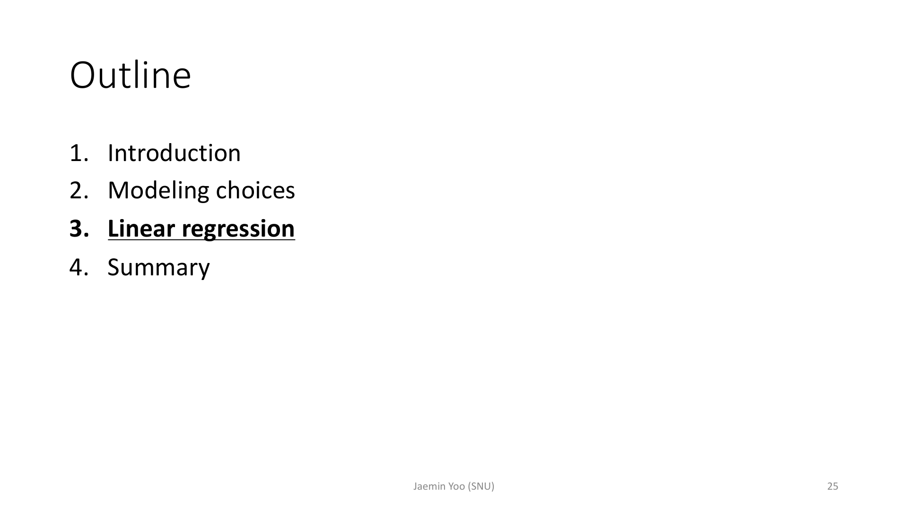

### OCR
- Outline
- 1. Introduction
- 2. Modeling choices
- 3. Linear regression
- 4. Summary
- Jaemin Yoo (SNU)
- 25

## Page 26

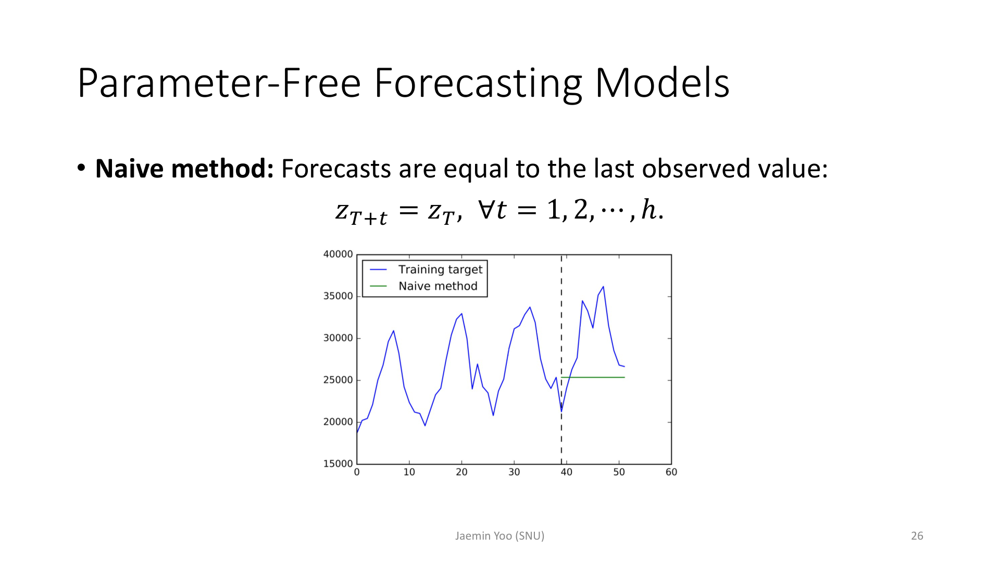

### OCR
- Parameter-Free Forecasting Models
- Naive method: Forecasts are equal to the last observed value:
- t = ZT, t = 1, 2,.:, h.
- ZT+t
- 40000
- Training target
- Naive method
- 35000
- 30000
- 25000
- 20000
- 15000
- 10
- 20
- 30
- 40
- 50
- 60
- 0
- Jaemin Yoo (SNU)
- 26

## Page 27

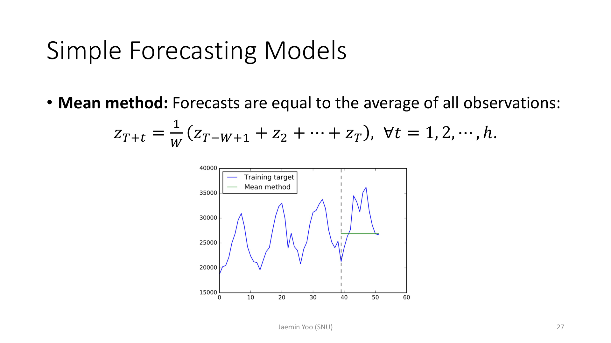

### OCR
- Simple Forecasting Models
- Mean method: Forecasts are equal to the average of all observations:
- 1
- (ZT-W+1 + Z2 + .+ ZT), t = 1,2,···,h.
- ZT+t
- M
- 40000
- Trainingtarget
- Mean method
- 35000
- 30000
- 25000
- 20000
- 15000
- 30
- 50
- 60
- 10
- 20
- 40
- 0
- Jaemin Yoo (SNU)

## Page 28

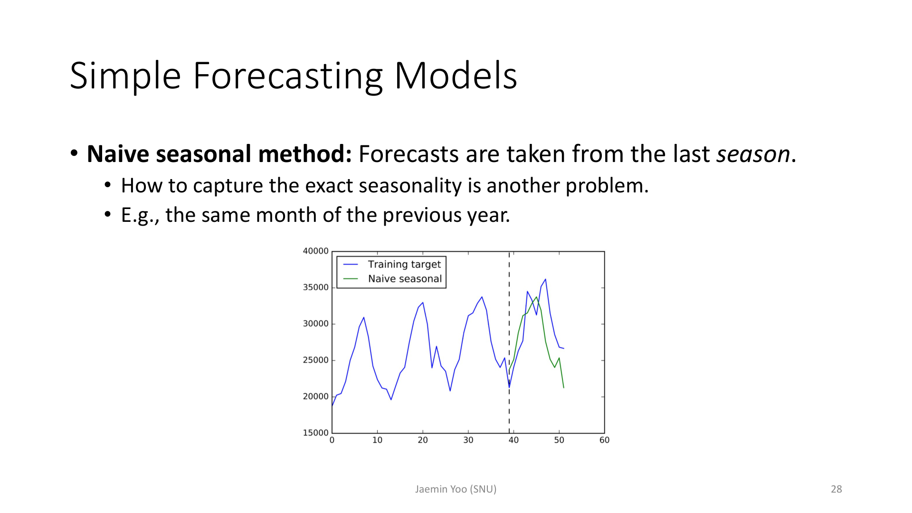

### OCR
- Simple Forecasting Models
- · Naive seasonal method: Forecasts are taken from the last season.
- How to capture the exact seasonality is another problem.
- E.g., the same month of the previous year.
- 40000
- Training target
- Naiveseasonal
- 35000
- 30000
- 25000
- 20000
- 15000
- 40
- 10
- 20
- 30
- 50
- 60
- 0
- Jaemin Yoo (SNU)
- 28

## Page 29

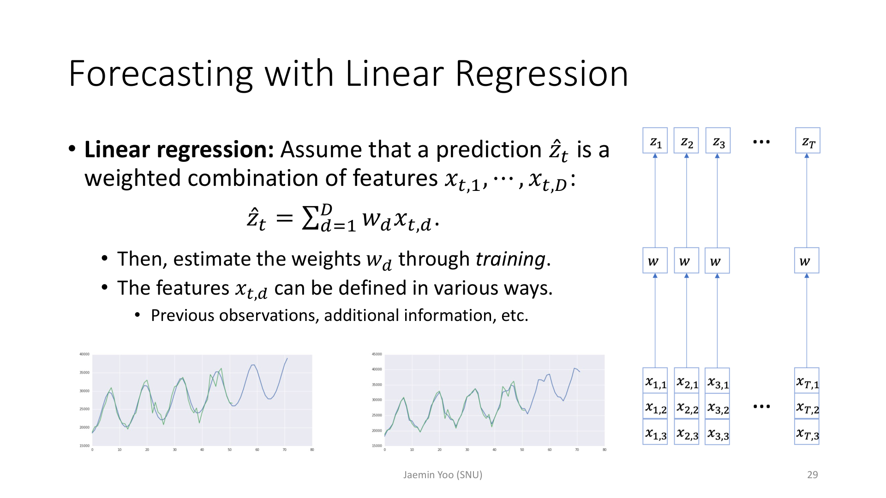

### OCR
- Forecasting with Linear Regression
- Z2
- ZT
- Z1
- Z3
- Linear regression: Assume that a prediction zt is a
- weighted combination of features Xt,1, "·, Xt,D:
- Zt = Ea=1 WaXt,d.
- Then, estimate the weights Wa through training.
- W
- W
- W
- W
- The features Xt,d can be defined in various ways.
- · Previous observations, additional information, etc.
- X2,1
- XT,1
- X1,1
- X3,1
- XT,2
- X1,2
- X2,2
- X3,2
- 5000
- XT,3
- X3,3
- X1,3
- X2,3
- JaeminYoo(SNU)
- 29

## Page 30

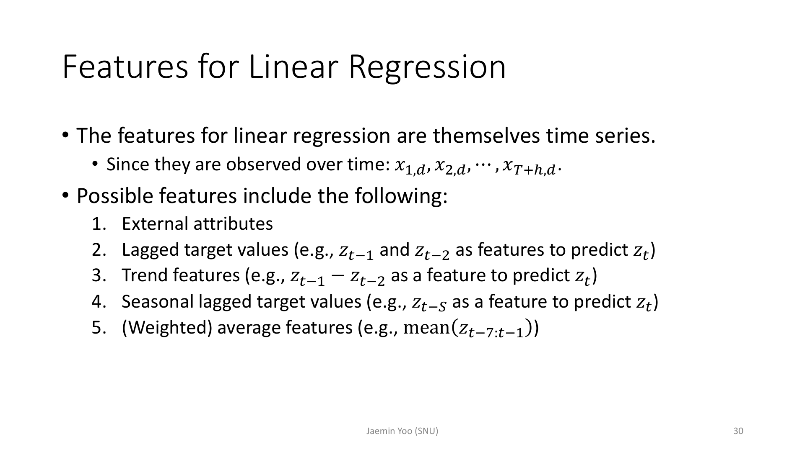

### OCR
- Features for Linear Regression
- · The features for linear regression are themselves time series.
- · Since they are observed over time: X1,d, X2,d,"., XT+h,d.
- · Possible features include the following:
- 1. External attributes
- 2. Lagged target values (e.g., Zt-1 and Zt-2 as features to predict zt)
- 3. Trend features (e.g., Zt-1 - Zt-2 as a feature to predict Zt)
- 4. Seasonal lagged target values (e.g., Zt-s as a feature to predict zt)
- 5.(Weighted) average features (e.g., mean(Zt-7:t-1))
- Jaemin Yoo (SNU)
- 30

## Page 31

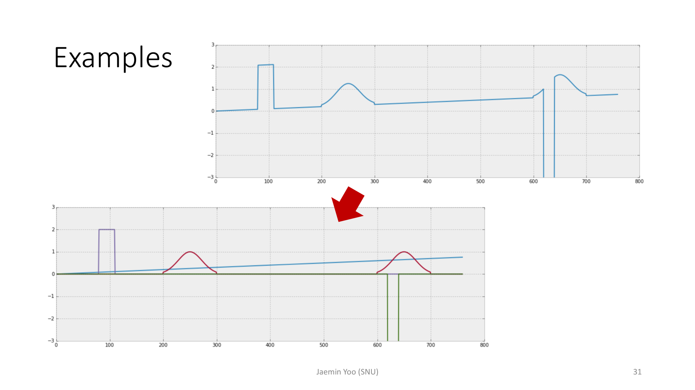

### OCR
- Examples
- 100
- 200
- 300
- 400
- 500
- 600
- 700
- 800
- 100
- 200
- 300
- 500
- 600
- 700
- 800
- 400
- Jaemin Yoo (SNU)
- 31

## Page 32

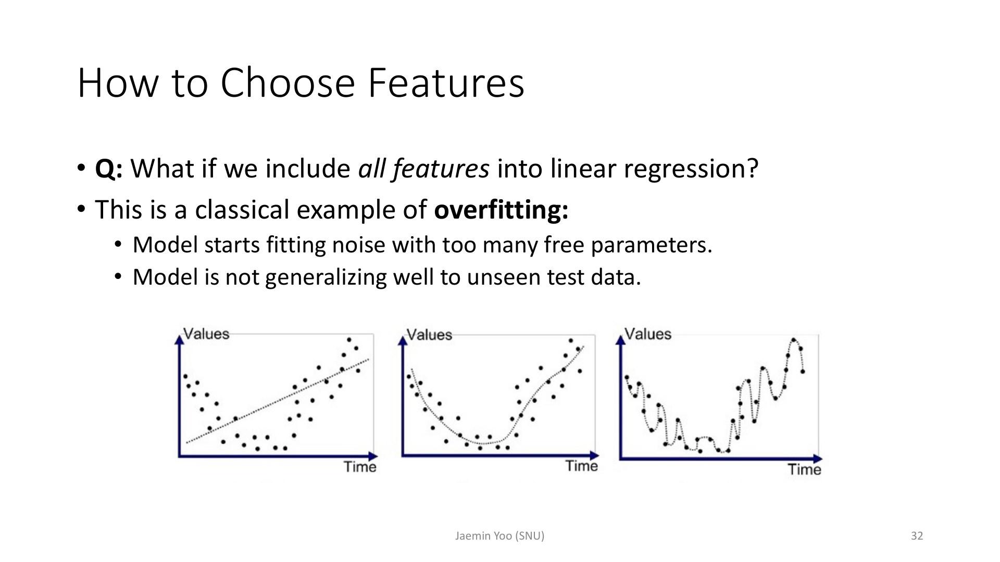

### OCR
- How to Choose Features
- · Q: What if we include all features into linear regression?
- · This is a classical example of overfitting:
- · Model starts fitting noise with too many free parameters.
- Model is not generalizing well to unseen test data.
- Values
- Values
- Values
- Time
- Time
- Time
- JaeminYoo (SNU)
- 32

## Page 33

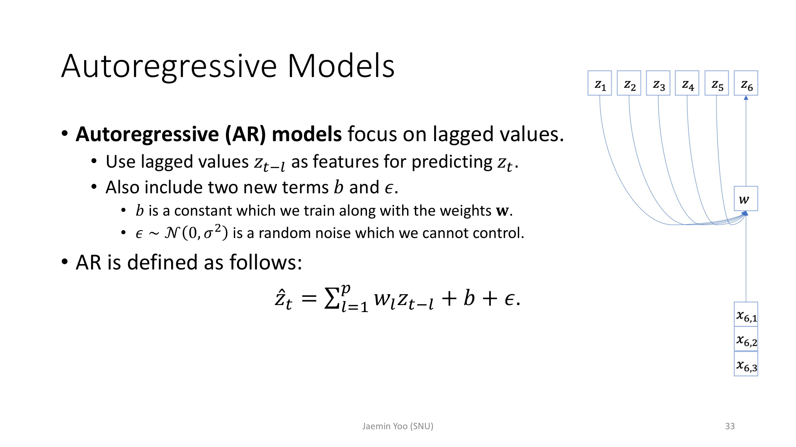

### OCR
- Autoregressive Models
- Z6
- Z1
- Z2
- Z4
- Z5
- Z3
- · Autoregressive (AR) models focus on lagged values.
- · Use lagged values Zt-l as features for predicting Zt.
- Also include two new terms b and e.
- W
- · b is a constant which we train along with the weights w.
- E ~ N(O, o?) is a random noise which we cannot control.
- · AR is defined as follows:
- X6,1
- x6,2
- X6,3
- Jaemin Yoo (SNU)
- 33

## Page 34

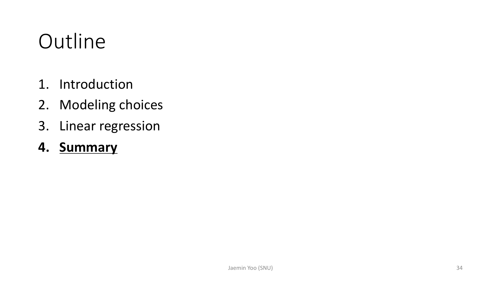

### OCR
- Outline
- 1. Introduction
- 2. Modeling choices
- 3. Linear regression
- 4. Summary
- Jaemin Yoo (SNU)
- 34

## Page 35

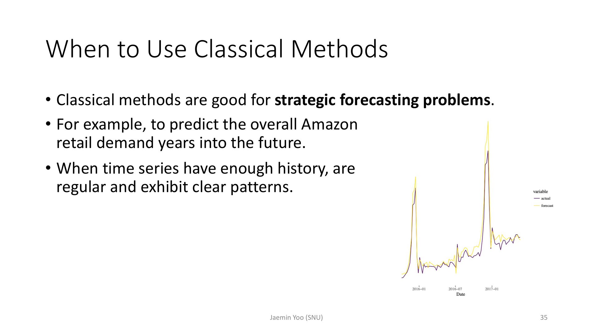

### OCR
- When to Use Classical Methods
- · Classical methods are good for strategic forecasting problems.
- For example, to predict the overall Amazon
- retail demand years into the future.
- When time series have enough history, are
- regular and exhibit clear patterns.
- variable
- actual
- forecast
- 2017-01
- 201601
- 2016-07
- Date
- Jaemin Yoo (SNU)
- 35

## Page 36

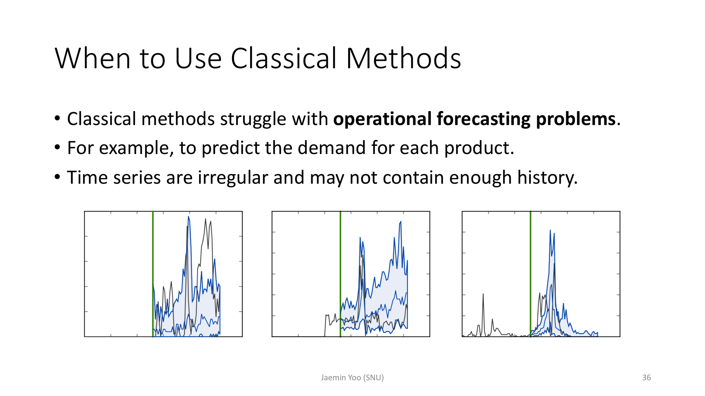

### OCR
- When to Use Classical Methods
- · Classical methods struggle with operational forecasting problems.
- For example, to predict the demand for each product.
- r na  u  e na  s
- JaeminYoo (SNU)
- 36

## Page 37

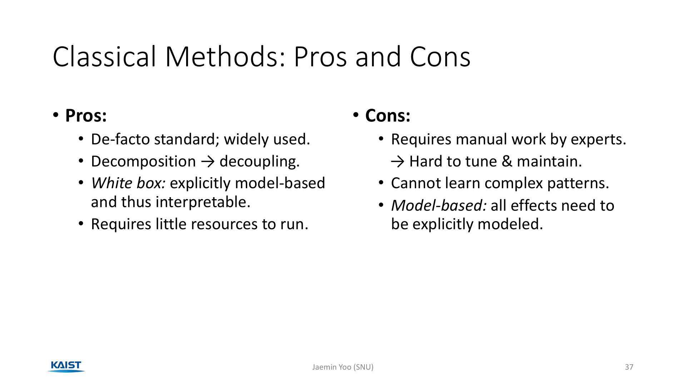

### OCR
- Classical Methods: Pros and Cons
- · Cons:
- · Pros:
- · Requires manual work by experts.
- De-facto standard; widely used.
- Decomposition → decoupling.
- → Hard to tune & maintain.
- Cannot learn complex patterns.
- White box: explicitly model-based
- and thus interpretable.
- Model-based: all effects need to
- be explicitly modeled.
- · Requires little resources to run.
- KAIST
- Jaemin Yoo (SNU)
- 37
