# 2-ts-advanced

Source: `2-ts-advanced.pdf`

Pages: 41

## Page 1

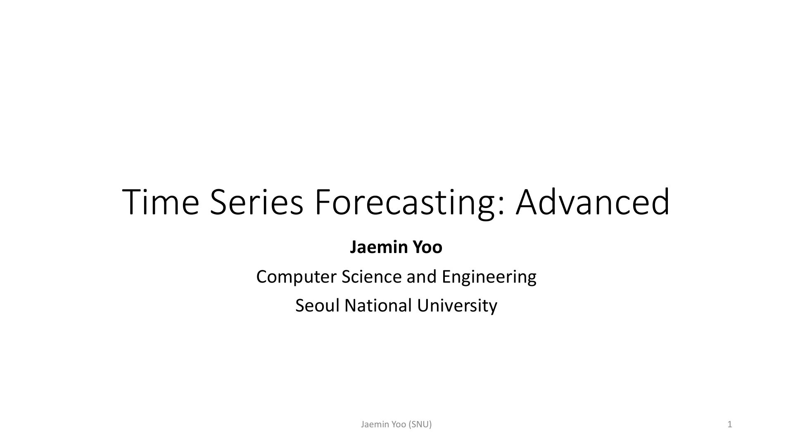

### OCR
- Time Series Forecasting: Advanced
- Jaemin Yoo
- Computer Science and Engineering
- Seoul National University
- Jaemin Yoo (SNU)

## Page 2

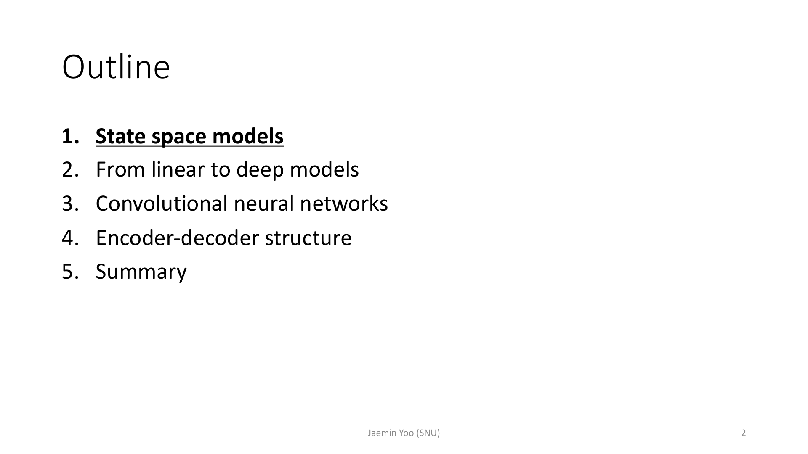

### OCR
- Outline
- State space models
- 1. 5
- 2. From linear to deep models
- 3. Convolutional neural networks
- Encoder-decoder structure
- 4. E
- 5. Summary
- Jaemin Yoo (SNU)

## Page 3

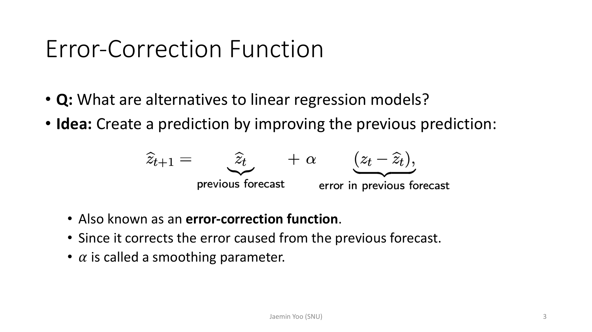

### OCR
- Error-Correction Function
- · Q: What are alternatives to linear regression models?
- · Idea: Create a prediction by improving the previous prediction:
- 含t+1=
- (2t—Et),
- 0+
- previous forecast
- error in previous forecast
- · Also known as an error-correction function.
- Since it corrects the error caused from the previous forecast.
- α is called a smoothing parameter.
- Jaemin Yoo (SNU)

## Page 4

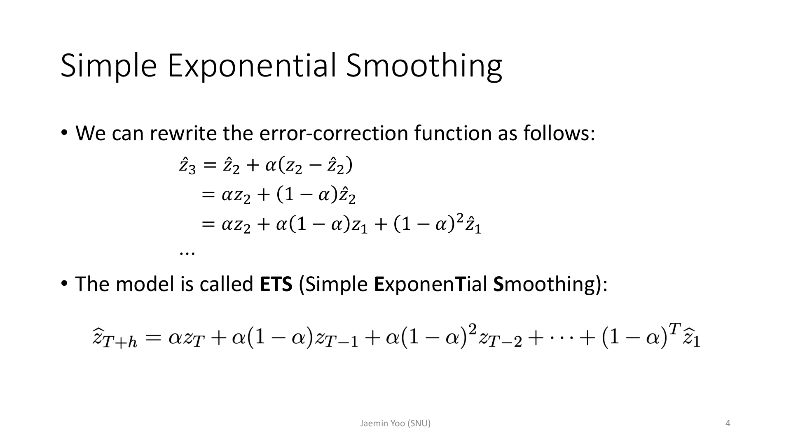

### OCR
- Simple Exponential Smoothing
- · We can rewrite the error-correction function as follows:
- Z3 = Z2+ α(Z2 -Z2)
- = αZ2+ (1 -α)z2
- = αZ2 + α(1 - α)z1 + (1 -α)²z1
- · The model is called ETS (Simple ExponenTial Smoothing):
- zT+h = αzT + α(1 - α)zT-1 + α(1 - α)²zT-2 + ···+ (1 -α)T
- Jaemin Yoo (SNU)

## Page 5

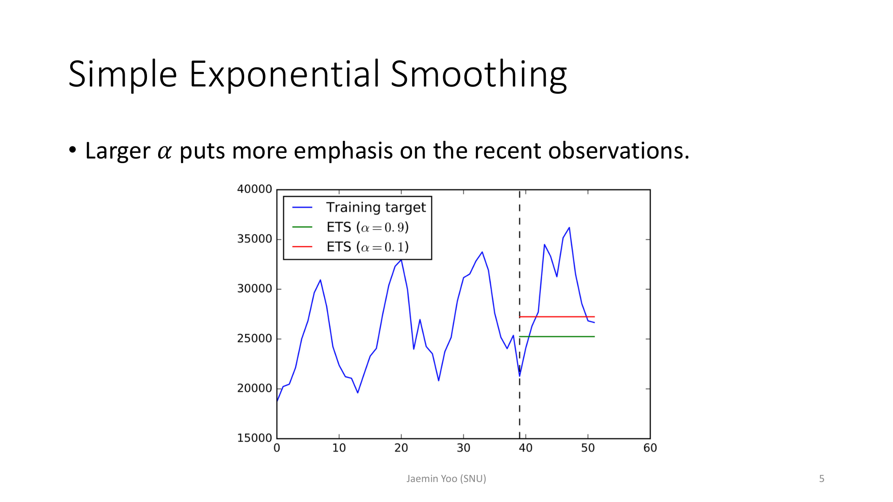

### OCR
- Simple Exponential Smoothing
- · Larger α puts more emphasis on the recent observations.
- 40000
- Training target
- ETS (Q = 0.9)
- 35000
- ETS (α =0.1)
- 30000
- 25000
- 20000
- 15000
- 10
- 20
- 30
- 50
- 40
- 60
- Jaemin Yoo (SNU)

## Page 6

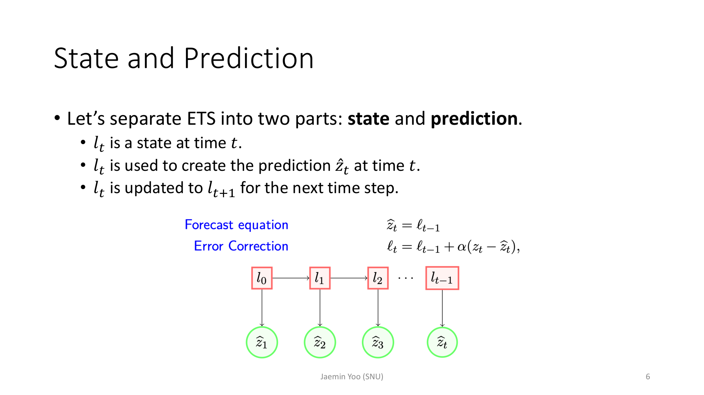

### OCR
- State and Prediction
- · Let's separate ETS into two parts: state and prediction.
- It is a state at time t.
- It is used to create the prediction Zt at time t.
- It is updated to lt+1 for the next time step.
- Zt = lt-1
- Forecast equation
- Error Correction
- lt = lt-1 + α(2t - 2t),
- lt-1
- 02
- 1
- 2
- 22
- 21
- 23
- Et
- Jaemin Yoo (SNU)

## Page 7

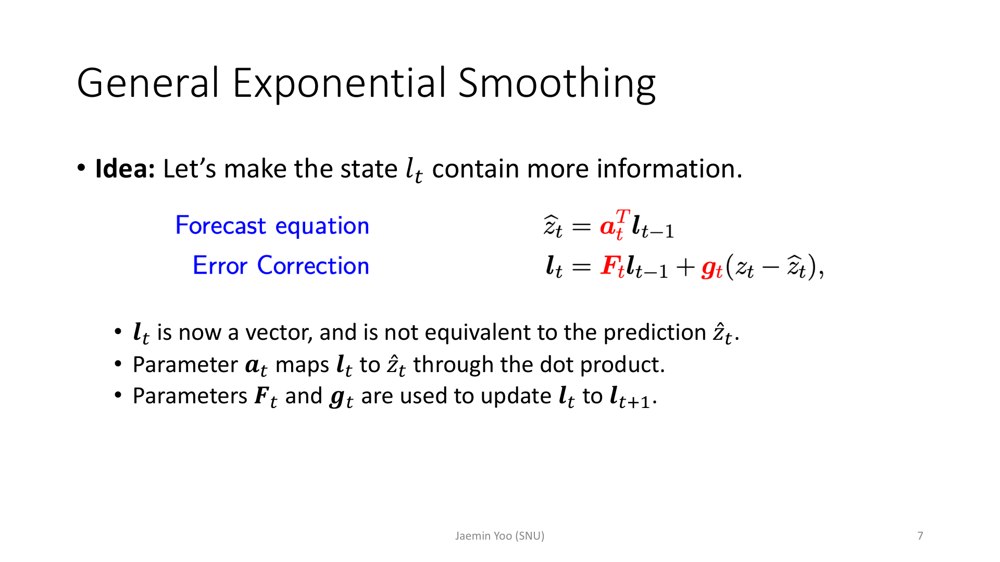

### OCR
- General Exponential Smoothing
- · Idea: Let's make the state lt contain more information.
- t=aTlt-1
- Forecast equation
- Error Correction
- lt = Ftlt-1 + gt(2t - Zt),
- · It is now a vector, and is not equivalent to the prediction Zt.
- · Parameter at maps lt to Zt through the dot product.
- · Parameters Ft and gt are used to update lt to lt+1.
- Jaemin Yoo (SNU)

## Page 8

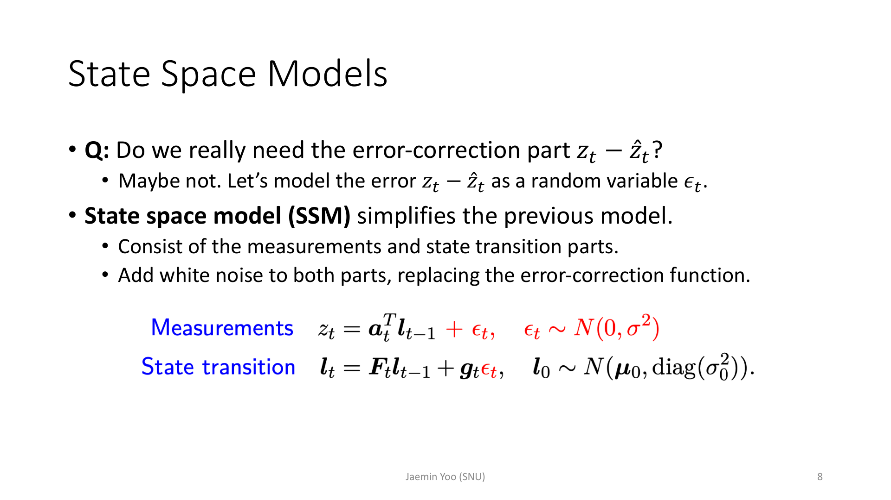

### OCR
- State Space Models
- · Q: Do we really need the error-correction part Zt - Zt?
- · Maybe not. Let's model the error Zt - Zt as a random variable Et.
- · State space model (ssM) simplifies the previous model.
- · Consist of the measurements and state transition parts.
- · Add white noise to both parts, replacing the error-correction function.
- 2t= alt-1 + Et， Et ~ N(0,o²)
- Measurements
- n lt = Ftlt-1 + gtet， lo ~ N(μo,diag(o²)).
- State transition
- Jaemin Yoo (SNU)

## Page 9

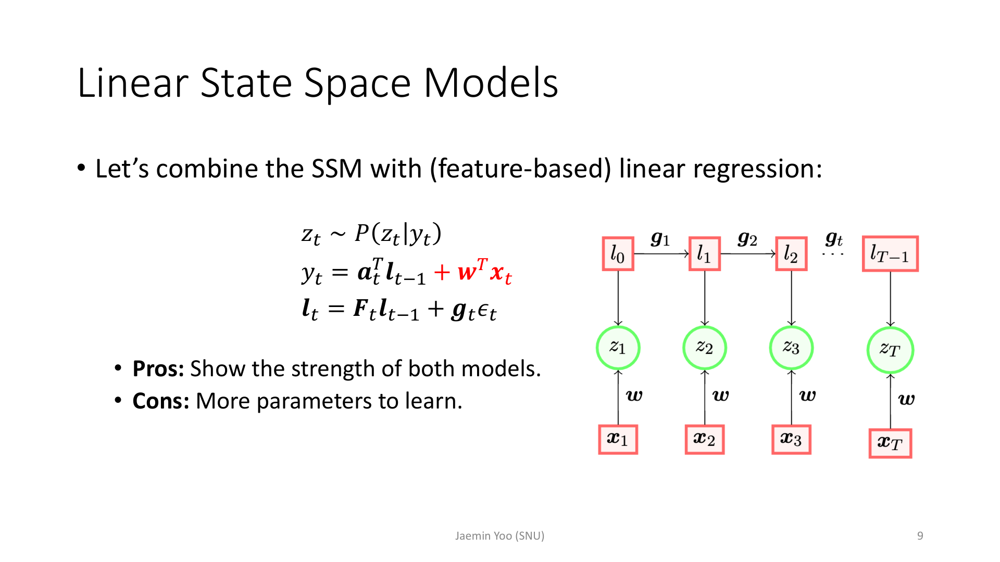

### OCR
- Linear State Space Models
- · Let's combine the SsM with (feature-based) linear regression:
- Zt ~ P(ztlyt)
- 91
- 92
- +6
- lT-1
- 1
- yt = atlt-1 + wTxt
- 2
- lt = Ftlt-1 + gtEt
- 21
- Z2
- 23
- ZT
- Pros: Show the strength of both models.
- w
- w
- w
- Cons: More parameters to learn.
- w
- C1
- 3C2
- 33
- CT
- Jaemin Yoo (SNU)

## Page 10

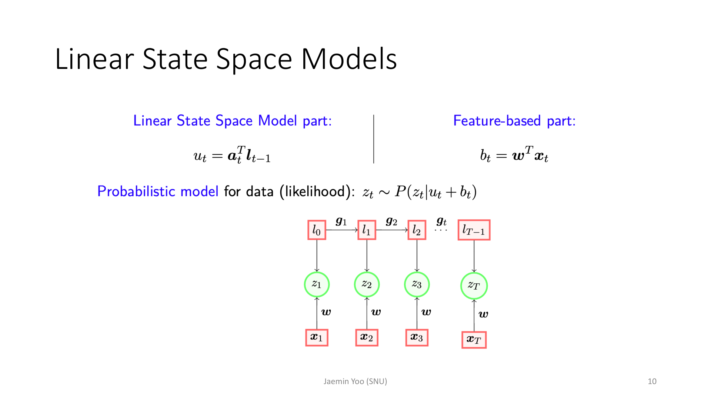

### OCR
- Linear State Space Models
- Linear State Space Model part:
- Feature-based part:
- bt = wTCt
- Ut= aTlt-1
- Probabilistic model for data (likelihood): Zt ~ P(zt|ut + bt)
- 92
- 91
- ?6
- lo
- l1
- lT-1
- 22
- 21
- 23
- ZT
- w
- w
- m
- m
- C2
- C1
- 3C3
- 3T
- Jaemin Yoo (SNU)
- 10

## Page 11

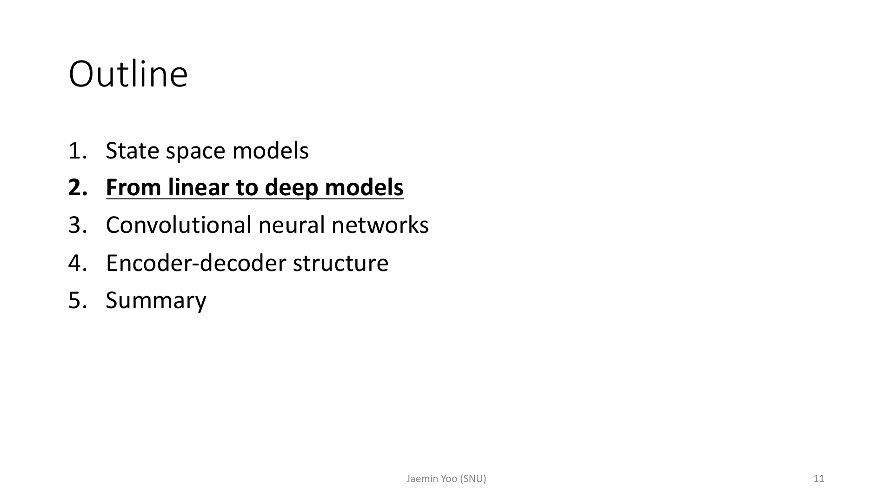

### OCR
- Outline
- 1. State space models
- From linear to deep models
- 2.
- 3. Convolutional neural networks
- Encoder-decoder structure
- 4. B
- 5. Summary
- Jaemin Yoo (SNU)
- 11

## Page 12

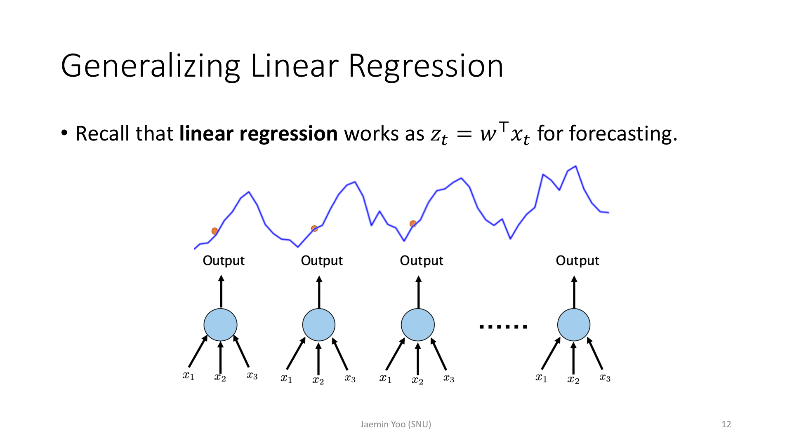

### OCR
- Generalizing Linear Regression
- Recall that linear regression works as Zt = wT xt for forecasting.
- Output
- Output
- Output
- Output
- C1
- C3
- C1
- C3
- 32
- C1
- C1
- C3
- C3
- C2
- 32
- 32
- Jaemin Yoo (SNU)
- 12

## Page 13

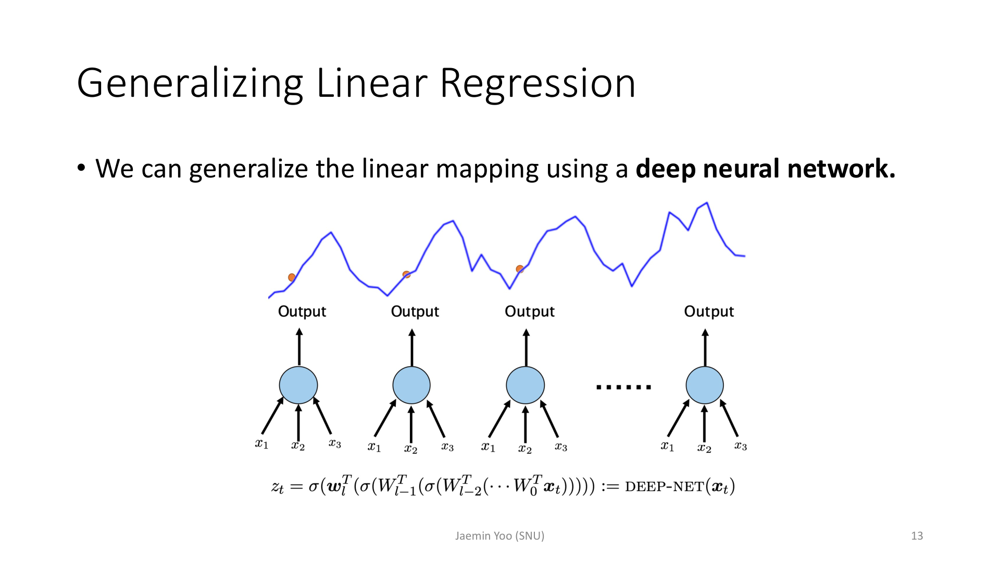

### OCR
- Generalizing Linear Regression
- · We can generalize the linear mapping using a deep neural network.
- Output
- Output
- Output
- Output
- C1
- C3
- C3
- C2
- C1
- C1
- C3
- C1
- C3
- C2
- 32
- C2
- zt = o(wT (o(WT-1(o(WT-2(..· WTct))))) := DEEP-NET(ct)
- Jaemin Yoo (SNU)
- 13

## Page 14

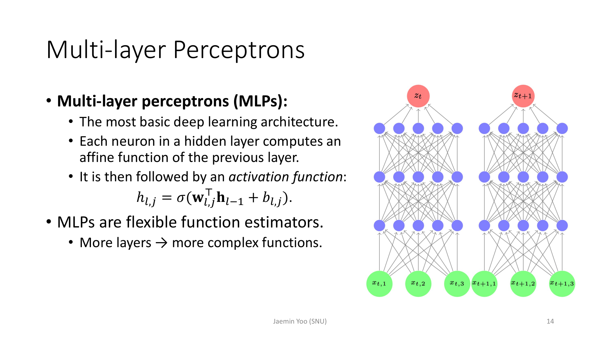

### OCR
- Multi-layer Perceptrons
- 2t+1
- Zt
- Multi-layer perceptrons (MLPs):
- The most basic deep learning architecture.
- Each neuron in a hidden layer computes an
- affine function of the previous layer.
- · It is then followed by an activation function:
- hl,j = o(wi,jhi-1 + bt,j).
- · MLPs are flexible function estimators.
- · More layers → more complex functions.
- t,2
- Ct,1
- t,3
- Ct+1,1
- ct+1,2
- Ct+1,3
- Jaemin Yoo (SNU)
- 14

## Page 15

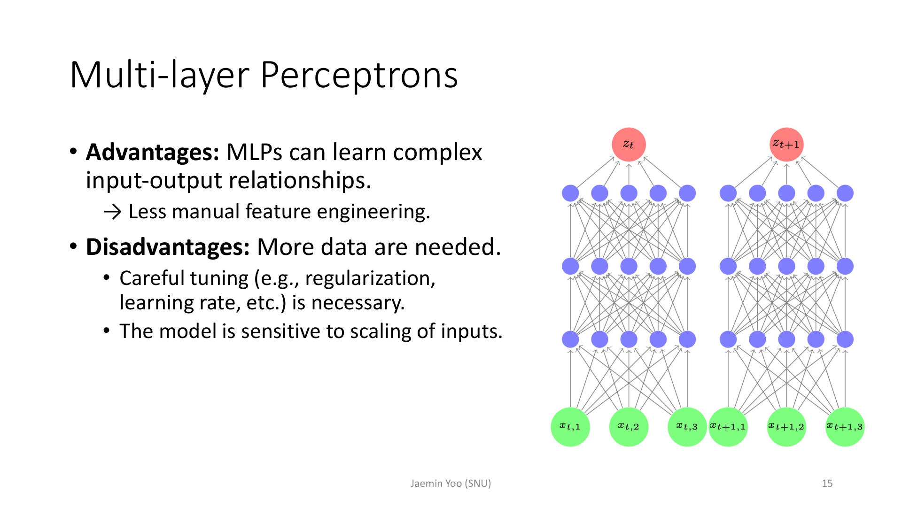

### OCR
- Multi-layer Perceptrons
- 2t+1
- Zt
- Advantages: MLPs can learn complex
- input-output relationships.
- → Less manual feature engineering.
- · Disadvantages: More data are needed.
- Careful tuning (e.g., regularization,
- learning rate, etc.) is necessary.
- The model is sensitive to scaling of inputs.
- t,2
- Ct,1
- t,3
- Ct+1,1
- ct+1,2
- Ct+1,3
- Jaemin Yoo (SNU)
- 15

## Page 16

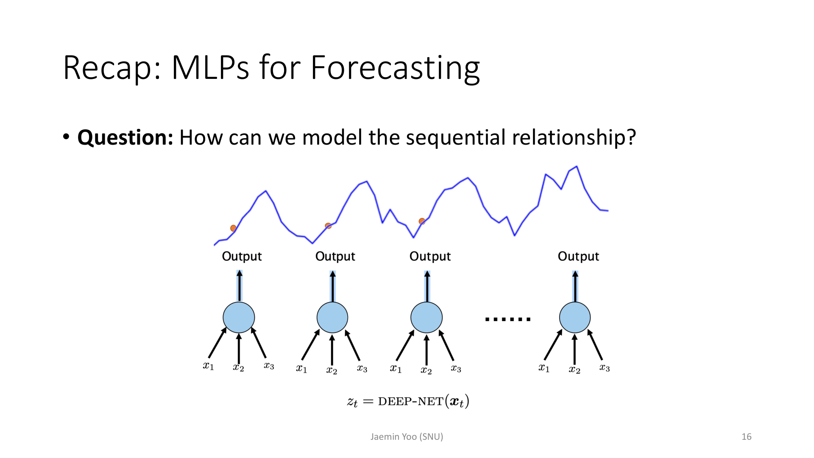

### OCR
- Recap: MLPs for Forecasting
- Question: How can we model the sequential relationship?
- Output
- Output
- Output
- Output
- C1
- C3
- C3
- 32
- C1
- C3
- C1
- 32
- C3
- C1
- C2
- 32
- 2t =DEEP-NET(cCt)
- Jaemin Yoo (SNU)
- 16

## Page 17

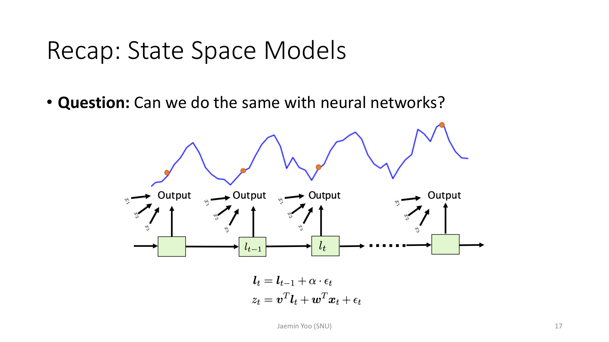

### OCR
- Recap: State Space Models
- Question: Can we do the same with neural networks?
- Output
- Output
- Output
- Output
- lt=lt-1+Q·Et
- t =uTlt+wt+Et
- Jaemin Yoo (SNU)

## Page 18

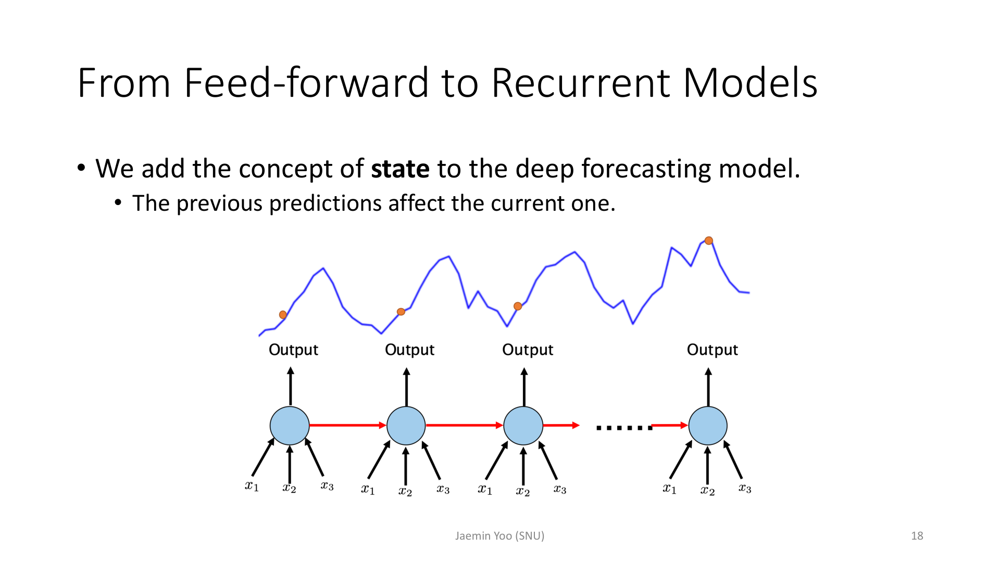

### OCR
- From Feed-forward to Recurrent Models
- · We add the concept of state to the deep forecasting model.
- The previous predictions affect the current one.
- Output
- Output
- Output
- Output
- C3
- C1
- 32
- 21
- C3
- C1
- C1
- C3
- C2
- C3
- C2
- C2
- Jaemin Yoo (SNU)
- 18

## Page 19

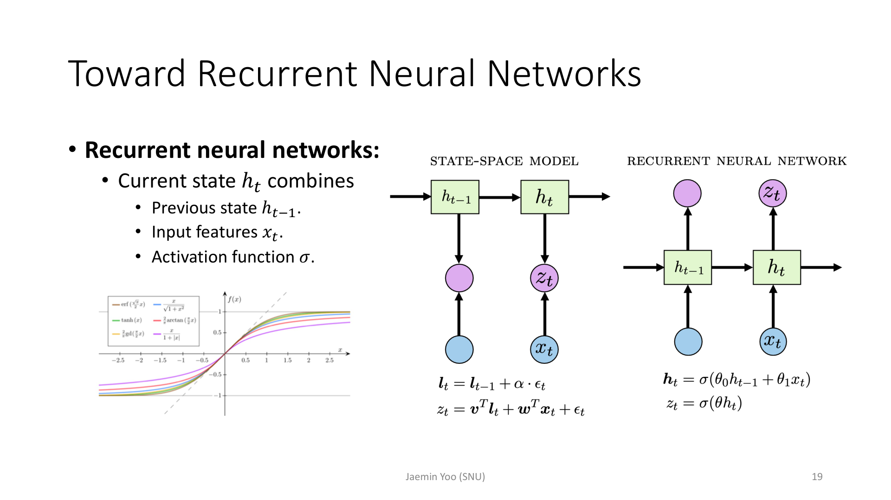

### OCR
- Toward Recurrent Neural Networks
- Recurrent neural networks:
- RECURRENTNEURALNETWORK
- STATE-SPACEMODEL
- Current state ht combines
- ht
- ht-1
- Previous state ht-1·
- Input features xt·
- Activation function o.
- ht-1
- ht
- f(x)
- erf(x)
- √1+x2
- arctan（x)
- tanh (z)
- gd(r)
- 0.5
- +2
- 1 + [z]
- ct
- 1.5
- 0.5
- 1.52
- 2.5
- 0.5
- 2
- 2.5
- -1
- ht = o(0oht-1 + 01t)
- 49 . 0 + 1-+1 = +1
- 2t = o(0ht)
- 2t = vTlt + wt + Et
- Jaemin Yoo (SNU)
- 19

## Page 20

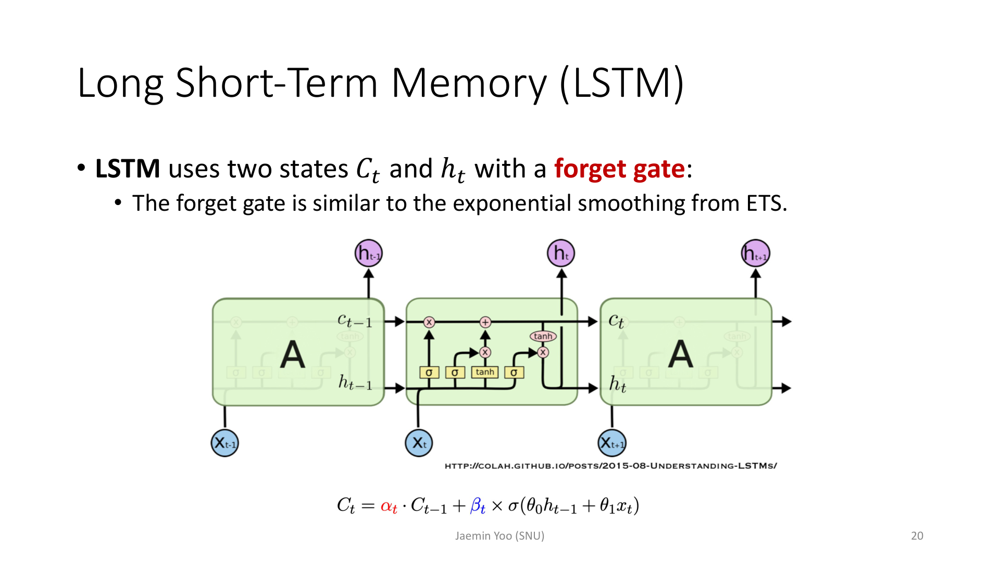

### OCR
- Long Short-Term Memory (LSTM)
- LsTM uses two states Ct and ht with a forget gate:
- The forget gate is similar to the exponential smoothing from ETS.
- Ct-1
- Ct
- tanh
- A
- A
- tanh
- a
- ht-1
- Xt-1
- HTTP://COLAH.GITHUB.1O/POSTS/2O15-O8-UNDERSTANDING-LSTMS/
- Ct = Qt · Ct-1 + βt × o(0oht-1 + 01ct)
- Jaemin Yoo (SNU)
- 20

## Page 21

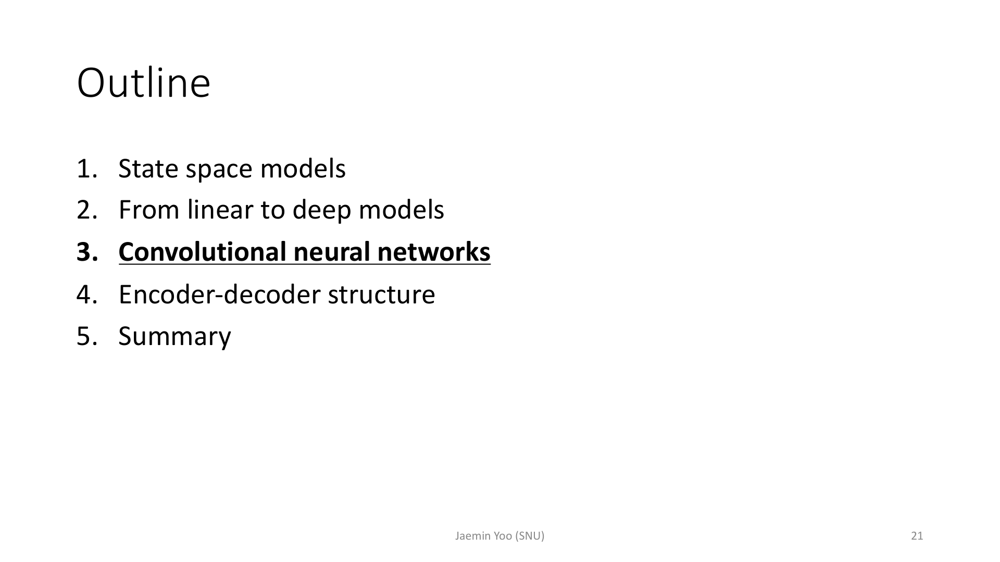

### OCR
- Outline
- 1. State space models
- 2. From linear to deep models
- 3. Convolutional neural networks
- Encoder-decoder structure
- 4.
- 5. Summary
- Jaemin Yoo (SNU)
- 21

## Page 22

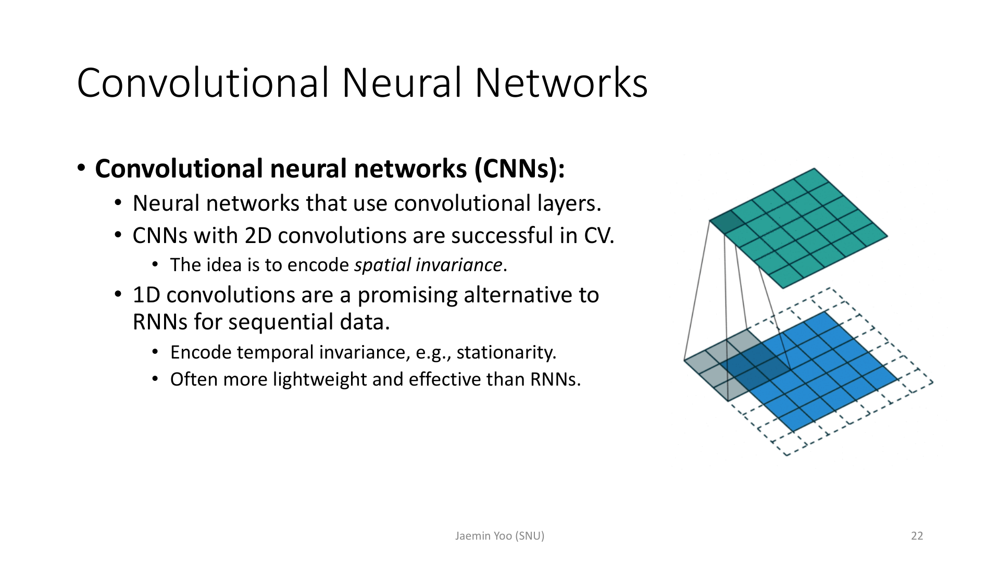

### OCR
- Convolutional Neural Networks
- · Convolutional neural networks (CNNs):
- Neural networks that use convolutional layers.
- CNNs with 2D convolutions are successful in CV.
- · The idea is to encode spatial invariance.
- 1D convolutions are a promising alternative to
- RNNs for sequential data.
- · Encode temporal invariance, e.g., stationarity.
- · Often more lightweight and effective than RNNs.
- Jaemin Yoo (SNU)
- 22

## Page 23

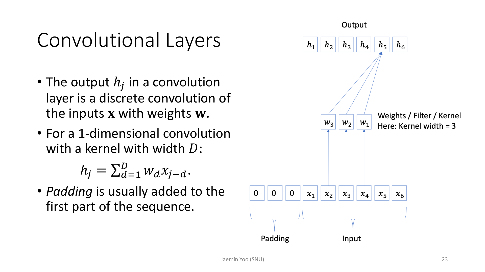

### OCR
- Output
- Convolutional Layers
- h6
- h5
- h3
- h4
- h1
- · The output h, in a convolution
- layer is a discrete convolution of
- the inputs x with weights w.
- Weights / Filter / Kernel
- W3
- W2
- W1
- Here: Kernel width = 3
- For a 1-dimensional convolution
- with a kernel with width D:
- h; = Ea=1 Waxj-d.
- Padding is usually added to the
- x6
- X4
- x5
- x1
- X2
- X3
- first part of the sequence.
- Padding
- Input
- Jaemin Yoo (SNU)
- 23

## Page 24

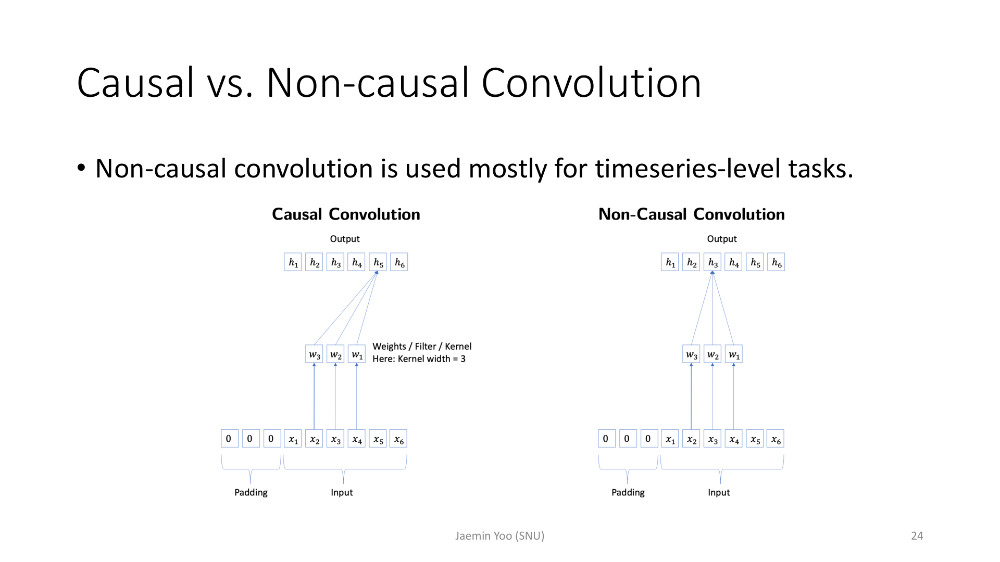

### OCR
- Causal vs. Non-causal Convolution
- Non-causal convolution is used mostly for timeseries-level tasks.
- Non-Causal Convolution
- CausalConvolution
- Output
- Output
- Weights/ Filter/Kernel
- W
- Here:Kernel width =3
- M
- Padding
- Padding
- Input
- Input
- Jaemin Yoo (SNU)
- 24

## Page 25

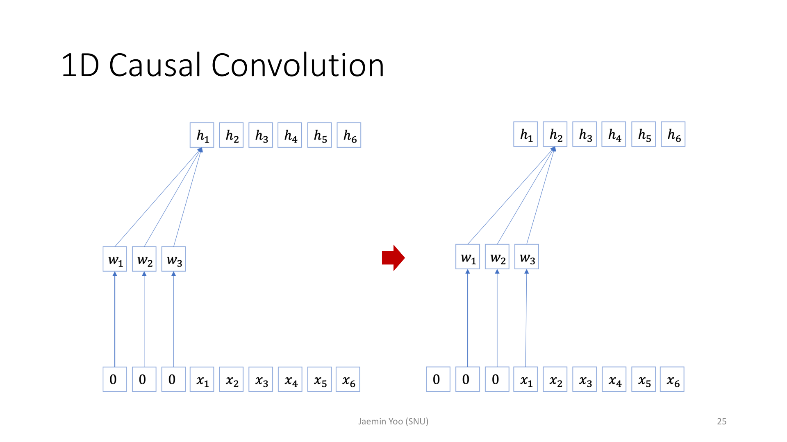

### OCR
- 1D Causal Convolution
- h6
- h3
- h6
- h4
- h1
- h4
- h5
- h2
- h5
- hz
- h3
- h1
- W2
- W3
- W1
- W2
- W3
- W1
- x6
- X2
- x6
- x5
- X4
- X2
- X3
- X4
- x1
- x5
- x1
- X3
- Jaemin Yoo (SNU)
- 25

## Page 26

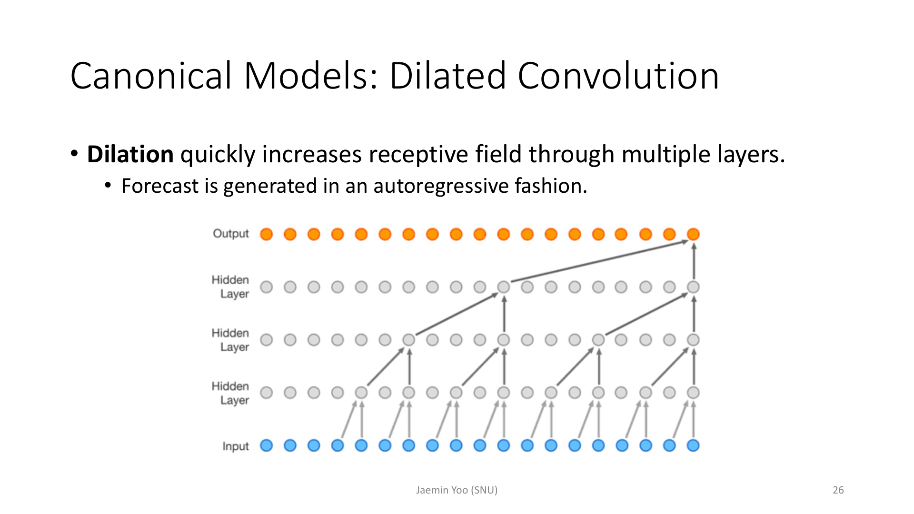

### OCR
- Canonical Models: Dilated Convolution
- Dilation quickly increases receptive field through multiple layers.
- Forecast is generated in an autoregressive fashion.
- ndino
- Hidden
- Layer
- Hidden
- O
- Layer
- Hidden
- Layer
- Input
- JaeminYoo (SNU)
- 26

## Page 27

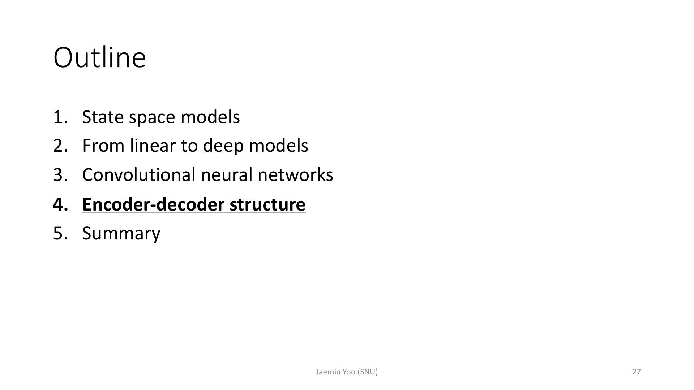

### OCR
- Outline
- 1. State space models
- 2. From linear to deep models
- 3. Convolutional neural networks
- Encoder-decoder structure
- 4.
- 5. Summary
- Jaemin Yoo (SNU)
- 27

## Page 28

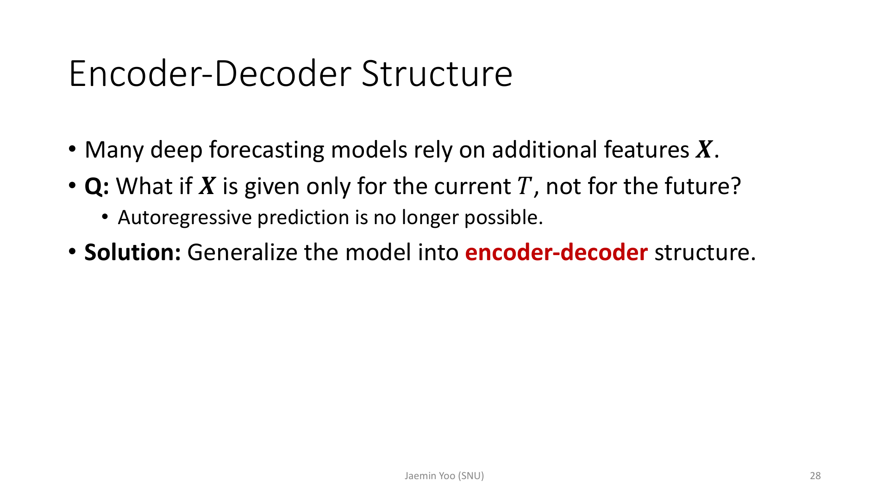

### OCR
- Encoder-Decoder Structure
- · Many deep forecasting models rely on additional features X.
- · Q: What if X is given only for the current T, not for the future?
- · Autoregressive prediction is no longer possible.
- · Solution: Generalize the model into encoder-decoder structure.
- Jaemin Yoo (SNU)
- 28

## Page 29

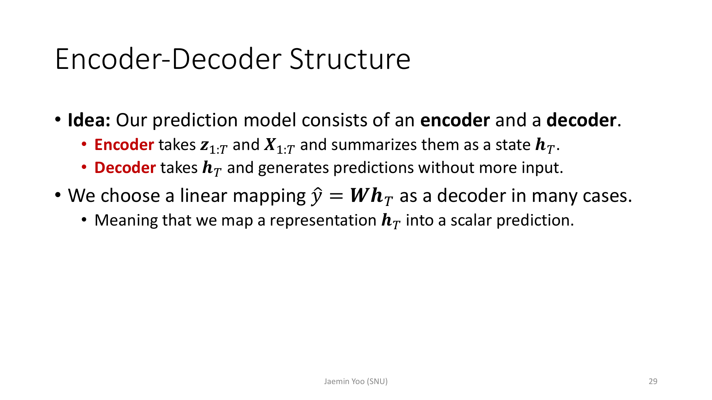

### OCR
- Encoder-Decoder Structure
- · Idea: Our prediction model consists of an encoder and a decoder.
- · Encoder takes Zi:T and X1:r and summarizes them as a state hT.
- · Decoder takes hr and generates predictions without more input.
- · We choose a linear mapping y = Whr as a decoder in many cases.
- Jaemin Yoo (SNU)
- 29

## Page 30

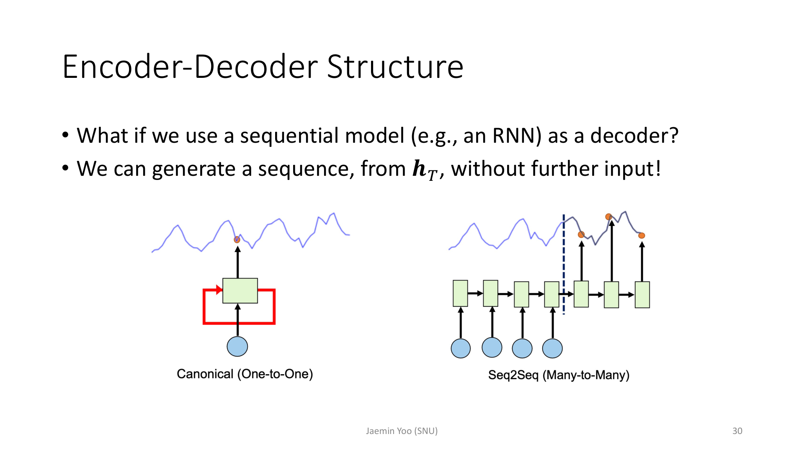

### OCR
- Encoder-Decoder Structure
- · What if we use a sequential model (e.g., an RNN) as a decoder?
- We can generate a sequence, from hr, without further input!
- 工王工
- Canonical (One-to-One)
- Seq2Seq (Many-to-Many)
- Jaemin Yoo (SNU)
- 30

## Page 31

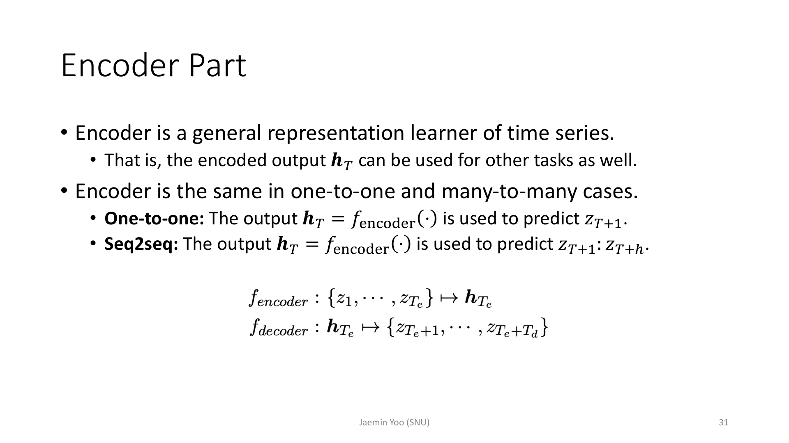

### OCR
- Encoder Part
- · Encoder is a general representation learner of time series.
- · That is, the encoded output hr can be used for other tasks as well.
- · Encoder is the same in one-to-one and many-to-many cases.
- · One-to-one: The output hr = fencoder() is used to predict ZT+1-
- · Seq2seq: The output hT = fencoder() is used to predict ZT+1: ZT+h.
- fencoder : {21,··· ,ZTe} → hTe
- fdecoder : hTe —→ {2Te+1,··· ,2Te+Ta}
- Jaemin Yoo (SNU)
- 31

## Page 32

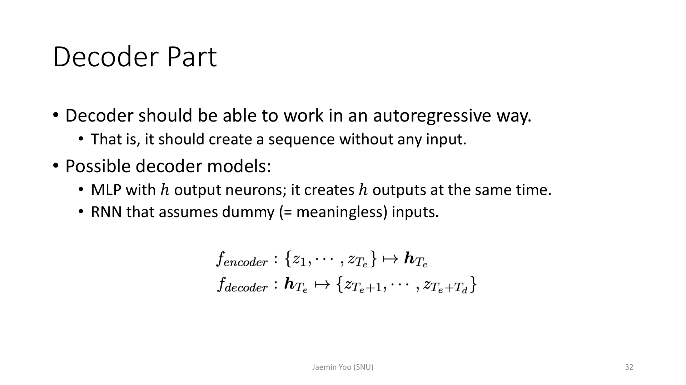

### OCR
- Decoder Part
- · Decoder should be able to work in an autoregressive way.
- · That is, it should create a sequence without any input.
- · Possible decoder models:
- · MLP with h output neurons; it creates h outputs at the same time.
- · RNN that assumes dummy (= meaningless) inputs.
- fencoder : {21,··· ,2Te} → hTe
- fdecoder : hTe —→ {2Te+1,··· ,2Te+Ta}
- Jaemin Yoo (SNU)
- 32

## Page 33

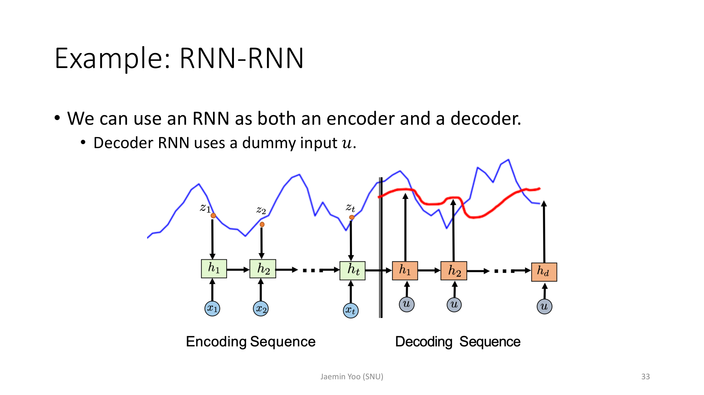

### OCR
- Example: RNN-RNN
- We can use an RNN as both an encoder and a decoder.
- Decoder RNN uses a dummy input u.
- h1
- h2
- hd
- u
- 2+
- Encoding Sequence
- Decoding Sequence
- Jaemin Yoo (SNU)
- 33

## Page 34

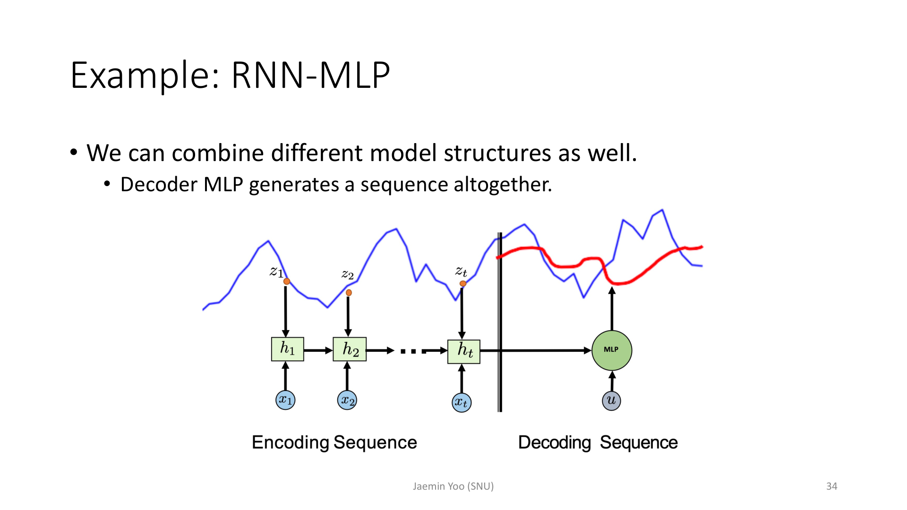

### OCR
- Example: RNN-MLP
- We can combine different model structures as well.
- Decoder MLP generates a sequence altogether.
- 22
- h1
- MLP
- nt
- EncodingSequence
- DecodingSequence
- JaeminYoo(SNU)
- 34

## Page 35

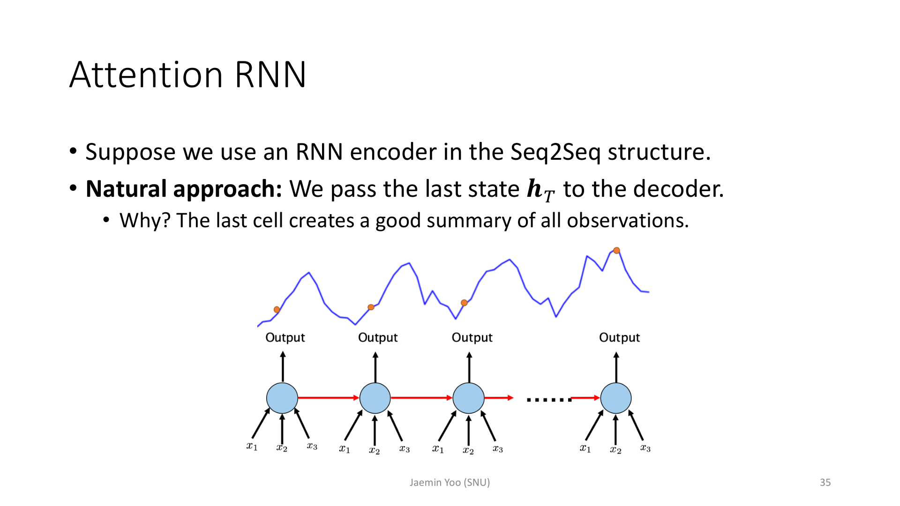

### OCR
- Attention RNN
- · Suppose we use an RNN encoder in the Seq2Seq structure.
- Natural approach: We pass the last state hr to the decoder.
- · Why? The last cell creates a good summary of all observations.
- Output
- Output
- Output
- Output
- C1
- C3
- 32
- C1
- C3
- C1
- C3
- C1
- C3
- C2
- 32
- C2
- Jaemin Yoo (SNU)
- 35

## Page 36

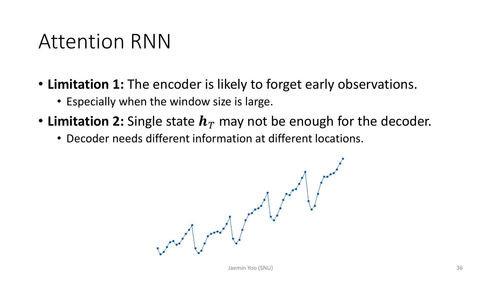

### OCR
- Attention RNN
- · Limitation 1: The encoder is likely to forget early observations.
- · Especially when the window size is large.
- · Limitation 2: Single state hr may not be enough for the decoder.
- · Decoder needs different information at different locations.
- Jaemin Yoo (SNU)
- 36

## Page 37

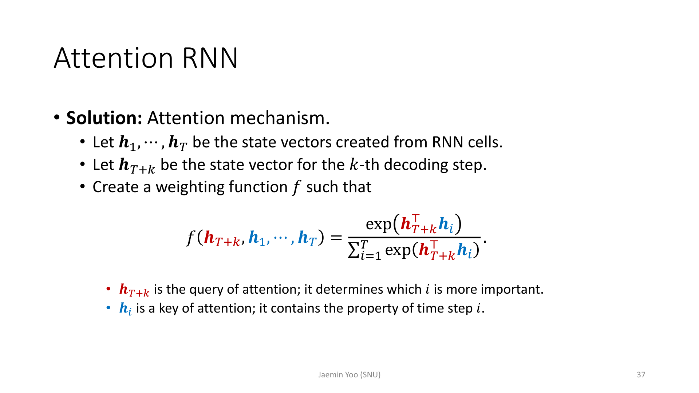

### OCR
- Attention RNN
- · Solution: Attention mechanism.
- · Let h1, ·".,hr be the state vectors created from RNN cells.
- · Let hr+k be the state vector for the k-th decoding step.
- · Create a weighting function f such that
- exp(hT+khi)
- f(hT+k,h,..,hT) =
- ∑T=1 exp(hT+khi)
- · hr+k is the query of attention; it determines which i is more important.
- ·. h; is a key of attention; it contains the property of time step i.
- Jaemin Yoo (SNU)
- 37

## Page 38

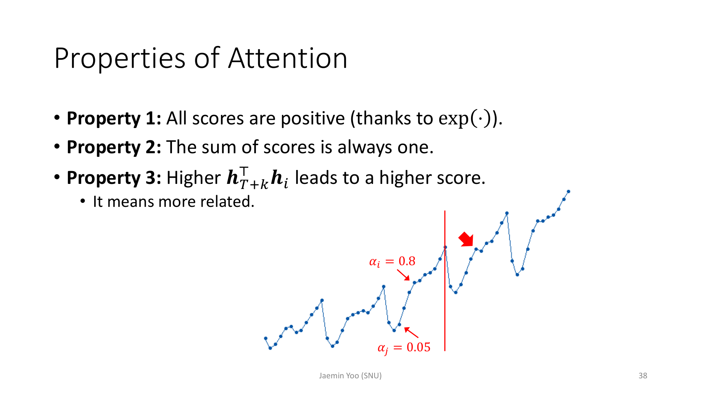

### OCR
- Properties of Attention
- · Property 1: All scores are positive (thanks to exp()).
- · Property 2: The sum of scores is always one.
- · Property 3: Higher hT+kh; leads to a higher score.
- · It means more related.
- αi = 0.8
- α; = 0.05
- Jaemin Yoo (SNU)
- 38

## Page 39

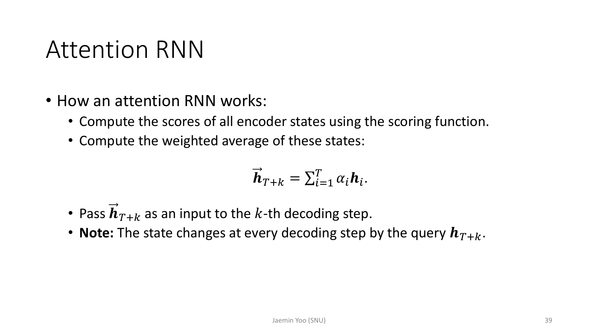

### OCR
- Attention RNN
- · How an attention RNN works:
- · Compute the scores of all encoder states using the scoring function.
- · Compute the weighted average of these states:
- hr+k =Ei=1aihi.
- · Pass hr+k as an input to the k-th decoding step.
- · Note: The state changes at every decoding step by the query hr+k·
- Jaemin Yoo (SNU)
- 39

## Page 40

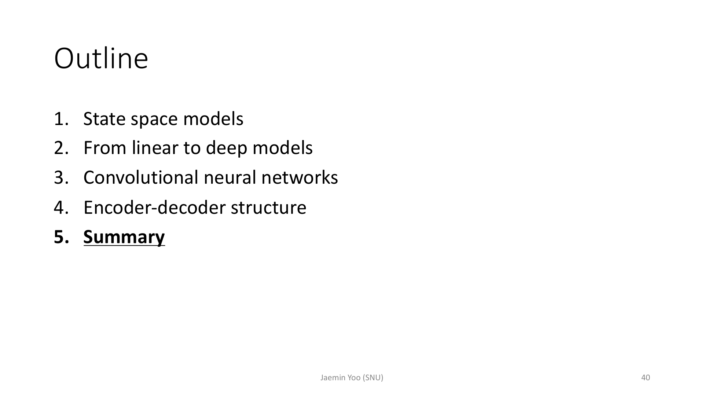

### OCR
- Outline
- 1. State space models
- 2. From linear to deep models
- 3. Convolutional neural networks
- Encoder-decoder structure
- 4. E
- 5. Summary
- Jaemin Yoo (SNU)
- 40

## Page 41

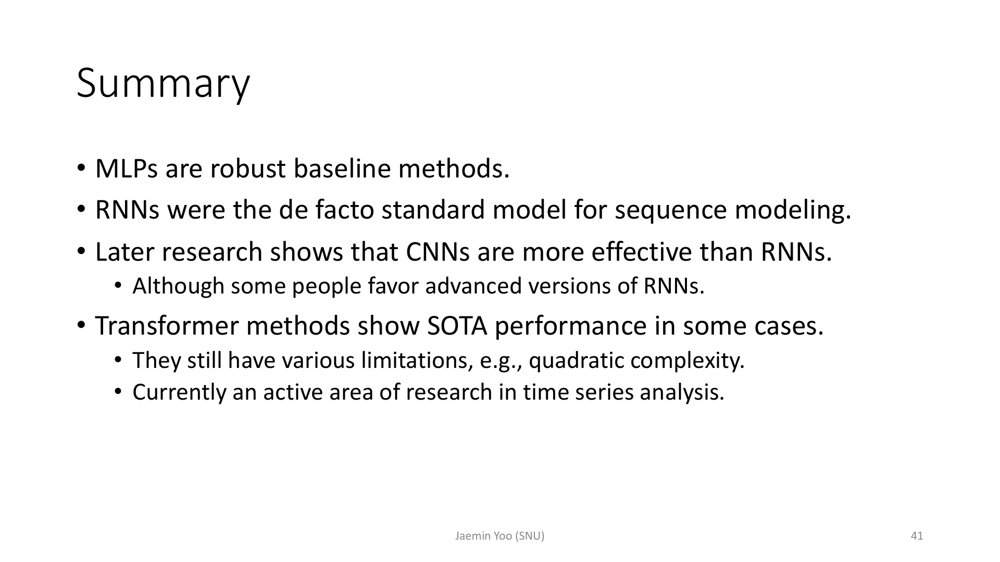

### OCR
- Summary
- · MlPs are robust baseline methods.
- · RNNs were the de facto standard model for sequence modeling.
- · Later research shows that CNNs are more effective than RNNs.
- · Transformer methods show SoTA performance in some cases.
- · They still have various limitations, e.g., quadratic complexity.
- · Currently an active area of research in time series analysis.
- Jaemin Yoo (SNU)
- 41
