# 3_4-ts-practice

Source: `3_4-ts-practice.pdf`

Pages: 37

## Page 1

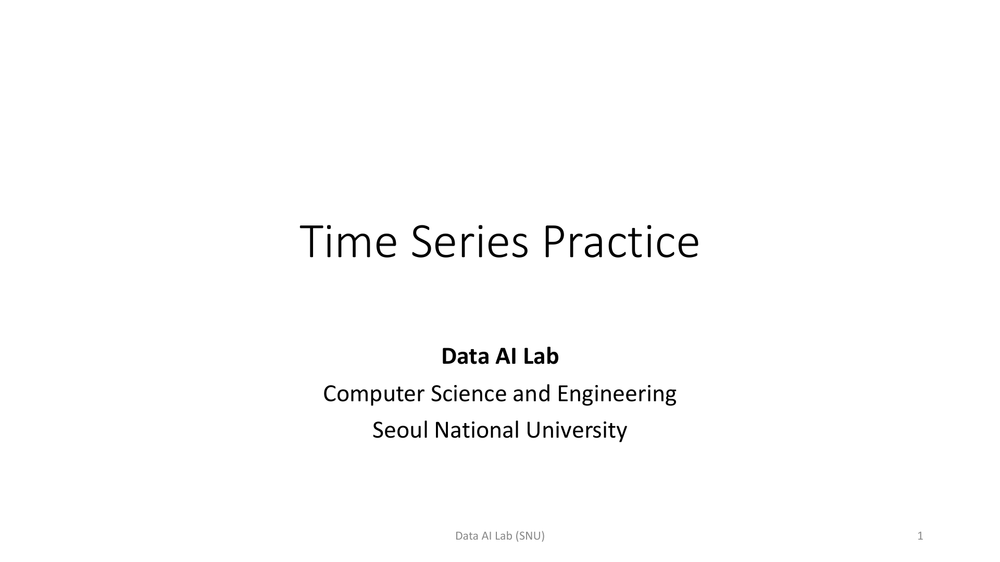

### OCR
- Time Series Practice
- Data Al Lab
- Computer Science and Engineering
- Seoul National University
- Data Al Lab (SNU)

## Page 2

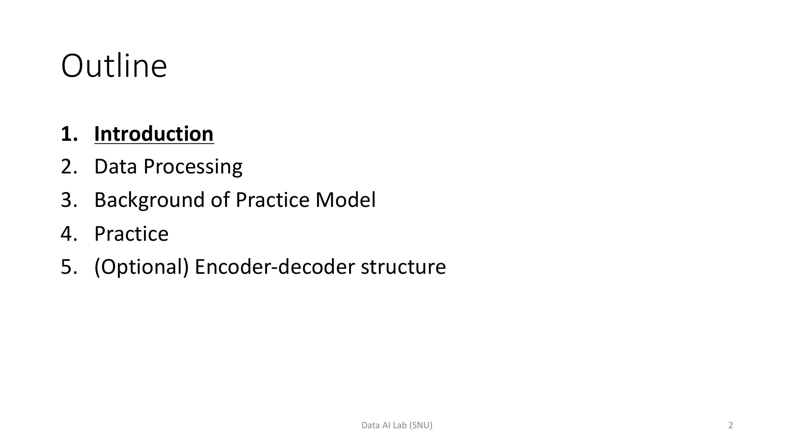

### OCR
- Outline
- Introduction
- 1.
- Data Processing
- 2.
- Background of Practice Model
- 3. B
- Practice
- 4.
- 5. (Optional) Encoder-decoder structure
- Data Al Lab (SNU)

## Page 3

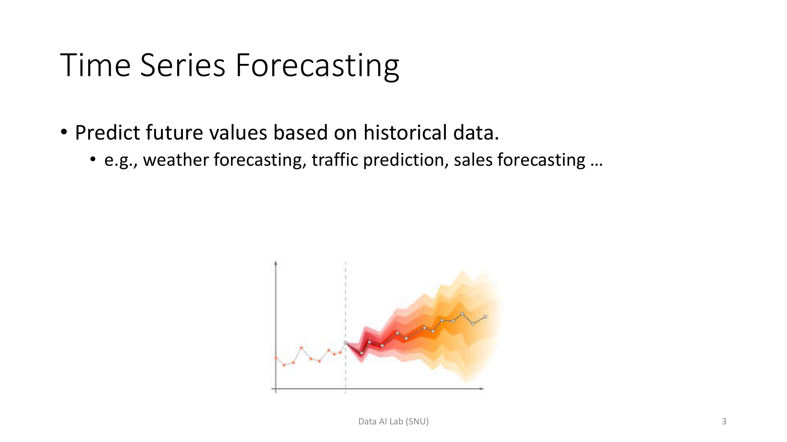

### OCR
- Time Series Forecasting
- Predict future values based on historical data.
- e.g., weather forecasting, traffic prediction, sales forecasting ...
- DataAl Lab (SNU)

## Page 4

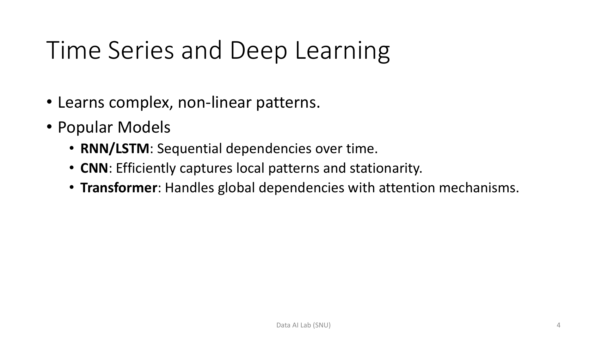

### OCR
- Time Series and Deep Learning
- · Learns complex, non-linear patterns.
- ·PopularModels
- · RNN/LSTM: Sequential dependencies over time.
- · CNN: Efficiently captures local patterns and stationarity.
- · Transformer: Handles global dependencies with attention mechanisms.
- Data Al Lab (SNU)

## Page 5

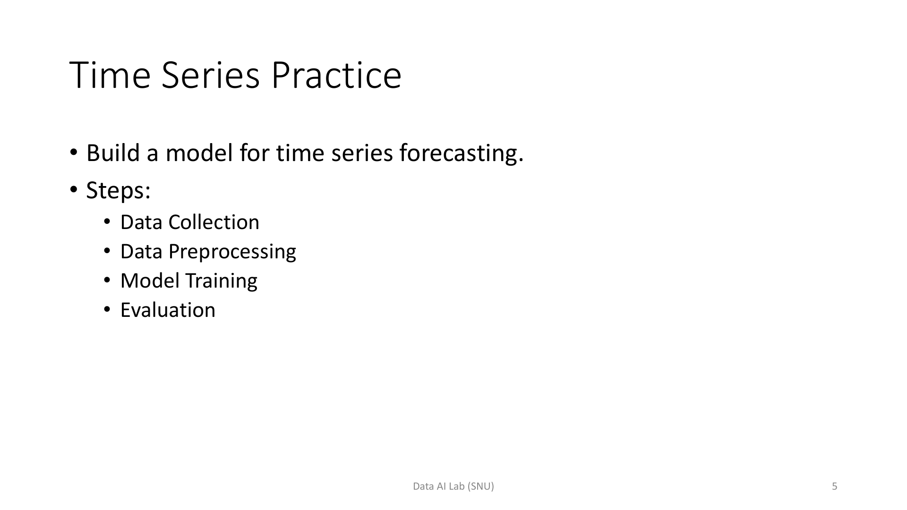

### OCR
- Time Series Practice
- · Build a model for time series forecasting.
- · Steps:
- · Data Collection
- Data Preprocessing
- Model Training
- Evaluation
- Data Al Lab (SNU)

## Page 6

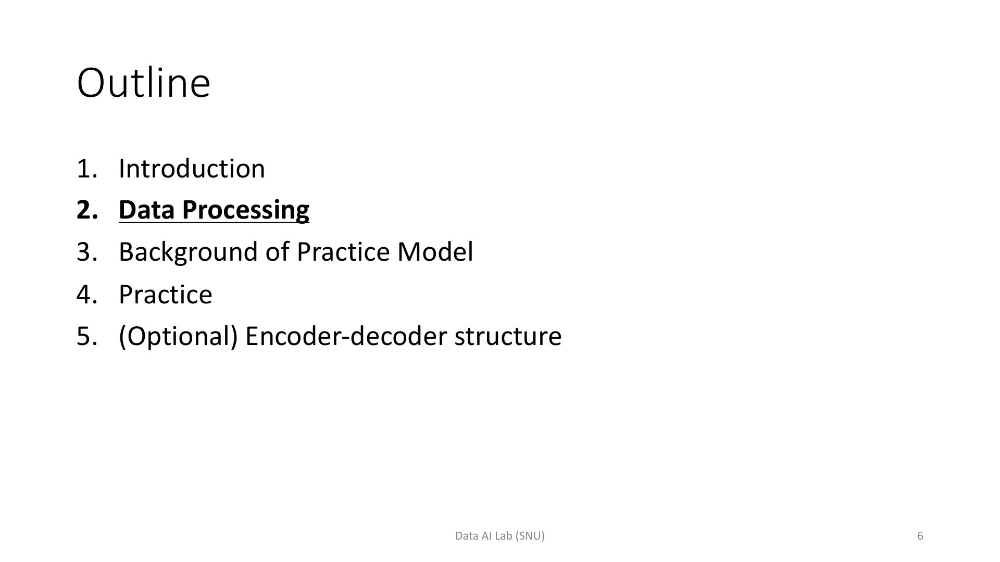

### OCR
- Outline
- 1. Introduction
- Data Processing
- 2.
- Background of Practice Model
- 3.
- Practice
- 4.
- 5. (Optional) Encoder-decoder structure
- Data Al Lab (SNU)

## Page 7

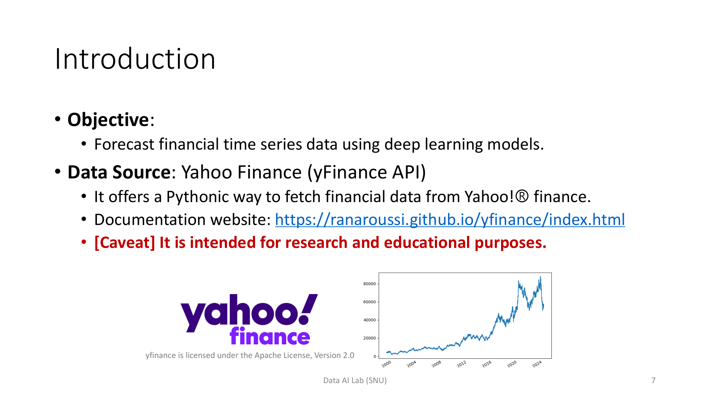

### OCR
- Introduction
- Objective:
- Forecast financial time series data using deep learning models.
- · Data Source: Yahoo Finance (yFinance APl)
- · It offers a Pythonic way to fetch financial data from Yahoo!? finance.
- Documentation website: https://ranaroussi.github.io/yfinance/index.html
- [Caveat] It is intended for research and educational purposes.
- 80000
- yahoo!
- 60000
- 40000
- finance
- 20000
- yfinance is licensed under the ApacheLicense, Version 2.0
- 2016
- 2024
- 2020
- 2008
- 2004
- DataAl Lab(SNU)

## Page 8

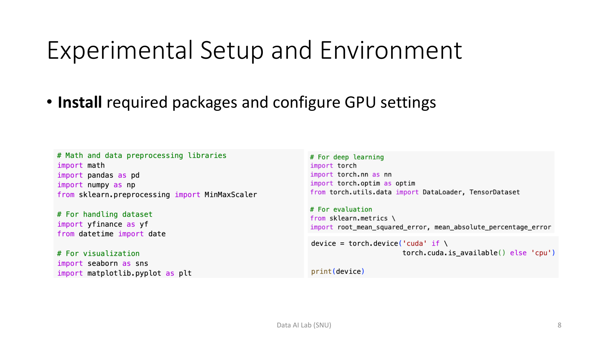

### OCR
- Experimental Setup and Environment
- Install required packages and configure GPU settings
- # Math and data preprocessing libraries
- #For deeplearning
- import math
- import torch
- import torch.nn as nn
- import pandas as pd
- import torch.optim as optim
- import numpy as np
- from torch.utils.data import DataLoader,TensorDataset
- from sklearn.preprocessing import MinMaxScaler
- #For evaluation
- #For handling dataset
- from sklearn.metrics\
- import yfinance as yf
- import root_mean_squared_error, mean_absolute_percentage_error
- from datetime import date
- device = torch.device('cuda'if\
- torch.cuda.is_available(） else 'cpu')
- #Forvisualization
- import seaborn as sns
- print(device)
- import matplotlib.pyplot as plt
- Data Al Lab (SNU)

## Page 9

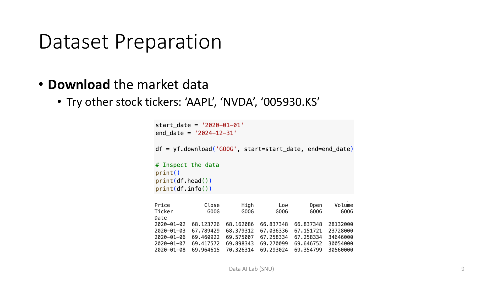

### OCR
- Dataset Preparation
- Download the market data
- ·Try other stock tickers: ‘AAPL, ‘NVDA', ‘005930.KS'
- start_date ='2020-01-01'
- end_date='2024-12-31'
- df = yf.download('GooG'， start=start_date, end=end_date)
- # Inspect the data
- print()
- print(df.head())
- print(df.info())
- High
- Volume
- Price
- Close
- Low
- Open
- GOOG
- GOOG
- Ticker
- GOOG
- GOOG
- GOOG
- Date
- 2020-01-02
- 68.123726
- 68.162086
- 66.837348
- 66.837348
- 28132000
- 2020-01-03
- 68.379312
- 23728000
- 67.789429
- 67.036336
- 67.151721
- 2020-01-06
- 69.460922
- 69.575007
- 67.258334
- 67.258334
- 34646000
- 2020-01-07
- 30054000
- 69.417572
- 69.898343
- 69.270099
- 69.646752
- 2020-01-0869.964615
- 70.32631469.29302469.35479930560000
- Data Al Lab (SNU)

## Page 10

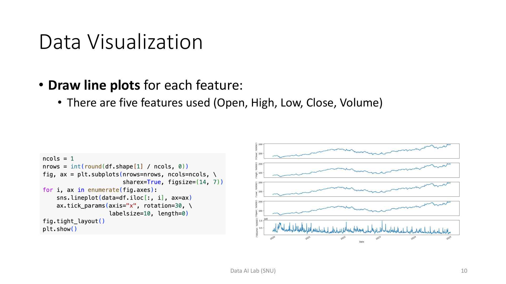

### OCR
- Data Visualization
- Draw line plots for each feature:
- There are five features used (Open, High, Low, Close, Volume)
- ncols = 1
- nrows = int(round(df.shape[1] / ncols, 0))
- fig，ax = plt.subplots(nrows=nrows，ncols=ncols，)
- sharex=True, figsize=(14, 7))
- for i, ax in enumerate(fig.axes):
- sns.lineplot(data=df.iloc[:， i]， ax=ax)
- ax.tick_params(axis="x"，rotation=30，\
- labelsize=10,length=0)
- fig.tight_layout()
- plt.show()
- Data Al Lab (SNU)
- 10

## Page 11

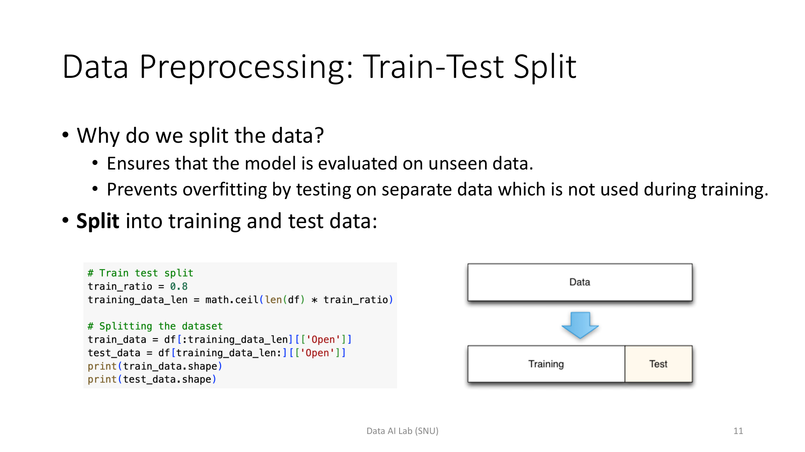

### OCR
- Data Preprocessing: Train-Test Split
- · Why do we split the data?
- Ensures that the model is evaluated on unseen data.
- Prevents overfitting by testing on separate data which is not used during training.
- · Split into training and test data:
- # Train test split
- Data
- train_ratio = 0.8
- training_data_len = math.ceil(len(df) * train_ratio)
- # Splitting the dataset
- train_data = df[:training_data_len] [['Open']]
- test_data = df[training_data_len:][['Open']]
- Training
- Test
- print(train_data.shape)
- print(test_data.shape)
- Data Al Lab (SNU)
- 11

## Page 12

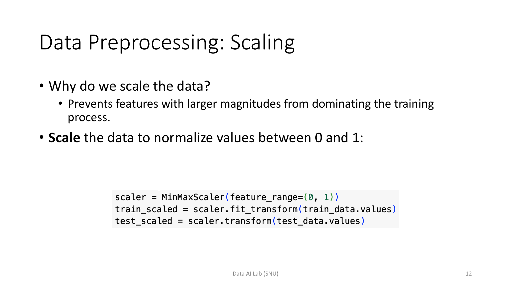

### OCR
- Data Preprocessing: Scaling
- · Why do we scale the data?
- · Prevents features with larger magnitudes from dominating the training
- process.
- · Scale the data to normalize values between O and 1:
- scaler = MinMaxScaler(feature_range=(0, 1))
- train_scaled = scaler.fit_transform(train_data.values)
- test_scaled = scaler.transform(test_data.values)
- Data Al Lab (SNU)
- 12

## Page 13

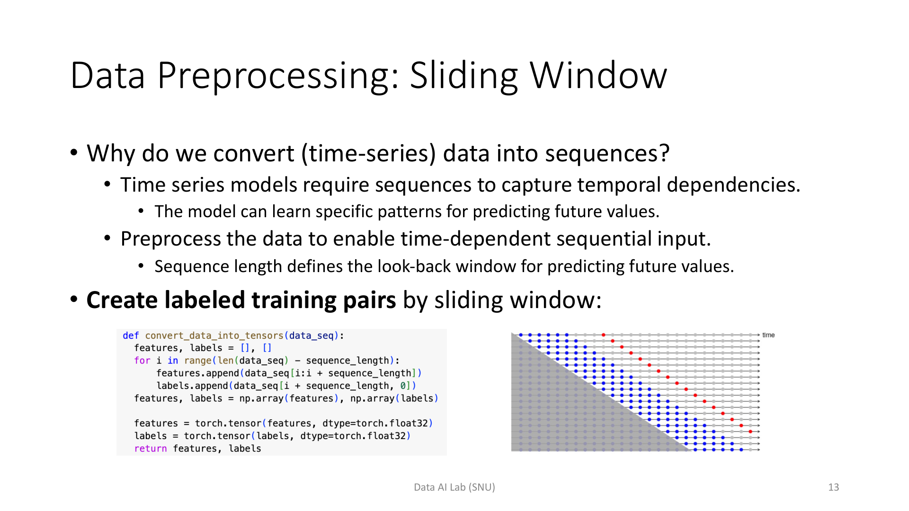

### OCR
- Data Preprocessing: Sliding Window
- · Why do we convert (time-series) data into sequences?
- · Time series models require sequences to capture temporal dependencies.
- · The model can learn specific patterns for predicting future values.
- · Preprocess the data to enable time-dependent sequential input.
- · Sequence length defines the look-back window for predicting future values.
- · Create labeled training pairs by sliding window:
- def convert_data_into_tensors(data_seq) :
- tlme
- features，labels = []，[]
- for i in range(len(data_seq) － sequence_length):
- features.append(data_seq [i:i + sequence_length])
- labels.append(data_seq[i + sequence_length, 0])
- features, labels = np.array(features), np.array(labels)
- features = torch.tensor(features， dtype=torch.float32)
- labels = torch.tensor(labels, dtype=torch.float32)
- return features，labels
- Data Al Lab (SNU)
- 13

## Page 14

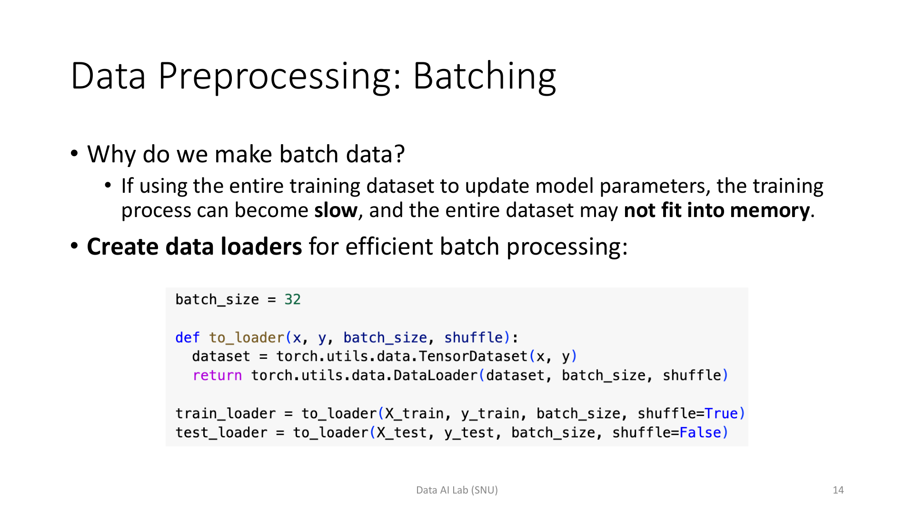

### OCR
- Data Preprocessing: Batching
- · Why do we make batch data?
- · If using the entire training dataset to update model parameters, the training
- process can become slow, and the entire dataset may not fit into memory.
- · Create data loaders for efficient batch processing:
- batch_size = 32
- def to_loader(x, y, batch_size, shuffle):
- dataset = torch.utils.data.TensorDataset(x, y)
- return torch.utils.data.DataLoader(dataset, batch_size, shuffle)
- train_loader = to_loader(x_train, y_train, batch_size, shuffle=True)
- test_loader = to_loader(X_test, y_test, batch_size, shuffle=False)
- Data Al Lab (SNU)
- 14

## Page 15

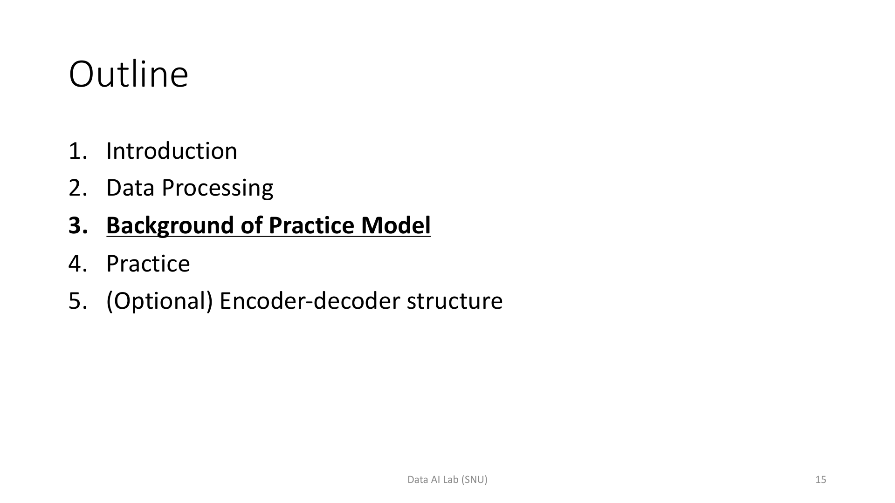

### OCR
- Outline
- 1. Introduction
- Data Processing
- 2.
- Background of Practice Model
- 3.
- Practice
- 4.
- 5. (Optional) Encoder-decoder structure
- Data Al Lab (SNU)
- 15

## Page 16

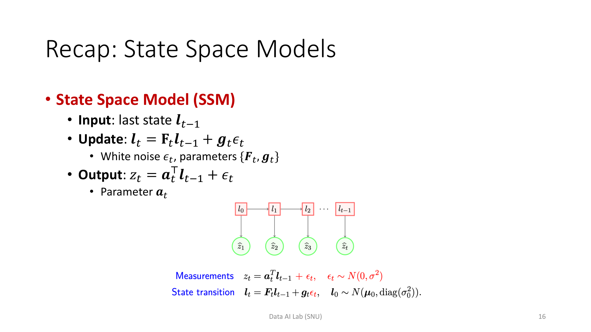

### OCR
- Recap: State Space Models
- State Space Model (SSM)
- ·Input: last state It-1
- Update: lt = Ftlt-1 + gtEt
- · White noise Et, parameters {Ft, 9t}
- · Output: Zt = atlt-1 + Et
- · Parameter at
- l1
- t-
- 23
- 21
- 22
- Et～ N(0,o²)
- 2t = alt-1 + Et，
- Measurements
- lo ~ N(μo, diag(o?)).
- State transition
- lt= Ftlt-1 + gtEt,
- Data Al Lab (SNU)
- 16

## Page 17

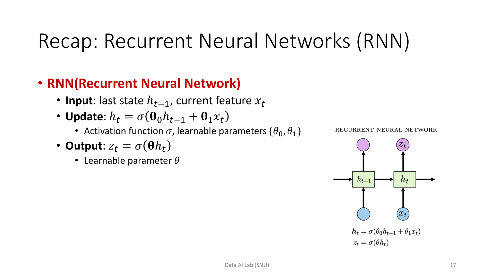

### OCR
- Recap: Recurrent Neural Networks (RNN)
- RNN(Recurrent Neural Network)
- · Input: last state ht-1, current feature xt
- Update: ht = o(0oht-1 + 01xt)
- · Activation function o, learnable parameters {0o, θ1}
- RECURRENTNEURALNETWORK
- · Output: Zt = o(Oht)
- · Learnable parameter θ
- ht-1
- ht
- ct
- ht = o(0oht-1 + 01ct)
- 2t = o(0ht)
- Data Al Lab (SNU)

## Page 18

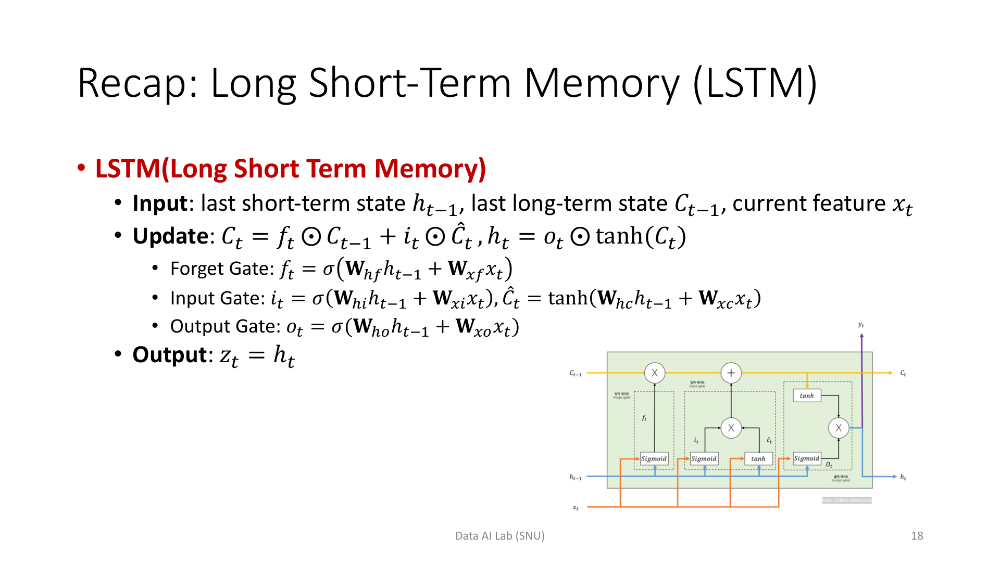

### OCR
- Recap: Long Short-Term Memory (LSTM)
- LSTM(Long Short Term Memory)
- · Input: last short-term state ht-1, last long-term state Ct-1, current feature xt
- Update: Ct = ft O Ct-1 + it O Ct, ht = Ot O tanh(Ct)
- · Forget Gate: ft = o(Wnfht-1 + Wxfxt)
- Input Gate: it = o(Wniht-1 + Wxixt), Ct = tanh(Wncht-1 + Wxcxt)
- Output Gate: Ot = o(Wnoht-1 + Wxoxt)
- Output: Zt = ht
- tanh
- Sigmoid
- Sigmoid
- tanh
- Sigmoid
- Data Al Lab (SNU)
- 18

## Page 19

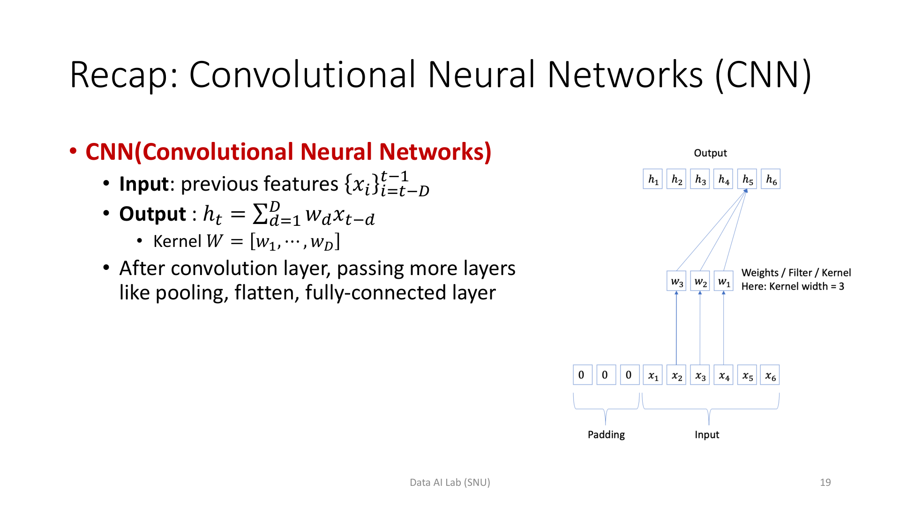

### OCR
- Recap: Convolutional Neural Networks (CNN)
- CNN(Convolutional Neural Networks)
- Output
- · Kernel W = [w1,···,WD]
- After convolution layer, passing more layers
- Weights/Filter/Kernel
- W1
- Here:Kernelwidth=3
- like pooling, flatten, fully-connected layer
- Padding
- Input
- Data Al Lab (SNU)
- 19

## Page 20

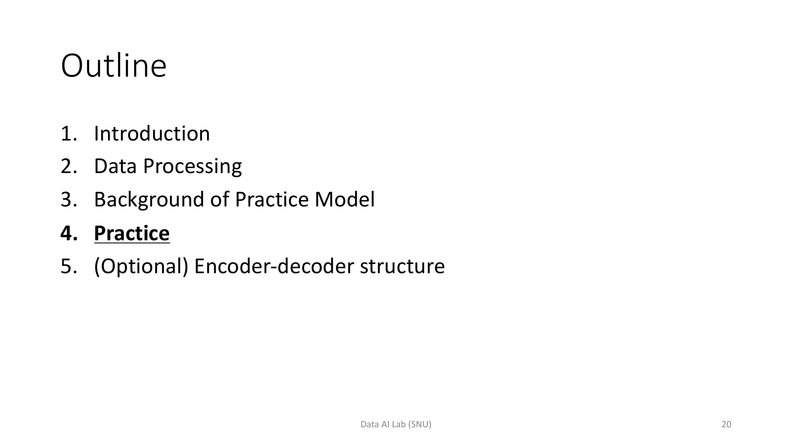

### OCR
- Outline
- 1. Introduction
- Data Processing
- 2.
- Background of Practice Model
- 3. B
- Practice
- 4.
- 5. (Optional) Encoder-decoder structure
- Data Al Lab (SNU)
- 20

## Page 21

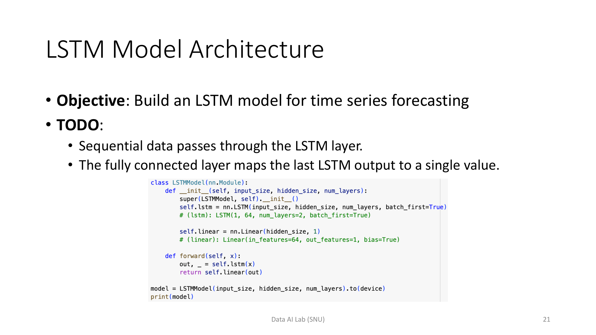

### OCR
- LSTM Model Architecture
- · Objective: Build an LSTM model for time series forecasting
- · TODO:
- · Sequential data passes through the LSTM layer.
- · The fully connected layer maps the last LSTM output to a single value.
- class LSTMModel(nn.Module):
- def _init_(self，input_size,hidden_size,num_layers):
- super(LSTMModel，self).__init__()
- self.lstm = nn.LSTM(input_size, hidden_size, num_layers, batch_first=True)
- #(lstm):LSTM(1， 64,num_layers=2,batch_first=True)
- self.linear = nn.Linear(hidden_size,1)
- # (linear): Linear(in_features=64, out_features=1, bias=True)
- def forward(self， x):
- out，_= self.lstm(x)
- return self.linear(out)
- model = LSTMModel(input_size, hidden_size, num_layers).to(device)
- print(model)
- Data Al Lab (SNU)
- 21

## Page 22

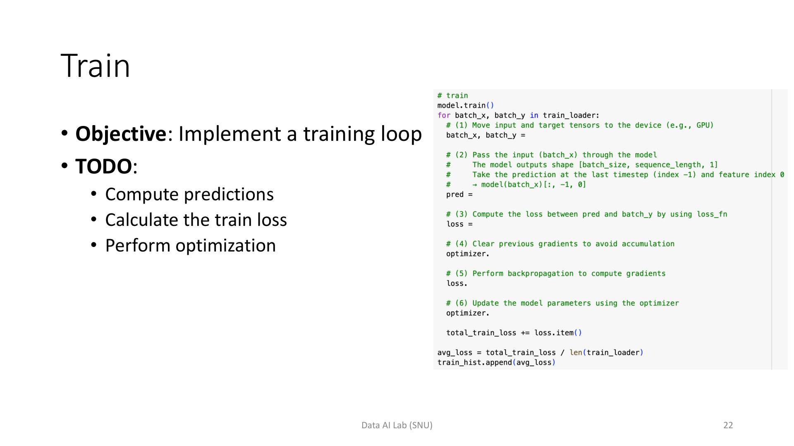

### OCR
- Train
- # train
- model.train()
- for batch_x，batch_y in train_loader:
- # (1) Move input and target tensors to the device (e.g., GPU)
- · Objective: Implement a training loop
- batch_x，batch_y =
- #（2）Pass the input（batch_x）through the model
- TODO:
- The model outputs shape [batch_size，sequence_length，1]
- #
- Take the prediction at the last timestep(index -1）and feature index 0
- #
- →model(batch_x)[:，-1，0]
- #
- · Compute predictions
- pred =
- b  ua  d  s a o (） #
- Calculate the train loss
- loss：
- ·Perform optimization
- #（4）Clearpreviousgradients toavoidaccumulation
- optimizer.
- #（5） Perform backpropagation to compute gradients
- loss.
- #（6）Update the model parameters using the optimizer
- optimizer.
- total_train_loss += loss.item()
- avg_loss = total_train_loss / len(train_loader)
- train_hist.append(avg_loss)
- Data Al Lab (SNU)
- 22

## Page 23

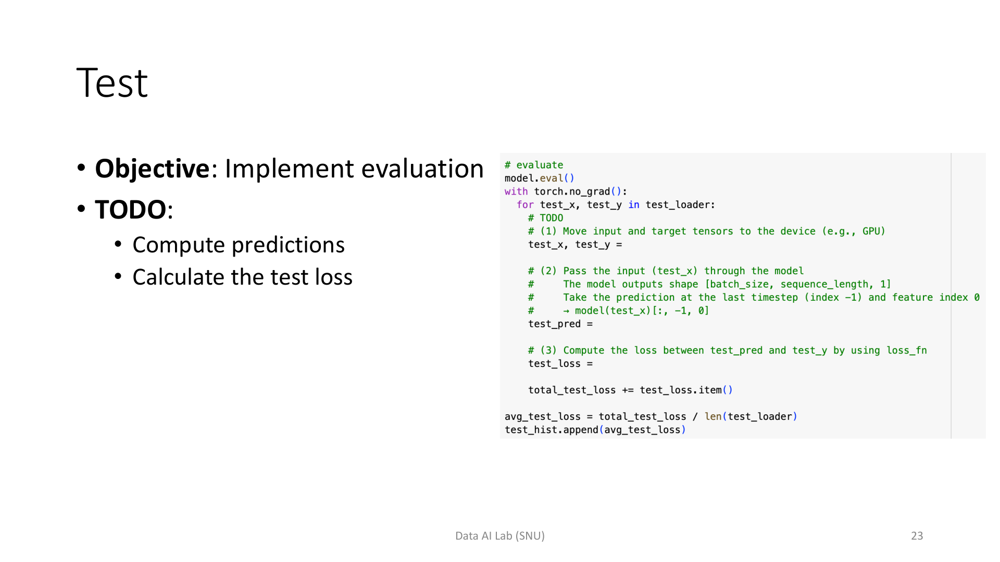

### OCR
- Test
- · Objective: Implement evaluation
- # evaluate
- model.eval()
- with torch.no_grad():
- TODO:
- for test_x, test_y in test_loader:
- #TODO
- # (1) Move input and target tensors to the device (e.g., GPU)
- · Compute predictions
- test_x, test_y =
- #（2）Pass the input （test_x）through the model
- Calculate the test loss
- The model outputs shape [batch_size, sequence_length, 1]
- #
- Take the prediction at the last timestep (index -1） and feature index 0
- #
- →model(test_x)[:，-1，0]
- #
- test_pred =
- o      a    () #
- test_loss =
- total_test_loss += test_loss.item()
- avg_test_loss = total_test_loss / len(test_loader)
- test_hist.append(avg_test_loss)
- Data Al Lab (SNU)
- 23

## Page 24

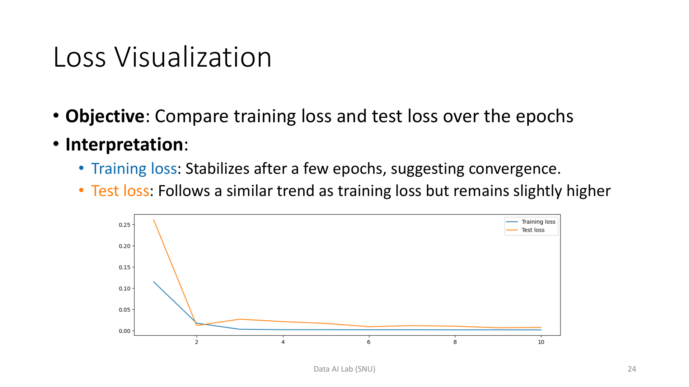

### OCR
- LossVisualization
- · Objective: Compare training loss and test loss over the epochs
- Interpretation:
- Training loss: Stabilizes after a few epochs, suggesting convergence.
- Test loss: Follows a similar trend as training loss but remains slightly higher
- Training loss
- 0.25
- Test loss
- 0.20
- 0.15
- 0.10
- 0.05
- 0.00
- 10
- Data Al Lab (SNU)
- 24

## Page 25

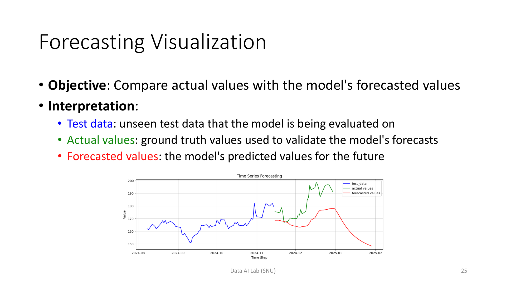

### OCR
- Forecasting Visualization
- · Objective: Compare actual values with the model's forecasted values
- Interpretation:
- Test data: unseen test data that the model is being evaluated on
- Actual values: ground truth values used to validate the model's forecasts
- TimeSeriesForecasting
- 200
- test_data
- actual values
- 190
- forecastedvalues
- 180
- value
- 170
- 160
- 150
- 2024-08
- 2025-02
- 2024-09
- 2024-11
- 2024-12
- 2025-01
- 2024-10
- Time Step
- DataAl Lab(SNU)
- 25

## Page 26

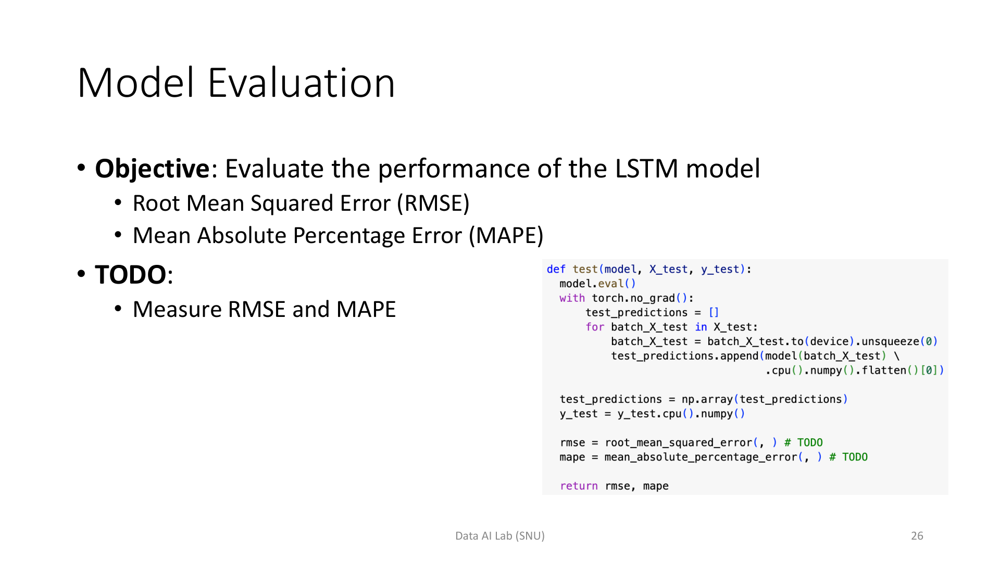

### OCR
- Model Evaluation
- Objective: Evaluate the performance of the LSTM model
- Root Mean Squared Error (RMSE)
- Mean Absolute Percentage Error (MAPE)
- def test(model, X_test,y_test):
- · TODO:
- model.eval()
- with torch.no_grad():
- ·Measure RMSE and MAPE
- test_predictions = []
- for batch_X_test in X_test:
- batch_X_test = batch_X_test.to(device).unsqueeze(0)
- test_predictions.append(model(batch_X_test）\
- .cpu(）.numpy().flatten(）[0])
- test_predictions = np.array(test_predictions)
- y_test = y_test.cpu().numpy()
- rmse = root_mean_squared_error(，） # ToDo
- ：mean_absolute_percentage_error(，）#ToDo
- mape
- return rmse, mape
- Data Al Lab (SNU)
- 26

## Page 27

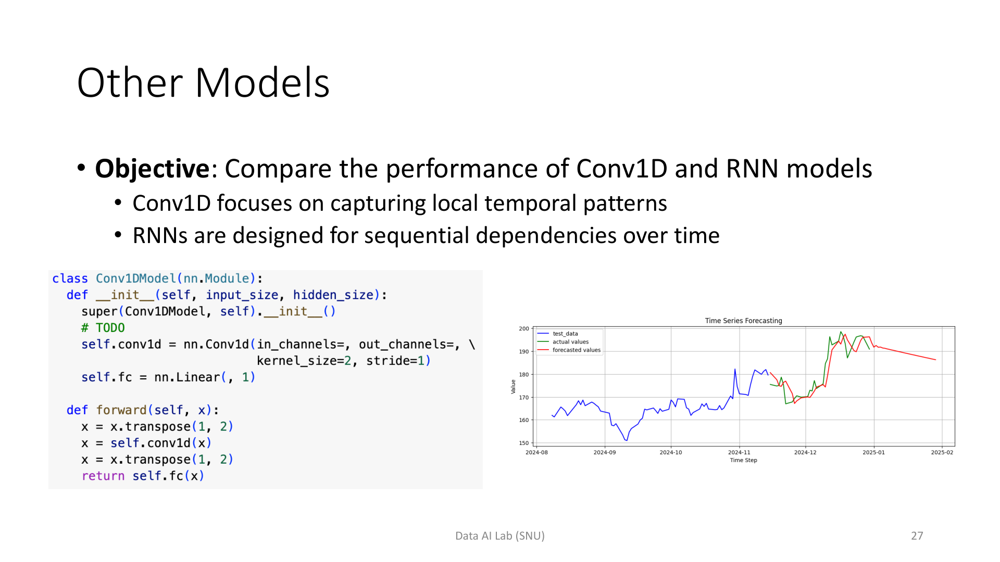

### OCR
- Other Models
- Objective: Compare the performance of Conv1D and RNN models
- Conv1D focuses on capturing local temporal patterns
- RNNs are designed for sequential dependencies over time
- class ConviDModel(nn.Module) :
- def _init__(self, input_size, hidden_size):
- super(ConviDModel, self).__init__()
- Time Series Forecasting
- #TODO
- 200
- test_data
- self.conv1d = nn.Conv1d(in_channels=，out_channels=,\
- actual values
- forecasted values
- 190
- kernel_size=2, stride=1)
- self.fc = nn.Linear(， 1)
- 180
- 170
- def forward(self， x):
- 160
- x = x.transpose(1， 2)
- x = self.convld(x)
- 150
- 2024-08
- 2024-09
- 2024-10
- 2024-11
- 2024-12
- 2025-01
- 2025-02
- x = x.transpose(1， 2)
- Time Step
- return self.fc(x)
- Data Al Lab (SNU)
- 27

## Page 28

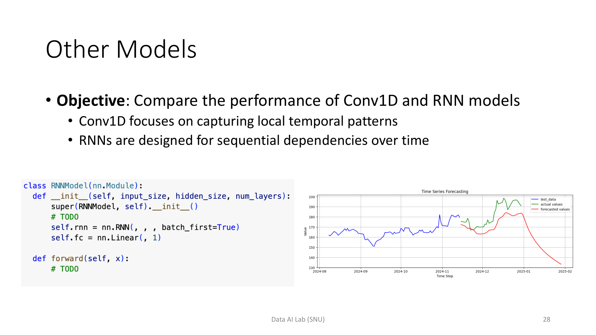

### OCR
- Other Models
- Objective: Compare the performance of Conv1D and RNN models
- Conv1D focuses on capturing local temporal patterns
- RNNs are designed for sequential dependencies over time
- class RNNModel(nn.Module):
- TimeSeriesForecasting
- def _init__(self, input_size, hidden_size, num_layers):
- 200
- test_data
- super(RNNModel， self)._init_()
- actual values
- 190
- forecasted values
- #TODO
- 180
- self.rnn = nn.RNN(, , , batch_first=True)
- 170
- Value
- self.fc = nn.Linear(, 1)
- 160
- 150
- def forward(self， x):
- 140
- #TODO
- 130
- 2024-11
- 2024-12
- 2024-09
- 2024-10
- 2025-01
- 2024-08
- 2025-02
- Time Step
- Data Al Lab (SNU)
- 28

## Page 29

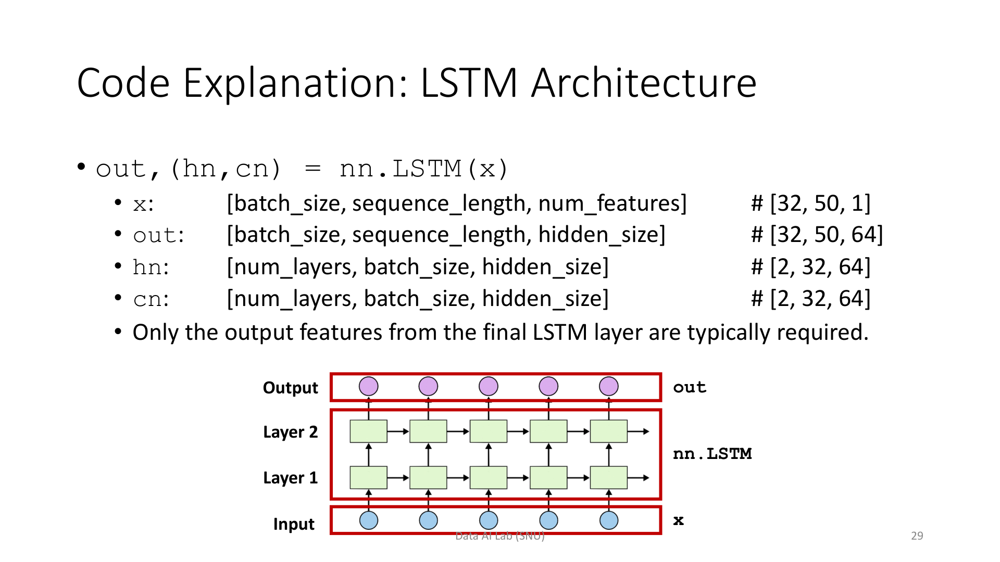

### OCR
- Code Explanation: LSTM Architecture
- out,(hn,cn)
- )= nn.LSTM(x)
- [batch_size, sequence_length, num_features]
- # [32, 50, 1]
- X:
- [batch_size, sequence_length, hidden_size]
- #[32, 50, 64]
- out:
- [num_layers, batch_size, hidden_size]
- hn:
- #[2, 32, 64]
- # [2, 32, 64]
- [num_layers, batch_size, hidden_size]
- cn:
- out
- Output
- Layer 2
- nn.LSTM
- Layer 1
- Input
- X
- 29
- DataATLab (SNU)

## Page 30

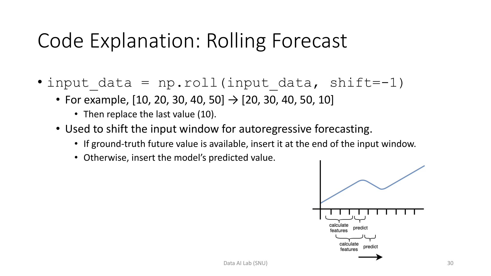

### OCR
- Code Explanation: Rolling Forecast
- input data = np.roll(input data, shift=-l)
- For example, [10, 20, 30, 40, 50] → [20, 30, 40, 50, 10]
- Then replace the last value (10).
- · Used to shift the input window for autoregressive forecasting.
- · If ground-truth future value is available, insert it at the end of the input window.
- Otherwise, insert the model's predicted value.
- calculate
- predict
- features
- L
- calculate
- predict
- features
- Data Al Lab (SNU)
- 30

## Page 31

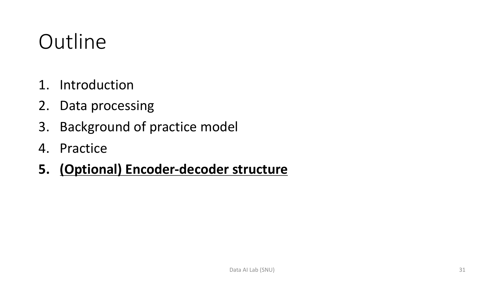

### OCR
- Outline
- 1. Introduction
- Data processing
- 2.
- Background of practice model
- 3. E
- Practice
- 4.
- 5. (Optional) Encoder-decoder structure
- Data Al Lab (SNU)
- 31

## Page 32

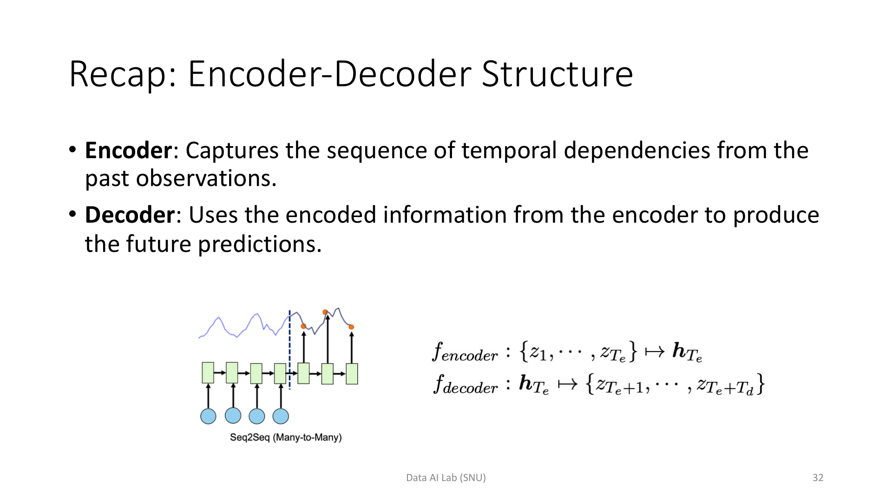

### OCR
- Recap: Encoder-Decoder Structure
- · Encoder: Captures the sequence of temporal dependencies from the
- past observations.
- Decoder: Uses the encoded information from the encoder to produce
- the future predictions.
- fencoder : {21,..· ,2Te} → hTe
- fdecoder : hTe > {zTe+1,··· , ZTe+Ta}
- Seq2Seq (Many-to-Many)
- Data Al Lab (SNU)
- 32

## Page 33

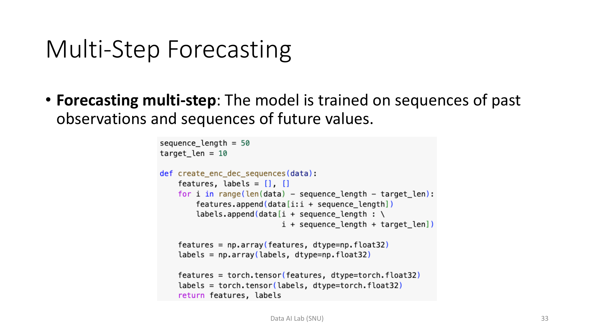

### OCR
- Multi-Step Forecasting
- Forecasting multi-step: The model is trained on sequences of past
- observations and sequences of future values.
- sequence_length = 50
- target_len = 10
- def create_enc_dec_sequences(data):
- features，labels =[]，[]
- for i in range(len(data) - sequence_length － target_len):
- features.append(data[i:i + sequence_length])
- labels.append(data[i + sequence_length :\
- i + sequence_length + target_len])
- features = np.array(features, dtype=np.float32)
- labels = np.array(labels，dtype=np.float32)
- features = torch.tensor(features, dtype=torch.float32)
- labels = torch.tensor(labels，dtype=torch.float32)
- return features, labels
- Data Al Lab (SNU)
- 33

## Page 34

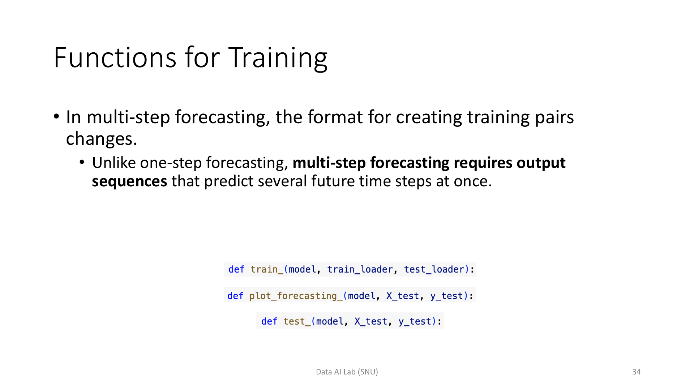

### OCR
- Functions for Training
- · In multi-step forecasting, the format for creating training pairs
- changes.
- Unlike one-step forecasting, multi-step forecasting requires output
- sequences that predict several future time steps at once.
- def train_(model, train_loader, test_loader):
- def plot_forecasting_(model, X_test, y_test):
- def test_(model, X_test, y_test):
- Data Al Lab (SNU)
- 34

## Page 35

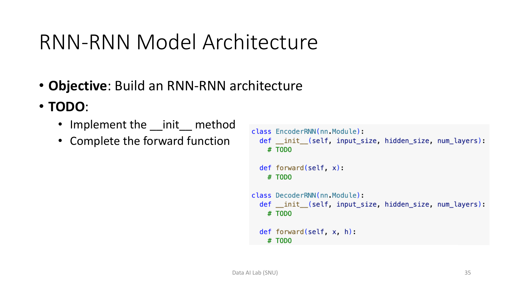

### OCR
- RNN-RNN ModeI Architecture
- · Objective: Build an RNN-RNN architecture
- TODO:
- Implement the __ init__method
- class EncoderRNN(nn.Module):
- Complete the forward function
- def
- __init__(self, input_size, hidden_size, num_layers):
- #TODO
- def forward(self, x) :
- #TODO
- classDecoderRNN(nn.Module):
- def _init__(self, input_size, hidden_size, num_layers):
- #TODO
- def forward(self, x, h):
- #TODO
- Data Al Lab (SNU)
- 35

## Page 36

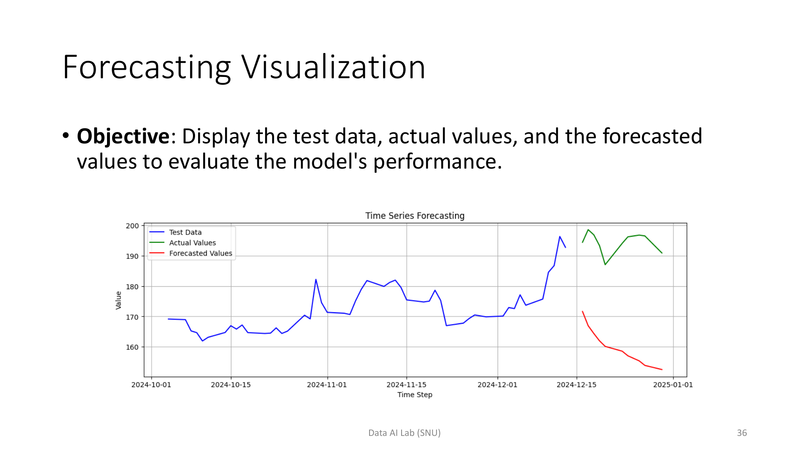

### OCR
- Forecasting Visualization
- Objective: Display the test data, actual values, and the forecasted
- values to evaluate the model's performance.
- TimeSeriesForecasting
- 200
- Test Data
- Actual Values
- ForecastedValues
- 190
- 180
- Value
- 170
- 160
- 2024-10-01
- 2024-10-15
- 2024-11-01
- 2024-11-15
- 2024-12-01
- 2024-12-15
- 2025-01-01
- Time Step
- Data Al Lab (SNU)
- 36

## Page 37

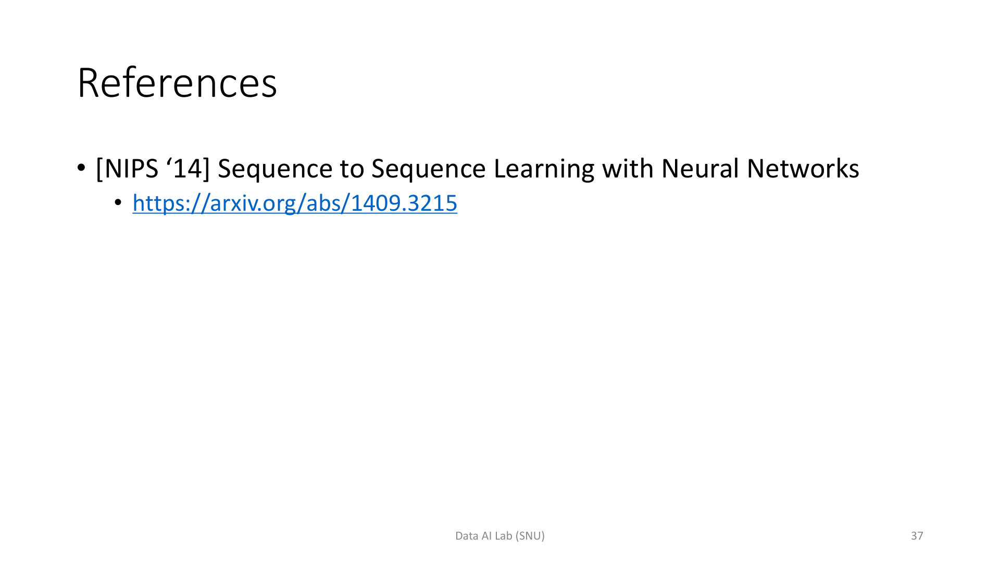

### OCR
- References
- [NiPs '14] Sequence to Sequence Learning with Neural Networks
- https://arxiv.0rg/abs/1409.3215
- DataAl Lab (SNU)
- 37
