# 5-recsys-basics

Source: `5-recsys-basics.pdf`

Pages: 37

## Page 1

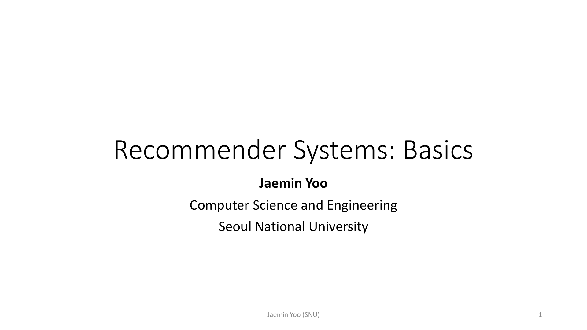

### OCR
- Recommender Systems: Basics
- Jaemin Yoo
- Computer Science and Engineering
- Seoul National University
- Jaemin Yoo (SNU)

## Page 2

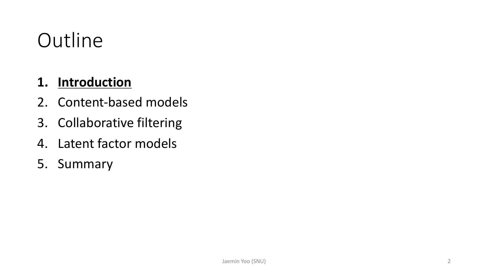

### OCR
- Outline
- Introduction
- 1.
- Content-based models
- 2.
- 3. Collaborative filtering
- 4. Latent factor models
- 5. Summary
- Jaemin Yoo (SNU)

## Page 3

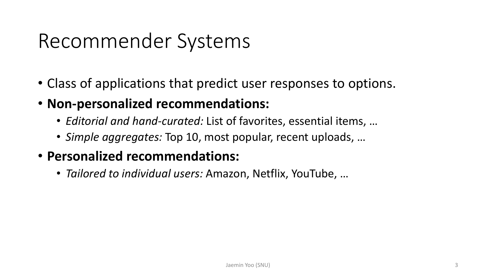

### OCR
- Recommender Systems
- · Class of applications that predict user responses to options.
- · Non-personalized recommendations:
- · Editorial and hand-curated: List of favorites, essential items, ...
- · Simple aggregates: Top 10, most popular, recent uploads, .
- · Personalized recommendations:
- · Tailored to individual users: Amazon, Netflix, YouTube, ..
- Jaemin Yoo (SNU)

## Page 4

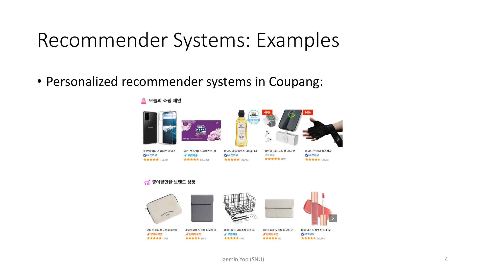

### OCR
- Recommender Systems: Examples
- Personalized recommender systems in Coupang:
- 49%
- 14%
- WART
- |, 485g, 17H
- 3in1  ||
- 类明会
- 早显圳会
- ★★★★★（217)
- ★★★★★（11623)
- ★★★★★（35.332)
- ★★★★★（43.753)
- ★★★★★(2.126)
- 2引0|三叫叠上三号早7
- 00|
- 恒告
- 2三  三 4 5g,
- 呈观明会
- ★★★★★（44)
- ★★★★★（265)
- ★★★★★(32.964)
- ★★★★★(592)
- ★★★★★（5)
- Jaemin Yoo (SNU)

## Page 5

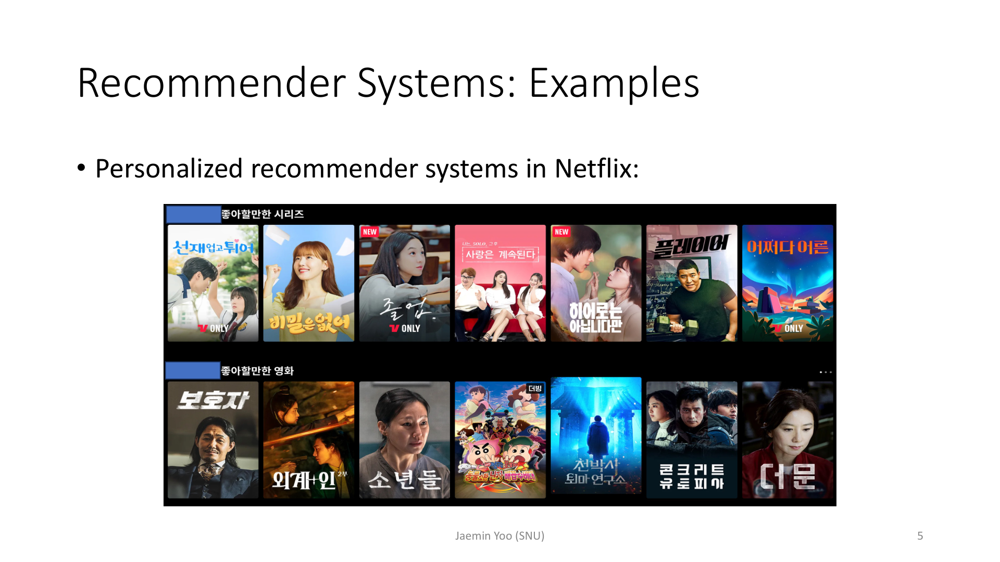

### OCR
- Recommender Systems: Examples
- Personalized recommender systems in Netflix:
- NEW
- NEW
- 10
- VONLY
- ONLY
- 惊品品金
- 品门
- 早克
- C十号
- E
- M10+LI
- Jaemin Yoo (SNU)

## Page 6

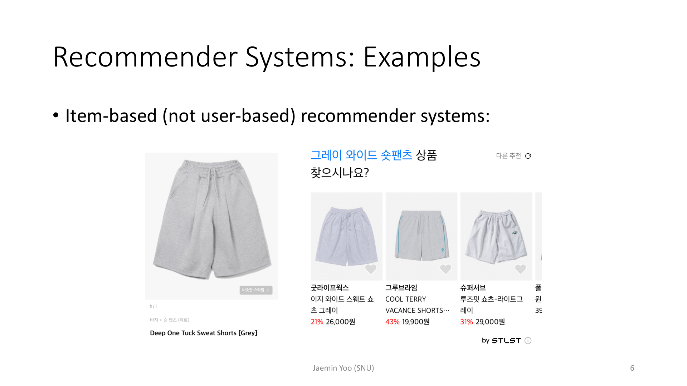

### OCR
- Recommender Systems: Examples
- Item-based (not user-based) recommender systems:
- ?
- 早买-0三二
- 居
- 0三
- COOL TERRY
- 引
- loll2
- 39
- VACANCESHORTS...
- >(）
- 21%26,000
- 43%19,900
- 31%29,000
- DeepOneTuckSweatShorts[Grey]
- by ≤TLsT ①
- Jaemin Yoo (SNU)

## Page 7

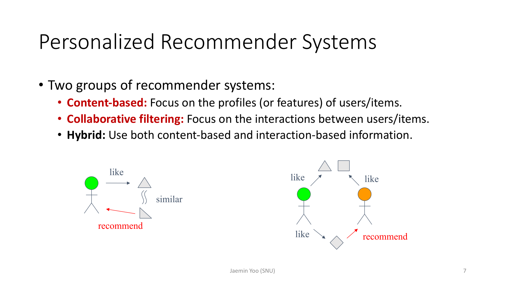

### OCR
- Personalized Recommender Systems
- · Two groups of recommender systems:
- Content-based: Focus on the profiles (or features) of users/items.
- Collaborative filtering: Focus on the interactions between users/items.
- Hybrid: Use both content-based and interaction-based information.
- like
- like
- like
- similar
- recommend
- like
- recommend
- JaeminYoo (SNU)

## Page 8

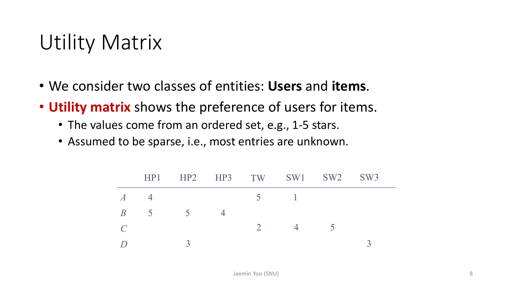

### OCR
- UtilityMatrix
- We consider two classes of entities: Users and items.
- Utility matrix shows the preference of users for items.
- The values come from an ordered set, e.g., 1-5 stars.
- Assumed to be sparse, i.e., most entries are unknown.
- SW1
- SW3
- HP1
- HP2
- HP3
- SW2
- TW
- B
- 5
- 2
- 3
- D
- JaeminYoo (SNU)

## Page 9

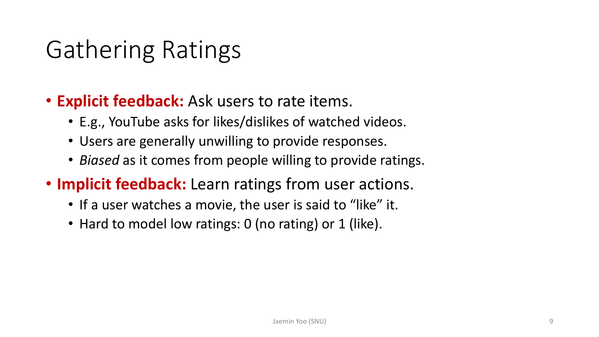

### OCR
- Gathering Ratings
- · Explicit feedback: Ask users to rate items.
- · E.g., YouTube asks for likes/dislikes of watched videos.
- · Users are generally unwilling to provide responses.
- · Biased as it comes from people willing to provide ratings.
- · Implicit feedback: Learn ratings from user actions.
- · If a user watches a movie, the user is said to "like" it.
- · Hard to model low ratings: 0 (no rating) or 1 (like).
- Jaemin Yoo (SNU)

## Page 10

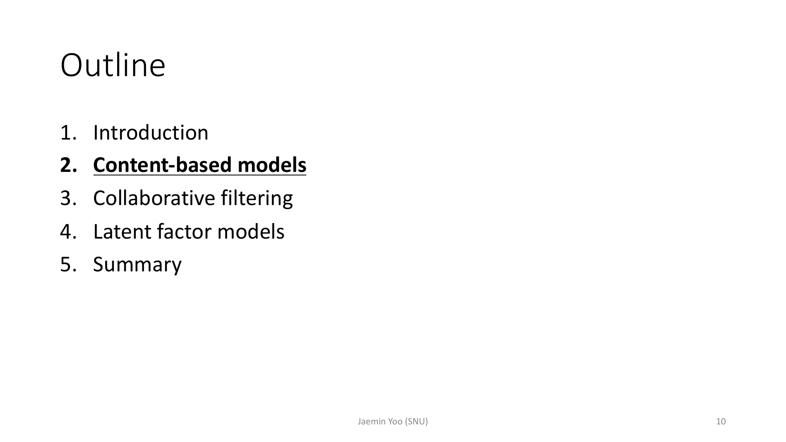

### OCR
- Outline
- 1. Introduction
- Content-based models
- 2.
- 3. Collaborative filtering
- 4. Latent factor models
- 5. Summary
- Jaemin Yoo (SNU)
- 10

## Page 11

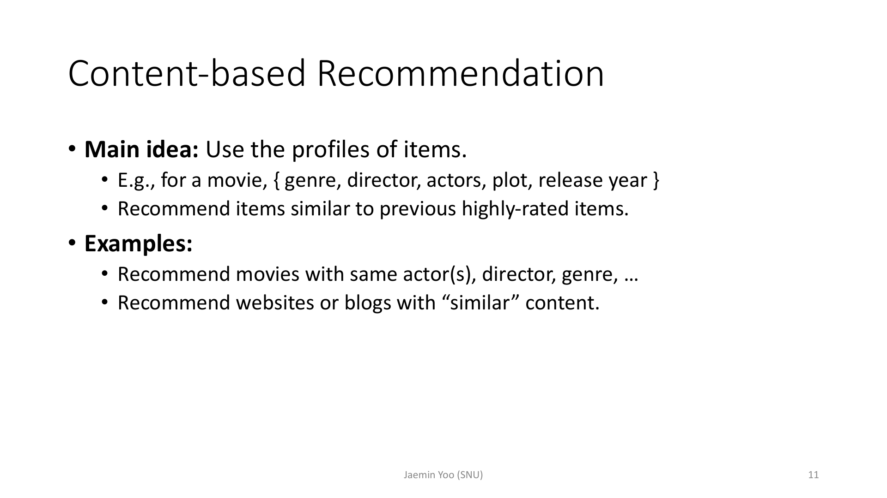

### OCR
- Content-based Recommendation
- · Main idea: Use the profiles of items.
- · E.g., for a movie, {genre, director, actors, plot, release year }
- · Recommend items similar to previous highly-rated items.
- ·Examples:
- · Recommend movies with same actor(s), director, genre, .
- · Recommend websites or blogs with "similar" content.
- Jaemin Yoo (SNU)
- 11

## Page 12

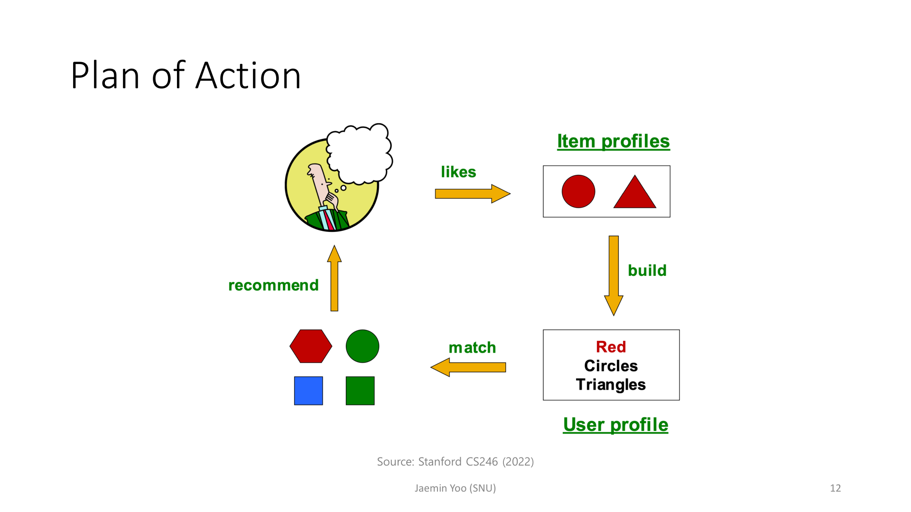

### OCR
- Plan of Action
- Item profiles
- likes
- build
- recommend
- match
- Red
- Circles
- Triangles
- User profile
- Source: Stanford CS246 (2022)
- Jaemin Yoo (SNU)
- 12

## Page 13

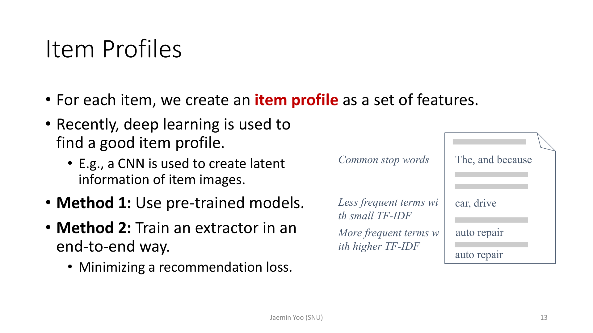

### OCR
- Item Profiles
- For each item, we create an item profile as a set of features.
- Recently, deep learning is used to
- find a good item profile.
- The, and because
- Common stop words
- E.g., a CNN is used to create latent
- information of item images.
- Method 1: Use pre-trained models.
- Less frequent terms wi
- car, drive
- thsmallTF-IDF
- Method 2: Train an extractor in an
- auto repair
- Morefrequent termsw
- end-to-end way.
- ithhigherTF-IDF
- auto repair
- Minimizing a recommendation loss.
- Jaemin Yoo (SNU)
- 13

## Page 14

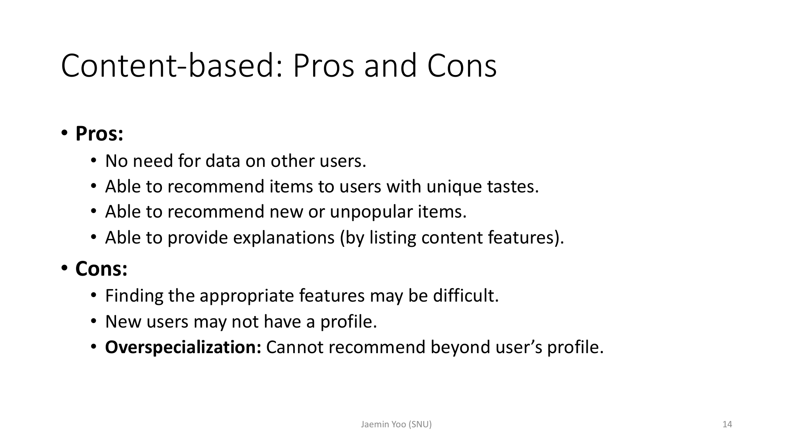

### OCR
- Content-based: Pros and Cons
- · Pros:
- · No need for data on other users.
- · Able to recommend items to users with unique tastes.
- · Able to recommend new or unpopular items.
- · Able to provide explanations (by listing content features).
- · Cons:
- · Finding the appropriate features may be difficult.
- New users may not have a profile.
- Overspecialization: Cannot recommend beyond user's profile.
- Jaemin Yoo (SNU)
- 14

## Page 15

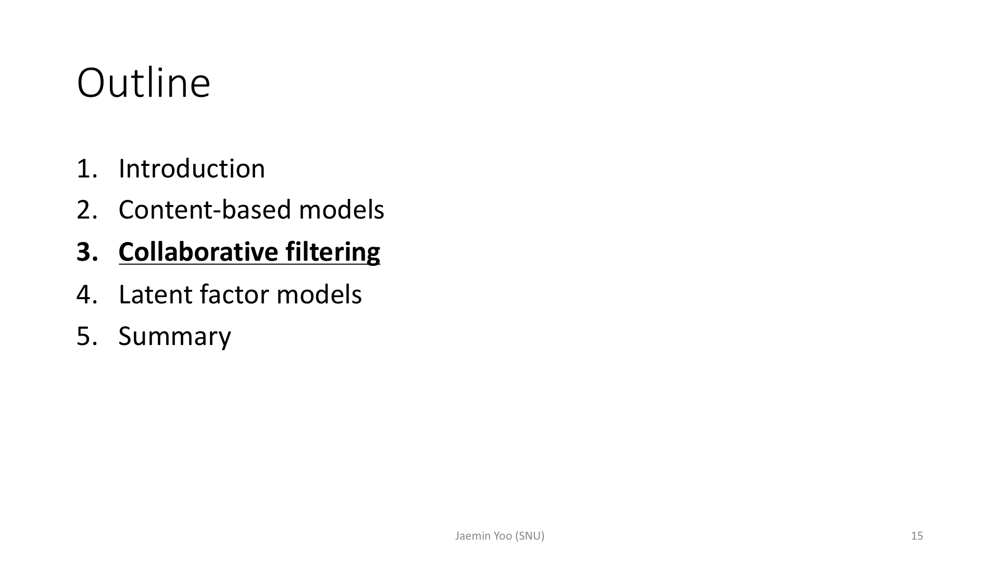

### OCR
- Outline
- 1. Introduction
- Content-based models
- 2. (
- 3. Collaborative filtering
- 4. Latent factor models
- 5. Summary
- Jaemin Yoo (SNU)
- 15

## Page 16

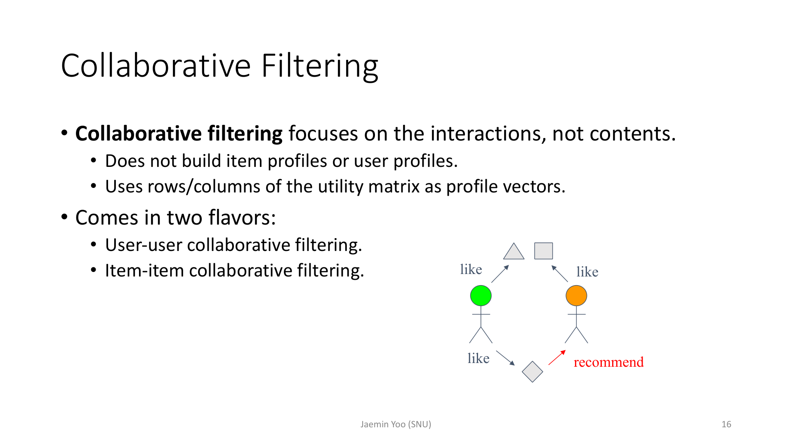

### OCR
- Collaborative Filtering
- · Collaborative filtering focuses on the interactions, not contents.
- Does not build item profiles or user profiles.
- Uses rows/columns of the utility matrix as profile vectors.
- Comes in two flavors:
- User-user collaborative filtering.
- Item-item collaborative filtering.
- like
- like
- like
- recommend
- Jaemin Yoo (SNU)
- 16

## Page 17

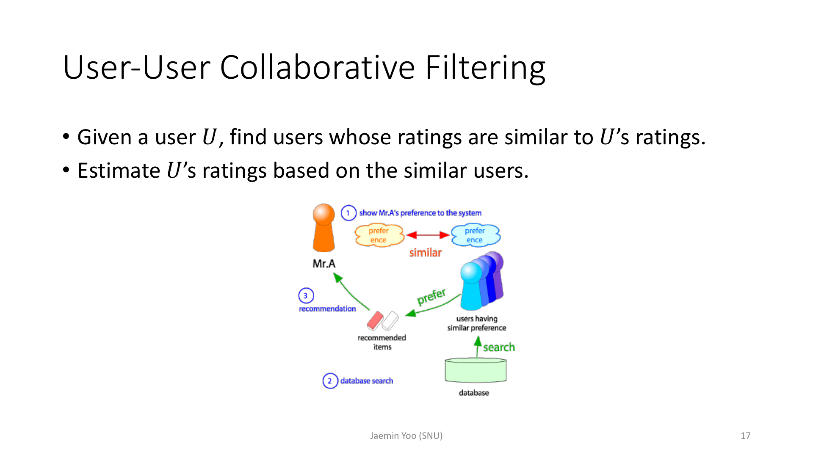

### OCR
- User-User Collaborative Filtering
- Given a user U, find users whose ratings are similar to U's ratings.
- Estimate U's ratings based on the similar users.
- show Mr.A's preference to the system
- prefer
- prefer
- ence
- ence
- similar
- Mr.A
- prefer
- recommendation
- users having
- similarpreference
- recommended
- search
- items
- database search
- database
- Jaemin Yoo (SNU)

## Page 18

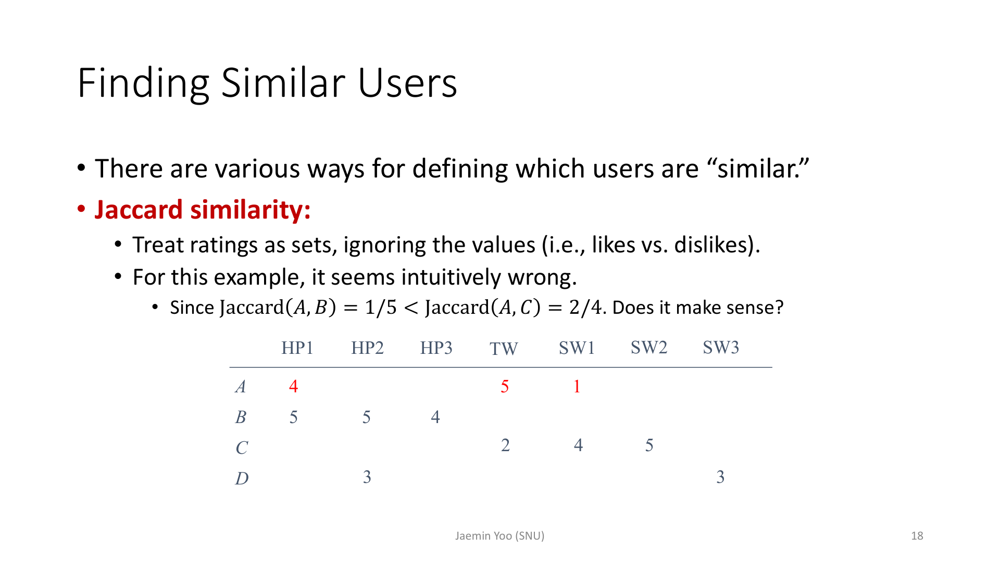

### OCR
- Finding Similar Users
- · There are various ways for defining which users are "similar."
- Jaccard similarity:
- Treat ratings as sets, ignoring the values (i.e., likes vs. dislikes).
- For this example, it seems intuitively wrong.
- · Since Jaccard(A, B) = 1/5 < Jaccard(A, C) = 2/4. Does it make sense?
- SW2
- SW3
- HP1
- HP3
- SW1
- HP2
- TW
- B
- 2
- 3
- JaeminYoo (SNU)
- 18

## Page 19

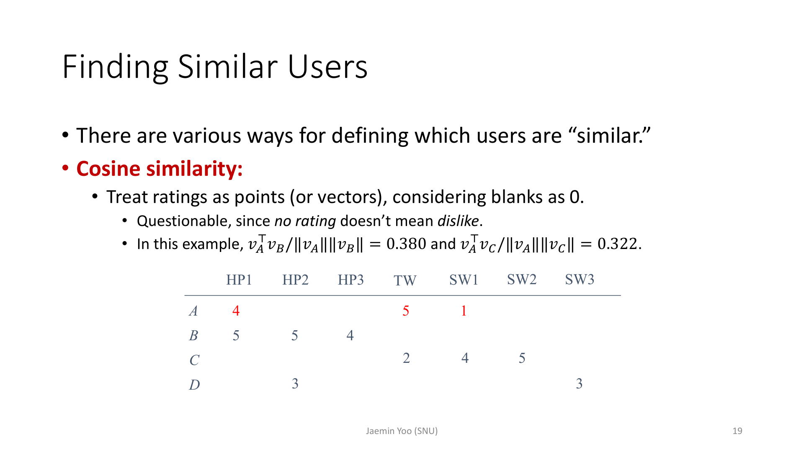

### OCR
- Finding Similar Users
- · There are various ways for defining which users are "similar"
- Cosine similarity:
- Treat ratings as points (or vectors), considering blanks as 0.
- Questionable, since no rating doesn't mean dislike.
- · In this example, vAvB/llvalllvBll = 0.380 and vAvc/llvalllvcll = 0.322.
- SW1
- SW2
- SW3
- HP1
- HP3
- HP2
- TW
- B
- 2
- 3
- JaeminYoo (SNU)
- 19

## Page 20

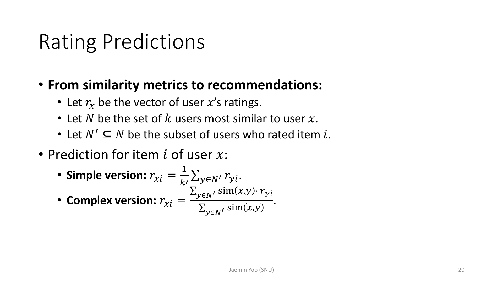

### OCR
- Rating Predictions
- · From similarity metrics to recommendations:
- · Let rx be the vector of user x's ratings.
- · Let N be the set of k users most similar to user x.
- · Let N' ≤ N be the subset of users who rated item i.
- · Prediction for item i of user x:
- · Simple version: rxi =
- Zyeny sim(x,y). ryi
- · Complex version: rxi =
- Zyen; sim(x,y)
- Jaemin Yoo (SNU)
- 20

## Page 21

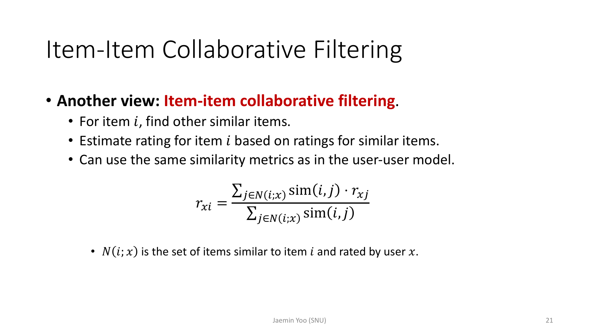

### OCR
- Item-ltem Collaborative Filtering
- · Another view: Item-item collaborative filtering.
- · For item i, find other similar items.
- Estimate rating for item i based on ratings for similar items.
- Can use the same similarity metrics as in the user-user model.
- ∑jeN(i;x) sim(i, j) · rxj
- rxi
- ∑jeN(i;x) sim(i,j)
- · N(i; x) is the set of items similar to item i and rated by user x.
- Jaemin Yoo (SNU)
- 21

## Page 22

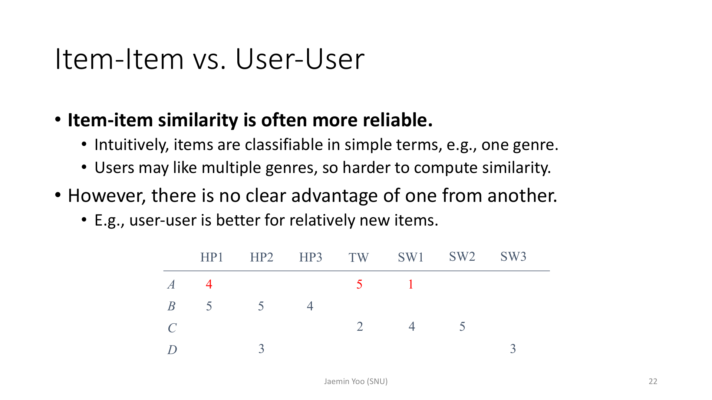

### OCR
- Item-ltem vs. User-User
- Item-item similarity is often more reliable.
- Intuitively, items are classifiable in simple terms, e.g., one genre.
- Users may like multiple genres, so harder to compute similarity.
- However, there is no clear advantage of one from another.
- · E.g., user-user is better for relatively new items.
- SW2
- SW3
- HP1
- SW1
- HP2
- HP3
- TW
- B
- 5
- 2
- D
- JaeminYoo (SNU)
- 22

## Page 23

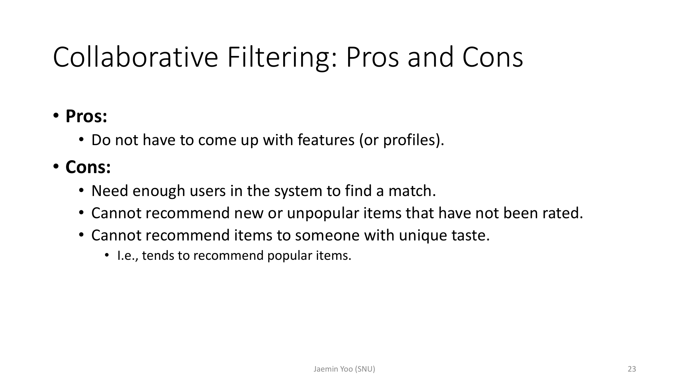

### OCR
- Collaborative Filtering: Pros and Cons
- · Pros:
- · Do not have to come up with features (or profiles).
- · Cons:
- · Need enough users in the system to find a match.
- · Cannot recommend new or unpopular items that have not been rated.
- Cannot recommend items to someone with unique taste.
- · I.e., tends to recommend popular items.
- Jaemin Yoo (SNU)
- 23

## Page 24

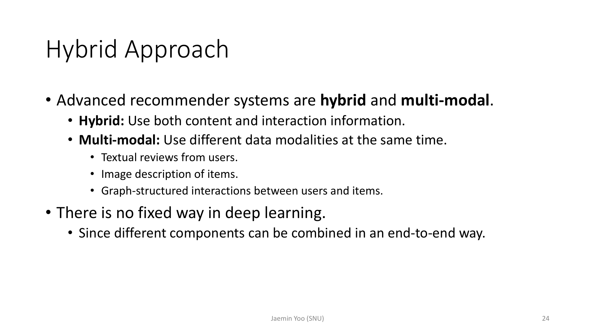

### OCR
- Hybrid Approach
- · Advanced recommender systems are hybrid and multi-modal.
- · Hybrid: Use both content and interaction information.
- · Multi-modal: Use different data modalities at the same time.
- · Textual reviews from users.
- · Image description of items.
- · Graph-structured interactions between users and items.
- · There is no fixed way in deep learning.
- · Since different components can be combined in an end-to-end way.
- Jaemin Yoo (SNU)
- 24

## Page 25

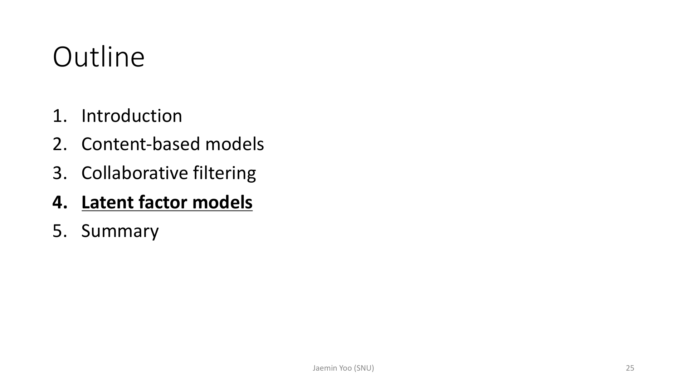

### OCR
- Outline
- 1. Introduction
- Content-based models
- 2. (
- 3. Collaborative filtering
- Latent factor models
- 4.
- 5. Summary
- Jaemin Yoo (SNU)
- 25

## Page 26

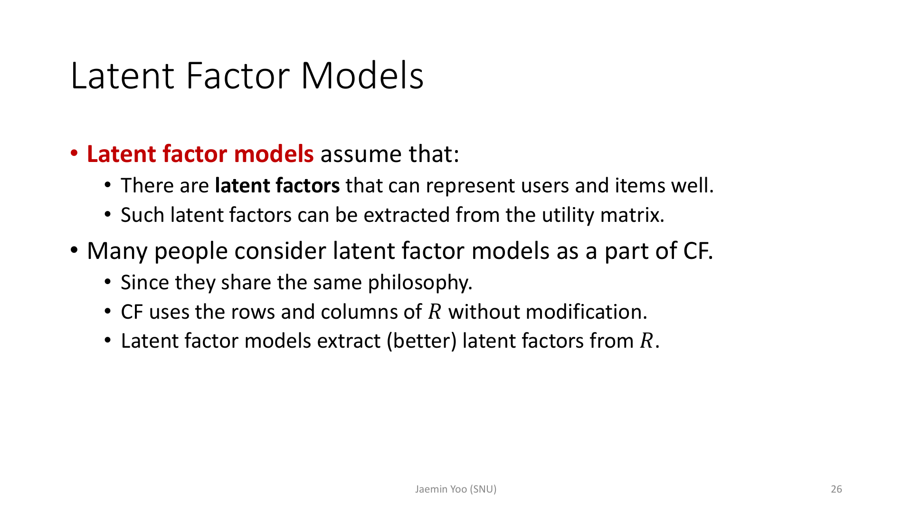

### OCR
- Latent Factor Models
- · Latent factor models assume that:
- · There are latent factors that can represent users and items well.
- · Such latent factors can be extracted from the utility matrix.
- · Many people consider latent factor models as a part of CF.
- · Since they share the same philosophy.
- · CF uses the rows and columns of R without modification.
- · Latent factor models extract (better) latent factors from R.
- Jaemin Yoo (SNU)
- 26

## Page 27

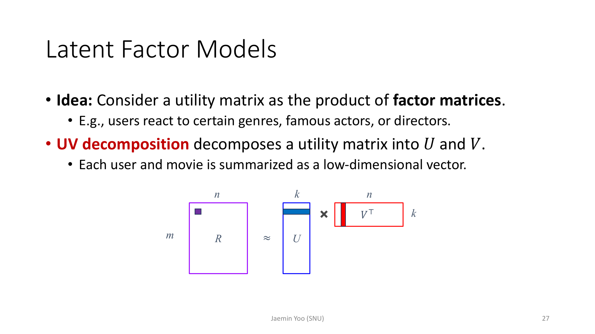

### OCR
- Latent Factor Models
- · Idea: Consider a utility matrix as the product of factor matrices.
- · E.g., users react to certain genres, famous actors, or directors.
- UV decomposition decomposes a utility matrix into U and V.
- · Each user and movie is summarized as a low-dimensional vector.
- n
- n
- 11
- m
- R
- JaeminYoo(SNU)
- 27

## Page 28

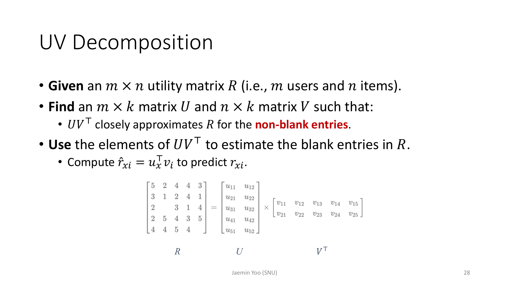

### OCR
- UV Decomposition
- · Given an m X n utility matrix R (i.e., m users and n items).
- · Find an m × k matrix U and n X k matrix V such that:
- · UvT closely approximates R for the non-blank entries.
- · Use the elements of UvT to estimate the blank entries in R.
- · Compute rxi = uxvi to predict rxi.
- u12
- 4
- 5
- 2
- 4
- 3
- U11
- u21
- 2
- 4
- U11
- U12
- U13
- U14
- V15
- 3
- 1
- U31
- U32
- U22
- U23
- U21
- U24
- U25
- 4
- 3
- 5
- 5
- U41
- U42
- 2
- 5
- 4
- 4
- U51
- U52
- R
- Jaemin Yoo (SNU)
- 28

## Page 29

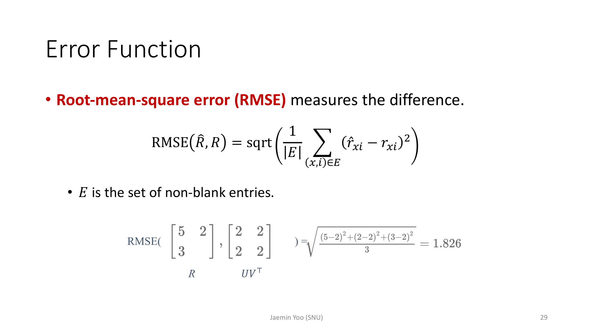

### OCR
- Error Function
- Root-mean-square error (RMSE)
- measures the difference.
- RMSE(R,R) = sqrt
- (fxi -rxi)2
- <
- [E
- (x,i)∈E
- E is the set of non-blank entries.
- (5-2)²+(2-2)²+(3-2)²
- RMSE(
- = 1.826
- 2
- 3
- 3
- 2
- UVT
- R
- Jaemin Yoo (SNU)
- 29

## Page 30

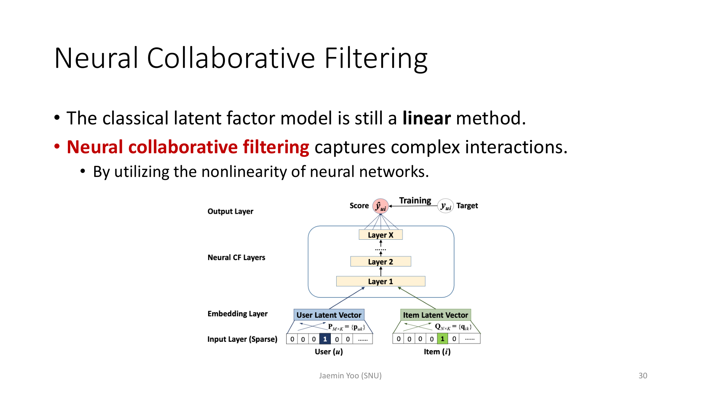

### OCR
- Neural Collaborative Filtering
- · The classical latent factor model is still a linear method.
- Neural collaborative filtering captures complex interactions.
- · By utilizing the nonlinearity of neural networks.
- Training
- Vui Target
- Score
- Output Layer
- LayerX
- ↑
- Neural CF Layers
- Layer2
- Layer 1
- Embedding Layer
- UserLatentVector
- ItemLatentVector
- PMxK={Puk
- QNxK={qik}
- InputLayer(Sparse)
- 0001
- User (u)
- Item (i)
- Jaemin Yoo (SNU)
- 30

## Page 31

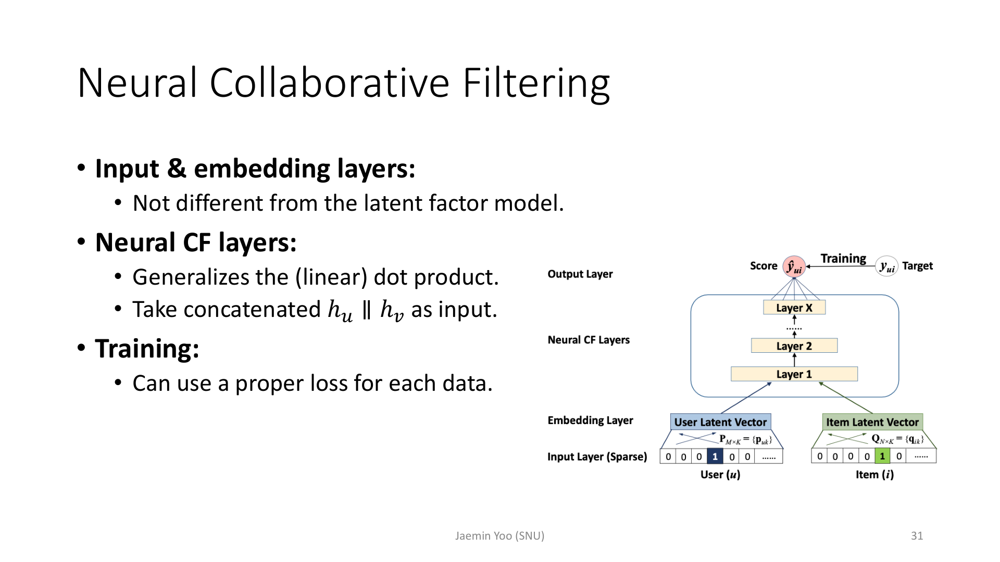

### OCR
- Neural Collaborative Filtering
- · Input & embedding layers:
- Not different from the latent factor model.
- Neural CF layers:
- Training
- yui Target
- Score
- Output Layer
- Generalizes the (linear) dot product.
- Take concatenated hu ll h, as input.
- LayerX
- ↑
- Neural CF Layers
- Training:
- Layer 2
- Layer 1
- Can use a proper loss for each data.
- Embedding Layer
- User Latent Vector
- Item Latent Vector
- QNxK ={qik}
- PMxK={Puk}
- Input Layer (Sparse)
- o
- 0
- User (u)
- Item (i)
- Jaemin Yoo (SNU)
- 31

## Page 32

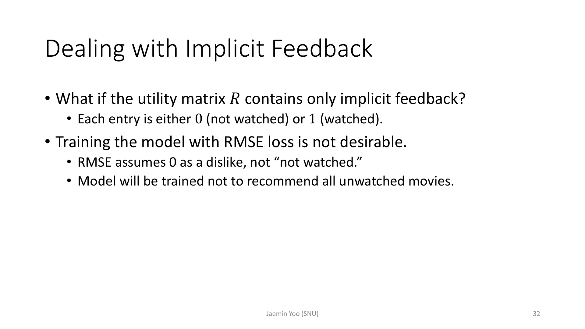

### OCR
- Dealing with Implicit Feedback
- · What if the utility matrix R contains only implicit feedback?
- · Each entry is either 0 (not watched) or 1 (watched).
- · Training the model with RMSE loss is not desirable.
- · RMSE assumes O as a dislike, not "not watched."
- · Model will be trained not to recommend all unwatched movies.
- Jaemin Yoo (SNU)
- 32

## Page 33

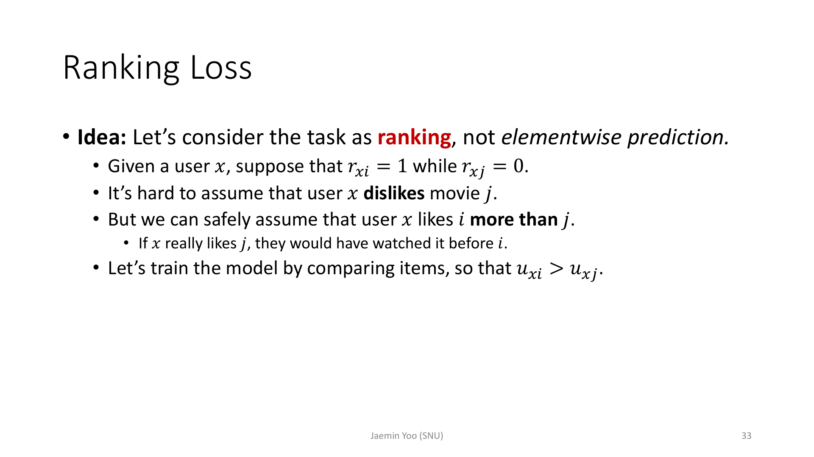

### OCR
- Ranking Loss
- · Idea: Let's consider the task as ranking, not elementwise prediction.
- · Given a user x, suppose that rxi = 1 while rxj = 0.
- · It's hard to assume that user x dislikes movie j.
- · But we can safely assume that user x likes i more than j.
- · If x really likes j, they would have watched it before i.
- - xn < ?xn yeut os 'swan! suueduos Aq lapow ayt uien s,ial .
- Jaemin Yoo (SNU)
- 33

## Page 34

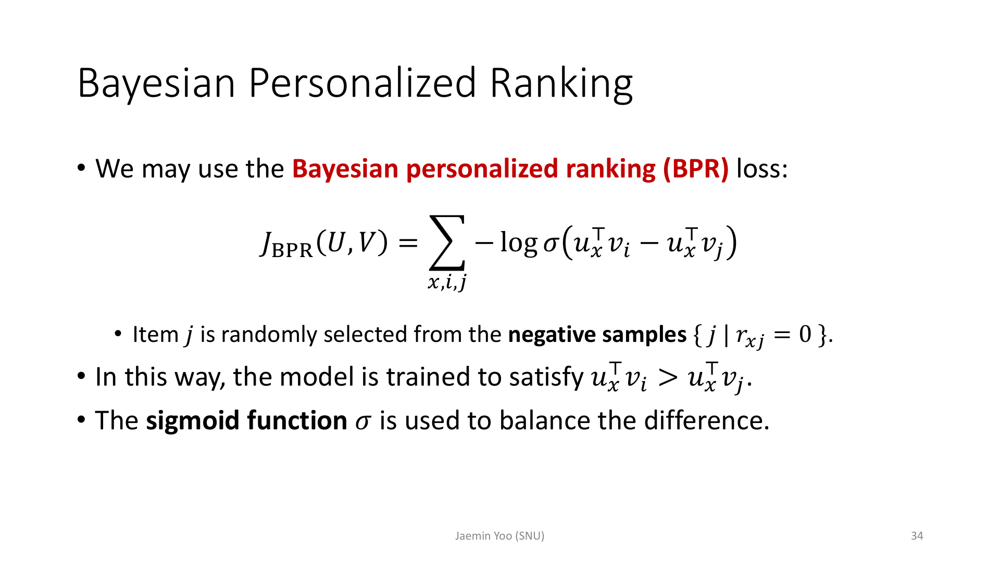

### OCR
- Bayesian Personalized Ranking
- · We may use the Bayesian personalized ranking (BPR) loss:
- Z
- JBPR(U, V) =
- logo(u-uj)
- x,i,j
- · Item j is randomly selected from the negative samples {j I rxj = 0 }.
- · In this way, the model is trained to satisfy u vi > u vj.
- · The sigmoid function o is used to balance the difference.
- Jaemin Yoo (SNU)
- 34

## Page 35

### OCR
- Sigmoid Function
- · Sigmoid function o limits the output to be [0, 1]:
- 1
- (xb
- 1 + e-x
- ·Maps (-oo, ∞o) to (0, 1) with o(0) = 0.5.
- 0.5
- Monotonically increasing for all ranges of x.
- -4
- -2
- 0
- Jaemin Yoo (SNU)
- 35

## Page 36

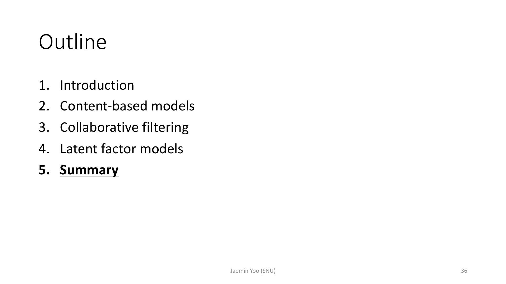

### OCR
- Outline
- 1. Introduction
- Content-based models
- 2. (
- 3. Collaborative filtering
- 4. Latent factor models
- 5. Summary
- Jaemin Yoo (SNU)
- 36

## Page 37

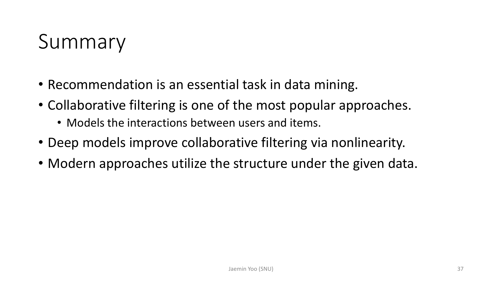

### OCR
- Summary
- · Recommendation is an essential task in data mining.
- · Collaborative filtering is one of the most popular approaches.
- · Models the interactions between users and items.
- · Deep models improve collaborative filtering via nonlinearity.
- · Modern approaches utilize the structure under the given data.
- Jaemin Yoo (SNU)
- 37
