# 6-recsys-advanced

Source: `data/6-recsys-advanced.pdf`

Pages: 38

## Page 1

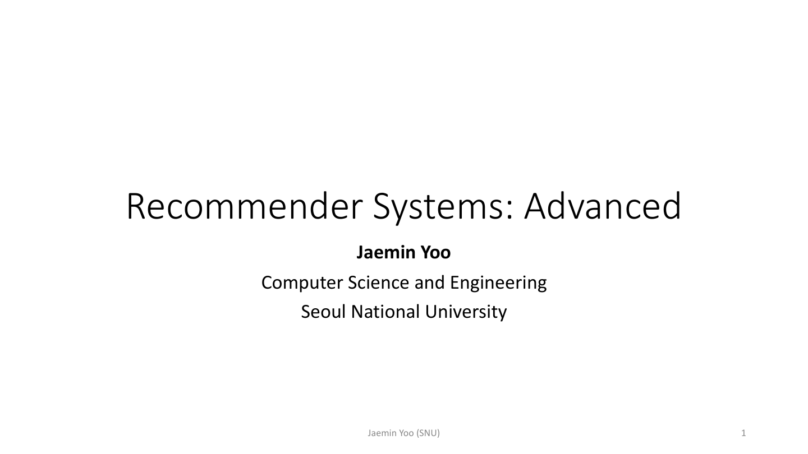

### OCR
- Recommender Systems: Advanced
- Jaemin Yoo
- Computer Science and Engineering
- Seoul National University
- Jaemin Yoo (SNU)

## Page 2

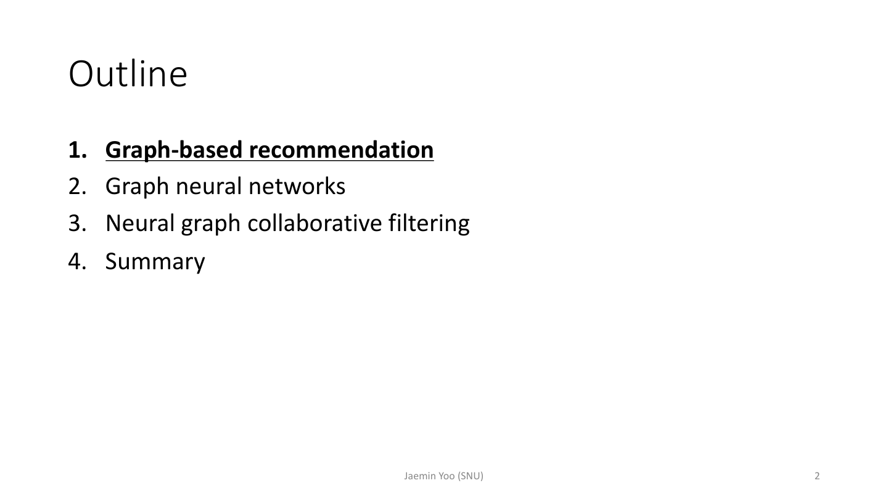

### OCR
- Outline
- 1.
- Graph-based recommendation
- 2.
- Graph neural networks
- Neural graph collaborative filtering
- 3.
- 4. Summary
- Jaemin Yoo (SNU)

## Page 3

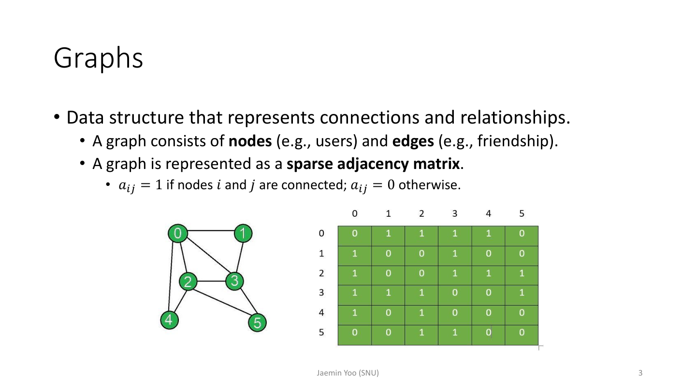

### OCR
- Graphs
- · Data structure that represents connections and relationships.
- · A graph consists of nodes (e.g., users) and edges (e.g., friendship).
- · A graph is represented as a sparse adjacency matrix.
- · aij = 1 if nodes i and j are connected; aij = 0 otherwise.
- 2
- O
- Jaemin Yoo (SNU)

## Page 4

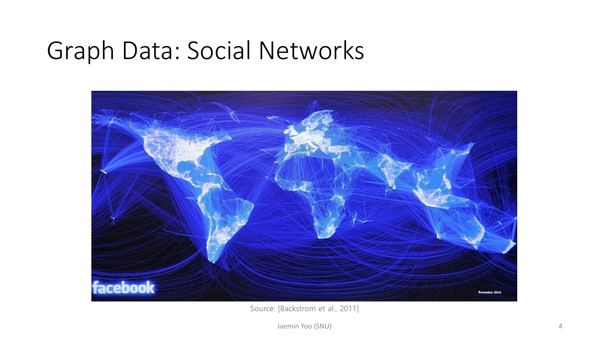

### OCR
- Graph Data: Social Networks
- facebook
- Source: [Backstrom et al., 2011]
- Jaemin Yoo (SNU)

## Page 5

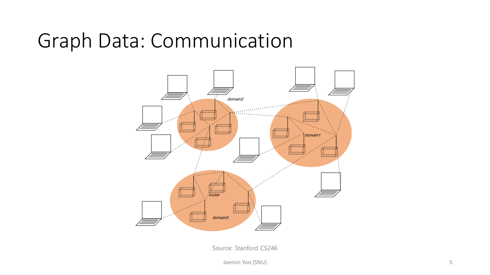

### OCR
- Graph Data: Communication
- domain2
- domaini
- router
- domain3
- Source:Stanford CS246
- Jaemin Yoo (SNU)

## Page 6

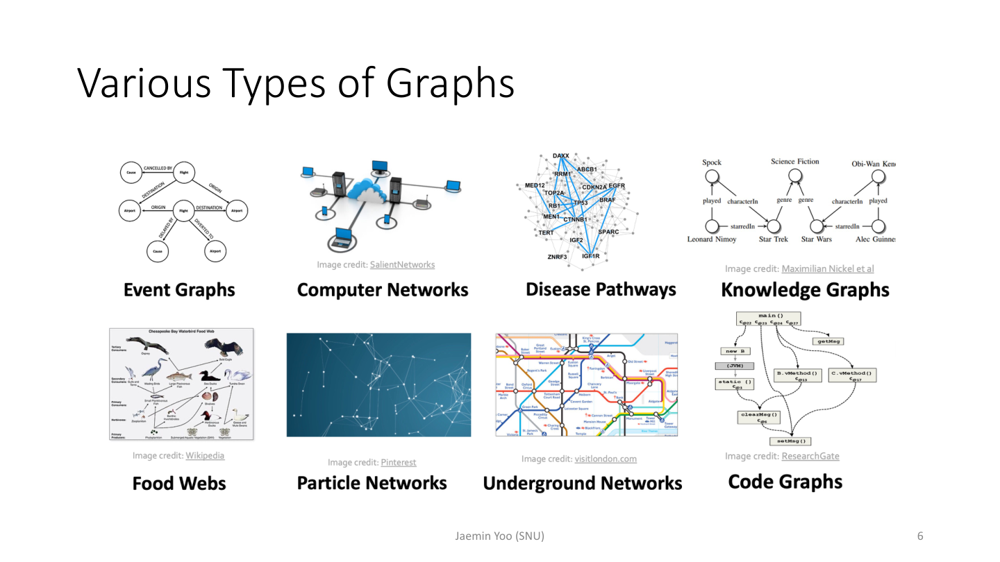

### OCR
- Various Types of Graphs
- Spock
- Science Fiction
- Obi-Wan Ken
- starredIn
- starredln
- Leonard Nimoy
- Star Trek
- Star Wars
- Alec Guinne:
- Image credit: SalientNetworks
- Image credit: Maximilian Nickel et al
- Event Graphs
- ComputerNetworks
- Disease Pathways
- Knowledge Graphs
- ()ueu
- getMng
- thod ()
- .vMethod()
- Image credit: Wikipedia
- Image credit: visitlondon.com
- Image credit: ResearchGate
- Image credit: Pinterest
- Code Graphs
- Food Webs
- ParticleNetworks
- UndergroundNetworks
- Jaemin Yoo (SNU)

## Page 7

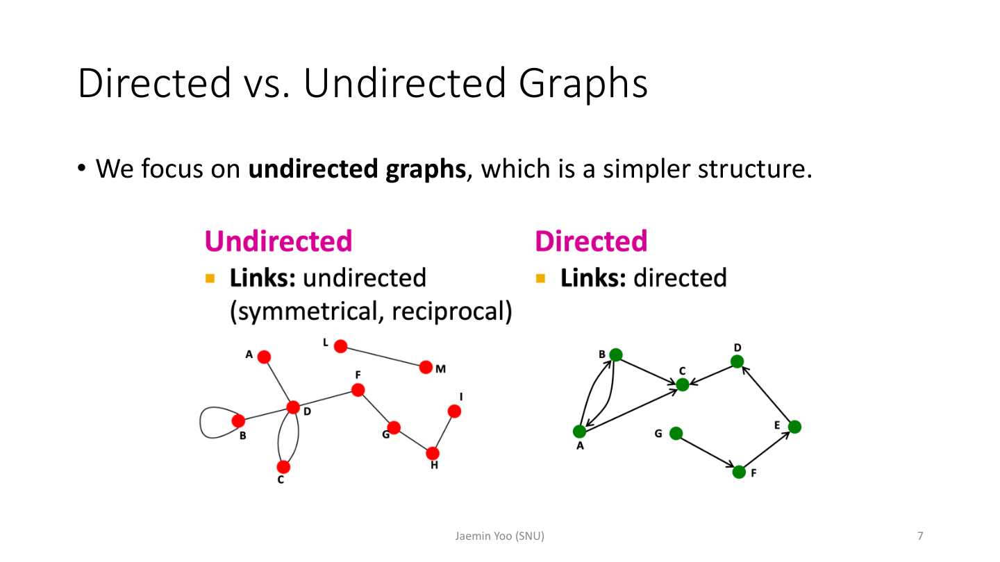

### OCR
- Directed vs. Undirected Graphs
- · We focus on undirected graphs, which is a simpler structure.
- Undirected
- Directed
- Links: undirected
- Links: directed
- (symmetrical, reciprocal)
- Jaemin Yoo (SNU)

## Page 8

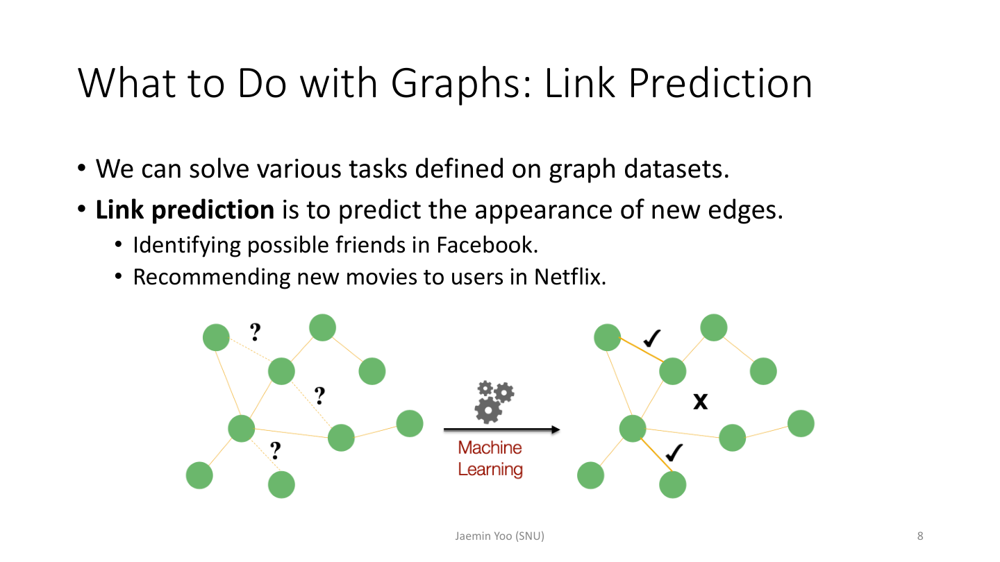

### OCR
- What to Do with Graphs: Link Prediction
- · We can solve various tasks defined on graph datasets.
- Link prediction is to predict the appearance of new edges.
- · Identifying possible friends in Facebook.
- · Recommending new movies to users in Netflix.
- X
- Machine
- Learning
- JaeminYoo (SNU)

## Page 9

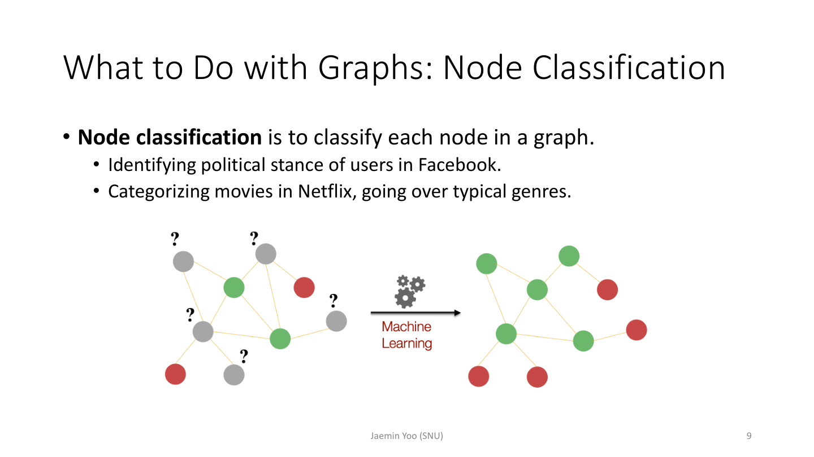

### OCR
- What to Do with Graphs: Node Classification
- Node classification is to classify each node in a graph.
- · Identifying political stance of users in Facebook.
- · Categorizing movies in Netflix, going over typical genres.
- Machine
- Learning
- JaeminYoo (SNU)

## Page 10

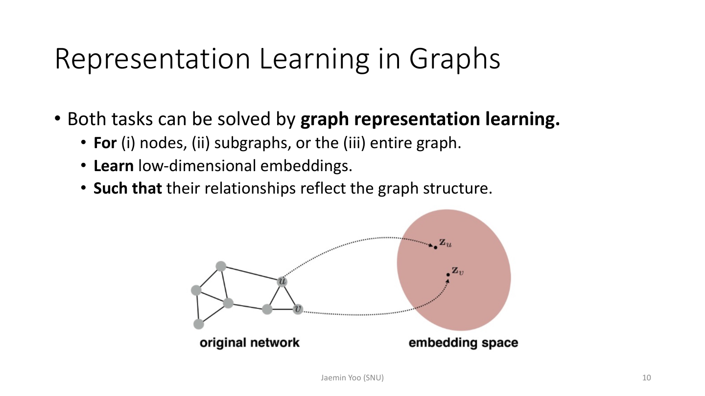

### OCR
- Representation Learning in Graphs
- · Both tasks can be solved by graph representation learning.
- · For (i) nodes, (ii) subgraphs, or the (ii) entire graph.
- · Learn low-dimensional embeddings.
- · Such that their relationships reflect the graph structure.
- originalnetwork
- embeddingspace
- Jaemin Yoo (SNU)
- 10

## Page 11

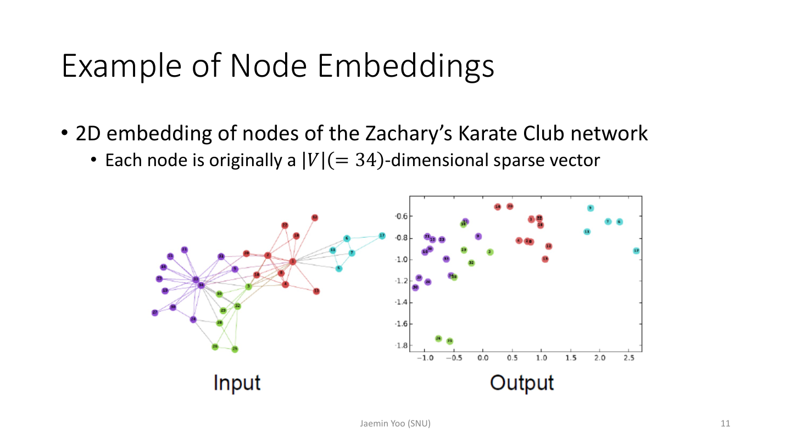

### OCR
- Example of Node Embeddings
- · 2D embedding of nodes of the Zachary's Karate Club network
- · Each node is originally a IVl(= 34)-dimensional sparse vector
- -0.5
- 0.0
- 0.5
- 1.0
- 1.5
- 2.0
- Input
- Output
- JaeminYoo(SNU)
- 11

## Page 12

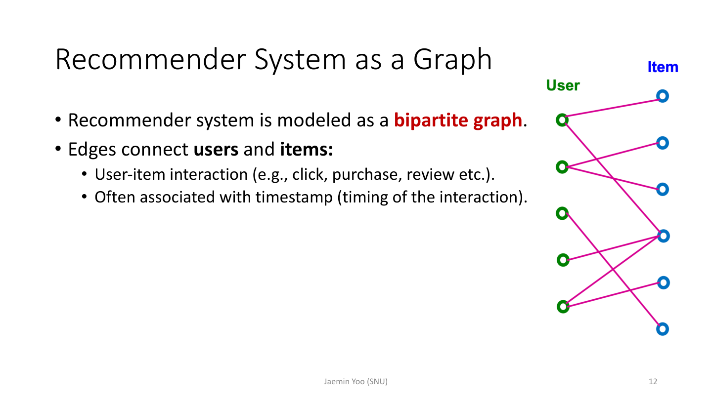

### OCR
- Recommender System as a Graph
- Item
- User
- · Recommender system is modeled as a bipartite graph.
- Edges connect users and items:
- · User-item interaction (e.g., click, purchase, review etc.).
- · Often associated with timestamp (timing of the interaction).
- Jaemin Yoo (SNU)
- 12

## Page 13

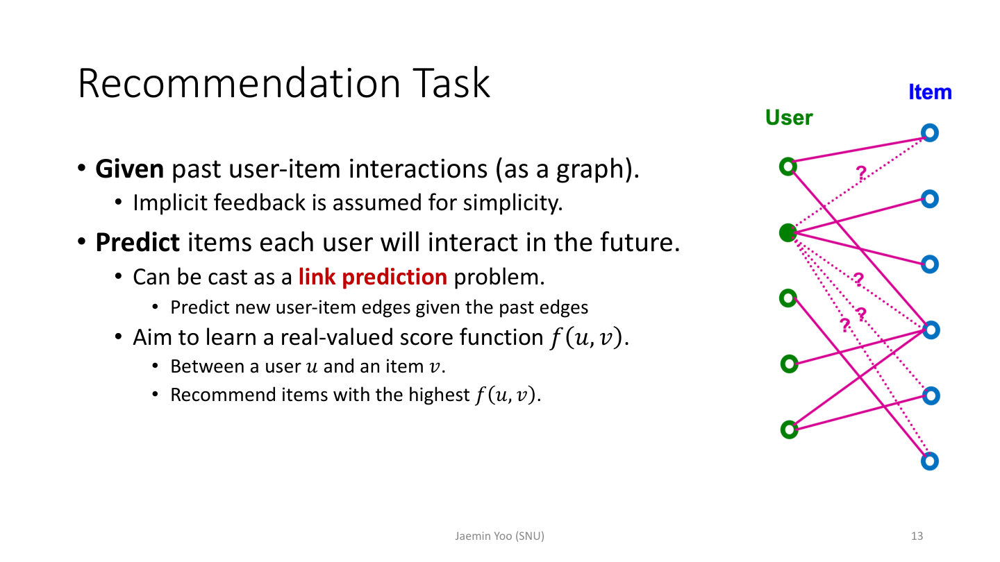

### OCR
- Recommendation Task
- Item
- User
- · Given past user-item interactions (as a graph).
- · Implicit feedback is assumed for simplicity.
- · Predict items each user will interact in the future.
- · Can be cast as a link prediction problem.
- · Predict new user-item edges given the past edges
- · Aim to learn a real-valued score function f(u, v).
- · Between a user u and an item v.
- · Recommend items with the highest f(u, v).
- Jaemin Yoo (SNU)
- 13

## Page 14

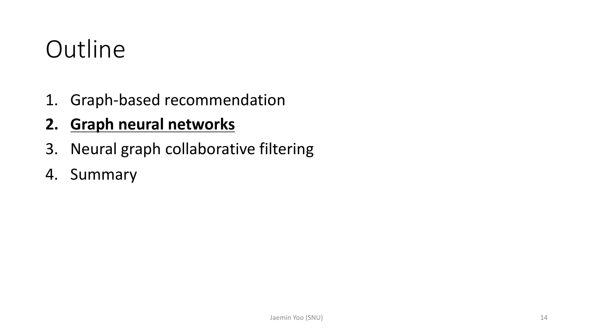

### OCR
- Outline
- 1.
- Graph-based recommendation
- 2.
- Graph neural networks
- Neural graph collaborative filtering
- 3.
- 4.Summary
- Jaemin Yoo (SNU)
- 14

## Page 15

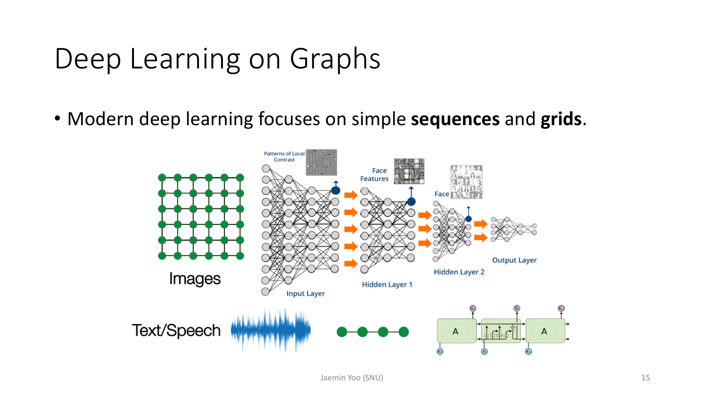

### OCR
- Deep Learning on Graphs
- · Modern deep learning focuses on simple sequences and grids.
- Patterns of Local
- Contrast
- Face
- Features
- Face
- OutputLayer
- Images
- Hidden Layer2
- Hidden Layer1
- Input Layer
- Text/Speech
- JaeminYoo(SNU)
- 15

## Page 16

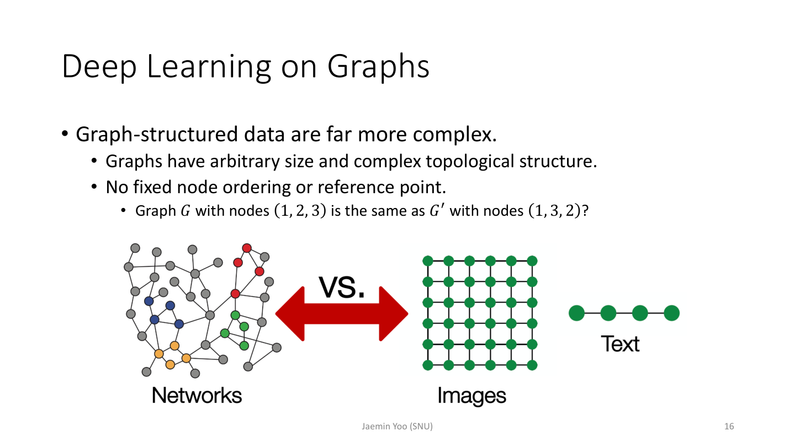

### OCR
- Deep Learning on Graphs
- · Graph-structured data are far more complex.
- · Graphs have arbitrary size and complex topological structure.
- · No fixed node ordering or reference point.
- ·Graph G with nodes (1, 2,3) is the same as G' with nodes (1,3, 2)?
- VS.
- Text
- Networks
- Images
- Jaemin Yoo (SNU)
- 16

## Page 17

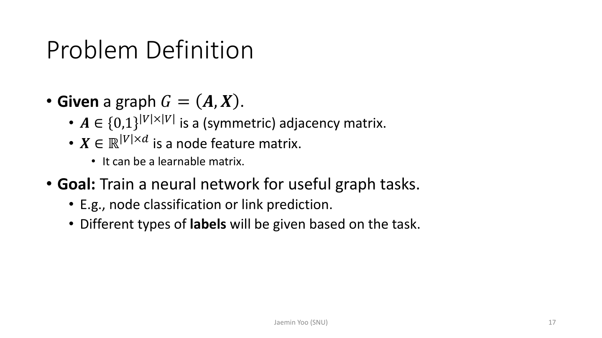

### OCR
- Problem Definition
- · Given a graph G = (A, X).
- · A E {0,1}lvlxIvl is a (symmetric) adjacency matrix.
- · X e IRlvlxd is a node feature matrix.
- · It can be a learnable matrix.
- · Goal: Train a neural network for useful graph tasks.
- · E.g., node classification or link prediction.
- · Different types of labels will be given based on the task.
- Jaemin Yoo (SNU)
- 17

## Page 18

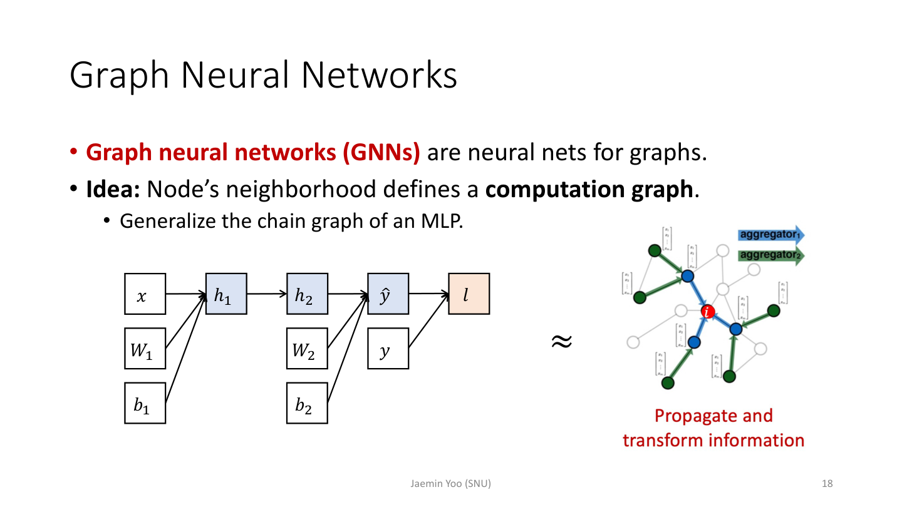

### OCR
- Graph Neural Networks
- Graph neural networks (GNNs) are neural nets for graphs.
- · Idea: Node's neighborhood defines a computation graph.
- · Generalize the chain graph of an MLP.
- aggregatort
- aggregator2
- h1
- hz
- x
- W1
- W2
- b2
- b1
- Propagate and
- transforminformation
- Jaemin Yoo (SNU)
- 18

## Page 19

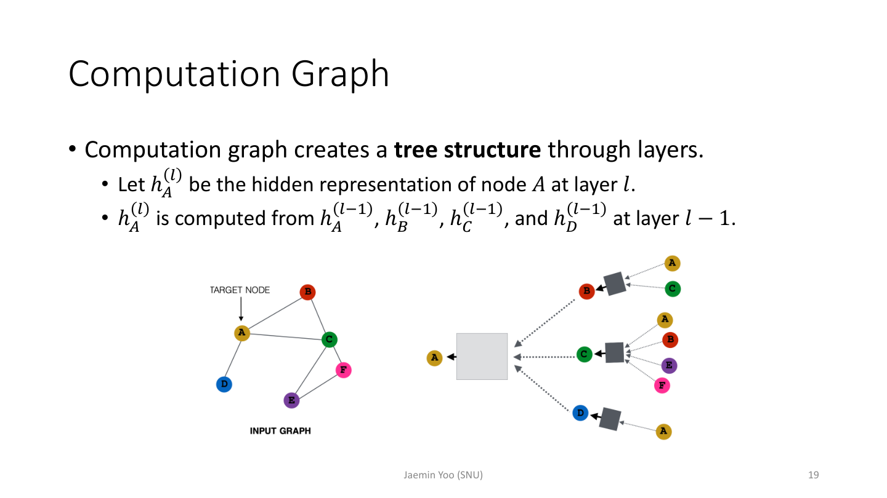

### OCR
- Computation Graph
- · Computation graph creates a tree structure through layers.
- · Let h(l)
- 1 be the hidden representation of node A at layer l.
- at layer l - 1.
- TARGET NODE
- INPUT GRAPH
- Jaemin Yoo (SNU)
- 19

## Page 20

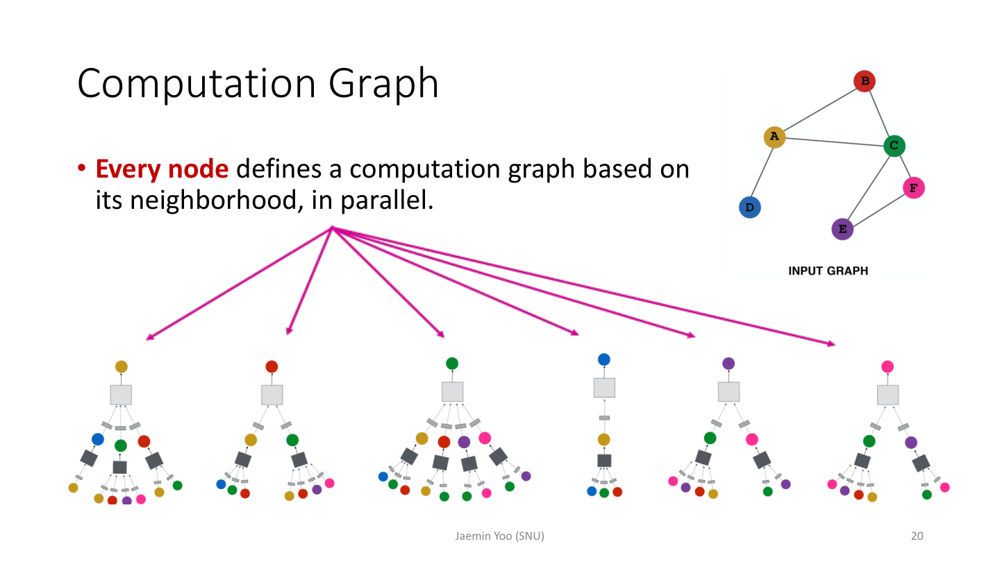

### OCR
- Computation Graph
- Every node defines a computation graph based on
- its neighborhood, in parallel.
- INPUTGRAPH
- JaeminYoo (SNU)
- 20

## Page 21

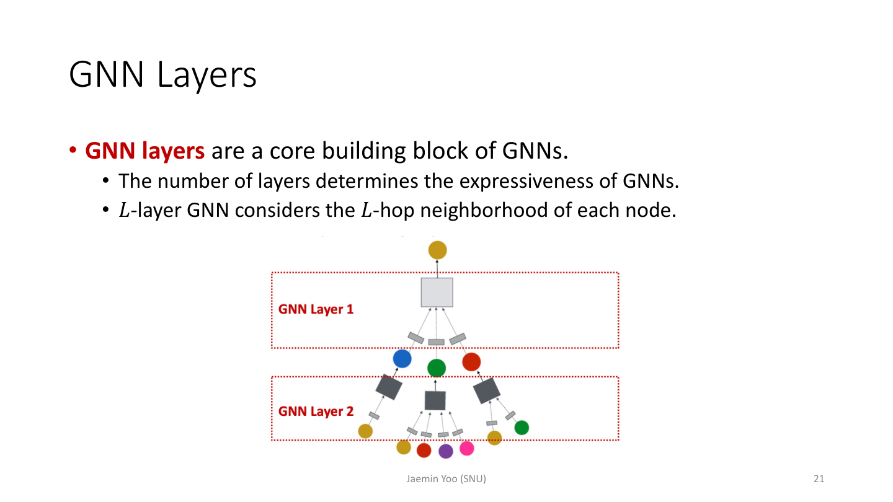

### OCR
- GNN Layers
- GNN layers are a core building block of GNNs.
- · The number of layers determines the expressiveness of GNNs.
- · L-layer GNN considers the L-hop neighborhood of each node.
- GNNLayer1
- GNNLayer2
- JaeminYoo(SNU)
- 21

## Page 22

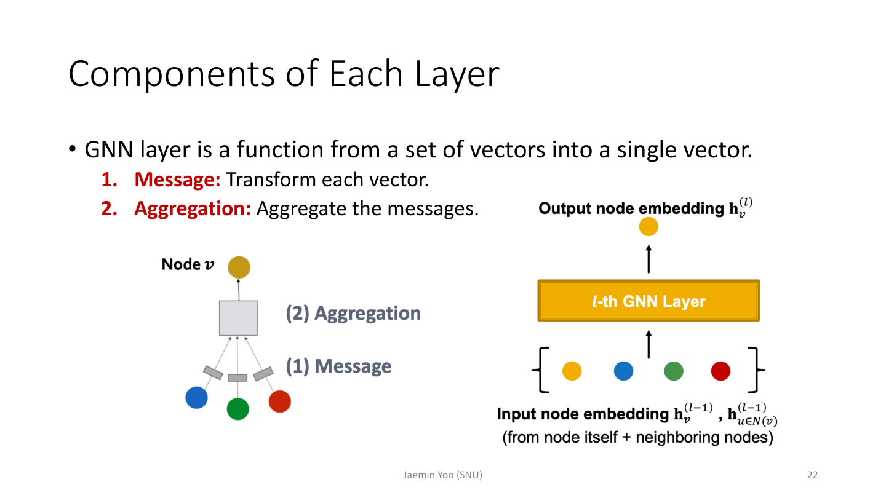

### OCR
- Components of Each Layer
- · GNN layer is a function from a set of vectors into a single vector.
- 1. Message: Transform each vector.
- Output node embedding h()
- 2. Aggregation: Aggregate the messages.
- Node v
- I-th GNN Layer
- (2) Aggregation
- (1) Message
- (from node itself +neighboring nodes)
- Jaemin Yoo (SNU)
- 22

## Page 23

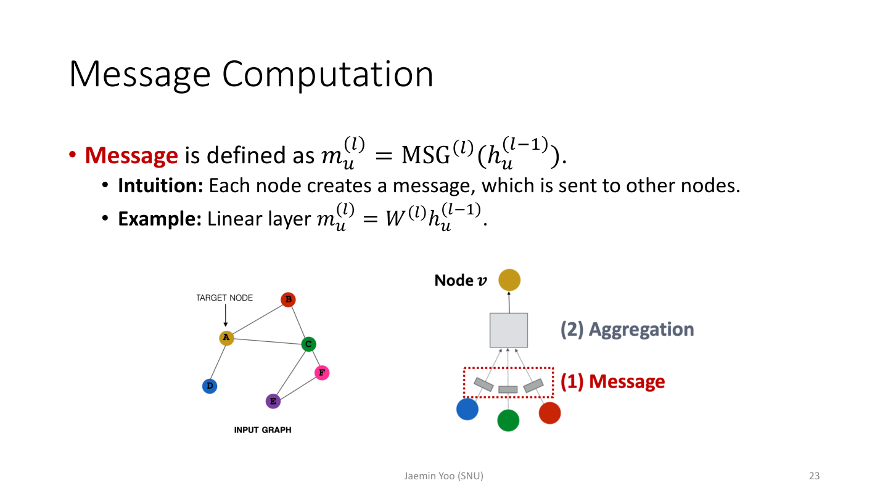

### OCR
- Message Computation
- (l)
- Message is defined as m
- = MSG()(h
- · Intuition: Each node creates a message, which is sent to other nodes.
- · Example: Linear layer m
- (l)
- Node v
- TARGET NODE
- (2) Aggregation
- (1) Message
- INPUT GRAPH
- Jaemin Yoo (SNU)
- 23

## Page 24

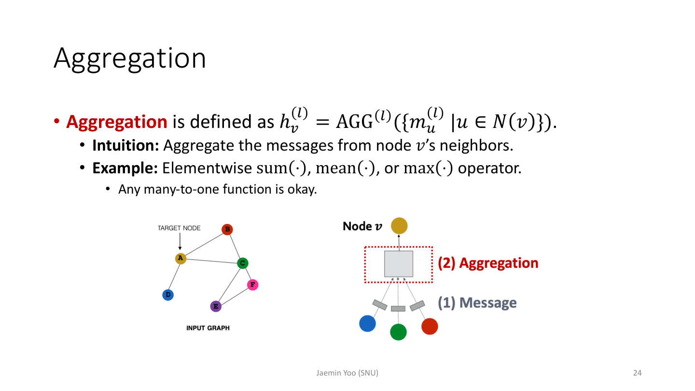

### OCR
- Aggregation
- = AGG()(m(l) lu e N(v).
- · Aggregation is defined as h
- ()9
- · Intuition: Aggregate the messages from node v's neighbors.
- · Example: Elementwise sum(), mean(), or max() operator.
- · Any many-to-one function is okay.
- Node v
- TARGET NODE
- (2)Aggregation
- (1) Message
- INPUT GRAPH
- Jaemin Yoo (SNU)
- 24

## Page 25

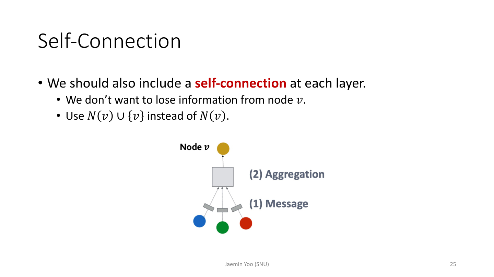

### OCR
- Self-Connection
- · We should also include a self-connection at each layer.
- · We don't want to lose information from node v.
- · Use N(v) U {u} instead of N(v).
- Node v
- (2) Aggregation
- (1) Message
- Jaemin Yoo (SNU)
- 25

## Page 26

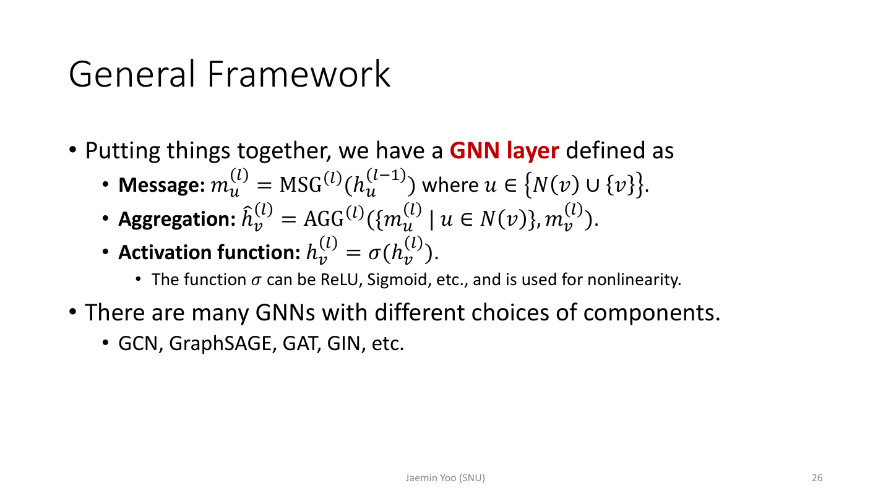

### OCR
- General Framework
- · Putting things together, we have a GNN layer defined as
- = MsG()(hl-1) where u E {N(v) u {u}).
- · Message: mu
- · Aggregation: hl) = AGG()(m I u E N(v), m).
- = o(h().
- · The function o can be ReLU, Sigmoid, etc., and is used for nonlinearity.
- · There are many GNNs with different choices of components.
- · GCN, GraphSAGE, GAT, GIN, etc.
- Jaemin Yoo (SNU)
- 26

## Page 27

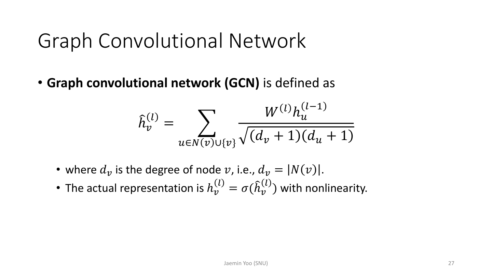

### OCR
- Graph Convolutional Network
- · Graph convolutional network (GcN) is defined as
- W(1) h(I-1)
- hC)
- · where d, is the degree of node v, i.e., d = IN(v)l.
- JaeminYoo (SNU)
- 27

## Page 28

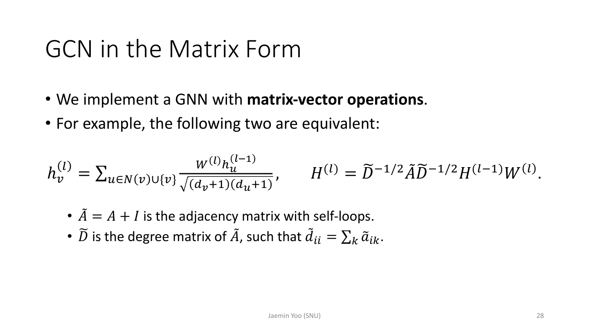

### OCR
- GCN in the Matrix Form
- · We implement a GNN with matrix-vector operations.
- · For example, the following two are equivalent:
- W(l)h(l-1)
- h()
- ) =∑uEN(v)U{v} /(d+1)(du+1)
- H(l) = D-1/2AD-1/2 H(l-1)W(l)
- · A = A + I is the adjacency matrix with self-loops.
- · D is the degree matrix of A, such that dii = Zk aik.
- Jaemin Yoo (SNU)
- 28

## Page 29

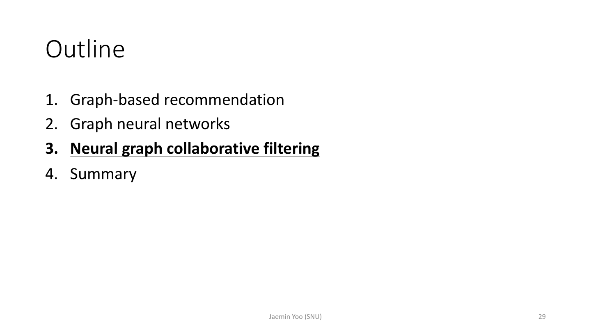

### OCR
- Outline
- 1.
- Graph-based recommendation
- 2.
- Graph neural networks
- Neural graph collaborative filtering
- 3.
- 4.Summary
- Jaemin Yoo (SNU)
- 29

## Page 30

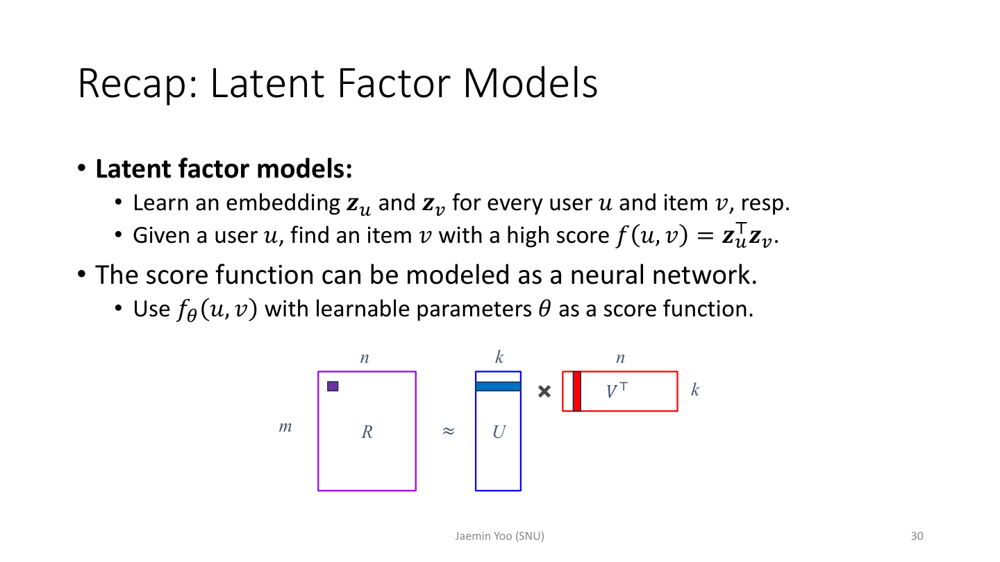

### OCR
- Recap: Latent Factor Models
- · Latent factor models:
- · Learn an embedding Zu and z, for every user u and item v, resp.
- · Given a user u, find an item v with a high score f(u, v) = zuzv.
- · The score function can be modeled as a neural network.
- · Use fe(u, v) with learnable parameters θ as a score function.
- 14
- K
- m
- R
- JaeminYoo(SNU)
- 30

## Page 31

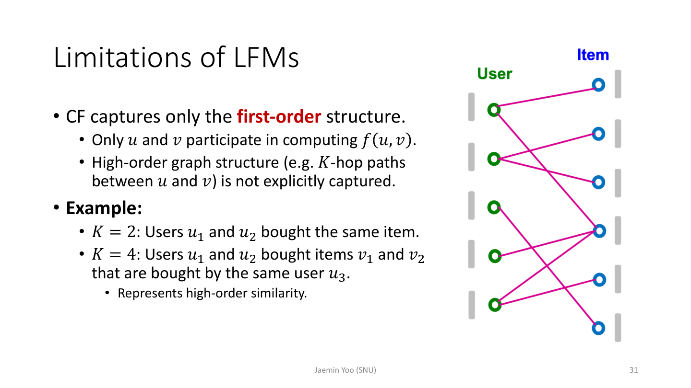

### OCR
- Limitations of LFMs
- Item
- User
- · CF captures only the first-order structure.
- · Only u and v participate in computing f(u, v).
- · High-order graph structure (e.g. K-hop paths
- between u and v) is not explicitly captured.
- · Example:
- · K = 2: Users u1 and u2 bought the same item.
- · K = 4: Users u1 and u2 bought items v1 and v2
- that are bought by the same user u3.
- · Represents high-order similarity.
- Jaemin Yoo (SNU)
- 31

## Page 32

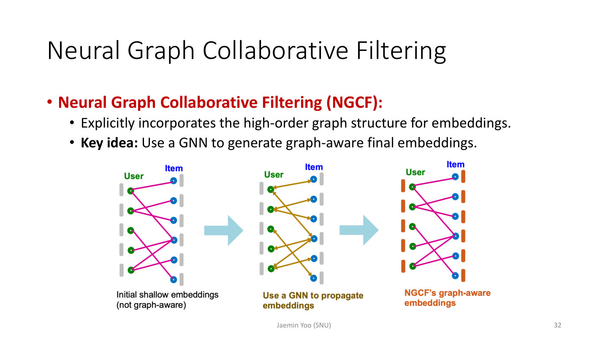

### OCR
- Neural Graph Collaborative Filtering
- Neural Graph Collaborative Filtering (NGCF):
- · Explicitly incorporates the high-order graph structure for embeddings.
- · Key idea: Use a GNN to generate graph-aware final embeddings.
- Item
- Item
- Item
- User
- User
- User
- Initialshallowembeddings
- UseaGNNtopropagate
- NGCF's graph-aware
- (not graph-aware)
- embeddings
- embeddings
- Jaemin Yoo (SNU)
- 32

## Page 33

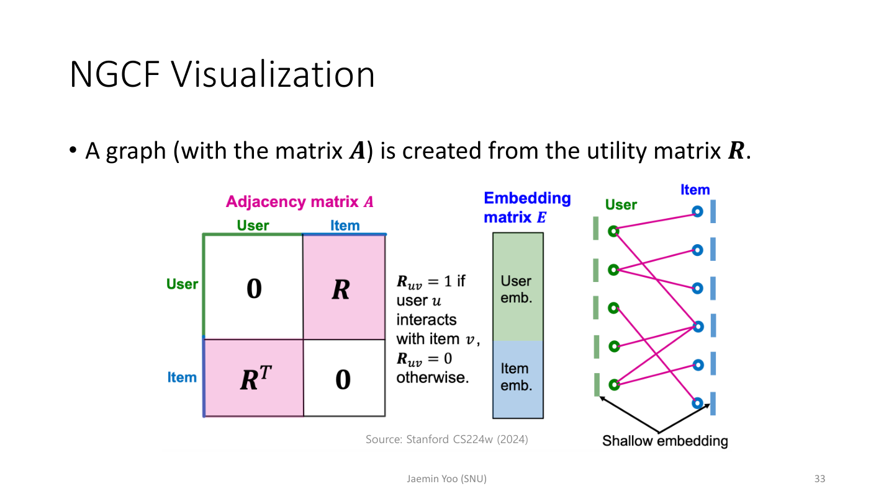

### OCR
- NGCF Visualization
- · A graph (with the matrix A) is created from the utility matrix R.
- Item
- Embedding
- AdjacencymatrixA
- User
- matrix E
- User
- Item
- Ruv = 1 if
- User
- User
- 0
- R
- emb.
- user u
- interacts
- with item v,
- Ruv = 0
- RT
- Item
- Item
- 0
- otherwise.
- emb.
- Source:StanfordCS224w(2024)
- Shallowembedding
- Jaemin Yoo (SNU)
- 33

## Page 34

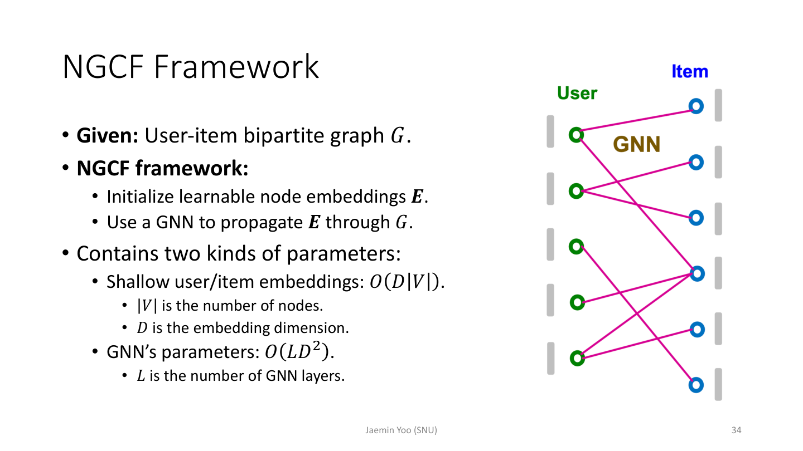

### OCR
- NGCF Framework
- Item
- User
- Given: User-item bipartite graph G.
- GNN
- NGCF framework:
- · Initialize learnable node embeddings E.
- · Use a GNN to propagate E through G.
- · Contains two kinds of parameters:
- · Shallow user/item embeddings: O(DIVI).
- · IV| is the number of nodes.
- · D is the embedding dimension.
- · GNN's parameters: O(LD2).
- · L is the number of GNN layers.
- Jaemin Yoo (SNU)
- 34

## Page 35

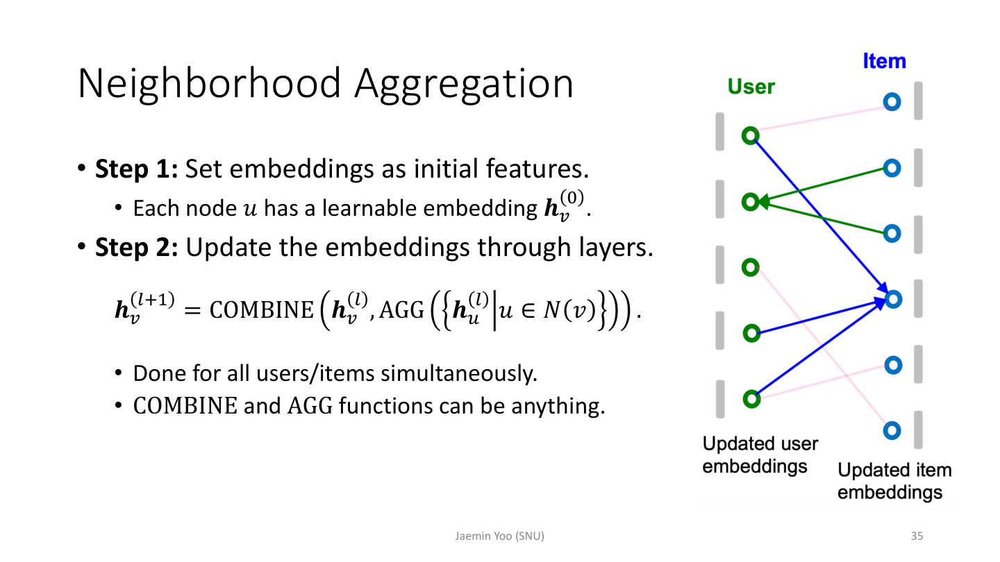

### OCR
- Item
- Neighborhood Aggregation
- User
- .
- · Step 1: Set embeddings as initial features.
- · Step 2: Update the embeddings through layers.
- (h, AGG ((h@|u ∈ N(v)}))
- · Done for all users/items simultaneously.
- · COMBINE and AGG functions can be anything.
- Updated user
- embeddings
- Updated item
- embeddings
- Jaemin Yoo (SNU)
- 35

## Page 36

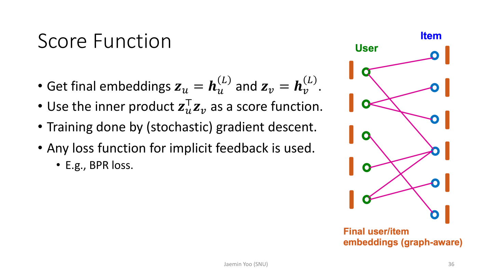

### OCR
- Item
- Score Function
- User
- ()
- · Use the inner product zuz, as a score function.
- · Training done by (stochastic) gradient descent.
- · Any loss function for implicit feedback is used.
- ·E.g., BPR loss.
- Finaluserlitem
- embeddings (graph-aware)
- Jaemin Yoo (SNU)
- 36

## Page 37

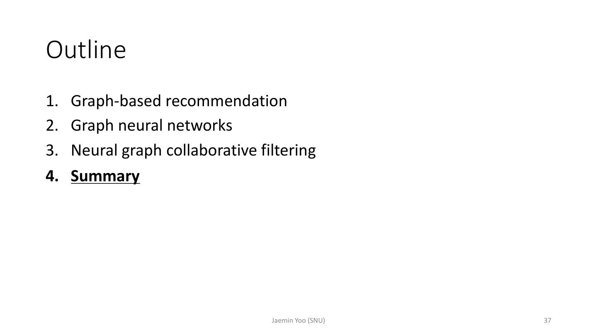

### OCR
- Outline
- 1.
- Graph-based recommendation
- 2.
- Graph neural networks
- Neural graph collaborative filtering
- 3.
- 4. Summary
- Jaemin Yoo (SNU)
- 37

## Page 38

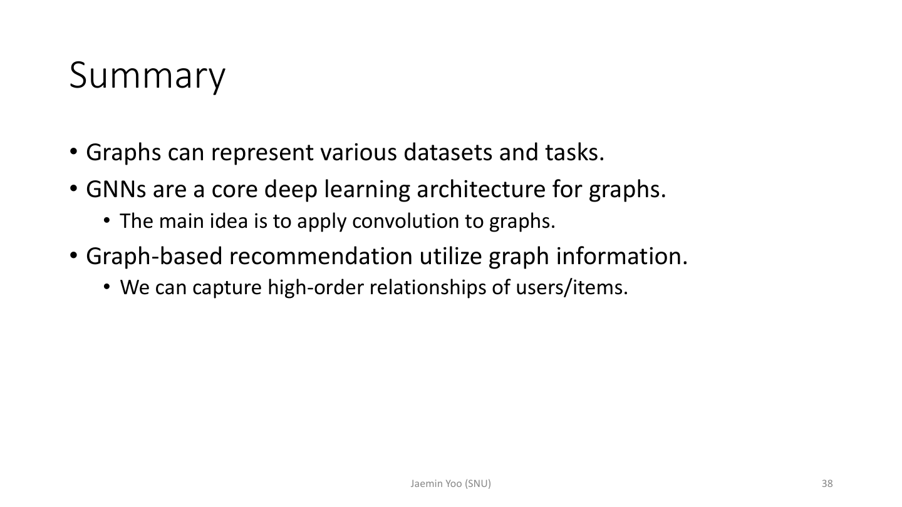

### OCR
- Summary
- · Graphs can represent various datasets and tasks.
- · GNNs are a core deep learning architecture for graphs.
- · The main idea is to apply convolution to graphs.
- · Graph-based recommendation utilize graph information.
- · We can capture high-order relationships of users/items.
- JaeminYoo (SNU)
- 38

