# 7_8-recsys-practice

Source: `data/7_8-recsys-practice.pdf`

Pages: 46

## Page 1

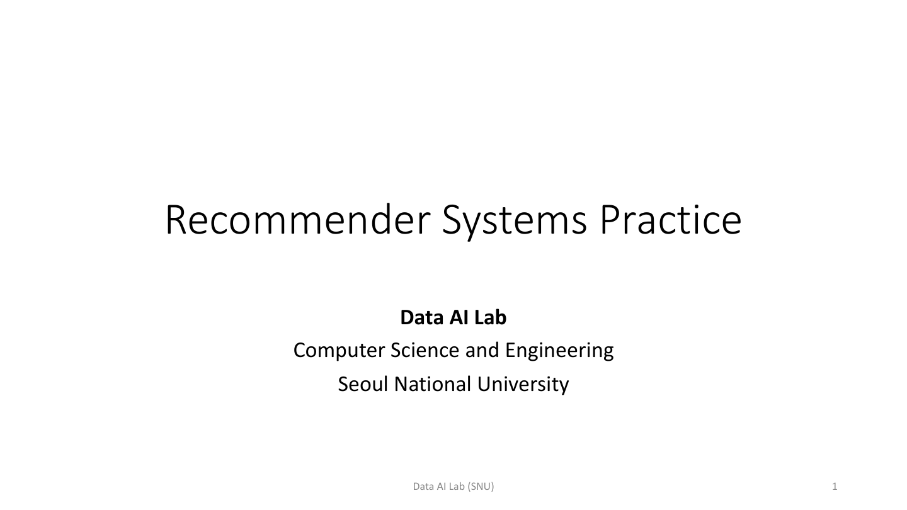

### OCR
- Recommender Systems Practice
- Data Al Lab
- Computer Science and Engineering
- Seoul National University
- Data Al Lab (SNU)

## Page 2

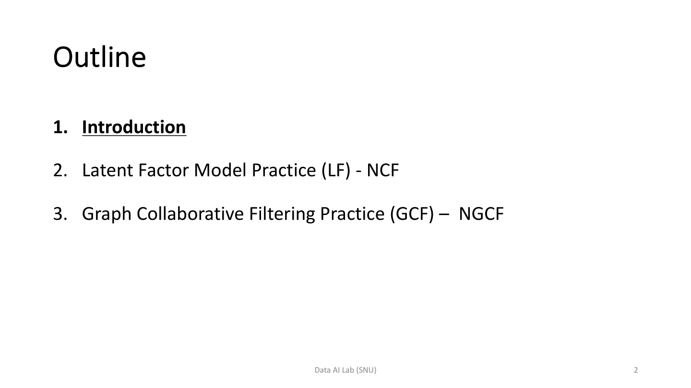

### OCR
- Outline
- 1. Introduction
- 2. Latent Factor Model Practice (LF) - NCF
- 3. Graph Collaborative Filtering Practice (GCF) - NGCF
- Data Al Lab (SNU)

## Page 3

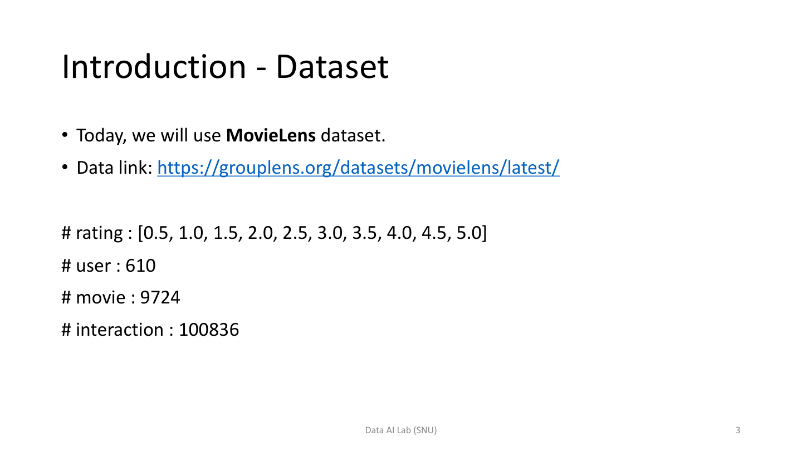

### OCR
- Introduction - Dataset
- · Today, we will use MovieLens dataset.
- Data link: https://grouplens.org/datasets/movielens/latest/
- # rating : [0.5, 1.0, 1.5, 2.0, 2.5, 3.0, 3.5, 4.0, 4.5, 5.0]
- # user : 610
- # movie : 9724
- # interaction : 100836
- Data Al Lab (SNU)

## Page 4

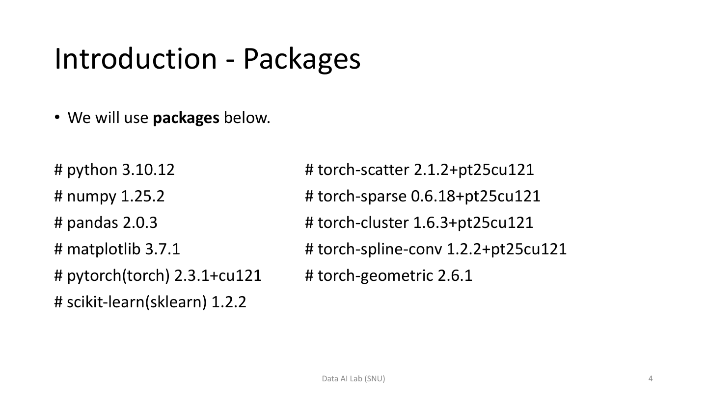

### OCR
- Introduction - Packages
- · We will use packages below.
- # torch-scatter 2.1.2+pt25cu121
- # python 3.10.12
- # numpy 1.25.2
- # torch-sparse 0.6.18+pt25cu121
- # pandas 2.0.3
- # torch-cluster 1.6.3+pt25cu121
- # matplotlib 3.7.1
- # torch-spline-conv 1.2.2+pt25cu121
- # pytorch(torch) 2.3.1+cu121
- # torch-geometric 2.6.1
- # scikit-learn(sklearn) 1.2.2
- Data Al Lab (SNU)

## Page 5

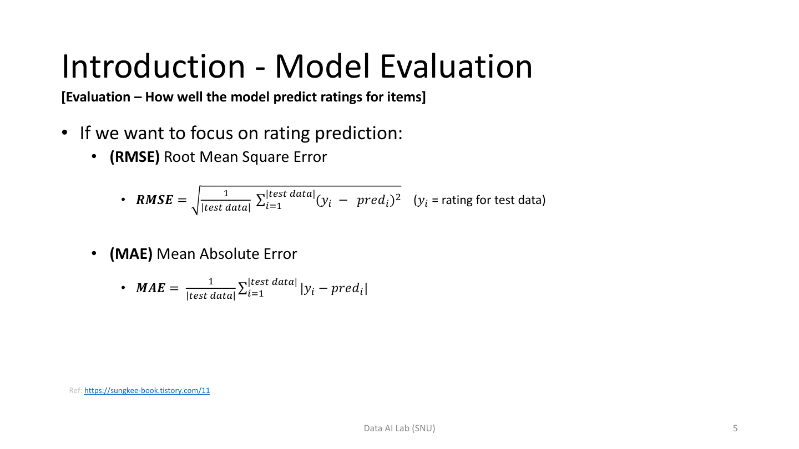

### OCR
- Introduction - Model Evaluation
- [Evaluation - How well the model predict ratings for items]
- ·If we want to focus on rating prediction:
- ·(RMSE) Root Mean Square Error
- RMSE=
- /testdatal
- i=1
- (MAE) Mean Absolute Error
- Zltest datal Iyi - predil
- ·MAE=
- Li=1
- |testdatal
- Ref: https://sungkee-book.tistory.com/11
- Data Al Lab (SNU)

## Page 6

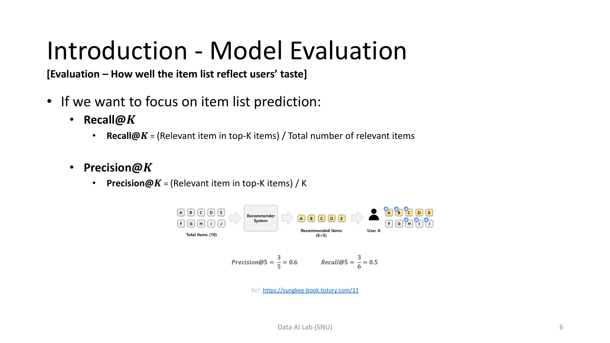

### OCR
- Introduction - Model Evaluation
- [Evaluation- How well the item list reflect users' taste]
- · If we want to focus on item list prediction:
- · Recall@K
- Recall@K=(Relevantitemintop-Kitems)/Totalnumberofrelevantitems
- Precision@K
- ·Precision@K = (Relevant item in top-K items) / K
- Abgda
- Recommender
- 0a000
- System
- Total Items (10)
- Recommended items
- User A
- (K=5)
- 3
- 3
- Precision@5
- Recall@5：
- = 0.5
- =
- Ref: https://sungkee-book.tistory.com/11
- Data Al Lab (SNU)

## Page 7

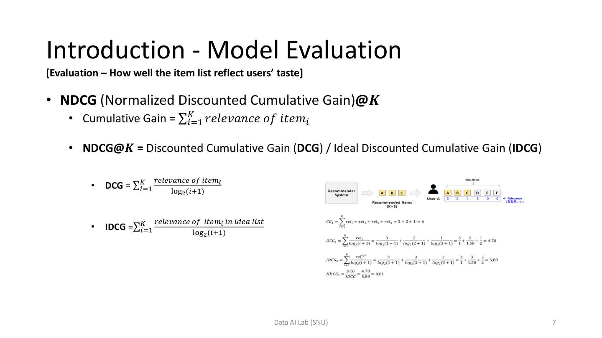

### OCR
- Introduction - Model Evaluation
- [Evaluation - How well the item list reflect users' taste]
- NDcG (Normalized Discounted Cumulative Gain)@K
- · Cumulative Gain = Z=1 relevance of itemi
- NDcG@K = Discounted Cumulative Gain (DcG) / Ideal Discounted Cumulative Gain (IDcG)
- log2(i+1)
- System
- 百民尼
- rel
- (K=3)
- log2(i+1)
- logz(i + 1)  log2(1 + 1)
- 4.7
- IDCG =
- 5.89
- DCG
- 4.78
- = 0.81
- Data Al Lab (SNU)

## Page 8

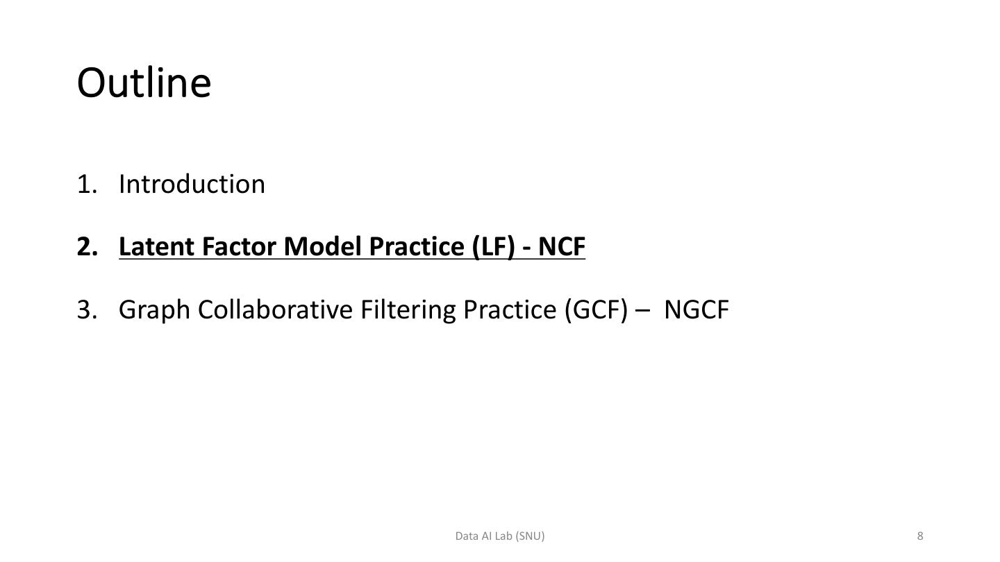

### OCR
- Outline
- 1. Introduction
- 2. Latent Factor Model Practice (LF) - NCF
- 3. Graph Collaborative Filtering Practice (GCF) - NGCF
- Data Al Lab (SNU)

## Page 9

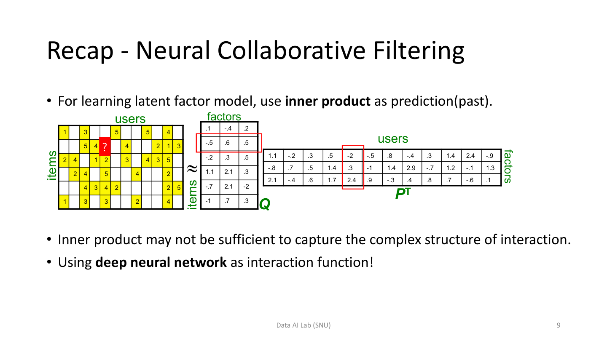

### OCR
- Recap - Neural Collaborative Filtering
- · For learning latent factor model, use inner product as prediction(past).
- factors
- users
- 2
- users
- ？
- 2
- .5
- .6
- 5
- -.2
- 3
- 2.4
- 3
- .3
- .5
- .5
- 1.1
- 2.1
- .3
- 1.4
- 1.4
- 2.9
- 1.3
- 2
- tems
- 2.1
- .4
- 6
- 1.7
- 2.4
- 9
- .8
- 7
- .6
- 2
- .7
- 2.1
- -2
- .7
- .3
- Inner product may not be sufficient to capture the complex structure of interaction.
- ·Using deep neural network as interaction function!
- DataAl Lab(SNU)

## Page 10

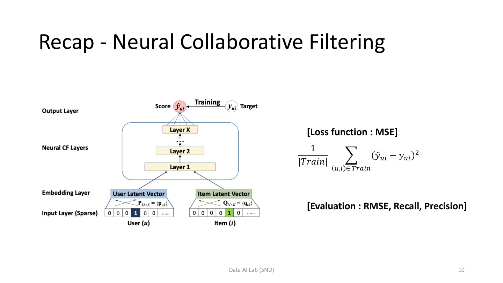

### OCR
- Recap - Neural Collaborative Filtering
- Training yui Target
- Score
- Output Layer
- LayerX
- [Loss function : MsE]
- ↑
- Neural CFLayers
- 1
- Layer2
- (ui - yui)2
- [Train|
- Layer1
- (u,i)ETrain
- EmbeddingLayer
- UserLatentVector
- ItemLatentVector
- {b}=XXNO
- PMxK={Puk}
- [Evaluation : RMSE, Recall, Precision]
- Input Layer(Sparse)
- 000
- 1
- User (u)
- Item (i)
- Data Al Lab (SNU)
- 10

## Page 11

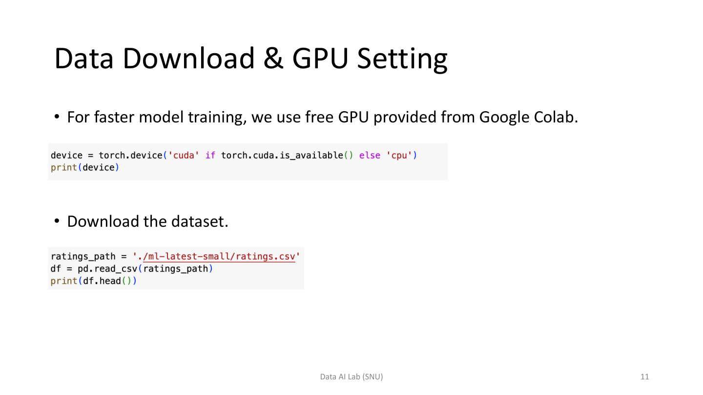

### OCR
- Data Download & GPU Setting
- device = torch.device('cuda' if torch.cuda.is_available(） else 'cpu')
- print(device)
- · Download the dataset.
- ratings_path ='./ml-latest-small/ratings.csv'
- df = pd.read_csv(ratings_path)
- print(df.head())
- Data Al Lab (SNU)
- 11

## Page 12

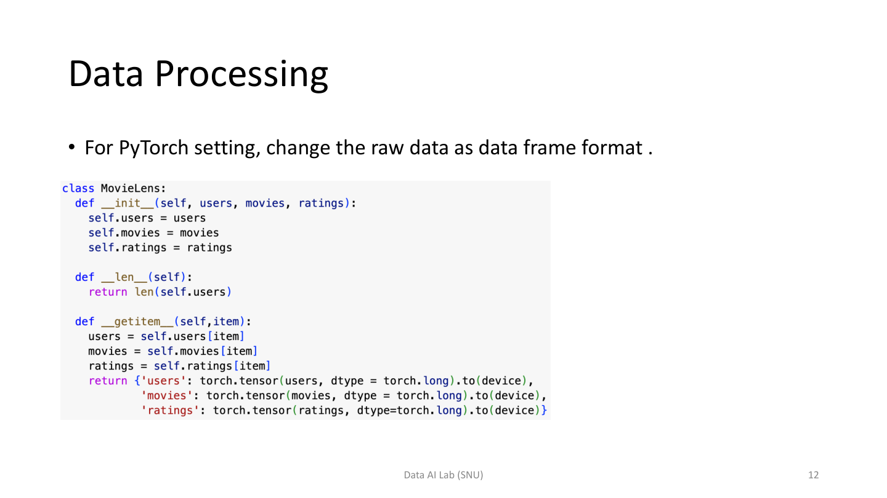

### OCR
- Data Processing
- · For PyTorch setting, change the raw data as data frame format .
- class MovieLens:
- def _init_(self, users, movies， ratings):
- self.users = users
- self.movies = movies
- self.ratings = ratings
- def _len_(self):
- return len(self.users)
- def _getitem__(self,item):
- users = self.users[item]
- movies = self.movies[item]
- ratings = self.ratings[item]
- return {'users': torch.tensor(users, dtype = torch.long).to(device),
- 'movies':torch.tensor(movies,dtype = torch.long).to(device),
- 'ratings':torch.tensor(ratings, dtype=torch.long).to(device)}
- Data Al Lab (SNU)
- 12

## Page 13

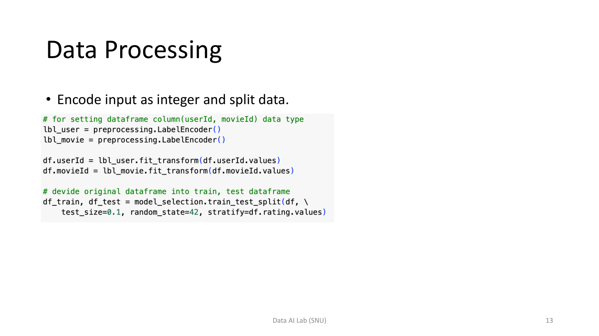

### OCR
- Data Processing
- · Encode input as integer and split data.
- # for setting dataframe column(userId, movieId) data type
- lbl_user = preprocessing.LabelEncoder()
- lbl_movie = preprocessing.LabelEncoder()
- df.userId =lbl_user.fit_transform(df.userId.values)
- df.movieId = lbl_movie.fit_transform(df.movieId.values)
- # devide original dataframe into train,test dataframe
- df_train，df_test = model_selection.train_test_split(df，\
- test_size=0.1，random_state=42,stratify=df.rating.values)
- Data Al Lab (SNU)
- 13

## Page 14

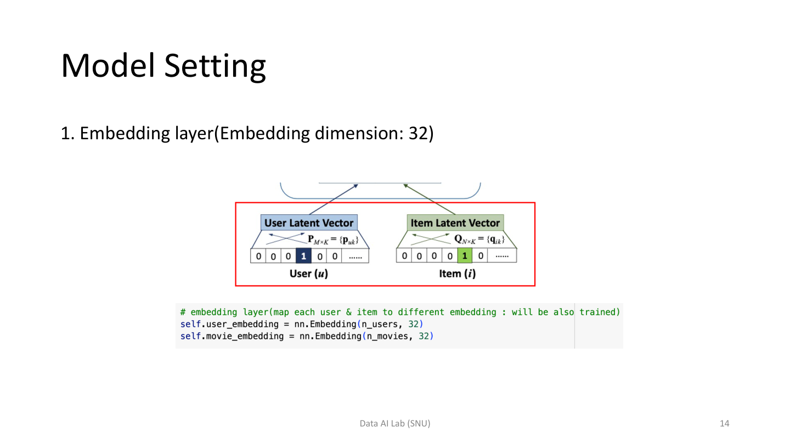

### OCR
- Model Setting
- 1. Embedding layer(Embedding dimension: 32)
- UserLatentVector
- ItemLatentVector
- PMxK={Puk}
- {b}=XXN
- 00
- User (u)
- Item (i)
- # embedding layer(map each user & item to different embedding : will be also trained)
- self.user_embedding = nn.Embedding(n_users， 32)
- self.movie_embedding =nn.Embedding(n_movies，32)
- Data Al Lab (SNU)
- 14

## Page 15

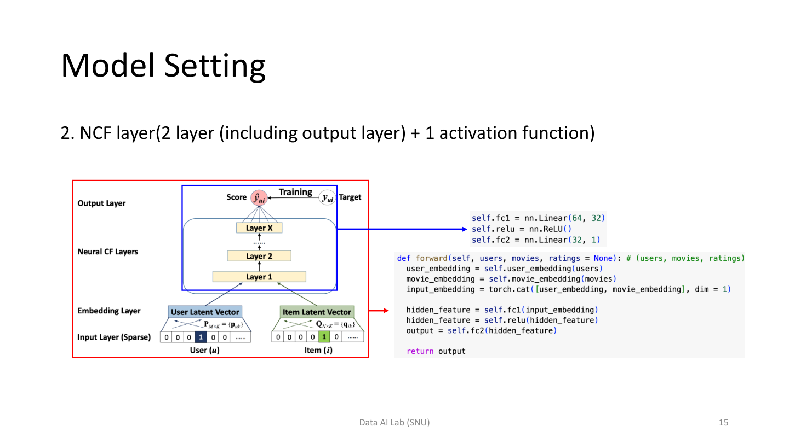

### OCR
- Model Setting
- 2. NCF layer(2 layer (including output layer) + 1 activation function)
- Training
- Score
- Target
- OutputLayer
- self.fc1 = nn.Linear(64， 32)
- LayerX
- self.relu = nn.ReLU()
- self.fc2 = nn.Linear(32， 1)
- Neural CF Layers
- Layer2
- def forward(self,users， movies， ratings =None):#(users， movies，ratings)
- user_embedding = self.user_embedding(users)
- Layer1
- movie_embedding = self.movie_embedding(movies)
- input_embedding = torch.cat([user_embedding，movie_embedding]，dim = 1)
- EmbeddingLayer
- UserLatentVector
- ItemLatentVector
- hidden_feature =self.fc1(input_embedding)
- PMxK={Pak}
- {b}=X
- hidden_feature = self.relu(hidden_feature)
- InputLayer(Sparse)
- 。0。
- output = self.fc2(hidden_feature)
- 1
- o。
- 1
- 。
- User(u)
- Item (i)
- return output
- Data Al Lab (SNU)
- 15

## Page 16

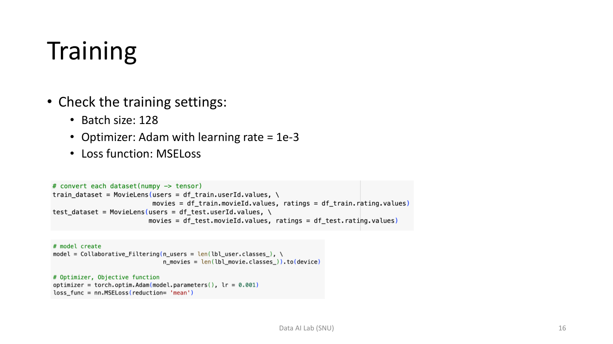

### OCR
- Training
- · Check the training settings:
- ·Batch size: 128
- ·Optimizer: Adam with learning rate = 1e-3
- ·Loss function: MSELoss
- # convert each dataset(numpy -> tensor)
- train_dataset = MovieLens(users = df_train.userId.values,\
- movies = df_train.movieId.values, ratings = df_train.rating.values)
- test_dataset =MovieLens(users = df_test.userId.values，\
- movies = df_test.movieId.values， ratings = df_test.rating.values)
- #modelcreate
- model = Collaborative_Filtering(n_users =len(lbl_user.classes_)，\
- n_movies =len(lbl_movie.classes_)).to(device)
- #Optimizer，objective function
- optimizer = torch.optim.Adam(model.parameters()，lr =0.001)
- loss_func = nn.MSELoss(reduction=‘mean')
- Data Al Lab (SNU)
- 16

## Page 17

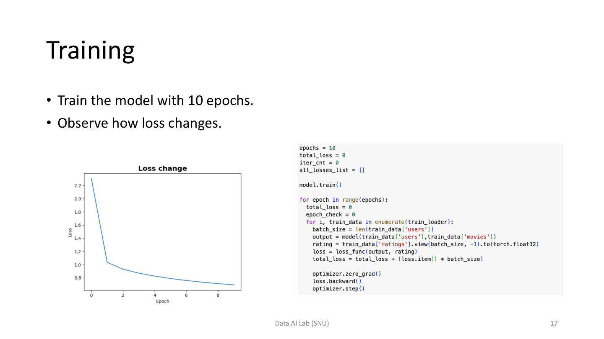

### OCR
- Training
- Train the model with 10 epochs.
- · Observe how loss changes.
- epochs= 10
- total_loss = 0
- Loss change
- iter_cnt = 0
- all_losses_list = []
- 2.2
- model.train()
- 2.0
- for epoch in range(epochs):
- total_loss =0
- 1.8
- epoch_check=0
- 1.6
- for i,train_data in enumerate(train_loader):
- batch_size =len(train_data['users'])
- output = model(train_data['users'],train_data['movies'])
- 1.4
- rating = train_data['ratings'].view(batch_size,-1).to(torch.float32)
- loss =loss_func(output，rating)
- 1.2
- total_loss = total_loss + (loss.item(）* batch_size)
- 1.0
- optimizer.zero_grad()
- 0.8
- loss.backward()
- optimizer.step()
- Epoch
- Data Al Lab (SNU)
- 17

## Page 18

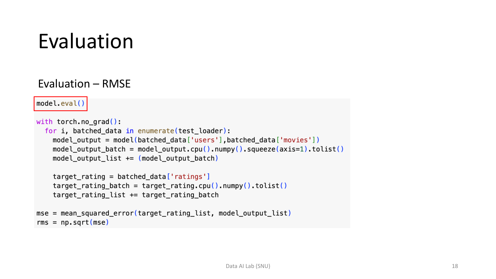

### OCR
- Evaluation
- Evaluation - RMSE
- model.eval()
- with torch.no_grad():
- for i，batched_data in enumerate(test_loader):
- model_output = model(batched_data['users'],batched_data['movies'])
- model_output_batch = model_output.cpu().numpy().squeeze(axis=1).tolist()
- model_output_list += (model_output_batch)
- target_rating = batched_data['ratings']
- target_rating_batch = target_rating.cpu().numpy().tolist()
- target_rating_list += target_rating_batch
- mse = mean_squared_error(target_rating_list, model_output_list)
- rms = np.sqrt(mse)
- Data Al Lab (SNU)
- 18

## Page 19

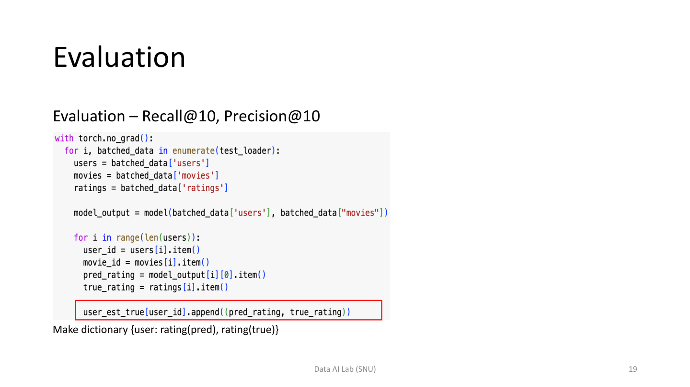

### OCR
- Evaluation
- Evaluation - Recall@10, Precision@ 10
- with torch.no_grad():
- for i, batched_data in enumerate(test_loader):
- users = batched_data['users']
- movies = batched_data['movies']
- ratings = batched_data['ratings']
- model_output = model(batched_data['users'], batched_data["movies"])
- for i in range(len(users)):
- user_id = users[i].item()
- movie_id = movies[i].item()
- pred_rating = model_output[i][0].item()
- true_rating = ratings [i].item()
- user_est_true[user_id].append((pred_rating, true_rating))
- Make dictionary{user: rating(pred), rating(true)}
- Data Al Lab (SNU)
- 19

## Page 20

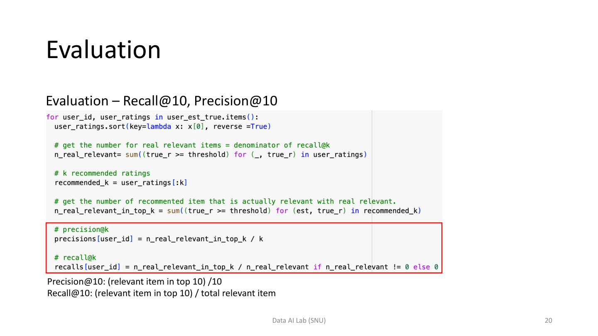

### OCR
- Evaluation
- Evaluation - Recall@10, Precision@ 10
- for user_id, user_ratings in user_est_true.items():
- user_ratings.sort(key=lambda x:x[0]，reverse =True)
- # get the number for real relevant items = denominator of recall@k
- n_real_relevant= sum((true_r >= threshold) for (_, true_r) in user_ratings)
- #k recommendedratings
- recommended_k = user_ratings [:k]
- # get the number of recommented item that is actually relevant with real relevant.
- n_real_relevant_in_top_k = sum((true_r >= threshold） for (est, true_r） in recommended_k)
- #precision@k
- precisions [user_id] = n_real_relevant_in_top_k / k
- # recall@k
- recalls[user_id]=n_real_relevant_in_top_k/ n_real_relevant if n_real_relevant !=0 else
- Precision@10:(relevant item in top 10) /10
- Recall@10:(relevant itemintop10)/totalrelevant item
- Data Al Lab (SNU)
- 20

## Page 21

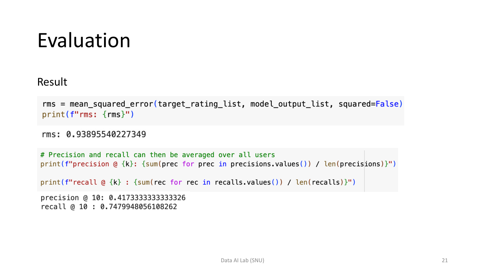

### OCR
- Evaluation
- Result
- rms = mean_squared_error(target_rating_list, model_output_list, squared=False)
- print(f"rms: {rms}")
- rms:0.93895540227349
- # Precision andrecall can then be averaged over all users
- print(f"precision @ {k}: {sum(prec for prec in precisions.values()) / len(precisions)}")
- print(f"recall @ {k} : {sum(rec for rec in recalls.values()) / len(recalls)}")
- precision@10:0.4173333333333326
- recall@10:0.7479948056108262
- Data Al Lab (SNU)
- 21

## Page 22

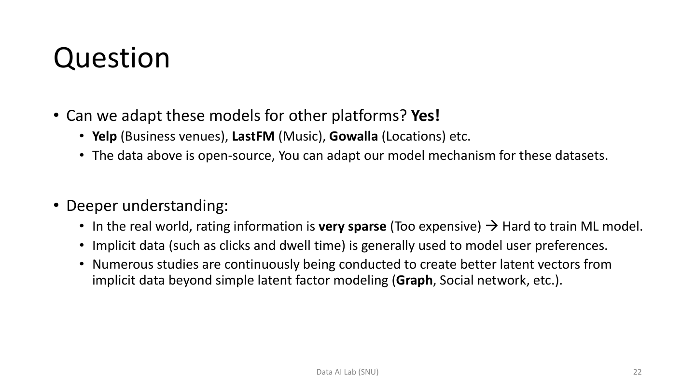

### OCR
- Question
- · Can we adapt these models for other platforms? Yes!
- · Yelp (Business venues), LastFM (Music), Gowalla (Locations) etc.
- · The data above is open-source, You can adapt our model mechanism for these datasets.
- ·Deeper understanding:
- · In the real world, rating information is very sparse (Too expensive) → Hard to train ML model.
- ·Implicit data (such as clicks and dwell time) is generally used to model user preferences.
- ·Numerous studies are continuously being conducted to create better latent vectors from
- implicit data beyond simple latent factor modeling (Graph, Social network, etc.).
- Data Al Lab (SNU)
- 22

## Page 23

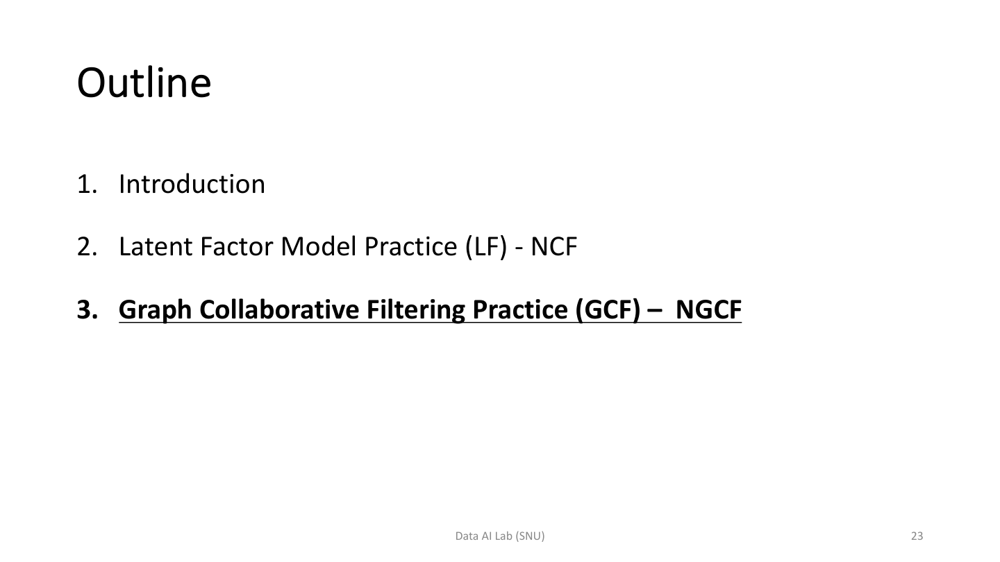

### OCR
- Outline
- 1. Introduction
- 2. Latent Factor Model Practice (LF) - NCF
- 3. Graph Collaborative Filtering Practice (GCF) - NGCF
- Data Al Lab (SNU)
- 23

## Page 24

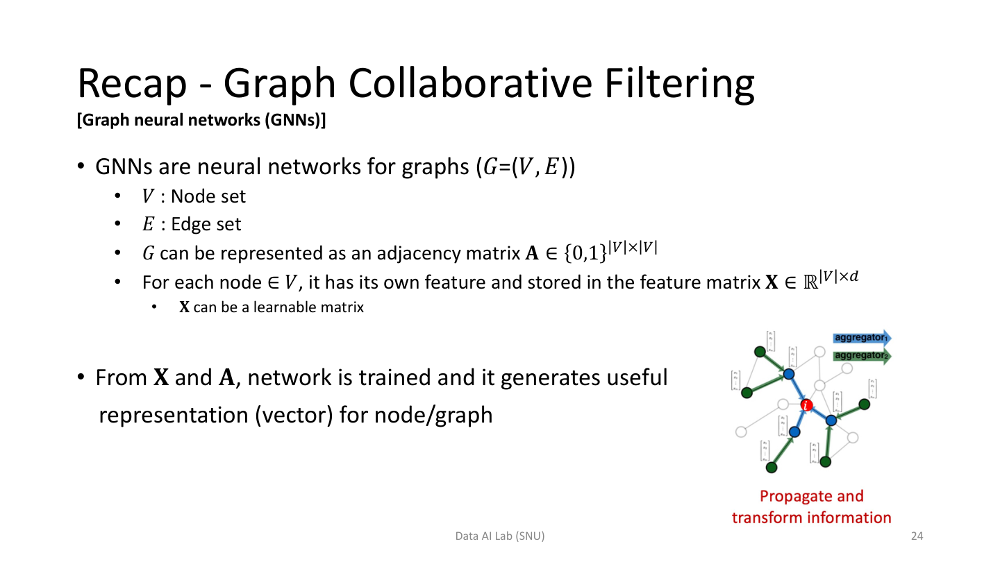

### OCR
- Recap - Graph Collaborative Filtering
- [Graph neural networks (GNNs)]
- GNNs are neural networks for graphs (G=(V, E))
- V : Node set
- E:Edge set
- G can be represented as an adjacency matrix A E {0,1}lvlxIv|
- For each node E V, it has its own feature and stored in the feature matrix X E Rlvlxd
- X can be a learnable matrix
- aggregatori
- aggregator
- From X and A, network is trained and it generates useful
- representation (vector) for node/graph
- Propagate and
- transforminformation
- Data Al Lab (SNU)
- 24

## Page 25

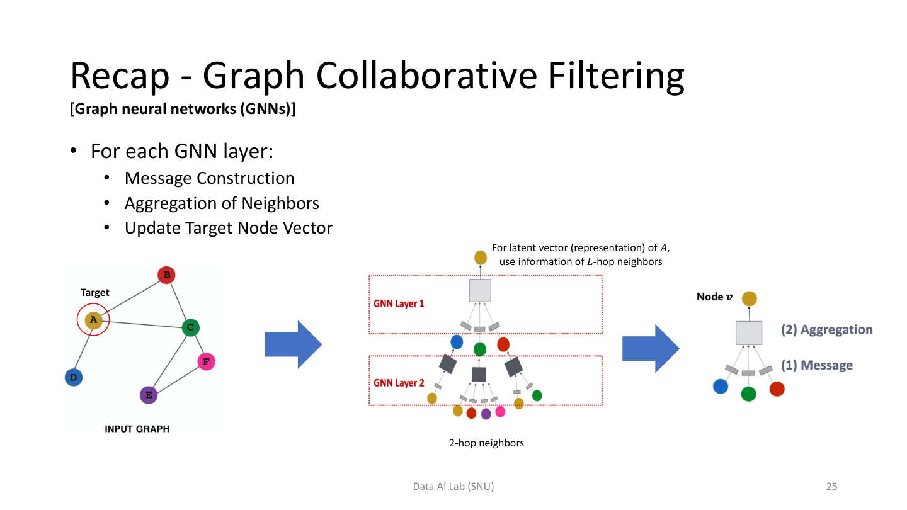

### OCR
- Recap - Graph Collaborative Filtering
- [Graph neural networks(GNNs)]
- For each GNN layer:
- · Message Construction
- Aggregation of Neighbors
- Update Target Node Vector
- For latent vector(representation) of A,
- useinformationof L-hopneighbors
- Target
- Nodev
- GNN Layer1
- (2) Aggregation
- (1) Message
- GNN Layer2
- INPUT GRAPH
- 2-hop neighbors
- Data Al Lab (SNU)
- 25

## Page 26

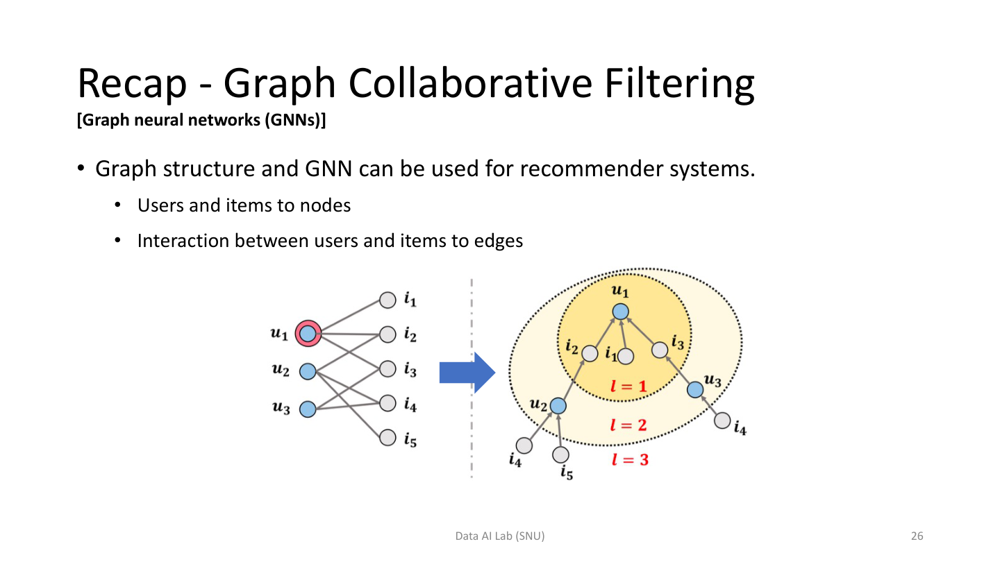

### OCR
- Recap - Graph Collaborative Filtering
- [Graph neural networks (GNNs)]
- · Graph structure and GNN can be used for recommender systems.
- Users and itemstonodes
- Interaction between users and items to edges
- u1
- uz
- u3
- Data Al Lab (SNU)
- 26

## Page 27

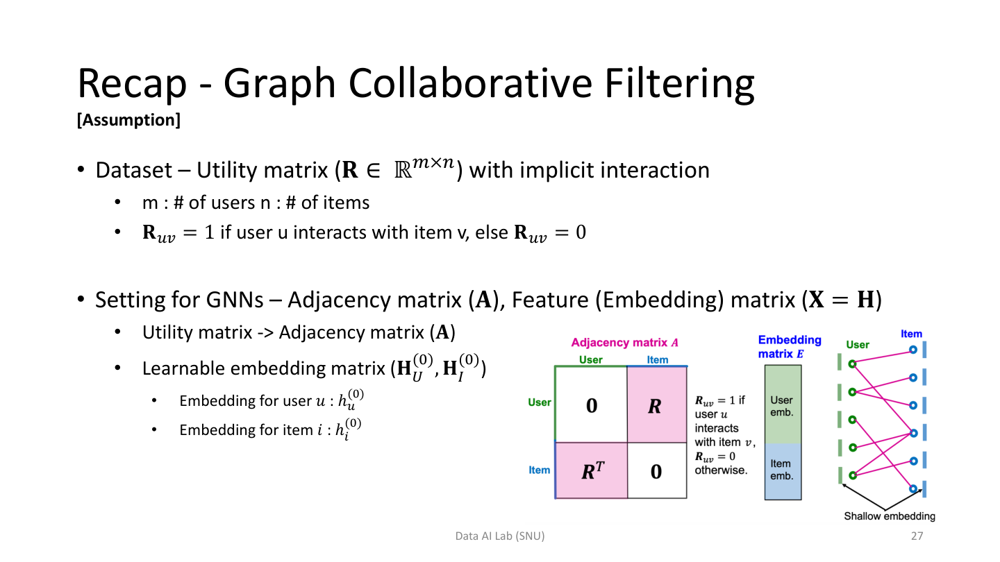

### OCR
- Recap - Graph Collaborative Filtering
- [Assumption]
- · Dataset - Utility matrix (R E Rmxn) with implicit interaction
- m : # of users n : # of items
- Ruv = 1 if user u interacts with item v, else Ruv = 0
- · Setting for GNNs - Adjacency matrix (A), Feature (Embedding) matrix (X = H)
- Utility matrix -> Adjacency matrix (A)
- Item
- AdjacencymatrixA
- Embedding
- User
- Learnable embedding matrix (H, H()
- User
- Item
- matrixE
- Embedding for user u : h(0)
- User
- Ruv = 1 if
- User
- 0
- R
- useru
- emb.
- Embedding for item i : h(0)
- interacts
- with itemv，
- Ruv=0
- RT
- Item
- Item
- 0
- otherwise.
- emb.
- Shallowembedding
- Data Al Lab (SNU)
- 27

## Page 28

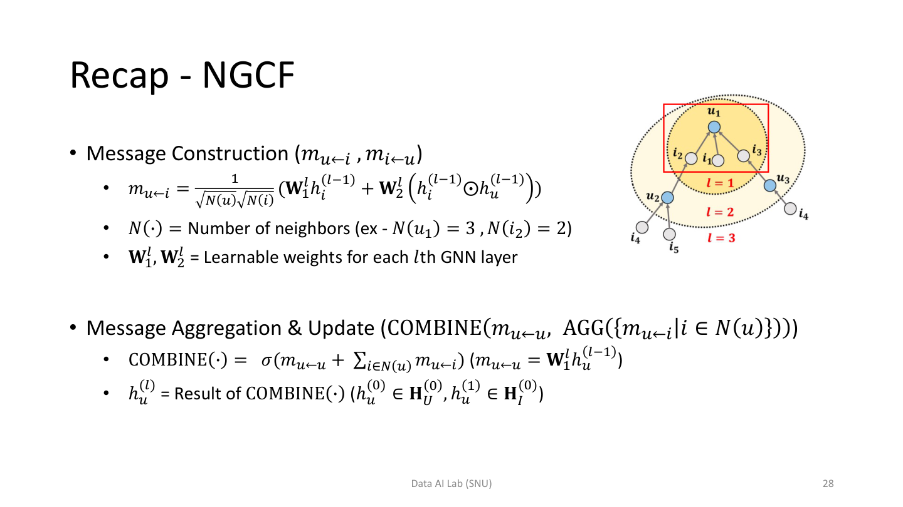

### OCR
- Recap - NGCF
- ·Message Construction (mui ,mitu)
- 1
- mu←i=
- l=1
- l=2
- N() = Number of neighbors (ex - N(u1) = 3 ,N(i2) = 2)
- l=3
- Wl, W2 = Learnable weights for each Ith GNN layer
- ·Message Aggregation & Update (COMBINE(mu-u, AGG({muili E N(u)})))
- h = Result of COMBINE() (h) H,h1) H()
- n
- Data Al Lab (SNU)
- 28

## Page 29

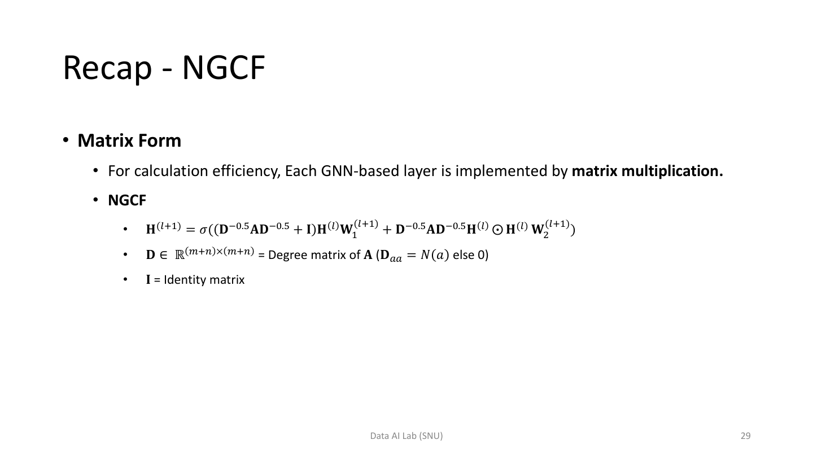

### OCR
- Recap - NGCF
- · Matrix Form
- · For calculation efficiency, Each GNN-based layer is implemented by matrix multiplication.
- ·NGCF
- (+23M ()H (1)Hs0-αVso0-α + (I+1)M()H(I + so-αVso-a)) = (1+1)H
- D ∈ R(m+n)x(m+n) = Degree matrix of A (Daa = N(a) else 0)
- I = Identity matrix
- Data Al Lab (SNU)
- 29

## Page 30

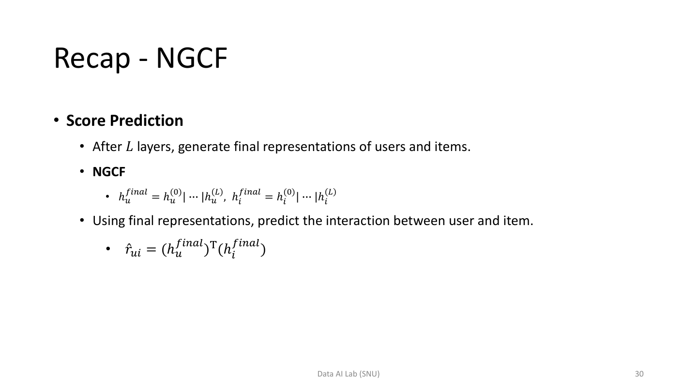

### OCR
- Recap - NGCF
- ·ScorePrediction
- · After L layers, generate final representations of users and items.
- · NGCF
- hfinal
- heI. h, hfinal = hI .. hL)
- u
- · Using final representations, predict the interaction between user and item.
- (pu}y)(puy) = my  ·
- Data Al Lab (SNU)
- 30

## Page 31

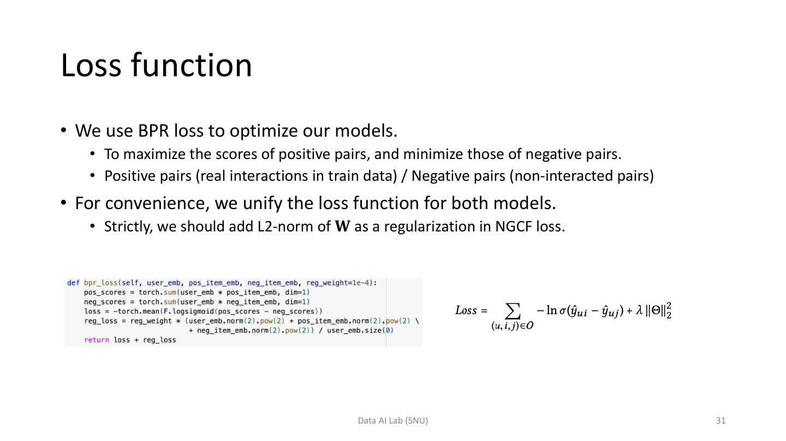

### OCR
- Loss function
- · We use BPR loss to optimize our models.
- · To maximize the scores of positive pairs, and minimize those of negative pairs.
- · Positive pairs (real interactions in train data) / Negative pairs (non-interacted pairs)
- · For convenience, we unify the loss function for both models.
- · Strictly, we should add L2-norm of W as a regularization in NGCF loss.
- def bpr_loss(self, user_emb, pos_item_emb, neg_item_emb， reg_weight=le-4):
- pos_scores = torch.sum(user_emb * pos_item_emb, dim=1)
- neg_scores = torch.sum(user_emb * neg_item_emb，dim=1)
- Loss=
- ∑-lno(yui-guj)+AIl0ll2
- loss = -torch.mean(F.logsigmoid(pos_scores - neg_scores))
- reg_loss = reg_weight *(user_emb.norm(2).pow(2)+ pos_item_emb.norm(2).pow(2）
- (u,i,j)∈o
- + neg_item_emb.norm(2)-pow(2)) / user_emb.size(0)
- return loss + reg_loss
- Data Al Lab (SNU)
- 31

## Page 32

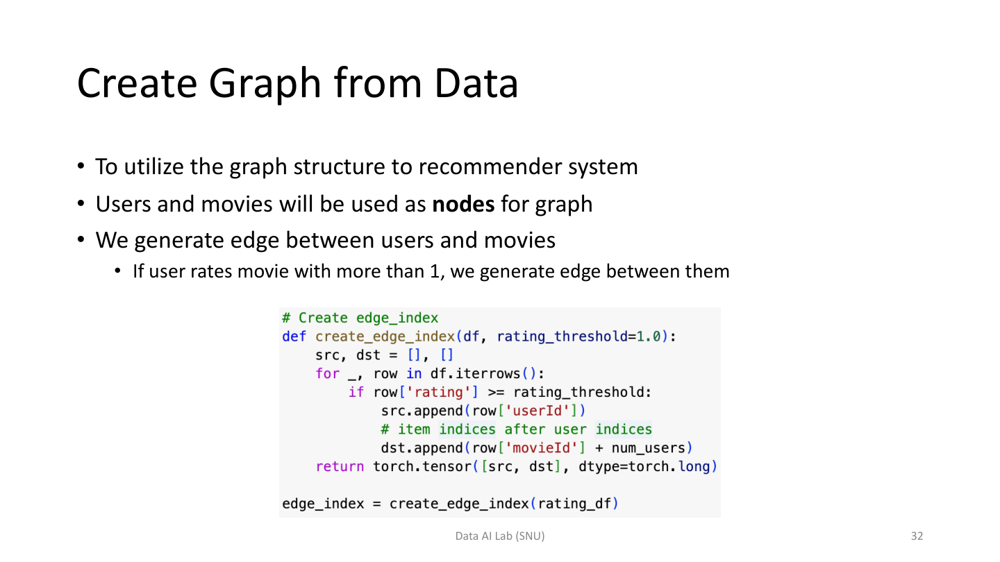

### OCR
- Create Graph from Data
- · To utilize the graph structure to recommender system
- Users and movies will be used as nodes for graph
- · We generate edge between users and movies
- · If user rates movie with more than 1, we generate edge between them
- #Create edge_index
- def create_edge_index(df,rating_threshold=1.0):
- src，dst = []，[]
- for _, row in df.iterrows():
- if row['rating'] >= rating_threshold:
- src.append(row['userId'])
- # item indices after user indices
- dst.append(row['movieId'] + num_users)
- return torch.tensor([src，dst]，dtype=torch.long)
- edge_index = create_edge_index(rating_df)
- Data Al Lab (SNU)
- 32

## Page 33

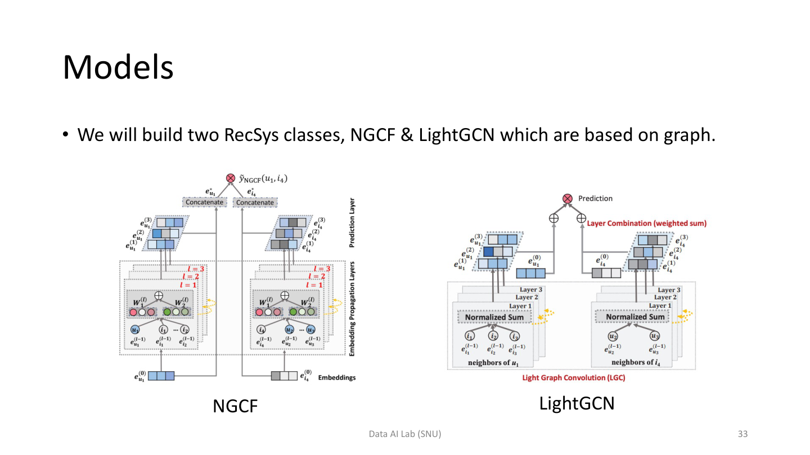

### OCR
- Models
- · We will build two RecSys classes, NGCF & LightGCN which are based on graph.
- yNGCF(Uu1,i4)
- ei4
- Prediction
- Concatenate
- Concatenate
- PredictionLayer
- LayerCombination(weightedsum)
- (2)
- (3)
- (2)
- e(0
- Embedding Propagation Layers
- (1)
- =2
- Layer3
- Layer3
- Layer 2
- Layer2
- Layer1
- Layer1
- NormalizedSum
- NormalizedSum
- 3
- (I1)
- (I1)
- -1)
- ((-1)
- (-1)
- (I-1)
- neighbors of u
- neighbors ofi
- Embeddings
- Light Graph Convolution(LGC)
- LightGCN
- NGCF
- Data Al Lab (SNU)
- 33

## Page 34

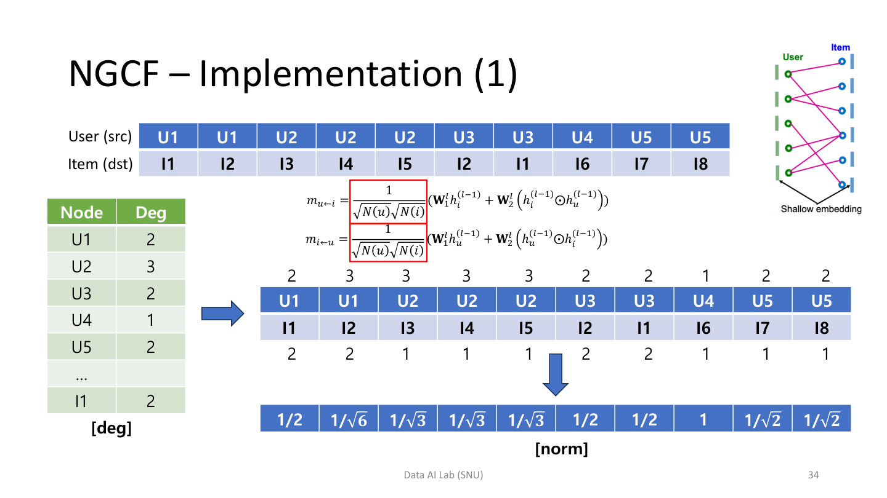

### OCR
- Item
- NGCF - Implementation (1)
- User
- User (src)
- U1
- U2
- U2
- U2
- U3
- U3
- U4
- U5
- U5
- U1
- Item (dst)
- 11
- 12
- 13
- 14
- 15
- 12
- 11
- 16
- 17
- 18
- 1
- (W/h(l-1)
- mui
- Node
- Deg
- √N(u)√N(i)
- Shallowembedding
- (-)y(-y) M+(-yM)
- U1
- 2
- 1
- mi-u
- /N(u)√N(i)
- U2
- 3
- 2
- 3
- 3
- 3
- 2
- 2
- 2
- 2
- U3
- 2
- U1
- U1
- U2
- U2
- U2
- U3
- U3
- U4
- U5
- U5
- U4
- 1
- 11
- 12
- 13
- 14
- 15
- 12
- 11
- 16
- 17
- 18
- U5
- 2
- 2
- 2
- 1
- 2
- 2
- 1
- 1
- 1
- 11
- 2
- 1/√3
- 1/√2
- 1/√2
- 1/2
- 1/√6
- 1/√3
- 1/√3
- 1/2
- 1/2
- [deg]
- [norm]
- Data Al Lab (SNU)
- 34

## Page 35

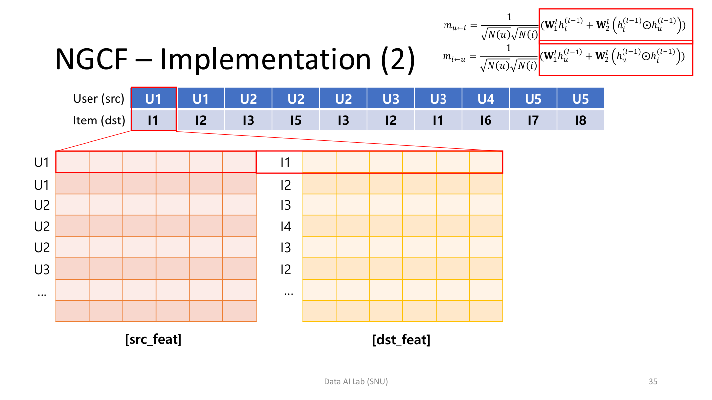

### OCR
- 1
- (-ny(1-y) M + (t-yM)
- muti
- N(u)√N(i)
- 1
- NGCF - Implementation (2)
- (t-y(t-ny)M+ (-yM)
- mi-u
- √N(u)√N(i)
- User (src)
- U2
- U5
- U5
- U1
- U1
- U2
- U2
- U3
- U3
- U4
- Item (dst)
- 11
- 12
- 13
- 15
- 13
- 12
- 11
- 16
- 17
- 18
- U1
- 11
- U1
- 12
- U2
- 13
- U2
- 14
- U2
- 13
- U3
- 12
- [src_feat]
- [dst_feat]
- Data Al Lab (SNU)
- 35

## Page 36

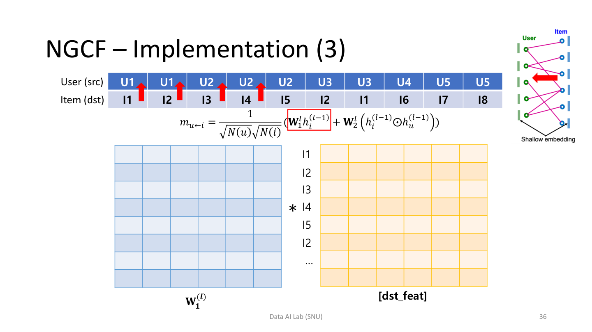

### OCR
- Item
- User
- NGCF - Implementation (3)
- User (src)
- U1
- U2
- U2
- U2
- U5
- U1
- U3
- U3
- U4
- U5
- Item (dst)
- 11
- 12
- 13
- 14
- 15
- 12
- 11
- 16
- 17
- 18
- 1
- (W(h(-1)
- + W2
- 1)Ohl-
- mu-i
- √N(u)/N(i)
- Shallowembedding
- 11
- 12
- 13
- *
- 14
- 15
- 12
- W(l)
- [dst_feat]
- Data Al Lab (SNU)
- 36

## Page 37

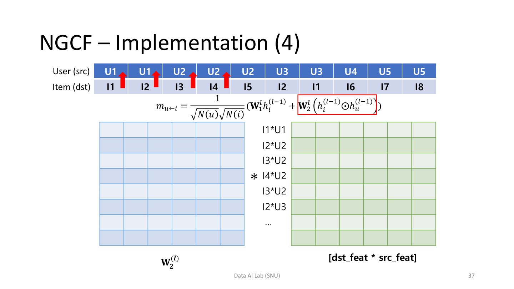

### OCR
- NGCF - Implementation (4)
- User (src)
- U1
- U2
- U2
- U2
- U1
- U3
- U3
- U4
- U5
- U5
- Item (dst)
- 11
- 12
- 13
- 14
- 15
- 12
- 11
- 16
- 17
- 18
- 1
- (Wh(-1)
- W
- (l-1)
- mu-i
- +
- /N(u)√N(i)
- I1*U1
- 12*U2
- 13*U2
- * 14*U2
- 13*U2
- 12*U3
- W,()
- [dst_feat * src_feat]
- 2
- Data Al Lab (SNU)
- 37

## Page 38

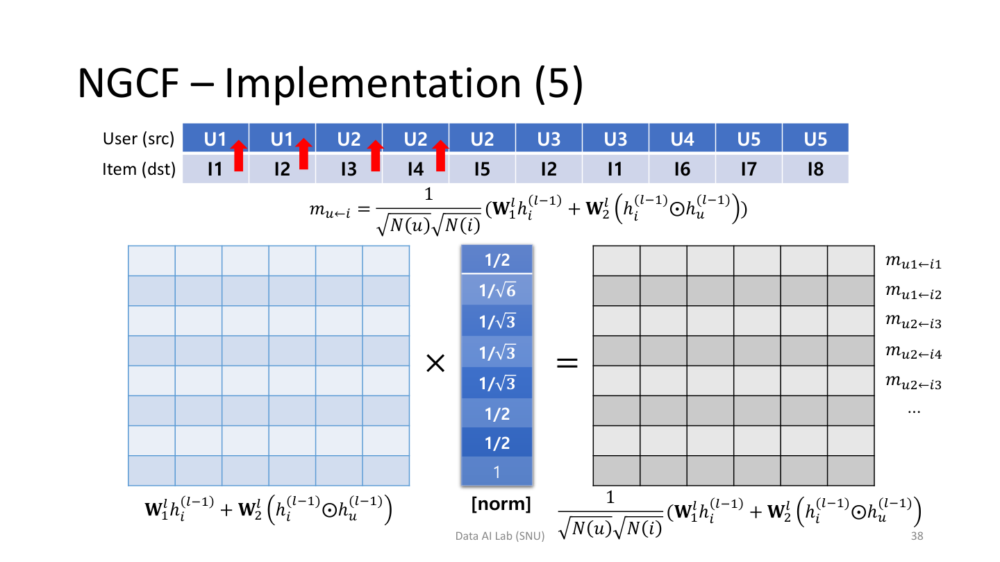

### OCR
- NGCF - Implementation (5)
- User (src)
- U1
- U2
- U2
- U2
- U1
- U3
- U3
- U4
- U5
- U5
- Item (dst)
- 11
- 12
- 13
- 14
- 15
- 12
- 11
- 16
- 17
- 18
- 1
- (Wh(-1) + W(
- Oh(-1))
- mu-i
- √N(u)/N(i)
- 1/2
- mu1←i1
- 1/√6
- mu1←i2
- 1/√3
- mu2-i3
- 1/√3
- mu2←-i4
- 1/√3
- mu2←i3
- 1/2
- 1/2
- Wh(-1) + W (h(-1)0h(-1)
- [norm]
- 1
- (-y(-y)M+(-yM)
- √N(u)√N(i)
- Data Al Lab (SNU)
- 38

## Page 39

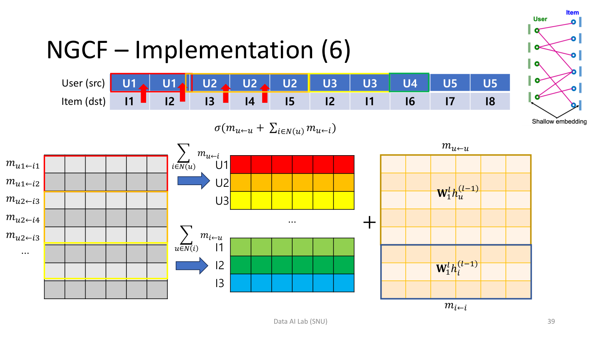

### OCR
- Item
- User
- NGCF - Implementation (6)
- User (src)
- U2
- U2
- U2
- U1
- U1
- U3
- U3
- U4
- U5
- U5
- Item (dst)
- 11
- 12
- 13
- 14
- 15
- 12
- 11
- 16
- 17
- 18
- Shallowembedding
- o(mu-u + ZieN(u) mu-i)
- mu-u
- muei
- mu1←i1
- iEN(u)
- U1
- mu1←i2
- U2
- mu2-i3
- U3
- mu2←i4
- mu2←i3
- mi-u
- uEN(i)
- 11
- Wih(l-1)
- 12
- 13
- miti
- Data Al Lab (SNU)
- 39

## Page 40

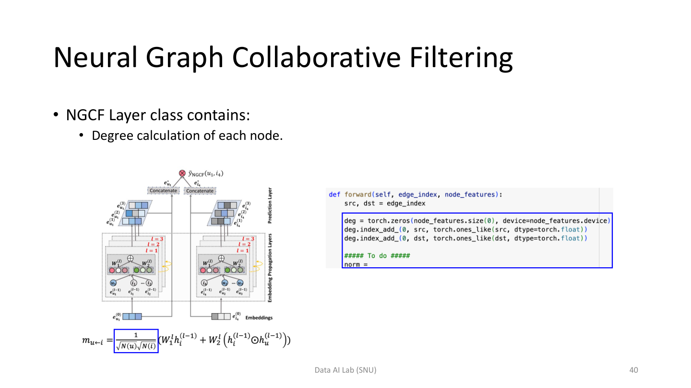

### OCR
- Neural Graph Collaborative Filtering
- · NGCF Layer class contains:
- · Degree calculation of each node.
- yNGCF（u,i4)
- X
- eus
- e's
- Concatenate
- Concatenate
- def forward(self，edge_index，node_features):
- src，dst= edge_index
- deg = torch.zeros(node_features.size(0)，device=node_features.device)
- deg.index_add_(0，src,torch.ones_like(src，dtype=torch.float))
- deg.index_add_(0，dst，torch.ones_like(dst，dtype=torch.float))
- #####Todo#####
- norm=
- eEmbeddings
- (0)
- mui
- (-7y(-y)M + (-yM)
- N(u)√N(i)
- Data Al Lab (SNU)
- 40

## Page 41

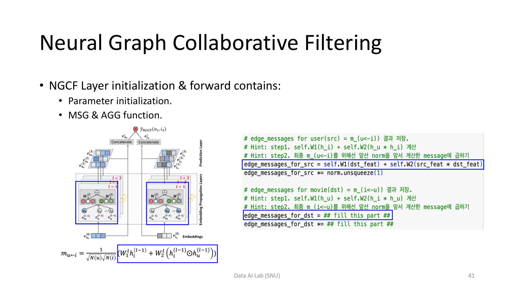

### OCR
- Neural Graph Collaborative Filtering
- NGCF Layer initialization & forward contains:
- ·Parameter initialization.
- ·MSG & AGG function.
- yNGCr(u,i4)
- eu
- eis
- # edge_messages for user(src）= m_(u<-i)） 2 .
- Concatenate
- Concatenate
- # Hint: step1.self.W1(h_i）+ self.W2(h_u * h_i）
- #Hint：step2.m_(u<-i）normmessage]
- edge_messages_for_src = self.w1(dst_feat) + self.w2(src_feat * dst_feat)
- edge_messages_for_src *=norm.unsqueeze(1)
- # edge_messages for movie(dst） = m_(i<-u)） 2 对.
- # Hint: step1.self.W1(h_u）+ self.W2(h_i * h_u）
- #Hint：step2，m（i<-u）normmessage
- edge_messages_for_dst =##fill this part ##
- I1)
- e(1-1)
- edge_messages_for_dst *=## fill thispart ##
- eEmbeddings
- (-y(-y)M+(-yM)
- mu-i
- N(u)√N(i)
- Data Al Lab (SNU)
- 41

## Page 42

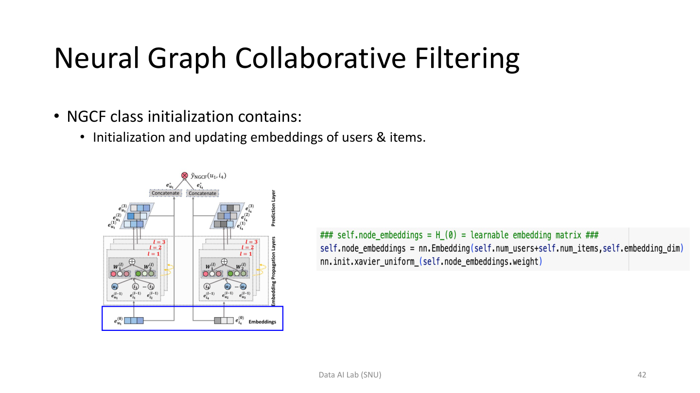

### OCR
- Neural Graph Collaborative Filtering
- ·NGCF class initialization contains:
- · Initialization and updating embeddings of users & items.
- yNGCF（u,i4)
- X
- eu
- e's
- Concatenate
- Concatenate
- ### self.node_embeddings =H_(0）=learnable embedding matrix ###
- self.node_embeddings = nn.Embedding(self.num_users+self.num_items,self.embedding_dim)
- nn.init.xavier_uniform_(self.node_embeddings.weight)
- eEmbeddings
- Data Al Lab (SNU)
- 42

## Page 43

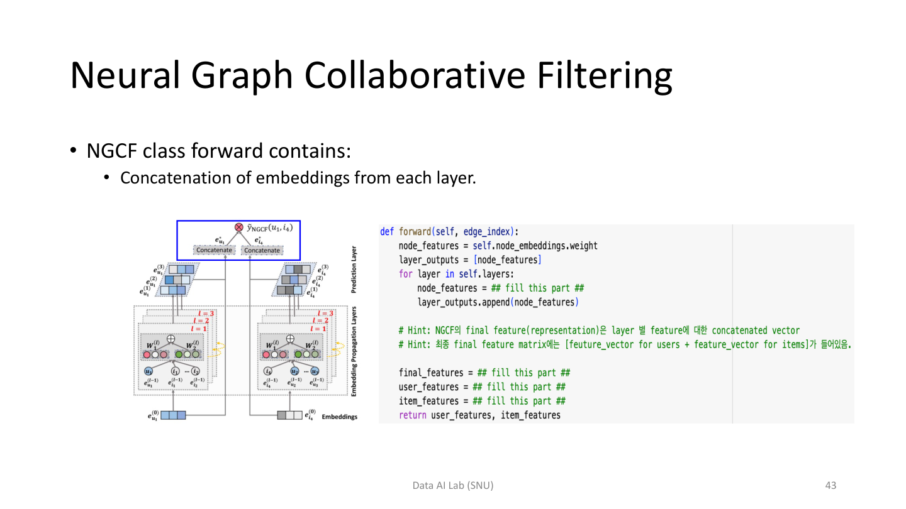

### OCR
- Neural Graph Collaborative Filtering
- ·NGCFclassforward contains:
- ·Concatenation of embeddings from each layer.
- yNGCF（u,i4)
- def forward(self， edge_index):
- eus
- eis
- Concatenate
- node_features=self.node_embeddings.weight
- Concatenate
- layer_outputs = [node_features]
- for layer in self.layers:
- node_features = # fill this part ##
- layer_outputs.append(node_features)
- # Hint: NGCF final feature(representation) layer  featured H concatenated vector
- #Hint:否 final feature matrixol[feuture_vector for users+feature_vector for items]7 ol双.
- final_features = ## fill this part #
- user_features = ## fill this part ##
- item_features = ## fill this part ##
- eEmbeddings
- return user_features，item_features
- Data Al Lab (SNU)
- 43

## Page 44

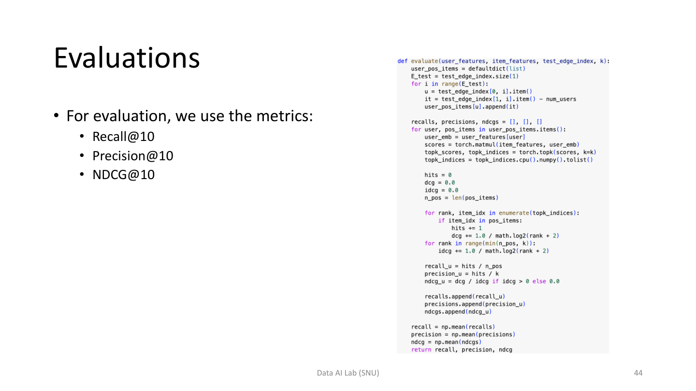

### OCR
- Evaluations
- def evaluate(user_features, item_features, test_edge_index, k):
- user_pos_items = defaultdict(list)
- E_test = test_edge_index.size(1)
- for i in range(E_test):
- u=test_edge_index[0，i].item()
- it = test_edge_index[1, i].item() - num_users
- user_pos_items [u] .append(it)
- · For evaluation, we use the metrics:
- recalls, precisions, ndcgs = [], [], []
- ·Recall@10
- for user, pos_items in user_pos_items.items():
- user_emb = user_features [user]
- scores = torch.matmul(item_features,user_emb)
- ·Precision@10
- topk_scores，topk_indices = torch.topk(scores，k=k)
- topk_indices = topk_indices.cpu().numpy().tolist()
- ·NDCG@10
- hits = 0
- dcg = 0.0
- idcg = 0.0
- n_pos = len(pos_items)
- for rank, item_idx in enumerate(topk_indices):
- if item_idx in pos_items:
- hits += 1
- dcg += 1.0 / math.log2(rank + 2)
- for rank in range(min(n_pos, k)):
- idcg += 1.0 / math.log2(rank + 2)
- recall_u = hits / n_pos
- precision_u = hits / k
- ndcg_u = dcg / idcg if idcg >0 else 0.0
- recalls.append(recall_u)
- precisions.append(precision_u)
- ndcgs.append(ndcg_u)
- recall= np.mean(recalls)
- precision = np.mean(precisions)
- ndcg = np.mean(ndcgs)
- return recall,precision,ndcg
- Data Al Lab (SNU)
- 44

## Page 45

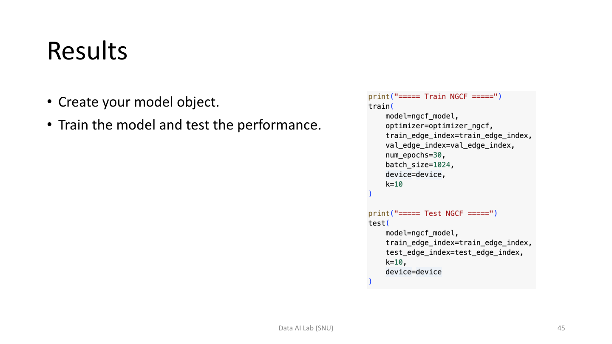

### OCR
- Results
- print("====
- ：TrainNGCF
- · Create your model object.
- train(
- model=ngcf_model,
- · Train the model and test the performance.
- optimizer=optimizer_ngcf,
- train_edge_index=train_edge_index,
- val_edge_index=val_edge_index,
- num_epochs=30,
- batch_size=1024,
- device=device,
- k=10
- print("
- Test NGCF
- test(
- model=ngcf_model,
- train_edge_index=train_edge_index,
- test_edge_index=test_edge_index,
- k=10,
- device=device
- Data Al Lab (SNU)
- 45

## Page 46

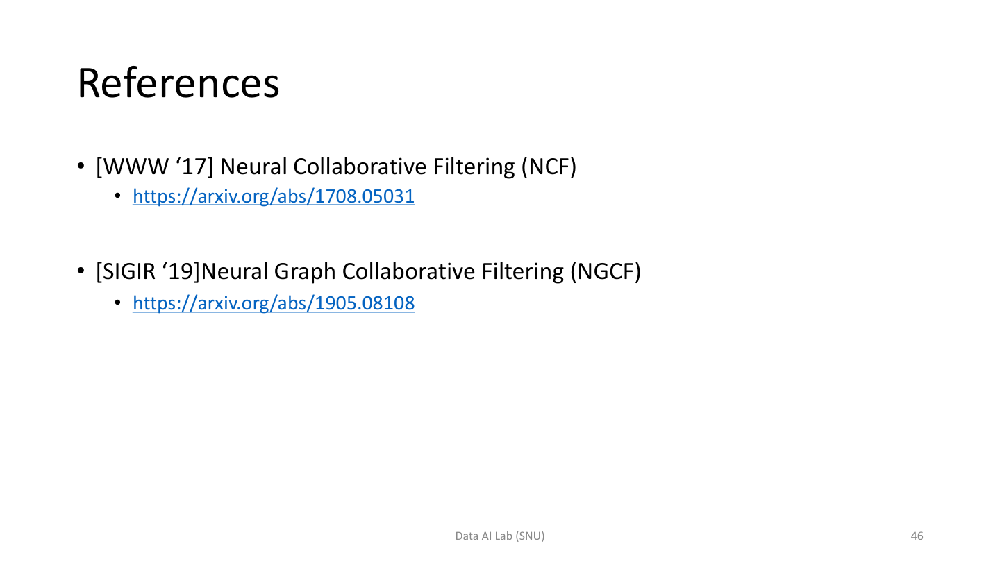

### OCR
- References
- [Www ‘17] Neural Collaborative Filtering (NCF)
- ·https://arxiv.org/abs/1708.05031
- [SlGIR ‘19]Neural Graph Collaborative Filtering (NGCF)
- ·https://arxiv.org/abs/1905.08108
- Data Al Lab (SNU)
- 46

