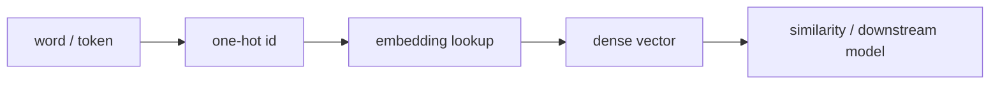

# LLM 01. Vector Space / Word Embedding 깊은 복습

> 대상 원본: `llm_hands_on/Chapter_1_Exercise_Vector Space.ipynb`  
> 목표: 단어를 벡터로 표현한다는 말의 의미와 `gensim` 코드의 입출력을 이해한다.

---

## 그림으로 먼저 잡기



| 표현 | 그림 | 한계/장점 |
|---|---|---|
| one-hot | 축 하나만 1 | 의미 유사도 표현 어려움 |
| dense vector | 여러 차원에 의미 분산 | 거리/방향으로 관계 표현 |
| embedding matrix | id → row lookup | 코드에서는 `nn.Embedding` |


## 0. 핵심 요약

| 개념 | 의미 | 코드에서 보는 값 |
|---|---|---|
| word vector | 단어를 실수 벡터로 표현 | `model['king'] -> (50,)` |
| similarity | 벡터 방향이 비슷한 정도 | cosine similarity |
| analogy | 의미 방향 연산 | `king - man + woman ≈ queen` |
| embedding space | 단어들이 놓인 의미 공간 | 가까운 단어끼리 군집 |

```text
단어 "cat" ──lookup──> [0.12, -0.03, ..., 0.44]  # 50차원
```

---

## 1. 왜 벡터인가?

모델은 문자열 자체를 이해하지 못한다. 숫자 텐서를 계산한다.

```text
"dog" -> token/id -> vector -> neural network
```

좋은 embedding은 의미가 비슷한 단어를 가까이 둔다.

```text
cosine(cat, dog)  > cosine(cat, airplane)
```

---

## 2. GloVe / Word2Vec 직관

이 챕터는 `glove-wiki-gigaword-50` 같은 사전학습 embedding을 쓴다.

| 모델 | 학습 직관 |
|---|---|
| Word2Vec | 주변 단어를 예측하도록 학습 |
| GloVe | 전체 corpus의 co-occurrence 통계를 factorization |

논문 관점에서 둘 다 “분포 가설”을 이용한다.

> 비슷한 문맥에 등장하는 단어는 비슷한 의미를 가진다.

---

## 3. 코드 흐름

```python
import gensim.downloader as api
model = api.load('glove-wiki-gigaword-50')
vec = model['king']
```

shape:

```text
vec.shape == (50,)
```

50은 embedding dimension이다. 단어 하나가 50개의 실수로 표현된다.

---

## 4. 유사도 계산

```python
model.similarity('king', 'queen')
model.most_similar('king')
```

cosine similarity:

```text
cos(a,b) = (a · b) / (||a|| ||b||)
```

크기보다 방향을 본다. embedding에서는 방향이 의미 관계를 담는 경우가 많다.

---

## 5. analogy 연산

```python
model.most_similar(positive=['king', 'woman'], negative=['man'])
```

수식:

```text
v = embedding(king) - embedding(man) + embedding(woman)
가장 가까운 단어 ≈ queen
```

이게 항상 맞는 것은 아니다. corpus bias, 단어 빈도, 다의어 문제가 있다. 그래도 “의미 방향”을 보는 좋은 실습이다.

---

## 6. LLM embedding과의 연결

Word2Vec/GloVe는 단어마다 고정 벡터다.

현대 LLM은 token embedding을 시작점으로 쓰고, Transformer layer를 지나며 contextual embedding으로 바뀐다.

```text
초기 token embedding: "bank" 하나의 벡터
문맥 embedding: "river bank"와 "bank account"에서 서로 다른 벡터
```

---

## 7. 복습 질문

1. embedding dimension 50은 단어 수인가, 벡터 길이인가?
2. cosine similarity는 벡터의 크기와 방향 중 무엇에 더 집중하는가?
3. `king - man + woman` 연산이 가능한 이유는 무엇인가?
4. 고정 embedding과 contextual embedding은 무엇이 다른가?
