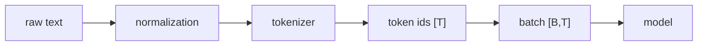

# LLM 02. Dataset / Tokenizer / Embedding 깊은 복습

> 대상 원본: `llm_hands_on/Chapter_2_Exercise_Dataset.ipynb`  
> 목표: 텍스트가 GPT 학습용 `[input_ids, target_ids]` 배치가 되는 과정을 shape 중심으로 이해한다.

---

## 그림으로 먼저 잡기



| 변환 단계 | 예시 | 확인할 shape |
|---|---|---|
| text | 문자열 | Python `str` |
| tokens | subword pieces | 길이 `T` |
| ids | 정수 index | `[T]` 또는 `[B,T]` |
| attention mask | pad 구분 | `[B,T]` |


## 0. 한 장 요약

```text
raw text
 -> tokenizer.encode
 -> token ids: [T]
 -> sliding window
 -> input chunks:  [num_samples, max_length]
 -> target chunks: [num_samples, max_length]
 -> DataLoader batch: [B, max_length]
 -> token embedding: [B, max_length, emb_dim]
 -> positional embedding 더하기
```

---

## 1. Tokenizer

`tiktoken.get_encoding('gpt2')`는 문자열을 GPT-2 BPE token id로 바꾼다.

```python
tokenizer = tiktoken.get_encoding('gpt2')
ids = tokenizer.encode('Hello, do you like tea?')
```

출력:

```text
ids: List[int]
예: [15496, 11, ...]
```

token은 단어가 아니라 subword 조각이다. 한국어/중국어/영어마다 tokenizer 효율이 다를 수 있다.

---

## 2. GPTDatasetV1 핵심

노트북의 핵심 클래스:

```python
class GPTDatasetV1(Dataset):
    def __init__(self, txt, tokenizer, max_length, stride):
        token_ids = tokenizer.encode(txt)
        for i in range(0, len(token_ids) - max_length, stride):
            input_chunk = token_ids[i:i + max_length]
            target_chunk = token_ids[i + 1:i + max_length + 1]
            self.input_ids.append(torch.tensor(input_chunk))
            self.target_ids.append(torch.tensor(target_chunk))
```

shape:

```text
input_chunk:  [L]
target_chunk: [L]
```

목표는 “다음 token 예측”이다.

```text
input:  [t0, t1, t2, t3]
target: [t1, t2, t3, t4]
```

---

## 3. stride의 의미

`max_length=4, stride=1`이면:

```text
tokens:  0 1 2 3 4 5 6
sample1 input:  0 1 2 3   target: 1 2 3 4
sample2 input:    1 2 3 4 target: 2 3 4 5
sample3 input:      2 3 4 5 target: 3 4 5 6
```

`stride=max_length`이면 겹치지 않는다. `stride`가 작으면 데이터는 많아지지만 중복도 많다.

---

## 4. DataLoader batch

```python
dataloader = DataLoader(dataset, batch_size=8, shuffle=True, drop_last=True)
```

`__getitem__`이 `[L]` tensor 두 개를 반환하므로 batch는:

```text
input_batch:  [B,L]
target_batch: [B,L]
```

예: `B=8, L=4`면 `[8,4]`.

---

## 5. Token embedding

```python
token_embedding_layer = torch.nn.Embedding(vocab_size, output_dim)
token_embeddings = token_embedding_layer(input_batch)
```

shape:

```text
input_batch:      [B,L]      # int token ids
token_embeddings: [B,L,D]    # float vectors
```

`Embedding(vocab_size, D)`는 사실 lookup table이다.

```text
weight: [vocab_size, D]
input id 15496 -> weight[15496] -> [D]
```

---

## 6. Positional embedding

GPT는 sequence 순서를 알아야 한다.

```python
pos_embedding_layer = torch.nn.Embedding(context_length, output_dim)
pos_embeddings = pos_embedding_layer(torch.arange(max_length))
input_embeddings = token_embeddings + pos_embeddings
```

shape:

```text
token_embeddings: [B,L,D]
pos_embeddings:   [L,D] -> broadcast -> [B,L,D]
sum:              [B,L,D]
```

---

## 7. Hugging Face 파일 구조

| 파일 | 의미 |
|---|---|
| `config.json` | 모델 구조 설정. layer 수, hidden size 등 |
| `model.safetensors` | 학습된 weight |
| `tokenizer.json` | tokenizer 규칙 |
| `tokenizer_config.json` | tokenizer 옵션 |
| `generation_config.json` | 생성 기본값 |

---

## 8. 복습 질문

1. next-token target은 input과 몇 칸 차이나는가?
2. `Embedding`의 입력 dtype은 보통 float인가 int인가?
3. `input_batch [B,L]`가 embedding 후 왜 `[B,L,D]`가 되는가?
4. positional embedding은 token embedding과 concat하는가 더하는가?
