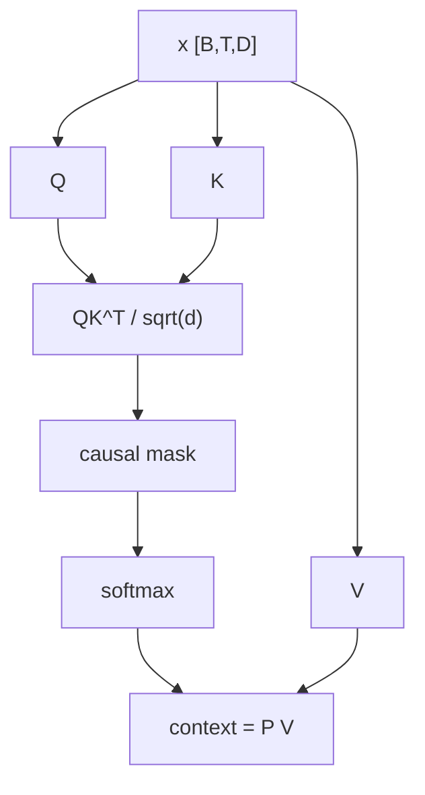

# LLM 03. Causal / Multi-Head Attention 깊은 복습

> 대상 원본: `llm_hands_on/Chapter_3_Excercise_Attention.ipynb`, `Chapter_3_Excercise_Viz_Multi_head_attention.ipynb`  
> 목표: Self-Attention의 Q/K/V, causal mask, multi-head shape를 완전히 이해한다.

---

## 그림으로 먼저 잡기



| 행렬 | shape | 그림 직관 |
|---|---:|---|
| `QK^T` | `[B,T,T]` | 각 token이 어느 token을 볼지 점수표 |
| causal mask | `[T,T]` | 오른쪽 위 미래 token 차단 |
| `PV` | `[B,T,D]` | attention weight로 value를 섞은 결과 |


## 0. 한 장 요약

```text
x: [B,T,d_in]
Q = x Wq -> [B,T,d_out]
K = x Wk -> [B,T,d_out]
V = x Wv -> [B,T,d_out]
scores = Q K^T -> [B,T,T]
causal mask로 미래 token 차단
softmax -> attention weights [B,T,T]
context = weights V -> [B,T,d_out]
```

---

## 1. Attention은 “어떤 token을 얼마나 볼까?”다

문장 token sequence:

```text
x1 x2 x3 x4
```

각 token은 다른 token을 참고해 자기 표현을 업데이트한다.

```text
new_x3 = 0.1*x1 + 0.2*x2 + 0.7*x3 + 0.0*x4  # causal이면 x4 못 봄
```

---

## 2. Q/K/V 의미

| 이름 | 직관 | shape |
|---|---|---:|
| Query | 내가 찾는 정보 | `[B,T,D]` |
| Key | 내가 가진 정보의 주소/색인 | `[B,T,D]` |
| Value | 실제로 가져올 내용 | `[B,T,D]` |

```text
Query_i · Key_j 가 크다
=> token i가 token j를 많이 본다
```

---

## 3. CausalAttention 코드 흐름

```python
queries = self.W_query(x)
keys = self.W_key(x)
values = self.W_value(x)
attn_scores = queries @ keys.transpose(1, 2)
attn_scores.masked_fill_(mask.bool()[:T, :T], -torch.inf)
attn_weights = torch.softmax(attn_scores / keys.shape[-1]**0.5, dim=-1)
context_vec = attn_weights @ values
```

shape 예:

```text
x:           [B,T,d_in]
queries:     [B,T,d_out]
keys.T:      [B,d_out,T]
scores:      [B,T,T]
weights:     [B,T,T]
values:      [B,T,d_out]
context:     [B,T,d_out]
```

---

## 4. 왜 `sqrt(d_k)`로 나누나?

`Q·K`는 차원이 커질수록 분산이 커진다. softmax 입력이 너무 커지면 한 위치에 확 몰려 gradient가 작아질 수 있다.

```text
scores_scaled = scores / sqrt(d_k)
```

논문: **Attention Is All You Need**의 Scaled Dot-Product Attention.

---

## 5. causal mask

GPT는 다음 token을 예측하므로 미래를 보면 cheating이다.

```text
allowed matrix for T=4
      k1 k2 k3 k4
q1    O  X  X  X
q2    O  O  X  X
q3    O  O  O  X
q4    O  O  O  O
```

mask 후 미래 위치 score는 `-inf`, softmax 후 0이 된다.

---

## 6. MultiHeadAttention

한 개 attention head만 있으면 한 종류의 관계만 강하게 볼 수 있다. 여러 head는 서로 다른 관계를 병렬로 본다.

```text
D = 768, heads = 12
head_dim = 64
```

shape:

```text
x: [B,T,D]
qkv linear: [B,T,D]
reshape: [B,T,heads,head_dim]
transpose: [B,heads,T,head_dim]
scores: [B,heads,T,T]
context: [B,heads,T,head_dim]
transpose+reshape: [B,T,D]
out_proj: [B,T,D]
```

---

## 7. wrapper vs efficient implementation

노트북에는 `MultiHeadAttentionWrapper`와 `MultiHeadAttention`이 있다.

| 방식 | 구현 | 장점 | 단점 |
|---|---|---|---|
| wrapper | head마다 `CausalAttention` ModuleList | 이해 쉬움 | 느림/비효율 |
| single module | 한 번에 qkv 계산 후 reshape | 실제 구현에 가까움 | shape 이해 필요 |

둘 다 수학적으로는 같은 일을 한다.

---

## 8. Attention visualization

GPT-2 attention 시각화는 특정 layer/head의 `[T,T]` matrix를 본다.

```text
attention[layer]: [B, heads, T, T]
head h:           [T,T]
row i: token i가 보는 key token 분포
```

언어 모델에서 diagonal 근처가 강하면 가까운 과거를 보는 head, 특정 구문 위치를 보면 syntax/position head일 수 있다.

---

## 9. 복습 질문

1. causal attention에서 token 3은 token 4를 볼 수 있는가?
2. attention score shape이 `[B,T,T]`인 이유는 무엇인가?
3. multi-head에서 `D % heads == 0`이어야 하는 이유는?
4. Value는 score 계산에 직접 쓰이는가, 마지막 weighted sum에 쓰이는가?
