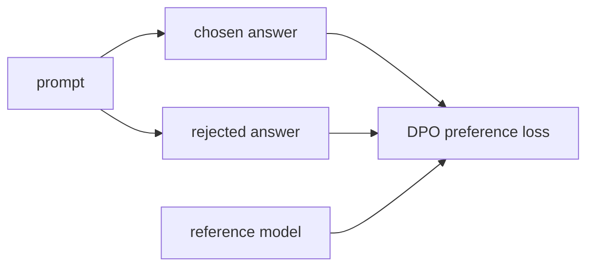

# LLM 07+. DPO 깊은 복습

> 대상 원본: `llm_hands_on/Chapter_7_Exercise_Follow_Instructions_dpo.ipynb`  
> 목표: DPO가 chosen/rejected pair로 preference를 학습하는 방식을 수식과 코드 shape로 이해한다.

---

## 그림으로 먼저 잡기



| RLHF와 비교 | RLHF/PPO | DPO |
|---|---|---|
| reward model | 별도 학습 필요 | 명시적 reward model 없이 preference loss |
| 구현 난도 | 높음 | 상대적으로 단순 |
| 핵심 데이터 | prompt + chosen/rejected | 같은 쌍 사용 |


## 0. 한 장 요약

DPO는 사람이 선호한 답변(chosen)과 덜 선호한 답변(rejected)을 비교해 policy model을 업데이트한다.

```text
prompt x
chosen response y_w
rejected response y_l

policy_model:    학습됨
reference_model: 고정됨
```

목표: policy가 reference 대비 chosen을 rejected보다 더 선호하게 만든다.

---

## 1. SFT와 DPO 차이

| 단계 | 데이터 | 목표 |
|---|---|---|
| SFT | prompt -> answer | 정답 답변을 next-token으로 모방 |
| DPO | prompt + chosen/rejected | 선호 답변의 logprob를 상대적으로 높임 |

DPO는 RLHF의 reward model/PPO 단계를 단순화한 preference optimization이다.

---

## 2. log probability 계산

답변 sequence의 logprob는 token logprob 합이다.

```text
log p(y|x) = Σ_t log p(y_t | x, y_<t)
```

코드 shape:

```text
input_ids: [B,L]
logits:    [B,L,V]
target:    [B,L]
log_probs per token -> gather target id -> [B,L]
mask 후 sum -> [B]
```

prompt/pad token은 loss 계산에서 제외해야 한다.

---

## 3. DPO loss 직관

정책 모델과 기준 모델의 chosen/rejected 선호 차이를 비교한다.

```text
policy_logratio = logp_policy(chosen) - logp_policy(rejected)
ref_logratio    = logp_ref(chosen)    - logp_ref(rejected)
logits = beta * (policy_logratio - ref_logratio)
loss = -logsigmoid(logits)
```

`beta`는 reference에서 얼마나 벗어날지 조절하는 온도 역할이다.

---

## 4. 왜 reference model이 필요한가?

reference가 없으면 policy가 선호 pair만 과하게 맞추며 원래 언어능력/스타일을 망칠 수 있다.

reference model은 “SFT 모델에서 너무 멀어지지 말라”는 기준이다.

---

## 5. chosen/rejected batch

한 sample은 보통 이렇게 확장된다.

```text
prompt + chosen
prompt + rejected
```

각각 tokenization/padding 후 logprob를 계산한다.

```text
chosen_input_ids:   [B,Lc]
rejected_input_ids: [B,Lr]
```

구현에서는 padding으로 같은 길이에 맞추거나 별도로 계산한다.

---

## 6. 생성 비교

DPO 후에는 같은 prompt에 대해:

- chosen 스타일의 답변 확률이 올라가고
- rejected 스타일의 답변 확률이 내려가야 한다.

하지만 작은 데이터/짧은 학습에서는 눈에 띄는 변화가 약할 수 있다.

---

## 7. 복습 질문

1. DPO에는 policy model과 reference model 중 어느 것이 업데이트되는가?
2. chosen/rejected는 각각 무엇을 의미하는가?
3. DPO loss에서 reference logratio를 빼는 이유는?
4. sequence logprob는 token logprob를 평균내는가, 합하는가? 구현마다 다를 수 있지만 기본 수식은 합이다.
