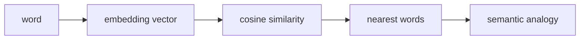

# LLM Practice 01. Vector Space / Word Embedding 코드 학습 가이드

- 대상 원본: `llm_hands_on/Chapter_1_Exercise_Vector Space.ipynb`
- 목표: 사전학습 단어 벡터를 불러와 유사도, analogy, nearest neighbors가 벡터 연산으로 동작한다는 점을 확인한다.

## 1. 전체 흐름

## 2. Shape / 데이터 구조 표

| 객체 | shape / 구조 | 의미 |
|---|---:|---|
| `word key` | `string` | 모델 vocabulary의 token/단어 |
| `embedding` | `[D]` | 한 단어의 의미 벡터 |
| `similarity` | `scalar` | cosine similarity 또는 distance |
| `top-k result` | `list[(word, score)]` | 가까운 단어 후보와 점수 |

## 3. Cell range map

| 셀 | 역할 | 보는 것 |
|---:|---|---|
| 0 | 실습 목적 | Gensim으로 word embedding 의미 공간을 다룸 |
| 1 | 패키지 설치 | gensim 설치 여부 확인 |
| 2 | Gensim tutorial 실행 | 가벼운 pretrained vector 다운로드와 similarity/analogy 확인 |
| 3-7 | 온라인 데모 | soldier, Korea/Busan/Japan, mother 등 의미 위치를 직접 탐색 |

## 4. Cell-by-cell 학습 메모

### Cells 0 — 실습 목적
- 핵심 관찰: Gensim으로 word embedding 의미 공간을 다룸
- 실행 결과보다 “어떤 객체가 다음 단계 입력이 되는가”를 먼저 확인한다.

### Cells 1 — 패키지 설치
- 핵심 관찰: gensim 설치 여부 확인
- 실행 결과보다 “어떤 객체가 다음 단계 입력이 되는가”를 먼저 확인한다.

### Cells 2 — Gensim tutorial 실행
- 핵심 관찰: 가벼운 pretrained vector 다운로드와 similarity/analogy 확인
- 실행 결과보다 “어떤 객체가 다음 단계 입력이 되는가”를 먼저 확인한다.

### Cells 3-7 — 온라인 데모
- 핵심 관찰: soldier, Korea/Busan/Japan, mother 등 의미 위치를 직접 탐색
- 실행 결과보다 “어떤 객체가 다음 단계 입력이 되는가”를 먼저 확인한다.

## 5. 꼭 붙잡을 개념

- 단어 벡터는 사람이 정한 좌표가 아니라 주변 문맥 예측 과정에서 학습된 좌표다.
- 왕-남자+여자≈여왕 같은 analogy는 벡터 차이가 관계를 담을 때 가능하다.
- 가까운 단어는 항상 정답이 아니라 corpus 편향과 토큰화 방식의 결과다.

## 6. 실수 포인트

- 단어가 vocabulary에 없으면 OOV 오류가 난다.
- cosine similarity가 높다고 항상 같은 품사/정답 관계라는 뜻은 아니다.
- 한국어/영어, 대소문자, 고유명사 표기가 모델마다 다르다.

## 7. 복습 체크리스트

- `word key`의 `string`가 어느 단계에서 만들어지고 다음 단계에서 어떻게 쓰이는지 설명할 수 있는가?
- `embedding`의 `[D]`가 어느 단계에서 만들어지고 다음 단계에서 어떻게 쓰이는지 설명할 수 있는가?
- `similarity`의 `scalar`가 어느 단계에서 만들어지고 다음 단계에서 어떻게 쓰이는지 설명할 수 있는가?
- `top-k result`의 `list[(word, score)]`가 어느 단계에서 만들어지고 다음 단계에서 어떻게 쓰이는지 설명할 수 있는가?
- notebook을 실행하지 않아도 전체 data flow를 그림으로 다시 그릴 수 있는가?
