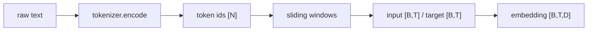

# LLM Practice 02. Dataset / Tokenizer 코드 학습 가이드

- 대상 원본: `llm_hands_on/Chapter_2_Exercise_Dataset.ipynb`
- 목표: 텍스트 파일을 tokenizer로 token id sequence로 바꾸고, next-token prediction용 input/target batch를 만드는 과정을 이해한다.

## 1. 전체 흐름

## 2. Shape / 데이터 구조 표

| 객체 | shape / 구조 | 의미 |
|---|---:|---|
| `raw text` | `string` | The Verdict 등 긴 말뭉치 |
| `token_ids` | `[N]` | tokenizer가 만든 정수 sequence |
| `input_ids` | `[B,T]` | 현재 context token |
| `target_ids` | `[B,T]` | 한 칸 뒤 next token |
| `token embedding` | `[B,T,D]` | 각 token id의 학습 가능한 vector |
| `position embedding` | `[T,D]` | 위치 정보 |

## 3. Cell range map

| 셀 | 역할 | 보는 것 |
|---:|---|---|
| 0 | tiktoken 확인 | GPT-2 BPE tokenizer 로드 |
| 1 | 데이터 다운로드 | datas/the-verdict.txt 준비 |
| 2-4 | GPTDatasetV1/DataLoader | max_length와 stride로 input/target window 생성 |
| 5 | random split TODO | train/validation 분리와 재현성 |
| 6-8 | token/position embedding | [B,T]가 [B,T,D]로 바뀌는 과정 |
| 9-11 | Hugging Face tokenizer와 tokenizer web | Qwen tokenizer, cl100k_base 비교 |

## 4. Cell-by-cell 학습 메모

### Cells 0 — tiktoken 확인
- 핵심 관찰: GPT-2 BPE tokenizer 로드
- 실행 결과보다 “어떤 객체가 다음 단계 입력이 되는가”를 먼저 확인한다.

### Cells 1 — 데이터 다운로드
- 핵심 관찰: datas/the-verdict.txt 준비
- 실행 결과보다 “어떤 객체가 다음 단계 입력이 되는가”를 먼저 확인한다.

### Cells 2-4 — GPTDatasetV1/DataLoader
- 핵심 관찰: max_length와 stride로 input/target window 생성
- 실행 결과보다 “어떤 객체가 다음 단계 입력이 되는가”를 먼저 확인한다.

### Cells 5 — random split TODO
- 핵심 관찰: train/validation 분리와 재현성
- 실행 결과보다 “어떤 객체가 다음 단계 입력이 되는가”를 먼저 확인한다.

### Cells 6-8 — token/position embedding
- 핵심 관찰: [B,T]가 [B,T,D]로 바뀌는 과정
- 이 구간은 위 shape 표와 직접 연결해서 batch 축, sequence/spatial 축, feature/class 축을 분리해 읽는다.

### Cells 9-11 — Hugging Face tokenizer와 tokenizer web
- 핵심 관찰: Qwen tokenizer, cl100k_base 비교
- 실행 결과보다 “어떤 객체가 다음 단계 입력이 되는가”를 먼저 확인한다.

## 5. 꼭 붙잡을 개념

- next-token 학습에서는 target이 input을 오른쪽으로 한 칸 민 sequence다.
- stride가 작으면 sample 수가 많아지고 overlap이 커진다.
- token embedding과 position embedding은 shape가 더해질 수 있게 [B,T,D]로 맞춰진다.

## 6. 실수 포인트

- batch 축 B와 context 길이 T를 혼동하지 말 것.
- max_length를 키우면 메모리 사용량이 attention에서 대략 T^2로 커진다.
- tokenizer가 다르면 같은 문장도 token 개수와 id가 달라진다.

## 7. 복습 체크리스트

- `raw text`의 `string`가 어느 단계에서 만들어지고 다음 단계에서 어떻게 쓰이는지 설명할 수 있는가?
- `token_ids`의 `[N]`가 어느 단계에서 만들어지고 다음 단계에서 어떻게 쓰이는지 설명할 수 있는가?
- `input_ids`의 `[B,T]`가 어느 단계에서 만들어지고 다음 단계에서 어떻게 쓰이는지 설명할 수 있는가?
- `target_ids`의 `[B,T]`가 어느 단계에서 만들어지고 다음 단계에서 어떻게 쓰이는지 설명할 수 있는가?
- notebook을 실행하지 않아도 전체 data flow를 그림으로 다시 그릴 수 있는가?
