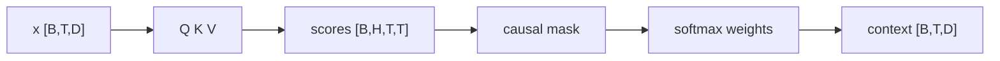

# LLM Practice 03. Causal / Multi-Head Attention 코드 학습 가이드

- 대상 원본: `llm_hands_on/Chapter_3_Excercise_Attention.ipynb`
- 목표: query/key/value, causal mask, multi-head 분할이 문맥 정보를 [B,T,D] 안에서 섞는 방식을 shape-first로 따라간다.

## 1. 전체 흐름

## 2. Shape / 데이터 구조 표

| 객체 | shape / 구조 | 의미 |
|---|---:|---|
| `x` | `[B,T,D]` | token representation |
| `Q,K,V` | `[B,H,T,d_h]` | head별 query/key/value |
| `attention scores` | `[B,H,T,T]` | 각 token이 이전 token을 보는 점수 |
| `causal mask` | `[T,T]` | 미래 token 차단 |
| `context` | `[B,T,D]` | head concat 후 출력 |

## 3. Cell range map

| 셀 | 역할 | 보는 것 |
|---:|---|---|
| 0 | CausalAttention 클래스 | single-head causal self-attention 구현 |
| 1 | 작은 입력 예제 | 직접 만든 6개 token vector로 shape 확인 |
| 2 | MultiHeadAttentionWrapper | single-head 여러 개를 감싸는 방식 |
| 3 | MultiHeadAttention | QKV projection과 head concat을 한 module로 구현 |
| 4-6 | 이미지/시뮬레이션 링크 | attention이 무엇을 보는지 시각적으로 복습 |

## 4. Cell-by-cell 학습 메모

### Cells 0 — CausalAttention 클래스
- 핵심 관찰: single-head causal self-attention 구현
- 실행 결과보다 “어떤 객체가 다음 단계 입력이 되는가”를 먼저 확인한다.

### Cells 1 — 작은 입력 예제
- 핵심 관찰: 직접 만든 6개 token vector로 shape 확인
- 이 구간은 위 shape 표와 직접 연결해서 batch 축, sequence/spatial 축, feature/class 축을 분리해 읽는다.

### Cells 2 — MultiHeadAttentionWrapper
- 핵심 관찰: single-head 여러 개를 감싸는 방식
- 실행 결과보다 “어떤 객체가 다음 단계 입력이 되는가”를 먼저 확인한다.

### Cells 3 — MultiHeadAttention
- 핵심 관찰: QKV projection과 head concat을 한 module로 구현
- 실행 결과보다 “어떤 객체가 다음 단계 입력이 되는가”를 먼저 확인한다.

### Cells 4-6 — 이미지/시뮬레이션 링크
- 핵심 관찰: attention이 무엇을 보는지 시각적으로 복습
- 실행 결과보다 “어떤 객체가 다음 단계 입력이 되는가”를 먼저 확인한다.

## 5. 꼭 붙잡을 개념

- causal mask는 학습 때도 미래 정답 token을 보지 못하게 만드는 핵심 장치다.
- multi-head는 같은 sequence를 여러 subspace에서 병렬로 본 뒤 다시 합친다.
- 출력 shape가 입력과 같은 [B,T,D]여야 Transformer residual connection이 가능하다.

## 6. 실수 포인트

- softmax 축은 key 위치 축이다.
- mask 후 softmax를 해야 미래 위치 확률이 0이 된다.
- head_dim*d_heads가 d_out과 맞지 않으면 concat/project 단계가 깨진다.

## 7. 복습 체크리스트

- `x`의 `[B,T,D]`가 어느 단계에서 만들어지고 다음 단계에서 어떻게 쓰이는지 설명할 수 있는가?
- `Q,K,V`의 `[B,H,T,d_h]`가 어느 단계에서 만들어지고 다음 단계에서 어떻게 쓰이는지 설명할 수 있는가?
- `attention scores`의 `[B,H,T,T]`가 어느 단계에서 만들어지고 다음 단계에서 어떻게 쓰이는지 설명할 수 있는가?
- `causal mask`의 `[T,T]`가 어느 단계에서 만들어지고 다음 단계에서 어떻게 쓰이는지 설명할 수 있는가?
- notebook을 실행하지 않아도 전체 data flow를 그림으로 다시 그릴 수 있는가?
