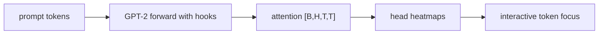

# LLM Practice 03+. Multi-Head Attention Visualization 코드 학습 가이드

<!-- aisp-exam-practice-notice -->
> **시험 대비 모드:** 오른쪽에는 원본 전체 코드 대신 핵심 셀을 `## 정답 입력`으로 비운 실습본이 표시됩니다.
> 원본은 `llm_hands_on/Chapter_3_Excercise_Viz_Multi_head_attention.ipynb`, 정답과 출제 의도는 `study_notes/exam_answers/language_code_answers.md`에서 확인합니다.

- 대상 원본: `llm_hands_on/Chapter_3_Excercise_Viz_Multi_head_attention.ipynb`
- 목표: GPT-2 attention weight를 head별 heatmap과 interactive widget으로 보며 layer/head/token 위치의 의미를 구분한다.

## 1. 전체 흐름

## 2. Shape / 데이터 구조 표

| 객체 | shape / 구조 | 의미 |
|---|---:|---|
| `tokens` | `[T] 또는 [1,T]` | prompt token ids |
| `all_attentions[layer]` | `[B,H,T,T]` | layer별 attention |
| `single head map` | `[T,T]` | 한 head의 query-token by key-token heatmap |
| `widget selection` | `layer/head/token index` | 사용자가 보는 slice |

## 3. Cell range map

| 셀 | 역할 | 보는 것 |
|---:|---|---|
| 0 | 노트북 제목 | attention visualization 목적 |
| 1 | 모델/토크나이저 로드 | GPT-2와 이전 챕터 helper 준비 |
| 2 | head heatmap grid | 특정 layer의 모든 head를 2D heatmap으로 표시 |
| 3 | ipywidgets UI | layer/head/query token을 바꿔 attention 분포 탐색 |

## 4. Cell-by-cell 학습 메모

### Cells 0 — 노트북 제목
- 핵심 관찰: attention visualization 목적
- 실행 결과보다 “어떤 객체가 다음 단계 입력이 되는가”를 먼저 확인한다.

### Cells 1 — 모델/토크나이저 로드
- 핵심 관찰: GPT-2와 이전 챕터 helper 준비
- 실행 결과보다 “어떤 객체가 다음 단계 입력이 되는가”를 먼저 확인한다.

### Cells 2 — head heatmap grid
- 핵심 관찰: 특정 layer의 모든 head를 2D heatmap으로 표시
- 실행 결과보다 “어떤 객체가 다음 단계 입력이 되는가”를 먼저 확인한다.

### Cells 3 — ipywidgets UI
- 핵심 관찰: layer/head/query token을 바꿔 attention 분포 탐색
- 실행 결과보다 “어떤 객체가 다음 단계 입력이 되는가”를 먼저 확인한다.

## 5. 꼭 붙잡을 개념

- 행(query)은 현재 token, 열(key)은 참고한 과거 token으로 읽는다.
- head마다 보는 패턴이 달라서 한 head만 보고 모델 전체를 설명하면 안 된다.
- attention map은 설명 단서이지 정답 원인 증명은 아니다.

## 6. 실수 포인트

- tokenizer subword 때문에 사람이 보는 단어와 token 위치가 다를 수 있다.
- 긴 prompt는 T가 커져 heatmap이 복잡해진다.
- widget은 notebook 환경 의존성이 있어 정적 HTML에서는 상호작용이 제한될 수 있다.

## 7. 복습 체크리스트

- `tokens`의 `[T] 또는 [1,T]`가 어느 단계에서 만들어지고 다음 단계에서 어떻게 쓰이는지 설명할 수 있는가?
- `all_attentions[layer]`의 `[B,H,T,T]`가 어느 단계에서 만들어지고 다음 단계에서 어떻게 쓰이는지 설명할 수 있는가?
- `single head map`의 `[T,T]`가 어느 단계에서 만들어지고 다음 단계에서 어떻게 쓰이는지 설명할 수 있는가?
- `widget selection`의 `layer/head/token index`가 어느 단계에서 만들어지고 다음 단계에서 어떻게 쓰이는지 설명할 수 있는가?
- notebook을 실행하지 않아도 전체 data flow를 그림으로 다시 그릴 수 있는가?
