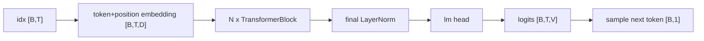

# LLM Practice 04. GPT Architecture 코드 학습 가이드

- 대상 원본: `llm_hands_on/Chapter_4_Excercise_GPT.ipynb`
- 목표: Dataset, MHA, LayerNorm, GELU, FeedForward, TransformerBlock, GPTModel, generation loop가 하나의 GPT forward로 조립되는 과정을 이해한다.

## 1. 전체 흐름

## 2. Shape / 데이터 구조 표

| 객체 | shape / 구조 | 의미 |
|---|---:|---|
| `idx` | `[B,T]` | token id batch |
| `residual stream` | `[B,T,D]` | block 사이를 흐르는 representation |
| `attention output` | `[B,T,D]` | 문맥 혼합 결과 |
| `FFN output` | `[B,T,D]` | token별 feature 변환 |
| `logits` | `[B,T,V]` | 각 위치의 vocabulary 점수 |
| `idx_next` | `[B,1]` | 생성된 다음 token |

## 3. Cell range map

| 셀 | 역할 | 보는 것 |
|---:|---|---|
| 0 | Chapter 2 dataset 재사용 | input/target batch 준비 |
| 1 | Chapter 3 attention 재사용 | causal MHA module |
| 2 | LayerNorm/GELU/FeedForward | pre-LN block 구성 요소 |
| 3-4 | TransformerBlock/GPTModel | embedding부터 output head까지 조립 |
| 5 | GPT-2 124M config | vocab/context/emb/head/layer 수 확인 |
| 6 | 빈 셀 또는 실행 확인 | 생성 결과 확인 |

## 4. Cell-by-cell 학습 메모

### Cells 0 — Chapter 2 dataset 재사용
- 핵심 관찰: input/target batch 준비
- 실행 결과보다 “어떤 객체가 다음 단계 입력이 되는가”를 먼저 확인한다.

### Cells 1 — Chapter 3 attention 재사용
- 핵심 관찰: causal MHA module
- 실행 결과보다 “어떤 객체가 다음 단계 입력이 되는가”를 먼저 확인한다.

### Cells 2 — LayerNorm/GELU/FeedForward
- 핵심 관찰: pre-LN block 구성 요소
- 실행 결과보다 “어떤 객체가 다음 단계 입력이 되는가”를 먼저 확인한다.

### Cells 3-4 — TransformerBlock/GPTModel
- 핵심 관찰: embedding부터 output head까지 조립
- 실행 결과보다 “어떤 객체가 다음 단계 입력이 되는가”를 먼저 확인한다.

### Cells 5 — GPT-2 124M config
- 핵심 관찰: vocab/context/emb/head/layer 수 확인
- 실행 결과보다 “어떤 객체가 다음 단계 입력이 되는가”를 먼저 확인한다.

### Cells 6 — 빈 셀 또는 실행 확인
- 핵심 관찰: 생성 결과 확인
- 실행 결과보다 “어떤 객체가 다음 단계 입력이 되는가”를 먼저 확인한다.

## 5. 꼭 붙잡을 개념

- GPT는 모든 위치에서 다음 token logits를 동시에 만든다. 생성 때는 마지막 위치 logits만 사용한다.
- Pre-LN block은 x + sublayer(norm(x)) 형태로 gradient 흐름을 안정화한다.
- out_head 출력 차원은 embedding dim이 아니라 vocabulary size V다.

## 6. 실수 포인트

- logits [B,T,V]와 생성용 logits[:, -1, :] [B,V]를 구분한다.
- context_length보다 긴 prompt는 잘라야 한다.
- attention/FFN 출력 shape가 [B,T,D]가 아니면 residual add가 불가능하다.

## 7. 복습 체크리스트

- `idx`의 `[B,T]`가 어느 단계에서 만들어지고 다음 단계에서 어떻게 쓰이는지 설명할 수 있는가?
- `residual stream`의 `[B,T,D]`가 어느 단계에서 만들어지고 다음 단계에서 어떻게 쓰이는지 설명할 수 있는가?
- `attention output`의 `[B,T,D]`가 어느 단계에서 만들어지고 다음 단계에서 어떻게 쓰이는지 설명할 수 있는가?
- `FFN output`의 `[B,T,D]`가 어느 단계에서 만들어지고 다음 단계에서 어떻게 쓰이는지 설명할 수 있는가?
- notebook을 실행하지 않아도 전체 data flow를 그림으로 다시 그릴 수 있는가?
