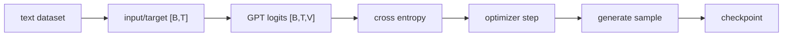

# LLM Practice 05. Pretraining 코드 학습 가이드

- 대상 원본: `llm_hands_on/Chapter_5_Excercise_Pretraining.ipynb`
- 목표: cross entropy loss, evaluation loop, top-k/temperature sampling, 작은 GPT pretraining 루프와 checkpoint 저장/로드 흐름을 이해한다.

## 1. 전체 흐름

## 2. Shape / 데이터 구조 표

| 객체 | shape / 구조 | 의미 |
|---|---:|---|
| `input_ids` | `[B,T]` | context token |
| `target_ids` | `[B,T]` | next token label |
| `logits` | `[B,T,V]` | vocabulary scores |
| `loss input` | `[B*T,V]` | cross entropy에 넣기 위해 flatten |
| `loss target` | `[B*T]` | 정답 token id |
| `generated ids` | `[B,T+n]` | autoregressive output |

## 3. Cell range map

| 셀 | 역할 | 보는 것 |
|---:|---|---|
| 0 | 저작권/기본 코드 | 책 기반 helper와 설정 |
| 1 | loss 계산 | cross entropy와 flatten shape 확인 |
| 2-3 | sampling 옵션 | temperature/top-k로 생성 다양성 조절 |
| 4 | text->ids->text | tokenizer encode/decode와 batch 축 |
| 5 | GPT-2 small config/train | context 256의 작은 pretraining 설정 |
| 6 | 실행/저장 확인 | checkpoint와 sample generation |

## 4. Cell-by-cell 학습 메모

### Cells 0 — 저작권/기본 코드
- 핵심 관찰: 책 기반 helper와 설정
- 실행 결과보다 “어떤 객체가 다음 단계 입력이 되는가”를 먼저 확인한다.

### Cells 1 — loss 계산
- 핵심 관찰: cross entropy와 flatten shape 확인
- 이 구간은 위 shape 표와 직접 연결해서 batch 축, sequence/spatial 축, feature/class 축을 분리해 읽는다.

### Cells 2-3 — sampling 옵션
- 핵심 관찰: temperature/top-k로 생성 다양성 조절
- 실행 결과보다 “어떤 객체가 다음 단계 입력이 되는가”를 먼저 확인한다.

### Cells 4 — text->ids->text
- 핵심 관찰: tokenizer encode/decode와 batch 축
- 실행 결과보다 “어떤 객체가 다음 단계 입력이 되는가”를 먼저 확인한다.

### Cells 5 — GPT-2 small config/train
- 핵심 관찰: context 256의 작은 pretraining 설정
- 실행 결과보다 “어떤 객체가 다음 단계 입력이 되는가”를 먼저 확인한다.

### Cells 6 — 실행/저장 확인
- 핵심 관찰: checkpoint와 sample generation
- 실행 결과보다 “어떤 객체가 다음 단계 입력이 되는가”를 먼저 확인한다.

## 5. 꼭 붙잡을 개념

- cross entropy는 각 위치의 next token classification 문제로 계산된다.
- temperature가 낮으면 보수적, 높으면 다양하지만 불안정한 샘플이 나온다.
- 평가 loss와 생성 샘플은 서로 보완적으로 봐야 한다.

## 6. 실수 포인트

- logits와 targets flatten 축을 맞추지 않으면 loss shape 오류가 난다.
- 작은 데이터/짧은 epoch의 생성 품질을 모델 능력으로 과대평가하지 말 것.
- GPU/CPU에 따라 학습 시간이 크게 달라진다.

## 7. 복습 체크리스트

- `input_ids`의 `[B,T]`가 어느 단계에서 만들어지고 다음 단계에서 어떻게 쓰이는지 설명할 수 있는가?
- `target_ids`의 `[B,T]`가 어느 단계에서 만들어지고 다음 단계에서 어떻게 쓰이는지 설명할 수 있는가?
- `logits`의 `[B,T,V]`가 어느 단계에서 만들어지고 다음 단계에서 어떻게 쓰이는지 설명할 수 있는가?
- `loss input`의 `[B*T,V]`가 어느 단계에서 만들어지고 다음 단계에서 어떻게 쓰이는지 설명할 수 있는가?
- notebook을 실행하지 않아도 전체 data flow를 그림으로 다시 그릴 수 있는가?
