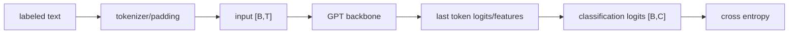

# LLM Practice 06. Classification Fine-tuning 코드 학습 가이드

<!-- aisp-exam-practice-notice -->
> **시험 대비 모드:** 오른쪽에는 원본 전체 코드 대신 핵심 셀을 `## 정답 입력`으로 비운 실습본이 표시됩니다.
> 원본은 `llm_hands_on/Chapter_6_Excercise_Finetuning_Classification.ipynb`, 정답과 출제 의도는 `study_notes/exam_answers/language_code_answers.md`에서 확인합니다.

- 대상 원본: `llm_hands_on/Chapter_6_Excercise_Finetuning_Classification.ipynb`
- 목표: 사전학습 GPT를 spam/ham 같은 분류 문제로 바꾸기 위해 마지막 token representation과 classification head를 fine-tuning하는 흐름을 이해한다.

## 1. 전체 흐름

## 2. Shape / 데이터 구조 표

| 객체 | shape / 구조 | 의미 |
|---|---:|---|
| `text batch` | `list[str]` | 라벨이 있는 문장 |
| `input_ids` | `[B,T]` | padding/truncation된 token ids |
| `attention mask` | `[B,T]` | padding 무시용 mask |
| `class logits` | `[B,C]` | 분류 class 점수 |
| `labels` | `[B]` | 정답 class id |

## 3. Cell range map

| 셀 | 역할 | 보는 것 |
|---:|---|---|
| 0 | 데이터/모델 helper | SMS spam 데이터, tokenizer, GPT helper 준비 |
| 1 | main 실행 블록 | train/val/test split, 학습 루프, 평가 |
| 2 | 실행 확인 | loss/accuracy 변화와 sample prediction 확인 |

## 4. Cell-by-cell 학습 메모

### Cells 0 — 데이터/모델 helper
- 핵심 관찰: SMS spam 데이터, tokenizer, GPT helper 준비
- 실행 결과보다 “어떤 객체가 다음 단계 입력이 되는가”를 먼저 확인한다.

### Cells 1 — main 실행 블록
- 핵심 관찰: train/val/test split, 학습 루프, 평가
- 실행 결과보다 “어떤 객체가 다음 단계 입력이 되는가”를 먼저 확인한다.

### Cells 2 — 실행 확인
- 핵심 관찰: loss/accuracy 변화와 sample prediction 확인
- 실행 결과보다 “어떤 객체가 다음 단계 입력이 되는가”를 먼저 확인한다.

## 5. 꼭 붙잡을 개념

- classification fine-tuning은 next-token 생성 모델을 label 예측 모델로 재사용하는 전이학습이다.
- 분류 head만 학습할지 전체 모델을 풀지에 따라 비용과 성능이 달라진다.
- padding token 위치를 예측 근거로 쓰지 않도록 마지막 유효 token을 잘 골라야 한다.

## 6. 실수 포인트

- label shape [B]와 logits [B,C]를 맞춰야 한다.
- train/validation/test leakage가 있으면 accuracy가 과장된다.
- 작은 데이터에서는 overfitting을 먼저 의심한다.

## 7. 복습 체크리스트

- `text batch`의 `list[str]`가 어느 단계에서 만들어지고 다음 단계에서 어떻게 쓰이는지 설명할 수 있는가?
- `input_ids`의 `[B,T]`가 어느 단계에서 만들어지고 다음 단계에서 어떻게 쓰이는지 설명할 수 있는가?
- `attention mask`의 `[B,T]`가 어느 단계에서 만들어지고 다음 단계에서 어떻게 쓰이는지 설명할 수 있는가?
- `class logits`의 `[B,C]`가 어느 단계에서 만들어지고 다음 단계에서 어떻게 쓰이는지 설명할 수 있는가?
- notebook을 실행하지 않아도 전체 data flow를 그림으로 다시 그릴 수 있는가?
