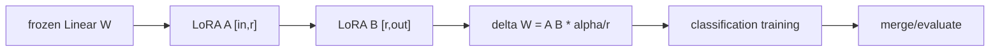

# LLM Practice 06+. LoRA Classification Fine-tuning 코드 학습 가이드

- 대상 원본: `llm_hands_on/Chapter_6_Excercise_Finetuning_Classification_LoRA.ipynb`
- 목표: 기존 weight를 고정하고 low-rank adapter A/B만 학습해 분류 fine-tuning 비용을 줄이는 LoRA 구조를 이해한다.

## 1. 전체 흐름

## 2. Shape / 데이터 구조 표

| 객체 | shape / 구조 | 의미 |
|---|---:|---|
| `base weight W` | `[out,in]` | 고정된 원래 Linear weight |
| `LoRA A` | `[r,in] 또는 [in,r]` | rank r down projection |
| `LoRA B` | `[out,r] 또는 [r,out]` | rank r up projection |
| `delta output` | `[B,T,out]` | base output에 더하는 adapter 결과 |
| `trainable params` | `small subset` | A/B와 head 중심 |

## 3. Cell range map

| 셀 | 역할 | 보는 것 |
|---:|---|---|
| 0 | imports/config | math/time/pathlib/pandas/torch 준비 |
| 1 | 하이퍼파라미터 | rank, alpha, dropout, learning rate 설정 |
| 2 | LoRA 클래스/함수 | Linear layer를 LoRA wrapper로 교체 |
| 3 | main 학습 | 모델 로드, freeze, adapter 학습, 평가 |
| 4 | main 호출 | 실행 결과 확인 |

## 4. Cell-by-cell 학습 메모

### Cells 0 — imports/config
- 핵심 관찰: math/time/pathlib/pandas/torch 준비
- 실행 결과보다 “어떤 객체가 다음 단계 입력이 되는가”를 먼저 확인한다.

### Cells 1 — 하이퍼파라미터
- 핵심 관찰: rank, alpha, dropout, learning rate 설정
- 실행 결과보다 “어떤 객체가 다음 단계 입력이 되는가”를 먼저 확인한다.

### Cells 2 — LoRA 클래스/함수
- 핵심 관찰: Linear layer를 LoRA wrapper로 교체
- 실행 결과보다 “어떤 객체가 다음 단계 입력이 되는가”를 먼저 확인한다.

### Cells 3 — main 학습
- 핵심 관찰: 모델 로드, freeze, adapter 학습, 평가
- 실행 결과보다 “어떤 객체가 다음 단계 입력이 되는가”를 먼저 확인한다.

### Cells 4 — main 호출
- 핵심 관찰: 실행 결과 확인
- 실행 결과보다 “어떤 객체가 다음 단계 입력이 되는가”를 먼저 확인한다.

## 5. 꼭 붙잡을 개념

- LoRA는 W 전체를 바꾸지 않고 ΔW를 low-rank로 근사해 학습한다.
- rank r이 작을수록 효율적이지만 표현력이 줄 수 있다.
- 원본 weight를 고정하므로 저장/배포할 adapter 크기가 작아진다.

## 6. 실수 포인트

- base parameter가 정말 freeze 되었는지 requires_grad를 확인한다.
- A/B shape convention은 구현마다 다르므로 matmul 방향을 확인한다.
- LoRA를 붙일 대상 layer를 잘못 고르면 효과가 작을 수 있다.

## 7. 복습 체크리스트

- `base weight W`의 `[out,in]`가 어느 단계에서 만들어지고 다음 단계에서 어떻게 쓰이는지 설명할 수 있는가?
- `LoRA A`의 `[r,in] 또는 [in,r]`가 어느 단계에서 만들어지고 다음 단계에서 어떻게 쓰이는지 설명할 수 있는가?
- `LoRA B`의 `[out,r] 또는 [r,out]`가 어느 단계에서 만들어지고 다음 단계에서 어떻게 쓰이는지 설명할 수 있는가?
- `delta output`의 `[B,T,out]`가 어느 단계에서 만들어지고 다음 단계에서 어떻게 쓰이는지 설명할 수 있는가?
- notebook을 실행하지 않아도 전체 data flow를 그림으로 다시 그릴 수 있는가?
