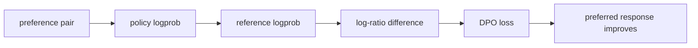

# LLM Practice 07+. DPO 코드 학습 가이드

<!-- aisp-exam-practice-notice -->
> **시험 대비 모드:** 오른쪽에는 원본 전체 코드 대신 핵심 셀을 `## 정답 입력`으로 비운 실습본이 표시됩니다.
> 원본은 `llm_hands_on/Chapter_7_Exercise_Follow_Instructions_dpo.ipynb`, 정답과 출제 의도는 `study_notes/exam_answers/language_code_answers.md`에서 확인합니다.

- 대상 원본: `llm_hands_on/Chapter_7_Exercise_Follow_Instructions_dpo.ipynb`
- 목표: chosen/rejected 응답 쌍으로 reference model 대비 policy model의 선호도를 직접 최적화하는 DPO 흐름을 이해한다.

## 1. 전체 흐름

## 2. Shape / 데이터 구조 표

| 객체 | shape / 구조 | 의미 |
|---|---:|---|
| `prompt` | `[B,Tp]` | 공통 지시문 |
| `chosen/rejected` | `[B,Tc], [B,Tr]` | 선호/비선호 답변 token |
| `logprob sum` | `[B]` | 답변 sequence log probability |
| `reward margin` | `[B]` | policy-reference 차이의 chosen/rejected 격차 |
| `loss` | `scalar` | -log sigmoid(beta*margin) |

## 3. Cell range map

| 셀 | 역할 | 보는 것 |
|---:|---|---|
| 0 | DPO imports/dataset helper | F, DataLoader, preference data 준비 |
| 1 | DPO 개념 markdown | chosen/rejected와 objective 설명 |
| 2 | device/model 준비 | policy/reference model과 tokenizer |
| 3 | loss/eval helper | logprob와 DPO loss 계산 |
| 4 | sample 확인 | test_data 일부 출력 |
| 5 | 학습 실행 | 짧은 DPO training loop |

## 4. Cell-by-cell 학습 메모

### Cells 0 — DPO imports/dataset helper
- 핵심 관찰: F, DataLoader, preference data 준비
- 실행 결과보다 “어떤 객체가 다음 단계 입력이 되는가”를 먼저 확인한다.

### Cells 1 — DPO 개념 markdown
- 핵심 관찰: chosen/rejected와 objective 설명
- 실행 결과보다 “어떤 객체가 다음 단계 입력이 되는가”를 먼저 확인한다.

### Cells 2 — device/model 준비
- 핵심 관찰: policy/reference model과 tokenizer
- 실행 결과보다 “어떤 객체가 다음 단계 입력이 되는가”를 먼저 확인한다.

### Cells 3 — loss/eval helper
- 핵심 관찰: logprob와 DPO loss 계산
- 실행 결과보다 “어떤 객체가 다음 단계 입력이 되는가”를 먼저 확인한다.

### Cells 4 — sample 확인
- 핵심 관찰: test_data 일부 출력
- 실행 결과보다 “어떤 객체가 다음 단계 입력이 되는가”를 먼저 확인한다.

### Cells 5 — 학습 실행
- 핵심 관찰: 짧은 DPO training loop
- 실행 결과보다 “어떤 객체가 다음 단계 입력이 되는가”를 먼저 확인한다.

## 5. 꼭 붙잡을 개념

- DPO는 별도 reward model 없이 선호쌍으로 policy를 조정한다.
- reference model은 policy가 원래 모델에서 너무 멀어지지 않게 비교 기준 역할을 한다.
- beta는 선호 margin을 얼마나 강하게 반영할지 조절한다.

## 6. 실수 포인트

- chosen/rejected token 길이가 달라 padding mask 처리가 중요하다.
- reference model을 accidentally train하면 objective 의미가 깨진다.
- preference dataset 품질이 낮으면 모델도 그 선호를 학습한다.

## 7. 복습 체크리스트

- `prompt`의 `[B,Tp]`가 어느 단계에서 만들어지고 다음 단계에서 어떻게 쓰이는지 설명할 수 있는가?
- `chosen/rejected`의 `[B,Tc], [B,Tr]`가 어느 단계에서 만들어지고 다음 단계에서 어떻게 쓰이는지 설명할 수 있는가?
- `logprob sum`의 `[B]`가 어느 단계에서 만들어지고 다음 단계에서 어떻게 쓰이는지 설명할 수 있는가?
- `reward margin`의 `[B]`가 어느 단계에서 만들어지고 다음 단계에서 어떻게 쓰이는지 설명할 수 있는가?
- notebook을 실행하지 않아도 전체 data flow를 그림으로 다시 그릴 수 있는가?
