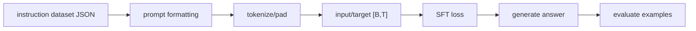

# LLM Practice 07. Instruction Fine-tuning 코드 학습 가이드

- 대상 원본: `llm_hands_on/Chapter_7_Exercise_Follow_Instructions.ipynb`
- 목표: instruction/input/output 형식 데이터를 prompt template로 만들고, assistant 답변 token을 예측하도록 GPT를 fine-tuning하는 흐름을 이해한다.

## 1. 전체 흐름

## 2. Shape / 데이터 구조 표

| 객체 | shape / 구조 | 의미 |
|---|---:|---|
| `record` | `{instruction,input,output}` | 한 개 instruction sample |
| `formatted prompt` | `string` | 모델에 넣는 대화/지시 형식 |
| `input_ids` | `[B,T]` | prompt+answer token |
| `target_ids` | `[B,T]` | next token label, 필요시 mask |
| `generated answer` | `string` | 추론 결과 |

## 3. Cell range map

| 셀 | 역할 | 보는 것 |
|---:|---|---|
| 0 | 책 기반 코드와 helper | 데이터 다운로드/formatting/training helper 포함 |
| 1 | 실행/평가 | instruction fine-tuning, 생성 예시, 결과 확인 |

## 4. Cell-by-cell 학습 메모

### Cells 0 — 책 기반 코드와 helper
- 핵심 관찰: 데이터 다운로드/formatting/training helper 포함
- 실행 결과보다 “어떤 객체가 다음 단계 입력이 되는가”를 먼저 확인한다.

### Cells 1 — 실행/평가
- 핵심 관찰: instruction fine-tuning, 생성 예시, 결과 확인
- 실행 결과보다 “어떤 객체가 다음 단계 입력이 되는가”를 먼저 확인한다.

## 5. 꼭 붙잡을 개념

- SFT는 “좋은 답변을 next-token으로 따라 쓰기”에 가깝다.
- prompt template이 바뀌면 같은 데이터도 token distribution이 달라진다.
- loss를 전체 prompt에 걸지, assistant 답변 부분에 집중할지 구현을 확인해야 한다.

## 6. 실수 포인트

- input과 output 경계를 잃으면 모델이 지시문까지 답변처럼 생성할 수 있다.
- API key나 외부 평가 셀이 있으면 환경변수와 비용을 먼저 확인한다.
- 짧은 epoch 결과를 alignment 완료로 해석하지 말 것.

## 7. 복습 체크리스트

- `record`의 `{instruction,input,output}`가 어느 단계에서 만들어지고 다음 단계에서 어떻게 쓰이는지 설명할 수 있는가?
- `formatted prompt`의 `string`가 어느 단계에서 만들어지고 다음 단계에서 어떻게 쓰이는지 설명할 수 있는가?
- `input_ids`의 `[B,T]`가 어느 단계에서 만들어지고 다음 단계에서 어떻게 쓰이는지 설명할 수 있는가?
- `target_ids`의 `[B,T]`가 어느 단계에서 만들어지고 다음 단계에서 어떻게 쓰이는지 설명할 수 있는가?
- notebook을 실행하지 않아도 전체 data flow를 그림으로 다시 그릴 수 있는가?
