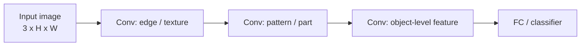
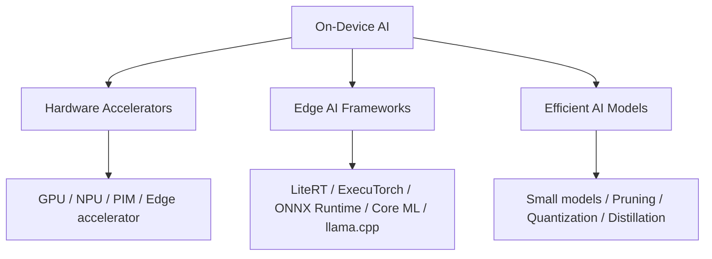

# ODAI-1 Chapter 1. On-Device AI 핵심 정리

범위: `On-Device AI 강의자료/ODAI-1.pdf` p.3~p.26  
다음 챕터 시작: p.27 `Pruning`

> 이 노트는 PDF의 흐름을 따라가되, 시험 준비를 위해 수학적 의미, term 해석, 코드 관점을 함께 정리한다.

---

## 1. 이 챕터의 핵심 질문

요즘 AI 모델은 너무 커졌다. 하지만 모든 입력을 클라우드로 보내서 처리하면 latency, 비용, 개인정보, 네트워크 의존성 문제가 생긴다. 그래서 **AI 모델을 기기 안에서 직접 실행하기 위한 방법**이 필요하다.

한 줄 요약:

```text
On-Device AI = 큰 AI 모델을 작은 디바이스의 제한된 memory / compute / power 안에서 돌리는 문제
```

여기서 중요한 제약은 세 가지다.

| 제약 | 의미 | 모델 관점 |
|---|---|---|
| Memory | weight, activation, KV cache를 저장할 공간 | 모델이 올라가느냐의 문제 |
| Compute | 초당 가능한 연산량 | latency / throughput 문제 |
| Power / Thermal | 전력과 발열 제한 | 지속 실행 가능성 문제 |

On-device AI는 단순히 “작은 모델을 쓰자”가 아니라, 아래 균형을 맞추는 문제다.


---

## 2. DNN 기본 수식과 term 의미

PDF p.3의 기본 식은 neural network layer의 핵심을 보여준다.

$$
y = \mathrm{ReLU}\left(\sum_i w_i x_i + b\right)
$$

각 term의 의미:

| Term | 의미 | 코드 관점 |
|---|---|---|
| $x_i$ | 입력 feature의 i번째 값 | `inputs[..., i]` 또는 activation tensor 원소 |
| $w_i$ | 해당 입력에 곱해지는 weight | `layer.weight` |
| $b$ | bias | `layer.bias` |
| $\sum_i w_ix_i$ | weighted sum / dot product | `torch.matmul`, `nn.Linear`, `nn.Conv2d` 내부 연산 |
| ReLU | 음수는 0, 양수는 유지 | `torch.relu(x)` 또는 `nn.ReLU()` |

벡터로 쓰면:

$$
y = \mathrm{ReLU}(\mathbf{w}^{\top}\mathbf{x} + b)
$$

코드로는 거의 이렇게 대응된다.

```python
# x: [in_features]
# w: [in_features]
# b: scalar
z = torch.sum(w * x) + b
y = torch.relu(z)
```

여러 output neuron을 동시에 계산하면 matrix multiplication이 된다.

$$
\mathbf{y} = \mathrm{ReLU}(W\mathbf{x} + \mathbf{b})
$$

코드 관점:

```python
linear = torch.nn.Linear(in_features, out_features)
y = linear(x)  # 내부적으로 x @ W.T + b
```

즉, 딥러닝 모델이 커진다는 것은 대체로:

```text
W 행렬/tensor가 커지고, 중간 activation tensor도 커진다는 뜻
```

이다.

---

## 3. CNN: 2D feature를 처리하는 모델

PDF p.4의 CNN은 이미지처럼 2D 공간 구조가 있는 데이터를 처리한다.

주요 layer:

- Convolution layer
- Pooling layer
- Fully-connected layer

CNN의 feature map 흐름:



### Conv layer 수식

2D convolution을 단순화하면:

$$
y_{o,h,w} = \sum_{i=1}^{C_{in}} \sum_{u=1}^{K_h} \sum_{v=1}^{K_w} W_{o,i,u,v} \cdot x_{i,h+u,w+v}
$$

각 term:

| Term | 의미 |
|---|---|
| $o$ | output channel index |
| $i$ | input channel index |
| $h,w$ | output feature map 위치 |
| $u,v$ | kernel 내부 위치 |
| $W_{o,i,u,v}$ | conv weight |
| $x_{i,h+u,w+v}$ | 입력 feature map 값 |

PyTorch weight shape:

```text
Conv2d weight = [out_channels, in_channels, kernel_h, kernel_w]
```

예:

```python
conv = torch.nn.Conv2d(3, 64, kernel_size=3, padding=1)
print(conv.weight.shape)  # [64, 3, 3, 3]
```

이 shape은 뒤의 pruning/quantization에서 계속 중요하다.

---

## 4. Transformer / LLM 큰 그림

PDF p.5~p.8은 Transformer와 LLM으로 넘어간다.

Transformer의 핵심은 attention이다. 가장 중요한 수식은 scaled dot-product attention이다.

$$
\mathrm{Attention}(Q,K,V)=\mathrm{softmax}\left(\frac{QK^{\top}}{\sqrt{d_k}}\right)V
$$

각 term:

| Term | 의미 |
|---|---|
| $Q$ | Query, 현재 token이 무엇을 찾는지 |
| $K$ | Key, 각 token이 어떤 정보를 갖는지 |
| $V$ | Value, 실제로 가져올 정보 |
| $d_k$ | key/query dimension |
| $QK^T$ | token 간 유사도 score |
| softmax | attention weight로 정규화 |

코드 관점:

```python
scores = Q @ K.transpose(-2, -1) / math.sqrt(d_k)
attn = torch.softmax(scores, dim=-1)
out = attn @ V
```

LLM은 이 Transformer block을 아주 많이 쌓은 모델이다. 그래서 parameter memory와 activation/KV cache memory가 커진다.

---

## 5. LLM inference: Prefill vs Decode

PDF p.8의 중요한 구분이다.

### 5.1 Prefill phase

입력 prompt token 전체를 처리해서 intermediate state, 특히 key/value cache를 만든다.

```text
입력 token 전체 → Transformer blocks → KV cache 생성
```

특징:

- prompt 길이만큼 병렬 계산 가능
- matrix-matrix multiplication, 즉 GEMM 성격이 강함
- GPU utilization이 비교적 좋을 수 있음

코드 감각:

```python
# input_ids: [batch, prompt_len]
outputs = model(input_ids, use_cache=True)
past_key_values = outputs.past_key_values
```

### 5.2 Decode phase

출력 token을 하나씩 생성한다.

```text
새 token 1개 생성 → KV cache 갱신 → 다음 token 생성 → 반복
```

특징:

- autoregressive라 순차적
- 매 step마다 이전 KV cache를 읽음
- matrix-vector multiplication, 즉 GEMV 성격이 강해짐
- memory-bound가 되기 쉬움

코드 감각:

```python
for _ in range(max_new_tokens):
    outputs = model(next_token, past_key_values=past_key_values, use_cache=True)
    next_token = outputs.logits[:, -1].argmax(dim=-1)
    past_key_values = outputs.past_key_values
```

### 5.3 왜 Decode가 memory-bound인가?

연산 성능은 대략 두 요소의 비율로 이해할 수 있다.

$$
\mathrm{Operational\ Intensity} = \frac{\mathrm{FLOPs}}{\mathrm{Bytes\ moved}}
$$

- 이 값이 크면 compute-bound일 가능성이 큼
- 이 값이 작으면 memory-bound일 가능성이 큼

Decode는 token 하나를 만들기 위해 큰 weight와 KV cache를 계속 읽어야 한다. 그런데 batch가 작으면 재사용성이 낮아져 bytes moved에 비해 FLOPs가 충분히 크지 않다.

그래서:

```text
LLM decode는 계산기 자체보다 memory bandwidth가 병목이 되기 쉽다.
```

---

## 6. Today’s AI is too BIG

PDF p.9의 핵심 문제의식:

```text
모델 크기 증가 속도 > GPU/디바이스 메모리 증가 속도
```

즉, 모델은 빠르게 커지는데 기기의 memory는 그만큼 빠르게 늘지 않는다.

그래서 필요한 방법:

- pruning
- quantization
- knowledge distillation
- smaller architecture
- efficient runtime
- hardware accelerator

---

## 7. Cloud AI vs On-Device AI

PDF p.11의 비교.

### Cloud AI

입력을 서버로 보내고, 서버 GPU에서 AI 연산 후 결과를 다시 받는다.

장점:

- 큰 모델 사용 가능
- 강력한 GPU 서버 활용
- 디바이스 요구사항 낮음

단점:

- 네트워크 필요
- latency 발생
- 서버 비용 증가
- 개인정보/보안 이슈

### On-Device AI

디바이스 안에서 직접 AI 연산을 수행한다.

장점:

- 빠른 응답
- 개인정보 보호
- 네트워크 없이 동작 가능
- 서버 비용 감소
- 개인화 서비스 가능

단점:

- 디바이스 메모리 제한
- 연산량 제한
- 전력/발열 제한
- 모델 경량화 필요

비교표:

| 항목 | Cloud AI | On-Device AI |
|---|---|---|
| 연산 위치 | 서버 | 사용자 기기 |
| 모델 크기 | 큰 모델 가능 | 경량화 필요 |
| 네트워크 | 필요 | 없어도 됨 |
| latency | 네트워크 영향 | 즉시 응답 가능 |
| 개인정보 | 서버 전송 위험 | 로컬 처리 유리 |
| 비용 | 서버 비용 | 디바이스 자원 사용 |

---

## 8. Smartphone memory와 LLM 크기

PDF p.12는 FP16과 INT4 메모리를 스마트폰 RAM과 비교한다.

### 8.1 Weight memory 계산

parameter 수가 $N$이고, parameter당 byte 수가 $B$라면:

$$
\mathrm{Weight\ Memory} = N \times B
$$

예: 7B LLM, FP16

$$
7 \times 10^9 \times 2\ \mathrm{bytes} = 14\ \mathrm{GB}
$$

INT4라면 parameter당 4bit = 0.5byte.

$$
7 \times 10^9 \times 0.5\ \mathrm{bytes} = 3.5\ \mathrm{GB}
$$

그래서 LLM on-device에서는 quantization이 매우 중요하다.

### 8.2 코드 관점 메모리 추정

```python
def weight_memory_gb(num_params, bits):
    return num_params * bits / 8 / 1e9

print(weight_memory_gb(7e9, 16))  # 14.0 GB
print(weight_memory_gb(7e9, 4))   # 3.5 GB
```

주의할 점:

```text
스마트폰 RAM이 12GB라고 해서 12GB 모델을 그대로 올릴 수 있는 것은 아님.
OS, 앱, activation, KV cache, allocator overhead도 필요함.
```

---

## 9. Parameters, Activations, FLOPs

PDF p.13은 AI 모델 비용을 세 가지로 나누어 봐야 한다는 점이 중요하다.

### 9.1 Parameters

모델에 저장된 weight 수.

Conv layer parameter 수:

$$
\#\mathrm{Params}_{Conv} = C_{out} \times C_{in} \times K_h \times K_w / g
$$

여기서:

| Term | 의미 |
|---|---|
| $C_{out}$ | output channel 수 |
| $C_{in}$ | input channel 수 |
| $K_h,K_w$ | kernel height/width |
| $g$ | groups 수 |

Linear layer parameter 수:

$$
\#\mathrm{Params}_{Linear} = C_{in} \times C_{out}
$$

코드 관점:

```python
num_params = sum(p.numel() for p in model.parameters())
```

### 9.2 Activations

inference 중간 결과 feature map.

CNN activation 크기:

$$
\#\mathrm{Activations} = C \times H \times W
$$

메모리:

$$
\mathrm{Activation\ Memory} = C \times H \times W \times \mathrm{bytes\ per\ value}
$$

코드 관점:

```python
# x: [batch, channels, height, width]
activation_values = x.numel()
activation_bytes = x.numel() * x.element_size()
```

중요:

```text
model weight가 작아져도 peak activation이 크면 runtime memory는 여전히 클 수 있음.
```

### 9.3 FLOPs

연산량.

Conv FLOPs는 대략:

$$
\mathrm{FLOPs}_{Conv} \approx 2 \times C_{out} \times C_{in} \times K_h \times K_w \times H_{out} \times W_{out}
$$

여기서 2는 multiply + add를 둘 다 세는 경우다. 어떤 자료는 MAC 기준으로 세어서 2를 빼기도 한다.

코드 관점에서는 profiler를 쓴다.

```python
# 예: torch.profiler, fvcore, ptflops 등으로 측정
```

### 9.4 세 비용의 차이

| 비용 | 무엇을 의미? | 줄이는 대표 기법 |
|---|---|---|
| Parameters | 모델 저장 크기 | pruning, quantization |
| Activations | runtime peak memory | activation checkpointing, smaller feature map, KV cache quantization |
| FLOPs | 계산량 | pruning, efficient architecture |

시험 포인트:

```text
모델 크기만 줄였다고 latency나 peak memory가 반드시 줄어드는 것은 아니다.
```

---

## 10. Memory 문제: CNN과 LLM

### 10.1 CNN memory

PDF p.14의 핵심:

```text
MobileNetV2는 model size를 줄이지만 peak memory는 꼭 같이 줄지 않을 수 있다.
```

이유:

```text
peak memory는 weight보다 activation feature map이 지배할 수 있기 때문.
```

### 10.2 LLM memory

PDF p.15~16의 핵심은 weight memory와 KV cache memory다.

Llama2-7B FP16:

$$
7B \times 2\ \mathrm{bytes} \approx 14GB
$$

KV cache memory:

$$
\mathrm{KV\ Cache} = 2 \times B \times S \times L \times D \times P
$$

각 term:

| Term | 의미 |
|---|---|
| 2 | Key와 Value 두 개 |
| $B$ | batch size |
| $S$ | sequence length / context length |
| $L$ | layer 수 |
| $D$ | hidden dimension |
| $P$ | precision byte 수 |

예: batch 1, sequence 4096, layer 32, hidden 4096, FP16 2 bytes

$$
2 \times 1 \times 4096 \times 32 \times 4096 \times 2 \approx 2GB
$$

코드 관점:

```python
def kv_cache_gb(batch, seq, layers, hidden, bytes_per_value):
    return 2 * batch * seq * layers * hidden * bytes_per_value / 1e9

print(kv_cache_gb(1, 4096, 32, 4096, 2))  # about 2.15 GB
```

중요:

```text
context length가 길어질수록 KV cache가 선형으로 증가한다.
```

---

## 11. On-Device AI Enablers

PDF p.17.

On-device AI를 가능하게 하는 요소는 세 가지다.



### 11.1 Hardware Accelerators

제한된 전력에서 AI 연산을 빠르게 수행하는 하드웨어.

예:

- GPU
- NPU
- PIM
- Hailo-8

### 11.2 Edge AI Frameworks

모델을 실제 기기에서 실행 가능한 형태로 변환/최적화/배포한다.

예:

- LiteRT
- ExecuTorch
- ONNX Runtime
- Apple Core ML
- llama.cpp
- MLC-LLM

### 11.3 Efficient AI Models

모델 자체를 작고 빠르게 만든다.

예:

- pruning
- quantization
- knowledge distillation
- small LLMs

---

## 12. Model Compression Techniques

PDF p.18 이후 챕터와 연결된다.

### Pruning

덜 중요한 weight/channel/layer를 제거.

```text
목표: parameter/FLOPs 감소
```

### Quantization

FP32/FP16 값을 INT8/INT4처럼 낮은 bit-width로 표현.

```text
목표: memory 감소, bandwidth 감소, integer 연산 활용
```

### Knowledge Distillation

큰 teacher model의 출력을 작은 student model이 모방하도록 학습.

```text
목표: 작은 모델의 accuracy 개선
```

비교:

| 방법 | 무엇을 줄이나 | 수학적 관점 | 코드 관점 |
|---|---|---|---|
| Pruning | 연결/구조 | 일부 $w_i \to 0$ | mask, sparse tensor, channel removal |
| Quantization | bit-width | $r \approx S(q-Z)$ | int8/int4 weight, scale/zero-point |
| Distillation | model size | student가 teacher distribution 학습 | teacher logits, KL loss |

---

## 13. llama.cpp / MLC-LLM / ExecuTorch

### llama.cpp

C/C++ 기반 local LLM inference runtime.

중요 포인트:

- GGUF/GGML 포맷
- 다양한 quantization 지원
- CPU/GPU hybrid inference 가능
- local/on-device LLM 실행에서 자주 사용

### MLC-LLM

TVM 기반 machine learning compiler 계열.

- REST/python/javascript/iOS/Android API 지원
- 다양한 hardware target에 맞춰 compile/optimize

### ExecuTorch

PyTorch 계열 on-device inference 솔루션.

- Ahead-of-Time compilation
- backend delegation
- Apple, Qualcomm, ARM, Exynos, MediaTek, Vulkan 등 지원

---

## 14. 첫 챕터 최종 요약

```text
1. AI 모델은 계속 커지고 있다.
2. 클라우드만으로 처리하면 latency, 비용, 보안, 네트워크 문제가 있다.
3. On-device AI는 빠른 응답, 보안, 오프라인, 개인화 장점이 있다.
4. 하지만 디바이스는 memory / compute / power 제약이 크다.
5. 비용은 parameters, activations, FLOPs, KV cache로 나눠 봐야 한다.
6. 이후 pruning, quantization, distillation은 이 문제를 해결하는 핵심 기법이다.
```

---

## 15. 시험 예상 질문

### Q1. On-Device AI가 필요한 이유는?

클라우드 서버에 의존하지 않고 로컬 기기에서 AI를 실행하면 빠른 응답, 개인정보 보호, 네트워크 독립성, 서버 비용 절감, 개인화 서비스가 가능하기 때문이다. 다만 메모리/연산/전력 제약 때문에 모델 경량화가 필요하다.

### Q2. Parameters, Activations, FLOPs의 차이는?

Parameters는 저장된 weight 수로 모델 파일 크기와 관련된다. Activations는 inference 중간 feature map으로 runtime memory와 관련된다. FLOPs는 연산량으로 latency/compute cost와 관련된다.

### Q3. 모델 size를 줄이면 peak memory도 항상 줄어드는가?

아니다. 모델 weight는 줄어도 중간 activation feature map이나 KV cache가 크면 peak memory는 크게 줄지 않을 수 있다.

### Q4. LLM inference에서 KV cache가 중요한 이유는?

Decode phase에서 새 token을 생성할 때 이전 token들의 key/value 상태를 계속 참조해야 하기 때문이다. sequence length, layer 수, hidden dimension, precision이 커질수록 KV cache 메모리가 커진다.

### Q5. LLM decode가 memory-bound가 되기 쉬운 이유는?

출력 token을 하나씩 생성하면서 매번 model weight와 KV cache를 읽어야 한다. batch가 작으면 데이터 재사용이 낮아져 FLOPs 대비 memory traffic이 커진다.

### Q6. On-Device AI를 가능하게 하는 세 요소는?

Hardware accelerator, edge AI framework, efficient AI model이다.

### Q7. Pruning, Quantization, Knowledge Distillation의 차이는?

Pruning은 덜 중요한 weight/구조를 제거한다. Quantization은 숫자 표현 bit-width를 낮춘다. Knowledge Distillation은 큰 teacher의 지식을 작은 student에게 전달한다.

---

## 16. 초압축 암기

```text
On-device AI = memory / compute / power 제약 속 AI 실행
DNN layer = y = activation(Wx + b)
CNN conv weight = [out, in, kh, kw]
LLM attention = softmax(QK^T/sqrt(d))V
Prefill = prompt 전체 처리, GEMM 성격
Decode = token 하나씩 생성, KV cache 읽기, memory-bound
Weight memory = params × bytes
KV cache = 2 × B × S × L × D × P
Parameters ≠ Activations ≠ FLOPs
압축 기법 = Pruning / Quantization / Distillation
```
