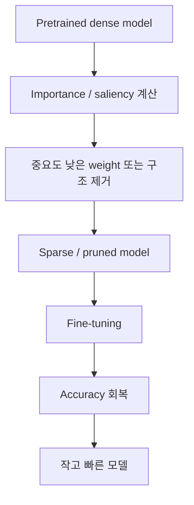
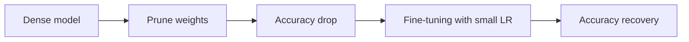
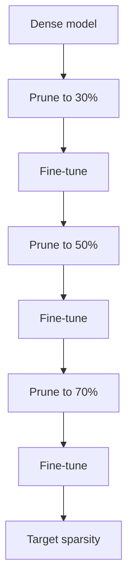
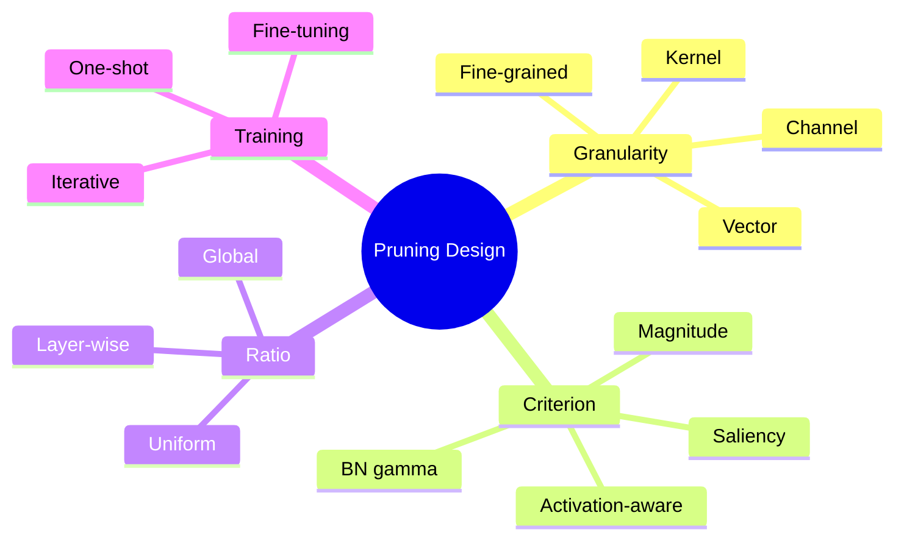
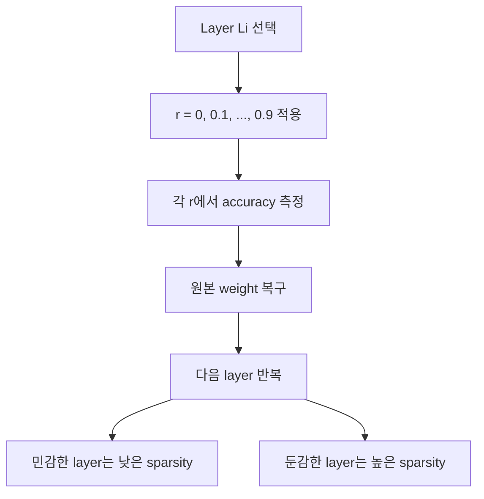
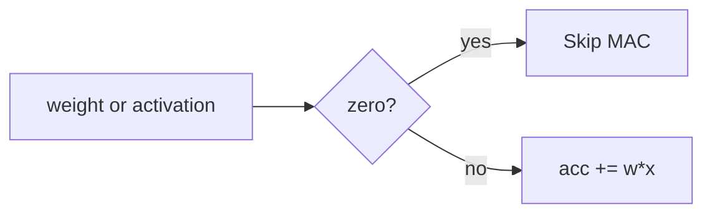
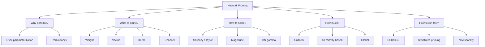

# ODAI-1 Chapter 2. Network Pruning 핵심 정리

범위: `On-Device AI 강의자료/ODAI-1.pdf` p.27~p.52  
이전 챕터: On-Device AI 개요  
다음 챕터: Quantization, p.53부터

---

## 1. 이 챕터의 핵심 질문

딥러닝 모델은 보통 학습을 쉽게 하기 위해 **over-parameterized** 되어 있다. 즉, 필요한 것보다 weight가 많고, 그중 일부는 제거해도 성능에 큰 영향을 주지 않을 수 있다.

Network pruning은 이 redundancy를 이용해서:

```text
중요하지 않은 weight / vector / channel / neuron을 제거하고,
남은 모델을 fine-tuning해서 정확도를 회복하는 기법
```

이다.

한 줄 요약:

> **Pruning = 모델 안의 덜 중요한 연결을 0으로 만들거나 구조째 제거해서, 연산량과 모델 크기를 줄이는 압축 기법.**

---

## 2. Pruning의 전체 흐름



핵심은 “무엇을 덜 중요하다고 볼 것인가?”다.

코드 관점에서 가장 단순한 pruning은 mask를 곱하는 것이다.

```python
# W: weight tensor
# mask: 1이면 유지, 0이면 제거
W_pruned = W * mask
```

수학적으로는:

$$
\hat{W} = W \odot M
$$

여기서:

| Term | 의미 |
|---|---|
| $W$ | 원래 weight tensor |
| $M$ | pruning mask, 원소가 0 또는 1 |
| $\odot$ | element-wise multiplication |
| $\hat{W}$ | pruning 후 weight |

---

## 3. 왜 0으로 만드는 것이 pruning인가?

뉴런 계산을 단순화하면:

$$
y = w_0x_0 + w_1x_1 + w_2x_2
$$

만약 $w_1=0$이면:

$$
y = w_0x_0 + 0 \cdot x_1 + w_2x_2
$$

$x_1$에서 오는 연결은 출력에 영향을 주지 않는다. 따라서 수학적으로는 그 connection이 끊긴 것과 같다.

하지만 실제 tensor shape은 그대로일 수 있다.

```text
Logical pruning: weight를 0으로 만듦
Physical compression: sparse format 또는 구조 변경으로 실제 메모리/연산 감소
```

예:

```python
W = torch.randn(100, 100)
mask = torch.zeros_like(W)
mask[0, 0] = 1
W_pruned = W * mask
print(W_pruned.shape)  # 여전히 [100, 100]
```

이 경우 값은 대부분 0이지만 dense tensor로 저장하면 여전히 100x100 공간을 쓴다. 실제 이득을 얻으려면 sparse kernel, CSR/CSC, structured pruning 등이 필요하다.

---

## 4. Network Redundancy와 over-parameterization

p.28의 핵심:

- DNN은 학습을 쉽게 하기 위해 보통 parameter가 많다.
- 모든 weight가 최종 성능에 똑같이 중요한 것은 아니다.
- 일부 weight를 0으로 만들어도 정확도가 크게 떨어지지 않을 수 있다.

예:

$$
y = \mathrm{ReLU}(15x_0 + 0.2x_1 - 9x_2)
$$

weight 하나를 제거해야 한다면 직관적으로 $0.2$가 후보가 된다.

왜냐하면 같은 입력 scale이라고 가정할 때 $0.2x_1$의 기여가 $15x_0$, $-9x_2$보다 작을 가능성이 크기 때문이다.

주의:

```text
weight 크기만으로 항상 중요도를 완벽히 알 수는 없다.
입력 x의 scale도 중요하다.
```

예를 들어 $w_1=0.2$라도 $x_1$이 매우 크면 영향이 클 수 있다. 이 한계 때문에 activation-aware pruning, saliency-based pruning 등이 나온다.

---

## 5. Saliency와 Taylor approximation

Optimal Brain Damage류 방법은 weight를 제거했을 때 loss가 얼마나 변하는지를 보려고 한다.

loss를 $\mathcal{L}(W)$라고 하자. weight $w_i$를 제거한다는 것은 $w_i \to 0$으로 바꾸는 것이다.

변화량:

$$
\Delta w_i = -w_i
$$

Taylor expansion을 쓰면:

$$
\Delta \mathcal{L} \approx \frac{\partial \mathcal{L}}{\partial w_i}\Delta w_i + \frac{1}{2} H_{ii}(\Delta w_i)^2
$$

학습이 수렴한 지점에서는 gradient가 작다고 보고 첫 항을 무시하면:

$$
\Delta \mathcal{L} \approx \frac{1}{2} H_{ii} w_i^2
$$

이 값이 saliency의 한 형태다.

| Term | 의미 |
|---|---|
| $\mathcal{L}$ | training loss |
| $w_i$ | i번째 weight |
| $H_{ii}$ | Hessian diagonal, loss curvature |
| $\Delta \mathcal{L}$ | weight 제거로 인한 loss 증가 추정 |

문제:

```text
큰 DNN에서 Hessian을 계산/저장하기 어렵다.
```

그래서 실용적으로는 magnitude-based pruning을 많이 쓴다.

---

## 6. Magnitude-based Pruning

가장 단순하고 많이 쓰이는 기준:

$$
\mathrm{importance}(w_i)=|w_i|
$$

작은 절댓값 weight는 덜 중요하다고 가정한다.

예:

$$
W=[15, 0.2, -9]
$$

$$
|W|=[15,0.2,9]
$$

가장 작은 값은 $0.2$이므로 pruning 후보가 된다.

코드 관점:

```python
importance = torch.abs(weight)
threshold = torch.kthvalue(importance.flatten(), k).values
mask = importance > threshold
weight *= mask
```

여기서 `k`는 제거할 원소 수다.

$$
k = \mathrm{round}(N \times s)
$$

| Term | 의미 |
|---|---|
| $N$ | 전체 weight 수 |
| $s$ | target sparsity |
| $k$ | 제거할 weight 수 |

---

## 7. Sparsity와 compression ratio

Sparsity는 전체 weight 중 0이 된 비율이다.

$$
\mathrm{sparsity}=1-\frac{\#\mathrm{nonzero}}{\#\mathrm{total}}
$$

예:

```text
총 weight 100개
nonzero 20개
sparsity = 1 - 20/100 = 0.8 = 80%
```

compression ratio는 문맥에 따라 다르지만 단순히 nonzero만 저장한다고 하면:

$$
\mathrm{compression\ ratio} \approx \frac{\#\mathrm{total}}{\#\mathrm{nonzero}}
$$

하지만 실제 sparse format은 index도 저장해야 하므로 이론적 compression보다 작다.

---

## 8. Pruning 후 fine-tuning이 필요한 이유

p.30의 핵심:

```text
Pruning 직후에는 accuracy가 떨어진다.
Fine-tuning을 하면 accuracy를 일부 회복할 수 있다.
```

수학적으로 보면 원래 출력은:

$$
y = Wx
$$

pruning 후 출력은:

$$
\hat{y}=\hat{W}x=(W\odot M)x
$$

출력 차이:

$$
\|y-\hat{y}\|_2^2
$$

이 차이가 크면 accuracy가 떨어질 가능성이 커진다. Fine-tuning은 남은 weight가 이 손상을 보완하도록 다시 조정하는 과정이다.



fine-tuning learning rate를 작게 쓰는 이유:

```text
이미 학습된 표현을 크게 망가뜨리지 않고, pruning 손상만 보정하기 위해.
```

---

## 9. Iterative pruning

p.31의 핵심.

One-shot pruning은 한 번에 목표 sparsity까지 자른다. Iterative pruning은 점진적으로 sparsity를 높인다.



sparsity schedule은 다음처럼 만들 수 있다.

Linear:

$$
s_t=s_i+(s_f-s_i)\frac{t-t_i}{t_f-t_i}
$$

Cubic:

$$
s_t=s_f+(s_i-s_f)\left(1-\frac{t-t_i}{t_f-t_i}\right)^3
$$

코드 관점:

```python
for epoch in range(num_epochs):
    sparsity = schedule[epoch]
    mask = make_pruning_mask(model, sparsity)
    train_one_epoch(model, callbacks=[lambda: apply_mask(model, mask)])
```

---

## 10. Reduced OPs and Model Size

p.32~33의 핵심:

```text
FC layer는 parameter가 많고 redundancy가 크다.
Conv layer는 pruning에 더 민감하다.
```

### FC layer parameter 수

$$
\#\mathrm{Params}_{FC}=C_{in}\times C_{out}
$$

예:

$$
4096\times4096=16{,}777{,}216
$$

### Conv layer parameter 수

$$
\#\mathrm{Params}_{Conv}=C_{out}\times C_{in}\times K_h\times K_w
$$

예:

$$
128\times64\times3\times3=73{,}728
$$

FC layer는 parameter 수가 매우 클 수 있어 pruning으로 model size를 크게 줄이기 쉽다. 하지만 Conv layer는 feature extraction의 핵심이라 accuracy에 더 민감할 수 있다.

---

## 11. Design Choice of Pruning

p.34에서 pruning 설계 선택지가 나온다.



핵심 질문:

1. 어떤 단위로 자를까?
2. 어떤 기준으로 중요도를 매길까?
3. 얼마나 자를까?
4. 자른 뒤 어떻게 학습/보정할까?

---

## 12. Pruning Granularity

p.35, p.49 핵심.

### Fine-grained / Unstructured

개별 weight 단위 제거.

장점:

- 선택이 가장 유연함
- 작은 weight만 골라 제거하므로 정확도 보존에 유리

단점:

- 0 위치가 불규칙함
- sparse index overhead 필요
- memory access가 불규칙
- hardware acceleration이 어려움

### Structured / Coarse-grained

vector, kernel, channel 단위 제거.

장점:

- 실제 tensor shape을 줄이기 쉬움
- 작은 dense matrix처럼 실행 가능
- hardware acceleration에 유리

단점:

- 제거 단위가 커서 accuracy 손상이 클 수 있음

비교:

| Granularity | 제거 단위 | 정확도 | 하드웨어 효율 |
|---|---|---:|---:|
| Fine-grained | scalar weight | 높음 | 낮음 |
| Vector-wise | vector | 중간 | 중간 |
| Kernel-wise | conv kernel | 중간~낮음 | 중간~높음 |
| Channel-wise | channel | 낮아질 수 있음 | 높음 |

---

## 13. Vector / Kernel / Channel pruning 수학적 의미

Conv weight shape:

$$
W \in \mathbb{R}^{C_{out}\times C_{in}\times K_h\times K_w}
$$

### Fine-grained

각 원소 $W_{o,i,u,v}$를 독립적으로 제거.

$$
\hat{W}_{o,i,u,v}=W_{o,i,u,v}M_{o,i,u,v}
$$

### Kernel-level

입력 channel $i$에서 output channel $o$로 가는 kernel 전체 제거.

$$
W_{o,i,:,:}\rightarrow 0
$$

importance:

$$
I_{o,i}=\sum_{u,v}|W_{o,i,u,v}|
$$

### Channel-level

특정 input channel 또는 output channel 전체 제거.

input channel 기준:

$$
W_{:,i,:,:}\rightarrow 0
$$

importance:

$$
I_i=\sum_{o,u,v}|W_{o,i,u,v}|
$$

코드 관점:

```python
# kernel importance
importance_kernel = weight.abs().sum(dim=(2, 3), keepdim=True)

# input-channel importance
importance_channel = weight.abs().sum(dim=(0, 2, 3), keepdim=True)
```

---

## 14. BatchNorm gamma 기반 Channel Pruning

p.38 핵심.

Batch Normalization은 각 channel을 정규화한 뒤 scale/shift를 적용한다.

$$
\hat{z}=\frac{z-\mu_B}{\sqrt{\sigma_B^2+\epsilon}}
$$

$$
z_{out}=\gamma\hat{z}+\beta
$$

각 term:

| Term | 의미 |
|---|---|
| $z$ | BN 입력 activation |
| $\mu_B$ | batch mean |
| $\sigma_B^2$ | batch variance |
| $\epsilon$ | numerical stability |
| $\gamma$ | trainable scale |
| $\beta$ | trainable shift |

$\gamma$가 작으면 해당 channel의 변화량이 작아진다. 따라서 작은 $\gamma$ channel은 덜 중요하다고 볼 수 있다.

Network Slimming류 방법은 $\gamma$에 L1 regularization을 건다.

$$
\mathcal{L}_{total}=\mathcal{L}_{task}+\lambda\sum_{c}|\gamma_c|
$$

이렇게 하면 많은 $\gamma_c$가 0 근처로 가고, 작은 $\gamma_c$ channel을 제거할 수 있다.

코드 관점:

```python
loss = task_loss + lambda_ * sum(bn.weight.abs().sum() for bn in bn_layers)
# bn.weight가 gamma에 해당
```

---

## 15. Sensitivity analysis

p.39~40 핵심.

layer마다 pruning에 대한 민감도가 다르다.

정확도 하락:

$$
\Delta acc_{i,r}=acc_{dense}-acc_{i,r}
$$

여기서:

| Term | 의미 |
|---|---|
| $i$ | layer index |
| $r$ | pruning ratio |
| $acc_{dense}$ | 원본 모델 정확도 |
| $acc_{i,r}$ | i번째 layer만 ratio r로 pruning했을 때 정확도 |

절차:



코드 관점:

```python
for name, param in model.named_parameters():
    if param.dim() > 1:
        backup = param.detach().clone()
        for sparsity in sparsities:
            prune(param, sparsity)
            acc = evaluate(model)
            param.copy_(backup)
```

한계:

```text
layer 하나씩만 보므로, 여러 layer를 동시에 pruning했을 때 interaction은 완전히 반영하지 못한다.
```

---

## 16. CSR / CSC Sparse Format

p.41~46 핵심.

Fine-grained pruning으로 0이 많아져도 dense matrix로 저장하면 메모리는 줄지 않는다. 그래서 nonzero만 저장하는 sparse format이 필요하다.

예:

$$
A=
\begin{bmatrix}
0 & 0 & A & B \\
C & D & 0 & 0 \\
0 & E & 0 & F
\end{bmatrix}
$$

### CSR: Compressed Sparse Row

row 기준으로 저장한다.

```text
Values         = [A, B, C, D, E, F]
Column Indices = [2, 3, 0, 1, 1, 3]
Row Pointer    = [0, 2, 4, 6]
```

해석:

```text
row 0: Values[0:2] = A, B / columns 2, 3
row 1: Values[2:4] = C, D / columns 0, 1
row 2: Values[4:6] = E, F / columns 1, 3
```

Row pointer의 핵심:

$$
\mathrm{row\ }i\mathrm{의\ nonzero\ range}=[ptr_i, ptr_{i+1})
$$

코드로 matrix-vector multiply를 하면:

```python
for row in range(num_rows):
    start = row_ptr[row]
    end = row_ptr[row + 1]
    acc = 0
    for idx in range(start, end):
        col = col_indices[idx]
        acc += values[idx] * x[col]
    y[row] = acc
```

### CSC: Compressed Sparse Column

column 기준으로 저장한다.

- `Values`
- `Row Indices`
- `Column Pointer`

CSR은 row별 output 계산에 자연스럽고, CSC는 column/input 기준 update에 유리할 수 있다.

---

## 17. Sparse Architecture와 MAC

p.47~48 핵심.

MAC은 Memory Access가 아니라 **Multiply-Accumulate**다.

$$
acc \leftarrow acc + w \times x
$$

ReLU는 많은 activation을 0으로 만든다.

$$
\mathrm{ReLU}(x)=\max(0,x)
$$

만약 $x=0$ 또는 $w=0$이면:

$$
w\times x=0
$$

따라서 MAC을 skip할 수 있다.



문제는 irregular sparsity다.

- index overhead
- PE imbalance
- irregular memory access
- cache locality 저하

이 때문에 이론적 OP 감소가 실제 latency 감소로 바로 이어지지 않을 수 있다.

---

## 18. Vector-wise Sparsity와 N:M Sparsity

p.50~52 핵심.

### Vector-wise sparsity

fine-grained와 channel pruning 사이의 절충안이다.

- IVW: vector 내부 일부 weight pruning
- OVW: vector 전체 pruning

OVW는 vector 전체가 0이므로 skip하기 쉽다.

IVW는 fine-grained와 비슷하지만 보통 block/pattern 제약이 있어 완전 불규칙보다는 hardware-friendly하다.

### N:M sparsity

연속된 $M$개 weight 중 $N$개를 pruning한다.

예: 2:4 sparsity

$$
[a,b,c,d]\rightarrow[a,0,c,0]
$$

sparsity:

$$
\frac{2}{4}=50\%
$$

장점:

```text
완전 unstructured보다 metadata가 작고, hardware가 예측 가능한 pattern을 활용할 수 있다.
```

NVIDIA Ampere Tensor Core 같은 하드웨어가 2:4 sparsity를 지원하는 이유도 이 때문이다.

---

## 19. Chapter 2 최종 구조도



---

## 20. 시험 예상 질문

### Q1. 0으로 만드는 것이 왜 pruning인가?

뉴런 계산에서 $w_i=0$이면 해당 입력 $x_i$는 출력에 영향을 주지 않는다. 따라서 수학적으로 connection이 끊긴 것과 같다. 다만 실제 tensor shape은 그대로이므로, 실제 메모리/속도 이득을 얻으려면 sparse format이나 structured pruning이 필요하다.

### Q2. Magnitude pruning의 한계는?

$|w|$만 보고 중요도를 판단하므로 입력 activation scale이나 loss curvature를 고려하지 못한다. 작은 weight라도 입력이 크면 중요할 수 있다.

### Q3. Fine-grained pruning이 hardware acceleration에 어려운 이유는?

0 위치가 불규칙해서 index lookup, irregular memory access, PE imbalance가 발생한다. GPU는 규칙적인 dense matrix 연산에 최적화되어 있으므로 불규칙 sparse 연산이 항상 빠르지 않다.

### Q4. Channel pruning이 hardware-friendly한 이유는?

channel 전체를 제거하면 tensor shape 자체를 줄일 수 있어 더 작은 dense convolution으로 바꿀 수 있다.

### Q5. BN gamma 기반 pruning의 직관은?

BatchNorm의 $\gamma$는 channel output의 scale을 조절한다. $\gamma$가 작으면 해당 channel의 영향이 작다고 보고 channel pruning 후보로 삼을 수 있다.

### Q6. CSR에서 row pointer는 왜 필요한가?

Values와 Column Indices만으로는 각 nonzero가 어느 row에 속하는지 알 수 없다. Row Pointer는 각 row의 nonzero가 Values 배열에서 어디서 시작하고 끝나는지 알려준다.

### Q7. MAC은 무엇인가?

Multiply-Accumulate이다. 즉 $acc \leftarrow acc + w \times x$ 연산을 의미한다.

### Q8. N:M sparsity가 중요한 이유는?

완전한 fine-grained sparsity보다 규칙이 있어 hardware가 활용하기 쉽고, channel pruning보다 유연해 accuracy를 유지하기 쉽다.

---

## 21. 초압축 암기

```text
Pruning = W_hat = W ⊙ M
0 weight = 논리적 connection 제거
실제 가속 = sparse format / structured pruning 필요
Saliency = weight 제거 시 loss 증가 추정
Magnitude = |w| 기준 중요도
Sparsity = 1 - nonzero/total
Fine-grained = 정확도 유리, 하드웨어 어려움
Channel = 하드웨어 유리, 정확도 위험
BN gamma 작음 = channel 영향 작음
CSR = values + column indices + row pointer
MAC = acc += w*x
N:M = M개 중 N개 제거하는 규칙적 sparsity
```
