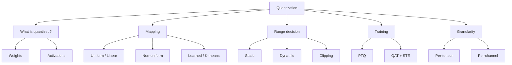
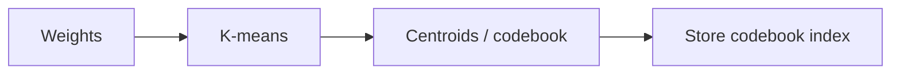
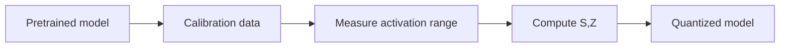
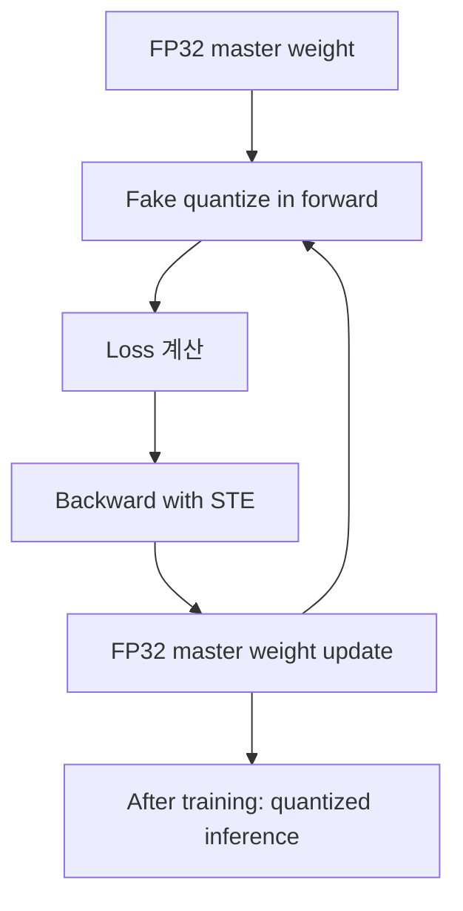
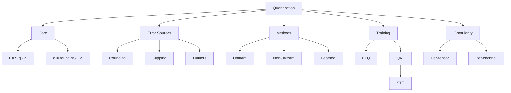

# ODAI-1 Chapter 3. Quantization 핵심 정리

범위: `On-Device AI 강의자료/ODAI-1.pdf` p.53~p.86  
이전 챕터: Network Pruning  
다음 챕터: Knowledge Distillation, p.87부터

---

## 1. 이 챕터의 핵심 질문

모델의 weight와 activation은 보통 FP32/FP16 같은 floating-point로 표현된다. 그런데 on-device 환경에서는 memory와 bandwidth가 부족하다.

Quantization은 이 문제를 해결하기 위해:

```text
연속적인 실수 값을 더 적은 수의 discrete level로 근사하는 기법
```

이다.

예:

```text
FP32 → FP16 → INT8 → INT4 → INT2 → Binary
```

한 줄 요약:

> **Quantization = 숫자 표현 bit-width를 낮춰 저장 비용, memory bandwidth, 연산 비용을 줄이는 압축/가속 기법.**

---

## 2. Quantization의 전체 구조



---

## 3. Quantization level과 bit-width

bit 수가 $b$이면 표현 가능한 integer level 수는:

$$
\#\mathrm{levels}=2^b
$$

예:

| Bit-width | Level 수 | 예 |
|---:|---:|---|
| INT8 | 256 | activation/weight quantization |
| INT4 | 16 | LLM weight-only quantization |
| INT2 | 4 | 극단적 압축 |
| Binary | 2 | $-1,+1$ 또는 $0,1$ |

bit-width를 줄이면 memory가 거의 선형으로 줄어든다.

$$
\mathrm{Memory}=\#\mathrm{values}\times\frac{b}{8}\ \mathrm{bytes}
$$

예:

```python
def tensor_memory_mb(num_values, bits):
    return num_values * bits / 8 / 1024**2

print(tensor_memory_mb(1_000_000, 32))  # FP32: about 3.8 MiB
print(tensor_memory_mb(1_000_000, 8))   # INT8: about 0.95 MiB
print(tensor_memory_mb(1_000_000, 4))   # INT4: about 0.48 MiB
```

trade-off:

```text
bit-width 감소 → memory/bandwidth 감소
bit-width 감소 → quantization error 증가 가능
```

---

## 4. Floating point와 integer의 차이

Floating point는 대략 다음 구조를 가진다.

```text
sign bit + exponent bits + mantissa bits
```

- exponent: 표현 가능한 range를 결정
- mantissa: precision을 결정

Integer quantization은 실수 값을 integer grid 위에 올린다.

예:

```text
real value:  -1.0, -0.97, ..., 0, ..., 1.0
INT8 value:  -128, -127, ..., 0, ..., 127
```

즉 quantization은 연속 공간 $\mathbb{R}$을 유한 집합으로 mapping하는 것이다.

$$
Q: \mathbb{R} \rightarrow \{q_{min}, q_{min}+1, ..., q_{max}\}
$$

---

## 5. Uniform / Non-uniform / Learned Quantization

### 5.1 Uniform / Linear Quantization

quantization level 사이의 간격이 일정하다.

$$
\Delta = S
$$

장점:

- 구현 쉬움
- hardware friendly
- integer arithmetic에 적합

단점:

- 데이터 분포가 한쪽에 몰려 있으면 level 낭비 가능

### 5.2 Non-uniform Quantization

level 간격이 일정하지 않다.

```text
0 근처에는 촘촘하게, 큰 값 쪽은 넓게
```

장점:

- 실제 데이터 분포에 잘 맞출 수 있음
- accuracy에 유리할 수 있음

단점:

- hardware 구현 복잡
- lookup table 필요 가능

### 5.3 Learned Quantization

quantization level 자체를 데이터에서 학습한다.

예: k-means.



예:

```text
weights = [0.12, 0.14, 0.91, 0.88, -0.5]
codebook = [0.13, 0.90, -0.5]
indices = [0, 0, 1, 1, 2]
```

---

## 6. Static vs Dynamic Quantization

### Static Quantization

inference 전에 calibration data를 이용해 range를 정한다.

```text
calibration data → min/max 또는 percentile 측정 → S, Z 고정
```

장점:

- runtime overhead 낮음
- 빠름

단점:

- 실제 입력 분포가 calibration과 다르면 accuracy 손실 가능

### Dynamic Quantization

runtime에 activation range를 계산한다.

```python
r_min = activation.min()
r_max = activation.max()
S, Z = calculate_qparams(r_min, r_max)
```

장점:

- 입력별 range에 적응

단점:

- min/max 계산 overhead

---

## 7. Linear Quantization 기본식

가장 중요한 식:

$$
r = S(q-Z)
$$

각 term:

| Term | 의미 | 코드 변수 예 |
|---|---|---|
| $r$ | real value, 원래 실수 | `x_fp32` |
| $q$ | quantized integer | `x_int8` |
| $S$ | scale, integer 한 칸이 real에서 의미하는 크기 | `scale` |
| $Z$ | zero point, real 0이 대응되는 integer 위치 | `zero_point` |

Quantize:

$$
q=\mathrm{round}\left(\frac{r}{S}\right)+Z
$$

Dequantize:

$$
\tilde{r}=S(q-Z)
$$

Quantization error:

$$
e = \tilde{r}-r
$$

코드:

```python
def quantize(r, scale, zero_point, qmin, qmax):
    q = torch.round(r / scale) + zero_point
    q = torch.clamp(q, qmin, qmax)
    return q

def dequantize(q, scale, zero_point):
    return scale * (q - zero_point)
```

---

## 8. Scale과 Zero Point 유도

real range $[r_{min}, r_{max}]$를 integer range $[q_{min}, q_{max}]$에 mapping한다.

양 끝점 조건:

$$
r_{max}=S(q_{max}-Z)
$$

$$
r_{min}=S(q_{min}-Z)
$$

두 식을 빼면:

$$
r_{max}-r_{min}=S(q_{max}-q_{min})
$$

따라서:

$$
S=\frac{r_{max}-r_{min}}{q_{max}-q_{min}}
$$

zero point는 $r_{min}$ 식에서:

$$
r_{min}=S(q_{min}-Z)
$$

$$
\frac{r_{min}}{S}=q_{min}-Z
$$

$$
Z=q_{min}-\frac{r_{min}}{S}
$$

integer여야 하므로:

$$
Z=\mathrm{round}\left(q_{min}-\frac{r_{min}}{S}\right)
$$

---

## 9. Linear Quantization 예제

real range:

$$
r_{min}=-7.59,\quad r_{max}=10.8
$$

signed INT8 range:

$$
q_{min}=-128,\quad q_{max}=127
$$

Scale:

$$
S=\frac{10.8-(-7.59)}{127-(-128)}=\frac{18.39}{255}\approx0.072
$$

Zero point:

$$
Z=\mathrm{round}\left(-128-\frac{-7.59}{0.072}\right)\approx-23
$$

$r=5.47$ quantize:

$$
q=\mathrm{round}\left(\frac{5.47}{0.072}\right)-23\approx53
$$

Dequantize:

$$
\tilde{r}=0.072(53-(-23))=5.472
$$

Error:

$$
e=5.472-5.47=0.002
$$

---

## 10. 왜 zero point가 중요한가?

신경망에서 real value 0은 특별하다.

- padding 값 0
- ReLU 후 activation 0
- 실제 연산에서 zero는 곱하면 사라짐

그래서 real 0이 quantized integer로 정확히 표현되는 것이 중요하다.

$$
0=S(q_0-Z) \Rightarrow q_0=Z
$$

즉 zero point는 real 0에 해당하는 integer 값이다.

---

## 11. Quantized Matrix Multiplication

원래 연산:

$$
Y=WX
$$

각 값을 quantized form으로 쓰면:

$$
W=S_W(q_W-Z_W)
$$

$$
X=S_X(q_X-Z_X)
$$

$$
Y=S_Y(q_Y-Z_Y)
$$

따라서:

$$
S_Y(q_Y-Z_Y)=S_WS_X(q_W-Z_W)(q_X-Z_X)
$$

정리:

$$
q_Y=\frac{S_WS_X}{S_Y}(q_W-Z_W)(q_X-Z_X)+Z_Y
$$

핵심:

```text
q_W, q_X는 integer이므로 곱셈/누산을 integer로 수행할 수 있다.
scale factor는 fixed-point multiplication / bit shift로 근사한다.
```

코드 감각:

```python
acc_int32 = torch.matmul(q_x.int(), q_w.int())
q_y = requantize(acc_int32, multiplier, shift, output_zero_point)
```

보통 누산은 INT32로 한다. INT8 x INT8을 많이 더하면 INT8 범위를 넘기 때문이다.

---

## 12. Symmetric vs Asymmetric Quantization

### Asymmetric

$$
r=S(q-Z)
$$

장점:

- real range가 비대칭이어도 integer range를 잘 활용

단점:

- zero point 보정항 때문에 구현 복잡

### Symmetric

$$
r=Sq
$$

또는 $Z=0$.

장점:

- 구현 단순
- weight quantization에 자주 사용

단점:

- real range가 한쪽으로 치우치면 level 낭비

예:

```text
activation range = [0, 6]
```

symmetric range를 [-6, 6]으로 잡으면 음수 절반이 낭비된다. 이런 경우 asymmetric이 유리할 수 있다.

---

## 13. Clipping과 outlier 문제

Quantization range를 너무 넓게 잡으면 대부분 값의 resolution이 나빠진다.

예:

```text
대부분 값: -1 ~ 1
outlier: 100
```

range를 [-100,100]으로 잡으면 INT8의 256개 level이 너무 넓은 범위에 퍼진다. 그러면 -1~1 사이 값들이 거칠게 표현된다.

Clipping은 outlier 일부를 잘라내고 대부분 값이 있는 구간에 level을 집중하는 방법이다.

trade-off:

```text
clipping 약함 → outlier 때문에 resolution 손실
clipping 강함 → outlier 정보 손실
```

수학적으로 clipping 후 quantization:

$$
r_{clip}=\min(\max(r,\alpha),\beta)
$$

$$
q=Q(r_{clip})
$$

---

## 14. Quantization error의 수학적 직관

Uniform quantization에서 step size가 $S$일 때 round-to-nearest를 쓰면 error는 대략 다음 범위에 있다.

$$
e \in \left[-\frac{S}{2},\frac{S}{2}\right]
$$

즉 scale이 작을수록 quantization error가 작다.

하지만 scale을 작게 하려면 range가 좁아야 한다.

```text
range 넓음 → S 큼 → error 큼
range 좁음 → S 작음 → error 작음, 하지만 clipping 위험
```

---

## 15. Non-uniform Quantization

### INQ

일부 weight를 powers of two 또는 zero로 quantize하고, 나머지는 high precision으로 유지한다. 이후 점진적으로 quantized weight 비율을 높인다.

powers of two의 장점:

$$
x\times2^{-n}\approx x >> n
$$

즉 multiplication을 shift로 바꿀 수 있다.

### Binary-code-based quantization

real vector를 binary vector 조합으로 근사한다.

$$
\mathbf{r}\approx\sum_{i=1}^{m}\alpha_i\mathbf{b}_i
$$

여기서:

- $\alpha_i$: scaling factor
- $\mathbf{b}_i\in\{-1,+1\}^{n}$: binary vector

---

## 16. PTQ: Post-Training Quantization

이미 학습된 model을 fine-tuning 없이 quantize한다.



코드 관점:

```python
model.eval()
for x in calibration_loader:
    collect_min_max_activation(x)
compute_scale_zero_point()
convert_to_int8(model)
```

장점:

- 빠름
- 추가 학습 비용 낮음

단점:

- INT4 같은 low-bit에서 accuracy drop이 클 수 있음
- 작은 모델은 여유 capacity가 적어 PTQ에 약할 수 있음

---

## 17. QAT: Quantization-Aware Training

학습 중 quantization 효과를 simulation한다.



중요:

```text
학습 중에는 full precision master weight를 유지한다.
forward에서는 quantized 효과를 반영한다.
backward에서는 FP weight를 업데이트한다.
```

---

## 18. STE: Straight Through Estimator

round 함수는 미분하기 어렵다.

$$
q=\mathrm{round}(x)
$$

이 함수의 gradient는 대부분 0이라 SGD에 좋지 않다.

STE는 backward에서 round를 identity처럼 본다.

$$
\frac{\partial\ \mathrm{round}(x)}{\partial x}\approx1
$$

PyTorch fake quantization 감각:

```python
class RoundSTE(torch.autograd.Function):
    @staticmethod
    def forward(ctx, x):
        return torch.round(x)

    @staticmethod
    def backward(ctx, grad_output):
        return grad_output
```

즉 forward에서는 round하지만 backward에서는 gradient를 그대로 통과시킨다.

---

## 19. Per-Tensor vs Per-Channel Quantization

### Per-Tensor

tensor 전체에 scale 하나.

$$
S_W \quad \text{for entire } W
$$

장점:

- 간단
- scale 저장 overhead 작음

단점:

- channel별 range 차이가 크면 작은 range channel이 망가짐

### Per-Channel

output channel마다 scale을 따로 둔다.

Conv weight:

$$
W\in\mathbb{R}^{C_{out}\times C_{in}\times K_h\times K_w}
$$

scale:

$$
S\in\mathbb{R}^{C_{out}}
$$

코드 관점:

```python
# weight: [out_channels, in_channels, kh, kw]
r_min = weight.amin(dim=(1, 2, 3), keepdim=True)
r_max = weight.amax(dim=(1, 2, 3), keepdim=True)
scale = (r_max - r_min) / (qmax - qmin)
```

왜 필요한가?

```text
channel마다 weight range가 크게 다를 수 있기 때문.
```

---

## 20. Weight Equalization

연속된 layer 사이에서 scale을 조정해 channel range를 비슷하게 만든다.

선형 연산에서:

$$
y=W_{k+1}(W_kx)
$$

중간 channel에 $s$와 $s^{-1}$를 넣어도 전체 함수는 유지될 수 있다.

$$
y=(W_{k+1}S)(S^{-1}W_kx)
$$

목적:

```text
한 layer의 특정 channel range가 너무 커서 quantization을 망치는 것을 완화
```

코드 감각:

```python
# layer k output channel i downscale
W_k[i, ...] /= s_i

# layer k+1 input channel i upscale
W_next[:, i, ...] *= s_i
```

주의:

```text
중간 activation function이 scaling equivariance를 만족해야 한다.
ReLU는 양수 scale에 대해 ReLU(sx)=sReLU(x)이므로 가능하다.
```

---

## 21. Nonlinear OPs의 Integer Approximation

Matrix multiplication만 integer로 바꿔서는 완전한 integer-only inference가 아니다.

Transformer에는 다음도 있다.

- Softmax
- LayerNorm
- GELU
- sqrt

이런 nonlinear op는 integer로 직접 처리하기 어렵다. I-BERT 같은 방법은 Newton method 등으로 근사한다.

핵심:

```text
integer-only inference = GEMM뿐 아니라 nonlinear op까지 integer approximation 필요
```

---

## 22. Chapter 3 최종 구조도



---

## 23. 시험 예상 질문

### Q1. Quantization이란?

연속적인 real value를 더 적은 수의 discrete level로 mapping하는 기법이다. FP32/FP16 값을 INT8/INT4 등으로 낮춰 저장 비용, memory bandwidth, 연산 비용을 줄인다.

### Q2. Linear quantization의 기본식은?

$$
r=S(q-Z)
$$

quantization은:

$$
q=\mathrm{round}(r/S)+Z
$$

### Q3. Scale과 zero point는 무엇인가?

Scale은 integer 한 칸이 real value에서 의미하는 간격이다. Zero point는 real value 0에 대응되는 integer 값이다.

### Q4. Quantization error는 왜 생기는가?

real value를 유한한 discrete level로 반올림하기 때문에 rounding error가 생긴다. 또한 range를 제한하면 clipping error도 생긴다.

### Q5. PTQ와 QAT 차이는?

PTQ는 학습 후 calibration만으로 quantization한다. QAT는 학습 중 quantization 효과를 반영해 fine-tuning하므로 accuracy가 좋지만 비용이 크다.

### Q6. STE는 왜 필요한가?

rounding 함수는 미분이 어렵고 gradient가 학습에 부적합하다. STE는 backward에서 rounding을 identity처럼 처리해 gradient를 통과시킨다.

### Q7. Per-channel quantization이 왜 필요한가?

channel마다 weight range가 크게 다를 수 있다. tensor 전체에 하나의 scale을 쓰면 range가 작은 channel의 precision이 크게 떨어질 수 있으므로 channel별 scale을 사용한다.

### Q8. Clipping이 왜 중요한가?

outlier 때문에 quantization range가 너무 커지면 대부분 값의 resolution이 나빠진다. 적절한 clipping은 대부분 값이 있는 구간에 quantization level을 집중시킨다.

---

## 24. 초압축 암기

```text
Quantization = real → discrete integer level
Memory = values × bits/8
Core = r = S(q-Z)
Scale = real interval per integer step
Zero point = real 0의 integer 위치
Error = rounding + clipping
Uniform = 간격 일정, hardware-friendly
Non-uniform = 간격 가변, accuracy 유리 가능
Static = calibration으로 range 고정
Dynamic = runtime range 계산
PTQ = 학습 후 quantization
QAT = quantization-aware training
STE = backward에서 round를 identity로 근사
Per-channel = channel별 scale로 outlier/range 문제 완화
```
