# ODAI-1 Chapter 4. Knowledge Distillation 핵심 정리

범위: `On-Device AI 강의자료/ODAI-1.pdf` p.87~p.109  
이전 챕터: Quantization  
다음 연결: 실습 `3. Knowledge Distillation.ipynb`, Transformer/LLM KD

> 이 노트는 PDF 흐름을 유지하면서, 원본 교안의 주요 영어 term, 그림, 수식, 코드 관점을 함께 정리한다.  
> 원본 슬라이드 이미지는 `assets/odai1_ch04_kd_slides/`에 추출해두었다.

---

## 그림으로 먼저 잡기

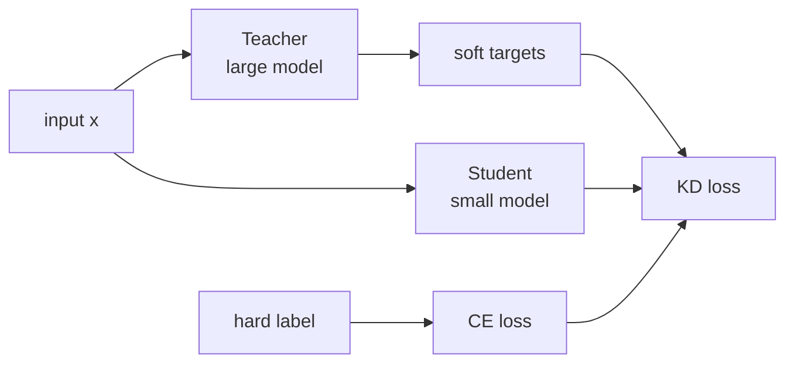
```mermaid
flowchart LR
  X["input x"] --> T["Teacher\nlarge model"]
  X --> S["Student\nsmall model"]
  T --> P["soft targets"]
  P --> L["KD loss"]
  S --> L
  Y["hard label"] --> CE["CE loss"] --> L
```

| 손실 | 학생이 배우는 것 | 왜 필요한가 |
|---|---|---|
| Hard CE | 정답 class | 기본 supervised signal |
| Soft KD | class 간 상대적 유사도 | 작은 모델이 teacher의 decision boundary를 모방 |
| Temperature | 확률 분포를 부드럽게 만듦 | dark knowledge를 더 잘 보이게 함 |


## 1. 이 챕터의 핵심 질문

작은 모델은 on-device에 유리하지만, 보통 큰 모델보다 성능이 낮다. Knowledge Distillation은 이 문제를 해결하려고 한다.

핵심 질문:

```text
큰 teacher model이 학습한 지식을 작은 student model에게 어떻게 전달할 것인가?
```

한 줄 요약:

> **Knowledge Distillation, KD = 큰 teacher model의 output distribution, feature, relation 등을 작은 student model이 모방하도록 학습시키는 model compression 기법.**

원본 교안 첫 그림:

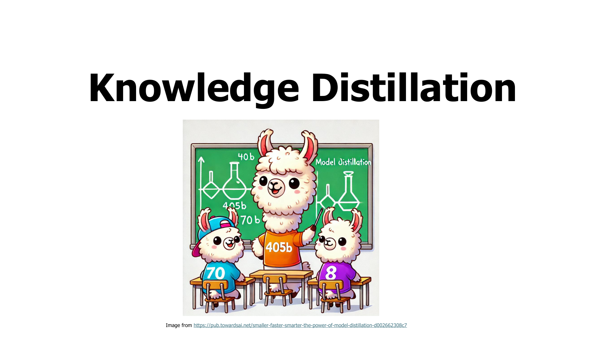

---

## 2. Tiny models are hard to train

PDF p.88 핵심.

작은 모델은 parameter 수와 representation capacity가 작아서 큰 dataset을 직접 학습할 때 underfit되기 쉽다.

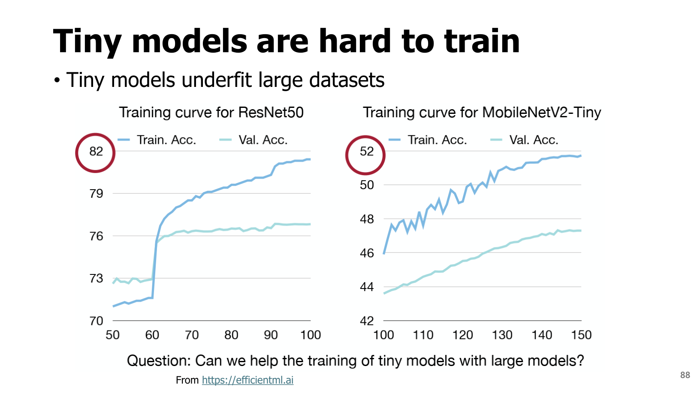

### 2.1 Underfitting이란?

모델 capacity가 부족해서 training data의 패턴조차 충분히 못 배우는 상태다.

수식적으로 모델이 표현할 수 있는 함수 집합을 $\mathcal{F}_{student}$라고 하자. 큰 teacher의 함수 집합은 $\mathcal{F}_{teacher}$라고 볼 수 있다.

일반적으로:

$$
\mathcal{F}_{student} \subset \mathcal{F}_{teacher}
$$

즉 student는 teacher보다 표현 가능한 함수가 제한적이다.

### 2.2 왜 KD가 도움이 되나?

hard label만 주면 정답 class 하나만 알려준다.

```text
cat image → label = cat
```

하지만 teacher output은 class 간 유사도 정보를 담고 있다.

예:

```text
cat: 0.72
dog: 0.20
fox: 0.05
truck: 0.00
```

이 정보는 단순 hard label보다 풍부하다.

```text
cat은 dog와는 비슷하지만 truck과는 전혀 다르다
```

student는 이 부드러운 분포를 따라가며 더 잘 학습할 수 있다.

---

## 3. Knowledge Distillation의 기본 아이디어

PDF p.89~90 핵심.

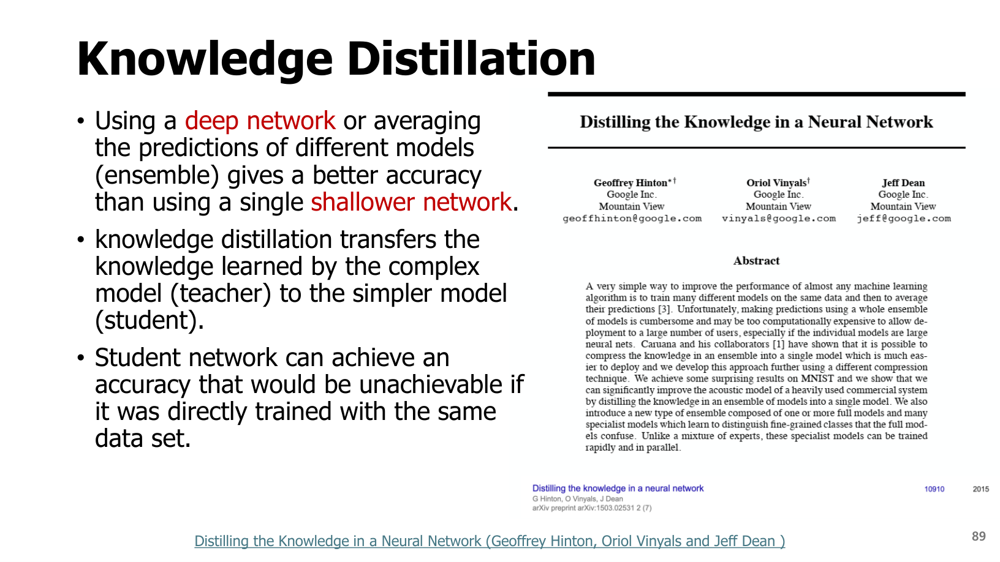

교안의 핵심 영어 term:

- **teacher model**: 큰 모델, ensemble, 또는 정확도가 높은 모델
- **student model**: 작고 빠른 모델
- **transfer knowledge**: teacher가 학습한 정보를 student로 전달
- **soft targets / soft labels**: teacher의 확률 분포 출력

흐름:

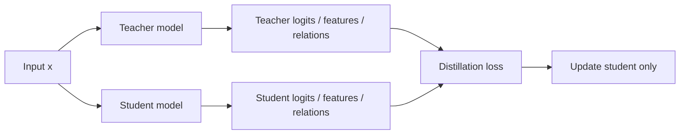
```mermaid
flowchart LR
    A[Input x] --> B[Teacher model]
    A --> C[Student model]
    B --> D[Teacher logits / features / relations]
    C --> E[Student logits / features / relations]
    D --> F[Distillation loss]
    E --> F
    F --> G[Update student only]
```

중요:

```text
teacher는 보통 freeze한다.
student만 update한다.
```

코드 관점:

```python
teacher.eval()
for p in teacher.parameters():
    p.requires_grad_(False)

student.train()
```

---

## 4. Softmax와 Temperature

PDF p.91~93 핵심.

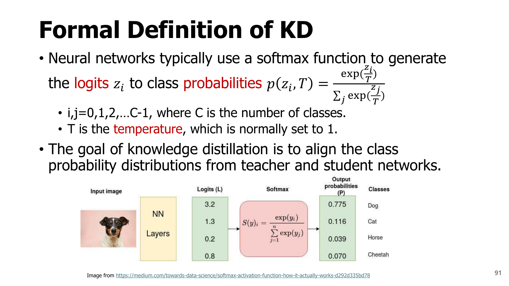

### 4.1 Logits

신경망 classifier의 마지막 layer는 class별 점수 $z_i$를 출력한다. 이것을 **logit**이라고 한다.

예:

```text
logits = [3.2, 1.1, -0.7]
```

logit은 아직 확률이 아니다. softmax를 통과해야 확률이 된다.

### 4.2 Softmax

class 수가 $C$일 때 softmax는:

$$
p_i = \frac{\exp(z_i)}{\sum_{j=1}^{C}\exp(z_j)}
$$

각 term:

| Term | 의미 |
|---|---|
| $z_i$ | class i의 logit |
| $p_i$ | class i의 probability |
| $C$ | class 수 |
| $\exp$ | exponential |

softmax의 결과는 다음을 만족한다.

$$
0 \le p_i \le 1
$$

$$
\sum_i p_i = 1
$$

코드:

```python
probs = torch.softmax(logits, dim=-1)
```

### 4.3 Temperature softmax

KD에서는 temperature $T$를 넣은 softmax를 쓴다.

$$
p_i(z,T)=\frac{\exp(z_i/T)}{\sum_{j=1}^{C}\exp(z_j/T)}
$$

- $T=1$: 일반 softmax
- $T>1$: 분포가 부드러워짐
- $T<1$: 분포가 더 날카로워짐

코드:

```python
soft_probs = torch.softmax(logits / T, dim=-1)
```

### 4.4 왜 $T>1$이면 부드러워지나?

logit 차이가 줄어들기 때문이다.

예:

```text
logits = [10, 2, 0]
```

$T=1$이면 차이가 크다.

```text
[10, 2, 0]
```

$T=5$이면:

```text
[2, 0.4, 0]
```

class 간 score 차이가 줄어든다. 따라서 softmax 결과가 덜 극단적이 된다.

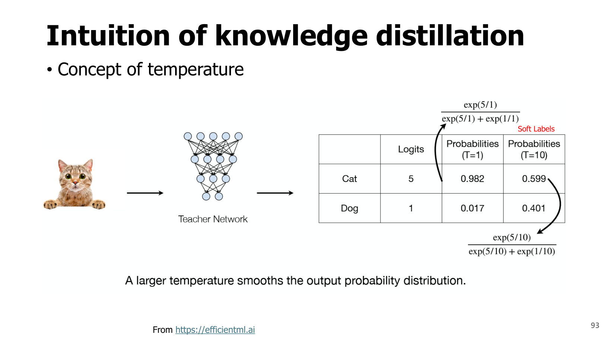

---

## 5. Hard Label vs Soft Label

PDF p.94 핵심.

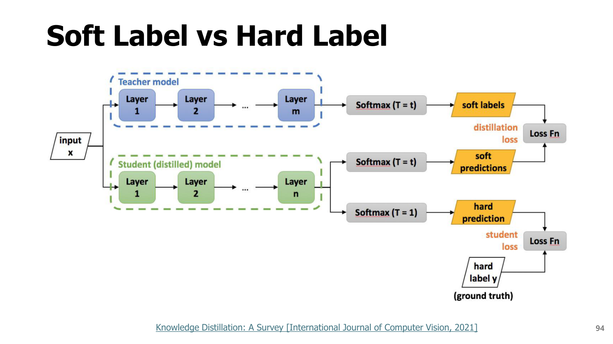

### 5.1 Hard label

정답 class 하나만 1이고 나머지는 0이다.

예: 정답이 cat이고 class가 `[cat, dog, car]`이면:

$$
y=[1,0,0]
$$

Cross entropy:

$$
\mathcal{L}_{CE}=-\sum_i y_i\log p_i
$$

hard label에서는 정답 class만 남는다.

$$
\mathcal{L}_{CE}=-\log p_{cat}
$$

### 5.2 Soft label

teacher가 예측한 class probability distribution이다.

예:

$$
p^T=[0.70,0.25,0.05]
$$

이 분포는 class 간 similarity 정보를 담는다.

```text
cat 0.70, dog 0.25 → dog는 cat과 어느 정도 비슷함
car 0.05 → car는 덜 비슷함
```

KD는 student가 teacher의 soft distribution을 따라가도록 한다.

---

## 6. Response-based KD

PDF p.95 핵심.

Response-based KD는 teacher와 student의 **최종 output distribution**을 맞춘다.

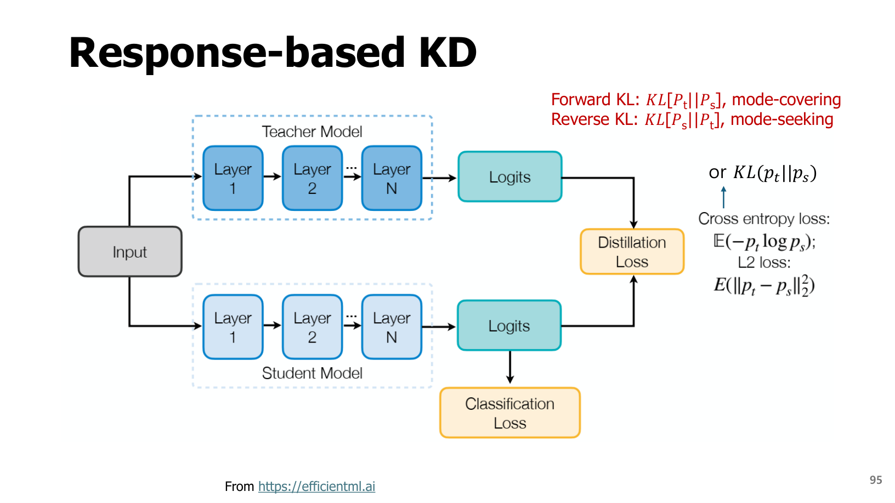

### 6.1 KL divergence

teacher distribution을 $p_t$, student distribution을 $p_s$라고 하자.

Forward KL:

$$
D_{KL}(p_t\|p_s)=\sum_i p_t(i)\log\frac{p_t(i)}{p_s(i)}
$$

각 term:

| Term | 의미 |
|---|---|
| $p_t$ | teacher probability distribution |
| $p_s$ | student probability distribution |
| $D_{KL}$ | 두 분포의 차이 |

KD loss:

$$
\mathcal{L}_{KD}=T^2D_{KL}\left(p_t^T\|p_s^T\right)
$$

여기서 $p_t^T$, $p_s^T$는 temperature softmax로 만든 분포다.

$T^2$를 곱하는 이유는 temperature가 gradient scale을 바꾸기 때문에 이를 보정하기 위해서다.

### 6.2 전체 KD loss

보통 hard label CE와 KD loss를 섞는다.

$$
\mathcal{L}=\alpha\mathcal{L}_{CE}(y,p_s)+(1-\alpha)T^2D_{KL}(p_t^T\|p_s^T)
$$

각 term:

| Term | 의미 |
|---|---|
| $\alpha$ | hard label loss와 distillation loss 비율 |
| $\mathcal{L}_{CE}$ | ground-truth label 기반 loss |
| $D_{KL}$ | teacher-student distribution matching loss |
| $T$ | temperature |

코드:

```python
import torch.nn.functional as F

T = 4.0
alpha = 0.5

with torch.no_grad():
    teacher_logits = teacher(x)

student_logits = student(x)

hard_loss = F.cross_entropy(student_logits, y)

teacher_probs = F.softmax(teacher_logits / T, dim=-1)
student_log_probs = F.log_softmax(student_logits / T, dim=-1)
soft_loss = F.kl_div(student_log_probs, teacher_probs, reduction="batchmean") * (T * T)

loss = alpha * hard_loss + (1 - alpha) * soft_loss
loss.backward()
```

---

## 7. Forward KL vs Reverse KL

교안 p.95에는 다음 표현이 나온다.

- **Forward KL**: $D_{KL}(P_t\|P_s)$, mode-covering
- **Reverse KL**: $D_{KL}(P_s\|P_t)$, mode-seeking

### 7.1 Forward KL

$$
D_{KL}(P_t\|P_s)=\sum_i P_t(i)\log\frac{P_t(i)}{P_s(i)}
$$

teacher가 확률을 주는 영역을 student가 놓치면 penalty가 크다. 그래서 여러 mode를 덮으려는 경향이 있다.

### 7.2 Reverse KL

$$
D_{KL}(P_s\|P_t)=\sum_i P_s(i)\log\frac{P_s(i)}{P_t(i)}
$$

student가 teacher에서 확률이 낮은 곳에 확률을 주면 penalty가 크다. 그래서 하나의 높은 mode에 집중하는 경향이 있다.

KD에서는 일반적으로 teacher distribution을 target으로 보는 forward KL 형태가 자주 쓰인다.

---

## 8. Feature-based KD

PDF p.96~98 핵심.

Response-based KD는 최종 output만 맞춘다. 하지만 teacher가 가진 중간 feature representation도 지식이다.

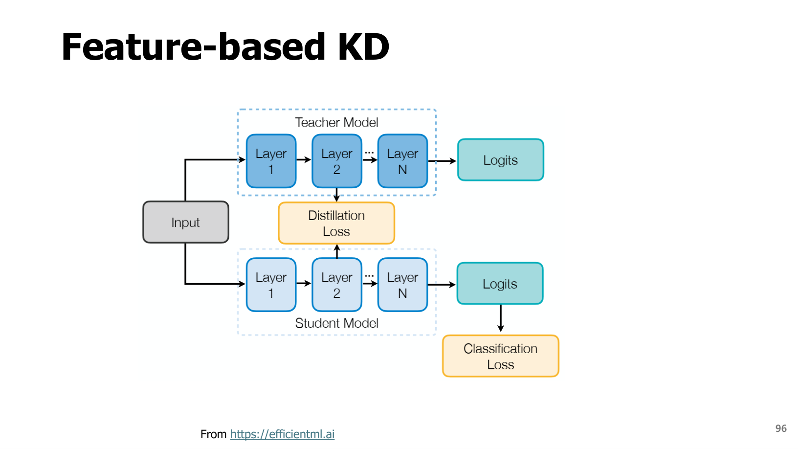

### 8.1 Feature map matching

teacher의 중간 feature를 $F_t$, student의 중간 feature를 $F_s$라고 하자.

단순 feature KD loss:

$$
\mathcal{L}_{feature}=\|F_s-F_t\|_2^2
$$

하지만 teacher와 student의 channel 수나 spatial size가 다를 수 있다. 그래서 regressor를 둔다.

$$
\mathcal{L}_{feature}=\|g(F_s)-F_t\|_2^2
$$

여기서 $g$는 student feature를 teacher feature shape에 맞추는 trainable mapping이다.

코드:

```python
student_feat = student.forward_features(x)
teacher_feat = teacher.forward_features(x)
student_feat_aligned = regressor(student_feat)
feature_loss = F.mse_loss(student_feat_aligned, teacher_feat.detach())
```

### 8.2 Hint layer / Guided layer

PDF p.98의 FitNets term.

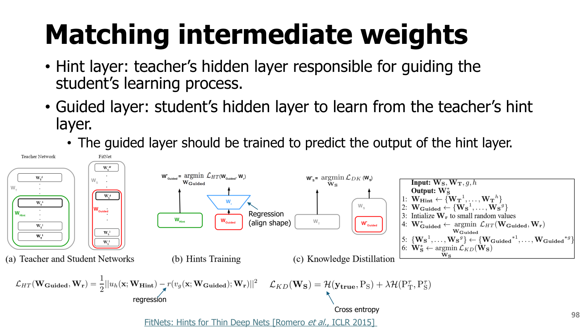

| Term | 의미 |
|---|---|
| Hint layer | teacher에서 student를 guide하는 hidden layer |
| Guided layer | student에서 hint를 따라가도록 학습되는 hidden layer |
| Regression layer | shape/channel mismatch를 맞추는 layer |

흐름:

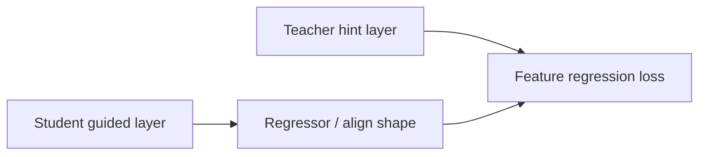
```mermaid
flowchart LR
    A[Teacher hint layer] --> C[Feature regression loss]
    B[Student guided layer] --> D[Regressor / align shape]
    D --> C
```

---

## 9. Intermediate Representation KD의 종류

PDF p.97 핵심.

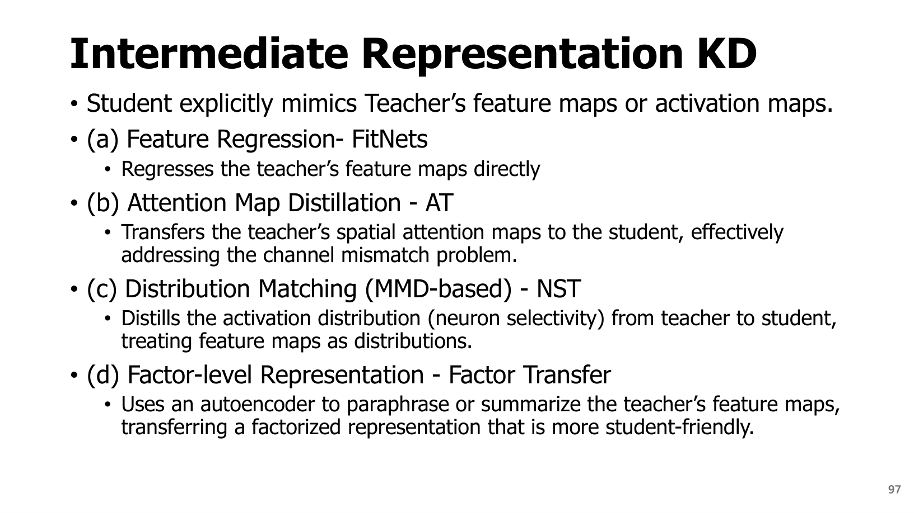

교안에서 나온 네 가지:

1. **Feature Regression - FitNets**
2. **Attention Map Distillation - AT**
3. **Distribution Matching - NST**
4. **Factor-level Representation - Factor Transfer**

### 9.1 Feature Regression

teacher feature map 자체를 student가 직접 맞춘다.

$$
\mathcal{L}=\|g(F_s)-F_t\|_2^2
$$

### 9.2 Attention Map Distillation

channel mismatch가 있을 때 raw feature 대신 spatial attention map을 맞춘다.

feature map $F\in\mathbb{R}^{C\times H\times W}$가 있을 때 attention map을 예를 들어 다음처럼 만들 수 있다.

$$
A(F)=\sum_{c=1}^{C}|F_c|^2
$$

그러면 $A(F)\in\mathbb{R}^{H\times W}$가 된다.

loss:

$$
\mathcal{L}_{AT}=\left\|\frac{A(F_s)}{\|A(F_s)\|_2}-\frac{A(F_t)}{\|A(F_t)\|_2}\right\|_2^2
$$

코드 감각:

```python
def attention_map(feat):
    # feat: [B, C, H, W]
    attn = feat.pow(2).sum(dim=1)  # [B, H, W]
    return F.normalize(attn.flatten(1), dim=1)

loss_at = F.mse_loss(attention_map(student_feat), attention_map(teacher_feat).detach())
```

### 9.3 Distribution Matching / NST

feature map 값을 직접 맞추기보다 feature distribution을 맞춘다.

teacher와 student의 activation distribution이 비슷해지도록 MMD 같은 거리 척도를 최소화한다.

---

## 10. Neuron Selectivity Transfer, NST

PDF p.99~100 핵심.

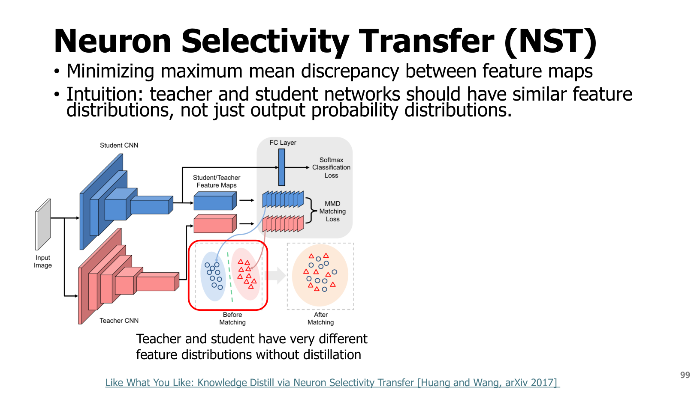

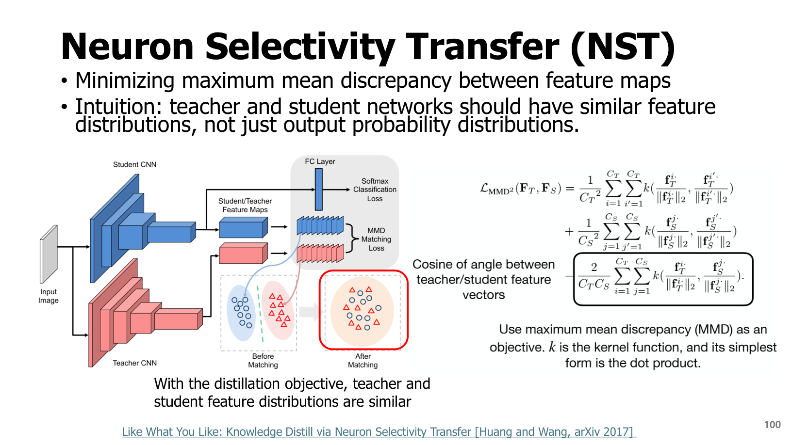

교안의 핵심 문장:

```text
teacher and student should have similar feature distributions, not just output probability distributions.
```

### 10.1 MMD 직관

MMD, Maximum Mean Discrepancy는 두 distribution이 얼마나 다른지 측정한다.

분포 $P$, $Q$에서 sample을 뽑았을 때 kernel feature 평균이 다르면 두 분포가 다르다고 본다.

간단한 형태:

$$
\mathrm{MMD}^2(P,Q)=\left\|\mathbb{E}_{x\sim P}[\phi(x)]-\mathbb{E}_{y\sim Q}[\phi(y)]\right\|^2
$$

여기서 $\phi$는 feature mapping이다.

KD 관점:

```text
teacher feature distribution과 student feature distribution을 비슷하게 만든다.
```

---

## 11. Factor Transfer

PDF p.101 핵심.

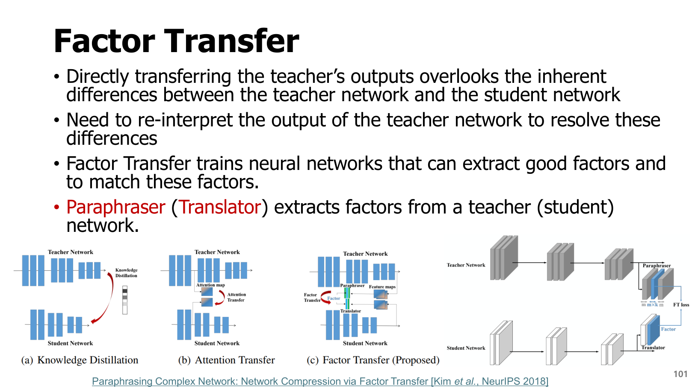

Feature를 그대로 맞추면 teacher와 student architecture 차이 때문에 어렵다. Factor Transfer는 teacher feature를 더 student-friendly한 factor로 paraphrase한다.

교안 term:

| Term | 의미 |
|---|---|
| Paraphraser | teacher feature에서 factor를 추출하는 module |
| Translator | student feature를 factor space로 변환하는 module |
| Factor | teacher representation을 요약한 지식 표현 |

흐름:

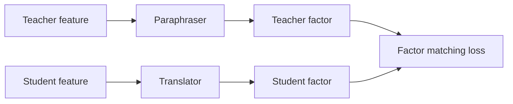
```mermaid
flowchart LR
    A[Teacher feature] --> B[Paraphraser]
    B --> C[Teacher factor]
    D[Student feature] --> E[Translator]
    E --> F[Student factor]
    C --> G[Factor matching loss]
    F --> G
```

수식:

$$
\mathcal{L}_{FT}=\left\|\frac{T_s(F_s)}{\|T_s(F_s)\|_2}-\frac{P_t(F_t)}{\|P_t(F_t)\|_2}\right\|_2^2
$$

---

## 12. Structural / Functional KD

PDF p.102 이후는 raw value가 아니라 relation/structure를 distill하는 흐름이다.

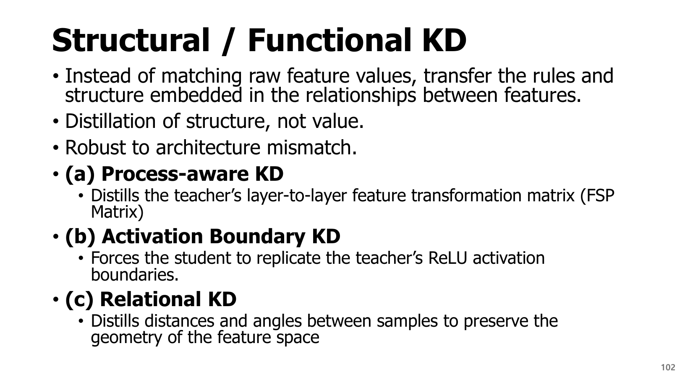

핵심:

```text
Distillation of structure, not value.
```

즉 feature 값 자체가 아니라 feature 사이의 관계, layer 사이의 흐름, sample 사이의 거리/각도를 맞춘다.

장점:

```text
teacher와 student architecture가 달라도 적용하기 쉬울 수 있다.
```

---

## 13. Activation Boundary KD

PDF p.103 핵심.

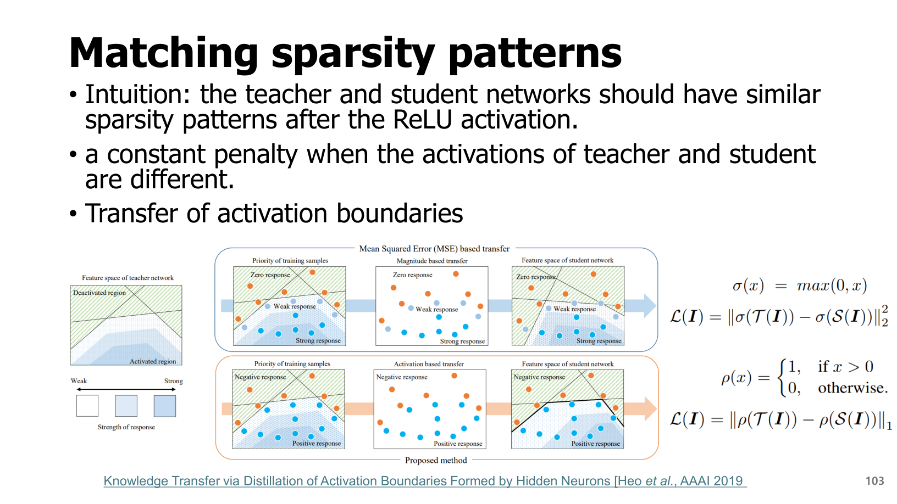

ReLU는 activation이 양수인지 음수인지에 따라 boundary가 생긴다.

$$
\mathrm{ReLU}(z)=\max(0,z)
$$

activation pattern:

$$
\mathbb{1}[z>0]
$$

Activation boundary KD는 teacher와 student의 ReLU activation boundary, 즉 sparsity pattern이 비슷해지도록 한다.

직관:

```text
teacher가 어떤 neuron을 켜고 끄는지 student도 비슷하게 따라가라.
```

---

## 14. Relational Information KD

PDF p.104~106 핵심.

관계 기반 KD는 feature 값 자체보다 관계를 맞춘다.

### 14.1 Layer 간 관계: FSP matrix

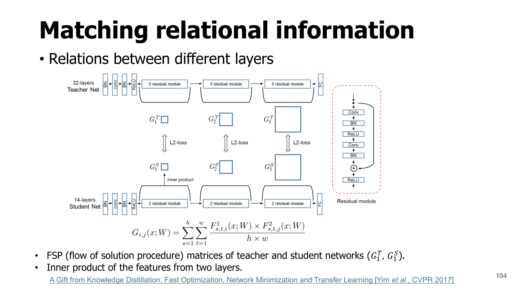

FSP, Flow of Solution Procedure는 서로 다른 두 layer feature의 inner product 관계를 본다.

두 feature map $F^1\in\mathbb{R}^{C_1\times H\times W}$, $F^2\in\mathbb{R}^{C_2\times H\times W}$가 있을 때 spatial dimension을 펼치면:

$$
F^1\in\mathbb{R}^{C_1\times N},\quad F^2\in\mathbb{R}^{C_2\times N}
$$

FSP matrix:

$$
G=\frac{1}{N}F^1(F^2)^T
$$

teacher와 student의 $G$를 맞춘다.

$$
\mathcal{L}_{FSP}=\|G_s-G_t\|_F^2
$$

### 14.2 Sample 간 관계: Relational KD

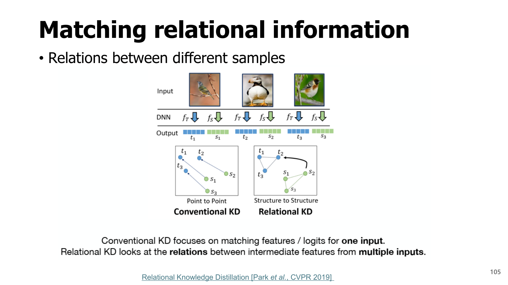

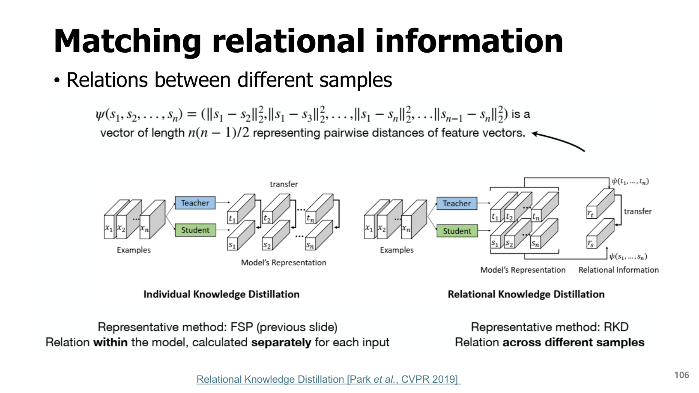

Relational KD는 batch 안 sample들 사이의 거리와 각도를 맞춘다.

거리:

$$
d_{ij}=\|f_i-f_j\|_2
$$

각도:

$$
\cos\theta_{ijk}=\frac{(f_i-f_j)^T(f_k-f_j)}{\|f_i-f_j\|_2\|f_k-f_j\|_2}
$$

직관:

```text
teacher feature space에서 A와 B가 가깝고 C와 멀다면,
student feature space에서도 그 관계를 유지하라.
```

---

## 15. KD for Transformer

PDF p.107~109 핵심.

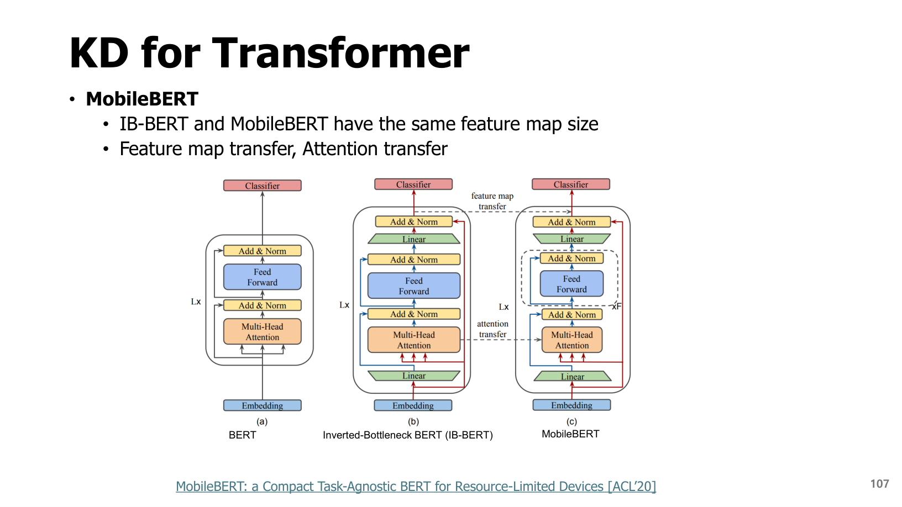

Transformer KD에서는 다음을 distill할 수 있다.

- logits
- hidden states
- attention maps
- intermediate features
- layer-to-layer relation

MobileBERT류 아이디어:

```text
teacher BERT와 student MobileBERT의 feature map size를 맞춰 feature transfer와 attention transfer를 쉽게 한다.
```

### 15.1 Attention transfer

Transformer attention matrix:

$$
A=\mathrm{softmax}\left(\frac{QK^T}{\sqrt{d_k}}\right)
$$

teacher attention $A_t$와 student attention $A_s$를 맞춘다.

$$
\mathcal{L}_{attn}=\|A_s-A_t\|_2^2
$$

코드 감각:

```python
teacher_outputs = teacher(input_ids, output_attentions=True, output_hidden_states=True)
student_outputs = student(input_ids, output_attentions=True, output_hidden_states=True)

attn_loss = 0
for a_s, a_t in zip(student_outputs.attentions, teacher_outputs.attentions):
    attn_loss += F.mse_loss(a_s, a_t.detach())
```

### 15.2 KD after pruning

PDF p.108~109는 pruning 후 retraining 과정에서 KD를 적용하는 흐름을 보여준다.

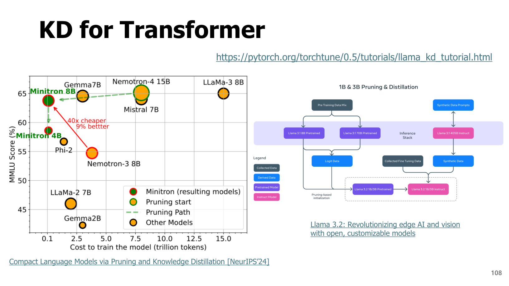

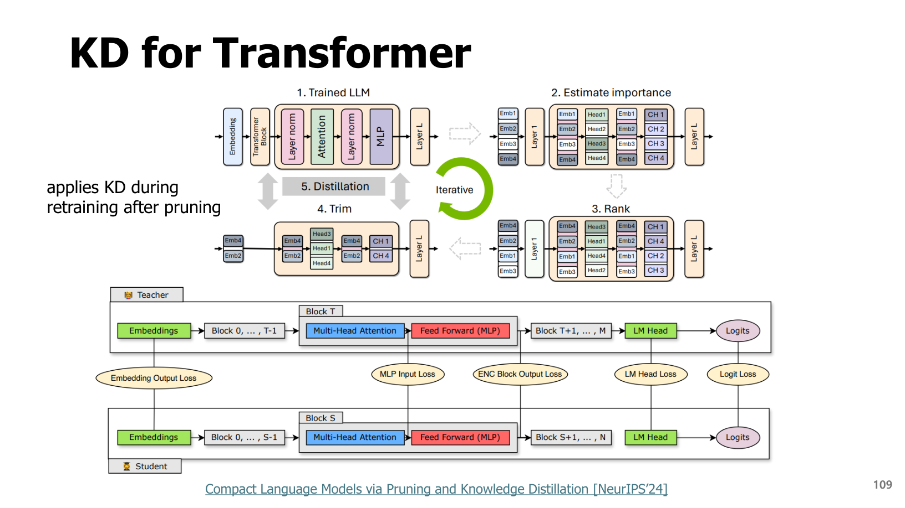

Pruning으로 모델 capacity가 줄면 accuracy가 떨어질 수 있다. 이때 teacher의 soft target이나 intermediate feature를 이용해 retraining하면 손실을 회복하는 데 도움이 된다.

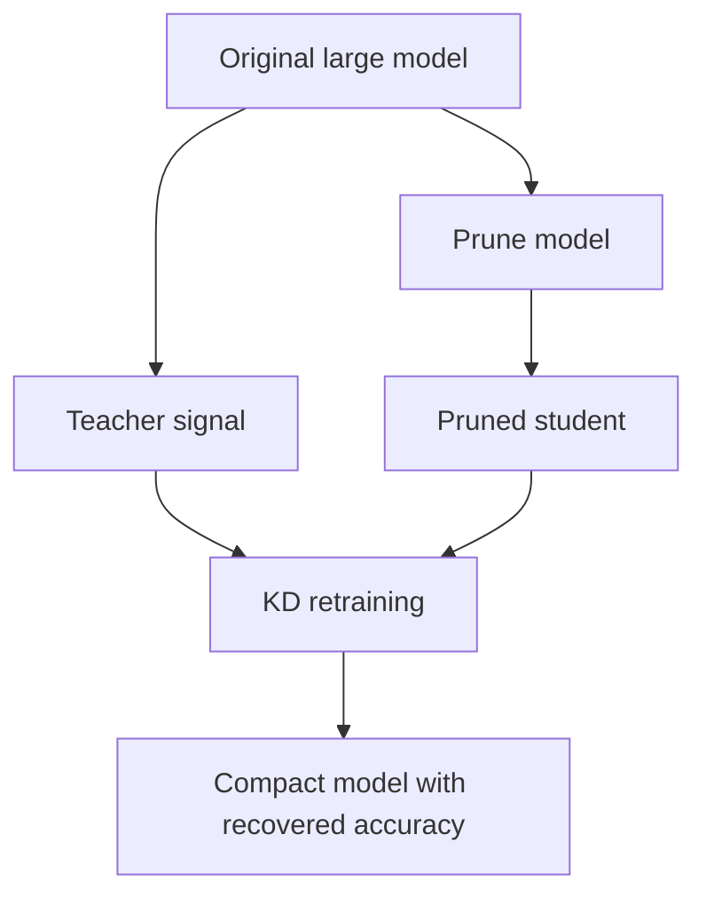
```mermaid
flowchart TD
    A[Original large model] --> B[Prune model]
    B --> C[Pruned student]
    A --> D[Teacher signal]
    D --> E[KD retraining]
    C --> E
    E --> F[Compact model with recovered accuracy]
```

---

## 16. KD의 큰 분류

교안 흐름을 정리하면 KD는 크게 네 범주로 볼 수 있다.

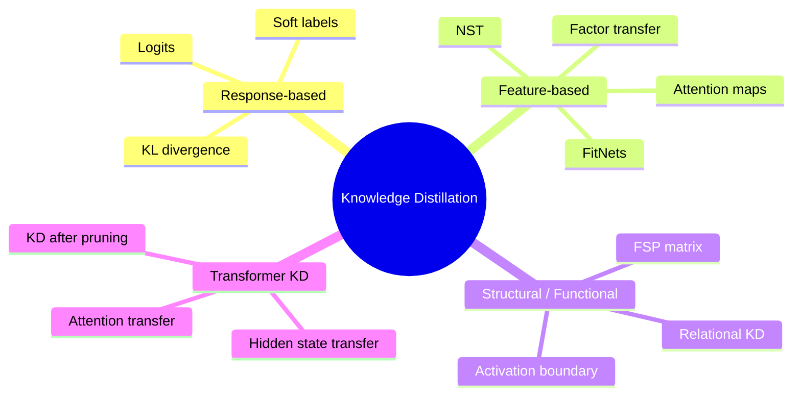
```mermaid
mindmap
  root((Knowledge Distillation))
    Response-based
      Logits
      Soft labels
      KL divergence
    Feature-based
      FitNets
      Attention maps
      NST
      Factor transfer
    Structural / Functional
      Activation boundary
      FSP matrix
      Relational KD
    Transformer KD
      Attention transfer
      Hidden state transfer
      KD after pruning
```

비교표:

| KD 종류 | 무엇을 맞추나 | 대표 loss | 장점 |
|---|---|---|---|
| Response-based | 최종 class distribution | KL divergence | 구현 쉬움 |
| Feature-based | 중간 feature map | MSE, attention loss | 더 풍부한 정보 전달 |
| Distribution-based | feature distribution | MMD | architecture mismatch 완화 |
| Relational KD | sample/layer 관계 | distance/angle/FSP loss | 구조적 지식 전달 |
| Transformer KD | attention/hidden/logits | MSE/KL | LLM/BERT 압축에 유용 |

---

## 17. 실습 notebook과 연결

`3. Knowledge Distillation.ipynb`에서는 보통 다음 흐름으로 연결된다.

1. Teacher model load
2. Student model define
3. Student baseline CE training
4. Soft target KD
5. Cosine/feature KD
6. Hint-based KD with regressor

교안의 대응:

| 교안 내용 | notebook 대응 |
|---|---|
| Response-based KD | soft target KL loss |
| Feature-based KD | cosine loss, intermediate representation |
| FitNets / hint layer | regressor + MSE loss |
| Teacher/student 개념 | VGG teacher, lightweight student |

---

## 18. Chapter 4 최종 요약

```text
1. 작은 모델은 직접 학습하면 underfit되기 쉽다.
2. 큰 teacher는 더 풍부한 class probability / feature / relation 정보를 갖는다.
3. KD는 teacher의 지식을 student가 모방하도록 학습한다.
4. Soft label은 hard label보다 class similarity 정보를 더 많이 담는다.
5. Temperature는 distribution을 부드럽게 만들어 dark knowledge를 드러낸다.
6. Response-based KD는 output distribution을 맞춘다.
7. Feature-based KD는 hidden representation을 맞춘다.
8. Structural KD는 feature 값보다 관계와 구조를 맞춘다.
9. Transformer KD는 logits, hidden states, attention maps를 distill할 수 있다.
10. Pruning 후 retraining에도 KD를 사용해 accuracy 회복을 도울 수 있다.
```

---

## 19. 시험 예상 질문

### Q1. Knowledge Distillation이란?

큰 teacher model이 학습한 지식을 작은 student model이 모방하도록 학습하는 model compression 기법이다. teacher의 logits, soft label, feature map, relation 등을 student에게 전달한다.

### Q2. Soft label이 hard label보다 정보가 많은 이유는?

Hard label은 정답 class만 알려주지만, soft label은 class 간 유사도 정보를 담는다. 예를 들어 cat 이미지에서 dog 확률이 truck보다 높다면, student는 cat과 dog가 더 비슷하다는 정보를 배울 수 있다.

### Q3. Temperature는 왜 쓰나?

logit을 $T$로 나눠 softmax 분포를 부드럽게 만든다. $T>1$이면 class 간 확률 차이가 완화되어 teacher의 dark knowledge가 더 잘 드러난다.

### Q4. KD loss는 어떻게 구성되는가?

보통 hard label cross entropy와 teacher-student KL divergence를 섞는다.

$$
\mathcal{L}=\alpha\mathcal{L}_{CE}+(1-\alpha)T^2D_{KL}(p_t^T\|p_s^T)
$$

### Q5. Response-based KD와 feature-based KD의 차이는?

Response-based KD는 최종 output probability/logits를 맞춘다. Feature-based KD는 중간 feature map이나 activation representation을 맞춘다.

### Q6. FitNets에서 hint layer와 guided layer는 무엇인가?

Hint layer는 teacher의 중간 layer이고, guided layer는 그 teacher feature를 따라가도록 학습되는 student의 중간 layer다. shape mismatch가 있으면 regressor를 둔다.

### Q7. Attention Map Distillation은 왜 필요한가?

teacher와 student의 channel 수가 달라도 spatial attention map을 맞추면 어디를 중요하게 보는지 전달할 수 있다.

### Q8. NST의 핵심은?

teacher와 student가 feature 값 자체뿐 아니라 feature distribution도 비슷해지도록 MMD 등을 최소화한다.

### Q9. Relational KD는 무엇을 맞추는가?

feature 값 자체가 아니라 sample 간 거리, 각도, layer 간 relation 같은 구조적 관계를 맞춘다.

### Q10. Transformer KD에서는 무엇을 distill할 수 있는가?

logits, hidden states, attention maps, layer relations 등을 distill할 수 있다. MobileBERT처럼 teacher와 student feature map size를 맞춰 transfer를 쉽게 하기도 한다.

---

## 20. 초압축 암기

```text
KD = teacher 지식을 student에게 전달
Teacher = 큰/정확한 모델
Student = 작은/빠른 모델
Hard label = one-hot 정답
Soft label = teacher probability distribution
Temperature = softmax를 부드럽게 만드는 값
Response KD = logits/probability matching
Feature KD = hidden feature matching
FitNets = hint layer → guided layer
NST = feature distribution matching
Factor Transfer = teacher feature를 factor로 요약해 전달
Structural KD = value가 아니라 relation/structure 전달
Transformer KD = logits + hidden states + attention maps distillation
Pruning 후 KD = 줄어든 모델 accuracy 회복 보조
```
