# ODAI-2 Chapter 1. LLM Pruning & Sparsity-Preserved PEFT 핵심 정리

범위: `On-Device AI 강의자료/ODAI-2.pdf` p.3~p.20  
다음 챕터: LLM Quantization, p.21부터

> 이 챕터는 ODAI-1의 Network Pruning을 LLM 규모로 확장한다.  
> 핵심 흐름: **Taylor/OBD/OBS → LLM pruning 한계 → SparseGPT → Wanda → PEFT/LoRA → SPP**

---

## 1. 이 챕터의 핵심 질문

CNN에서는 magnitude pruning + fine-tuning이 어느 정도 가능했다. 하지만 LLM에서는 parameter 수가 100B 이상으로 커지고, retraining 비용이 너무 커진다.

핵심 질문:

```text
거대한 LLM을 재학습 없이 또는 아주 적은 비용으로 pruning할 수 있는가?
```

교안의 핵심 영어 term:

- **saliency**: weight를 제거했을 때 loss가 얼마나 증가하는지 나타내는 중요도
- **one-shot pruning**: retraining 없이 한 번에 pruning
- **local layer-output reconstruction**: 전체 loss 대신 각 layer 출력 복원 오차를 최소화
- **activation-aware pruning**: weight 자체뿐 아니라 input activation까지 고려하는 pruning
- **PEFT**: parameter-efficient fine-tuning
- **sparsity-preserved PEFT**: sparse 구조를 유지하는 efficient fine-tuning

---

## 2. Taylor Expansion Analysis on Pruning Error

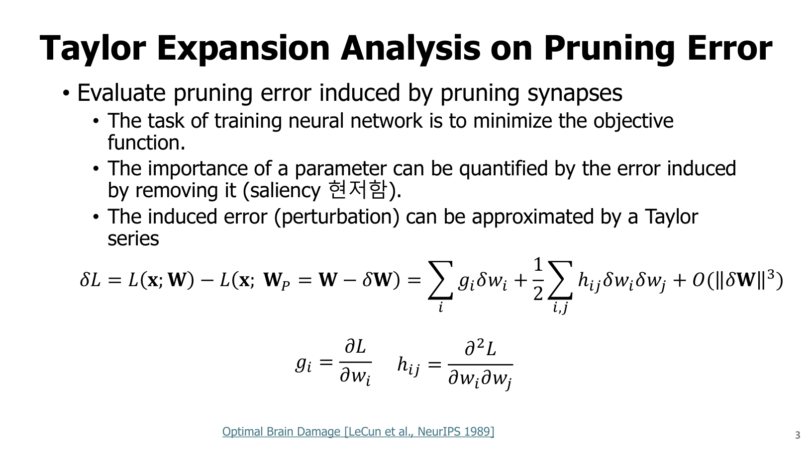

Pruning의 수학적 출발점은 “weight를 제거하면 loss가 얼마나 바뀌는가?”다.

원래 weight를 $W$, pruning 후 weight를 $W^P = W - \delta W$라고 하자.

loss 변화:

$$
\delta L = L(x;W) - L(x;W^P)
$$

Taylor expansion으로 근사하면:

$$
\delta L \approx \sum_i g_i\delta w_i + \frac{1}{2}\sum_{i,j}h_{ij}\delta w_i\delta w_j + O(\|\delta W\|^3)
$$

각 term:

| Term | 의미 |
|---|---|
| $g_i=\frac{\partial L}{\partial w_i}$ | i번째 weight에 대한 gradient |
| $h_{ij}=\frac{\partial^2L}{\partial w_i\partial w_j}$ | Hessian의 i,j 성분 |
| $\delta w_i$ | pruning으로 인한 weight 변화 |
| $\delta L$ | pruning으로 유도된 loss 변화 |

pruning은 특정 weight를 0으로 만드는 것이므로:

$$
\delta w_i = w_i
$$

또는 sign convention에 따라 $-w_i$로 쓰지만, 2차항에서는 제곱이므로 핵심은 $w_i^2$가 들어간다는 점이다.

---

## 3. OBD: Second-Order-based Pruning

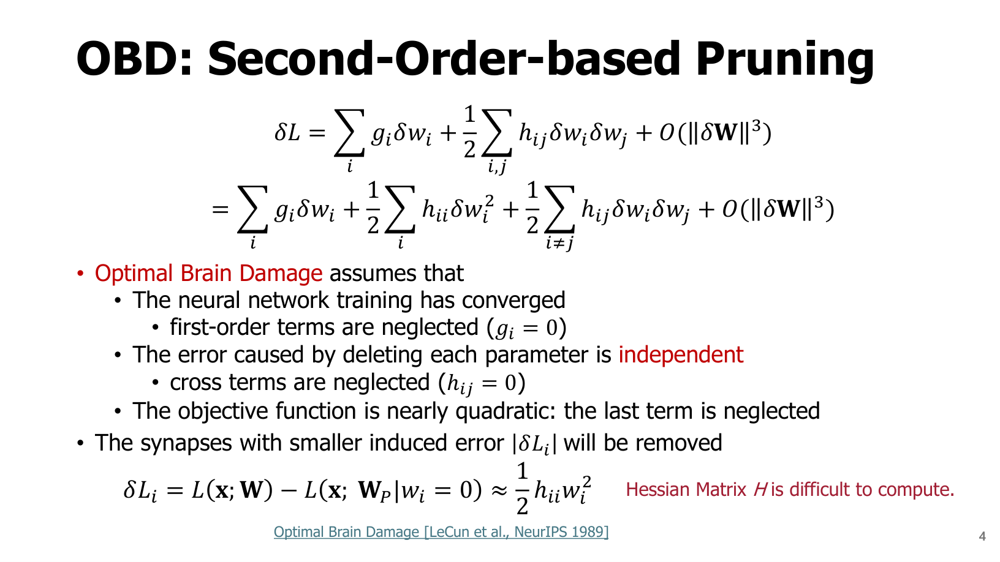

Optimal Brain Damage, OBD는 다음 가정을 둔다.

1. 학습이 수렴했다.
   $$g_i \approx 0$$
2. weight 간 cross term을 무시한다.
   $$h_{ij}=0\quad(i\neq j)$$
3. loss surface가 근처에서 거의 quadratic이다.

그러면 loss 변화는:

$$
\delta L \approx \frac{1}{2}\sum_i h_{ii}\delta w_i^2
$$

weight $w_i$ 하나를 제거할 때:

$$
\delta L_i \approx \frac{1}{2}h_{ii}w_i^2
$$

즉 OBD의 saliency는:

$$
S_i=\frac{1}{2}h_{ii}w_i^2
$$

해석:

```text
작은 weight라도 loss curvature h_ii가 크면 중요할 수 있다.
큰 weight라도 h_ii가 작으면 덜 중요할 수 있다.
```

magnitude pruning은 $h_{ii}$를 모두 같다고 보는 매우 단순한 근사로 이해할 수 있다.

코드 관점 pseudo:

```python
saliency = 0.5 * hessian_diag * weight.pow(2)
mask = keep_topk_low_saliency_removed(saliency, sparsity)
```

문제:

```text
Hessian diagonal만 계산해도 큰 모델에서는 비싸다.
```

---

## 4. OBS: Optimal Brain Surgeon

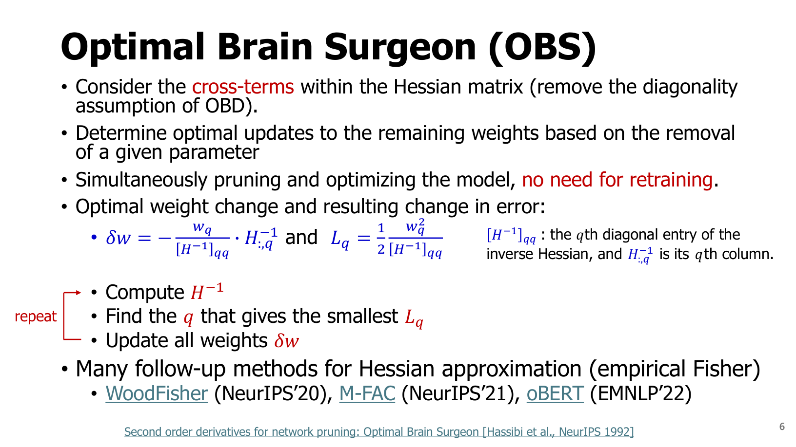

OBD는 Hessian의 diagonal만 본다. OBS는 Hessian inverse의 cross-term까지 고려한다.

교안의 핵심:

- OBD의 diagonality assumption 제거
- 제거할 weight 하나를 정하면 남은 weight를 최적으로 update
- retraining 없이 pruning과 보정을 동시에 수행하려는 접근

weight $w_q$를 제거할 때 최적 weight 변화:

$$
\delta w = -\frac{w_q}{[H^{-1}]_{qq}}H^{-1}_{:,q}
$$

loss 증가:

$$
L_q = \frac{1}{2}\frac{w_q^2}{[H^{-1}]_{qq}}
$$

각 term:

| Term | 의미 |
|---|---|
| $H^{-1}$ | Hessian inverse |
| $[H^{-1}]_{qq}$ | inverse Hessian의 q번째 diagonal entry |
| $H^{-1}_{:,q}$ | inverse Hessian의 q번째 column |
| $w_q$ | 제거할 weight |

문제:

```text
Hessian inverse 계산이 매우 비싸다.
LLM 규모에서는 직접 적용이 사실상 어렵다.
```

---

## 5. 왜 LLM Pruning은 어려운가?

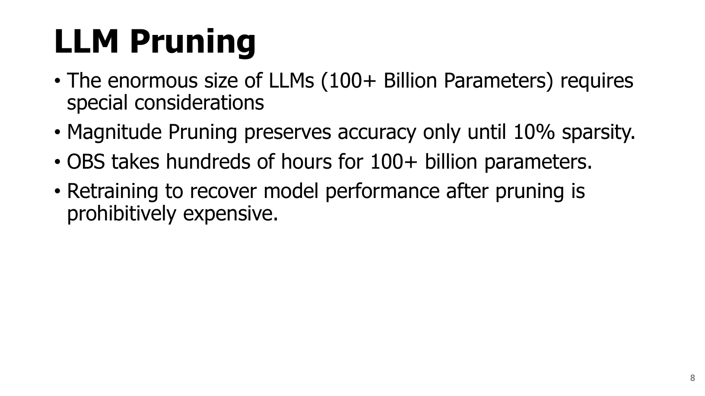

교안 p.8 핵심:

- LLM은 100B+ parameter 규모
- magnitude pruning은 약 10% sparsity까지는 견디지만 그 이상에서 성능 손상이 큼
- OBS는 100B+ 모델에서 수백 시간이 걸릴 수 있음
- pruning 후 retraining은 비용이 prohibitive

즉 LLM pruning은 다음 제약을 동시에 만족해야 한다.

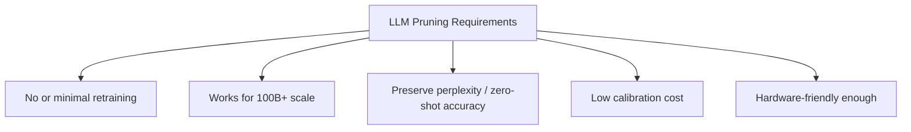

---

## 6. SparseGPT: local layer-output reconstruction

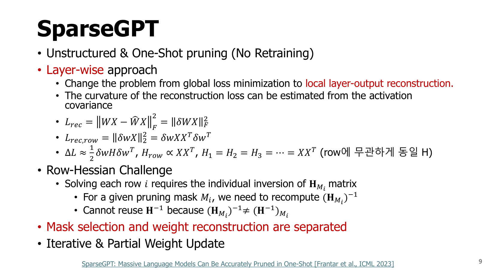

SparseGPT는 다음 특징을 가진다.

- **Unstructured & One-Shot pruning**
- **No Retraining**
- **Layer-wise approach**
- 전체 loss 대신 layer output reconstruction을 본다.

원래 layer 출력:

$$
Y = WX
$$

pruned weight:

$$
\hat{W}=W+\delta W
$$

reconstruction loss:

$$
L_{rec}=\|WX-\hat{W}X\|_F^2=\|\delta W X\|_F^2
$$

row 하나에 대해:

$$
L_{rec,row}=\|\delta wX\|_2^2=\delta wXX^T\delta w^T
$$

여기서 activation covariance가 Hessian 역할을 한다.

$$
H_{row}\propto XX^T
$$

각 term:

| Term | 의미 |
|---|---|
| $W$ | layer weight |
| $X$ | calibration activation input |
| $WX$ | 원래 layer output |
| $\hat{W}X$ | pruning 후 layer output |
| $XX^T$ | activation covariance, curvature 근사 |

코드 관점:

```python
# X: [in_features, num_samples]
H = X @ X.T
# pruning 후 W_hat X가 W X에 가깝도록 남은 weight를 update
```

---

## 7. SparseGPT의 Hessian Synchronization

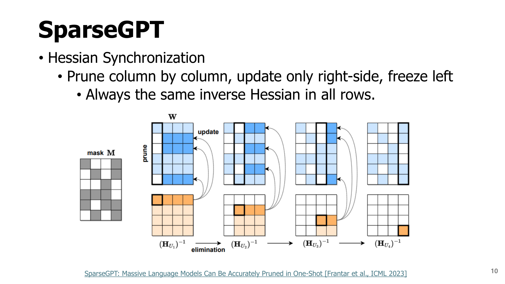

SparseGPT는 column-by-column으로 pruning/update한다.

교안 핵심:

```text
Prune column by column, update only right-side, freeze left.
Always the same inverse Hessian in all rows.
```

직관:

- 이미 처리한 왼쪽 column은 freeze
- 아직 남은 오른쪽 weight만 보정
- row마다 Hessian inverse를 새로 만들지 않도록 계산을 동기화

흐름:

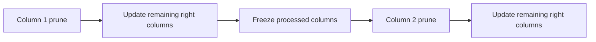

SparseGPT가 magnitude pruning보다 좋은 이유:

```text
그냥 0으로 만들고 끝내지 않고, pruning error를 남은 weight가 보상하도록 update한다.
```

---

## 8. SparseGPT 결과 해석

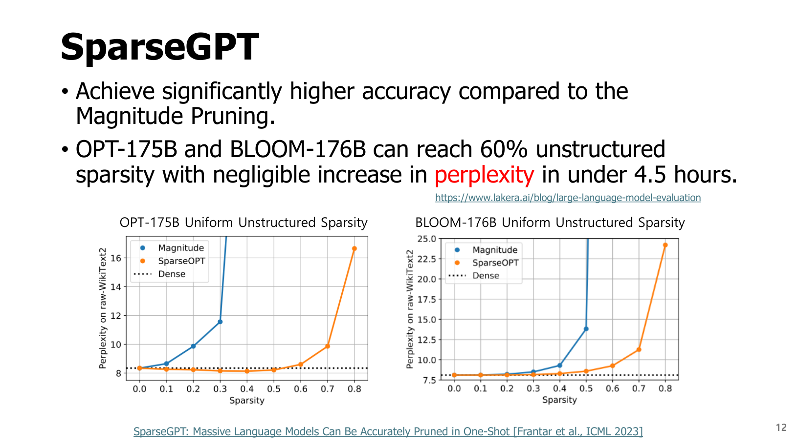

교안 p.12 핵심:

- OPT-175B, BLOOM-176B에서 60% unstructured sparsity까지 perplexity 증가가 작음
- 4.5시간 이내에 가능
- magnitude pruning보다 높은 accuracy 유지

시험 포인트:

```text
SparseGPT는 LLM에서 retraining 없이 one-shot pruning을 가능하게 한 대표 방법.
핵심은 global loss가 아니라 layer output reconstruction으로 문제를 바꾼 것.
```

---

## 9. Wanda: activation-aware magnitude pruning

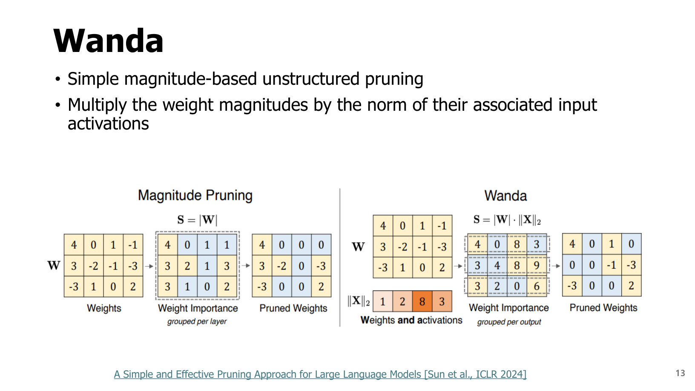

Wanda는 SparseGPT보다 단순한 접근이다.

교안 핵심:

```text
Multiply the weight magnitudes by the norm of their associated input activations.
```

즉 importance score를 다음처럼 둔다.

$$
I_{ij}=|W_{ij}|\cdot\|X_j\|_2
$$

각 term:

| Term | 의미 |
|---|---|
| $W_{ij}$ | output i, input j에 해당하는 weight |
| $X_j$ | input feature j의 activation vector |
| $\|X_j\|_2$ | calibration data에서 input feature j가 얼마나 크게 활성화되는지 |

왜 activation을 곱하나?

layer output은:

$$
y_i=\sum_j W_{ij}x_j
$$

weight가 작아도 $x_j$가 자주 크면 영향이 클 수 있다. 반대로 weight가 커도 input activation이 거의 0이면 영향이 작을 수 있다.

코드 관점:

```python
# W: [out_features, in_features]
# X: [num_samples, in_features]
activation_norm = torch.norm(X, p=2, dim=0)       # [in_features]
score = W.abs() * activation_norm[None, :]        # broadcast
mask = prune_low_scores_per_row(score, sparsity)
W_pruned = W * mask
```

Wanda의 장점:

```text
SparseGPT보다 단순하지만 activation 정보를 반영해 magnitude pruning보다 강함.
```

---

## 10. PEFT: Parameter-Efficient Fine-Tuning

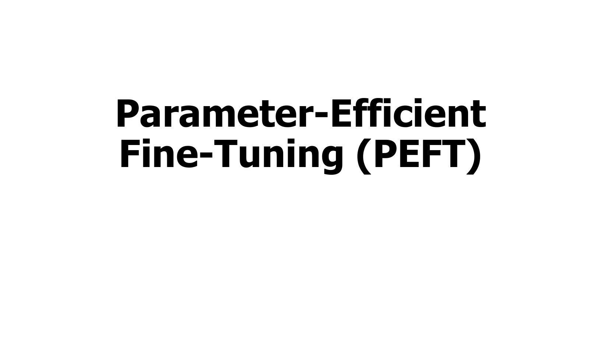

LLM을 pruning하거나 downstream task에 맞출 때 전체 weight를 fine-tuning하기는 너무 비싸다. PEFT는 아주 적은 parameter만 학습한다.

---

## 11. LoRA

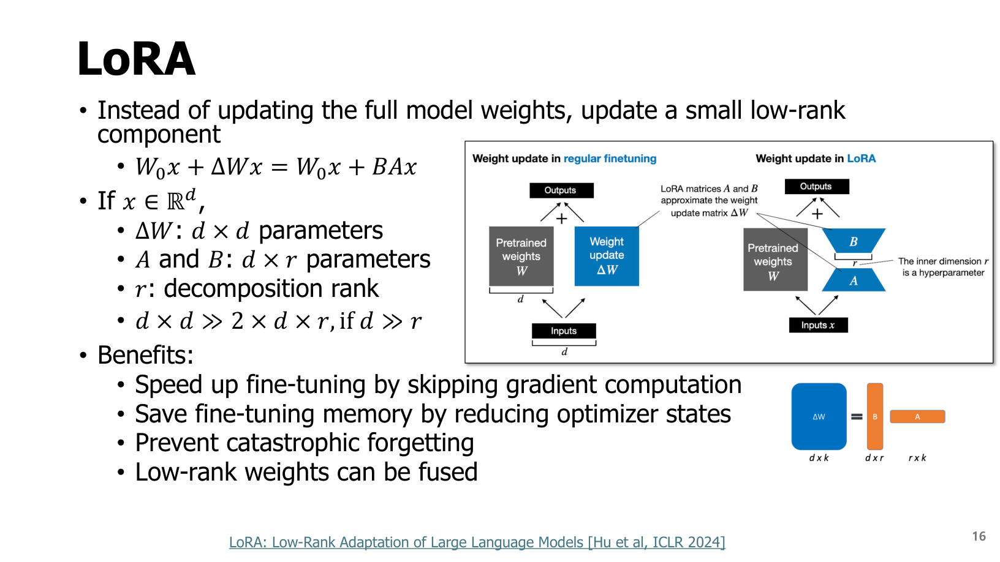

LoRA는 full weight update $\Delta W$를 low-rank product로 표현한다.

원래 linear layer:

$$
y=W_0x
$$

fine-tuning update:

$$
y=(W_0+\Delta W)x
$$

LoRA:

$$
\Delta W=BA
$$

따라서:

$$
y=W_0x+BAx
$$

차원:

- $W_0\in\mathbb{R}^{d\times d}$
- $A\in\mathbb{R}^{r\times d}$
- $B\in\mathbb{R}^{d\times r}$
- $r\ll d$

parameter 수 비교:

$$
\Delta W: d^2
$$

$$
A+B: 2dr
$$

$d\gg r$이면:

$$
d^2\gg2dr
$$

코드 감각:

```python
base = x @ W0.T
lora = (x @ A.T) @ B.T
out = base + alpha / r * lora
```

LoRA 장점:

- gradient/optimizer state가 LoRA parameter에만 필요
- fine-tuning memory 감소
- catastrophic forgetting 완화
- 추론 시 $BA$를 $W_0$에 fuse 가능

---

## 12. SPP: Sparsity-Preserved PEFT

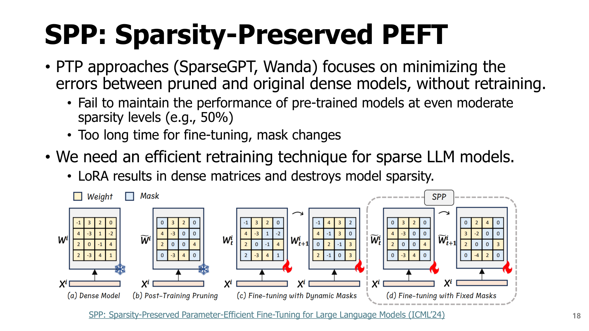

문제:

```text
SparseGPT/Wanda는 pruning 후 retraining이 없거나 제한적이라 성능 유지가 어려울 수 있다.
LoRA는 dense low-rank update를 추가해서 sparse structure를 망칠 수 있다.
```

즉 sparse LLM에 LoRA를 붙이면:

$$
\hat{W}_{sparse}+BA
$$

에서 $BA$가 dense라 전체적으로 dense 연산이 생긴다.

SPP는 sparse structure를 보존하면서 PEFT를 하려는 방법이다.

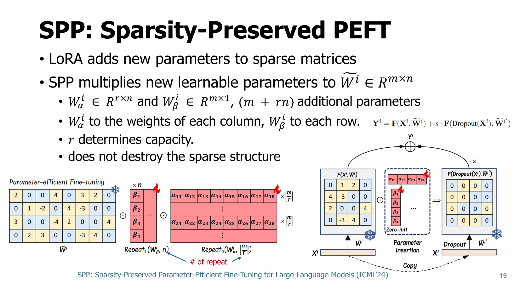

교안 핵심:

- LoRA adds new parameters to sparse matrices
- SPP multiplies new learnable parameters to sparse weight
- does not destroy the sparse structure

직관:

```text
새 dense matrix를 더하는 것이 아니라,
기존 sparse weight의 row/column 방향 scale-like parameter를 학습해서 sparse mask를 유지한다.
```

시험 포인트:

```text
Sparse model을 fine-tune할 때 dense adapter가 붙으면 sparse acceleration 이득이 사라질 수 있다.
SPP는 sparse pattern을 보존하는 PEFT를 목표로 한다.
```

---

## 13. Chapter 1 최종 구조도

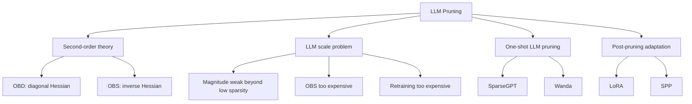

---

## 14. 시험 예상 질문

### Q1. OBD의 saliency는 무엇인가?

OBD는 loss를 Taylor 2차 근사하고, 수렴 지점에서 gradient와 Hessian cross-term을 무시해 $S_i=\frac{1}{2}h_{ii}w_i^2$를 weight saliency로 사용한다.

### Q2. Magnitude pruning은 OBD 관점에서 어떤 근사인가?

모든 $h_{ii}$가 같다고 보면 saliency는 $w_i^2$에 비례하므로 magnitude pruning과 비슷해진다.

### Q3. LLM에서 OBS가 어려운 이유는?

Hessian inverse를 계산하고 저장해야 하는데, parameter 수가 수십~수백 billion이라 계산량과 메모리가 너무 크다.

### Q4. SparseGPT의 핵심 아이디어는?

전체 loss minimization을 layer-wise output reconstruction 문제로 바꾸고, activation covariance $XX^T$를 Hessian 근사로 사용해 pruning error를 보정한다.

### Q5. Wanda는 왜 activation norm을 곱하는가?

weight의 실제 output 영향은 $W_{ij}x_j$에 의해 결정되므로, weight magnitude뿐 아니라 해당 input feature가 얼마나 크게 활성화되는지 고려해야 한다.

### Q6. LoRA가 parameter-efficient한 이유는?

full update $\Delta W\in\mathbb{R}^{d\times d}$를 $BA$로 분해해 $2dr$개의 parameter만 학습하기 때문이다. $r\ll d$이면 훨씬 적은 parameter를 학습한다.

### Q7. Sparse model에 일반 LoRA를 붙이면 왜 문제가 될 수 있나?

LoRA의 $BA$가 dense matrix이기 때문에 sparse weight에 dense update가 더해져 sparse structure와 acceleration 이점을 망칠 수 있다.

---

## 15. 초압축 암기

```text
OBD = Taylor + diagonal Hessian saliency = 1/2 h_ii w_i^2
OBS = inverse Hessian으로 남은 weight까지 최적 보정
LLM pruning = retraining/OBS 비용이 너무 큼
SparseGPT = one-shot, layer output reconstruction, H ≈ XX^T
Wanda = |W| × activation norm
LoRA = ΔW = BA, 2dr params
SPP = sparse structure를 보존하는 PEFT
```
