# ODAI-2 Chapter 2. LLM Quantization 핵심 정리

범위: `On-Device AI 강의자료/ODAI-2.pdf` p.21~p.46  
이전 챕터: LLM Pruning & PEFT  
다음 챕터: Efficient Inference, p.47부터

---

## 1. 이 챕터의 핵심 질문

CNN quantization은 INT8 QAT/PTQ 중심으로 설명할 수 있었다. LLM quantization은 더 어렵다.

이유:

```text
LLM은 activation outlier, weight outlier, KV cache, memory-bound decode, 재학습 비용 문제를 동시에 가진다.
```

핵심 질문:

```text
거대한 LLM을 FP16에서 INT8/INT4로 줄이면서 perplexity와 downstream accuracy를 유지하려면 어떻게 해야 하는가?
```

---

## 2. CNN Quantization vs LLM Quantization

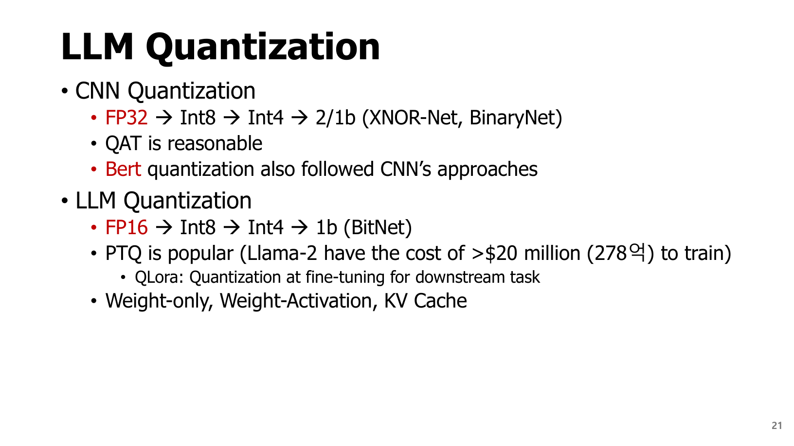

교안 p.21 핵심.

| 구분 | CNN/BERT 초기 접근 | LLM 접근 |
|---|---|---|
| Precision 흐름 | FP32 → INT8 → INT4/2/1b | FP16 → INT8 → INT4/1b |
| Training | QAT도 합리적 | PTQ가 인기 |
| 이유 | 재학습 상대적으로 가능 | LLM pretraining 비용이 매우 큼 |
| 주요 대상 | weights/activations | weight-only, W/A, KV cache |

LLM에서는 pretraining 비용이 너무 커서 PTQ가 중요하다.

---

## 3. LLM PTQ taxonomy

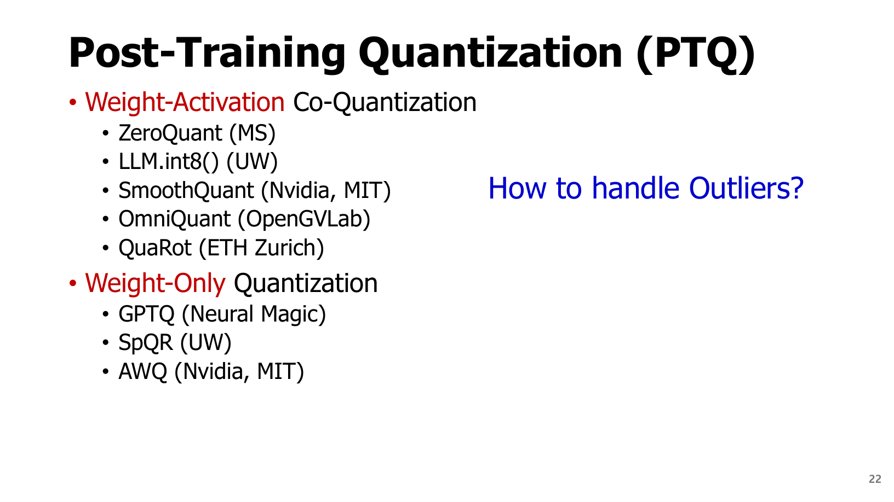

교안 p.22는 다음을 나눈다.

### Weight-Activation Co-Quantization

- ZeroQuant
- LLM.int8()
- SmoothQuant
- OmniQuant
- QuaRot

### Weight-Only Quantization

- GPTQ
- SpQR
- AWQ

핵심 문제:

```text
How to handle Outliers?
```

---

## 4. ZeroQuant

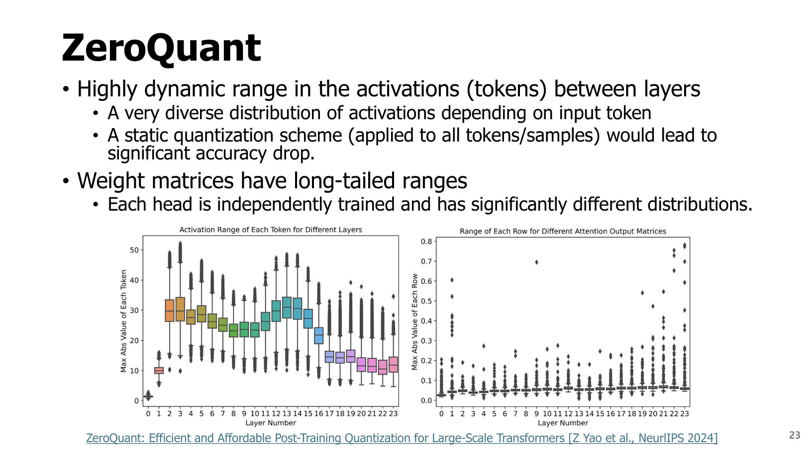

ZeroQuant가 다루는 문제:

- activation dynamic range가 layer/token마다 크게 다름
- input token에 따라 activation distribution이 다양함
- static quantization이 accuracy drop을 만들 수 있음
- weight matrix도 long-tailed range를 가짐
- attention head마다 distribution이 다름

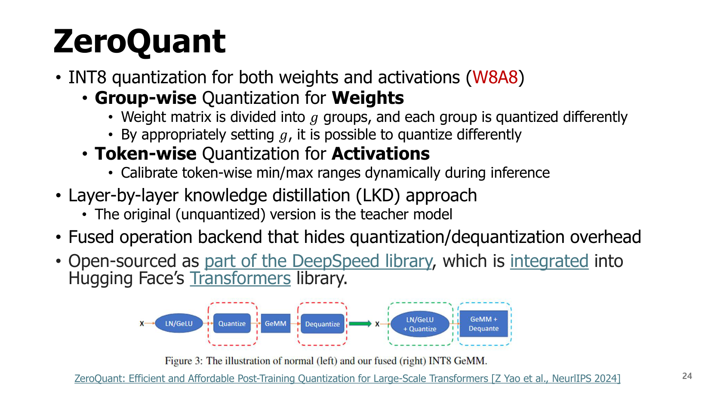

ZeroQuant 구성:

1. **W8A8**: weight와 activation 모두 INT8
2. **Group-wise Quantization for Weights**
3. **Token-wise Quantization for Activations**
4. **Layer-by-layer Knowledge Distillation, LKD**
5. fused backend로 quant/dequant overhead 숨김

### Group-wise weight quantization

weight matrix를 group으로 나누고 group마다 scale/zero point를 둔다.

$$
W=[G_1,G_2,\dots,G_g]
$$

각 group:

$$
q_g=\mathrm{round}(W_g/S_g)+Z_g
$$

장점:

```text
per-tensor보다 세밀하고, per-channel보다 구현/metadata 균형을 맞출 수 있다.
```

### Token-wise activation quantization

activation은 token마다 range가 다를 수 있다.

```python
# activation: [batch, seq, hidden]
r_min = activation.amin(dim=-1, keepdim=True)
r_max = activation.amax(dim=-1, keepdim=True)
```

즉 각 token vector마다 scale을 잡을 수 있다.

### Layer-wise KD

quantized layer가 original FP layer output을 따라가도록 한다.

$$
\mathcal{L}_{LKD}=\|Y_{quant}^{(l)}-Y_{fp}^{(l)}\|_2^2
$$

---

## 5. LLM.int8()

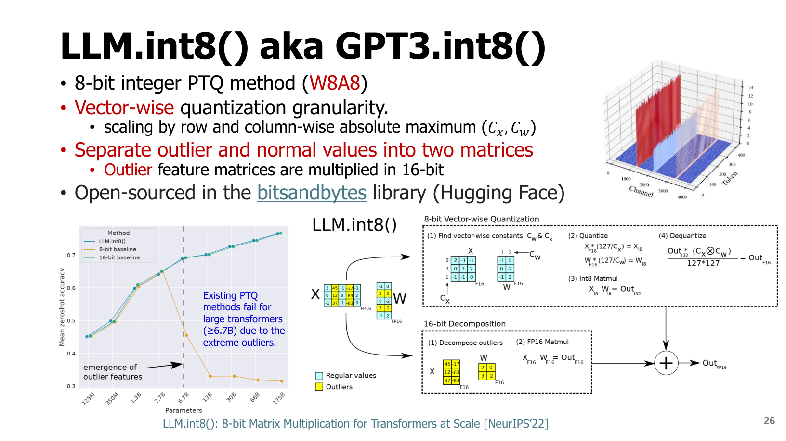

LLM.int8()는 W8A8 PTQ 방법이다.

핵심:

```text
Vector-wise quantization + outlier 분리
```

large transformer에서는 extreme outlier 때문에 기존 PTQ가 실패한다. LLM.int8()는 activation/feature outlier를 분리해 FP16으로 처리하고, normal part는 INT8로 처리한다.

흐름:

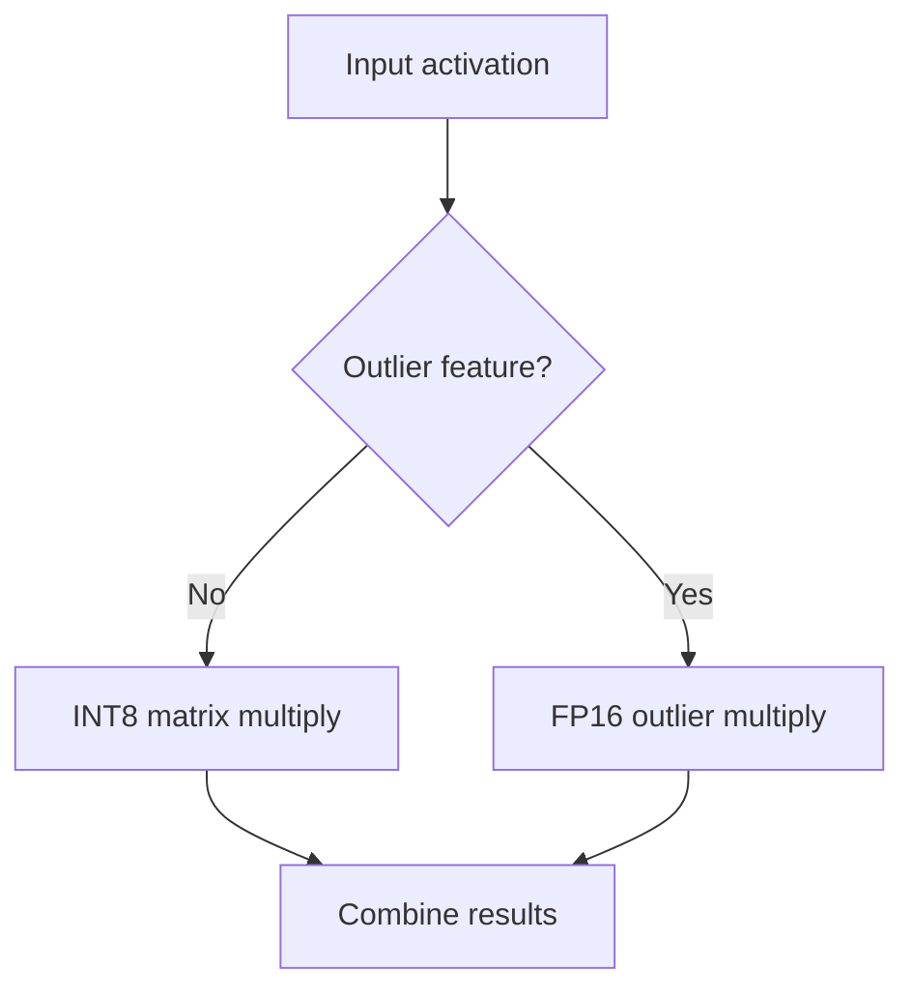
```mermaid
flowchart TD
    A[Input activation] --> B{Outlier feature?}
    B -->|No| C[INT8 matrix multiply]
    B -->|Yes| D[FP16 outlier multiply]
    C --> E[Combine results]
    D --> E
```

장점:

- 대부분 연산은 INT8
- outlier만 FP16으로 보호

단점:

- mixed precision decomposition이 필요
- implementation complexity 증가

---

## 6. SmoothQuant

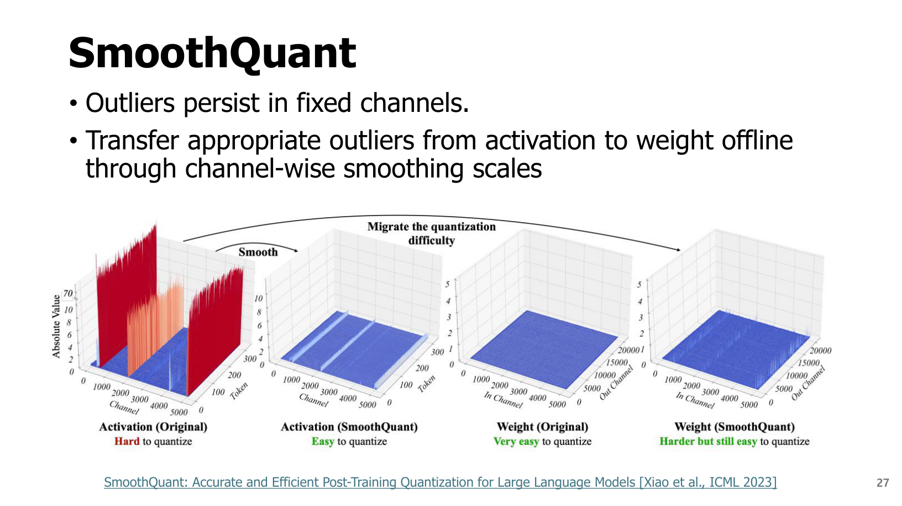

SmoothQuant의 관찰:

```text
Outliers persist in fixed channels.
```

즉 activation outlier가 특정 channel에 고정적으로 나타난다.

SmoothQuant는 activation quantization difficulty를 weight로 옮긴다.

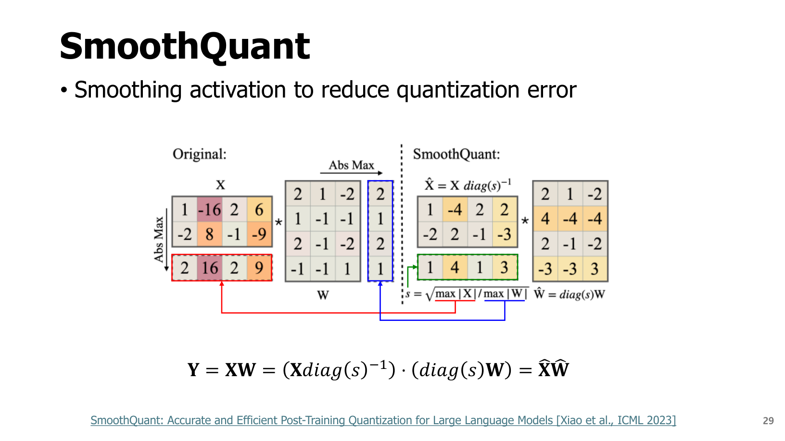

원래 연산:

$$
Y=XW
$$

channel-wise scale vector $s$를 넣으면:

$$
Y=X\operatorname{diag}(s)^{-1}\operatorname{diag}(s)W
$$

$$
Y=\hat{X}\hat{W}
$$

여기서:

$$
\hat{X}=X\operatorname{diag}(s)^{-1}
$$

$$
\hat{W}=\operatorname{diag}(s)W
$$

의미:

```text
activation의 큰 outlier channel을 s로 나눠 줄이고,
대신 weight의 해당 channel을 s로 키워 전체 연산 결과는 유지한다.
```

코드 감각:

```python
# X: [..., hidden]
# W: [hidden, out]
X_smooth = X / s
W_smooth = W * s[:, None]
Y = X_smooth @ W_smooth
```

장점:

- activation이 quantize하기 쉬워짐
- 모든 compute-intensive op를 INT8로 실행 가능
- LLM.int8()처럼 outlier FP16 분리 필요가 줄어듦

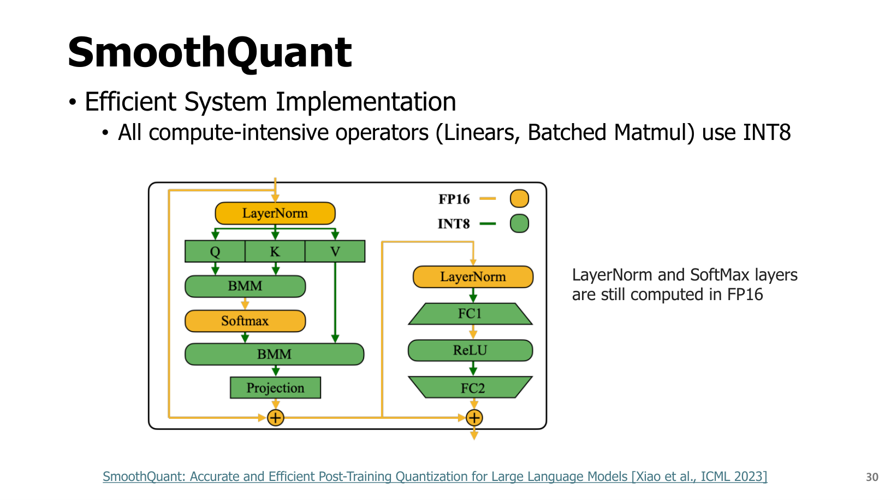

---

## 7. OmniQuant

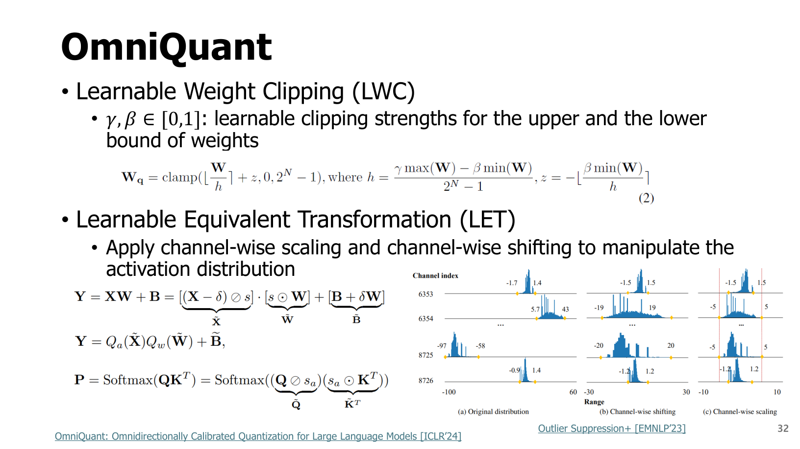

OmniQuant는 quantization parameter를 calibration 과정에서 학습한다.

핵심 term:

- **LWC, Learnable Weight Clipping**
- **LET, Learnable Equivalent Transformation**

### LWC

weight clipping upper/lower bound를 learnable strength로 조절한다.

$$
W_{clip}=\mathrm{clip}(W, -\gamma a, \beta b)
$$

여기서 $\gamma,\beta\in[0,1]$는 learnable clipping strength다.

### LET

channel-wise scaling/shifting으로 activation distribution을 조작한다.

SmoothQuant와 비슷하게 equivalent transformation을 이용하되, calibration에서 더 유연하게 조정한다.

---

## 8. QuaRot / SpinQuant

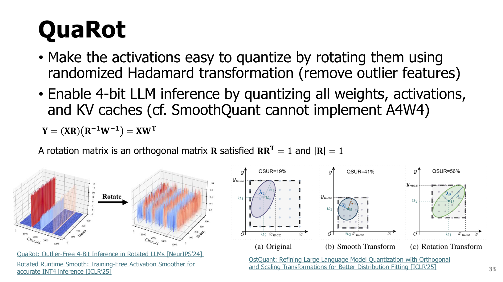

QuaRot는 activation outlier를 rotation으로 완화한다.

rotation matrix $R$는 orthogonal matrix다.

$$
RR^T=I
$$

원래 연산:

$$
Y=XW
$$

identity $RR^T=I$를 삽입하면:

$$
Y=XRR^TW=(XR)(R^TW)
$$

즉:

$$
\hat{X}=XR,\quad \hat{W}=R^TW
$$

outlier가 특정 coordinate에 몰려 있으면 rotation으로 분산시켜 quantization을 쉽게 할 수 있다.

SpinQuant는 rotation matrix를 학습한다.

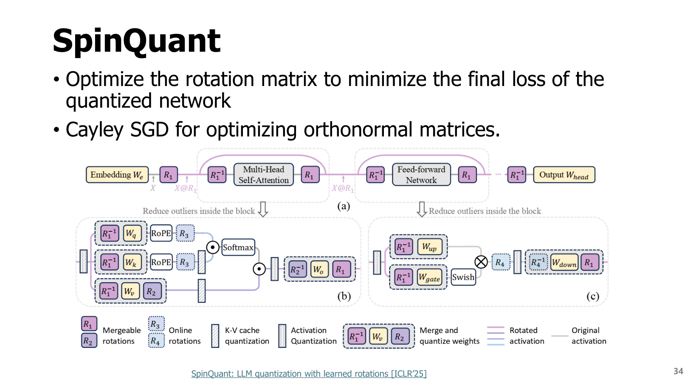

핵심:

```text
QuaRot = randomized orthogonal rotation
SpinQuant = learned rotation, final quantized loss를 줄이도록 optimize
```

---

## 9. Weight-Only Quantization

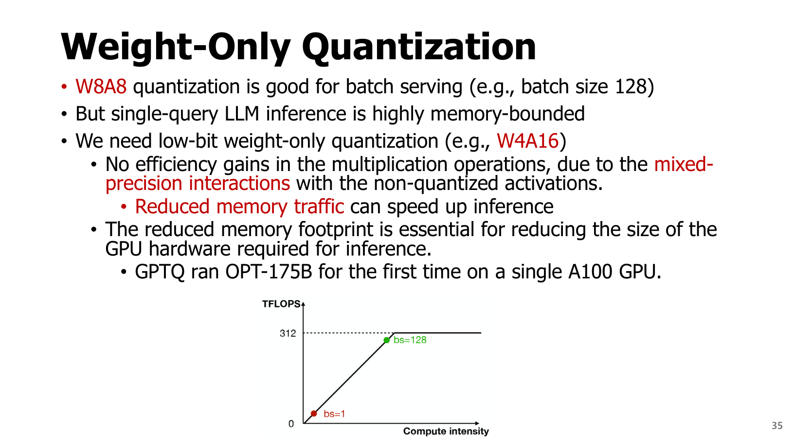

LLM single-query inference는 memory-bound다. 이때 activation까지 INT8로 바꿔도 batch가 작으면 compute 이득이 크지 않을 수 있다.

Weight-only quantization은 weight traffic을 줄이는 데 초점이 있다.

표기:

```text
W4A16 = weight INT4, activation FP16
W8A8 = weight INT8, activation INT8
```

W4A16의 장점:

- weight memory 4배 감소 대비 FP16
- memory bandwidth 감소
- 단일 query decode에서 속도 향상 가능

단점:

- multiplication은 mixed precision 처리 필요
- activation이 FP16이라 순수 INT 연산 이득은 제한적

---

## 10. GPTQ

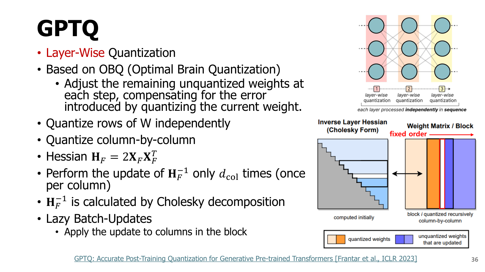

GPTQ는 layer-wise post-training weight quantization 방법이다.

핵심:

- OBQ, Optimal Brain Quantization 기반
- weight를 column-by-column quantize
- 현재 weight를 quantize할 때 생긴 error를 남은 unquantized weights에 보상
- Hessian 근사:

$$
H_F=2X_FX_F^T
$$

SparseGPT와 유사하게 activation covariance를 curvature로 사용한다.

코드 감각:

```python
H = 2 * X @ X.T
for col in columns:
    q_col = quantize(W[:, col])
    error = W[:, col] - q_col
    update_remaining_columns(W, error, H_inv)
```

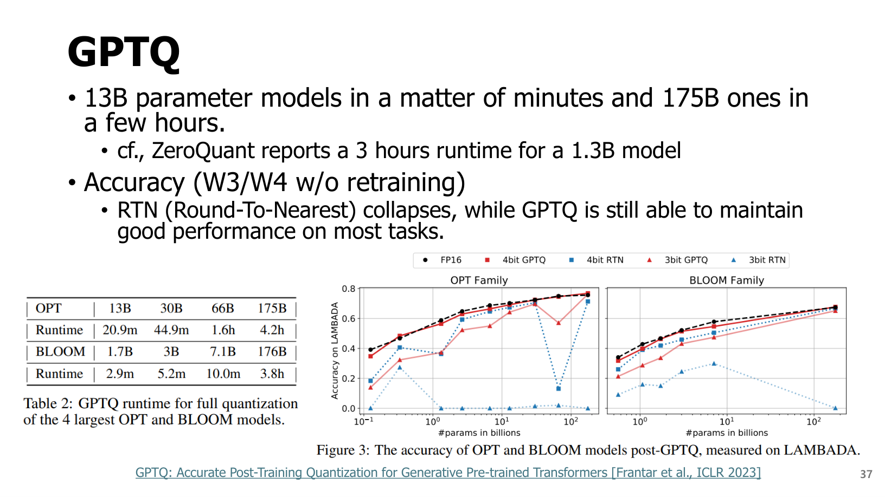

교안 핵심:

```text
RTN, Round-To-Nearest는 low-bit에서 collapse할 수 있지만 GPTQ는 대부분 task에서 성능 유지.
```

---

## 11. SpQR

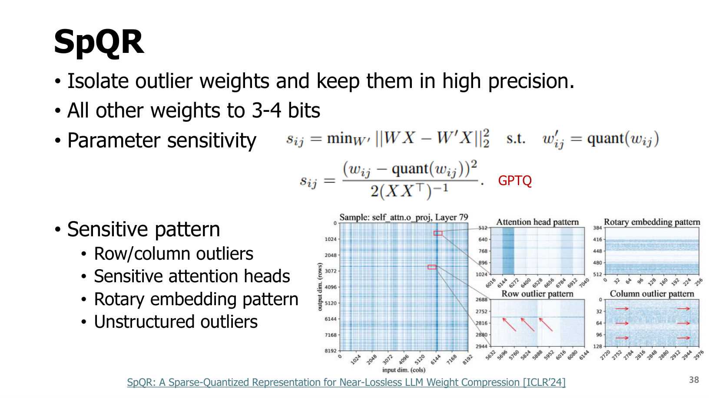

SpQR는 outlier weight를 high precision으로 분리하고, 나머지는 3~4 bit로 quantize한다.

핵심 term:

- sensitive pattern
- row/column outliers
- sensitive attention heads
- rotary embedding pattern
- unstructured outliers

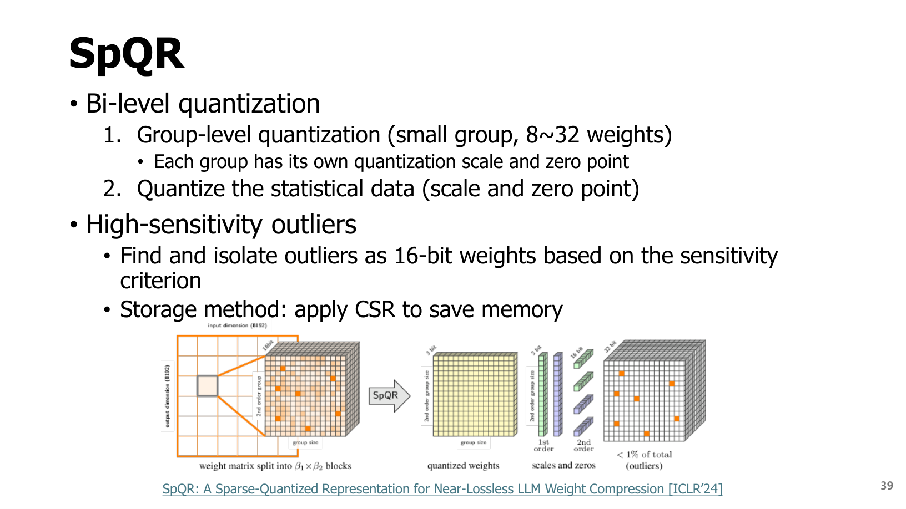

Bi-level quantization:

1. small group 단위로 scale/zero point를 둔다.
2. scale/zero point 같은 통계값도 다시 quantize한다.
3. high-sensitivity outlier는 FP16으로 격리한다.
4. sparse outlier 저장에는 CSR을 사용할 수 있다.

---

## 12. AWQ

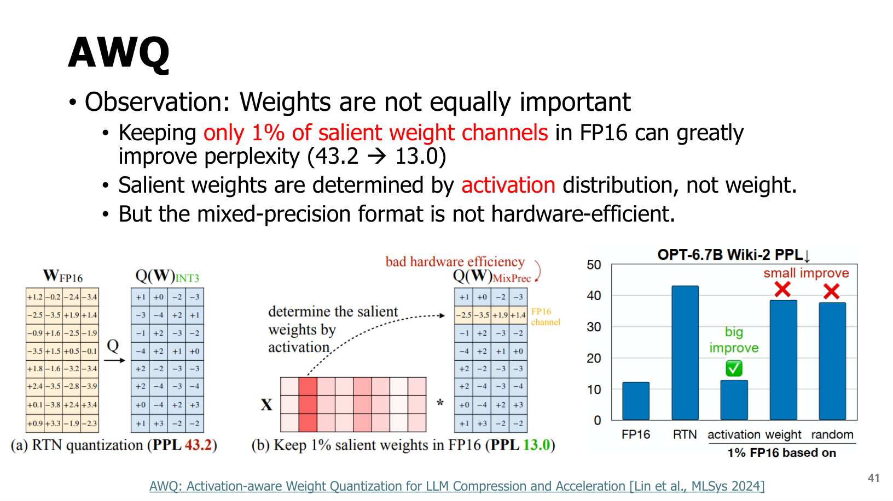

AWQ의 관찰:

```text
Weights are not equally important.
Salient weights are determined by activation distribution, not weight magnitude alone.
```

1% salient weight channel만 FP16으로 보호해도 perplexity가 크게 좋아질 수 있다. 하지만 mixed precision은 hardware-efficient하지 않다.

AWQ는 salient weight를 직접 FP16으로 남기기보다 per-channel scaling으로 보호한다.

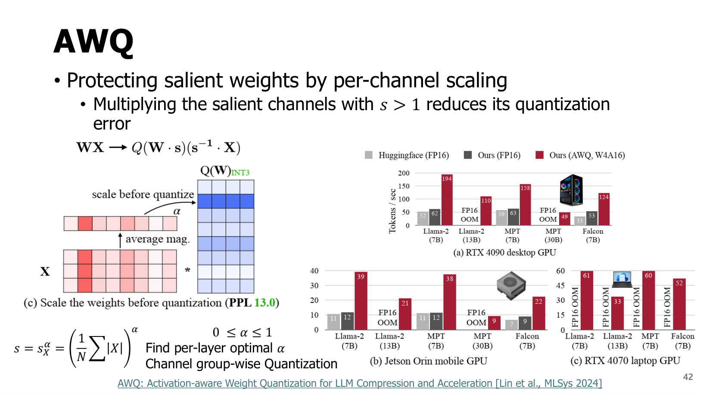

중요 channel에 scale $s>1$을 곱하면 quantization error가 줄어든다.

직관:

```text
중요 channel의 dynamic range를 키워 quantizer가 더 잘 보존하게 한다.
```

activation 기반 scale:

$$
s=s_X^{\alpha},\quad 0\le \alpha\le 1
$$

$\alpha$는 layer별로 search한다.

---

## 13. QLoRA / NF4 / Double Quantization

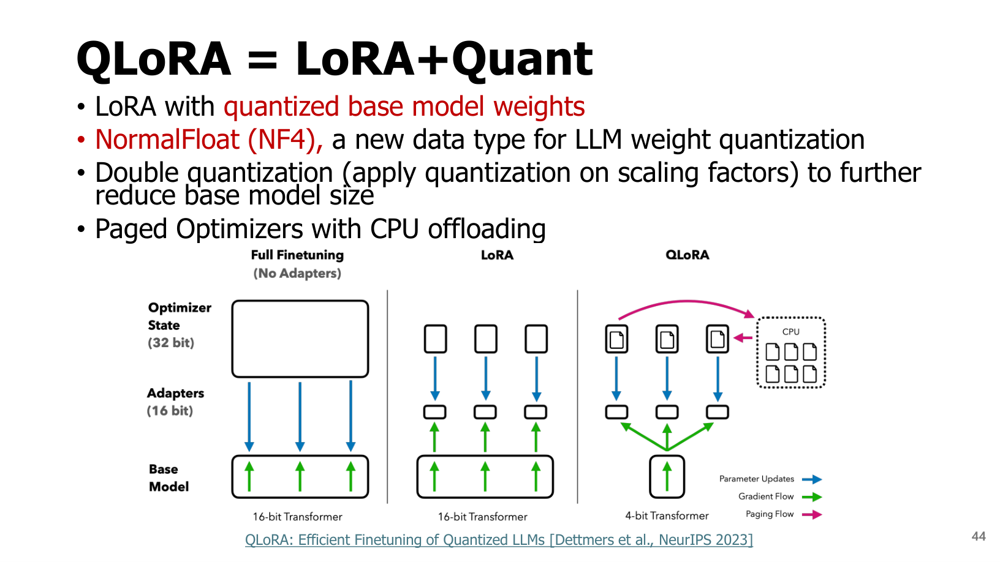

QLoRA는 quantized base model 위에 LoRA adapter를 학습한다.

핵심:

- base model weights는 NF4로 quantize
- LoRA adapter만 학습
- double quantization으로 scale constant도 quantize
- paged optimizer와 CPU offloading 사용

### NF4

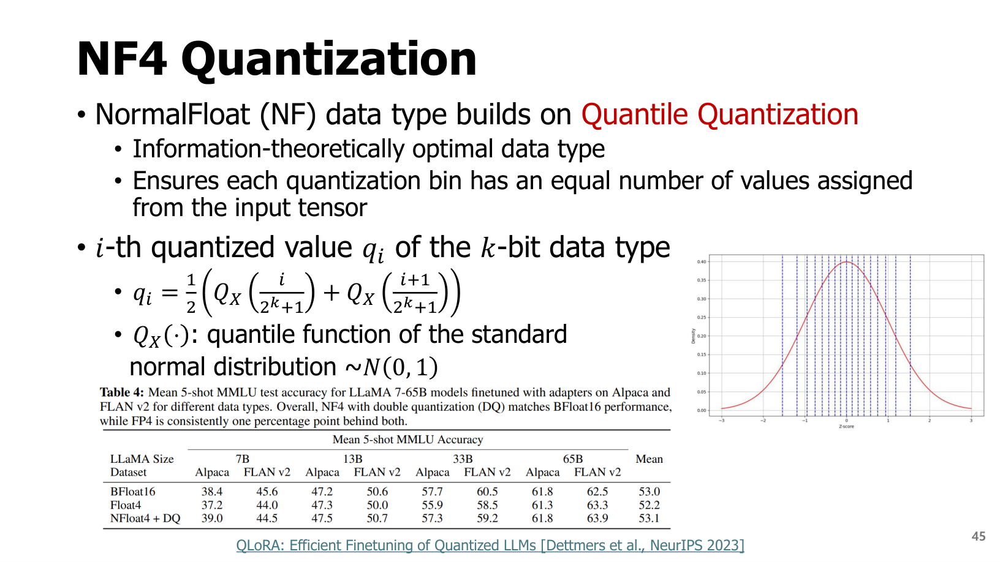

NF4, NormalFloat는 weight가 normal distribution을 따른다는 가정에서 quantile quantization을 사용한다.

각 bin에 비슷한 수의 값이 들어가도록 level을 정한다.

교안 수식:

$$
q_i=\frac{1}{2}\left(Q_X\left(\frac{i}{2^k+1}\right)+Q_X\left(\frac{i+1}{2^k+1}\right)\right)
$$

여기서 $Q_X$는 standard normal distribution의 quantile function이다.

### Double Quantization

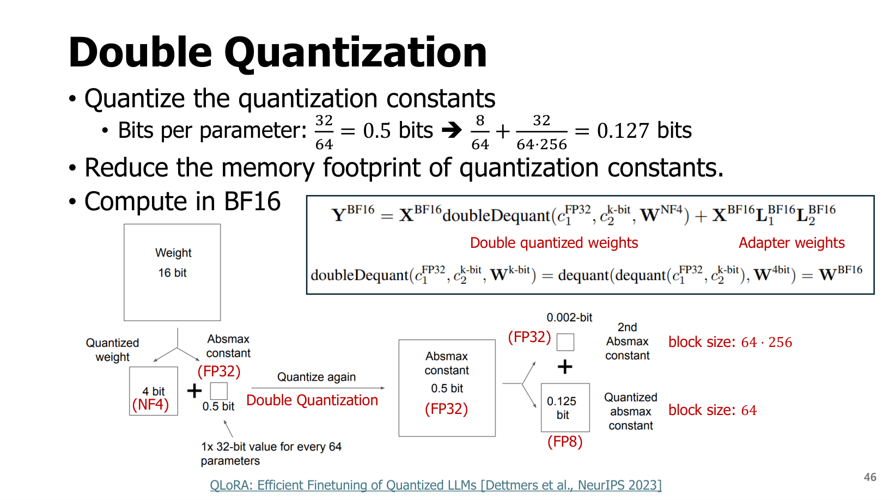

quantized weight를 저장할 때 scale 같은 quantization constant도 메모리를 차지한다. Double quantization은 이 constant까지 다시 quantize한다.

핵심:

```text
weights만 줄이는 것이 아니라 scale/metadata도 줄인다.
```

---

## 14. Chapter 2 최종 구조도

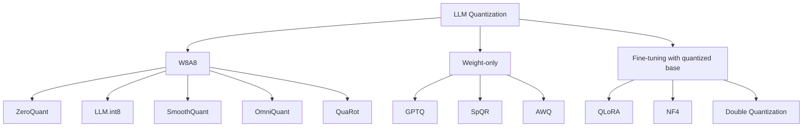
```mermaid
flowchart TD
    A[LLM Quantization] --> B[W8A8]
    B --> B1[ZeroQuant]
    B --> B2[LLM.int8]
    B --> B3[SmoothQuant]
    B --> B4[OmniQuant]
    B --> B5[QuaRot]

    A --> C[Weight-only]
    C --> C1[GPTQ]
    C --> C2[SpQR]
    C --> C3[AWQ]

    A --> D[Fine-tuning with quantized base]
    D --> D1[QLoRA]
    D --> D2[NF4]
    D --> D3[Double Quantization]
```

---

## 15. 시험 예상 질문

### Q1. LLM quantization이 CNN quantization보다 어려운 이유는?

LLM은 activation/weight outlier가 심하고, KV cache와 memory-bound decode 문제가 있으며, full retraining 비용이 매우 커서 PTQ 중심으로 해결해야 하기 때문이다.

### Q2. SmoothQuant의 핵심 수식은?

$$
Y=XW=X\operatorname{diag}(s)^{-1}\operatorname{diag}(s)W=\hat{X}\hat{W}
$$

activation outlier를 weight로 옮겨 activation quantization을 쉽게 한다.

### Q3. LLM.int8()는 outlier를 어떻게 처리하나?

normal activation은 INT8로 처리하고, outlier feature는 FP16 matrix multiplication으로 따로 처리한 뒤 결과를 합친다.

### Q4. Weight-only quantization이 single-query LLM inference에서 중요한 이유는?

decode가 memory-bound이므로 weight memory traffic을 줄이는 것만으로도 latency와 memory footprint를 크게 줄일 수 있다.

### Q5. GPTQ와 RTN의 차이는?

RTN은 단순 반올림이지만, GPTQ는 quantization error를 남은 weight에 보상하도록 Hessian 기반 update를 수행한다.

### Q6. AWQ에서 salient weights는 무엇으로 결정되는가?

weight magnitude만이 아니라 activation distribution에 의해 결정된다. activation이 큰 channel의 weight가 출력에 더 중요할 수 있다.

### Q7. QLoRA의 핵심 구성은?

NF4로 quantize한 base model, LoRA adapter 학습, double quantization, paged optimizer/CPU offloading이다.

---

## 16. 초압축 암기

```text
LLM quantization = outlier 처리 문제
W8A8 = weights and activations INT8
W4A16 = weight-only INT4, activation FP16
ZeroQuant = group-wise weight + token-wise activation + LKD
LLM.int8 = outlier FP16 분리
SmoothQuant = activation outlier를 weight로 migration
QuaRot = rotation으로 outlier 제거
GPTQ = Hessian 기반 weight-only PTQ
SpQR = outlier FP16 + group quant + sparse storage
AWQ = activation-aware salient channel scaling
QLoRA = NF4 quantized base + LoRA adapter
```
