# ODAI-2 Chapter 3. Efficient Inference 핵심 정리

범위: `On-Device AI 강의자료/ODAI-2.pdf` p.47~p.64  
이전 챕터: LLM Quantization

---

## 1. 이 챕터의 핵심 질문

LLM inference는 단순히 모델 weight를 줄이는 것만으로 충분하지 않다. decode는 sequential하고, attention은 긴 context에서 memory와 compute를 크게 요구한다.

핵심 질문:

```text
정확도를 유지하면서 LLM inference의 latency, memory, bandwidth를 어떻게 줄일 것인가?
```

주요 방향:

- sparse attention
- dynamic sparsity
- conditional computation
- speculative decoding
- KV cache compression
- operator fusion
- FlashAttention
- patch-based inference

---

## 2. Efficient Transformer 전체 그림

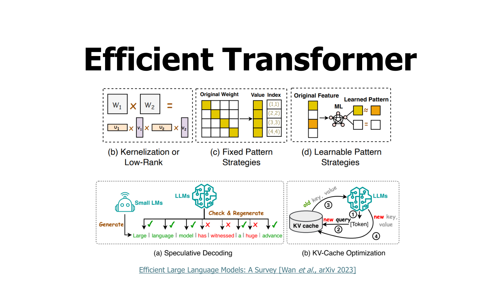

Transformer의 기본 attention은 sequence length $N$에 대해:

$$
\mathrm{Attention}(Q,K,V)=\mathrm{softmax}\left(\frac{QK^T}{\sqrt{d}}\right)V
$$

$QK^T$의 크기:

$$
N\times N
$$

따라서 attention compute/memory는 대략:

$$
O(N^2)
$$

long context에서 문제가 된다.

---

## 3. Fixed Sparse Attention

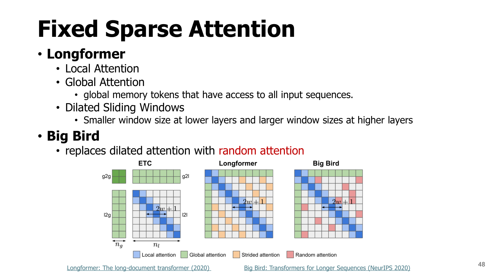

Longformer / Big Bird류 방법.

### Local Attention

각 token이 주변 window만 본다.

```text
token i attends to [i-w, ..., i+w]
```

복잡도:

$$
O(Nw)
$$

$w\ll N$이면 full attention $O(N^2)$보다 작다.

### Global Attention

일부 global token은 모든 token을 본다.

```text
CLS token, memory token 등
```

### Dilated Sliding Window

간격을 두고 sparse하게 본다.

### Big Bird random attention

random connection을 추가해 정보 흐름을 보완한다.

핵심:

```text
attention pattern을 미리 정해 quadratic cost를 줄인다.
```

---

## 4. Dynamic Sparsity: SpAtten

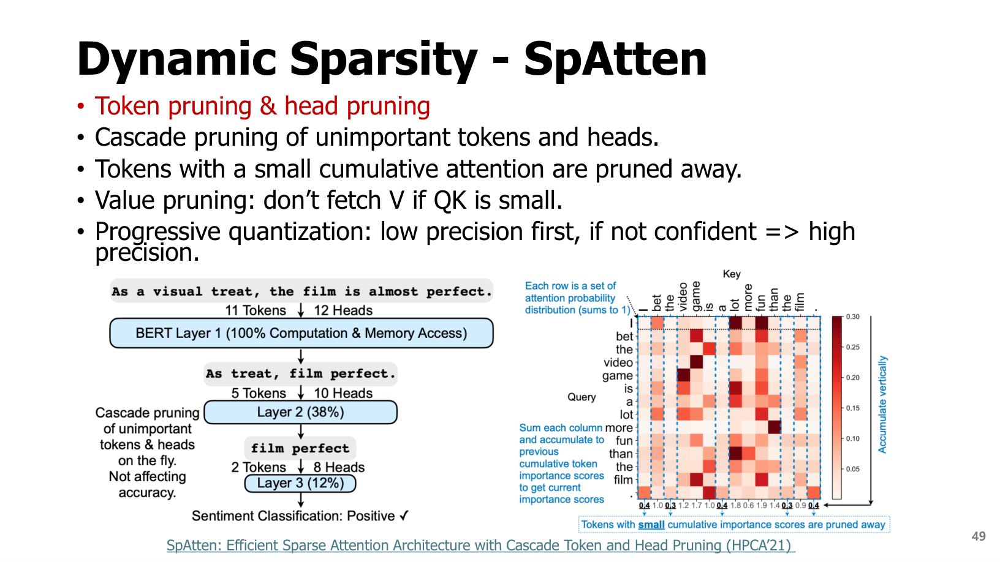

SpAtten은 runtime 중요도에 따라 token/head를 pruning한다.

핵심:

- Token pruning
- Head pruning
- Value pruning
- Progressive quantization

### Token pruning

attention score 누적값이 작은 token을 제거한다.

$$
I_j=\sum_{t}\mathrm{Attention}_{t,j}
$$

$I_j$가 작으면 token j는 다른 token들이 별로 참고하지 않는 token이다.

### Value pruning

$QK$ score가 작으면 해당 $V$를 fetch하지 않는다.

```text
attention score가 작다 → output에 기여가 작다 → V memory access skip 가능
```

---

## 5. Deja Vu: Contextual Sparsity Prediction

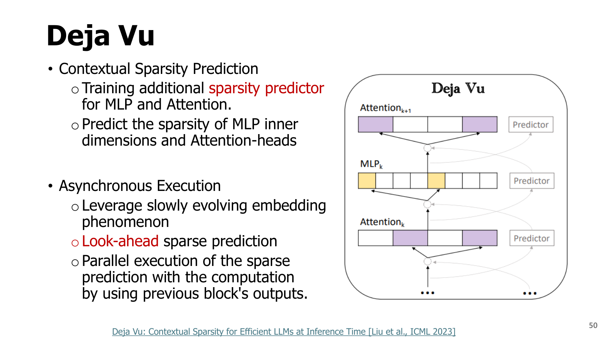

Deja Vu는 MLP inner dimension과 attention head sparsity를 예측한다.

핵심 term:

- **contextual sparsity prediction**
- **asynchronous execution**
- **look-ahead sparse prediction**
- **slowly evolving embedding phenomenon**

직관:

```text
이전 block output을 보면 다음 block에서 어떤 neuron/head가 필요할지 어느 정도 예측할 수 있다.
```

흐름:

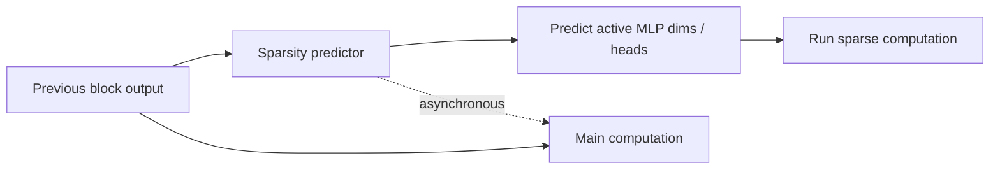

---

## 6. Conditional Computation / MoE

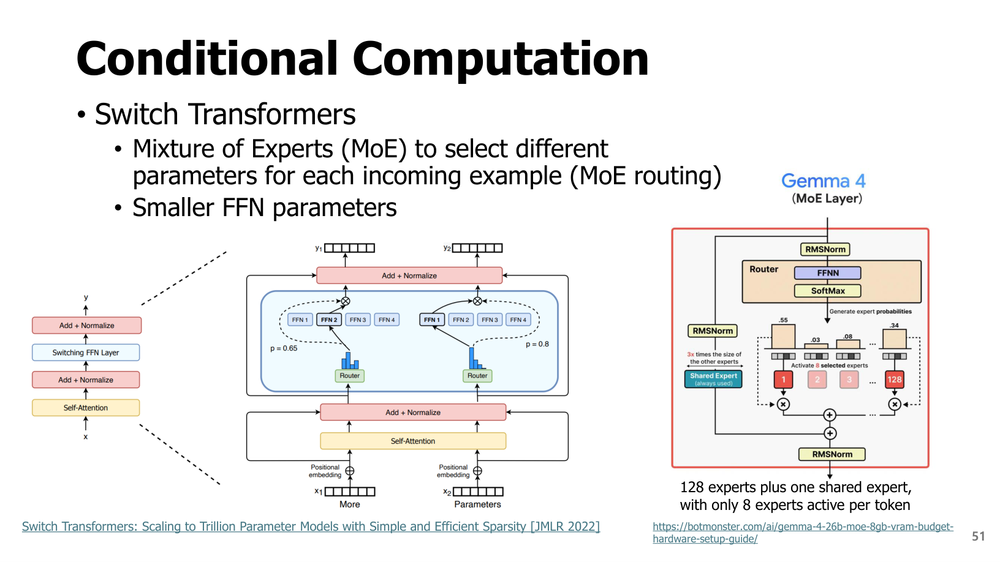

Mixture of Experts, MoE는 token마다 일부 expert만 활성화한다.

전체 expert가 $E$개이고 token당 $k$개만 사용하면 compute는 줄지만 parameter capacity는 크게 유지할 수 있다.

$$
y=\sum_{e\in TopK(g(x))}p_e f_e(x)
$$

각 term:

| Term | 의미 |
|---|---|
| $g(x)$ | router/gating network |
| $f_e$ | e번째 expert |
| $p_e$ | router probability |
| $TopK$ | 선택된 expert subset |

핵심:

```text
모든 parameter를 매 token마다 쓰지 않고, 필요한 expert만 쓴다.
```

---

## 7. Speculative Decoding

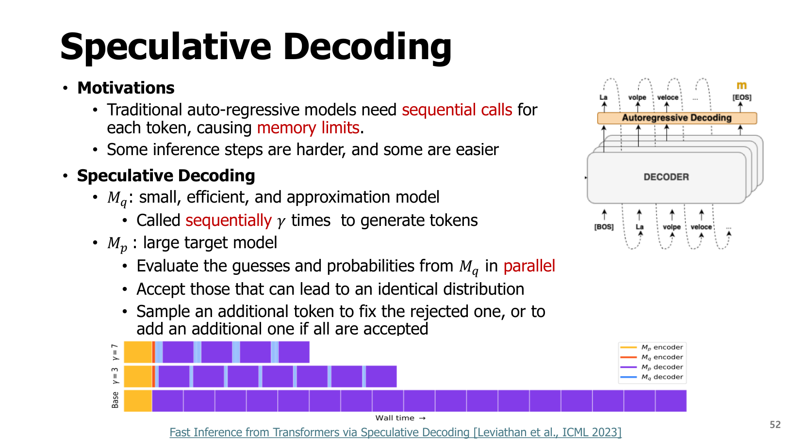

Autoregressive decoding은 token을 하나씩 생성하므로 느리다. Speculative decoding은 작은 draft model이 여러 token을 먼저 제안하고, 큰 target model이 병렬로 검증한다.

교안 term:

- $M_q$: small efficient approximation model, draft model
- $M_p$: large target model
- $\gamma$: draft가 한 번에 제안하는 token 수

흐름:

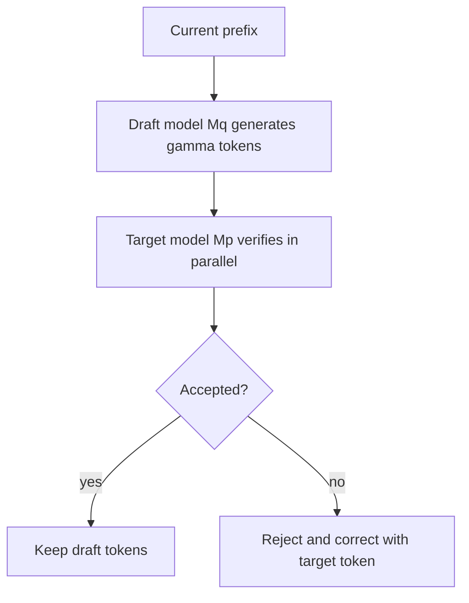

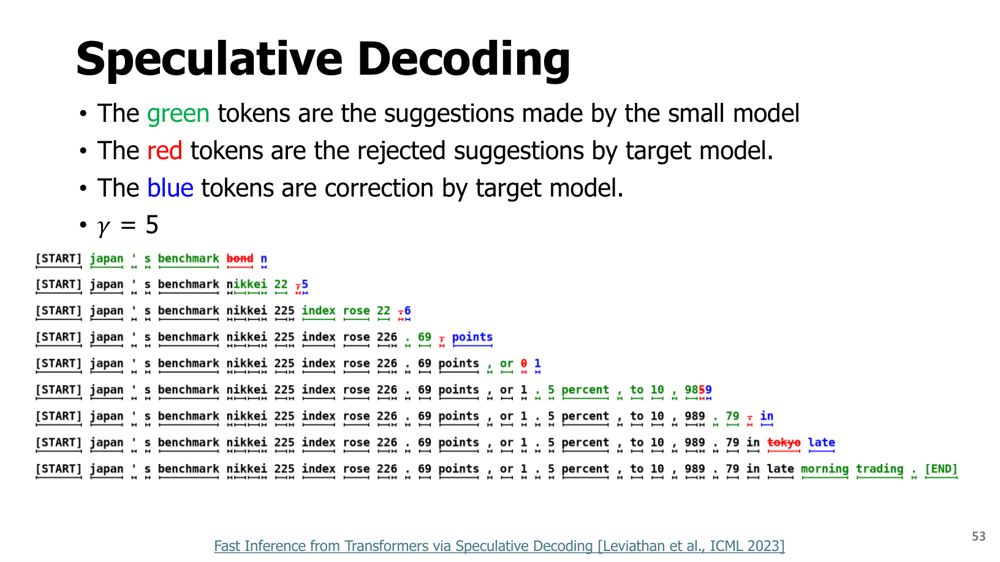

색상 해석:

- green: small model suggestions
- red: rejected suggestions
- blue: correction by target model

p.54에 따르면 조건이 맞으면 최대 3.4x speedup 가능.

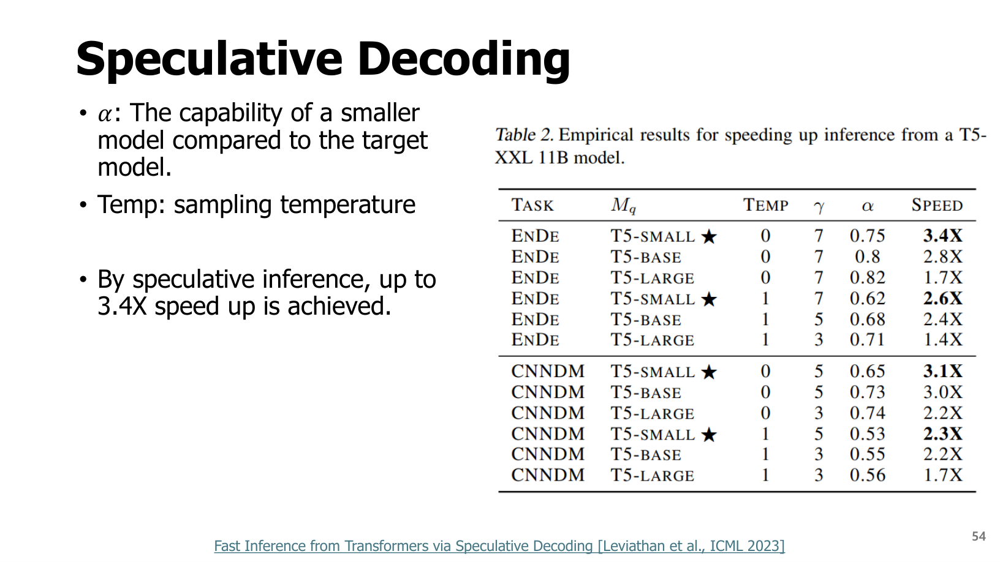

핵심:

```text
분포를 바꾸지 않으면서 target model 호출을 병렬화/절약한다.
```

---

## 8. KV Cache Compression: H2O

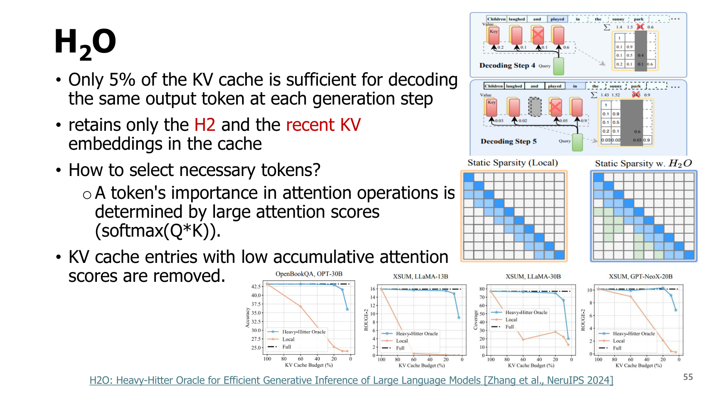

LLM decode에서 KV cache는 context length에 따라 커진다.

H2O의 관찰:

```text
Only 5% of the KV cache is sufficient for decoding the same output token.
```

H2O는 다음을 유지한다.

- heavy hitter tokens, H2
- recent tokens

token importance는 attention score로 판단한다.

$$
I_j=\sum_t\mathrm{softmax}(Q_tK_j)_j
$$

낮은 cumulative attention score를 가진 KV entry는 제거한다.

---

## 9. SnapKV / Quest

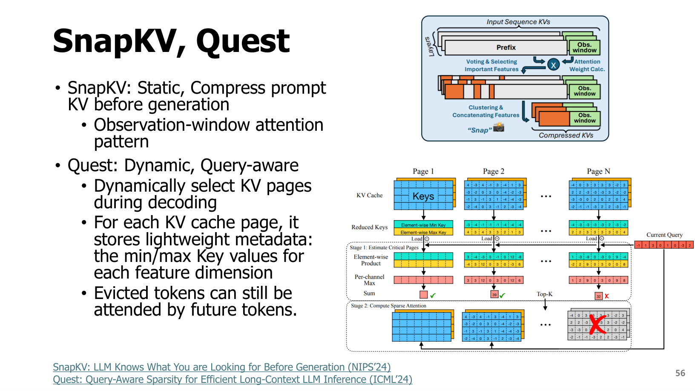

### SnapKV

static 방식. Generation 전에 prompt KV를 압축한다.

```text
Compress prompt KV before generation
```

### Quest

dynamic, query-aware 방식.

- decoding 중 query에 맞춰 KV page 선택
- 각 KV page에 lightweight metadata 저장
- feature dimension별 min/max Key values 사용
- evicted token도 future token이 attend할 수 있음

핵심:

```text
long-context decode에서 모든 KV를 매번 읽지 않고, 필요한 KV page만 선택한다.
```

---

## 10. Operator Fusion

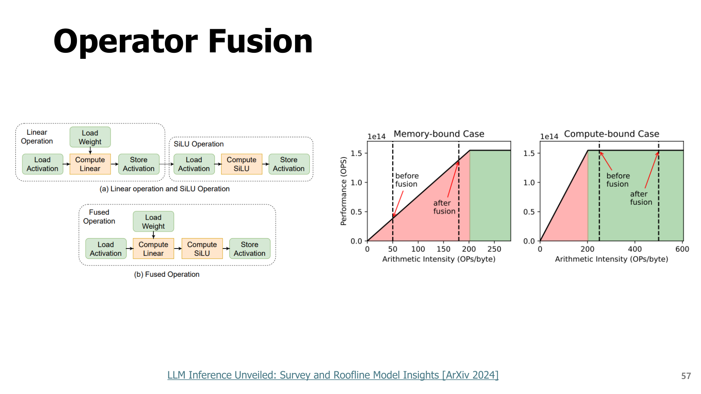

Operator fusion은 여러 kernel을 하나로 합쳐 memory read/write를 줄이는 기법이다.

예:

```text
Linear → Bias → GELU
```

각각 따로 실행하면 intermediate activation을 global memory에 쓰고 다시 읽어야 한다.

fusion하면:

```text
register/shared memory 안에서 연속 처리
```

장점:

- kernel launch overhead 감소
- global memory traffic 감소
- latency 감소

---

## 11. FlashAttention

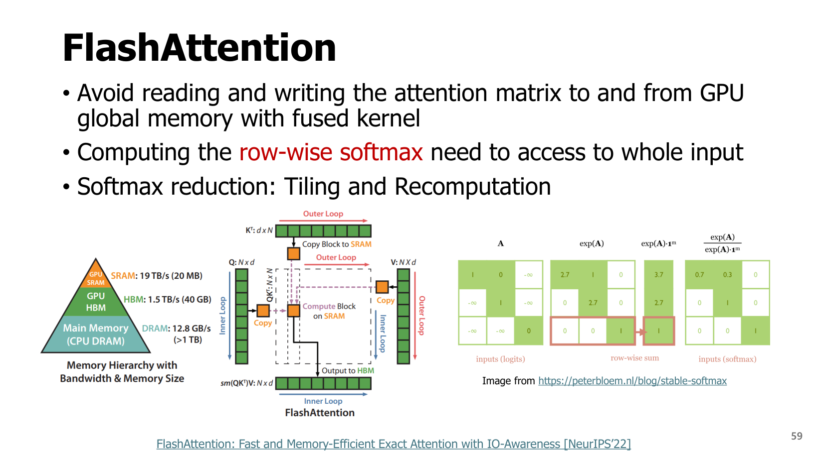

Standard attention은 attention matrix $N\times N$을 만들고 global memory에 저장/읽는다.

FlashAttention은 attention matrix를 전체 저장하지 않고 tile 단위로 계산한다.

핵심:

```text
Avoid reading and writing the attention matrix to and from GPU global memory.
```

### 11.1 Stable softmax

softmax는 overflow 방지를 위해 max를 뺀다.

$$
\mathrm{softmax}(x_i)=\frac{e^{x_i-m}}{\sum_j e^{x_j-m}},\quad m=\max_j x_j
$$

FlashAttention은 tile별 partial max와 partial sum을 유지하면서 전체 softmax를 정확히 계산한다.

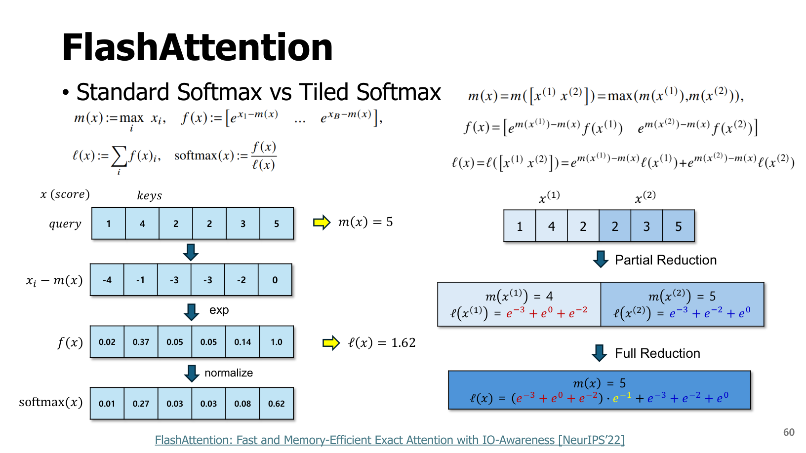

핵심:

```text
recomputation을 조금 하더라도 HBM global memory I/O를 크게 줄여 실제 속도를 높인다.
```

---

## 12. Patch-based Inference

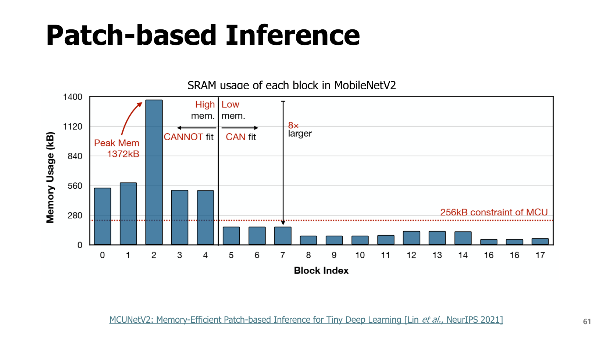

MCUNetV2의 tiny deep learning inference 방법.

문제:

```text
feature map 전체를 한 번에 저장하면 SRAM peak memory가 커진다.
```

Patch-based inference는 입력/feature map을 patch로 나눠 처리한다.

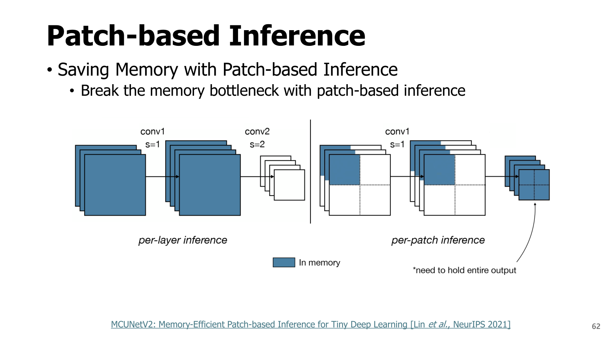

장점:

```text
한 번에 필요한 activation memory를 줄인다.
```

p.64의 문제:

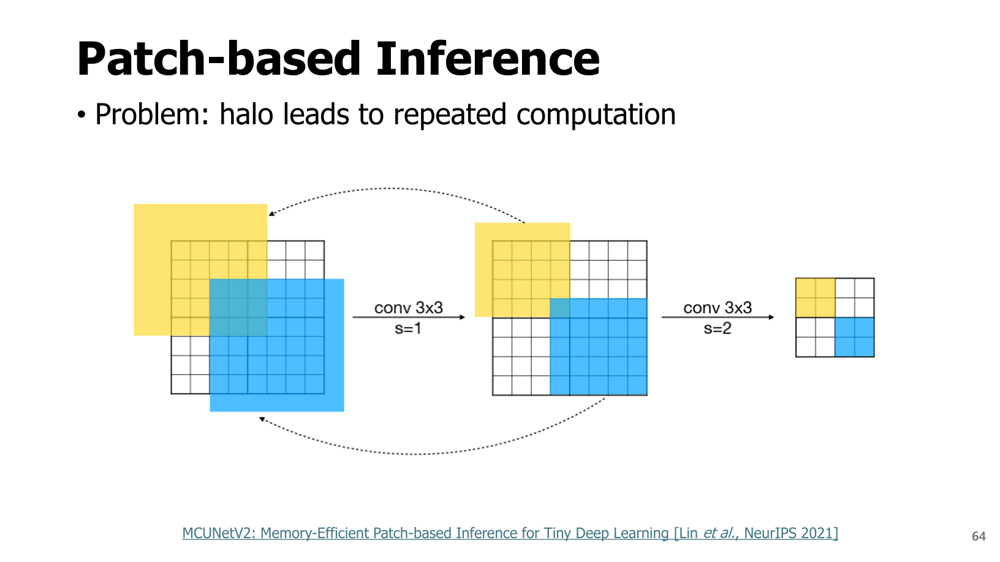

Convolution은 주변 pixel을 보므로 patch 경계에 halo가 필요하다. patch별로 halo를 중복 계산하면 repeated computation이 생긴다.

---

## 13. Chapter 3 최종 구조도

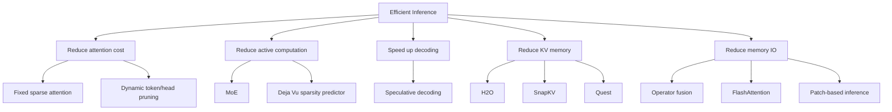

---

## 14. 시험 예상 질문

### Q1. Fixed sparse attention은 왜 필요한가?

Full attention은 $O(N^2)$ 비용이 들기 때문에 긴 sequence에서 비싸다. fixed sparse attention은 local/global/random pattern으로 attention 연결을 제한해 비용을 줄인다.

### Q2. SpAtten은 무엇을 pruning하나?

중요하지 않은 token과 attention head를 pruning하고, QK score가 작으면 V fetch를 생략한다.

### Q3. Speculative decoding의 핵심은?

작은 draft model이 여러 token을 먼저 생성하고, 큰 target model이 병렬로 검증해 accepted token을 한 번에 진행한다.

### Q4. H2O는 KV cache를 어떻게 줄이나?

attention score가 큰 heavy hitter token과 recent token을 유지하고, 누적 attention이 낮은 KV entry를 제거한다.

### Q5. FlashAttention이 빠른 이유는?

attention matrix를 global memory에 저장하지 않고 tiled computation과 recomputation을 이용해 memory I/O를 줄이기 때문이다.

### Q6. Patch-based inference의 장단점은?

activation peak memory를 줄일 수 있지만, convolution halo 때문에 patch 경계에서 중복 계산이 생길 수 있다.

---

## 15. 초압축 암기

```text
Efficient inference = compute/memory/bandwidth/latency 최적화
Full attention = O(N^2)
Longformer/BigBird = fixed sparse attention
SpAtten = token/head/value pruning
Deja Vu = sparsity predictor로 active dims/head 예측
MoE = token마다 일부 expert만 사용
Speculative decoding = small draft + large verifier
H2O = heavy hitter + recent KV 유지
SnapKV = prompt KV static compression
Quest = query-aware dynamic KV page selection
Operator fusion = intermediate memory traffic 감소
FlashAttention = attention matrix 저장 없이 tiled exact attention
Patch-based inference = activation memory 줄이지만 halo 중복 계산
```
