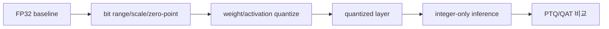

# On-Device AI Practice 02 — Quantization for CNN 셀별 코드 학습 가이드

> 오른쪽에는 원본 노트북 HTML을 띄우고, 왼쪽은 **모든 셀을 따라가는 해설 지도**로 쓴다. 이 문서는 원본 코드를 대체하지 않고, 각 셀이 왜 필요한지/무슨 shape로 움직이는지/직접 구현할 때 어디를 봐야 하는지 설명한다.

- 기준 교안: `ODAI-1 Chapter 3 Quantization`
- 원본 노트북: `On-Device AI 강의자료/실습/2. Quantization for CNN.ipynb`
- 학습 목표: VGG/CIFAR-10에서 uniform quantization, integer-only inference, k-means/non-uniform quantization, PTQ/QAT 흐름을 구현 관점으로 익힌다.

## 0. 그림으로 먼저 잡기



### 실습 전체에서 계속 붙잡을 수식

$q=\mathrm{clip}(\mathrm{round}(x/s)+z,q_{min},q_{max}),\quad \hat{x}=s(q-z)$

### 핵심 shape 표

| 대상 | Shape / 표현 | 의미 |
|---|---|---|
| FP32 weight | `float32 tensor` | 학습된 연속값 파라미터 |
| quantized weight | `int8/int4 tensor + scale/zero_point` | 저비트 정수 표현 |
| activation | `[B, C, H, W]` | calibration/observer가 range를 추정하는 대상 |
| accumulator | `int32` | 정수 GEMM/Conv의 누산 타입 |

## 1. 노트북 전체 지도

| 구간 | 셀 범위 | 오른쪽에서 보이는 제목 | 여기서 잡아야 할 것 |
|---:|---:|---|---|
| 1 | 001-001 | Assignment 2. Quantization for CNN | 양자화 |
| 2 | 002-002 | Goals | 양자화 |
| 3 | 003-003 | Contents | 양자화, QAT, PTQ, Linear layer |
| 4 | 004-018 | Setup | 재현성, CIFAR-10 데이터, DataLoader, VGG 모델 |
| 5 | 019-021 | 2.1. Linear Quantization | DataLoader, 평가 루프, 모델 크기, 양자화 |
| 6 | 022-023 | *n*-bit integer | 양자화 |
| 7 | 024-029 | [실습 1] Linear quantization 구현 | 양자화, scale, zero-point, KL divergence |
| 8 | 030-031 | Scale | 양자화, scale, Linear layer |
| 9 | 032-032 | zero point | zero-point |
| 10 | 033-036 | [실습 2] Scale 및 zero point 계산 | 양자화, scale, zero-point, Linear layer |
| 11 | 037-040 | 특수 케이스 : 가중치 텐서의 Linear quantization | 모델 크기, 양자화, scale, zero-point |
| 12 | 041-042 | Per-tensor Linear Quantization | channel-level, 양자화, scale, zero-point |
| 13 | 043-047 | Per-channel Linear Quantization | 모델 크기, kernel-level, channel-level, 양자화 |
| 14 | 048-051 | Quantized Inference | channel-level, 양자화, scale, zero-point |
| 15 | 052-054 | Quantized Fully-Connected Layer | 양자화, zero-point, Linear layer |
| 16 | 055-059 | [실습 3] Quantized FC layer 구현 | channel-level, 양자화, scale, zero-point |
| 17 | 060-062 | Quantized Convolution Layer | 양자화, zero-point |
| 18 | 063-064 | [실습 3] Quantized convolution layer 구현 | channel-level, 양자화, scale, zero-point |
| 19 | 065-069 | Quantized inference 수행 | DataLoader, 평가 루프, 모델 크기, 양자화 |
| 20 | 070-075 | 아래 두 함수는 단순한 래퍼입니다. | DataLoader, 평가 루프, 모델 크기, kernel-level |
| 21 | 076-083 | 2.2. Non-uniform Quantization | DataLoader, VGG 모델, 평가 루프, 프루닝 |
| 22 | 084-090 | [실습 4] K-means quantization 구현 | fine-grained, 양자화, k-means/non-uniform, KL divergence |
| 23 | 091-094 | 전체 모델에 대한 K-means quantization | DataLoader, 평가 루프, 모델 크기, 양자화 |
| 24 | 095-095 | Quantization-aware training(QAT) | 프루닝, 양자화, QAT |
| 25 | 096-099 | [실습 5] Quantization Aware Training 구현 | CIFAR-10 데이터, DataLoader, VGG 모델, 평가 루프 |
| 26 | 100-103 | 2.3. Quantization with PyTorch API | CIFAR-10 데이터, 평가 루프, kernel-level, 양자화 |
| 27 | 104-104 | Post-Training Quantization | channel-level, 양자화, observer/calibration, PyTorch quant config |
| 28 | 105-106 | Configuration | 양자화, observer/calibration, PyTorch quant config, activation |
| 29 | 107-107 | QScheme (`torch.qscheme`): a enum that specifies the way we quantize the Tensor | fine-grained, channel-level, 양자화, PyTorch quant config |
| 30 | 108-110 | Prepare | channel-level, 양자화, observer/calibration, PyTorch quant config |
| 31 | 111-113 | Calibration | 양자화, observer/calibration, calibration |
| 32 | 114-116 | Convert | 평가 루프, 양자화, scale, zero-point |
| 33 | 117-117 | Quantization-Aware Training | channel-level, 양자화, zero-point, PyTorch quant config |
| 34 | 118-119 | Configuration | 양자화, observer/calibration, PyTorch quant config, QAT |
| 35 | 120-122 | Prepare | 양자화, scale, zero-point, PyTorch quant config |
| 36 | 123-124 | Training | fine-grained, 양자화, scale, zero-point |
| 37 | 125-128 | Convert | 평가 루프, 양자화, scale, zero-point |

## 2. 셀별 Walkthrough

아래 번호는 오른쪽 노트북의 cell 순서와 맞춘 것이다. Markdown 셀도 건너뛰지 않는다. Markdown 셀은 바로 다음 코드가 어떤 문제를 푸는지 정의하는 경우가 많기 때문이다.

### Cell 001 · Markdown · Assignment 2. Quantization for CNN

- **현재 구간**: Assignment 2. Quantization for CNN
- **오른쪽에서 읽을 내용**: # Assignment 2. Quantization for CNN
- **무슨 작업인가**:
  - 이 셀은 뒤 코드가 왜 필요한지 알려주는 설명/문제 정의 셀이다. 오른쪽 노트북의 문장을 그냥 넘기지 말고, 바로 아래 코드 셀에서 어떤 변수·함수·측정값으로 구현되는지 연결해서 본다.
  - quantization은 실수 범위를 정수 grid로 근사한다. `scale`은 grid 간격, `zero_point`는 실수 0이 대응되는 정수 위치다.
- **수학/shape 관점**:
  - quantization에서는 실수 tensor 자체보다 `(integer tensor, scale, zero_point/group_size)` 묶음이 실제 표현이다.
- **직접 구현할 때 체크**:
  - 이 셀 실행 후 새로 생긴 변수 1~2개를 다음 셀이 어떻게 사용하는지 추적한다.

### Cell 002 · Markdown · Goals

- **현재 구간**: Goals
- **오른쪽에서 읽을 내용**: ## Goals 본 실습에서는 CNN(Convolutional Neural Network)을 **양자화(Quantization)**하여 모델의 크기와 실행 시간을 줄이는 방법을 실습합니다.
- **무슨 작업인가**:
  - 이 셀은 뒤 코드가 왜 필요한지 알려주는 설명/문제 정의 셀이다. 오른쪽 노트북의 문장을 그냥 넘기지 말고, 바로 아래 코드 셀에서 어떤 변수·함수·측정값으로 구현되는지 연결해서 본다.
  - quantization은 실수 범위를 정수 grid로 근사한다. `scale`은 grid 간격, `zero_point`는 실수 0이 대응되는 정수 위치다.
- **수학/shape 관점**:
  - CNN 쪽 tensor는 이미지 `[B,3,32,32]`, feature map `[B,C,H,W]`, conv weight `[C_out,C_in,K_h,K_w]`로 읽는다.
  - quantization에서는 실수 tensor 자체보다 `(integer tensor, scale, zero_point/group_size)` 묶음이 실제 표현이다.
- **직접 구현할 때 체크**:
  - 이 셀 실행 후 새로 생긴 변수 1~2개를 다음 셀이 어떻게 사용하는지 추적한다.

### Cell 003 · Markdown · Contents

- **현재 구간**: Contents
- **오른쪽에서 읽을 내용**: ## Contents 1. **Uniform Quantization** - **Linear quantization**을 구현하고 적용합니다. - **Linear quantization**을 위한 **Integer-only inference**를 구현하고 적용합니다. 2. **Non-uniform Quantization** - **K-means quantization**을 구현하고 적용합니다. 3. **Quantization with PyTorch API** - **Post-Training Quantization** (PTQ) - **Quantization-Aware Training** (QAT)
- **무슨 작업인가**:
  - 이 셀은 뒤 코드가 왜 필요한지 알려주는 설명/문제 정의 셀이다. 오른쪽 노트북의 문장을 그냥 넘기지 말고, 바로 아래 코드 셀에서 어떤 변수·함수·측정값으로 구현되는지 연결해서 본다.
  - 학습/미세조정 루프다. forward → loss → backward → optimizer step 순서이며, pruning이면 step 이후 mask 유지, KD면 여러 loss 항의 비율을 확인한다.
  - quantization은 실수 범위를 정수 grid로 근사한다. `scale`은 grid 간격, `zero_point`는 실수 0이 대응되는 정수 위치다.
- **수학/shape 관점**:
  - Linear layer는 보통 `Y=XW^T+b`로 동작한다. LLM에서 `X`는 `[B,T,d_in]`, `W`는 `[d_out,d_in]`로 보면 된다.
  - quantization에서는 실수 tensor 자체보다 `(integer tensor, scale, zero_point/group_size)` 묶음이 실제 표현이다.
- **직접 구현할 때 체크**:
  - 이 셀 실행 후 새로 생긴 변수 1~2개를 다음 셀이 어떻게 사용하는지 추적한다.

### Cell 004 · Markdown · Setup

- **현재 구간**: Setup
- **오른쪽에서 읽을 내용**: ## Setup 먼저, 필요한 패키지를 설치하고 데이터셋과 사전 학습된 모델을 다운로드합니다. 여기서는 CIFAR10 데이터셋과 VGG 네트워크를 사용할 것입니다.
- **무슨 작업인가**:
  - 이 셀은 뒤 코드가 왜 필요한지 알려주는 설명/문제 정의 셀이다. 오른쪽 노트북의 문장을 그냥 넘기지 말고, 바로 아래 코드 셀에서 어떤 변수·함수·측정값으로 구현되는지 연결해서 본다.
  - 데이터셋을 mini-batch 단위로 모델에 공급한다. CNN은 이미지 batch `[B,3,32,32]`, LLM은 token sequence `[B,T]`로 들어간다는 점을 구분한다.
- **수학/shape 관점**:
  - CNN 쪽 tensor는 이미지 `[B,3,32,32]`, feature map `[B,C,H,W]`, conv weight `[C_out,C_in,K_h,K_w]`로 읽는다.
- **직접 구현할 때 체크**:
  - 이 셀 실행 후 새로 생긴 변수 1~2개를 다음 셀이 어떻게 사용하는지 추적한다.

### Cell 005 · Code · print('Installing torchprofile...') / print('Installing fast-pytorch-kmeans...') / print('All required packages have been successfully installed!')

- **현재 구간**: Setup
- **오른쪽에서 볼 코드**: `print('Installing torchprofile...') / print('Installing fast-pytorch-kmeans...') / print('All required packages have been successfully installed!')`
- **무슨 작업인가**:
  - 이 셀은 설명을 실제 PyTorch/Python 연산으로 바꾸는 실행 단위다. 실행 전후로 생성되는 변수, tensor shape, 모델 상태 변경 여부를 확인한다.
  - k-means/non-uniform quantization은 균일 간격 대신 centroid codebook으로 값을 대표한다. 분포가 0 근처에 몰린 weight에서 오차를 줄일 수 있지만 하드웨어 구현은 더 복잡하다.
- **수학/shape 관점**:
  - $q=\mathrm{clip}(\mathrm{round}(x/s)+z,q_{min},q_{max}),\quad \hat{x}=s(q-z)$
- **직접 구현할 때 체크**:
  - 이 셀 실행 후 새로 생긴 변수 1~2개를 다음 셀이 어떻게 사용하는지 추적한다.
- **키워드**: k-means/non-uniform

### Cell 006 · Code · import copy import math import random from collections import OrderedDict, defaultdict from matplotlib import pyplot as plt from matplotlib.colors import ListedColormap import numpy as np from tqdm.auto import tqdm impor…

- **현재 구간**: Setup
- **오른쪽에서 볼 코드**: `import copy import math import random from collections import OrderedDict, defaultdict from matplotlib import pyplot as plt from matplotlib.colors import ListedColormap import numpy as np from tqdm.auto import tqdm impor…`
- **무슨 작업인가**:
  - 이 셀은 설명을 실제 PyTorch/Python 연산으로 바꾸는 실행 단위다. 실행 전후로 생성되는 변수, tensor shape, 모델 상태 변경 여부를 확인한다.
  - 데이터셋을 mini-batch 단위로 모델에 공급한다. CNN은 이미지 batch `[B,3,32,32]`, LLM은 token sequence `[B,T]`로 들어간다는 점을 구분한다.
  - 학습/미세조정 루프다. forward → loss → backward → optimizer step 순서이며, pruning이면 step 이후 mask 유지, KD면 여러 loss 항의 비율을 확인한다.
- **수학/shape 관점**:
  - Linear layer는 보통 `Y=XW^T+b`로 동작한다. LLM에서 `X`는 `[B,T,d_in]`, `W`는 `[d_out,d_in]`로 보면 된다.
- **직접 구현할 때 체크**:
  - 이 셀 실행 후 새로 생긴 변수 1~2개를 다음 셀이 어떻게 사용하는지 추적한다.
- **키워드**: DataLoader, 스케줄링, OPT

### Cell 007 · Code · random.seed(0) np.random.seed(0) torch.manual_seed(0)

- **현재 구간**: Setup
- **오른쪽에서 볼 코드**: `random.seed(0) np.random.seed(0) torch.manual_seed(0)`
- **무슨 작업인가**:
  - 이 셀은 설명을 실제 PyTorch/Python 연산으로 바꾸는 실행 단위다. 실행 전후로 생성되는 변수, tensor shape, 모델 상태 변경 여부를 확인한다.
  - 난수 seed를 고정한다. pruning threshold, data augmentation, optimizer 순서가 바뀌면 비교가 흔들리므로 baseline과 실험 조건을 고정하는 역할이다.
- **수학/shape 관점**:
  - $q=\mathrm{clip}(\mathrm{round}(x/s)+z,q_{min},q_{max}),\quad \hat{x}=s(q-z)$
- **직접 구현할 때 체크**:
  - 이 셀 실행 후 새로 생긴 변수 1~2개를 다음 셀이 어떻게 사용하는지 추적한다.
- **키워드**: 재현성

### Cell 008 · Code · class VGG(nn.Module): / ARCH = [64, 128, 'M', 256, 256, 'M', 512, 512, 'M', 512, 512, 'M'] / def __init__(self) -> None:

- **현재 구간**: Setup
- **오른쪽에서 볼 코드**: `class VGG(nn.Module): / ARCH = [64, 128, 'M', 256, 256, 'M', 512, 512, 'M', 512, 512, 'M'] / def __init__(self) -> None:`
- **정의되는 class**: `VGG`
- **무슨 작업인가**:
  - 이 셀은 설명을 실제 PyTorch/Python 연산으로 바꾸는 실행 단위다. 실행 전후로 생성되는 변수, tensor shape, 모델 상태 변경 여부를 확인한다.
  - structured pruning 단위가 커질수록 실제 tensor 차원을 줄이거나 0-vector를 건너뛰기 쉬워진다. 대신 한 번에 제거되는 정보량이 커져 정확도 손실 위험이 커진다.
- **수학/shape 관점**:
  - CNN 쪽 tensor는 이미지 `[B,3,32,32]`, feature map `[B,C,H,W]`, conv weight `[C_out,C_in,K_h,K_w]`로 읽는다.
  - Linear layer는 보통 `Y=XW^T+b`로 동작한다. LLM에서 `X`는 `[B,T,d_in]`, `W`는 `[d_out,d_in]`로 보면 된다.
- **직접 구현할 때 체크**:
  - reshape/transpose 후 어떤 축이 channel/group/kernel 축인지 반드시 주석으로 적어보는 것이 좋다.
- **키워드**: VGG 모델, channel-level, Linear layer

### Cell 009 · Code · CIFAR-10 데이터셋 로드 및 전처리

- **현재 구간**: Setup
- **오른쪽에서 볼 코드**: `transform = transforms.Compose( / trainset = torchvision.datasets.CIFAR10( / root="D:\\data", train=True, download=True, transform=transform`
- **정의되는 함수**: `train_model, evaluate_model`
- **무슨 작업인가**:
  - 이 셀은 설명을 실제 PyTorch/Python 연산으로 바꾸는 실행 단위다. 실행 전후로 생성되는 변수, tensor shape, 모델 상태 변경 여부를 확인한다.
  - 데이터셋을 mini-batch 단위로 모델에 공급한다. CNN은 이미지 batch `[B,3,32,32]`, LLM은 token sequence `[B,T]`로 들어간다는 점을 구분한다.
  - 모델 품질을 숫자로 고정하는 평가 루프다. CNN은 accuracy, LLM은 PPL을 주로 본다. 압축 실험에서는 압축률만큼이나 이 기준값의 변화량이 중요하다.
  - 학습/미세조정 루프다. forward → loss → backward → optimizer step 순서이며, pruning이면 step 이후 mask 유지, KD면 여러 loss 항의 비율을 확인한다.
  - quantization은 실수 범위를 정수 grid로 근사한다. `scale`은 grid 간격, `zero_point`는 실수 0이 대응되는 정수 위치다.
- **수학/shape 관점**:
  - CNN 쪽 tensor는 이미지 `[B,3,32,32]`, feature map `[B,C,H,W]`, conv weight `[C_out,C_in,K_h,K_w]`로 읽는다.
  - Linear layer는 보통 `Y=XW^T+b`로 동작한다. LLM에서 `X`는 `[B,T,d_in]`, `W`는 `[d_out,d_in]`로 보면 된다.
  - quantization에서는 실수 tensor 자체보다 `(integer tensor, scale, zero_point/group_size)` 묶음이 실제 표현이다.
- **직접 구현할 때 체크**:
  - 입력 tensor와 model parameter가 같은 device에 있는지 확인한다. CPU/GPU mismatch는 이 실습에서 흔한 오류다.
  - 평가/압축 적용 단계에서는 gradient를 끄는 이유를 확인한다. 메모리 절약과 accidental gradient 방지를 위한 장치다.
- **키워드**: CIFAR-10 데이터, DataLoader, 평가 루프, 학습 루프, 모델 크기, zero-point

### Cell 010 · Code · @torch.inference_mode() / def evaluate( / extra_preprocess = None

- **현재 구간**: Setup
- **오른쪽에서 볼 코드**: `@torch.inference_mode() / def evaluate( / extra_preprocess = None`
- **정의되는 함수**: `evaluate`
- **무슨 작업인가**:
  - 이 셀은 설명을 실제 PyTorch/Python 연산으로 바꾸는 실행 단위다. 실행 전후로 생성되는 변수, tensor shape, 모델 상태 변경 여부를 확인한다.
  - 데이터셋을 mini-batch 단위로 모델에 공급한다. CNN은 이미지 batch `[B,3,32,32]`, LLM은 token sequence `[B,T]`로 들어간다는 점을 구분한다.
  - 모델 품질을 숫자로 고정하는 평가 루프다. CNN은 accuracy, LLM은 PPL을 주로 본다. 압축 실험에서는 압축률만큼이나 이 기준값의 변화량이 중요하다.
- **수학/shape 관점**:
  - CNN 쪽 tensor는 이미지 `[B,3,32,32]`, feature map `[B,C,H,W]`, conv weight `[C_out,C_in,K_h,K_w]`로 읽는다.
- **직접 구현할 때 체크**:
  - 입력 tensor와 model parameter가 같은 device에 있는지 확인한다. CPU/GPU mismatch는 이 실습에서 흔한 오류다.
  - 평가/압축 적용 단계에서는 gradient를 끄는 이유를 확인한다. 메모리 절약과 accidental gradient 방지를 위한 장치다.
- **키워드**: DataLoader, 평가 루프

### Cell 011 · Markdown · Helpler Functions (Flops, Model Size calculation, etc.)

- **현재 구간**: Setup
- **오른쪽에서 읽을 내용**: Helpler Functions (Flops, Model Size calculation, etc.)
- **무슨 작업인가**:
  - 이 셀은 뒤 코드가 왜 필요한지 알려주는 설명/문제 정의 셀이다. 오른쪽 노트북의 문장을 그냥 넘기지 말고, 바로 아래 코드 셀에서 어떤 변수·함수·측정값으로 구현되는지 연결해서 본다.
  - 주변 셀과 이어지는 보조 단계다. 새로 생기는 변수 이름과 다음 셀에서 소비되는 값을 연결해서 보면 흐름이 끊기지 않는다.
- **수학/shape 관점**:
  - $q=\mathrm{clip}(\mathrm{round}(x/s)+z,q_{min},q_{max}),\quad \hat{x}=s(q-z)$
- **직접 구현할 때 체크**:
  - 이 셀 실행 후 새로 생긴 변수 1~2개를 다음 셀이 어떻게 사용하는지 추적한다.

### Cell 012 · Code · def get_model_flops(model, inputs): / num_macs = profile_macs(model, inputs)

- **현재 구간**: Setup
- **오른쪽에서 볼 코드**: `def get_model_flops(model, inputs): / num_macs = profile_macs(model, inputs)`
- **정의되는 함수**: `get_model_flops`
- **무슨 작업인가**:
  - 이 셀은 설명을 실제 PyTorch/Python 연산으로 바꾸는 실행 단위다. 실행 전후로 생성되는 변수, tensor shape, 모델 상태 변경 여부를 확인한다.
  - 주변 셀과 이어지는 보조 단계다. 새로 생기는 변수 이름과 다음 셀에서 소비되는 값을 연결해서 보면 흐름이 끊기지 않는다.
- **수학/shape 관점**:
  - $q=\mathrm{clip}(\mathrm{round}(x/s)+z,q_{min},q_{max}),\quad \hat{x}=s(q-z)$
- **직접 구현할 때 체크**:
  - 이 셀 실행 후 새로 생긴 변수 1~2개를 다음 셀이 어떻게 사용하는지 추적한다.

### Cell 013 · Code · def get_model_size(model: nn.Module, data_width=32): / num_elements = 0 / for param in model.parameters():

- **현재 구간**: Setup
- **오른쪽에서 볼 코드**: `def get_model_size(model: nn.Module, data_width=32): / num_elements = 0 / for param in model.parameters():`
- **정의되는 함수**: `get_model_size`
- **무슨 작업인가**:
  - 이 셀은 설명을 실제 PyTorch/Python 연산으로 바꾸는 실행 단위다. 실행 전후로 생성되는 변수, tensor shape, 모델 상태 변경 여부를 확인한다.
  - 핵심 키워드: 모델 크기. 이 셀에서 해당 키워드가 코드 변수/함수로 어떻게 구현되는지 오른쪽 노트북에서 확인한다.
- **수학/shape 관점**:
  - $q=\mathrm{clip}(\mathrm{round}(x/s)+z,q_{min},q_{max}),\quad \hat{x}=s(q-z)$
- **직접 구현할 때 체크**:
  - 이 셀 실행 후 새로 생긴 변수 1~2개를 다음 셀이 어떻게 사용하는지 추적한다.
- **키워드**: 모델 크기

### Cell 014 · Markdown · Define misc funcions for verification.

- **현재 구간**: Setup
- **오른쪽에서 읽을 내용**: Define misc funcions for verification.
- **무슨 작업인가**:
  - 이 셀은 뒤 코드가 왜 필요한지 알려주는 설명/문제 정의 셀이다. 오른쪽 노트북의 문장을 그냥 넘기지 말고, 바로 아래 코드 셀에서 어떤 변수·함수·측정값으로 구현되는지 연결해서 본다.
  - 핵심 키워드: fine-grained. 이 셀에서 해당 키워드가 코드 변수/함수로 어떻게 구현되는지 오른쪽 노트북에서 확인한다.
- **수학/shape 관점**:
  - $q=\mathrm{clip}(\mathrm{round}(x/s)+z,q_{min},q_{max}),\quad \hat{x}=s(q-z)$
- **직접 구현할 때 체크**:
  - 이 셀 실행 후 새로 생긴 변수 1~2개를 다음 셀이 어떻게 사용하는지 추적한다.

### Cell 015 · Markdown · Load Pretrained Model

- **현재 구간**: Setup
- **오른쪽에서 읽을 내용**: Load Pretrained Model
- **무슨 작업인가**:
  - 이 셀은 뒤 코드가 왜 필요한지 알려주는 설명/문제 정의 셀이다. 오른쪽 노트북의 문장을 그냥 넘기지 말고, 바로 아래 코드 셀에서 어떤 변수·함수·측정값으로 구현되는지 연결해서 본다.
  - 학습/미세조정 루프다. forward → loss → backward → optimizer step 순서이며, pruning이면 step 이후 mask 유지, KD면 여러 loss 항의 비율을 확인한다.
- **수학/shape 관점**:
  - $q=\mathrm{clip}(\mathrm{round}(x/s)+z,q_{min},q_{max}),\quad \hat{x}=s(q-z)$
- **직접 구현할 때 체크**:
  - 이 셀 실행 후 새로 생긴 변수 1~2개를 다음 셀이 어떻게 사용하는지 추적한다.

### Cell 016 · Code · model = model.cuda()

- **현재 구간**: Setup
- **오른쪽에서 볼 코드**: `checkpoint = torch.load('D:\\data\\vgg_cifar10_pretrained.pth', map_location="cpu") / model = VGG().cuda() / print(f"=> loading checkpoint 'vgg_cifar10_pretrained.pth'")`
- **무슨 작업인가**:
  - 이 셀은 설명을 실제 PyTorch/Python 연산으로 바꾸는 실행 단위다. 실행 전후로 생성되는 변수, tensor shape, 모델 상태 변경 여부를 확인한다.
  - 데이터셋을 mini-batch 단위로 모델에 공급한다. CNN은 이미지 batch `[B,3,32,32]`, LLM은 token sequence `[B,T]`로 들어간다는 점을 구분한다.
  - 학습/미세조정 루프다. forward → loss → backward → optimizer step 순서이며, pruning이면 step 이후 mask 유지, KD면 여러 loss 항의 비율을 확인한다.
- **수학/shape 관점**:
  - CNN 쪽 tensor는 이미지 `[B,3,32,32]`, feature map `[B,C,H,W]`, conv weight `[C_out,C_in,K_h,K_w]`로 읽는다.
- **직접 구현할 때 체크**:
  - 입력 tensor와 model parameter가 같은 device에 있는지 확인한다. CPU/GPU mismatch는 이 실습에서 흔한 오류다.
  - 비교 실험 전 원본 model state를 복구하는지 확인한다. pruning/quantization은 in-place 변경이 많다.
- **키워드**: CIFAR-10 데이터, VGG 모델

### Cell 017 · Code · image_size = 32 / transforms = { / dataset = {}

- **현재 구간**: Setup
- **오른쪽에서 볼 코드**: `image_size = 32 / transforms = { / dataset = {}`
- **무슨 작업인가**:
  - 이 셀은 설명을 실제 PyTorch/Python 연산으로 바꾸는 실행 단위다. 실행 전후로 생성되는 변수, tensor shape, 모델 상태 변경 여부를 확인한다.
  - 데이터셋을 mini-batch 단위로 모델에 공급한다. CNN은 이미지 batch `[B,3,32,32]`, LLM은 token sequence `[B,T]`로 들어간다는 점을 구분한다.
  - 학습/미세조정 루프다. forward → loss → backward → optimizer step 순서이며, pruning이면 step 이후 mask 유지, KD면 여러 loss 항의 비율을 확인한다.
- **수학/shape 관점**:
  - CNN 쪽 tensor는 이미지 `[B,3,32,32]`, feature map `[B,C,H,W]`, conv weight `[C_out,C_in,K_h,K_w]`로 읽는다.
- **직접 구현할 때 체크**:
  - 이 셀 실행 후 새로 생긴 변수 1~2개를 다음 셀이 어떻게 사용하는지 추적한다.
- **키워드**: CIFAR-10 데이터, DataLoader

### Cell 018 · Code · def qconfig_printer(qconfig): / weight_observer_instance = qconfig.weight() / weight_observer = weight_observer_instance.__class__.__name__

- **현재 구간**: Setup
- **오른쪽에서 볼 코드**: `def qconfig_printer(qconfig): / weight_observer_instance = qconfig.weight() / weight_observer = weight_observer_instance.__class__.__name__`
- **정의되는 함수**: `qconfig_printer`
- **무슨 작업인가**:
  - 이 셀은 설명을 실제 PyTorch/Python 연산으로 바꾸는 실행 단위다. 실행 전후로 생성되는 변수, tensor shape, 모델 상태 변경 여부를 확인한다.
  - quantization은 실수 범위를 정수 grid로 근사한다. `scale`은 grid 간격, `zero_point`는 실수 0이 대응되는 정수 위치다.
  - calibration/observer는 activation range를 샘플 데이터로 추정한다. range가 좁으면 clipping, 넓으면 resolution 손실이 생긴다.
- **수학/shape 관점**:
  - quantization에서는 실수 tensor 자체보다 `(integer tensor, scale, zero_point/group_size)` 묶음이 실제 표현이다.
- **직접 구현할 때 체크**:
  - 이 셀 실행 후 새로 생긴 변수 1~2개를 다음 셀이 어떻게 사용하는지 추적한다.
- **키워드**: 양자화, observer/calibration, PyTorch quant config, activation

### Cell 019 · Markdown · 2.1. Linear Quantization

- **현재 구간**: 2.1. Linear Quantization
- **오른쪽에서 읽을 내용**: # 2.1. Linear Quantization 이 섹션에서는 linear quantization을 구현하고 수행할 것입니다. Linear quantization은 range truncation 및 scaling 후에 부동 소수점 실수값을 가장 가까운 정수로 반올림합니다. [Linear quantization](https://arxiv.org/pdf/1712.05877.pdf) 은 다음과 같이 표현할 수 있습니다: $r = S(q-Z)$ 여기서 $r$ 과 $S$은 부동 소수점 실수이며, $q$ 와 $Z$ 는 *n*-bit 정수입니다. $Z$ 는 quantization zero point를 의미하며, $S$ 는 quantization sc…
- **무슨 작업인가**:
  - 이 셀은 뒤 코드가 왜 필요한지 알려주는 설명/문제 정의 셀이다. 오른쪽 노트북의 문장을 그냥 넘기지 말고, 바로 아래 코드 셀에서 어떤 변수·함수·측정값으로 구현되는지 연결해서 본다.
  - quantization은 실수 범위를 정수 grid로 근사한다. `scale`은 grid 간격, `zero_point`는 실수 0이 대응되는 정수 위치다.
- **수학/shape 관점**:
  - Linear layer는 보통 `Y=XW^T+b`로 동작한다. LLM에서 `X`는 `[B,T,d_in]`, `W`는 `[d_out,d_in]`로 보면 된다.
  - quantization에서는 실수 tensor 자체보다 `(integer tensor, scale, zero_point/group_size)` 묶음이 실제 표현이다.
- **직접 구현할 때 체크**:
  - 이 셀 실행 후 새로 생긴 변수 1~2개를 다음 셀이 어떻게 사용하는지 추적한다.

### Cell 020 · Markdown · 먼저 FP32(32비트 부동 소수점) 모델의 정확도와 모델 크기를 평가해봅시다.

- **현재 구간**: 2.1. Linear Quantization
- **오른쪽에서 읽을 내용**: 먼저 FP32(32비트 부동 소수점) 모델의 정확도와 모델 크기를 평가해봅시다.
- **무슨 작업인가**:
  - 이 셀은 뒤 코드가 왜 필요한지 알려주는 설명/문제 정의 셀이다. 오른쪽 노트북의 문장을 그냥 넘기지 말고, 바로 아래 코드 셀에서 어떤 변수·함수·측정값으로 구현되는지 연결해서 본다.
  - 주변 셀과 이어지는 보조 단계다. 새로 생기는 변수 이름과 다음 셀에서 소비되는 값을 연결해서 보면 흐름이 끊기지 않는다.
- **수학/shape 관점**:
  - $q=\mathrm{clip}(\mathrm{round}(x/s)+z,q_{min},q_{max}),\quad \hat{x}=s(q-z)$
- **직접 구현할 때 체크**:
  - 이 셀 실행 후 새로 생긴 변수 1~2개를 다음 셀이 어떻게 사용하는지 추적한다.

### Cell 021 · Code · fp32_model_accuracy = evaluate(model, dataloader['test']) / fp32_model_size = get_model_size(model) / print(f"fp32 model의 정확도={fp32_model_accuracy:.2f}%")

- **현재 구간**: 2.1. Linear Quantization
- **오른쪽에서 볼 코드**: `fp32_model_accuracy = evaluate(model, dataloader['test']) / fp32_model_size = get_model_size(model) / print(f"fp32 model의 정확도={fp32_model_accuracy:.2f}%")`
- **무슨 작업인가**:
  - 이 셀은 설명을 실제 PyTorch/Python 연산으로 바꾸는 실행 단위다. 실행 전후로 생성되는 변수, tensor shape, 모델 상태 변경 여부를 확인한다.
  - 데이터셋을 mini-batch 단위로 모델에 공급한다. CNN은 이미지 batch `[B,3,32,32]`, LLM은 token sequence `[B,T]`로 들어간다는 점을 구분한다.
  - 모델 품질을 숫자로 고정하는 평가 루프다. CNN은 accuracy, LLM은 PPL을 주로 본다. 압축 실험에서는 압축률만큼이나 이 기준값의 변화량이 중요하다.
- **수학/shape 관점**:
  - $q=\mathrm{clip}(\mathrm{round}(x/s)+z,q_{min},q_{max}),\quad \hat{x}=s(q-z)$
- **직접 구현할 때 체크**:
  - 이 셀 실행 후 새로 생긴 변수 1~2개를 다음 셀이 어떻게 사용하는지 추적한다.
- **키워드**: DataLoader, 평가 루프

### Cell 022 · Markdown · *n*-bit integer

- **현재 구간**: *n*-bit integer
- **오른쪽에서 읽을 내용**: ## *n*-bit integer *n*-bit signed integer 는 일반적으로 [2의 보수](https://ko.wikipedia.org/wiki/2%EC%9D%98_%EB%B3%B4%EC%88%98)로 표현됩니다. *n*-bit signed integer는 정수 범위 $[-2^{n-1}, 2^{n-1}-1]$를 인코딩할 수 있습니다. 예를 들어, 8-bit integer는 범위 [-128, 127] 에 해당합니다.
- **무슨 작업인가**:
  - 이 셀은 뒤 코드가 왜 필요한지 알려주는 설명/문제 정의 셀이다. 오른쪽 노트북의 문장을 그냥 넘기지 말고, 바로 아래 코드 셀에서 어떤 변수·함수·측정값으로 구현되는지 연결해서 본다.
  - 주변 셀과 이어지는 보조 단계다. 새로 생기는 변수 이름과 다음 셀에서 소비되는 값을 연결해서 보면 흐름이 끊기지 않는다.
- **수학/shape 관점**:
  - $q=\mathrm{clip}(\mathrm{round}(x/s)+z,q_{min},q_{max}),\quad \hat{x}=s(q-z)$
- **직접 구현할 때 체크**:
  - 이 셀 실행 후 새로 생긴 변수 1~2개를 다음 셀이 어떻게 사용하는지 추적한다.

### Cell 023 · Code · def get_quantized_range(bitwidth): / quantized_max = (1 << (bitwidth - 1)) - 1 / quantized_min = -(1 << (bitwidth - 1))

- **현재 구간**: *n*-bit integer
- **오른쪽에서 볼 코드**: `def get_quantized_range(bitwidth): / quantized_max = (1 << (bitwidth - 1)) - 1 / quantized_min = -(1 << (bitwidth - 1))`
- **정의되는 함수**: `get_quantized_range`
- **무슨 작업인가**:
  - 이 셀은 설명을 실제 PyTorch/Python 연산으로 바꾸는 실행 단위다. 실행 전후로 생성되는 변수, tensor shape, 모델 상태 변경 여부를 확인한다.
  - quantization은 실수 범위를 정수 grid로 근사한다. `scale`은 grid 간격, `zero_point`는 실수 0이 대응되는 정수 위치다.
- **수학/shape 관점**:
  - quantization에서는 실수 tensor 자체보다 `(integer tensor, scale, zero_point/group_size)` 묶음이 실제 표현이다.
- **직접 구현할 때 체크**:
  - 이 셀 실행 후 새로 생긴 변수 1~2개를 다음 셀이 어떻게 사용하는지 추적한다.
- **키워드**: 양자화

### Cell 024 · Markdown · [실습 1] Linear quantization 구현

- **현재 구간**: [실습 1] Linear quantization 구현
- **오른쪽에서 읽을 내용**: ## [실습 1] Linear quantization 구현 다음 linear quantization 함수를 완성해 주세요. **Hint**: * $r=S(q-Z)$ 로 부터, $q = r/S + Z$ 를 도출할 수 있습니다. * $r$ 과 $S$ 는 모두 부동 소수점이므로, 정수 $Z$ 을 부동 소수점 $r/S$ 에 직접 더할 수 없습니다. 그러므로 $q = \mathrm{int}(\mathrm{round}(r/S)) + Z$ 와 같이 계산해야 합니다. * [`torch.FloatTensor`](https://pytorch.org/docs/stable/tensors.html) 에서 [`torch.IntTensor`](https://pyt…
- **무슨 작업인가**:
  - 이 셀은 뒤 코드가 왜 필요한지 알려주는 설명/문제 정의 셀이다. 오른쪽 노트북의 문장을 그냥 넘기지 말고, 바로 아래 코드 셀에서 어떤 변수·함수·측정값으로 구현되는지 연결해서 본다.
  - quantization은 실수 범위를 정수 grid로 근사한다. `scale`은 grid 간격, `zero_point`는 실수 0이 대응되는 정수 위치다.
- **수학/shape 관점**:
  - Linear layer는 보통 `Y=XW^T+b`로 동작한다. LLM에서 `X`는 `[B,T,d_in]`, `W`는 `[d_out,d_in]`로 보면 된다.
  - quantization에서는 실수 tensor 자체보다 `(integer tensor, scale, zero_point/group_size)` 묶음이 실제 표현이다.
- **직접 구현할 때 체크**:
  - 입력 tensor와 model parameter가 같은 device에 있는지 확인한다. CPU/GPU mismatch는 이 실습에서 흔한 오류다.
  - round 후 clamp 순서가 중요하다. 정수 범위를 넘으면 overflow/잘못된 dequantization이 생긴다.

### Cell 025 · Code · def linear_quantize(fp_tensor, bitwidth, scale, zero_point, dtype=torch.int8) -> torch.Tensor: / fp_tensor = (quantized_tensor - zero_point) * scale / quantized_tensor = int(round(fp_tensor / scale)) + zero_point

- **현재 구간**: [실습 1] Linear quantization 구현
- **오른쪽에서 볼 코드**: `def linear_quantize(fp_tensor, bitwidth, scale, zero_point, dtype=torch.int8) -> torch.Tensor: / fp_tensor = (quantized_tensor - zero_point) * scale / quantized_tensor = int(round(fp_tensor / scale)) + zero_point`
- **무슨 작업인가**:
  - 이 셀은 설명을 실제 PyTorch/Python 연산으로 바꾸는 실행 단위다. 실행 전후로 생성되는 변수, tensor shape, 모델 상태 변경 여부를 확인한다.
  - quantization은 실수 범위를 정수 grid로 근사한다. `scale`은 grid 간격, `zero_point`는 실수 0이 대응되는 정수 위치다.
- **수학/shape 관점**:
  - Linear layer는 보통 `Y=XW^T+b`로 동작한다. LLM에서 `X`는 `[B,T,d_in]`, `W`는 `[d_out,d_in]`로 보면 된다.
  - quantization에서는 실수 tensor 자체보다 `(integer tensor, scale, zero_point/group_size)` 묶음이 실제 표현이다.
- **직접 구현할 때 체크**:
  - `YOUR CODE` 위치는 직접 구현 대상이다. 오른쪽 코드의 앞뒤 변수 이름과 반환 shape를 먼저 맞춘다.
  - 입력 tensor와 model parameter가 같은 device에 있는지 확인한다. CPU/GPU mismatch는 이 실습에서 흔한 오류다.
  - round 후 clamp 순서가 중요하다. 정수 범위를 넘으면 overflow/잘못된 dequantization이 생긴다.
- **키워드**: 양자화, scale, zero-point, Linear layer

### Cell 026 · Markdown · 정의된 linear quantization 함수의 기능을 확인하기 위해 더미 텐서에 위의 함수를 적용해 보겠습니다.

- **현재 구간**: [실습 1] Linear quantization 구현
- **오른쪽에서 읽을 내용**: 정의된 linear quantization 함수의 기능을 확인하기 위해 더미 텐서에 위의 함수를 적용해 보겠습니다.
- **무슨 작업인가**:
  - 이 셀은 뒤 코드가 왜 필요한지 알려주는 설명/문제 정의 셀이다. 오른쪽 노트북의 문장을 그냥 넘기지 말고, 바로 아래 코드 셀에서 어떤 변수·함수·측정값으로 구현되는지 연결해서 본다.
  - quantization은 실수 범위를 정수 grid로 근사한다. `scale`은 grid 간격, `zero_point`는 실수 0이 대응되는 정수 위치다.
- **수학/shape 관점**:
  - Linear layer는 보통 `Y=XW^T+b`로 동작한다. LLM에서 `X`는 `[B,T,d_in]`, `W`는 `[d_out,d_in]`로 보면 된다.
  - quantization에서는 실수 tensor 자체보다 `(integer tensor, scale, zero_point/group_size)` 묶음이 실제 표현이다.
- **직접 구현할 때 체크**:
  - 이 셀 실행 후 새로 생긴 변수 1~2개를 다음 셀이 어떻게 사용하는지 추적한다.

### Cell 027 · Code · def test_linear_quantize( / test_tensor=torch.tensor([ / quantized_test_tensor=torch.tensor([

- **현재 구간**: [실습 1] Linear quantization 구현
- **오른쪽에서 볼 코드**: `def test_linear_quantize( / test_tensor=torch.tensor([ / quantized_test_tensor=torch.tensor([`
- **정의되는 함수**: `test_linear_quantize`
- **무슨 작업인가**:
  - 이 셀은 설명을 실제 PyTorch/Python 연산으로 바꾸는 실행 단위다. 실행 전후로 생성되는 변수, tensor shape, 모델 상태 변경 여부를 확인한다.
  - quantization은 실수 범위를 정수 grid로 근사한다. `scale`은 grid 간격, `zero_point`는 실수 0이 대응되는 정수 위치다.
  - temperature `T`가 커지면 softmax가 완만해져 “2등/3등 class가 얼마나 그럴듯한지”가 드러난다. KL 손실에는 보통 `T^2` 보정이 붙는다.
- **수학/shape 관점**:
  - Linear layer는 보통 `Y=XW^T+b`로 동작한다. LLM에서 `X`는 `[B,T,d_in]`, `W`는 `[d_out,d_in]`로 보면 된다.
  - quantization에서는 실수 tensor 자체보다 `(integer tensor, scale, zero_point/group_size)` 묶음이 실제 표현이다.
  - logits `[B,num_classes]`에 softmax를 적용하면 class 확률분포가 된다. temperature는 softmax 전 logits를 `T`로 나누는 조절값이다.
- **직접 구현할 때 체크**:
  - 이 셀 실행 후 새로 생긴 변수 1~2개를 다음 셀이 어떻게 사용하는지 추적한다.
- **키워드**: 양자화, scale, zero-point, KL divergence, Linear layer

### Cell 028 · Code · test_linear_quantize()

- **현재 구간**: [실습 1] Linear quantization 구현
- **오른쪽에서 볼 코드**: `test_linear_quantize()`
- **무슨 작업인가**:
  - 이 셀은 설명을 실제 PyTorch/Python 연산으로 바꾸는 실행 단위다. 실행 전후로 생성되는 변수, tensor shape, 모델 상태 변경 여부를 확인한다.
  - quantization은 실수 범위를 정수 grid로 근사한다. `scale`은 grid 간격, `zero_point`는 실수 0이 대응되는 정수 위치다.
- **수학/shape 관점**:
  - Linear layer는 보통 `Y=XW^T+b`로 동작한다. LLM에서 `X`는 `[B,T,d_in]`, `W`는 `[d_out,d_in]`로 보면 된다.
  - quantization에서는 실수 tensor 자체보다 `(integer tensor, scale, zero_point/group_size)` 묶음이 실제 표현이다.
- **직접 구현할 때 체크**:
  - 이 셀 실행 후 새로 생긴 변수 1~2개를 다음 셀이 어떻게 사용하는지 추적한다.
- **키워드**: 양자화, Linear layer

### Cell 029 · Markdown · 이제 linear quantization을 위한 scaling factor $S$ 와 zero point $Z$ 을 결정해야 합니다. [Linear quantization](https://arxiv.org/pdf/1712.05877.pdf) 은 다음과 같이 표현될 수 있습니다: $r = S(q-Z)$

- **현재 구간**: [실습 1] Linear quantization 구현
- **오른쪽에서 읽을 내용**: 이제 linear quantization을 위한 scaling factor $S$ 와 zero point $Z$ 을 결정해야 합니다. [Linear quantization](https://arxiv.org/pdf/1712.05877.pdf) 은 다음과 같이 표현될 수 있습니다: $r = S(q-Z)$
- **무슨 작업인가**:
  - 이 셀은 뒤 코드가 왜 필요한지 알려주는 설명/문제 정의 셀이다. 오른쪽 노트북의 문장을 그냥 넘기지 말고, 바로 아래 코드 셀에서 어떤 변수·함수·측정값으로 구현되는지 연결해서 본다.
  - quantization은 실수 범위를 정수 grid로 근사한다. `scale`은 grid 간격, `zero_point`는 실수 0이 대응되는 정수 위치다.
- **수학/shape 관점**:
  - Linear layer는 보통 `Y=XW^T+b`로 동작한다. LLM에서 `X`는 `[B,T,d_in]`, `W`는 `[d_out,d_in]`로 보면 된다.
  - quantization에서는 실수 tensor 자체보다 `(integer tensor, scale, zero_point/group_size)` 묶음이 실제 표현이다.
- **직접 구현할 때 체크**:
  - 이 셀 실행 후 새로 생긴 변수 1~2개를 다음 셀이 어떻게 사용하는지 추적한다.

### Cell 030 · Markdown · Scale

- **현재 구간**: Scale
- **오른쪽에서 읽을 내용**: ### Scale Linear quantization은 floating point range [*fp_min*, *fp_max*] 를 quantized range [*quantized_min*, *quantized_max*] 로 매핑합니다. 즉, 다음과 같이 표현할 수 있습니다: > $r_{\mathrm{max}} = S(q_{\mathrm{max}}-Z)$ > > $r_{\mathrm{min}} = S(q_{\mathrm{min}}-Z)$ 이 두 방정식을 빼면, $S=(r_{\mathrm{max}} - r_{\mathrm{min}}) / (q_{\mathrm{max}} - q_{\mathrm{min}})$ 를 얻을 수 있습니다.
- **무슨 작업인가**:
  - 이 셀은 뒤 코드가 왜 필요한지 알려주는 설명/문제 정의 셀이다. 오른쪽 노트북의 문장을 그냥 넘기지 말고, 바로 아래 코드 셀에서 어떤 변수·함수·측정값으로 구현되는지 연결해서 본다.
  - quantization은 실수 범위를 정수 grid로 근사한다. `scale`은 grid 간격, `zero_point`는 실수 0이 대응되는 정수 위치다.
- **수학/shape 관점**:
  - Linear layer는 보통 `Y=XW^T+b`로 동작한다. LLM에서 `X`는 `[B,T,d_in]`, `W`는 `[d_out,d_in]`로 보면 된다.
  - quantization에서는 실수 tensor 자체보다 `(integer tensor, scale, zero_point/group_size)` 묶음이 실제 표현이다.
- **직접 구현할 때 체크**:
  - 이 셀 실행 후 새로 생긴 변수 1~2개를 다음 셀이 어떻게 사용하는지 추적한다.

### Cell 031 · Markdown · 부동 소수점 텐서 `fp_tensor`의 $r_{\mathrm{min}}$ and $r_{\mathrm{max}}$ 를 결정하는 데는 여러가지 접근 방법이 있습니다. * 가장 일반적인 방법은 `fp_tensor`의 최소값과 최대값을 직접 사용하는 것입니다. * 또 다른 방법은 쿨백-라이블러 발산(Kullback-Leibler-J divergence)을 최소화하여 *fp_max*를 결정하는 것…

- **현재 구간**: Scale
- **오른쪽에서 읽을 내용**: 부동 소수점 텐서 `fp_tensor`의 $r_{\mathrm{min}}$ and $r_{\mathrm{max}}$ 를 결정하는 데는 여러가지 접근 방법이 있습니다. * 가장 일반적인 방법은 `fp_tensor`의 최소값과 최대값을 직접 사용하는 것입니다. * 또 다른 방법은 쿨백-라이블러 발산(Kullback-Leibler-J divergence)을 최소화하여 *fp_max*를 결정하는 것입니다.
- **무슨 작업인가**:
  - 이 셀은 뒤 코드가 왜 필요한지 알려주는 설명/문제 정의 셀이다. 오른쪽 노트북의 문장을 그냥 넘기지 말고, 바로 아래 코드 셀에서 어떤 변수·함수·측정값으로 구현되는지 연결해서 본다.
  - 주변 셀과 이어지는 보조 단계다. 새로 생기는 변수 이름과 다음 셀에서 소비되는 값을 연결해서 보면 흐름이 끊기지 않는다.
- **수학/shape 관점**:
  - $q=\mathrm{clip}(\mathrm{round}(x/s)+z,q_{min},q_{max}),\quad \hat{x}=s(q-z)$
- **직접 구현할 때 체크**:
  - 이 셀 실행 후 새로 생긴 변수 1~2개를 다음 셀이 어떻게 사용하는지 추적한다.

### Cell 032 · Markdown · zero point

- **현재 구간**: zero point
- **오른쪽에서 읽을 내용**: ### zero point Scaling factor $S$ 를 결정한 후, $r_{\mathrm{min}}$ 과 $q_{\mathrm{min}}$ 의 관계를 직접 사용하여 zero point $Z$ 를 계산할 수 있습니다. > $Z = \mathrm{int}(\mathrm{round}(q_{\mathrm{min}} - r_{\mathrm{min}} / S))$
- **무슨 작업인가**:
  - 이 셀은 뒤 코드가 왜 필요한지 알려주는 설명/문제 정의 셀이다. 오른쪽 노트북의 문장을 그냥 넘기지 말고, 바로 아래 코드 셀에서 어떤 변수·함수·측정값으로 구현되는지 연결해서 본다.
  - quantization은 실수 범위를 정수 grid로 근사한다. `scale`은 grid 간격, `zero_point`는 실수 0이 대응되는 정수 위치다.
- **수학/shape 관점**:
  - quantization에서는 실수 tensor 자체보다 `(integer tensor, scale, zero_point/group_size)` 묶음이 실제 표현이다.
- **직접 구현할 때 체크**:
  - round 후 clamp 순서가 중요하다. 정수 범위를 넘으면 overflow/잘못된 dequantization이 생긴다.

### Cell 033 · Markdown · [실습 2] Scale 및 zero point 계산

- **현재 구간**: [실습 2] Scale 및 zero point 계산
- **오른쪽에서 읽을 내용**: # [실습 2] Scale 및 zero point 계산 부동 소수점 텐서 $r$ 에서 scale $S$ 와 zero point $Z$ 을 계산하는 다음 함수를 완성해 주세요.
- **무슨 작업인가**:
  - 이 셀은 뒤 코드가 왜 필요한지 알려주는 설명/문제 정의 셀이다. 오른쪽 노트북의 문장을 그냥 넘기지 말고, 바로 아래 코드 셀에서 어떤 변수·함수·측정값으로 구현되는지 연결해서 본다.
  - quantization은 실수 범위를 정수 grid로 근사한다. `scale`은 grid 간격, `zero_point`는 실수 0이 대응되는 정수 위치다.
- **수학/shape 관점**:
  - quantization에서는 실수 tensor 자체보다 `(integer tensor, scale, zero_point/group_size)` 묶음이 실제 표현이다.
- **직접 구현할 때 체크**:
  - 이 셀 실행 후 새로 생긴 변수 1~2개를 다음 셀이 어떻게 사용하는지 추적한다.

### Cell 034 · Code · def get_quantization_scale_and_zero_point(fp_tensor, bitwidth): / fp_max = fp_tensor.max().item() / fp_min = fp_tensor.min().item()

- **현재 구간**: [실습 2] Scale 및 zero point 계산
- **오른쪽에서 볼 코드**: `def get_quantization_scale_and_zero_point(fp_tensor, bitwidth): / fp_max = fp_tensor.max().item() / fp_min = fp_tensor.min().item()`
- **무슨 작업인가**:
  - 이 셀은 설명을 실제 PyTorch/Python 연산으로 바꾸는 실행 단위다. 실행 전후로 생성되는 변수, tensor shape, 모델 상태 변경 여부를 확인한다.
  - quantization은 실수 범위를 정수 grid로 근사한다. `scale`은 grid 간격, `zero_point`는 실수 0이 대응되는 정수 위치다.
- **수학/shape 관점**:
  - CNN 쪽 tensor는 이미지 `[B,3,32,32]`, feature map `[B,C,H,W]`, conv weight `[C_out,C_in,K_h,K_w]`로 읽는다.
  - quantization에서는 실수 tensor 자체보다 `(integer tensor, scale, zero_point/group_size)` 묶음이 실제 표현이다.
- **직접 구현할 때 체크**:
  - `YOUR CODE` 위치는 직접 구현 대상이다. 오른쪽 코드의 앞뒤 변수 이름과 반환 shape를 먼저 맞춘다.
  - 입력 tensor와 model parameter가 같은 device에 있는지 확인한다. CPU/GPU mismatch는 이 실습에서 흔한 오류다.
  - round 후 clamp 순서가 중요하다. 정수 범위를 넘으면 overflow/잘못된 dequantization이 생긴다.
- **키워드**: 양자화, scale, zero-point

### Cell 035 · Markdown · 이제 실습 1의 `linear_quantize()`과 실습 2의 `get_quantization_scale_and_zero_point()`을 하나의 함수로 래핑합니다.

- **현재 구간**: [실습 2] Scale 및 zero point 계산
- **오른쪽에서 읽을 내용**: 이제 실습 1의 `linear_quantize()`과 실습 2의 `get_quantization_scale_and_zero_point()`을 하나의 함수로 래핑합니다.
- **무슨 작업인가**:
  - 이 셀은 뒤 코드가 왜 필요한지 알려주는 설명/문제 정의 셀이다. 오른쪽 노트북의 문장을 그냥 넘기지 말고, 바로 아래 코드 셀에서 어떤 변수·함수·측정값으로 구현되는지 연결해서 본다.
  - quantization은 실수 범위를 정수 grid로 근사한다. `scale`은 grid 간격, `zero_point`는 실수 0이 대응되는 정수 위치다.
- **수학/shape 관점**:
  - Linear layer는 보통 `Y=XW^T+b`로 동작한다. LLM에서 `X`는 `[B,T,d_in]`, `W`는 `[d_out,d_in]`로 보면 된다.
  - quantization에서는 실수 tensor 자체보다 `(integer tensor, scale, zero_point/group_size)` 묶음이 실제 표현이다.
- **직접 구현할 때 체크**:
  - 이 셀 실행 후 새로 생긴 변수 1~2개를 다음 셀이 어떻게 사용하는지 추적한다.

### Cell 036 · Code · def linear_quantize_feature(fp_tensor, bitwidth): / quantized_tensor = linear_quantize(fp_tensor, bitwidth, scale, zero_point)

- **현재 구간**: [실습 2] Scale 및 zero point 계산
- **오른쪽에서 볼 코드**: `def linear_quantize_feature(fp_tensor, bitwidth): / quantized_tensor = linear_quantize(fp_tensor, bitwidth, scale, zero_point)`
- **정의되는 함수**: `linear_quantize_feature`
- **무슨 작업인가**:
  - 이 셀은 설명을 실제 PyTorch/Python 연산으로 바꾸는 실행 단위다. 실행 전후로 생성되는 변수, tensor shape, 모델 상태 변경 여부를 확인한다.
  - quantization은 실수 범위를 정수 grid로 근사한다. `scale`은 grid 간격, `zero_point`는 실수 0이 대응되는 정수 위치다.
  - feature-level KD는 logits뿐 아니라 중간 representation을 맞춘다. teacher/student 채널 수가 다르면 regressor로 shape를 맞춘 뒤 MSE/Cosine 손실을 적용한다.
- **수학/shape 관점**:
  - Linear layer는 보통 `Y=XW^T+b`로 동작한다. LLM에서 `X`는 `[B,T,d_in]`, `W`는 `[d_out,d_in]`로 보면 된다.
  - quantization에서는 실수 tensor 자체보다 `(integer tensor, scale, zero_point/group_size)` 묶음이 실제 표현이다.
- **직접 구현할 때 체크**:
  - 입력 tensor와 model parameter가 같은 device에 있는지 확인한다. CPU/GPU mismatch는 이 실습에서 흔한 오류다.
- **키워드**: 양자화, scale, zero-point, Linear layer

### Cell 037 · Markdown · 특수 케이스 : 가중치 텐서의 Linear quantization

- **현재 구간**: 특수 케이스 : 가중치 텐서의 Linear quantization
- **오른쪽에서 읽을 내용**: ## 특수 케이스 : 가중치 텐서의 Linear quantization 먼저 가중치 텐서의 분포를 살펴보겠습니다.
- **무슨 작업인가**:
  - 이 셀은 뒤 코드가 왜 필요한지 알려주는 설명/문제 정의 셀이다. 오른쪽 노트북의 문장을 그냥 넘기지 말고, 바로 아래 코드 셀에서 어떤 변수·함수·측정값으로 구현되는지 연결해서 본다.
  - quantization은 실수 범위를 정수 grid로 근사한다. `scale`은 grid 간격, `zero_point`는 실수 0이 대응되는 정수 위치다.
- **수학/shape 관점**:
  - Linear layer는 보통 `Y=XW^T+b`로 동작한다. LLM에서 `X`는 `[B,T,d_in]`, `W`는 `[d_out,d_in]`로 보면 된다.
  - quantization에서는 실수 tensor 자체보다 `(integer tensor, scale, zero_point/group_size)` 묶음이 실제 표현이다.
- **직접 구현할 때 체크**:
  - 이 셀 실행 후 새로 생긴 변수 1~2개를 다음 셀이 어떻게 사용하는지 추적한다.

### Cell 038 · Code · def plot_weight_distribution(model, bitwidth=32): / if bitwidth <= 8: / bins = np.arange(qmin, qmax + 2)

- **현재 구간**: 특수 케이스 : 가중치 텐서의 Linear quantization
- **오른쪽에서 볼 코드**: `def plot_weight_distribution(model, bitwidth=32): / if bitwidth <= 8: / bins = np.arange(qmin, qmax + 2)`
- **정의되는 함수**: `plot_weight_distribution`
- **무슨 작업인가**:
  - 이 셀은 설명을 실제 PyTorch/Python 연산으로 바꾸는 실행 단위다. 실행 전후로 생성되는 변수, tensor shape, 모델 상태 변경 여부를 확인한다.
  - quantization은 실수 범위를 정수 grid로 근사한다. `scale`은 grid 간격, `zero_point`는 실수 0이 대응되는 정수 위치다.
- **수학/shape 관점**:
  - quantization에서는 실수 tensor 자체보다 `(integer tensor, scale, zero_point/group_size)` 묶음이 실제 표현이다.
- **직접 구현할 때 체크**:
  - 비교 실험 전 원본 model state를 복구하는지 확인한다. pruning/quantization은 in-place 변경이 많다.
  - reshape/transpose 후 어떤 축이 channel/group/kernel 축인지 반드시 주석으로 적어보는 것이 좋다.
- **키워드**: 모델 크기, 양자화

### Cell 039 · Markdown · 위의 히스토그램에서 볼 수 있듯이, 가중치 값의 분포는 0을 중심으로 거의 대칭입니다(Classifier 제외). 따라서 일반적으로 가중치를 quantization 할 때 zeropoint $Z$를 0으로 설정합니다. $r = S(q-Z)$ 로 부터, 우리는 다음을 도출 할 수 있습니다: > $r_{\mathrm{max}} = S \cdot q_{\mathrm{max}}$ 그러므로 > $S …

- **현재 구간**: 특수 케이스 : 가중치 텐서의 Linear quantization
- **오른쪽에서 읽을 내용**: 위의 히스토그램에서 볼 수 있듯이, 가중치 값의 분포는 0을 중심으로 거의 대칭입니다(Classifier 제외). 따라서 일반적으로 가중치를 quantization 할 때 zeropoint $Z$를 0으로 설정합니다. $r = S(q-Z)$ 로 부터, 우리는 다음을 도출 할 수 있습니다: > $r_{\mathrm{max}} = S \cdot q_{\mathrm{max}}$ 그러므로 > $S = r_{\mathrm{max}} / q_{\mathrm{max}}$ 가중치 값의 최대 크기를 $r_{\mathrm{max}}$로 직접 사용합니다.
- **무슨 작업인가**:
  - 이 셀은 뒤 코드가 왜 필요한지 알려주는 설명/문제 정의 셀이다. 오른쪽 노트북의 문장을 그냥 넘기지 말고, 바로 아래 코드 셀에서 어떤 변수·함수·측정값으로 구현되는지 연결해서 본다.
  - quantization은 실수 범위를 정수 grid로 근사한다. `scale`은 grid 간격, `zero_point`는 실수 0이 대응되는 정수 위치다.
- **수학/shape 관점**:
  - quantization에서는 실수 tensor 자체보다 `(integer tensor, scale, zero_point/group_size)` 묶음이 실제 표현이다.
- **직접 구현할 때 체크**:
  - 이 셀 실행 후 새로 생긴 변수 1~2개를 다음 셀이 어떻게 사용하는지 추적한다.

### Cell 040 · Code · def get_quantization_scale_for_weight(weight, bitwidth): / fp_max = max(weight.abs().max().item(), 5e-7)

- **현재 구간**: 특수 케이스 : 가중치 텐서의 Linear quantization
- **오른쪽에서 볼 코드**: `def get_quantization_scale_for_weight(weight, bitwidth): / fp_max = max(weight.abs().max().item(), 5e-7)`
- **정의되는 함수**: `get_quantization_scale_for_weight`
- **무슨 작업인가**:
  - 이 셀은 설명을 실제 PyTorch/Python 연산으로 바꾸는 실행 단위다. 실행 전후로 생성되는 변수, tensor shape, 모델 상태 변경 여부를 확인한다.
  - quantization은 실수 범위를 정수 grid로 근사한다. `scale`은 grid 간격, `zero_point`는 실수 0이 대응되는 정수 위치다.
- **수학/shape 관점**:
  - quantization에서는 실수 tensor 자체보다 `(integer tensor, scale, zero_point/group_size)` 묶음이 실제 표현이다.
- **직접 구현할 때 체크**:
  - 입력 tensor와 model parameter가 같은 device에 있는지 확인한다. CPU/GPU mismatch는 이 실습에서 흔한 오류다.
- **키워드**: 양자화, scale, zero-point

### Cell 041 · Markdown · Per-tensor Linear Quantization

- **현재 구간**: Per-tensor Linear Quantization
- **오른쪽에서 읽을 내용**: ### Per-tensor Linear Quantization 먼저 가장 기초적인 방법인 Per-Tensor Quantization을 적용해보겠습니다. Per-Tensor Quantization은 weight tensor $W$ 에 대해서 하나의 scaling factors $S$ 와 zero points $Z$를 결정합니다. Per-Tensor Quantization은 구현이 쉽고 연산량이 적으며, 크기가 큰 모델에서 잘 작동합니다.
- **무슨 작업인가**:
  - 이 셀은 뒤 코드가 왜 필요한지 알려주는 설명/문제 정의 셀이다. 오른쪽 노트북의 문장을 그냥 넘기지 말고, 바로 아래 코드 셀에서 어떤 변수·함수·측정값으로 구현되는지 연결해서 본다.
  - quantization은 실수 범위를 정수 grid로 근사한다. `scale`은 grid 간격, `zero_point`는 실수 0이 대응되는 정수 위치다.
- **수학/shape 관점**:
  - Linear layer는 보통 `Y=XW^T+b`로 동작한다. LLM에서 `X`는 `[B,T,d_in]`, `W`는 `[d_out,d_in]`로 보면 된다.
  - quantization에서는 실수 tensor 자체보다 `(integer tensor, scale, zero_point/group_size)` 묶음이 실제 표현이다.
- **직접 구현할 때 체크**:
  - 이 셀 실행 후 새로 생긴 변수 1~2개를 다음 셀이 어떻게 사용하는지 추적한다.

### Cell 042 · Code · def linear_quantize_weight_per_tensor(tensor, bitwidth): / scale_value = get_quantization_scale_for_weight(tensor, bitwidth) / scale = torch.tensor([scale_value], device=tensor.device)

- **현재 구간**: Per-tensor Linear Quantization
- **오른쪽에서 볼 코드**: `def linear_quantize_weight_per_tensor(tensor, bitwidth): / scale_value = get_quantization_scale_for_weight(tensor, bitwidth) / scale = torch.tensor([scale_value], device=tensor.device)`
- **정의되는 함수**: `linear_quantize_weight_per_tensor`
- **무슨 작업인가**:
  - 이 셀은 설명을 실제 PyTorch/Python 연산으로 바꾸는 실행 단위다. 실행 전후로 생성되는 변수, tensor shape, 모델 상태 변경 여부를 확인한다.
  - structured pruning 단위가 커질수록 실제 tensor 차원을 줄이거나 0-vector를 건너뛰기 쉬워진다. 대신 한 번에 제거되는 정보량이 커져 정확도 손실 위험이 커진다.
  - quantization은 실수 범위를 정수 grid로 근사한다. `scale`은 grid 간격, `zero_point`는 실수 0이 대응되는 정수 위치다.
- **수학/shape 관점**:
  - Linear layer는 보통 `Y=XW^T+b`로 동작한다. LLM에서 `X`는 `[B,T,d_in]`, `W`는 `[d_out,d_in]`로 보면 된다.
  - quantization에서는 실수 tensor 자체보다 `(integer tensor, scale, zero_point/group_size)` 묶음이 실제 표현이다.
- **직접 구현할 때 체크**:
  - 입력 tensor와 model parameter가 같은 device에 있는지 확인한다. CPU/GPU mismatch는 이 실습에서 흔한 오류다.
- **키워드**: channel-level, 양자화, scale, zero-point, Linear layer

### Cell 043 · Markdown · Per-channel Linear Quantization

- **현재 구간**: Per-channel Linear Quantization
- **오른쪽에서 읽을 내용**: ### Per-channel Linear Quantization 2D convolution의 경우, 가중치 텐서는 (num_output_channels, num_input_channels, kernel_height, kernel_width) 형태의 4D tensor 입니다. 최근 연구에서는, 서로 다른 출력 채널에 대해 다른 scaling factors $S$ 와 zero points $Z$ 를 사용하는 것이 더 나은 성능을 발휘한다는 것을 보여줍니다. 따라서 각 출력 채널의 부분 텐서에 대한 scaling factor $S$ 와 zero point $Z$ 을 독립적으로 결정해야 합니다.
- **무슨 작업인가**:
  - 이 셀은 뒤 코드가 왜 필요한지 알려주는 설명/문제 정의 셀이다. 오른쪽 노트북의 문장을 그냥 넘기지 말고, 바로 아래 코드 셀에서 어떤 변수·함수·측정값으로 구현되는지 연결해서 본다.
  - structured pruning 단위가 커질수록 실제 tensor 차원을 줄이거나 0-vector를 건너뛰기 쉬워진다. 대신 한 번에 제거되는 정보량이 커져 정확도 손실 위험이 커진다.
  - quantization은 실수 범위를 정수 grid로 근사한다. `scale`은 grid 간격, `zero_point`는 실수 0이 대응되는 정수 위치다.
- **수학/shape 관점**:
  - CNN 쪽 tensor는 이미지 `[B,3,32,32]`, feature map `[B,C,H,W]`, conv weight `[C_out,C_in,K_h,K_w]`로 읽는다.
  - Linear layer는 보통 `Y=XW^T+b`로 동작한다. LLM에서 `X`는 `[B,T,d_in]`, `W`는 `[d_out,d_in]`로 보면 된다.
  - quantization에서는 실수 tensor 자체보다 `(integer tensor, scale, zero_point/group_size)` 묶음이 실제 표현이다.
- **직접 구현할 때 체크**:
  - 이 셀 실행 후 새로 생긴 변수 1~2개를 다음 셀이 어떻게 사용하는지 추적한다.

### Cell 044 · Code · def linear_quantize_weight_per_channel(tensor, bitwidth): / dim_output_channels = 0 / num_output_channels = tensor.shape[dim_output_channels]

- **현재 구간**: Per-channel Linear Quantization
- **오른쪽에서 볼 코드**: `def linear_quantize_weight_per_channel(tensor, bitwidth): / dim_output_channels = 0 / num_output_channels = tensor.shape[dim_output_channels]`
- **정의되는 함수**: `linear_quantize_weight_per_channel`
- **무슨 작업인가**:
  - 이 셀은 설명을 실제 PyTorch/Python 연산으로 바꾸는 실행 단위다. 실행 전후로 생성되는 변수, tensor shape, 모델 상태 변경 여부를 확인한다.
  - structured pruning 단위가 커질수록 실제 tensor 차원을 줄이거나 0-vector를 건너뛰기 쉬워진다. 대신 한 번에 제거되는 정보량이 커져 정확도 손실 위험이 커진다.
  - quantization은 실수 범위를 정수 grid로 근사한다. `scale`은 grid 간격, `zero_point`는 실수 0이 대응되는 정수 위치다.
- **수학/shape 관점**:
  - Linear layer는 보통 `Y=XW^T+b`로 동작한다. LLM에서 `X`는 `[B,T,d_in]`, `W`는 `[d_out,d_in]`로 보면 된다.
  - quantization에서는 실수 tensor 자체보다 `(integer tensor, scale, zero_point/group_size)` 묶음이 실제 표현이다.
- **직접 구현할 때 체크**:
  - 입력 tensor와 model parameter가 같은 device에 있는지 확인한다. CPU/GPU mismatch는 이 실습에서 흔한 오류다.
  - reshape/transpose 후 어떤 축이 channel/group/kernel 축인지 반드시 주석으로 적어보는 것이 좋다.
- **키워드**: channel-level, 양자화, scale, zero-point, Linear layer

### Cell 045 · Markdown · 이제 서로 4-bit 비트 폭으로 가중치에 per-tensor와 per-channel linear quantization을 각각 적용할 때의 가중치 분포를 살펴보겠습니다.

- **현재 구간**: Per-channel Linear Quantization
- **오른쪽에서 읽을 내용**: 이제 서로 4-bit 비트 폭으로 가중치에 per-tensor와 per-channel linear quantization을 각각 적용할 때의 가중치 분포를 살펴보겠습니다.
- **무슨 작업인가**:
  - 이 셀은 뒤 코드가 왜 필요한지 알려주는 설명/문제 정의 셀이다. 오른쪽 노트북의 문장을 그냥 넘기지 말고, 바로 아래 코드 셀에서 어떤 변수·함수·측정값으로 구현되는지 연결해서 본다.
  - structured pruning 단위가 커질수록 실제 tensor 차원을 줄이거나 0-vector를 건너뛰기 쉬워진다. 대신 한 번에 제거되는 정보량이 커져 정확도 손실 위험이 커진다.
  - quantization은 실수 범위를 정수 grid로 근사한다. `scale`은 grid 간격, `zero_point`는 실수 0이 대응되는 정수 위치다.
- **수학/shape 관점**:
  - Linear layer는 보통 `Y=XW^T+b`로 동작한다. LLM에서 `X`는 `[B,T,d_in]`, `W`는 `[d_out,d_in]`로 보면 된다.
  - quantization에서는 실수 tensor 자체보다 `(integer tensor, scale, zero_point/group_size)` 묶음이 실제 표현이다.
- **직접 구현할 때 체크**:
  - 이 셀 실행 후 새로 생긴 변수 1~2개를 다음 셀이 어떻게 사용하는지 추적한다.

### Cell 046 · Code · @torch.no_grad() / def peek_linear_quantization_per_tensor(): / for bitwidth in [4]:

- **현재 구간**: Per-channel Linear Quantization
- **오른쪽에서 볼 코드**: `@torch.no_grad() / def peek_linear_quantization_per_tensor(): / for bitwidth in [4]:`
- **정의되는 함수**: `peek_linear_quantization_per_tensor, peek_linear_quantization_per_channel`
- **무슨 작업인가**:
  - 이 셀은 설명을 실제 PyTorch/Python 연산으로 바꾸는 실행 단위다. 실행 전후로 생성되는 변수, tensor shape, 모델 상태 변경 여부를 확인한다.
  - structured pruning 단위가 커질수록 실제 tensor 차원을 줄이거나 0-vector를 건너뛰기 쉬워진다. 대신 한 번에 제거되는 정보량이 커져 정확도 손실 위험이 커진다.
  - quantization은 실수 범위를 정수 grid로 근사한다. `scale`은 grid 간격, `zero_point`는 실수 0이 대응되는 정수 위치다.
- **수학/shape 관점**:
  - Linear layer는 보통 `Y=XW^T+b`로 동작한다. LLM에서 `X`는 `[B,T,d_in]`, `W`는 `[d_out,d_in]`로 보면 된다.
  - quantization에서는 실수 tensor 자체보다 `(integer tensor, scale, zero_point/group_size)` 묶음이 실제 표현이다.
- **직접 구현할 때 체크**:
  - 비교 실험 전 원본 model state를 복구하는지 확인한다. pruning/quantization은 in-place 변경이 많다.
  - 평가/압축 적용 단계에서는 gradient를 끄는 이유를 확인한다. 메모리 절약과 accidental gradient 방지를 위한 장치다.
- **키워드**: 모델 크기, channel-level, 양자화, scale, zero-point, Linear layer

### Cell 047 · Markdown · per-tensor와 per-channel linear quantization을 적용했을 때 weight 분포의 차이를 살펴볼 수 있습니다.

- **현재 구간**: Per-channel Linear Quantization
- **오른쪽에서 읽을 내용**: per-tensor와 per-channel linear quantization을 적용했을 때 weight 분포의 차이를 살펴볼 수 있습니다.
- **무슨 작업인가**:
  - 이 셀은 뒤 코드가 왜 필요한지 알려주는 설명/문제 정의 셀이다. 오른쪽 노트북의 문장을 그냥 넘기지 말고, 바로 아래 코드 셀에서 어떤 변수·함수·측정값으로 구현되는지 연결해서 본다.
  - structured pruning 단위가 커질수록 실제 tensor 차원을 줄이거나 0-vector를 건너뛰기 쉬워진다. 대신 한 번에 제거되는 정보량이 커져 정확도 손실 위험이 커진다.
  - quantization은 실수 범위를 정수 grid로 근사한다. `scale`은 grid 간격, `zero_point`는 실수 0이 대응되는 정수 위치다.
- **수학/shape 관점**:
  - Linear layer는 보통 `Y=XW^T+b`로 동작한다. LLM에서 `X`는 `[B,T,d_in]`, `W`는 `[d_out,d_in]`로 보면 된다.
  - quantization에서는 실수 tensor 자체보다 `(integer tensor, scale, zero_point/group_size)` 묶음이 실제 표현이다.
- **직접 구현할 때 체크**:
  - 이 셀 실행 후 새로 생긴 변수 1~2개를 다음 셀이 어떻게 사용하는지 추적한다.

### Cell 048 · Markdown · Quantized Inference

- **현재 구간**: Quantized Inference
- **오른쪽에서 읽을 내용**: ## Quantized Inference
- **무슨 작업인가**:
  - 이 셀은 뒤 코드가 왜 필요한지 알려주는 설명/문제 정의 셀이다. 오른쪽 노트북의 문장을 그냥 넘기지 말고, 바로 아래 코드 셀에서 어떤 변수·함수·측정값으로 구현되는지 연결해서 본다.
  - quantization은 실수 범위를 정수 grid로 근사한다. `scale`은 grid 간격, `zero_point`는 실수 0이 대응되는 정수 위치다.
- **수학/shape 관점**:
  - quantization에서는 실수 tensor 자체보다 `(integer tensor, scale, zero_point/group_size)` 묶음이 실제 표현이다.
- **직접 구현할 때 체크**:
  - 이 셀 실행 후 새로 생긴 변수 1~2개를 다음 셀이 어떻게 사용하는지 추적한다.

### Cell 049 · Markdown · Quantization 후에는 convolution layer 및 fully-connected layer 에서의 추론 방식도 변경됩니다. $r = S(q-Z)$ 이므로, > $r_{\mathrm{input}} = S_{\mathrm{input}}(q_{\mathrm{input}}-Z_{\mathrm{input}})$ > > $r_{\mathrm{weight}} = S_{\mathrm{weig…

- **현재 구간**: Quantized Inference
- **오른쪽에서 읽을 내용**: Quantization 후에는 convolution layer 및 fully-connected layer 에서의 추론 방식도 변경됩니다. $r = S(q-Z)$ 이므로, > $r_{\mathrm{input}} = S_{\mathrm{input}}(q_{\mathrm{input}}-Z_{\mathrm{input}})$ > > $r_{\mathrm{weight}} = S_{\mathrm{weight}}(q_{\mathrm{weight}}-Z_{\mathrm{weight}})$ > > $r_{\mathrm{bias}} = S_{\mathrm{bias}}(q_{\mathrm{bias}}-Z_{\mathrm{bias}})$ 여기서 $Z_{\mat…
- **무슨 작업인가**:
  - 이 셀은 뒤 코드가 왜 필요한지 알려주는 설명/문제 정의 셀이다. 오른쪽 노트북의 문장을 그냥 넘기지 말고, 바로 아래 코드 셀에서 어떤 변수·함수·측정값으로 구현되는지 연결해서 본다.
  - quantization은 실수 범위를 정수 grid로 근사한다. `scale`은 grid 간격, `zero_point`는 실수 0이 대응되는 정수 위치다.
- **수학/shape 관점**:
  - CNN 쪽 tensor는 이미지 `[B,3,32,32]`, feature map `[B,C,H,W]`, conv weight `[C_out,C_in,K_h,K_w]`로 읽는다.
  - Linear layer는 보통 `Y=XW^T+b`로 동작한다. LLM에서 `X`는 `[B,T,d_in]`, `W`는 `[d_out,d_in]`로 보면 된다.
  - quantization에서는 실수 tensor 자체보다 `(integer tensor, scale, zero_point/group_size)` 묶음이 실제 표현이다.
- **직접 구현할 때 체크**:
  - 이 셀 실행 후 새로 생긴 변수 1~2개를 다음 셀이 어떻게 사용하는지 추적한다.

### Cell 050 · Markdown · 또한 위의 추론에 따라, Bias는 다음과 같이 linear quantization 됩니다. > $Z_{\mathrm{bias}} = 0$ > > $S_{\mathrm{bias}} = S_{\mathrm{input}} \cdot S_{\mathrm{weight}}$

- **현재 구간**: Quantized Inference
- **오른쪽에서 읽을 내용**: 또한 위의 추론에 따라, Bias는 다음과 같이 linear quantization 됩니다. > $Z_{\mathrm{bias}} = 0$ > > $S_{\mathrm{bias}} = S_{\mathrm{input}} \cdot S_{\mathrm{weight}}$
- **무슨 작업인가**:
  - 이 셀은 뒤 코드가 왜 필요한지 알려주는 설명/문제 정의 셀이다. 오른쪽 노트북의 문장을 그냥 넘기지 말고, 바로 아래 코드 셀에서 어떤 변수·함수·측정값으로 구현되는지 연결해서 본다.
  - quantization은 실수 범위를 정수 grid로 근사한다. `scale`은 grid 간격, `zero_point`는 실수 0이 대응되는 정수 위치다.
- **수학/shape 관점**:
  - Linear layer는 보통 `Y=XW^T+b`로 동작한다. LLM에서 `X`는 `[B,T,d_in]`, `W`는 `[d_out,d_in]`로 보면 된다.
  - quantization에서는 실수 tensor 자체보다 `(integer tensor, scale, zero_point/group_size)` 묶음이 실제 표현이다.
- **직접 구현할 때 체크**:
  - 이 셀 실행 후 새로 생긴 변수 1~2개를 다음 셀이 어떻게 사용하는지 추적한다.

### Cell 051 · Code · def linear_quantize_bias_per_output_channel(bias, weight_scale, input_scale): / quantized_bias = fp_bias / bias_scale / if isinstance(weight_scale, torch.Tensor):

- **현재 구간**: Quantized Inference
- **오른쪽에서 볼 코드**: `def linear_quantize_bias_per_output_channel(bias, weight_scale, input_scale): / quantized_bias = fp_bias / bias_scale / if isinstance(weight_scale, torch.Tensor):`
- **정의되는 함수**: `linear_quantize_bias_per_output_channel`
- **무슨 작업인가**:
  - 이 셀은 설명을 실제 PyTorch/Python 연산으로 바꾸는 실행 단위다. 실행 전후로 생성되는 변수, tensor shape, 모델 상태 변경 여부를 확인한다.
  - structured pruning 단위가 커질수록 실제 tensor 차원을 줄이거나 0-vector를 건너뛰기 쉬워진다. 대신 한 번에 제거되는 정보량이 커져 정확도 손실 위험이 커진다.
  - quantization은 실수 범위를 정수 grid로 근사한다. `scale`은 grid 간격, `zero_point`는 실수 0이 대응되는 정수 위치다.
- **수학/shape 관점**:
  - Linear layer는 보통 `Y=XW^T+b`로 동작한다. LLM에서 `X`는 `[B,T,d_in]`, `W`는 `[d_out,d_in]`로 보면 된다.
  - quantization에서는 실수 tensor 자체보다 `(integer tensor, scale, zero_point/group_size)` 묶음이 실제 표현이다.
- **직접 구현할 때 체크**:
  - reshape/transpose 후 어떤 축이 channel/group/kernel 축인지 반드시 주석으로 적어보는 것이 좋다.
- **키워드**: channel-level, 양자화, scale, zero-point, Linear layer

### Cell 052 · Markdown · Quantized Fully-Connected Layer

- **현재 구간**: Quantized Fully-Connected Layer
- **오른쪽에서 읽을 내용**: ## Quantized Fully-Connected Layer
- **무슨 작업인가**:
  - 이 셀은 뒤 코드가 왜 필요한지 알려주는 설명/문제 정의 셀이다. 오른쪽 노트북의 문장을 그냥 넘기지 말고, 바로 아래 코드 셀에서 어떤 변수·함수·측정값으로 구현되는지 연결해서 본다.
  - quantization은 실수 범위를 정수 grid로 근사한다. `scale`은 grid 간격, `zero_point`는 실수 0이 대응되는 정수 위치다.
- **수학/shape 관점**:
  - quantization에서는 실수 tensor 자체보다 `(integer tensor, scale, zero_point/group_size)` 묶음이 실제 표현이다.
- **직접 구현할 때 체크**:
  - 이 셀 실행 후 새로 생긴 변수 1~2개를 다음 셀이 어떻게 사용하는지 추적한다.

### Cell 053 · Markdown · Quantized fully-connected layer의 경우, 먼저 $Q_{\mathrm{bias}}$ 을 미리 계산합니다. $Q_{\mathrm{bias}} = q_{\mathrm{bias}} - \mathrm{Linear}[Z_{\mathrm{input}}, q_{\mathrm{weight}}]$ 라는 것을 참고하세요.

- **현재 구간**: Quantized Fully-Connected Layer
- **오른쪽에서 읽을 내용**: Quantized fully-connected layer의 경우, 먼저 $Q_{\mathrm{bias}}$ 을 미리 계산합니다. $Q_{\mathrm{bias}} = q_{\mathrm{bias}} - \mathrm{Linear}[Z_{\mathrm{input}}, q_{\mathrm{weight}}]$ 라는 것을 참고하세요.
- **무슨 작업인가**:
  - 이 셀은 뒤 코드가 왜 필요한지 알려주는 설명/문제 정의 셀이다. 오른쪽 노트북의 문장을 그냥 넘기지 말고, 바로 아래 코드 셀에서 어떤 변수·함수·측정값으로 구현되는지 연결해서 본다.
  - quantization은 실수 범위를 정수 grid로 근사한다. `scale`은 grid 간격, `zero_point`는 실수 0이 대응되는 정수 위치다.
- **수학/shape 관점**:
  - Linear layer는 보통 `Y=XW^T+b`로 동작한다. LLM에서 `X`는 `[B,T,d_in]`, `W`는 `[d_out,d_in]`로 보면 된다.
  - quantization에서는 실수 tensor 자체보다 `(integer tensor, scale, zero_point/group_size)` 묶음이 실제 표현이다.
- **직접 구현할 때 체크**:
  - 이 셀 실행 후 새로 생긴 변수 1~2개를 다음 셀이 어떻게 사용하는지 추적한다.

### Cell 054 · Code · def shift_quantized_linear_bias(quantized_bias, quantized_weight, input_zero_point): / shifted_quantized_bias = quantized_bias - Linear(input_zero_point, quantized_weight)

- **현재 구간**: Quantized Fully-Connected Layer
- **오른쪽에서 볼 코드**: `def shift_quantized_linear_bias(quantized_bias, quantized_weight, input_zero_point): / shifted_quantized_bias = quantized_bias - Linear(input_zero_point, quantized_weight)`
- **정의되는 함수**: `shift_quantized_linear_bias`
- **무슨 작업인가**:
  - 이 셀은 설명을 실제 PyTorch/Python 연산으로 바꾸는 실행 단위다. 실행 전후로 생성되는 변수, tensor shape, 모델 상태 변경 여부를 확인한다.
  - quantization은 실수 범위를 정수 grid로 근사한다. `scale`은 grid 간격, `zero_point`는 실수 0이 대응되는 정수 위치다.
- **수학/shape 관점**:
  - Linear layer는 보통 `Y=XW^T+b`로 동작한다. LLM에서 `X`는 `[B,T,d_in]`, `W`는 `[d_out,d_in]`로 보면 된다.
  - quantization에서는 실수 tensor 자체보다 `(integer tensor, scale, zero_point/group_size)` 묶음이 실제 표현이다.
- **직접 구현할 때 체크**:
  - 입력 tensor와 model parameter가 같은 device에 있는지 확인한다. CPU/GPU mismatch는 이 실습에서 흔한 오류다.
- **키워드**: 양자화, zero-point, Linear layer

### Cell 055 · Markdown · [실습 3] Quantized FC layer 구현

- **현재 구간**: [실습 3] Quantized FC layer 구현
- **오른쪽에서 읽을 내용**: # [실습 3] Quantized FC layer 구현 Quantized fully-connected layer를 추론하기 위해 다음 함수를 완성해 주세요. **Hint**: > $q_{\mathrm{output}} = (\mathrm{Linear}[q_{\mathrm{input}}, q_{\mathrm{weight}}] + Q_{\mathrm{bias}})\cdot (S_{\mathrm{input}} S_{\mathrm{weight}} / S_{\mathrm{output}}) + Z_{\mathrm{output}}$
- **무슨 작업인가**:
  - 이 셀은 뒤 코드가 왜 필요한지 알려주는 설명/문제 정의 셀이다. 오른쪽 노트북의 문장을 그냥 넘기지 말고, 바로 아래 코드 셀에서 어떤 변수·함수·측정값으로 구현되는지 연결해서 본다.
  - quantization은 실수 범위를 정수 grid로 근사한다. `scale`은 grid 간격, `zero_point`는 실수 0이 대응되는 정수 위치다.
- **수학/shape 관점**:
  - Linear layer는 보통 `Y=XW^T+b`로 동작한다. LLM에서 `X`는 `[B,T,d_in]`, `W`는 `[d_out,d_in]`로 보면 된다.
  - quantization에서는 실수 tensor 자체보다 `(integer tensor, scale, zero_point/group_size)` 묶음이 실제 표현이다.
- **직접 구현할 때 체크**:
  - 이 셀 실행 후 새로 생긴 변수 1~2개를 다음 셀이 어떻게 사용하는지 추적한다.

### Cell 056 · Code · def quantized_linear(input, weight, bias, feature_bitwidth, weight_bitwidth, / if 'cpu' in input.device.type: / output = torch.nn.functional.linear(input.to(torch.int32), weight.to(torch.int32), bias)

- **현재 구간**: [실습 3] Quantized FC layer 구현
- **오른쪽에서 볼 코드**: `def quantized_linear(input, weight, bias, feature_bitwidth, weight_bitwidth, / if 'cpu' in input.device.type: / output = torch.nn.functional.linear(input.to(torch.int32), weight.to(torch.int32), bias)`
- **무슨 작업인가**:
  - 이 셀은 설명을 실제 PyTorch/Python 연산으로 바꾸는 실행 단위다. 실행 전후로 생성되는 변수, tensor shape, 모델 상태 변경 여부를 확인한다.
  - structured pruning 단위가 커질수록 실제 tensor 차원을 줄이거나 0-vector를 건너뛰기 쉬워진다. 대신 한 번에 제거되는 정보량이 커져 정확도 손실 위험이 커진다.
  - quantization은 실수 범위를 정수 grid로 근사한다. `scale`은 grid 간격, `zero_point`는 실수 0이 대응되는 정수 위치다.
  - feature-level KD는 logits뿐 아니라 중간 representation을 맞춘다. teacher/student 채널 수가 다르면 regressor로 shape를 맞춘 뒤 MSE/Cosine 손실을 적용한다.
- **수학/shape 관점**:
  - Linear layer는 보통 `Y=XW^T+b`로 동작한다. LLM에서 `X`는 `[B,T,d_in]`, `W`는 `[d_out,d_in]`로 보면 된다.
  - quantization에서는 실수 tensor 자체보다 `(integer tensor, scale, zero_point/group_size)` 묶음이 실제 표현이다.
- **직접 구현할 때 체크**:
  - `YOUR CODE` 위치는 직접 구현 대상이다. 오른쪽 코드의 앞뒤 변수 이름과 반환 shape를 먼저 맞춘다.
  - 입력 tensor와 model parameter가 같은 device에 있는지 확인한다. CPU/GPU mismatch는 이 실습에서 흔한 오류다.
  - round 후 clamp 순서가 중요하다. 정수 범위를 넘으면 overflow/잘못된 dequantization이 생긴다.
- **키워드**: channel-level, 양자화, scale, zero-point, Linear layer

### Cell 057 · Markdown · Quantized fully connected layer 함수의 동작을 검증해보겠습니다.

- **현재 구간**: [실습 3] Quantized FC layer 구현
- **오른쪽에서 읽을 내용**: Quantized fully connected layer 함수의 동작을 검증해보겠습니다.
- **무슨 작업인가**:
  - 이 셀은 뒤 코드가 왜 필요한지 알려주는 설명/문제 정의 셀이다. 오른쪽 노트북의 문장을 그냥 넘기지 말고, 바로 아래 코드 셀에서 어떤 변수·함수·측정값으로 구현되는지 연결해서 본다.
  - quantization은 실수 범위를 정수 grid로 근사한다. `scale`은 grid 간격, `zero_point`는 실수 0이 대응되는 정수 위치다.
- **수학/shape 관점**:
  - quantization에서는 실수 tensor 자체보다 `(integer tensor, scale, zero_point/group_size)` 묶음이 실제 표현이다.
- **직접 구현할 때 체크**:
  - 이 셀 실행 후 새로 생긴 변수 1~2개를 다음 셀이 어떻게 사용하는지 추적한다.

### Cell 058 · Code · def test_quantized_fc( / input=torch.tensor([ / weight=torch.tensor([

- **현재 구간**: [실습 3] Quantized FC layer 구현
- **오른쪽에서 볼 코드**: `def test_quantized_fc( / input=torch.tensor([ / weight=torch.tensor([`
- **정의되는 함수**: `test_quantized_fc`
- **무슨 작업인가**:
  - 이 셀은 설명을 실제 PyTorch/Python 연산으로 바꾸는 실행 단위다. 실행 전후로 생성되는 변수, tensor shape, 모델 상태 변경 여부를 확인한다.
  - structured pruning 단위가 커질수록 실제 tensor 차원을 줄이거나 0-vector를 건너뛰기 쉬워진다. 대신 한 번에 제거되는 정보량이 커져 정확도 손실 위험이 커진다.
  - quantization은 실수 범위를 정수 grid로 근사한다. `scale`은 grid 간격, `zero_point`는 실수 0이 대응되는 정수 위치다.
  - temperature `T`가 커지면 softmax가 완만해져 “2등/3등 class가 얼마나 그럴듯한지”가 드러난다. KL 손실에는 보통 `T^2` 보정이 붙는다.
  - feature-level KD는 logits뿐 아니라 중간 representation을 맞춘다. teacher/student 채널 수가 다르면 regressor로 shape를 맞춘 뒤 MSE/Cosine 손실을 적용한다.
- **수학/shape 관점**:
  - Linear layer는 보통 `Y=XW^T+b`로 동작한다. LLM에서 `X`는 `[B,T,d_in]`, `W`는 `[d_out,d_in]`로 보면 된다.
  - quantization에서는 실수 tensor 자체보다 `(integer tensor, scale, zero_point/group_size)` 묶음이 실제 표현이다.
  - logits `[B,num_classes]`에 softmax를 적용하면 class 확률분포가 된다. temperature는 softmax 전 logits를 `T`로 나누는 조절값이다.
- **직접 구현할 때 체크**:
  - 이 셀 실행 후 새로 생긴 변수 1~2개를 다음 셀이 어떻게 사용하는지 추적한다.
- **키워드**: channel-level, 양자화, scale, zero-point, KL divergence, Linear layer

### Cell 059 · Code · test_quantized_fc()

- **현재 구간**: [실습 3] Quantized FC layer 구현
- **오른쪽에서 볼 코드**: `test_quantized_fc()`
- **무슨 작업인가**:
  - 이 셀은 설명을 실제 PyTorch/Python 연산으로 바꾸는 실행 단위다. 실행 전후로 생성되는 변수, tensor shape, 모델 상태 변경 여부를 확인한다.
  - quantization은 실수 범위를 정수 grid로 근사한다. `scale`은 grid 간격, `zero_point`는 실수 0이 대응되는 정수 위치다.
- **수학/shape 관점**:
  - quantization에서는 실수 tensor 자체보다 `(integer tensor, scale, zero_point/group_size)` 묶음이 실제 표현이다.
- **직접 구현할 때 체크**:
  - 이 셀 실행 후 새로 생긴 변수 1~2개를 다음 셀이 어떻게 사용하는지 추적한다.
- **키워드**: 양자화

### Cell 060 · Markdown · Quantized Convolution Layer

- **현재 구간**: Quantized Convolution Layer
- **오른쪽에서 읽을 내용**: ## Quantized Convolution Layer
- **무슨 작업인가**:
  - 이 셀은 뒤 코드가 왜 필요한지 알려주는 설명/문제 정의 셀이다. 오른쪽 노트북의 문장을 그냥 넘기지 말고, 바로 아래 코드 셀에서 어떤 변수·함수·측정값으로 구현되는지 연결해서 본다.
  - quantization은 실수 범위를 정수 grid로 근사한다. `scale`은 grid 간격, `zero_point`는 실수 0이 대응되는 정수 위치다.
- **수학/shape 관점**:
  - CNN 쪽 tensor는 이미지 `[B,3,32,32]`, feature map `[B,C,H,W]`, conv weight `[C_out,C_in,K_h,K_w]`로 읽는다.
  - quantization에서는 실수 tensor 자체보다 `(integer tensor, scale, zero_point/group_size)` 묶음이 실제 표현이다.
- **직접 구현할 때 체크**:
  - 이 셀 실행 후 새로 생긴 변수 1~2개를 다음 셀이 어떻게 사용하는지 추적한다.

### Cell 061 · Markdown · Quantized convolution layer의 경우, 먼저 $Q_{\mathrm{bias}}$ 을 미리 계산합니다. $Q_{\mathrm{bias}} = q_{\mathrm{bias}} - \mathrm{CONV}[Z_{\mathrm{input}}, q_{\mathrm{weight}}]$ 라는 것을 참고하세요.

- **현재 구간**: Quantized Convolution Layer
- **오른쪽에서 읽을 내용**: Quantized convolution layer의 경우, 먼저 $Q_{\mathrm{bias}}$ 을 미리 계산합니다. $Q_{\mathrm{bias}} = q_{\mathrm{bias}} - \mathrm{CONV}[Z_{\mathrm{input}}, q_{\mathrm{weight}}]$ 라는 것을 참고하세요.
- **무슨 작업인가**:
  - 이 셀은 뒤 코드가 왜 필요한지 알려주는 설명/문제 정의 셀이다. 오른쪽 노트북의 문장을 그냥 넘기지 말고, 바로 아래 코드 셀에서 어떤 변수·함수·측정값으로 구현되는지 연결해서 본다.
  - quantization은 실수 범위를 정수 grid로 근사한다. `scale`은 grid 간격, `zero_point`는 실수 0이 대응되는 정수 위치다.
- **수학/shape 관점**:
  - CNN 쪽 tensor는 이미지 `[B,3,32,32]`, feature map `[B,C,H,W]`, conv weight `[C_out,C_in,K_h,K_w]`로 읽는다.
  - quantization에서는 실수 tensor 자체보다 `(integer tensor, scale, zero_point/group_size)` 묶음이 실제 표현이다.
- **직접 구현할 때 체크**:
  - 이 셀 실행 후 새로 생긴 변수 1~2개를 다음 셀이 어떻게 사용하는지 추적한다.

### Cell 062 · Code · def shift_quantized_conv2d_bias(quantized_bias, quantized_weight, input_zero_point): / shifted_quantized_bias = quantized_bias - Conv(input_zero_point, quantized_weight)

- **현재 구간**: Quantized Convolution Layer
- **오른쪽에서 볼 코드**: `def shift_quantized_conv2d_bias(quantized_bias, quantized_weight, input_zero_point): / shifted_quantized_bias = quantized_bias - Conv(input_zero_point, quantized_weight)`
- **정의되는 함수**: `shift_quantized_conv2d_bias`
- **무슨 작업인가**:
  - 이 셀은 설명을 실제 PyTorch/Python 연산으로 바꾸는 실행 단위다. 실행 전후로 생성되는 변수, tensor shape, 모델 상태 변경 여부를 확인한다.
  - quantization은 실수 범위를 정수 grid로 근사한다. `scale`은 grid 간격, `zero_point`는 실수 0이 대응되는 정수 위치다.
- **수학/shape 관점**:
  - CNN 쪽 tensor는 이미지 `[B,3,32,32]`, feature map `[B,C,H,W]`, conv weight `[C_out,C_in,K_h,K_w]`로 읽는다.
  - quantization에서는 실수 tensor 자체보다 `(integer tensor, scale, zero_point/group_size)` 묶음이 실제 표현이다.
- **직접 구현할 때 체크**:
  - 입력 tensor와 model parameter가 같은 device에 있는지 확인한다. CPU/GPU mismatch는 이 실습에서 흔한 오류다.
- **키워드**: 양자화, zero-point

### Cell 063 · Markdown · [실습 3] Quantized convolution layer 구현

- **현재 구간**: [실습 3] Quantized convolution layer 구현
- **오른쪽에서 읽을 내용**: # [실습 3] Quantized convolution layer 구현 Quantized convolution layer를 추론하기 위해 다음 함수를 완성해 주세요. **Hint**: > $q_{\mathrm{output}} = (\mathrm{CONV}[q_{\mathrm{input}}, q_{\mathrm{weight}}] + Q_{\mathrm{bias}}) \cdot (S_{\mathrm{input}}S_{\mathrm{weight}} / S_{\mathrm{output}}) + Z_{\mathrm{output}}$
- **무슨 작업인가**:
  - 이 셀은 뒤 코드가 왜 필요한지 알려주는 설명/문제 정의 셀이다. 오른쪽 노트북의 문장을 그냥 넘기지 말고, 바로 아래 코드 셀에서 어떤 변수·함수·측정값으로 구현되는지 연결해서 본다.
  - quantization은 실수 범위를 정수 grid로 근사한다. `scale`은 grid 간격, `zero_point`는 실수 0이 대응되는 정수 위치다.
- **수학/shape 관점**:
  - CNN 쪽 tensor는 이미지 `[B,3,32,32]`, feature map `[B,C,H,W]`, conv weight `[C_out,C_in,K_h,K_w]`로 읽는다.
  - quantization에서는 실수 tensor 자체보다 `(integer tensor, scale, zero_point/group_size)` 묶음이 실제 표현이다.
- **직접 구현할 때 체크**:
  - 이 셀 실행 후 새로 생긴 변수 1~2개를 다음 셀이 어떻게 사용하는지 추적한다.

### Cell 064 · Code · def quantized_conv2d(input, weight, bias, feature_bitwidth, weight_bitwidth, / input = torch.nn.functional.pad(input, padding, 'constant', input_zero_point) / if 'cpu' in input.device.type:

- **현재 구간**: [실습 3] Quantized convolution layer 구현
- **오른쪽에서 볼 코드**: `def quantized_conv2d(input, weight, bias, feature_bitwidth, weight_bitwidth, / input = torch.nn.functional.pad(input, padding, 'constant', input_zero_point) / if 'cpu' in input.device.type:`
- **무슨 작업인가**:
  - 이 셀은 설명을 실제 PyTorch/Python 연산으로 바꾸는 실행 단위다. 실행 전후로 생성되는 변수, tensor shape, 모델 상태 변경 여부를 확인한다.
  - structured pruning 단위가 커질수록 실제 tensor 차원을 줄이거나 0-vector를 건너뛰기 쉬워진다. 대신 한 번에 제거되는 정보량이 커져 정확도 손실 위험이 커진다.
  - quantization은 실수 범위를 정수 grid로 근사한다. `scale`은 grid 간격, `zero_point`는 실수 0이 대응되는 정수 위치다.
  - feature-level KD는 logits뿐 아니라 중간 representation을 맞춘다. teacher/student 채널 수가 다르면 regressor로 shape를 맞춘 뒤 MSE/Cosine 손실을 적용한다.
- **수학/shape 관점**:
  - CNN 쪽 tensor는 이미지 `[B,3,32,32]`, feature map `[B,C,H,W]`, conv weight `[C_out,C_in,K_h,K_w]`로 읽는다.
  - Linear layer는 보통 `Y=XW^T+b`로 동작한다. LLM에서 `X`는 `[B,T,d_in]`, `W`는 `[d_out,d_in]`로 보면 된다.
  - quantization에서는 실수 tensor 자체보다 `(integer tensor, scale, zero_point/group_size)` 묶음이 실제 표현이다.
- **직접 구현할 때 체크**:
  - `YOUR CODE` 위치는 직접 구현 대상이다. 오른쪽 코드의 앞뒤 변수 이름과 반환 shape를 먼저 맞춘다.
  - 입력 tensor와 model parameter가 같은 device에 있는지 확인한다. CPU/GPU mismatch는 이 실습에서 흔한 오류다.
  - round 후 clamp 순서가 중요하다. 정수 범위를 넘으면 overflow/잘못된 dequantization이 생긴다.
- **키워드**: channel-level, 양자화, scale, zero-point, Linear layer

### Cell 065 · Markdown · Quantized inference 수행

- **현재 구간**: Quantized inference 수행
- **오른쪽에서 읽을 내용**: # Quantized inference 수행 마지막으로 모든 것을 결합하여 모델에 대해 post-training int8 quantization을 수행합니다. 모델의 convolution layer과 fully-connected layer를 하나씩 quantized 버전으로 변환할 것입니다.
- **무슨 작업인가**:
  - 이 셀은 뒤 코드가 왜 필요한지 알려주는 설명/문제 정의 셀이다. 오른쪽 노트북의 문장을 그냥 넘기지 말고, 바로 아래 코드 셀에서 어떤 변수·함수·측정값으로 구현되는지 연결해서 본다.
  - 학습/미세조정 루프다. forward → loss → backward → optimizer step 순서이며, pruning이면 step 이후 mask 유지, KD면 여러 loss 항의 비율을 확인한다.
  - quantization은 실수 범위를 정수 grid로 근사한다. `scale`은 grid 간격, `zero_point`는 실수 0이 대응되는 정수 위치다.
- **수학/shape 관점**:
  - CNN 쪽 tensor는 이미지 `[B,3,32,32]`, feature map `[B,C,H,W]`, conv weight `[C_out,C_in,K_h,K_w]`로 읽는다.
  - quantization에서는 실수 tensor 자체보다 `(integer tensor, scale, zero_point/group_size)` 묶음이 실제 표현이다.
- **직접 구현할 때 체크**:
  - 이 셀 실행 후 새로 생긴 변수 1~2개를 다음 셀이 어떻게 사용하는지 추적한다.

### Cell 066 · Markdown · 1. Quantization 전에 이전의 convolution layer에 BatchNorm layer을 융합(fuse)할 것입니다. 이는 quantization 전에 일반적으로 수행되는 표준 관행입니다. BatchNorm을 융합하면 추론 중에 추가적인 곱셈 연산이 줄어듭니다. 또한, 융합된 모델 `model_fused` 가 원래 모델과 동일한 정확도를 가지는지 확인할 것입니다(BatchNo…

- **현재 구간**: Quantized inference 수행
- **오른쪽에서 읽을 내용**: 1. Quantization 전에 이전의 convolution layer에 BatchNorm layer을 융합(fuse)할 것입니다. 이는 quantization 전에 일반적으로 수행되는 표준 관행입니다. BatchNorm을 융합하면 추론 중에 추가적인 곱셈 연산이 줄어듭니다. 또한, 융합된 모델 `model_fused` 가 원래 모델과 동일한 정확도를 가지는지 확인할 것입니다(BatchNorm fusion은 네트워크 기능을 변경하지 않는 동등한 변환입니다).
- **무슨 작업인가**:
  - 이 셀은 뒤 코드가 왜 필요한지 알려주는 설명/문제 정의 셀이다. 오른쪽 노트북의 문장을 그냥 넘기지 말고, 바로 아래 코드 셀에서 어떤 변수·함수·측정값으로 구현되는지 연결해서 본다.
  - quantization은 실수 범위를 정수 grid로 근사한다. `scale`은 grid 간격, `zero_point`는 실수 0이 대응되는 정수 위치다.
- **수학/shape 관점**:
  - CNN 쪽 tensor는 이미지 `[B,3,32,32]`, feature map `[B,C,H,W]`, conv weight `[C_out,C_in,K_h,K_w]`로 읽는다.
  - quantization에서는 실수 tensor 자체보다 `(integer tensor, scale, zero_point/group_size)` 묶음이 실제 표현이다.
- **직접 구현할 때 체크**:
  - 이 셀 실행 후 새로 생긴 변수 1~2개를 다음 셀이 어떻게 사용하는지 추적한다.

### Cell 067 · Code · batchnorm 을 conv layer로 fusion 합니다.

- **현재 구간**: Quantized inference 수행
- **오른쪽에서 볼 코드**: `def fuse_conv_bn(conv, bn): / factor = bn.weight.data / torch.sqrt(bn.running_var.data + bn.eps) / conv.weight.data = conv.weight.data * factor.reshape(-1, 1, 1, 1)`
- **정의되는 함수**: `fuse_conv_bn`
- **무슨 작업인가**:
  - 이 셀은 설명을 실제 PyTorch/Python 연산으로 바꾸는 실행 단위다. 실행 전후로 생성되는 변수, tensor shape, 모델 상태 변경 여부를 확인한다.
  - 데이터셋을 mini-batch 단위로 모델에 공급한다. CNN은 이미지 batch `[B,3,32,32]`, LLM은 token sequence `[B,T]`로 들어간다는 점을 구분한다.
  - 모델 품질을 숫자로 고정하는 평가 루프다. CNN은 accuracy, LLM은 PPL을 주로 본다. 압축 실험에서는 압축률만큼이나 이 기준값의 변화량이 중요하다.
- **수학/shape 관점**:
  - CNN 쪽 tensor는 이미지 `[B,3,32,32]`, feature map `[B,C,H,W]`, conv weight `[C_out,C_in,K_h,K_w]`로 읽는다.
- **직접 구현할 때 체크**:
  - 비교 실험 전 원본 model state를 복구하는지 확인한다. pruning/quantization은 in-place 변경이 많다.
  - reshape/transpose 후 어떤 축이 channel/group/kernel 축인지 반드시 주석으로 적어보는 것이 좋다.
- **키워드**: DataLoader, 평가 루프, 모델 크기

### Cell 068 · Markdown · 2. 샘플 데이터를 사용하여 모델을 실행하여 각 featuremap의 range를 얻을 것입니다. 이렇게 하면 featuremap의 range를 파악하고 해당하는 scaling factor와 zero point를 계산할 수 있습니다.

- **현재 구간**: Quantized inference 수행
- **오른쪽에서 읽을 내용**: 2. 샘플 데이터를 사용하여 모델을 실행하여 각 featuremap의 range를 얻을 것입니다. 이렇게 하면 featuremap의 range를 파악하고 해당하는 scaling factor와 zero point를 계산할 수 있습니다.
- **무슨 작업인가**:
  - 이 셀은 뒤 코드가 왜 필요한지 알려주는 설명/문제 정의 셀이다. 오른쪽 노트북의 문장을 그냥 넘기지 말고, 바로 아래 코드 셀에서 어떤 변수·함수·측정값으로 구현되는지 연결해서 본다.
  - quantization은 실수 범위를 정수 grid로 근사한다. `scale`은 grid 간격, `zero_point`는 실수 0이 대응되는 정수 위치다.
  - feature-level KD는 logits뿐 아니라 중간 representation을 맞춘다. teacher/student 채널 수가 다르면 regressor로 shape를 맞춘 뒤 MSE/Cosine 손실을 적용한다.
- **수학/shape 관점**:
  - quantization에서는 실수 tensor 자체보다 `(integer tensor, scale, zero_point/group_size)` 묶음이 실제 표현이다.
- **직접 구현할 때 체크**:
  - 이 셀 실행 후 새로 생긴 변수 1~2개를 다음 셀이 어떻게 사용하는지 추적한다.

### Cell 069 · Code · add hook to record the min max value of the activation

- **현재 구간**: Quantized inference 수행
- **오른쪽에서 볼 코드**: `input_activation = {} / output_activation = {} / def add_range_recoder_hook(model):`
- **정의되는 함수**: `add_range_recoder_hook`
- **무슨 작업인가**:
  - 이 셀은 설명을 실제 PyTorch/Python 연산으로 바꾸는 실행 단위다. 실행 전후로 생성되는 변수, tensor shape, 모델 상태 변경 여부를 확인한다.
  - 데이터셋을 mini-batch 단위로 모델에 공급한다. CNN은 이미지 batch `[B,3,32,32]`, LLM은 token sequence `[B,T]`로 들어간다는 점을 구분한다.
  - 학습/미세조정 루프다. forward → loss → backward → optimizer step 순서이며, pruning이면 step 이후 mask 유지, KD면 여러 loss 항의 비율을 확인한다.
  - quantization은 실수 범위를 정수 grid로 근사한다. `scale`은 grid 간격, `zero_point`는 실수 0이 대응되는 정수 위치다.
- **수학/shape 관점**:
  - CNN 쪽 tensor는 이미지 `[B,3,32,32]`, feature map `[B,C,H,W]`, conv weight `[C_out,C_in,K_h,K_w]`로 읽는다.
  - Linear layer는 보통 `Y=XW^T+b`로 동작한다. LLM에서 `X`는 `[B,T,d_in]`, `W`는 `[d_out,d_in]`로 보면 된다.
  - quantization에서는 실수 tensor 자체보다 `(integer tensor, scale, zero_point/group_size)` 묶음이 실제 표현이다.
- **직접 구현할 때 체크**:
  - 입력 tensor와 model parameter가 같은 device에 있는지 확인한다. CPU/GPU mismatch는 이 실습에서 흔한 오류다.
- **키워드**: DataLoader, scale, zero-point, activation, Linear layer

### Cell 070 · Markdown · 아래 두 함수는 단순한 래퍼입니다.

- **현재 구간**: 아래 두 함수는 단순한 래퍼입니다.
- **오른쪽에서 읽을 내용**: 3. 마지막으로 quantization을 수행하겠습니다. 다음 매핑에 따라 모델을 변환할 것입니다. ```python nn.Conv2d: QuantizedConv2d, nn.Linear: QuantizedLinear, # 아래 두 함수는 단순한 래퍼입니다. # torch modules 은 아직 int8 데이터 포맷을 지원하지 않습니다. # 계산을 위해 임시로 이 값을 FP32로 변환할 것입니다. nn.MaxPool2d: QuantizedMaxPool2d, nn.AvgPool2d: QuantizedAvgPool2d, ```
- **무슨 작업인가**:
  - 이 셀은 뒤 코드가 왜 필요한지 알려주는 설명/문제 정의 셀이다. 오른쪽 노트북의 문장을 그냥 넘기지 말고, 바로 아래 코드 셀에서 어떤 변수·함수·측정값으로 구현되는지 연결해서 본다.
  - quantization은 실수 범위를 정수 grid로 근사한다. `scale`은 grid 간격, `zero_point`는 실수 0이 대응되는 정수 위치다.
- **수학/shape 관점**:
  - CNN 쪽 tensor는 이미지 `[B,3,32,32]`, feature map `[B,C,H,W]`, conv weight `[C_out,C_in,K_h,K_w]`로 읽는다.
  - Linear layer는 보통 `Y=XW^T+b`로 동작한다. LLM에서 `X`는 `[B,T,d_in]`, `W`는 `[d_out,d_in]`로 보면 된다.
  - quantization에서는 실수 tensor 자체보다 `(integer tensor, scale, zero_point/group_size)` 묶음이 실제 표현이다.
- **직접 구현할 때 체크**:
  - 이 셀 실행 후 새로 생긴 변수 1~2개를 다음 셀이 어떻게 사용하는지 추적한다.

### Cell 071 · Code · finally, quantized the classifier

- **현재 구간**: 아래 두 함수는 단순한 래퍼입니다.
- **오른쪽에서 볼 코드**: `class QuantizedConv2d(nn.Module): / def __init__(self, weight, bias, / feature_bitwidth=8, weight_bitwidth=8):`
- **정의되는 class**: `QuantizedConv2d, QuantizedLinear, QuantizedMaxPool2d, QuantizedAvgPool2d`
- **무슨 작업인가**:
  - 이 셀은 설명을 실제 PyTorch/Python 연산으로 바꾸는 실행 단위다. 실행 전후로 생성되는 변수, tensor shape, 모델 상태 변경 여부를 확인한다.
  - structured pruning 단위가 커질수록 실제 tensor 차원을 줄이거나 0-vector를 건너뛰기 쉬워진다. 대신 한 번에 제거되는 정보량이 커져 정확도 손실 위험이 커진다.
  - quantization은 실수 범위를 정수 grid로 근사한다. `scale`은 grid 간격, `zero_point`는 실수 0이 대응되는 정수 위치다.
  - feature-level KD는 logits뿐 아니라 중간 representation을 맞춘다. teacher/student 채널 수가 다르면 regressor로 shape를 맞춘 뒤 MSE/Cosine 손실을 적용한다.
- **수학/shape 관점**:
  - CNN 쪽 tensor는 이미지 `[B,3,32,32]`, feature map `[B,C,H,W]`, conv weight `[C_out,C_in,K_h,K_w]`로 읽는다.
  - Linear layer는 보통 `Y=XW^T+b`로 동작한다. LLM에서 `X`는 `[B,T,d_in]`, `W`는 `[d_out,d_in]`로 보면 된다.
  - quantization에서는 실수 tensor 자체보다 `(integer tensor, scale, zero_point/group_size)` 묶음이 실제 표현이다.
- **직접 구현할 때 체크**:
  - 입력 tensor와 model parameter가 같은 device에 있는지 확인한다. CPU/GPU mismatch는 이 실습에서 흔한 오류다.
  - 비교 실험 전 원본 model state를 복구하는지 확인한다. pruning/quantization은 in-place 변경이 많다.
- **키워드**: 모델 크기, kernel-level, channel-level, 양자화, scale, zero-point

### Cell 072 · Markdown · Quantization 과정이 완료되었습니다! 모델 구조를 출력하고 시각화하며, per-tensor quantized 모델의 정확도를 확인해보겠습니다.

- **현재 구간**: 아래 두 함수는 단순한 래퍼입니다.
- **오른쪽에서 읽을 내용**: Quantization 과정이 완료되었습니다! 모델 구조를 출력하고 시각화하며, per-tensor quantized 모델의 정확도를 확인해보겠습니다.
- **무슨 작업인가**:
  - 이 셀은 뒤 코드가 왜 필요한지 알려주는 설명/문제 정의 셀이다. 오른쪽 노트북의 문장을 그냥 넘기지 말고, 바로 아래 코드 셀에서 어떤 변수·함수·측정값으로 구현되는지 연결해서 본다.
  - quantization은 실수 범위를 정수 grid로 근사한다. `scale`은 grid 간격, `zero_point`는 실수 0이 대응되는 정수 위치다.
- **수학/shape 관점**:
  - quantization에서는 실수 tensor 자체보다 `(integer tensor, scale, zero_point/group_size)` 묶음이 실제 표현이다.
- **직접 구현할 때 체크**:
  - 이 셀 실행 후 새로 생긴 변수 1~2개를 다음 셀이 어떻게 사용하는지 추적한다.

### Cell 073 · Code · print(quantized_model) / def extra_preprocess(x): / per_tensor_int8_model_accuracy = evaluate(quantized_model, dataloader['test'],

- **현재 구간**: 아래 두 함수는 단순한 래퍼입니다.
- **오른쪽에서 볼 코드**: `print(quantized_model) / def extra_preprocess(x): / per_tensor_int8_model_accuracy = evaluate(quantized_model, dataloader['test'],`
- **정의되는 함수**: `extra_preprocess`
- **무슨 작업인가**:
  - 이 셀은 설명을 실제 PyTorch/Python 연산으로 바꾸는 실행 단위다. 실행 전후로 생성되는 변수, tensor shape, 모델 상태 변경 여부를 확인한다.
  - 데이터셋을 mini-batch 단위로 모델에 공급한다. CNN은 이미지 batch `[B,3,32,32]`, LLM은 token sequence `[B,T]`로 들어간다는 점을 구분한다.
  - 모델 품질을 숫자로 고정하는 평가 루프다. CNN은 accuracy, LLM은 PPL을 주로 본다. 압축 실험에서는 압축률만큼이나 이 기준값의 변화량이 중요하다.
  - quantization은 실수 범위를 정수 grid로 근사한다. `scale`은 grid 간격, `zero_point`는 실수 0이 대응되는 정수 위치다.
- **수학/shape 관점**:
  - quantization에서는 실수 tensor 자체보다 `(integer tensor, scale, zero_point/group_size)` 묶음이 실제 표현이다.
- **직접 구현할 때 체크**:
  - 입력 tensor와 model parameter가 같은 device에 있는지 확인한다. CPU/GPU mismatch는 이 실습에서 흔한 오류다.
  - round 후 clamp 순서가 중요하다. 정수 범위를 넘으면 overflow/잘못된 dequantization이 생긴다.
- **키워드**: DataLoader, 평가 루프, 양자화

### Cell 074 · Markdown · 이번에는 같은 과정을 per-channel로도 수행해보겠습니다.

- **현재 구간**: 아래 두 함수는 단순한 래퍼입니다.
- **오른쪽에서 읽을 내용**: 이번에는 같은 과정을 per-channel로도 수행해보겠습니다.
- **무슨 작업인가**:
  - 이 셀은 뒤 코드가 왜 필요한지 알려주는 설명/문제 정의 셀이다. 오른쪽 노트북의 문장을 그냥 넘기지 말고, 바로 아래 코드 셀에서 어떤 변수·함수·측정값으로 구현되는지 연결해서 본다.
  - structured pruning 단위가 커질수록 실제 tensor 차원을 줄이거나 0-vector를 건너뛰기 쉬워진다. 대신 한 번에 제거되는 정보량이 커져 정확도 손실 위험이 커진다.
- **수학/shape 관점**:
  - $q=\mathrm{clip}(\mathrm{round}(x/s)+z,q_{min},q_{max}),\quad \hat{x}=s(q-z)$
- **직접 구현할 때 체크**:
  - 이 셀 실행 후 새로 생긴 변수 1~2개를 다음 셀이 어떻게 사용하는지 추적한다.

### Cell 075 · Code · finally, quantized the classifier

- **현재 구간**: 아래 두 함수는 단순한 래퍼입니다.
- **오른쪽에서 볼 코드**: `class QuantizedConv2d(nn.Module): / def __init__(self, weight, bias, / feature_bitwidth=8, weight_bitwidth=8):`
- **정의되는 class**: `QuantizedConv2d, QuantizedLinear, QuantizedMaxPool2d, QuantizedAvgPool2d`
- **정의되는 함수**: `extra_preprocess`
- **무슨 작업인가**:
  - 이 셀은 설명을 실제 PyTorch/Python 연산으로 바꾸는 실행 단위다. 실행 전후로 생성되는 변수, tensor shape, 모델 상태 변경 여부를 확인한다.
  - 데이터셋을 mini-batch 단위로 모델에 공급한다. CNN은 이미지 batch `[B,3,32,32]`, LLM은 token sequence `[B,T]`로 들어간다는 점을 구분한다.
  - 모델 품질을 숫자로 고정하는 평가 루프다. CNN은 accuracy, LLM은 PPL을 주로 본다. 압축 실험에서는 압축률만큼이나 이 기준값의 변화량이 중요하다.
  - structured pruning 단위가 커질수록 실제 tensor 차원을 줄이거나 0-vector를 건너뛰기 쉬워진다. 대신 한 번에 제거되는 정보량이 커져 정확도 손실 위험이 커진다.
  - quantization은 실수 범위를 정수 grid로 근사한다. `scale`은 grid 간격, `zero_point`는 실수 0이 대응되는 정수 위치다.
- **수학/shape 관점**:
  - CNN 쪽 tensor는 이미지 `[B,3,32,32]`, feature map `[B,C,H,W]`, conv weight `[C_out,C_in,K_h,K_w]`로 읽는다.
  - Linear layer는 보통 `Y=XW^T+b`로 동작한다. LLM에서 `X`는 `[B,T,d_in]`, `W`는 `[d_out,d_in]`로 보면 된다.
  - quantization에서는 실수 tensor 자체보다 `(integer tensor, scale, zero_point/group_size)` 묶음이 실제 표현이다.
- **직접 구현할 때 체크**:
  - 입력 tensor와 model parameter가 같은 device에 있는지 확인한다. CPU/GPU mismatch는 이 실습에서 흔한 오류다.
  - 비교 실험 전 원본 model state를 복구하는지 확인한다. pruning/quantization은 in-place 변경이 많다.
  - round 후 clamp 순서가 중요하다. 정수 범위를 넘으면 overflow/잘못된 dequantization이 생긴다.
- **키워드**: DataLoader, 평가 루프, 모델 크기, kernel-level, channel-level, 양자화

### Cell 076 · Markdown · 2.2. Non-uniform Quantization

- **현재 구간**: 2.2. Non-uniform Quantization
- **오른쪽에서 읽을 내용**: # 2.2. Non-uniform Quantization
- **무슨 작업인가**:
  - 이 셀은 뒤 코드가 왜 필요한지 알려주는 설명/문제 정의 셀이다. 오른쪽 노트북의 문장을 그냥 넘기지 말고, 바로 아래 코드 셀에서 어떤 변수·함수·측정값으로 구현되는지 연결해서 본다.
  - quantization은 실수 범위를 정수 grid로 근사한다. `scale`은 grid 간격, `zero_point`는 실수 0이 대응되는 정수 위치다.
- **수학/shape 관점**:
  - quantization에서는 실수 tensor 자체보다 `(integer tensor, scale, zero_point/group_size)` 묶음이 실제 표현이다.
- **직접 구현할 때 체크**:
  - 이 셀 실행 후 새로 생긴 변수 1~2개를 다음 셀이 어떻게 사용하는지 추적한다.

### Cell 077 · Markdown · 먼저 FP32(32비트 부동 소수점) 모델의 정확도와 모델 크기를 평가해봅시다.

- **현재 구간**: 2.2. Non-uniform Quantization
- **오른쪽에서 읽을 내용**: 먼저 FP32(32비트 부동 소수점) 모델의 정확도와 모델 크기를 평가해봅시다.
- **무슨 작업인가**:
  - 이 셀은 뒤 코드가 왜 필요한지 알려주는 설명/문제 정의 셀이다. 오른쪽 노트북의 문장을 그냥 넘기지 말고, 바로 아래 코드 셀에서 어떤 변수·함수·측정값으로 구현되는지 연결해서 본다.
  - 주변 셀과 이어지는 보조 단계다. 새로 생기는 변수 이름과 다음 셀에서 소비되는 값을 연결해서 보면 흐름이 끊기지 않는다.
- **수학/shape 관점**:
  - $q=\mathrm{clip}(\mathrm{round}(x/s)+z,q_{min},q_{max}),\quad \hat{x}=s(q-z)$
- **직접 구현할 때 체크**:
  - 이 셀 실행 후 새로 생긴 변수 1~2개를 다음 셀이 어떻게 사용하는지 추적한다.

### Cell 078 · Code · fp32_model_accuracy = evaluate(model, dataloader['test']) / fp32_model_size = get_model_size(model) / print(f"fp32 model의 정확도={fp32_model_accuracy:.2f}%")

- **현재 구간**: 2.2. Non-uniform Quantization
- **오른쪽에서 볼 코드**: `fp32_model_accuracy = evaluate(model, dataloader['test']) / fp32_model_size = get_model_size(model) / print(f"fp32 model의 정확도={fp32_model_accuracy:.2f}%")`
- **무슨 작업인가**:
  - 이 셀은 설명을 실제 PyTorch/Python 연산으로 바꾸는 실행 단위다. 실행 전후로 생성되는 변수, tensor shape, 모델 상태 변경 여부를 확인한다.
  - 데이터셋을 mini-batch 단위로 모델에 공급한다. CNN은 이미지 batch `[B,3,32,32]`, LLM은 token sequence `[B,T]`로 들어간다는 점을 구분한다.
  - 모델 품질을 숫자로 고정하는 평가 루프다. CNN은 accuracy, LLM은 PPL을 주로 본다. 압축 실험에서는 압축률만큼이나 이 기준값의 변화량이 중요하다.
- **수학/shape 관점**:
  - $q=\mathrm{clip}(\mathrm{round}(x/s)+z,q_{min},q_{max}),\quad \hat{x}=s(q-z)$
- **직접 구현할 때 체크**:
  - 이 셀 실행 후 새로 생긴 변수 1~2개를 다음 셀이 어떻게 사용하는지 추적한다.
- **키워드**: DataLoader, 평가 루프

### Cell 079 · Markdown · Network quantization은 deep neural network를 표현하는 데 필요한 가중치의 bit를 줄여 network를 압축하는 방법입니다. Quantization된 network는 크기가 줄어들고, 하드웨어 지원을 통해 더 빠른 추론 속도를 가질 수 있습니다.

- **현재 구간**: 2.2. Non-uniform Quantization
- **오른쪽에서 읽을 내용**: Network quantization은 deep neural network를 표현하는 데 필요한 가중치의 bit를 줄여 network를 압축하는 방법입니다. Quantization된 network는 크기가 줄어들고, 하드웨어 지원을 통해 더 빠른 추론 속도를 가질 수 있습니다.
- **무슨 작업인가**:
  - 이 셀은 뒤 코드가 왜 필요한지 알려주는 설명/문제 정의 셀이다. 오른쪽 노트북의 문장을 그냥 넘기지 말고, 바로 아래 코드 셀에서 어떤 변수·함수·측정값으로 구현되는지 연결해서 본다.
  - quantization은 실수 범위를 정수 grid로 근사한다. `scale`은 grid 간격, `zero_point`는 실수 0이 대응되는 정수 위치다.
- **수학/shape 관점**:
  - quantization에서는 실수 tensor 자체보다 `(integer tensor, scale, zero_point/group_size)` 묶음이 실제 표현이다.
- **직접 구현할 때 체크**:
  - 이 셀 실행 후 새로 생긴 변수 1~2개를 다음 셀이 어떻게 사용하는지 추적한다.

### Cell 080 · Markdown · 이번 섹션에서는 [Deep Compression: Compressing Deep Neural Networks With Pruning, Trained Quantization And Huffman Coding](https://arxiv.org/pdf/1510.00149.pdf)에서 사용된 Non-uniform quantization 기법인 K-means quantization에 대해 살펴보겠습니…

- **현재 구간**: 2.2. Non-uniform Quantization
- **오른쪽에서 읽을 내용**: 이번 섹션에서는 [Deep Compression: Compressing Deep Neural Networks With Pruning, Trained Quantization And Huffman Coding](https://arxiv.org/pdf/1510.00149.pdf)에서 사용된 Non-uniform quantization 기법인 K-means quantization에 대해 살펴보겠습니다.
- **무슨 작업인가**:
  - 이 셀은 뒤 코드가 왜 필요한지 알려주는 설명/문제 정의 셀이다. 오른쪽 노트북의 문장을 그냥 넘기지 말고, 바로 아래 코드 셀에서 어떤 변수·함수·측정값으로 구현되는지 연결해서 본다.
  - 학습/미세조정 루프다. forward → loss → backward → optimizer step 순서이며, pruning이면 step 이후 mask 유지, KD면 여러 loss 항의 비율을 확인한다.
  - pruning 구현의 핵심은 중요도 점수로 mask를 만들고 `W *= M`을 적용하는 것이다. 실제 속도 개선은 mask 형태가 hardware-friendly한지까지 봐야 한다.
  - quantization은 실수 범위를 정수 grid로 근사한다. `scale`은 grid 간격, `zero_point`는 실수 0이 대응되는 정수 위치다.
- **수학/shape 관점**:
  - mask는 대상 weight와 같은 shape다. nonzero 비율은 `count_nonzero / numel`, sparsity는 `1 - nonzero_ratio`다.
  - quantization에서는 실수 tensor 자체보다 `(integer tensor, scale, zero_point/group_size)` 묶음이 실제 표현이다.
- **직접 구현할 때 체크**:
  - 이 셀 실행 후 새로 생긴 변수 1~2개를 다음 셀이 어떻게 사용하는지 추적한다.

### Cell 081 · Markdown · 그림

- **현재 구간**: 2.2. Non-uniform Quantization
- **오른쪽에서 읽을 내용**: 그림
- **무슨 작업인가**:
  - 이 셀은 뒤 코드가 왜 필요한지 알려주는 설명/문제 정의 셀이다. 오른쪽 노트북의 문장을 그냥 넘기지 말고, 바로 아래 코드 셀에서 어떤 변수·함수·측정값으로 구현되는지 연결해서 본다.
  - k-means/non-uniform quantization은 균일 간격 대신 centroid codebook으로 값을 대표한다. 분포가 0 근처에 몰린 weight에서 오차를 줄일 수 있지만 하드웨어 구현은 더 복잡하다.
  - temperature `T`가 커지면 softmax가 완만해져 “2등/3등 class가 얼마나 그럴듯한지”가 드러난다. KL 손실에는 보통 `T^2` 보정이 붙는다.
  - feature-level KD는 logits뿐 아니라 중간 representation을 맞춘다. teacher/student 채널 수가 다르면 regressor로 shape를 맞춘 뒤 MSE/Cosine 손실을 적용한다.
  - AWQ는 LLM activation outlier 때문에 단순 weight quantization이 깨지는 문제를 다룬다. 중요한 channel을 scale로 보호해 weight-only 저비트 양자화 오차를 줄인다.
- **수학/shape 관점**:
  - CNN 쪽 tensor는 이미지 `[B,3,32,32]`, feature map `[B,C,H,W]`, conv weight `[C_out,C_in,K_h,K_w]`로 읽는다.
  - Linear layer는 보통 `Y=XW^T+b`로 동작한다. LLM에서 `X`는 `[B,T,d_in]`, `W`는 `[d_out,d_in]`로 보면 된다.
  - logits `[B,num_classes]`에 softmax를 적용하면 class 확률분포가 된다. temperature는 softmax 전 logits를 `T`로 나누는 조절값이다.
- **직접 구현할 때 체크**:
  - `YOUR CODE` 위치는 직접 구현 대상이다. 오른쪽 코드의 앞뒤 변수 이름과 반환 shape를 먼저 맞춘다.

### Cell 082 · Markdown · $n$-bit K-means quantization은 시냅스를 $2^n$개의 클러스터로 나누며, 동일한 클러스터에 속하는 시냅스는 동일한 가중치 값을 공유합니다. 따라서 K-means quantization은 다음을 포함하는 코드북을 생성합니다: * centroids: $2^n$개의 FP32 클러스터들의 centroid. * labels: 원래 FP32 가중치 텐서와 동일한 수의 요소를 가진…

- **현재 구간**: 2.2. Non-uniform Quantization
- **오른쪽에서 읽을 내용**: $n$-bit K-means quantization은 시냅스를 $2^n$개의 클러스터로 나누며, 동일한 클러스터에 속하는 시냅스는 동일한 가중치 값을 공유합니다. 따라서 K-means quantization은 다음을 포함하는 코드북을 생성합니다: * centroids: $2^n$개의 FP32 클러스터들의 centroid. * labels: 원래 FP32 가중치 텐서와 동일한 수의 요소를 가진 $n$-bit 정수 텐서. 각 정수는 해당하는 클러스터를 나타냅니다. 추론 중에, 추론용 코드북을 기반으로 fp32 텐서가 생성됩니다. > ***quantized_weight* = *codebook.centroids*\[*codebook.labels…
- **무슨 작업인가**:
  - 이 셀은 뒤 코드가 왜 필요한지 알려주는 설명/문제 정의 셀이다. 오른쪽 노트북의 문장을 그냥 넘기지 말고, 바로 아래 코드 셀에서 어떤 변수·함수·측정값으로 구현되는지 연결해서 본다.
  - quantization은 실수 범위를 정수 grid로 근사한다. `scale`은 grid 간격, `zero_point`는 실수 0이 대응되는 정수 위치다.
- **수학/shape 관점**:
  - quantization에서는 실수 tensor 자체보다 `(integer tensor, scale, zero_point/group_size)` 묶음이 실제 표현이다.
- **직접 구현할 때 체크**:
  - reshape/transpose 후 어떤 축이 channel/group/kernel 축인지 반드시 주석으로 적어보는 것이 좋다.

### Cell 083 · Code · Codebook = namedtuple('Codebook', ['centroids', 'labels'])

- **현재 구간**: 2.2. Non-uniform Quantization
- **오른쪽에서 볼 코드**: `Codebook = namedtuple('Codebook', ['centroids', 'labels'])`
- **무슨 작업인가**:
  - 이 셀은 설명을 실제 PyTorch/Python 연산으로 바꾸는 실행 단위다. 실행 전후로 생성되는 변수, tensor shape, 모델 상태 변경 여부를 확인한다.
  - 주변 셀과 이어지는 보조 단계다. 새로 생기는 변수 이름과 다음 셀에서 소비되는 값을 연결해서 보면 흐름이 끊기지 않는다.
- **수학/shape 관점**:
  - $q=\mathrm{clip}(\mathrm{round}(x/s)+z,q_{min},q_{max}),\quad \hat{x}=s(q-z)$
- **직접 구현할 때 체크**:
  - 이 셀 실행 후 새로 생긴 변수 1~2개를 다음 셀이 어떻게 사용하는지 추적한다.

### Cell 084 · Markdown · [실습 4] K-means quantization 구현

- **현재 구간**: [실습 4] K-means quantization 구현
- **오른쪽에서 읽을 내용**: # [실습 4] K-means quantization 구현 다음 K-means quantization 함수를 완성해 주세요.
- **무슨 작업인가**:
  - 이 셀은 뒤 코드가 왜 필요한지 알려주는 설명/문제 정의 셀이다. 오른쪽 노트북의 문장을 그냥 넘기지 말고, 바로 아래 코드 셀에서 어떤 변수·함수·측정값으로 구현되는지 연결해서 본다.
  - quantization은 실수 범위를 정수 grid로 근사한다. `scale`은 grid 간격, `zero_point`는 실수 0이 대응되는 정수 위치다.
- **수학/shape 관점**:
  - quantization에서는 실수 tensor 자체보다 `(integer tensor, scale, zero_point/group_size)` 묶음이 실제 표현이다.
- **직접 구현할 때 체크**:
  - 이 셀 실행 후 새로 생긴 변수 1~2개를 다음 셀이 어떻게 사용하는지 추적한다.

### Cell 085 · Code · dummy_tensor = torch.randn((20, 1)) / kmeans = KMeans(n_clusters=4, mode='euclidean', verbose=0) / labels = kmeans.fit_predict(dummy_tensor)

- **현재 구간**: [실습 4] K-means quantization 구현
- **오른쪽에서 볼 코드**: `dummy_tensor = torch.randn((20, 1)) / kmeans = KMeans(n_clusters=4, mode='euclidean', verbose=0) / labels = kmeans.fit_predict(dummy_tensor)`
- **무슨 작업인가**:
  - 이 셀은 설명을 실제 PyTorch/Python 연산으로 바꾸는 실행 단위다. 실행 전후로 생성되는 변수, tensor shape, 모델 상태 변경 여부를 확인한다.
  - k-means/non-uniform quantization은 균일 간격 대신 centroid codebook으로 값을 대표한다. 분포가 0 근처에 몰린 weight에서 오차를 줄일 수 있지만 하드웨어 구현은 더 복잡하다.
- **수학/shape 관점**:
  - $q=\mathrm{clip}(\mathrm{round}(x/s)+z,q_{min},q_{max}),\quad \hat{x}=s(q-z)$
- **직접 구현할 때 체크**:
  - reshape/transpose 후 어떤 축이 channel/group/kernel 축인지 반드시 주석으로 적어보는 것이 좋다.
- **키워드**: k-means/non-uniform

### Cell 086 · Code · def k_means_quantize(fp32_tensor: torch.Tensor, bitwidth=4, codebook=None): / if codebook is None: / n_clusters =

- **현재 구간**: [실습 4] K-means quantization 구현
- **오른쪽에서 볼 코드**: `def k_means_quantize(fp32_tensor: torch.Tensor, bitwidth=4, codebook=None): / if codebook is None: / n_clusters =`
- **무슨 작업인가**:
  - 이 셀은 설명을 실제 PyTorch/Python 연산으로 바꾸는 실행 단위다. 실행 전후로 생성되는 변수, tensor shape, 모델 상태 변경 여부를 확인한다.
  - quantization은 실수 범위를 정수 grid로 근사한다. `scale`은 grid 간격, `zero_point`는 실수 0이 대응되는 정수 위치다.
  - k-means/non-uniform quantization은 균일 간격 대신 centroid codebook으로 값을 대표한다. 분포가 0 근처에 몰린 weight에서 오차를 줄일 수 있지만 하드웨어 구현은 더 복잡하다.
- **수학/shape 관점**:
  - quantization에서는 실수 tensor 자체보다 `(integer tensor, scale, zero_point/group_size)` 묶음이 실제 표현이다.
- **직접 구현할 때 체크**:
  - `YOUR CODE` 위치는 직접 구현 대상이다. 오른쪽 코드의 앞뒤 변수 이름과 반환 shape를 먼저 맞춘다.
  - 입력 tensor와 model parameter가 같은 device에 있는지 확인한다. CPU/GPU mismatch는 이 실습에서 흔한 오류다.
  - reshape/transpose 후 어떤 축이 channel/group/kernel 축인지 반드시 주석으로 적어보는 것이 좋다.
- **키워드**: 양자화, k-means/non-uniform

### Cell 087 · Markdown · Define misc funcions for verification.

- **현재 구간**: [실습 4] K-means quantization 구현
- **오른쪽에서 읽을 내용**: Define misc funcions for verification.
- **무슨 작업인가**:
  - 이 셀은 뒤 코드가 왜 필요한지 알려주는 설명/문제 정의 셀이다. 오른쪽 노트북의 문장을 그냥 넘기지 말고, 바로 아래 코드 셀에서 어떤 변수·함수·측정값으로 구현되는지 연결해서 본다.
  - 핵심 키워드: fine-grained. 이 셀에서 해당 키워드가 코드 변수/함수로 어떻게 구현되는지 오른쪽 노트북에서 확인한다.
- **수학/shape 관점**:
  - $q=\mathrm{clip}(\mathrm{round}(x/s)+z,q_{min},q_{max}),\quad \hat{x}=s(q-z)$
- **직접 구현할 때 체크**:
  - 이 셀 실행 후 새로 생긴 변수 1~2개를 다음 셀이 어떻게 사용하는지 추적한다.

### Cell 088 · Code · def test_k_means_quantize( / test_tensor=torch.tensor([ / bitwidth=2):

- **현재 구간**: [실습 4] K-means quantization 구현
- **오른쪽에서 볼 코드**: `def test_k_means_quantize( / test_tensor=torch.tensor([ / bitwidth=2):`
- **정의되는 함수**: `test_k_means_quantize`
- **무슨 작업인가**:
  - 이 셀은 설명을 실제 PyTorch/Python 연산으로 바꾸는 실행 단위다. 실행 전후로 생성되는 변수, tensor shape, 모델 상태 변경 여부를 확인한다.
  - quantization은 실수 범위를 정수 grid로 근사한다. `scale`은 grid 간격, `zero_point`는 실수 0이 대응되는 정수 위치다.
  - temperature `T`가 커지면 softmax가 완만해져 “2등/3등 class가 얼마나 그럴듯한지”가 드러난다. KL 손실에는 보통 `T^2` 보정이 붙는다.
- **수학/shape 관점**:
  - quantization에서는 실수 tensor 자체보다 `(integer tensor, scale, zero_point/group_size)` 묶음이 실제 표현이다.
  - logits `[B,num_classes]`에 softmax를 적용하면 class 확률분포가 된다. temperature는 softmax 전 logits를 `T`로 나누는 조절값이다.
- **직접 구현할 때 체크**:
  - 이 셀 실행 후 새로 생긴 변수 1~2개를 다음 셀이 어떻게 사용하는지 추적한다.
- **키워드**: 양자화, KL divergence

### Cell 089 · Markdown · 정의된 K-means quantization 함수의 기능을 확인하기 위해 더미 텐서에 위의 함수를 적용해 보겠습니다. 코드는 2-bit K-means quantization을 수행하고 quantization이전과 이후의 tensor를 보여줍니다. 각 클러스터는 고유한 색상으로 표현되며, quantized tensor에는 4개의 서로 다른 색상이 표시됩니다. 정확한 함수를 작성했다면 "Test…

- **현재 구간**: [실습 4] K-means quantization 구현
- **오른쪽에서 읽을 내용**: 정의된 K-means quantization 함수의 기능을 확인하기 위해 더미 텐서에 위의 함수를 적용해 보겠습니다. 코드는 2-bit K-means quantization을 수행하고 quantization이전과 이후의 tensor를 보여줍니다. 각 클러스터는 고유한 색상으로 표현되며, quantized tensor에는 4개의 서로 다른 색상이 표시됩니다. 정확한 함수를 작성했다면 "Test passed." 라는 문장이 출력됩니다.
- **무슨 작업인가**:
  - 이 셀은 뒤 코드가 왜 필요한지 알려주는 설명/문제 정의 셀이다. 오른쪽 노트북의 문장을 그냥 넘기지 말고, 바로 아래 코드 셀에서 어떤 변수·함수·측정값으로 구현되는지 연결해서 본다.
  - quantization은 실수 범위를 정수 grid로 근사한다. `scale`은 grid 간격, `zero_point`는 실수 0이 대응되는 정수 위치다.
- **수학/shape 관점**:
  - quantization에서는 실수 tensor 자체보다 `(integer tensor, scale, zero_point/group_size)` 묶음이 실제 표현이다.
- **직접 구현할 때 체크**:
  - 이 셀 실행 후 새로 생긴 변수 1~2개를 다음 셀이 어떻게 사용하는지 추적한다.

### Cell 090 · Code · test_k_means_quantize()

- **현재 구간**: [실습 4] K-means quantization 구현
- **오른쪽에서 볼 코드**: `test_k_means_quantize()`
- **무슨 작업인가**:
  - 이 셀은 설명을 실제 PyTorch/Python 연산으로 바꾸는 실행 단위다. 실행 전후로 생성되는 변수, tensor shape, 모델 상태 변경 여부를 확인한다.
  - quantization은 실수 범위를 정수 grid로 근사한다. `scale`은 grid 간격, `zero_point`는 실수 0이 대응되는 정수 위치다.
- **수학/shape 관점**:
  - quantization에서는 실수 tensor 자체보다 `(integer tensor, scale, zero_point/group_size)` 묶음이 실제 표현이다.
- **직접 구현할 때 체크**:
  - 이 셀 실행 후 새로 생긴 변수 1~2개를 다음 셀이 어떻게 사용하는지 추적한다.
- **키워드**: 양자화

### Cell 091 · Markdown · 전체 모델에 대한 K-means quantization

- **현재 구간**: 전체 모델에 대한 K-means quantization
- **오른쪽에서 읽을 내용**: ## 전체 모델에 대한 K-means quantization 이전 실습에서 했던 것처럼, 이제 K-means quantization 함수를 전체 모델을 양자화하기 위한 클래스로 작성합니다. KMeansQuantizer 클래스에서는 코드북(즉, centroids와 labels)을 기록하여 모델 가중치가 변경될 때마다 코드북을 적용하거나 업데이트할 수 있도록 해야 합니다.
- **무슨 작업인가**:
  - 이 셀은 뒤 코드가 왜 필요한지 알려주는 설명/문제 정의 셀이다. 오른쪽 노트북의 문장을 그냥 넘기지 말고, 바로 아래 코드 셀에서 어떤 변수·함수·측정값으로 구현되는지 연결해서 본다.
  - quantization은 실수 범위를 정수 grid로 근사한다. `scale`은 grid 간격, `zero_point`는 실수 0이 대응되는 정수 위치다.
  - k-means/non-uniform quantization은 균일 간격 대신 centroid codebook으로 값을 대표한다. 분포가 0 근처에 몰린 weight에서 오차를 줄일 수 있지만 하드웨어 구현은 더 복잡하다.
- **수학/shape 관점**:
  - quantization에서는 실수 tensor 자체보다 `(integer tensor, scale, zero_point/group_size)` 묶음이 실제 표현이다.
- **직접 구현할 때 체크**:
  - 이 셀 실행 후 새로 생긴 변수 1~2개를 다음 셀이 어떻게 사용하는지 추적한다.

### Cell 092 · Code · class KMeansQuantizer: / def __init__(self, model : nn.Module, bitwidth=4): / self.codebook = KMeansQuantizer.quantize(model, bitwidth)

- **현재 구간**: 전체 모델에 대한 K-means quantization
- **오른쪽에서 볼 코드**: `class KMeansQuantizer: / def __init__(self, model : nn.Module, bitwidth=4): / self.codebook = KMeansQuantizer.quantize(model, bitwidth)`
- **정의되는 class**: `KMeansQuantizer`
- **무슨 작업인가**:
  - 이 셀은 설명을 실제 PyTorch/Python 연산으로 바꾸는 실행 단위다. 실행 전후로 생성되는 변수, tensor shape, 모델 상태 변경 여부를 확인한다.
  - quantization은 실수 범위를 정수 grid로 근사한다. `scale`은 grid 간격, `zero_point`는 실수 0이 대응되는 정수 위치다.
  - k-means/non-uniform quantization은 균일 간격 대신 centroid codebook으로 값을 대표한다. 분포가 0 근처에 몰린 weight에서 오차를 줄일 수 있지만 하드웨어 구현은 더 복잡하다.
- **수학/shape 관점**:
  - quantization에서는 실수 tensor 자체보다 `(integer tensor, scale, zero_point/group_size)` 묶음이 실제 표현이다.
- **직접 구현할 때 체크**:
  - 평가/압축 적용 단계에서는 gradient를 끄는 이유를 확인한다. 메모리 절약과 accidental gradient 방지를 위한 장치다.
- **키워드**: 모델 크기, 양자화, k-means/non-uniform

### Cell 093 · Markdown · 이제 K-means quantization을 사용하여 모델을 8비트, 4비트 및 2비트로 quantization하겠습니다. *코드북의 저장 공간은 모델 크기를 계산할 때 무시됩니다.*

- **현재 구간**: 전체 모델에 대한 K-means quantization
- **오른쪽에서 읽을 내용**: 이제 K-means quantization을 사용하여 모델을 8비트, 4비트 및 2비트로 quantization하겠습니다. *코드북의 저장 공간은 모델 크기를 계산할 때 무시됩니다.*
- **무슨 작업인가**:
  - 이 셀은 뒤 코드가 왜 필요한지 알려주는 설명/문제 정의 셀이다. 오른쪽 노트북의 문장을 그냥 넘기지 말고, 바로 아래 코드 셀에서 어떤 변수·함수·측정값으로 구현되는지 연결해서 본다.
  - quantization은 실수 범위를 정수 grid로 근사한다. `scale`은 grid 간격, `zero_point`는 실수 0이 대응되는 정수 위치다.
- **수학/shape 관점**:
  - quantization에서는 실수 tensor 자체보다 `(integer tensor, scale, zero_point/group_size)` 묶음이 실제 표현이다.
- **직접 구현할 때 체크**:
  - 이 셀 실행 후 새로 생긴 변수 1~2개를 다음 셀이 어떻게 사용하는지 추적한다.

### Cell 094 · Code · fp32_model_size = get_model_size(model) / print(f"    fp32 model의 크기={fp32_model_size/MiB:.2f} MiB") / quantizers = dict()

- **현재 구간**: 전체 모델에 대한 K-means quantization
- **오른쪽에서 볼 코드**: `fp32_model_size = get_model_size(model) / print(f"    fp32 model의 크기={fp32_model_size/MiB:.2f} MiB") / quantizers = dict()`
- **무슨 작업인가**:
  - 이 셀은 설명을 실제 PyTorch/Python 연산으로 바꾸는 실행 단위다. 실행 전후로 생성되는 변수, tensor shape, 모델 상태 변경 여부를 확인한다.
  - 데이터셋을 mini-batch 단위로 모델에 공급한다. CNN은 이미지 batch `[B,3,32,32]`, LLM은 token sequence `[B,T]`로 들어간다는 점을 구분한다.
  - 모델 품질을 숫자로 고정하는 평가 루프다. CNN은 accuracy, LLM은 PPL을 주로 본다. 압축 실험에서는 압축률만큼이나 이 기준값의 변화량이 중요하다.
  - quantization은 실수 범위를 정수 grid로 근사한다. `scale`은 grid 간격, `zero_point`는 실수 0이 대응되는 정수 위치다.
  - k-means/non-uniform quantization은 균일 간격 대신 centroid codebook으로 값을 대표한다. 분포가 0 근처에 몰린 weight에서 오차를 줄일 수 있지만 하드웨어 구현은 더 복잡하다.
- **수학/shape 관점**:
  - quantization에서는 실수 tensor 자체보다 `(integer tensor, scale, zero_point/group_size)` 묶음이 실제 표현이다.
- **직접 구현할 때 체크**:
  - 비교 실험 전 원본 model state를 복구하는지 확인한다. pruning/quantization은 in-place 변경이 많다.
- **키워드**: DataLoader, 평가 루프, 양자화, k-means/non-uniform

### Cell 095 · Markdown · Quantization-aware training(QAT)

- **현재 구간**: Quantization-aware training(QAT)
- **오른쪽에서 읽을 내용**: ## Quantization-aware training(QAT) 마지막 셀의 결과에서 볼 수 있듯이, 모델을 낮은 비트로 quantization할 때 정확도가 크게 떨어집니다. 따라서 정확도를 회복하기 위해 Quantization-aware training(QAT)을 수행해야 합니다. K-means quantization-aware training 동안, centroid도 업데이트됩니다. 이는 [Deep Compression: Compressing Deep Neural Networks With Pruning, Trained Quantization And Huffman Coding](https://arxiv.org/pdf/1510.0014…
- **무슨 작업인가**:
  - 이 셀은 뒤 코드가 왜 필요한지 알려주는 설명/문제 정의 셀이다. 오른쪽 노트북의 문장을 그냥 넘기지 말고, 바로 아래 코드 셀에서 어떤 변수·함수·측정값으로 구현되는지 연결해서 본다.
  - 학습/미세조정 루프다. forward → loss → backward → optimizer step 순서이며, pruning이면 step 이후 mask 유지, KD면 여러 loss 항의 비율을 확인한다.
  - pruning 구현의 핵심은 중요도 점수로 mask를 만들고 `W *= M`을 적용하는 것이다. 실제 속도 개선은 mask 형태가 hardware-friendly한지까지 봐야 한다.
  - quantization은 실수 범위를 정수 grid로 근사한다. `scale`은 grid 간격, `zero_point`는 실수 0이 대응되는 정수 위치다.
- **수학/shape 관점**:
  - mask는 대상 weight와 같은 shape다. nonzero 비율은 `count_nonzero / numel`, sparsity는 `1 - nonzero_ratio`다.
  - quantization에서는 실수 tensor 자체보다 `(integer tensor, scale, zero_point/group_size)` 묶음이 실제 표현이다.
- **직접 구현할 때 체크**:
  - 이 셀 실행 후 새로 생긴 변수 1~2개를 다음 셀이 어떻게 사용하는지 추적한다.

### Cell 096 · Markdown · [실습 5] Quantization Aware Training 구현

- **현재 구간**: [실습 5] Quantization Aware Training 구현
- **오른쪽에서 읽을 내용**: # [실습 5] Quantization Aware Training 구현 다음 코드북 업데이트 함수를 완성해 주세요. **Hint**: 위의 centorid 업데이트 방정식은 동일한 클러스터 내에 있는 가중치들의 평균을 사용하여 centorid 값을 새로 업데이트하는 것입니다.
- **무슨 작업인가**:
  - 이 셀은 뒤 코드가 왜 필요한지 알려주는 설명/문제 정의 셀이다. 오른쪽 노트북의 문장을 그냥 넘기지 말고, 바로 아래 코드 셀에서 어떤 변수·함수·측정값으로 구현되는지 연결해서 본다.
  - 학습/미세조정 루프다. forward → loss → backward → optimizer step 순서이며, pruning이면 step 이후 mask 유지, KD면 여러 loss 항의 비율을 확인한다.
  - quantization은 실수 범위를 정수 grid로 근사한다. `scale`은 grid 간격, `zero_point`는 실수 0이 대응되는 정수 위치다.
- **수학/shape 관점**:
  - quantization에서는 실수 tensor 자체보다 `(integer tensor, scale, zero_point/group_size)` 묶음이 실제 표현이다.
- **직접 구현할 때 체크**:
  - 이 셀 실행 후 새로 생긴 변수 1~2개를 다음 셀이 어떻게 사용하는지 추적한다.

### Cell 097 · Code · def update_codebook(fp32_tensor: torch.Tensor, codebook: Codebook): / n_clusters = codebook.centroids.numel() / fp32_tensor = fp32_tensor.view(-1)

- **현재 구간**: [실습 5] Quantization Aware Training 구현
- **오른쪽에서 볼 코드**: `def update_codebook(fp32_tensor: torch.Tensor, codebook: Codebook): / n_clusters = codebook.centroids.numel() / fp32_tensor = fp32_tensor.view(-1)`
- **무슨 작업인가**:
  - 이 셀은 설명을 실제 PyTorch/Python 연산으로 바꾸는 실행 단위다. 실행 전후로 생성되는 변수, tensor shape, 모델 상태 변경 여부를 확인한다.
  - 주변 셀과 이어지는 보조 단계다. 새로 생기는 변수 이름과 다음 셀에서 소비되는 값을 연결해서 보면 흐름이 끊기지 않는다.
- **수학/shape 관점**:
  - $q=\mathrm{clip}(\mathrm{round}(x/s)+z,q_{min},q_{max}),\quad \hat{x}=s(q-z)$
- **직접 구현할 때 체크**:
  - `YOUR CODE` 위치는 직접 구현 대상이다. 오른쪽 코드의 앞뒤 변수 이름과 반환 shape를 먼저 맞춘다.
  - 입력 tensor와 model parameter가 같은 device에 있는지 확인한다. CPU/GPU mismatch는 이 실습에서 흔한 오류다.
  - reshape/transpose 후 어떤 축이 channel/group/kernel 축인지 반드시 주석으로 적어보는 것이 좋다.

### Cell 098 · Markdown · 이제 다음 코드 셀을 실행하여 8,4,2-bit K-means quantized 모델을 fine-tune하여 정확도를 회복하겠습니다. 정확도 감소가 1%p 미만이 되면 fine-tuning을 중단합니다.

- **현재 구간**: [실습 5] Quantization Aware Training 구현
- **오른쪽에서 읽을 내용**: 이제 다음 코드 셀을 실행하여 8,4,2-bit K-means quantized 모델을 fine-tune하여 정확도를 회복하겠습니다. 정확도 감소가 1%p 미만이 되면 fine-tuning을 중단합니다.
- **무슨 작업인가**:
  - 이 셀은 뒤 코드가 왜 필요한지 알려주는 설명/문제 정의 셀이다. 오른쪽 노트북의 문장을 그냥 넘기지 말고, 바로 아래 코드 셀에서 어떤 변수·함수·측정값으로 구현되는지 연결해서 본다.
  - quantization은 실수 범위를 정수 grid로 근사한다. `scale`은 grid 간격, `zero_point`는 실수 0이 대응되는 정수 위치다.
- **수학/shape 관점**:
  - quantization에서는 실수 tensor 자체보다 `(integer tensor, scale, zero_point/group_size)` 묶음이 실제 표현이다.
- **직접 구현할 때 체크**:
  - 이 셀 실행 후 새로 생긴 변수 1~2개를 다음 셀이 어떻게 사용하는지 추적한다.

### Cell 099 · Code · def train( / callbacks = None / model.train()

- **현재 구간**: [실습 5] Quantization Aware Training 구현
- **오른쪽에서 볼 코드**: `def train( / callbacks = None / model.train()`
- **정의되는 함수**: `train, evaluate`
- **무슨 작업인가**:
  - 이 셀은 설명을 실제 PyTorch/Python 연산으로 바꾸는 실행 단위다. 실행 전후로 생성되는 변수, tensor shape, 모델 상태 변경 여부를 확인한다.
  - 데이터셋을 mini-batch 단위로 모델에 공급한다. CNN은 이미지 batch `[B,3,32,32]`, LLM은 token sequence `[B,T]`로 들어간다는 점을 구분한다.
  - 모델 품질을 숫자로 고정하는 평가 루프다. CNN은 accuracy, LLM은 PPL을 주로 본다. 압축 실험에서는 압축률만큼이나 이 기준값의 변화량이 중요하다.
  - 학습/미세조정 루프다. forward → loss → backward → optimizer step 순서이며, pruning이면 step 이후 mask 유지, KD면 여러 loss 항의 비율을 확인한다.
  - quantization은 실수 범위를 정수 grid로 근사한다. `scale`은 grid 간격, `zero_point`는 실수 0이 대응되는 정수 위치다.
- **수학/shape 관점**:
  - CNN 쪽 tensor는 이미지 `[B,3,32,32]`, feature map `[B,C,H,W]`, conv weight `[C_out,C_in,K_h,K_w]`로 읽는다.
  - Linear layer는 보통 `Y=XW^T+b`로 동작한다. LLM에서 `X`는 `[B,T,d_in]`, `W`는 `[d_out,d_in]`로 보면 된다.
  - quantization에서는 실수 tensor 자체보다 `(integer tensor, scale, zero_point/group_size)` 묶음이 실제 표현이다.
- **직접 구현할 때 체크**:
  - 입력 tensor와 model parameter가 같은 device에 있는지 확인한다. CPU/GPU mismatch는 이 실습에서 흔한 오류다.
  - 비교 실험 전 원본 model state를 복구하는지 확인한다. pruning/quantization은 in-place 변경이 많다.
  - 평가/압축 적용 단계에서는 gradient를 끄는 이유를 확인한다. 메모리 절약과 accidental gradient 방지를 위한 장치다.
- **키워드**: CIFAR-10 데이터, DataLoader, VGG 모델, 평가 루프, 학습 루프, 모델 크기

### Cell 100 · Markdown · 2.3. Quantization with PyTorch API

- **현재 구간**: 2.3. Quantization with PyTorch API
- **오른쪽에서 읽을 내용**: # 2.3. Quantization with PyTorch API 지금까지 우리는 Quantization이 실제로 어떻게 동작하는지를 알아보기 위하여 간략화 된 모듈을 직접 작성하여 실습을 진행하였습니다. 그러나 실제로 DNN 모델에 Quantization을 적용하고 배포하는 작업은 머신 러닝 라이브러리에서 제공하는 API를 이용하는 경우가 많습니다. 이번 실습에서는 Python을 위한 오픈소스 머신 러닝 라이브러리인 PyTorch에서 지원하는 Quantization API를 사용하여 다양한 Quantization 구성을 지정하고 실제로 적용해보도록 하겠습니다. 원활한 실습을 위해 지금까지 사용한 모델보다는 조금 더 작은 크기의 모델을 …
- **무슨 작업인가**:
  - 이 셀은 뒤 코드가 왜 필요한지 알려주는 설명/문제 정의 셀이다. 오른쪽 노트북의 문장을 그냥 넘기지 말고, 바로 아래 코드 셀에서 어떤 변수·함수·측정값으로 구현되는지 연결해서 본다.
  - quantization은 실수 범위를 정수 grid로 근사한다. `scale`은 grid 간격, `zero_point`는 실수 0이 대응되는 정수 위치다.
- **수학/shape 관점**:
  - quantization에서는 실수 tensor 자체보다 `(integer tensor, scale, zero_point/group_size)` 묶음이 실제 표현이다.
- **직접 구현할 때 체크**:
  - 이 셀 실행 후 새로 생긴 변수 1~2개를 다음 셀이 어떻게 사용하는지 추적한다.

### Cell 101 · Code · 모델 정의

- **현재 구간**: 2.3. Quantization with PyTorch API
- **오른쪽에서 볼 코드**: `class CIFAR10Classifier(nn.Module): / def __init__(self): / self.quant = torch.quantization.QuantStub()  # 입력을 양자화`
- **정의되는 class**: `CIFAR10Classifier`
- **무슨 작업인가**:
  - 이 셀은 설명을 실제 PyTorch/Python 연산으로 바꾸는 실행 단위다. 실행 전후로 생성되는 변수, tensor shape, 모델 상태 변경 여부를 확인한다.
  - 데이터셋을 mini-batch 단위로 모델에 공급한다. CNN은 이미지 batch `[B,3,32,32]`, LLM은 token sequence `[B,T]`로 들어간다는 점을 구분한다.
  - structured pruning 단위가 커질수록 실제 tensor 차원을 줄이거나 0-vector를 건너뛰기 쉬워진다. 대신 한 번에 제거되는 정보량이 커져 정확도 손실 위험이 커진다.
  - quantization은 실수 범위를 정수 grid로 근사한다. `scale`은 grid 간격, `zero_point`는 실수 0이 대응되는 정수 위치다.
- **수학/shape 관점**:
  - CNN 쪽 tensor는 이미지 `[B,3,32,32]`, feature map `[B,C,H,W]`, conv weight `[C_out,C_in,K_h,K_w]`로 읽는다.
  - Linear layer는 보통 `Y=XW^T+b`로 동작한다. LLM에서 `X`는 `[B,T,d_in]`, `W`는 `[d_out,d_in]`로 보면 된다.
  - quantization에서는 실수 tensor 자체보다 `(integer tensor, scale, zero_point/group_size)` 묶음이 실제 표현이다.
- **직접 구현할 때 체크**:
  - reshape/transpose 후 어떤 축이 channel/group/kernel 축인지 반드시 주석으로 적어보는 것이 좋다.
- **키워드**: CIFAR-10 데이터, kernel-level, 양자화, Linear layer

### Cell 102 · Code · checkpoint = torch.load('D:\\data\\cifar10_model.pth', map_location="cpu") / model = CIFAR10Classifier() / print(f"=> loading checkpoint 'cifar10_model.pth'")

- **현재 구간**: 2.3. Quantization with PyTorch API
- **오른쪽에서 볼 코드**: `checkpoint = torch.load('D:\\data\\cifar10_model.pth', map_location="cpu") / model = CIFAR10Classifier() / print(f"=> loading checkpoint 'cifar10_model.pth'")`
- **무슨 작업인가**:
  - 이 셀은 설명을 실제 PyTorch/Python 연산으로 바꾸는 실행 단위다. 실행 전후로 생성되는 변수, tensor shape, 모델 상태 변경 여부를 확인한다.
  - 데이터셋을 mini-batch 단위로 모델에 공급한다. CNN은 이미지 batch `[B,3,32,32]`, LLM은 token sequence `[B,T]`로 들어간다는 점을 구분한다.
- **수학/shape 관점**:
  - CNN 쪽 tensor는 이미지 `[B,3,32,32]`, feature map `[B,C,H,W]`, conv weight `[C_out,C_in,K_h,K_w]`로 읽는다.
- **직접 구현할 때 체크**:
  - 비교 실험 전 원본 model state를 복구하는지 확인한다. pruning/quantization은 in-place 변경이 많다.
- **키워드**: CIFAR-10 데이터

### Cell 103 · Code · 모델 평가

- **현재 구간**: 2.3. Quantization with PyTorch API
- **오른쪽에서 볼 코드**: `original_accuracy = evaluate_model(model, testloader) / print(f"Original Model Accuracy: {original_accuracy:.2f}%")`
- **무슨 작업인가**:
  - 이 셀은 설명을 실제 PyTorch/Python 연산으로 바꾸는 실행 단위다. 실행 전후로 생성되는 변수, tensor shape, 모델 상태 변경 여부를 확인한다.
  - 모델 품질을 숫자로 고정하는 평가 루프다. CNN은 accuracy, LLM은 PPL을 주로 본다. 압축 실험에서는 압축률만큼이나 이 기준값의 변화량이 중요하다.
- **수학/shape 관점**:
  - $q=\mathrm{clip}(\mathrm{round}(x/s)+z,q_{min},q_{max}),\quad \hat{x}=s(q-z)$
- **직접 구현할 때 체크**:
  - 이 셀 실행 후 새로 생긴 변수 1~2개를 다음 셀이 어떻게 사용하는지 추적한다.
- **키워드**: 평가 루프

### Cell 104 · Markdown · Post-Training Quantization

- **현재 구간**: Post-Training Quantization
- **오른쪽에서 읽을 내용**: ## Post-Training Quantization PyTorch 라이브러리를 통해 지금까지 실습한 Post-Training Quantization을 실습해보겠습니다. PyTorch를 통한 PTQ 적용은 다음과 같은 단계로 이루어집니다. 1. **Configuration:** Per-tensor 또는 Per-channel, Symmetric 또는 Asymmetric 등 quaitzation을 위한 구성을 담은 qconfig 설정합니다. 2. **Prepare:** prepare()함수를 통해 모델에 activation과 weight의 최소값 및 최대값 관찰하기 위한 observer를 삽입합니다. 3. **Calbiration:** 데이…
- **무슨 작업인가**:
  - 이 셀은 뒤 코드가 왜 필요한지 알려주는 설명/문제 정의 셀이다. 오른쪽 노트북의 문장을 그냥 넘기지 말고, 바로 아래 코드 셀에서 어떤 변수·함수·측정값으로 구현되는지 연결해서 본다.
  - 학습/미세조정 루프다. forward → loss → backward → optimizer step 순서이며, pruning이면 step 이후 mask 유지, KD면 여러 loss 항의 비율을 확인한다.
  - structured pruning 단위가 커질수록 실제 tensor 차원을 줄이거나 0-vector를 건너뛰기 쉬워진다. 대신 한 번에 제거되는 정보량이 커져 정확도 손실 위험이 커진다.
  - quantization은 실수 범위를 정수 grid로 근사한다. `scale`은 grid 간격, `zero_point`는 실수 0이 대응되는 정수 위치다.
  - calibration/observer는 activation range를 샘플 데이터로 추정한다. range가 좁으면 clipping, 넓으면 resolution 손실이 생긴다.
- **수학/shape 관점**:
  - CNN 쪽 tensor는 이미지 `[B,3,32,32]`, feature map `[B,C,H,W]`, conv weight `[C_out,C_in,K_h,K_w]`로 읽는다.
  - quantization에서는 실수 tensor 자체보다 `(integer tensor, scale, zero_point/group_size)` 묶음이 실제 표현이다.
- **직접 구현할 때 체크**:
  - 이 셀 실행 후 새로 생긴 변수 1~2개를 다음 셀이 어떻게 사용하는지 추적한다.

### Cell 105 · Markdown · Configuration

- **현재 구간**: Configuration
- **오른쪽에서 읽을 내용**: ### Configuration PyTorch에서 Quantization을 적용하기 위해서는 먼저 qconfig을 통해 Quantization의 구성을 지정해주어야 합니다. qconfig은 weight 및 activation에 대한 quantization scheme, datatype, range를 결정하는 과정에서 사용되는 observer 등의 정보를 담고있습니다. 먼저 PyTorch에서 Quantization에서 기본적으로 사용되는 deafult_qconfig의 구성을 알아보겠습니다.
- **무슨 작업인가**:
  - 이 셀은 뒤 코드가 왜 필요한지 알려주는 설명/문제 정의 셀이다. 오른쪽 노트북의 문장을 그냥 넘기지 말고, 바로 아래 코드 셀에서 어떤 변수·함수·측정값으로 구현되는지 연결해서 본다.
  - quantization은 실수 범위를 정수 grid로 근사한다. `scale`은 grid 간격, `zero_point`는 실수 0이 대응되는 정수 위치다.
  - calibration/observer는 activation range를 샘플 데이터로 추정한다. range가 좁으면 clipping, 넓으면 resolution 손실이 생긴다.
- **수학/shape 관점**:
  - quantization에서는 실수 tensor 자체보다 `(integer tensor, scale, zero_point/group_size)` 묶음이 실제 표현이다.
- **직접 구현할 때 체크**:
  - 이 셀 실행 후 새로 생긴 변수 1~2개를 다음 셀이 어떻게 사용하는지 추적한다.

### Cell 106 · Code · default_qconfig 로드

- **현재 구간**: Configuration
- **오른쪽에서 볼 코드**: `default_qconfig = torch.quantization.default_qconfig`
- **무슨 작업인가**:
  - 이 셀은 설명을 실제 PyTorch/Python 연산으로 바꾸는 실행 단위다. 실행 전후로 생성되는 변수, tensor shape, 모델 상태 변경 여부를 확인한다.
  - quantization은 실수 범위를 정수 grid로 근사한다. `scale`은 grid 간격, `zero_point`는 실수 0이 대응되는 정수 위치다.
- **수학/shape 관점**:
  - quantization에서는 실수 tensor 자체보다 `(integer tensor, scale, zero_point/group_size)` 묶음이 실제 표현이다.
- **직접 구현할 때 체크**:
  - 이 셀 실행 후 새로 생긴 변수 1~2개를 다음 셀이 어떻게 사용하는지 추적한다.
- **키워드**: 양자화, PyTorch quant config

### Cell 107 · Markdown · QScheme (`torch.qscheme`): a enum that specifies the way we quantize the Tensor

- **현재 구간**: QScheme (`torch.qscheme`): a enum that specifies the way we quantize the Tensor
- **오른쪽에서 읽을 내용**: PyTorch에서 Quantization에서 기본적으로 사용되는 deafult_qconfig의 구성에서는 weight에서는 Per-tensor symmetric quantization을, activation에서는 Per-tensor asymmetric quantization을 사용하여 진행하는 것을 알 수 있습니다. PyTorch는 다음과 같은 scheme과 datatpye을 지원하고 있습니다. #### QScheme (`torch.qscheme`): a enum that specifies the way we quantize the Tensor - `torch.per_tensor_affine` - `torch.per_tensor_symm…
- **무슨 작업인가**:
  - 이 셀은 뒤 코드가 왜 필요한지 알려주는 설명/문제 정의 셀이다. 오른쪽 노트북의 문장을 그냥 넘기지 말고, 바로 아래 코드 셀에서 어떤 변수·함수·측정값으로 구현되는지 연결해서 본다.
  - structured pruning 단위가 커질수록 실제 tensor 차원을 줄이거나 0-vector를 건너뛰기 쉬워진다. 대신 한 번에 제거되는 정보량이 커져 정확도 손실 위험이 커진다.
  - quantization은 실수 범위를 정수 grid로 근사한다. `scale`은 grid 간격, `zero_point`는 실수 0이 대응되는 정수 위치다.
- **수학/shape 관점**:
  - quantization에서는 실수 tensor 자체보다 `(integer tensor, scale, zero_point/group_size)` 묶음이 실제 표현이다.
- **직접 구현할 때 체크**:
  - 이 셀 실행 후 새로 생긴 변수 1~2개를 다음 셀이 어떻게 사용하는지 추적한다.

### Cell 108 · Markdown · Prepare

- **현재 구간**: Prepare
- **오른쪽에서 읽을 내용**: ### Prepare Quantization을 위해서는 각 텐서의 값 분포를 파악하는 것이 중요합니다. 이 분포를 파악하기 위해, observer라는 특수한 모듈을 모델의 레이어에 추가합니다. 관찰자는 실행 중인 모델의 데이터를 모니터링하여 최소값과 최대값을 포함한 통계를 수집합니다. 이 정보는 나중에 데이터의 범위를 적절하게 측정하여 quatization range를 설정하기 위하여 사용됩니다. Prepare 단계에서는 prepare()함수를 통해 모델에 activation과 weight의 최소값 및 최대값 관찰하기 위한 observer를 삽입합니다. PyTorch는 다음과 같은 observer들을 지원하고 있습니다. #### torc…
- **무슨 작업인가**:
  - 이 셀은 뒤 코드가 왜 필요한지 알려주는 설명/문제 정의 셀이다. 오른쪽 노트북의 문장을 그냥 넘기지 말고, 바로 아래 코드 셀에서 어떤 변수·함수·측정값으로 구현되는지 연결해서 본다.
  - structured pruning 단위가 커질수록 실제 tensor 차원을 줄이거나 0-vector를 건너뛰기 쉬워진다. 대신 한 번에 제거되는 정보량이 커져 정확도 손실 위험이 커진다.
  - quantization은 실수 범위를 정수 grid로 근사한다. `scale`은 grid 간격, `zero_point`는 실수 0이 대응되는 정수 위치다.
  - calibration/observer는 activation range를 샘플 데이터로 추정한다. range가 좁으면 clipping, 넓으면 resolution 손실이 생긴다.
- **수학/shape 관점**:
  - quantization에서는 실수 tensor 자체보다 `(integer tensor, scale, zero_point/group_size)` 묶음이 실제 표현이다.
- **직접 구현할 때 체크**:
  - 이 셀 실행 후 새로 생긴 변수 1~2개를 다음 셀이 어떻게 사용하는지 추적한다.

### Cell 109 · Code · model.qconfig = default_qconfig / print(model) / prepared_model = torch.quantization.prepare(model, inplace=False)

- **현재 구간**: Prepare
- **오른쪽에서 볼 코드**: `model.qconfig = default_qconfig / print(model) / prepared_model = torch.quantization.prepare(model, inplace=False)`
- **무슨 작업인가**:
  - 이 셀은 설명을 실제 PyTorch/Python 연산으로 바꾸는 실행 단위다. 실행 전후로 생성되는 변수, tensor shape, 모델 상태 변경 여부를 확인한다.
  - quantization은 실수 범위를 정수 grid로 근사한다. `scale`은 grid 간격, `zero_point`는 실수 0이 대응되는 정수 위치다.
- **수학/shape 관점**:
  - quantization에서는 실수 tensor 자체보다 `(integer tensor, scale, zero_point/group_size)` 묶음이 실제 표현이다.
- **직접 구현할 때 체크**:
  - 이 셀 실행 후 새로 생긴 변수 1~2개를 다음 셀이 어떻게 사용하는지 추적한다.
- **키워드**: 양자화, PyTorch quant config

### Cell 110 · Markdown · 모듈 내부에 qconfig을 통해 설정 된 MinMaxobserver가 삽입된 모습을 볼 수 있습니다.

- **현재 구간**: Prepare
- **오른쪽에서 읽을 내용**: 모듈 내부에 qconfig을 통해 설정 된 MinMaxobserver가 삽입된 모습을 볼 수 있습니다.
- **무슨 작업인가**:
  - 이 셀은 뒤 코드가 왜 필요한지 알려주는 설명/문제 정의 셀이다. 오른쪽 노트북의 문장을 그냥 넘기지 말고, 바로 아래 코드 셀에서 어떤 변수·함수·측정값으로 구현되는지 연결해서 본다.
  - calibration/observer는 activation range를 샘플 데이터로 추정한다. range가 좁으면 clipping, 넓으면 resolution 손실이 생긴다.
- **수학/shape 관점**:
  - $q=\mathrm{clip}(\mathrm{round}(x/s)+z,q_{min},q_{max}),\quad \hat{x}=s(q-z)$
- **직접 구현할 때 체크**:
  - 이 셀 실행 후 새로 생긴 변수 1~2개를 다음 셀이 어떻게 사용하는지 추적한다.

### Cell 111 · Markdown · Calibration

- **현재 구간**: Calibration
- **오른쪽에서 읽을 내용**: ### Calibration quantization 과정에서의 calibration 단계는 quantization된 모델이 원본 모델의 정확도를 유지할 수 있도록 observer를 사용하여 입력 데이터의 분포를 측정하는 과정입니다. calibration 과정에서는 모델에 데이터세트의 일부를 전달하여 실행합니다. 이 데이터는 일반적으로 validation 데이터세트나 train 데이터세트에서 추출합니다. observer는 이 데이터를 사용하여 각 레이어의 활성화와 가중치의 최소값 및 최대값을 측정합니다. calibration을 통해 observer가 min값과 max값을 제대로 측정하였는지 관찰해보겠습니다.
- **무슨 작업인가**:
  - 이 셀은 뒤 코드가 왜 필요한지 알려주는 설명/문제 정의 셀이다. 오른쪽 노트북의 문장을 그냥 넘기지 말고, 바로 아래 코드 셀에서 어떤 변수·함수·측정값으로 구현되는지 연결해서 본다.
  - 학습/미세조정 루프다. forward → loss → backward → optimizer step 순서이며, pruning이면 step 이후 mask 유지, KD면 여러 loss 항의 비율을 확인한다.
  - quantization은 실수 범위를 정수 grid로 근사한다. `scale`은 grid 간격, `zero_point`는 실수 0이 대응되는 정수 위치다.
  - calibration/observer는 activation range를 샘플 데이터로 추정한다. range가 좁으면 clipping, 넓으면 resolution 손실이 생긴다.
- **수학/shape 관점**:
  - quantization에서는 실수 tensor 자체보다 `(integer tensor, scale, zero_point/group_size)` 묶음이 실제 표현이다.
- **직접 구현할 때 체크**:
  - 이 셀 실행 후 새로 생긴 변수 1~2개를 다음 셀이 어떻게 사용하는지 추적한다.

### Cell 112 · Code · Calibration 수행 (첫 번째 배치로 모델에 입력 전달)

- **현재 구간**: Calibration
- **오른쪽에서 볼 코드**: `print(prepared_model) / calibrated_model = deepcopy(prepared_model) / for images, _ in trainloader:`
- **무슨 작업인가**:
  - 이 셀은 설명을 실제 PyTorch/Python 연산으로 바꾸는 실행 단위다. 실행 전후로 생성되는 변수, tensor shape, 모델 상태 변경 여부를 확인한다.
  - 학습/미세조정 루프다. forward → loss → backward → optimizer step 순서이며, pruning이면 step 이후 mask 유지, KD면 여러 loss 항의 비율을 확인한다.
  - calibration/observer는 activation range를 샘플 데이터로 추정한다. range가 좁으면 clipping, 넓으면 resolution 손실이 생긴다.
- **수학/shape 관점**:
  - $q=\mathrm{clip}(\mathrm{round}(x/s)+z,q_{min},q_{max}),\quad \hat{x}=s(q-z)$
- **직접 구현할 때 체크**:
  - 비교 실험 전 원본 model state를 복구하는지 확인한다. pruning/quantization은 in-place 변경이 많다.
- **키워드**: calibration

### Cell 113 · Markdown · Observer 모듈 내부의 min_val과 max_val이 초기값인 -inf,inf에서 적절한 값으로 변경된 것을 확인할 수 있습니다.

- **현재 구간**: Calibration
- **오른쪽에서 읽을 내용**: Observer 모듈 내부의 min_val과 max_val이 초기값인 -inf,inf에서 적절한 값으로 변경된 것을 확인할 수 있습니다.
- **무슨 작업인가**:
  - 이 셀은 뒤 코드가 왜 필요한지 알려주는 설명/문제 정의 셀이다. 오른쪽 노트북의 문장을 그냥 넘기지 말고, 바로 아래 코드 셀에서 어떤 변수·함수·측정값으로 구현되는지 연결해서 본다.
  - calibration/observer는 activation range를 샘플 데이터로 추정한다. range가 좁으면 clipping, 넓으면 resolution 손실이 생긴다.
- **수학/shape 관점**:
  - $q=\mathrm{clip}(\mathrm{round}(x/s)+z,q_{min},q_{max}),\quad \hat{x}=s(q-z)$
- **직접 구현할 때 체크**:
  - 이 셀 실행 후 새로 생긴 변수 1~2개를 다음 셀이 어떻게 사용하는지 추적한다.

### Cell 114 · Markdown · Convert

- **현재 구간**: Convert
- **오른쪽에서 읽을 내용**: ### Convert convert단계에서는 convert()함수를 통해 캘리브레이션 단계에서 수집된 정보를 사용하여 각 weight를 정수로 양자화합니다. 이 과정에서 계산된 scale과 zero point가 적용되어 실제 weight 값이 정수형 텐서로 변환됩니다. 또한 원래 모델의 표준 레이어(예: nn.Conv2d, nn.Linear 등)는 그에 상응하는 quantized 버전(예: nn.quantized.Conv2d, nn.quantized.Linear 등)으로 교체됩니다. 이 교체는 모델이 효율적으로 실행될 수 있도록 하드웨어 가속을 활용하는 함수가 될 수 있습니다. Convert()를 통해 모델이 실제로 quantized 모…
- **무슨 작업인가**:
  - 이 셀은 뒤 코드가 왜 필요한지 알려주는 설명/문제 정의 셀이다. 오른쪽 노트북의 문장을 그냥 넘기지 말고, 바로 아래 코드 셀에서 어떤 변수·함수·측정값으로 구현되는지 연결해서 본다.
  - quantization은 실수 범위를 정수 grid로 근사한다. `scale`은 grid 간격, `zero_point`는 실수 0이 대응되는 정수 위치다.
- **수학/shape 관점**:
  - CNN 쪽 tensor는 이미지 `[B,3,32,32]`, feature map `[B,C,H,W]`, conv weight `[C_out,C_in,K_h,K_w]`로 읽는다.
  - Linear layer는 보통 `Y=XW^T+b`로 동작한다. LLM에서 `X`는 `[B,T,d_in]`, `W`는 `[d_out,d_in]`로 보면 된다.
  - quantization에서는 실수 tensor 자체보다 `(integer tensor, scale, zero_point/group_size)` 묶음이 실제 표현이다.
- **직접 구현할 때 체크**:
  - 이 셀 실행 후 새로 생긴 변수 1~2개를 다음 셀이 어떻게 사용하는지 추적한다.

### Cell 115 · Code · quantized_model = torch.quantization.convert( / print(quantized_model) / print("\n")

- **현재 구간**: Convert
- **오른쪽에서 볼 코드**: `quantized_model = torch.quantization.convert( / print(quantized_model) / print("\n")`
- **무슨 작업인가**:
  - 이 셀은 설명을 실제 PyTorch/Python 연산으로 바꾸는 실행 단위다. 실행 전후로 생성되는 변수, tensor shape, 모델 상태 변경 여부를 확인한다.
  - 모델 품질을 숫자로 고정하는 평가 루프다. CNN은 accuracy, LLM은 PPL을 주로 본다. 압축 실험에서는 압축률만큼이나 이 기준값의 변화량이 중요하다.
  - quantization은 실수 범위를 정수 grid로 근사한다. `scale`은 grid 간격, `zero_point`는 실수 0이 대응되는 정수 위치다.
  - calibration/observer는 activation range를 샘플 데이터로 추정한다. range가 좁으면 clipping, 넓으면 resolution 손실이 생긴다.
- **수학/shape 관점**:
  - CNN 쪽 tensor는 이미지 `[B,3,32,32]`, feature map `[B,C,H,W]`, conv weight `[C_out,C_in,K_h,K_w]`로 읽는다.
  - quantization에서는 실수 tensor 자체보다 `(integer tensor, scale, zero_point/group_size)` 묶음이 실제 표현이다.
- **직접 구현할 때 체크**:
  - 이 셀 실행 후 새로 생긴 변수 1~2개를 다음 셀이 어떻게 사용하는지 추적한다.
- **키워드**: 평가 루프, 양자화, calibration, PTQ

### Cell 116 · Markdown · 지금까지 PTQ기법을 통해서 PyTorch를 통해 실제로 Quantization을 진행하고 Original model과 정확도를 비교해보았습니다. 그러나 PTQ는 학습이 완료된 모델에 대해 quantization을 적용합니다. 이 과정에서 모델이 데이터의 모든 특성을 포괄적으로 학습하지 않은 상태에서 quantization을 수행하며, 또한 activation의 출력값 분포가 동적인 경우, …

- **현재 구간**: Convert
- **오른쪽에서 읽을 내용**: 지금까지 PTQ기법을 통해서 PyTorch를 통해 실제로 Quantization을 진행하고 Original model과 정확도를 비교해보았습니다. 그러나 PTQ는 학습이 완료된 모델에 대해 quantization을 적용합니다. 이 과정에서 모델이 데이터의 모든 특성을 포괄적으로 학습하지 않은 상태에서 quantization을 수행하며, 또한 activation의 출력값 분포가 동적인 경우, calibration에서 얻은 scaling factor와 zero point가 모든 입력 상황에 적합하지 않을 수 있습니다. 이러한 경우 원본 모델보다 정확도 손실이 발생 할 수 있습니다. 이러한 손실을 줄이기 위해, 모델 학습 과정에서 Quanti…
- **무슨 작업인가**:
  - 이 셀은 뒤 코드가 왜 필요한지 알려주는 설명/문제 정의 셀이다. 오른쪽 노트북의 문장을 그냥 넘기지 말고, 바로 아래 코드 셀에서 어떤 변수·함수·측정값으로 구현되는지 연결해서 본다.
  - 학습/미세조정 루프다. forward → loss → backward → optimizer step 순서이며, pruning이면 step 이후 mask 유지, KD면 여러 loss 항의 비율을 확인한다.
  - quantization은 실수 범위를 정수 grid로 근사한다. `scale`은 grid 간격, `zero_point`는 실수 0이 대응되는 정수 위치다.
  - calibration/observer는 activation range를 샘플 데이터로 추정한다. range가 좁으면 clipping, 넓으면 resolution 손실이 생긴다.
- **수학/shape 관점**:
  - quantization에서는 실수 tensor 자체보다 `(integer tensor, scale, zero_point/group_size)` 묶음이 실제 표현이다.
- **직접 구현할 때 체크**:
  - 이 셀 실행 후 새로 생긴 변수 1~2개를 다음 셀이 어떻게 사용하는지 추적한다.

### Cell 117 · Markdown · Quantization-Aware Training

- **현재 구간**: Quantization-Aware Training
- **오른쪽에서 읽을 내용**: # Quantization-Aware Training Quantization-Aware Training 모델의 quantization을 고려하여 이를 학습 과정에 포함시키는 방식입니다. QAT의 목적은 훈련 단계에서부터 모델이 quantization에 따른 정보 손실을 경험하게 함으로써, 실제 quantization이 적용된 모델도 성능 저하 없이 배포될 수 있도록 하는 것입니다. PyTorch의 Quantization API는 PTQ 뿐만 아니라 QAT 역시 지원합니다. PyTorch를 통한 QAT 적용은 다음과 같은 단계로 이루어집니다. ## 1.Configuration - Per-tensor 또는 Per-channel, Symmet…
- **무슨 작업인가**:
  - 이 셀은 뒤 코드가 왜 필요한지 알려주는 설명/문제 정의 셀이다. 오른쪽 노트북의 문장을 그냥 넘기지 말고, 바로 아래 코드 셀에서 어떤 변수·함수·측정값으로 구현되는지 연결해서 본다.
  - 학습/미세조정 루프다. forward → loss → backward → optimizer step 순서이며, pruning이면 step 이후 mask 유지, KD면 여러 loss 항의 비율을 확인한다.
  - structured pruning 단위가 커질수록 실제 tensor 차원을 줄이거나 0-vector를 건너뛰기 쉬워진다. 대신 한 번에 제거되는 정보량이 커져 정확도 손실 위험이 커진다.
  - quantization은 실수 범위를 정수 grid로 근사한다. `scale`은 grid 간격, `zero_point`는 실수 0이 대응되는 정수 위치다.
- **수학/shape 관점**:
  - CNN 쪽 tensor는 이미지 `[B,3,32,32]`, feature map `[B,C,H,W]`, conv weight `[C_out,C_in,K_h,K_w]`로 읽는다.
  - quantization에서는 실수 tensor 자체보다 `(integer tensor, scale, zero_point/group_size)` 묶음이 실제 표현이다.
- **직접 구현할 때 체크**:
  - 이 셀 실행 후 새로 생긴 변수 1~2개를 다음 셀이 어떻게 사용하는지 추적한다.

### Cell 118 · Markdown · Configuration

- **현재 구간**: Configuration
- **오른쪽에서 읽을 내용**: ### Configuration PyTorch에서 QAT를 적용하기 위해서는 먼저 qconfig을 통해 Quantization의 구성을 지정해주어야 합니다. PTQ와 마찬가지로, qconfig은 weight 및 activation에 대한 quantization scheme, datatype 뿐만 아니라 observer 대신 fake quantizer에 대한 정보도 담고있습니다. 먼저 PyTorch에서 Quantization에서 기본적으로 사용되는 deafult_qconfig의 구성을 알아보겠습니다.
- **무슨 작업인가**:
  - 이 셀은 뒤 코드가 왜 필요한지 알려주는 설명/문제 정의 셀이다. 오른쪽 노트북의 문장을 그냥 넘기지 말고, 바로 아래 코드 셀에서 어떤 변수·함수·측정값으로 구현되는지 연결해서 본다.
  - quantization은 실수 범위를 정수 grid로 근사한다. `scale`은 grid 간격, `zero_point`는 실수 0이 대응되는 정수 위치다.
  - calibration/observer는 activation range를 샘플 데이터로 추정한다. range가 좁으면 clipping, 넓으면 resolution 손실이 생긴다.
- **수학/shape 관점**:
  - quantization에서는 실수 tensor 자체보다 `(integer tensor, scale, zero_point/group_size)` 묶음이 실제 표현이다.
- **직접 구현할 때 체크**:
  - 이 셀 실행 후 새로 생긴 변수 1~2개를 다음 셀이 어떻게 사용하는지 추적한다.

### Cell 119 · Code · default_qconfig 로드

- **현재 구간**: Configuration
- **오른쪽에서 볼 코드**: `default_qat_qconfig = torch.quantization.default_qat_qconfig`
- **무슨 작업인가**:
  - 이 셀은 설명을 실제 PyTorch/Python 연산으로 바꾸는 실행 단위다. 실행 전후로 생성되는 변수, tensor shape, 모델 상태 변경 여부를 확인한다.
  - quantization은 실수 범위를 정수 grid로 근사한다. `scale`은 grid 간격, `zero_point`는 실수 0이 대응되는 정수 위치다.
- **수학/shape 관점**:
  - quantization에서는 실수 tensor 자체보다 `(integer tensor, scale, zero_point/group_size)` 묶음이 실제 표현이다.
- **직접 구현할 때 체크**:
  - 이 셀 실행 후 새로 생긴 변수 1~2개를 다음 셀이 어떻게 사용하는지 추적한다.
- **키워드**: 양자화, PyTorch quant config, QAT

### Cell 120 · Markdown · Prepare

- **현재 구간**: Prepare
- **오른쪽에서 읽을 내용**: ### Prepare QAT를 위해서는 학습 중 quantization을 모방하여 quantization error를 계산하고 scale과 zero-point를 산출해내기 위한 fake quantizer가 필요합니다. 이를 위해 fake quantizer라는 모듈을 추가하여 모델 학습 중 quantization error를 수집합니다. Prepare 단계에서는 prepare()함수를 통해 모델에 fake quantizer를 삽입합니다. 모델에 default qconfig과 prepare()를 적용해보고 모델 내부 모듈의 변화를 살펴보겠습니다.
- **무슨 작업인가**:
  - 이 셀은 뒤 코드가 왜 필요한지 알려주는 설명/문제 정의 셀이다. 오른쪽 노트북의 문장을 그냥 넘기지 말고, 바로 아래 코드 셀에서 어떤 변수·함수·측정값으로 구현되는지 연결해서 본다.
  - quantization은 실수 범위를 정수 grid로 근사한다. `scale`은 grid 간격, `zero_point`는 실수 0이 대응되는 정수 위치다.
- **수학/shape 관점**:
  - quantization에서는 실수 tensor 자체보다 `(integer tensor, scale, zero_point/group_size)` 묶음이 실제 표현이다.
- **직접 구현할 때 체크**:
  - 이 셀 실행 후 새로 생긴 변수 1~2개를 다음 셀이 어떻게 사용하는지 추적한다.

### Cell 121 · Code · model.qconfig = default_qat_qconfig / print(model) / prepared_qat_model = torch.quantization.prepare(model, inplace=False)

- **현재 구간**: Prepare
- **오른쪽에서 볼 코드**: `model.qconfig = default_qat_qconfig / print(model) / prepared_qat_model = torch.quantization.prepare(model, inplace=False)`
- **무슨 작업인가**:
  - 이 셀은 설명을 실제 PyTorch/Python 연산으로 바꾸는 실행 단위다. 실행 전후로 생성되는 변수, tensor shape, 모델 상태 변경 여부를 확인한다.
  - quantization은 실수 범위를 정수 grid로 근사한다. `scale`은 grid 간격, `zero_point`는 실수 0이 대응되는 정수 위치다.
- **수학/shape 관점**:
  - quantization에서는 실수 tensor 자체보다 `(integer tensor, scale, zero_point/group_size)` 묶음이 실제 표현이다.
- **직접 구현할 때 체크**:
  - 이 셀 실행 후 새로 생긴 변수 1~2개를 다음 셀이 어떻게 사용하는지 추적한다.
- **키워드**: 양자화, PyTorch quant config, QAT

### Cell 122 · Markdown · 모듈 내부에 qconfig을 통해 설정 된 fakequantizer가 삽입된 모습을 볼 수 있습니다.

- **현재 구간**: Prepare
- **오른쪽에서 읽을 내용**: 모듈 내부에 qconfig을 통해 설정 된 fakequantizer가 삽입된 모습을 볼 수 있습니다.
- **무슨 작업인가**:
  - 이 셀은 뒤 코드가 왜 필요한지 알려주는 설명/문제 정의 셀이다. 오른쪽 노트북의 문장을 그냥 넘기지 말고, 바로 아래 코드 셀에서 어떤 변수·함수·측정값으로 구현되는지 연결해서 본다.
  - quantization은 실수 범위를 정수 grid로 근사한다. `scale`은 grid 간격, `zero_point`는 실수 0이 대응되는 정수 위치다.
- **수학/shape 관점**:
  - quantization에서는 실수 tensor 자체보다 `(integer tensor, scale, zero_point/group_size)` 묶음이 실제 표현이다.
- **직접 구현할 때 체크**:
  - 이 셀 실행 후 새로 생긴 변수 1~2개를 다음 셀이 어떻게 사용하는지 추적한다.

### Cell 123 · Markdown · Training

- **현재 구간**: Training
- **오른쪽에서 읽을 내용**: ### Training QAT는 PTQ와 달리, calibration 단계가 아닌 training을 통해 quantization을 시뮬레이션하고 quantization error를 반영한 scale factor와 zero point를 찾고 모델의 weight또한 fine-tuning 하게 됩니다. calibration 과정에서는 모델에 데이터세트의 일부를 전달하여 실행합니다. 이 데이터는 일반적으로 validation 데이터세트나 train 데이터세트에서 추출합니다. observer는 이 데이터를 사용하여 각 레이어의 활성화와 가중치의 최소값 및 최대값을 측정합니다. QAT를 위해 5epoch 동안 training을 진행한 뒤, fake…
- **무슨 작업인가**:
  - 이 셀은 뒤 코드가 왜 필요한지 알려주는 설명/문제 정의 셀이다. 오른쪽 노트북의 문장을 그냥 넘기지 말고, 바로 아래 코드 셀에서 어떤 변수·함수·측정값으로 구현되는지 연결해서 본다.
  - 학습/미세조정 루프다. forward → loss → backward → optimizer step 순서이며, pruning이면 step 이후 mask 유지, KD면 여러 loss 항의 비율을 확인한다.
  - quantization은 실수 범위를 정수 grid로 근사한다. `scale`은 grid 간격, `zero_point`는 실수 0이 대응되는 정수 위치다.
  - calibration/observer는 activation range를 샘플 데이터로 추정한다. range가 좁으면 clipping, 넓으면 resolution 손실이 생긴다.
- **수학/shape 관점**:
  - quantization에서는 실수 tensor 자체보다 `(integer tensor, scale, zero_point/group_size)` 묶음이 실제 표현이다.
- **직접 구현할 때 체크**:
  - 이 셀 실행 후 새로 생긴 변수 1~2개를 다음 셀이 어떻게 사용하는지 추적한다.

### Cell 124 · Code · print(prepared_qat_model) / trained_qat_model = deepcopy(prepared_qat_model) / trained_qat_model.qconfig = torch.quantization.default_qat_qconfig

- **현재 구간**: Training
- **오른쪽에서 볼 코드**: `print(prepared_qat_model) / trained_qat_model = deepcopy(prepared_qat_model) / trained_qat_model.qconfig = torch.quantization.default_qat_qconfig`
- **무슨 작업인가**:
  - 이 셀은 설명을 실제 PyTorch/Python 연산으로 바꾸는 실행 단위다. 실행 전후로 생성되는 변수, tensor shape, 모델 상태 변경 여부를 확인한다.
  - 학습/미세조정 루프다. forward → loss → backward → optimizer step 순서이며, pruning이면 step 이후 mask 유지, KD면 여러 loss 항의 비율을 확인한다.
  - quantization은 실수 범위를 정수 grid로 근사한다. `scale`은 grid 간격, `zero_point`는 실수 0이 대응되는 정수 위치다.
- **수학/shape 관점**:
  - quantization에서는 실수 tensor 자체보다 `(integer tensor, scale, zero_point/group_size)` 묶음이 실제 표현이다.
- **직접 구현할 때 체크**:
  - 비교 실험 전 원본 model state를 복구하는지 확인한다. pruning/quantization은 in-place 변경이 많다.
- **키워드**: 양자화, PyTorch quant config, QAT

### Cell 125 · Markdown · Convert

- **현재 구간**: Convert
- **오른쪽에서 읽을 내용**: ### Convert 마지막으로 convert단계에서는 PTQ와 마찬가지로 convert()함수를 통해 training 단계에서 수집된 정보를 사용하여 각 weight를 정수로 양자화합니다. 이 과정에서 계산된 scale과 zero point가 적용되어 실제 weight 값이 정수형 텐서로 변환됩니다. 또한 원래 모델의 표준 레이어(예: nn.Conv2d, nn.Linear 등)는 그에 상응하는 quantized 버전(예: nn.quantized.Conv2d, nn.quantized.Linear 등)으로 교체됩니다. 이 교체는 모델이 효율적으로 실행될 수 있도록 하드웨어 가속을 활용하는 함수가 될 수 있습니다. Convert()를 통해 …
- **무슨 작업인가**:
  - 이 셀은 뒤 코드가 왜 필요한지 알려주는 설명/문제 정의 셀이다. 오른쪽 노트북의 문장을 그냥 넘기지 말고, 바로 아래 코드 셀에서 어떤 변수·함수·측정값으로 구현되는지 연결해서 본다.
  - 학습/미세조정 루프다. forward → loss → backward → optimizer step 순서이며, pruning이면 step 이후 mask 유지, KD면 여러 loss 항의 비율을 확인한다.
  - quantization은 실수 범위를 정수 grid로 근사한다. `scale`은 grid 간격, `zero_point`는 실수 0이 대응되는 정수 위치다.
- **수학/shape 관점**:
  - CNN 쪽 tensor는 이미지 `[B,3,32,32]`, feature map `[B,C,H,W]`, conv weight `[C_out,C_in,K_h,K_w]`로 읽는다.
  - Linear layer는 보통 `Y=XW^T+b`로 동작한다. LLM에서 `X`는 `[B,T,d_in]`, `W`는 `[d_out,d_in]`로 보면 된다.
  - quantization에서는 실수 tensor 자체보다 `(integer tensor, scale, zero_point/group_size)` 묶음이 실제 표현이다.
- **직접 구현할 때 체크**:
  - 이 셀 실행 후 새로 생긴 변수 1~2개를 다음 셀이 어떻게 사용하는지 추적한다.

### Cell 126 · Code · qat_quantized_model = torch.quantization.convert( / print(qat_quantized_model) / print("\n")

- **현재 구간**: Convert
- **오른쪽에서 볼 코드**: `qat_quantized_model = torch.quantization.convert( / print(qat_quantized_model) / print("\n")`
- **무슨 작업인가**:
  - 이 셀은 설명을 실제 PyTorch/Python 연산으로 바꾸는 실행 단위다. 실행 전후로 생성되는 변수, tensor shape, 모델 상태 변경 여부를 확인한다.
  - 모델 품질을 숫자로 고정하는 평가 루프다. CNN은 accuracy, LLM은 PPL을 주로 본다. 압축 실험에서는 압축률만큼이나 이 기준값의 변화량이 중요하다.
  - 학습/미세조정 루프다. forward → loss → backward → optimizer step 순서이며, pruning이면 step 이후 mask 유지, KD면 여러 loss 항의 비율을 확인한다.
  - quantization은 실수 범위를 정수 grid로 근사한다. `scale`은 grid 간격, `zero_point`는 실수 0이 대응되는 정수 위치다.
- **수학/shape 관점**:
  - CNN 쪽 tensor는 이미지 `[B,3,32,32]`, feature map `[B,C,H,W]`, conv weight `[C_out,C_in,K_h,K_w]`로 읽는다.
  - quantization에서는 실수 tensor 자체보다 `(integer tensor, scale, zero_point/group_size)` 묶음이 실제 표현이다.
- **직접 구현할 때 체크**:
  - 이 셀 실행 후 새로 생긴 변수 1~2개를 다음 셀이 어떻게 사용하는지 추적한다.
- **키워드**: 평가 루프, 양자화, QAT

### Cell 127 · Markdown · 마지막으로, Original model과 각각 PTQ 및 QAT 방식으로 quantize 된 모델의 크기와 정확도를 비교해보겠습니다.

- **현재 구간**: Convert
- **오른쪽에서 읽을 내용**: 마지막으로, Original model과 각각 PTQ 및 QAT 방식으로 quantize 된 모델의 크기와 정확도를 비교해보겠습니다.
- **무슨 작업인가**:
  - 이 셀은 뒤 코드가 왜 필요한지 알려주는 설명/문제 정의 셀이다. 오른쪽 노트북의 문장을 그냥 넘기지 말고, 바로 아래 코드 셀에서 어떤 변수·함수·측정값으로 구현되는지 연결해서 본다.
  - quantization은 실수 범위를 정수 grid로 근사한다. `scale`은 grid 간격, `zero_point`는 실수 0이 대응되는 정수 위치다.
- **수학/shape 관점**:
  - quantization에서는 실수 tensor 자체보다 `(integer tensor, scale, zero_point/group_size)` 묶음이 실제 표현이다.
- **직접 구현할 때 체크**:
  - 이 셀 실행 후 새로 생긴 변수 1~2개를 다음 셀이 어떻게 사용하는지 추적한다.

### Cell 128 · Code · def model_size(model): / print(f"Original model has accuracy={original_accuracy:.2f}%") / print(f"PTQ quantized model has accuracy={quantized_accuracy:.2f}%")

- **현재 구간**: Convert
- **오른쪽에서 볼 코드**: `def model_size(model): / print(f"Original model has accuracy={original_accuracy:.2f}%") / print(f"PTQ quantized model has accuracy={quantized_accuracy:.2f}%")`
- **정의되는 함수**: `model_size`
- **무슨 작업인가**:
  - 이 셀은 설명을 실제 PyTorch/Python 연산으로 바꾸는 실행 단위다. 실행 전후로 생성되는 변수, tensor shape, 모델 상태 변경 여부를 확인한다.
  - 모델 품질을 숫자로 고정하는 평가 루프다. CNN은 accuracy, LLM은 PPL을 주로 본다. 압축 실험에서는 압축률만큼이나 이 기준값의 변화량이 중요하다.
  - quantization은 실수 범위를 정수 grid로 근사한다. `scale`은 grid 간격, `zero_point`는 실수 0이 대응되는 정수 위치다.
- **수학/shape 관점**:
  - quantization에서는 실수 tensor 자체보다 `(integer tensor, scale, zero_point/group_size)` 묶음이 실제 표현이다.
- **직접 구현할 때 체크**:
  - 이 셀 실행 후 새로 생긴 변수 1~2개를 다음 셀이 어떻게 사용하는지 추적한다.
- **키워드**: 양자화, QAT, PTQ

## 3. 실습 후 스스로 확인할 질문

1. 이 노트북에서 baseline metric은 무엇이고, 압축 후 얼마만큼 변했는가?
2. in-place로 model weight를 바꾸는 셀은 어디이며, 원본 복구/reset은 어떻게 하는가?
3. 핵심 함수 하나를 빈 파일에 다시 구현한다면 입력/출력 shape를 주석으로 쓸 수 있는가?
4. 정확도/PPL 손실이 생겼을 때 원인이 range 추정, mask 단위, scale 선택, calibration 부족 중 어디에 가까운가?
5. 실제 hardware speedup으로 이어지려면 단순 parameter 감소 외에 어떤 조건이 필요한가?
