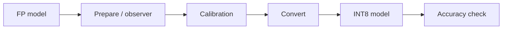
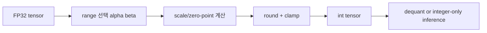

# On-Device AI Practice 02 — Quantization for CNN 코드 기준 학습 가이드


## 그림으로 먼저 잡기



| 단계 | 코드에서 찾을 단어 | 역할 |
|---|---|---|
| observer | `MinMaxObserver`, `qconfig` | activation 범위 수집 |
| calibration | eval data forward | scale/zero-point 추정 |
| convert | quantized module | 실제 INT 연산 모듈로 교체 |

> 같이 볼 원본 노트북: `On-Device AI 강의자료/실습/2. Quantization for CNN.ipynb`  
> 핵심 목표: **FP32 CNN을 integer-friendly representation으로 바꾸는 수학, 코드, PyTorch API 흐름**을 연결해서 이해한다.

## 0. 이 실습의 전체 구조

Quantization은 연속적인 실수 weight/activation을 제한된 정수 집합으로 근사한다.

$$
x \approx s(q-z)
$$

- $x$: 원래 FP32 실수값
- $q$: quantized integer
- $s$: scale
- $z$: zero-point
- bitwidth $b$: $q$가 가질 수 있는 값의 개수는 $2^b$



CNN에서 quantization을 하는 이유는 세 가지다.

1. 모델 weight 저장 크기 감소
2. memory bandwidth 감소
3. int8/int4 연산 hardware 활용 가능성

## 1. Setup / VGG / CIFAR-10

초반부는 VGG 모델과 CIFAR-10 DataLoader, 평가 함수, FLOPs/model size helper를 준비한다.

| 객체 | Shape / 값 | 의미 |
|---|---:|---|
| CIFAR-10 input | `[B, 3, 32, 32]` | RGB 이미지 batch |
| Conv weight | `[C_out, C_in, K, K]` | convolution kernel |
| Linear weight | `[C_out, C_in]` | classifier weight |
| activation | layer마다 다름 | quantization 대상 가능 |
| bitwidth | 8, 4, 3 등 | 표현 가능한 integer precision |

`get_model_size(model, data_width=32)`는 element 수에 bitwidth를 곱해 model size를 계산한다. FP32에서 int8로 바꾸면 이론상 weight 저장량은 1/4이 된다.

$$
\text{size}_{bits}=N_{params}\times b
$$

## 2. Linear quantization의 수학

노트북의 핵심 함수는 `linear_quantize()`다. 기본 공식은 다음이다.

$$
q = \text{clamp}\left(\text{round}\left(\frac{x}{s}\right)+z, q_{min}, q_{max}\right)
$$

복원은 다음이다.

$$
\hat{x}=s(q-z)
$$

### `get_quantized_range(bitwidth)`

signed integer라면 보통:

$$
q_{min}=-2^{b-1}, \quad q_{max}=2^{b-1}-1
$$

unsigned라면:

$$
q_{min}=0, \quad q_{max}=2^b-1
$$

코드에서 dtype과 range가 맞아야 한다. int8인데 unsigned range를 쓰거나, activation zero-point를 signed처럼 다루면 결과가 틀어진다.

## 3. Scale과 zero-point

### Symmetric quantization

0을 중심으로 대칭 range를 잡는다.

$$
s=\frac{\max(|x_{min}|,|x_{max}|)}{2^{b-1}-1}, \quad z=0
$$

- weight quantization에 자주 사용
- zero-point 처리가 단순

### Asymmetric quantization

실제 min/max를 모두 사용한다.

$$
s=\frac{x_{max}-x_{min}}{q_{max}-q_{min}}, \quad z=\text{round}\left(q_{min}-\frac{x_{min}}{s}\right)
$$

- activation처럼 분포가 한쪽으로 치우칠 때 유리
- zero-point 계산이 필요

## 4. Per-tensor vs Per-channel

### Per-tensor

하나의 tensor 전체가 scale 하나를 공유한다.

```text
W shape [C_out, C_in, K, K]
scale shape []
```

간단하지만 outlier channel 하나가 전체 precision을 망칠 수 있다.

### Per-channel

출력 채널마다 scale을 따로 둔다.

```text
W shape     [C_out, C_in, K, K]
scale shape [C_out, 1, 1, 1]
```

수학적으로는 output channel $o$에 대해:

$$
q_o = \text{round}(W_o/s_o)
$$

채널별 분포 차이가 큰 Conv weight에 유리하다.

## 5. Integer-only inference

FP32 dequantize를 매번 하면 저장은 줄어도 연산 가속 이득이 작다. integer-only inference는 다음을 목표로 한다.

$$
y = W x \approx s_w s_x \sum_i (q^w_i-z_w)(q^x_i-z_x)
$$

Conv/Linear 내부 accumulation은 보통 int32로 한다.

| 단계 | dtype | 이유 |
|---|---|---|
| input/weight | int8 | 저장/대역폭 감소 |
| multiply-accumulate | int32 | overflow 방지 |
| requantize output | int8 | 다음 layer로 전달 |

코드 관점에서는 `QuantizedConv2d`가 이 역할을 흉내 낸다. scale, zero-point, bias 보정, output scale 변환이 모두 맞아야 한다.

## 6. BatchNorm folding

노트북 중간의 `fuse_conv_bn(conv, bn)`은 매우 중요하다. BatchNorm은 inference에서 다음 affine 변환이다.

$$
\text{BN}(y)=\gamma\frac{y-\mu}{\sqrt{\sigma^2+\epsilon}}+\beta
$$

Conv는:

$$
y=W*x+b
$$

두 식을 합치면 새 Conv weight와 bias를 만들 수 있다.

$$
W' = W\cdot\frac{\gamma}{\sqrt{\sigma^2+\epsilon}}
$$

$$
b' = \left(b-\mu\right)\frac{\gamma}{\sqrt{\sigma^2+\epsilon}}+\beta
$$

왜 folding을 하냐면, inference에서는 BN layer를 따로 실행하지 않아도 되고 quantization 대상 graph가 단순해진다.

## 7. Non-uniform quantization / K-means

Linear quantization은 일정 간격 grid를 쓴다. K-means quantization은 값들이 몰린 곳에 codebook centroid를 배치한다.

$$
W_i \approx c_{a_i}, \quad c_k \in \text{codebook}
$$

- $c_k$: centroid 값
- $a_i$: weight $i$가 속한 cluster index

장점은 weight 분포가 균일하지 않을 때 reconstruction error가 작을 수 있다는 점이다. 단점은 codebook lookup이 필요해서 hardware-friendly하지 않을 수 있다.

## 8. Quantization-aware training(QAT)

QAT는 학습 중 quantization noise를 미리 넣는다.

```text
forward: quantize/dequantize를 흉내냄
backward: round는 미분 불가능하므로 STE로 gradient 통과
```

STE(Straight-Through Estimator)는 대략 다음처럼 생각한다.

$$
\frac{\partial \text{round}(x)}{\partial x} \approx 1
$$

즉 forward에서는 round를 쓰되 backward에서는 identity처럼 gradient를 흘린다.

## 9. PyTorch Quantization API

후반부는 PyTorch API 기반 PTQ/QAT 흐름이다.

1. model 준비
2. `qconfig` 설정
3. prepare: observer 삽입
4. calibration: 대표 데이터 통과
5. convert: quantized module로 변환

Observer는 activation min/max 또는 histogram을 모아 scale/zero-point를 정한다.

## 10. 직접 구현 체크리스트

1. bitwidth별 integer range를 먼저 확정한다.
2. scale이 0이 되지 않게 epsilon을 둔다.
3. `round -> zero_point add -> clamp -> dtype cast` 순서를 지킨다.
4. dequantization으로 error를 먼저 확인한다.
5. Conv/Linear의 weight shape별 broadcasting을 확인한다.
6. BN folding 후 weight/bias shape가 맞는지 확인한다.
7. integer accumulation은 int32로 둔다.
8. PyTorch API에서는 prepare 후 반드시 calibration을 한다.

## 11. 시험 대비 핵심 문장

- Quantization은 FP tensor를 low-bit integer grid로 근사하는 압축/가속 기법이다.
- Scale은 integer step 하나가 원래 실수 공간에서 얼마인지를 뜻한다.
- Zero-point는 실수 0이 integer grid의 어느 위치에 대응되는지를 뜻한다.
- Per-channel quantization은 channel별 range 차이를 반영해 per-tensor보다 정확도에 유리할 수 있다.
- QAT는 quantization noise를 학습 중 노출시켜 PTQ보다 정확도 하락을 줄인다.
