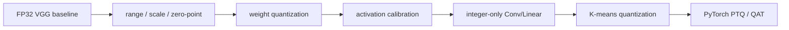

# On-Device AI Practice 02 — Quantization for CNN 코드 학습 가이드

> 오른쪽 원본 노트북 `2. Quantization for CNN.ipynb`를 띄워두고, 왼쪽에서는 아래 셀 번호를 따라가면 된다. 이 가이드는 **CNN 양자화 전용**으로 작성되어 있으며, LLM/KD/pruning 설명을 섞지 않는다.

- 기준 교안: `ODAI-1 Chapter 3. Quantization`
- 원본 노트북: `On-Device AI 강의자료/실습/2. Quantization for CNN.ipynb`
- 핵심 목표: FP32 VGG/CIFAR-10 모델을 대상으로 **linear quantization → integer-only inference → k-means non-uniform quantization → PyTorch PTQ/QAT API** 흐름을 직접 구현 관점으로 이해한다.

## 0. 전체 흐름



### 계속 붙잡을 수식

Linear quantization은 실수 $r$을 정수 $q$로 근사한다.

$$
r = S(q-Z), \qquad q = \mathrm{clip}\left(\mathrm{round}\left(\frac{r}{S}\right)+Z, q_{min}, q_{max}\right)
$$

- $S$: scale. 정수 grid 한 칸이 실수 공간에서 어느 정도 간격인지.
- $Z$: zero point. 실수 0이 대응되는 정수 위치.
- $q_{min}, q_{max}$: bitwidth가 정하는 정수 범위.
- dequantization은 $\hat r = S(q-Z)$로 다시 실수 근사값을 만든다.

### 핵심 shape 표

| 대상 | Shape / 표현 | 코드에서 보는 위치 | 의미 |
|---|---|---|---|
| CIFAR-10 batch | `[B, 3, 32, 32]` | DataLoader | RGB 이미지 mini-batch |
| Conv weight | `[C_out, C_in, K_h, K_w]` | VGG conv layer | per-tensor/per-channel quantization 대상 |
| Linear weight | `[C_out, C_in]` | classifier layer | integer-only FC 구현 대상 |
| Activation | `[B, C, H, W]` 또는 `[B, features]` | hook / observer | activation quantization range 추정 대상 |
| Quantized weight | int tensor + scale + zero point | custom quantized layer | 실제 저비트 표현 |
| Accumulator | 보통 int32 | quantized conv/linear 내부 | int8 곱셈 결과 누산 overflow 방지 |

## 1. 노트북 전체 지도

| 구간 | 셀 범위 | 주제 | 공부 포인트 |
|---:|---:|---|---|
| 1 | 001-018 | Setup / VGG / CIFAR-10 / baseline utilities | 모델, 데이터, 평가 함수, 크기 측정, qconfig 출력 준비 |
| 2 | 019-023 | Linear quantization 개념과 signed integer 범위 | $r=S(q-Z)$, bitwidth별 정수 범위 |
| 3 | 024-036 | 실습 1-2: rounding, clipping, scale, zero point 구현 | `round`, `clamp`, `int8`, min/max 기반 range 매핑 |
| 4 | 037-047 | weight quantization: symmetric, per-tensor, per-channel | weight는 보통 zero point 0, 출력 채널별 scale이 정확도에 유리 |
| 5 | 048-064 | integer-only inference: FC/Conv layer | bias shift, int32 accumulator, output rescale, output zero point |
| 6 | 065-075 | post-training custom quantized model 구성 | Conv-BN fusion, activation range hook, QuantizedConv2d/Linear wrapper |
| 7 | 076-094 | non-uniform K-means quantization | centroid codebook, labels, model-wide k-means quantizer |
| 8 | 095-099 | quantization-aware training 직접 구현 | forward 중 quantize/dequantize 효과를 넣고 fine-tuning |
| 9 | 100-128 | PyTorch Quantization API: PTQ/QAT | `qconfig`, prepare, calibration, convert, QAT prepare/train/convert |

---

## 2. 셀별/구간별 Walkthrough

## Cells 001-003 — 실습 목표와 목차

오른쪽 노트북은 CNN 양자화 실습의 범위를 먼저 선언한다.

- `Uniform Quantization`: 일정 간격의 정수 grid로 실수를 근사한다.
- `Integer-only inference`: Conv/Linear를 정수 연산 중심으로 바꾼다.
- `Non-uniform Quantization`: 값 분포에 맞게 centroid를 학습한다.
- `PyTorch API`: 직접 구현한 내용을 PyTorch PTQ/QAT 흐름으로 확인한다.

시험/구현 관점에서는 “압축률”만 보면 안 되고 다음 3개를 같이 봐야 한다.

| 질문 | 확인할 값 |
|---|---|
| 모델이 작아졌는가? | model size, bitwidth |
| 정확도가 유지되는가? | test accuracy |
| 실제 연산이 바뀌었는가? | quantized Conv/Linear, int accumulator, scale/zero-point |

## Cells 004-010 — 패키지, import, seed, VGG, CIFAR-10, 평가 함수

### Cell 004-005: 패키지 설치

`torchprofile`, `fast-pytorch-kmeans`를 설치한다.

- `torchprofile`: 모델 FLOPs/연산량을 추정할 때 사용.
- `fast-pytorch-kmeans`: non-uniform quantization에서 centroid를 찾는 데 사용.

직접 구현할 때는 설치 셀이 실패해도 핵심 개념이 바뀌지는 않는다. 다만 k-means 섹션은 해당 패키지가 필요하다.

### Cell 006-007: import와 seed

여기서는 PyTorch, torchvision, matplotlib, kmeans, utility 자료구조를 불러온다. `random.seed`, `np.random.seed`, `torch.manual_seed`는 실험 재현성을 맞춘다.

양자화 실험에서는 seed가 중요한 이유가 두 가지다.

1. calibration/학습 데이터 순서가 바뀌면 activation range가 달라질 수 있다.
2. QAT fine-tuning 결과가 optimizer 초기 조건에 따라 흔들릴 수 있다.

### Cell 008: VGG 모델 정의

VGG는 feature extractor + classifier 구조다.

- Conv layer weight: `[out_channels, in_channels, kernel_h, kernel_w]`
- classifier Linear weight: `[out_features, in_features]`
- CIFAR-10 logits: `[B, 10]`

양자화에서는 Conv/Linear가 핵심 대상이다. ReLU/Pooling은 weight가 없지만 activation range와 integer pipeline에 영향을 준다.

### Cell 009-010: CIFAR-10 DataLoader와 evaluation

DataLoader는 train/test batch를 만든다. evaluation 함수는 model output에서 top-1 accuracy를 계산한다.

```python
outputs = model(inputs)
pred = outputs.argmax(dim=1)
accuracy = (pred == targets).float().mean()
```

이후 모든 압축 실험은 FP32 baseline accuracy와 비교한다. baseline 없이 “정확도가 괜찮다”고 말하면 안 된다.

## Cells 011-018 — 모델 크기, pretrained weight, qconfig 출력

### Cell 011-013: parameter 수와 model size

`get_model_size(model, data_width=32)`는 parameter 개수와 bitwidth로 모델 크기를 계산한다.

$$
\mathrm{size\;bits} = N_{params} \times \mathrm{data\_width}
$$

예를 들어 같은 parameter 수라도 FP32에서 INT8로 바꾸면 weight 저장 크기는 대략 1/4이 된다. 단, 실제 deployment에서는 scale/zero-point, packing, kernel 지원 여부도 고려해야 한다.

### Cell 014-017: pretrained VGG 로딩과 DataLoader 재구성

사전학습 checkpoint를 로드하고 CIFAR-10 loader를 다시 구성한다. 여기서 중요한 것은 **quantization 전 기준 모델**을 명확히 고정하는 것이다.

- FP32 모델 정확도
- FP32 모델 크기
- 입력 preprocessing
- train/test split

이 4개가 바뀌면 이후 비교가 의미 없어질 수 있다.

### Cell 018: `qconfig_printer`

PyTorch quantization API의 `qconfig`를 사람이 읽을 수 있게 출력하는 helper다.

확인할 필드:

| 필드 | 의미 |
|---|---|
| observer class | range를 어떻게 관찰하는지 |
| dtype | `qint8`, `quint8` 등 |
| qscheme | per-tensor/per-channel, symmetric/affine |
| quant_min/max | 정수 범위 |

---

## Cells 019-023 — Linear quantization과 n-bit signed integer

### Cell 019-021: FP32 baseline 측정

먼저 FP32 모델의 정확도와 크기를 출력한다.

이 값은 뒤에서 다음 비교표의 기준이 된다.

| 모델 | bitwidth | size | accuracy |
|---|---:|---:|---:|
| FP32 baseline | 32 | 가장 큼 | 기준 |
| INT8 custom | 8 | 약 1/4 | 약간 감소 가능 |
| INT4/K-means | 4 | 더 작음 | 감소 가능성 큼 |

### Cell 022-023: signed integer range

`get_quantized_range(bitwidth)`는 signed integer 범위를 반환한다.

$$
q_{min}=-2^{b-1}, \qquad q_{max}=2^{b-1}-1
$$

예시:

| bitwidth | range |
|---:|---:|
| 2-bit | `[-2, 1]` |
| 4-bit | `[-8, 7]` |
| 8-bit | `[-128, 127]` |

여기서 signed 범위를 쓰는 이유는 weight가 음수/양수를 모두 가지기 때문이다.

---

## Cells 024-036 — 실습 1-2: Tensor를 정수 grid로 보내기

### Cell 024-028: `linear_quantize` 구현과 시각화

핵심 함수는 실수 tensor를 정수 tensor로 바꾼다.

구현 순서:

1. scale로 나눈다: `tensor / scale`
2. zero point를 더한다: `+ zero_point`
3. 반올림한다: `round()`
4. 정수 범위로 자른다: `clamp(quantized_min, quantized_max)`
5. dtype을 정수로 바꾼다: `.to(torch.int8)` 등

수식으로는 다음이다.

$$
q = \mathrm{clip}(\mathrm{round}(r/S)+Z, q_{min}, q_{max})
$$

주의할 점:

- `round`만 하고 `clamp`를 안 하면 bitwidth 범위를 벗어난다.
- `clamp`를 너무 많이 유발하는 scale은 clipping error를 만든다.
- `scale`이 너무 크면 값들이 같은 정수로 뭉쳐 resolution error가 커진다.

### Cell 029-036: scale과 zero point 계산

실수 범위 `[r_min, r_max]`를 정수 범위 `[q_min, q_max]`에 맞춘다.

$$
S = \frac{r_{max}-r_{min}}{q_{max}-q_{min}}
$$

zero point는 $r_{min}$이 $q_{min}$으로 가도록 맞추면 된다.

$$
Z = \mathrm{round}\left(q_{min}-\frac{r_{min}}{S}\right)
$$

코드에서 봐야 할 것:

- `fp_tensor.min()`, `fp_tensor.max()`로 range를 잡는다.
- scale은 양수여야 한다.
- zero point는 정수여야 한다.
- 계산된 zero point도 quantized range 안으로 clamp해야 안전하다.

---

## Cells 037-047 — Weight quantization: symmetric, per-tensor, per-channel

### Cells 037-040: weight의 특수성

Weight는 보통 activation보다 분포가 0을 중심으로 대칭적이다. 그래서 weight quantization에서는 zero point를 0으로 두는 symmetric quantization을 많이 쓴다.

$$
Z_{weight}=0, \qquad S = \frac{\max |W|}{q_{max}}
$$

장점:

- 곱셈식이 단순해진다.
- `q_weight - Z_weight`에서 zero point 보정이 사라진다.
- integer-only inference 구현이 쉬워진다.

### Cells 041-042: per-tensor weight quantization

전체 weight tensor 하나에 scale 하나를 쓴다.

```text
W 전체 → scale 1개 → quantized W
```

장점은 구현이 단순하다는 것이다. 단점은 특정 channel만 값 범위가 크면 전체 scale이 커져 작은 channel의 해상도가 나빠진다는 점이다.

### Cells 043-047: per-channel weight quantization

Conv weight `[C_out, C_in, K_h, K_w]`에서 출력 채널 `C_out`마다 scale을 따로 둔다.

```text
W[0,:,:,:] → scale[0]
W[1,:,:,:] → scale[1]
...
W[C_out-1,:,:,:] → scale[C_out-1]
```

왜 출력 채널 기준인가?

- Conv의 각 output channel은 서로 다른 filter다.
- filter마다 weight 분포가 다를 수 있다.
- output channel별 scale을 두면 quantization error가 줄어든다.

Cell 046은 4-bit per-tensor/per-channel 결과를 비교한다. 일반적으로 per-channel이 정확도 보존에 유리하다.

---

## Cells 048-064 — Quantized inference: FC와 Conv를 정수 연산으로 만들기

## Cells 048-054 — Quantized Fully-Connected의 bias 처리

실수 FC는 다음이다.

$$
y = xW^T + b
$$

양자화된 입력/weight를 쓰면:

$$
x \approx S_x(q_x-Z_x), \qquad W \approx S_w q_w
$$

weight는 symmetric이라 $Z_w=0$으로 둔다. 그러면 누산은 다음 꼴이다.

$$
\sum_i (q_{x,i}-Z_x)q_{w,i}
= \sum_i q_{x,i}q_{w,i} - Z_x\sum_i q_{w,i}
$$

Cell 054의 `shift_quantized_linear_bias`는 이 $-Z_x\sum_i q_w$ 보정을 bias에 미리 흡수한다. 이걸 안 하면 input zero point 때문에 출력이 전체적으로 밀린다.

## Cells 055-059 — 실습 3: `quantized_linear`

구현해야 하는 핵심 흐름:

1. 입력과 weight를 int32로 변환해 `linear`를 수행한다.
2. int32 bias를 더한다.
3. 누산 결과를 실수 scale 비율로 rescale한다.
4. output zero point를 더한다.
5. output bitwidth 범위로 clamp한다.

수식:

$$
q_y = \mathrm{clip}\left(\mathrm{round}\left(acc \cdot \frac{S_xS_w}{S_y}\right)+Z_y, q_{min}, q_{max}\right)
$$

여기서 `acc`는 int32 누산값이다. int8 곱셈을 바로 int8에 누산하면 overflow가 나므로 int32가 필요하다.

## Cells 060-064 — Quantized Convolution

Conv도 구조는 FC와 같다. 차이는 weight가 4D이고 spatial convolution을 수행한다는 점이다.

- input: `[B, C_in, H, W]`
- weight: `[C_out, C_in, K_h, K_w]`
- output: `[B, C_out, H_out, W_out]`

Cell 064의 `quantized_conv2d`도 int32 conv → bias 보정 → rescale → zero point → clamp 순서다.

---

## Cells 065-075 — Custom post-training quantized model 만들기

### Cells 065-067: Conv-BN fusion

BatchNorm은 추론 시 Conv에 흡수할 수 있다.

Conv:

$$
y = W*x + b
$$

BatchNorm:

$$
\mathrm{BN}(y)=\gamma\frac{y-\mu}{\sqrt{\sigma^2+\epsilon}}+\beta
$$

이를 Conv weight/bias로 합치면 inference graph가 단순해진다.

$$
W' = W \cdot \frac{\gamma}{\sqrt{\sigma^2+\epsilon}}
$$

$$
b' = (b-\mu)\frac{\gamma}{\sqrt{\sigma^2+\epsilon}}+\beta
$$

왜 필요한가?

- quantized runtime에서 Conv+BN을 따로 처리하지 않아도 된다.
- Conv output range를 더 명확히 잡을 수 있다.
- inference graph가 deployment-friendly해진다.

### Cells 068-069: activation range recording hook

Activation quantization은 weight와 다르게 입력 데이터에 따라 range가 달라진다. 그래서 샘플 데이터를 흘려보내며 각 layer 입력/출력의 min/max를 기록한다.

```python
hook(module, input, output):
    record min/max(input)
    record min/max(output)
```

이 단계가 calibration이다. calibration sample이 실제 입력 분포를 대표하지 못하면 실제 inference에서 clipping이 생길 수 있다.

### Cells 070-075: QuantizedConv2d / QuantizedLinear wrapper

모델의 layer를 quantized wrapper로 교체한다.

- `nn.Conv2d` → `QuantizedConv2d`
- `nn.Linear` → `QuantizedLinear`
- pooling은 내부에서 임시로 FP32로 변환하는 wrapper 사용

Cell 073은 per-tensor INT8 모델 정확도를 평가하고, Cell 075는 per-channel 버전을 구성한다.

공부할 때 확인할 것:

1. 각 wrapper가 저장하는 scale/zero point가 무엇인지.
2. input/output activation range가 어디서 들어오는지.
3. weight quantization이 per-tensor인지 per-channel인지.
4. 평가 전 `extra_preprocess`가 입력 이미지를 정수화하는지.

---

## Cells 076-094 — Non-uniform Quantization: K-means

### Cells 076-083: K-means quantization 개념

Uniform quantization은 정수 grid 간격이 일정하다. 반면 K-means quantization은 weight 값 분포에서 대표값 centroid를 학습한다.

$n$-bit K-means는 최대 $2^n$개의 centroid를 쓴다.

```text
weight value → nearest centroid index → centroid table로 복원
```

저장 관점:

- `labels`: 각 weight가 어떤 centroid를 쓰는지 나타내는 index.
- `centroids`: 실제 대표 FP32 값들의 table.

이론적으로 weight 분포가 특정 값 주변에 몰려 있으면 uniform보다 오차가 작을 수 있다. 하지만 일반 하드웨어에서는 centroid lookup이 필요해 integer GEMM처럼 단순하지 않다.

### Cells 084-090: 실습 4 `k_means_quantize`

구현 흐름:

1. weight tensor를 1D로 펼친다.
2. `n_clusters = 2 ** bitwidth`로 centroid 개수를 정한다.
3. KMeans로 label과 centroid를 얻는다.
4. `centroids[labels]`로 quantized tensor를 복원한다.
5. 원래 tensor shape로 되돌린다.

Cell 088-090은 dummy tensor로 함수가 제대로 동작하는지 시각화/검증한다.

### Cells 091-094: 전체 모델 K-means quantization

`KMeansQuantizer`는 모델 parameter별 codebook을 저장한다.

중요한 점:

- quantization을 in-place로 적용하면 원본 weight가 바뀐다.
- 여러 bitwidth를 비교하려면 원본 모델 복구가 필요하다.
- codebook은 layer마다 따로 관리되어야 한다.

---

## Cells 095-099 — Quantization-Aware Training 직접 구현

QAT는 학습 중에 quantization noise를 모델이 경험하게 한다.

Post-training quantization은 학습이 끝난 뒤 weight/activation을 양자화한다. 반면 QAT는 forward 과정에서 quantization 효과를 넣고, backward로 weight를 조정한다.

직관:

```text
forward: quantized-like weight로 예측
backward: FP32 master weight를 업데이트
```

Cell 096-099에서 확인할 것:

- quantized model을 fine-tuning하는지.
- fake quantization / 실제 quantization 중 무엇을 쓰는지.
- accuracy가 PTQ보다 회복되는지.

QAT가 유리한 이유는 모델이 quantization error에 적응할 시간이 생기기 때문이다.

---

## Cells 100-128 — PyTorch Quantization API: PTQ와 QAT

## Cells 100-103 — PyTorch API 전체 흐름

여기서는 앞에서 직접 구현한 개념을 PyTorch API로 반복한다.

PyTorch quantization의 큰 흐름:

```text
model_fp32
→ fuse modules
→ assign qconfig
→ prepare
→ calibration or training
→ convert
→ model_int8
```

## Cells 104-116 — Post-Training Quantization (PTQ)

### Cells 104-106: PTQ 개념과 qconfig

PTQ는 학습 없이 calibration data만으로 activation range를 추정한다.

`qconfig`는 weight와 activation에 어떤 observer/quantizer를 쓸지 정한다.

### Cell 107: qscheme

`torch.qscheme`은 quantization 방식이다.

| qscheme | 의미 |
|---|---|
| per_tensor_affine | tensor 하나에 scale/zero point 하나 |
| per_tensor_symmetric | tensor 하나에 scale 하나, zero point 0 |
| per_channel_affine | channel별 scale/zero point |
| per_channel_symmetric | channel별 scale, zero point 0 |

### Cells 108-110: prepare

`prepare`는 모델에 observer를 삽입한다. 아직 실제 int8 모델이 된 것은 아니다. 이 시점의 모델은 calibration을 기다리는 FP32+observer 모델이다.

### Cells 111-113: calibration

calibration data를 흘려 observer가 activation min/max를 기록한다. 이 과정에서는 gradient가 필요 없다.

주의:

- calibration sample이 너무 적으면 range가 부정확하다.
- outlier가 있으면 scale이 커져 대부분 값의 resolution이 나빠질 수 있다.

### Cells 114-116: convert

`convert`는 observer가 모은 통계로 실제 quantized module을 만든다. 이 후에는 quantized Conv/Linear가 들어간 모델이 된다.

확인할 것:

- convert 전후 model print 차이.
- accuracy 변화.
- qconfig가 의도한 dtype/qscheme인지.

## Cells 117-128 — Quantization-Aware Training (QAT) with PyTorch API

### Cells 117-119: QAT configuration

QAT qconfig는 fake quantization module을 넣는다. fake quantization은 forward에서 quantization 효과를 흉내내지만, 학습 가능한 FP32 weight를 유지한다.

### Cells 120-122: QAT prepare

`prepare_qat`는 모델을 QAT 가능한 형태로 바꾼다. 이때 모델은 train mode여야 한다.

### Cells 123-124: training

QAT fine-tuning을 수행한다. 여기서는 epoch이 많지 않아도 quantization error에 적응하는 효과를 확인할 수 있다.

### Cells 125-128: convert와 평가

학습이 끝나면 convert로 실제 quantized model을 만들고 평가한다.

비교해야 할 최종 표:

| 방식 | 학습 필요 | calibration 필요 | 장점 | 단점 |
|---|---|---|---|---|
| 직접 PTQ per-tensor | 없음 | 있음 | 구현 단순 | 정확도 손실 가능 |
| 직접 PTQ per-channel | 없음 | 있음 | weight 오차 감소 | scale 관리 복잡 |
| K-means | 없음 | weight clustering | 분포 적응 | 하드웨어 효율 낮을 수 있음 |
| PyTorch PTQ | 없음 | 있음 | 표준 API | calibration 품질 의존 |
| PyTorch QAT | 있음 | 학습 중 observer/fake quant | 정확도 회복 유리 | 학습 비용 필요 |

---

## 3. 직접 다시 구현할 때 체크리스트

1. FP32 baseline accuracy와 model size를 먼저 저장한다.
2. bitwidth별 정수 범위 `q_min`, `q_max`를 정확히 계산한다.
3. scale은 `0`이 되지 않게 guard를 둔다.
4. zero point는 정수로 round하고 quantized range 안으로 clamp한다.
5. weight quantization은 symmetric/per-channel 여부를 명확히 한다.
6. activation quantization은 calibration data로 range를 잡는다.
7. FC/Conv integer 누산은 int32로 수행한다.
8. output rescale은 `S_input * S_weight / S_output` 비율을 쓴다.
9. Conv-BN fusion 후 모델 기능이 유지되는지 FP32 accuracy로 확인한다.
10. PTQ, QAT, K-means 결과를 모두 FP32 baseline과 비교한다.

## 4. 흔한 오류

| 오류 | 증상 | 원인 | 해결 |
|---|---|---|---|
| clamp 누락 | int 범위 밖 값 발생 | round만 수행 | `clamp(q_min, q_max)` 추가 |
| zero point 부호 오류 | 출력이 전체적으로 shift | $q = r/S + Z$ 관계 혼동 | $r=S(q-Z)$ 기준으로 다시 유도 |
| int8 누산 | overflow | 곱셈 결과를 작은 타입에 누산 | accumulator는 int32 사용 |
| calibration 부족 | 실제 test에서 clipping | activation range 대표성 부족 | calibration sample 늘리기 |
| per-tensor 정확도 저하 | 특정 channel 손상 | channel별 range 차이 | per-channel weight quantization 적용 |
| QAT 효과 없음 | PTQ와 비슷한 정확도 | train mode/prepare_qat/fake quant 흐름 오류 | prepare → train → convert 순서 확인 |

## 5. 시험 대비 핵심 문장

- Quantization은 실수값을 제한된 정수 grid로 근사하는 과정이다.
- Scale은 정수 한 칸의 실수 간격이고, zero point는 실수 0의 정수 위치다.
- Weight는 보통 symmetric quantization을 사용해 zero point를 0으로 둔다.
- Activation은 입력 데이터 분포에 따라 range가 달라지므로 calibration/observer가 필요하다.
- Per-channel weight quantization은 output channel별 range 차이를 줄여 정확도 보존에 유리하다.
- Integer-only inference에서는 int32 accumulator와 output rescale이 핵심이다.
- PTQ는 학습 없이 빠르지만 calibration 품질에 민감하고, QAT는 학습 비용이 있지만 정확도 회복에 유리하다.
