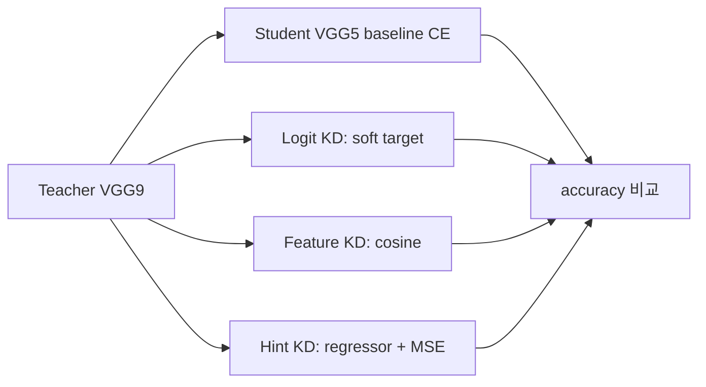

# On-Device AI Practice 03 — Knowledge Distillation 코드 학습 가이드

<!-- aisp-exam-practice-notice -->
> **시험 대비 모드:** 오른쪽에는 원본 전체 코드 대신 핵심 셀을 `## 정답 입력`으로 비운 실습본이 표시됩니다.
> 원본은 `On-Device AI 강의자료/실습/3. Knowledge Distillation.ipynb`, 정답과 출제 의도는 `study_notes/exam_answers/on_device_ai_code_answers.md`에서 확인합니다.


> 오른쪽 원본 노트북 `3. Knowledge Distillation.ipynb`를 보면서, 왼쪽에서는 teacher/student 학습 흐름과 loss가 어디서 계산되는지 따라가면 된다.

- 기준 교안: `ODAI-1 Chapter 4. Knowledge Distillation`
- 핵심 목표: 큰 teacher model의 지식을 작은 student model로 옮기는 방법을 **CE baseline → logit KD → feature/cosine KD → hint regressor + MSE KD** 순서로 이해한다.

## 0. 전체 흐름



### 핵심 수식

Student의 hard-label cross entropy:

$$
\mathcal{L}_{CE}=CE(y, p_s)
$$

Logit distillation:

$$
\mathcal{L}_{KD}=T^2 KL\left(\mathrm{softmax}(z_t/T)\;\Vert\;\mathrm{softmax}(z_s/T)\right)
$$

최종 loss는 보통 두 항을 섞는다.

$$
\mathcal{L}=\alpha\mathcal{L}_{KD}+(1-\alpha)\mathcal{L}_{CE}
$$

### 핵심 shape 표

| 대상 | Shape | 의미 |
|---|---|---|
| image batch | `[B, 3, 32, 32]` | CIFAR-10 입력 |
| logits | `[B, 10]` | class별 점수 |
| soft target | `[B, 10]` | teacher가 만든 완만한 class 확률 |
| feature map | `[B, C, H, W]` | 중간 representation |
| regressor output | teacher feature와 같은 shape | hint loss를 위해 student feature를 변환 |

## 1. 노트북 전체 지도

| 구간 | 셀 범위 | 주제 | 공부 포인트 |
|---:|---:|---|---|
| 1 | 001-009 | setup / CIFAR-10 / pretrained teacher 준비 | 데이터, seed, teacher checkpoint |
| 2 | 010-024 | teacher/student 모델과 CE baseline | 모델 크기와 baseline accuracy 비교 |
| 3 | 025-033 | logit KD | temperature, KL divergence, CE와 KD loss 혼합 |
| 4 | 034-044 | cosine feature KD | teacher/student feature 방향 맞추기 |
| 5 | 045-057 | hint-based KD with regressor + MSE | feature shape 맞춤, regressor, MSE loss |

---

## 2. 구간별 Walkthrough

## Cells 001-009 — setup, dataset, teacher checkpoint

초반부는 CIFAR-10 DataLoader와 seed를 준비하고, teacher로 쓸 pretrained VGG checkpoint를 가져온다.

확인할 것:

- CIFAR-10 input은 `[B,3,32,32]`다.
- seed 고정은 student 초기화 비교를 위해 중요하다.
- teacher는 이미 학습된 강한 모델이어야 한다. teacher가 약하면 distillation 신호도 약하다.

## Cells 010-011 — Teacher / Student model 정의

Teacher는 더 깊거나 넓은 VGG 구조, student는 더 작은 VGG 구조다.

| 모델 | 역할 | 기대 특성 |
|---|---|---|
| Teacher | 지식 제공 | parameter 많음, accuracy 높음 |
| Student | 경량 모델 | parameter 적음, 단독 학습 accuracy 낮을 수 있음 |

KD의 목표는 student가 teacher의 decision boundary와 representation을 흉내 내게 하는 것이다.

## Cells 012-024 — Cross-Entropy baseline

먼저 student를 label만으로 학습한다.

```text
image -> student -> logits -> CE(logits, label)
```

이 baseline은 반드시 필요하다. KD가 좋은지 판단하려면 다음을 비교해야 한다.

| 비교 | 의미 |
|---|---|
| teacher accuracy | 상한/참조 성능 |
| student CE accuracy | KD 없는 경량 모델 기준 |
| student KD accuracy | distillation 효과 |

Cell 017-018에서 초기화 일관성을 보는 이유는, student 두 개를 비교할 때 초기 weight 차이가 결과 차이로 섞이지 않게 하기 위해서다.

## Cells 025-033 — Logit Knowledge Distillation

Teacher logits에는 hard label보다 많은 정보가 들어 있다. 예를 들어 이미지가 고양이일 때 teacher가 `cat=0.7`, `dog=0.2`, `car=0.01`처럼 출력하면, student는 “dog도 약간 비슷하다”는 class 간 관계를 배운다.

Temperature가 커지면 softmax가 완만해진다.

$$
p_i=\frac{\exp(z_i/T)}{\sum_j\exp(z_j/T)}
$$

- $T=1$: 일반 softmax
- $T>1$: class 확률이 덜 뾰족해져 dark knowledge가 드러남

학습 함수에서 확인할 것:

1. teacher forward는 gradient가 필요 없으므로 `no_grad`로 감싼다.
2. student logits는 CE와 KD loss 양쪽에 쓰인다.
3. KL divergence는 log probability와 probability 입력 순서를 주의한다.
4. KD loss에는 보통 $T^2$ 보정을 곱한다.

## Cells 034-044 — Cosine similarity 기반 feature KD

Logit KD는 마지막 출력만 맞춘다. Feature KD는 중간 representation도 맞춘다.

CosineEmbeddingLoss는 두 feature vector의 방향을 맞춘다.

$$
\cos(a,b)=\frac{a\cdot b}{\|a\|\|b\|}
$$

왜 방향을 맞추는가?

- feature magnitude보다 representation 방향이 class 구분에 중요할 수 있다.
- teacher와 student가 같은 semantic feature를 만들도록 유도한다.

Cell 038에서 dummy input으로 logits/feature shape를 찍어보는 부분은 매우 중요하다. loss를 걸기 전 shape가 맞는지 확인해야 한다.

## Cells 045-057 — Hint-based KD: Regressor + MSE

Teacher와 student의 feature channel 수가 다르면 바로 MSE를 걸 수 없다. 그래서 regressor를 둔다.

```text
student feature -> regressor -> teacher feature shape
```

MSE hint loss:

$$
\mathcal{L}_{hint}=\|R(f_s)-f_t\|_2^2
$$

최종 loss는 CE와 hint loss를 섞는다.

```text
loss = CE(student_logits, y) + beta * MSE(regressed_student_feature, teacher_feature)
```

Cell 047은 student/teacher feature map shape를 비교한다. Cell 049는 regressor가 들어간 모델 구조를 정의한다. Cell 053은 MSE 기반 training loop다.

---

## 3. 직접 구현 체크리스트

1. teacher는 eval mode로 두고 gradient를 끈다.
2. student만 optimizer에 넣는다.
3. CE baseline을 먼저 측정한다.
4. temperature softmax는 teacher/student 모두 같은 $T$를 쓴다.
5. KLDivLoss 입력은 `log_softmax(student/T)`와 `softmax(teacher/T)` 순서를 지킨다.
6. feature KD는 teacher/student feature shape를 먼저 출력한다.
7. shape가 다르면 regressor로 맞춘 뒤 MSE/Cosine을 적용한다.
8. 최종 결과는 teacher, student CE, student KD를 한 표로 비교한다.

## 4. 시험 대비 핵심 문장

- Knowledge Distillation은 큰 teacher의 출력 분포나 중간 feature를 작은 student의 학습 신호로 사용하는 방법이다.
- Temperature는 teacher 확률분포를 부드럽게 만들어 class 간 유사도 정보를 드러낸다.
- Logit KD는 마지막 출력 분포를 맞추고, feature KD는 중간 representation을 맞춘다.
- Teacher와 student feature shape가 다르면 regressor가 필요하다.
- KD는 모델 크기를 줄이면서 accuracy 손실을 줄이려는 on-device AI 압축 기법이다.
