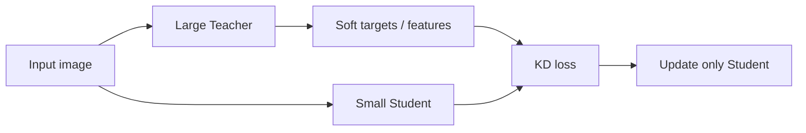

# On-Device AI Practice 03 — Knowledge Distillation 코드 기준 학습 가이드

> 같이 볼 원본 노트북: `On-Device AI 강의자료/실습/3. Knowledge Distillation.ipynb`  
> 핵심 목표: **큰 Teacher의 출력/중간표현을 작은 Student가 따라 하게 만들어 정확도를 회복하는 방법**을 코드와 수식으로 이해한다.

## 0. Knowledge Distillation의 핵심

Knowledge Distillation(KD)은 작은 모델 $S$가 큰 모델 $T$의 지식을 학습하는 방법이다. 일반 supervised learning은 hard label만 본다.

$$
\mathcal{L}_{CE}=CE(y, S(x))
$$

KD는 teacher의 soft prediction도 본다.

$$
\mathcal{L}_{KD}=T^2\,KL\left(\text{softmax}(z_T/T)\,\|\,\text{softmax}(z_S/T)\right)
$$

- $z_T$: teacher logits
- $z_S$: student logits
- $T$: temperature. 여기서는 모델 이름 T와 구분해서 temperature라고 읽는다.
- $KL$: 두 확률분포 차이

온디바이스 관점에서는 teacher를 배포하지 않고 student만 배포한다. 학습 때만 teacher의 지식을 빌린다.



## 1. Data loading / Teacher / Student 정의

CIFAR-10 입력은 `[B,3,32,32]`이다. Teacher와 Student는 VGG 계열이지만 capacity가 다르다.

| 모델 | 역할 | 특징 |
|---|---|---|
| `VGGCifar9` | Teacher | 더 깊고 parameter 많음 |
| `VGGCifar5` | Student | 더 작고 빠름 |
| `VGGCifar9_Cosine` | feature 추출 포함 | cosine KD용 |
| `VGGCifar9_Regressor` | regressor 포함 | hint-based KD용 |

Teacher는 pretrained weight를 load한 뒤 고정한다. Student만 학습한다.

## 2. Baseline: Cross-Entropy only

Student를 hard label만으로 학습하면 loss는 다음이다.

$$
\mathcal{L}_{student}=CE(y, z_S)
$$

이 기준이 있어야 KD가 진짜 도움이 되는지 판단할 수 있다.

코드에서 `train()`은 일반적인 PyTorch training loop다.

1. `model.train()`
2. forward
3. `CrossEntropyLoss`
4. backward
5. optimizer step
6. test accuracy 확인

## 3. Soft target KD

`train_knowledge_distillation()`에서 teacher와 student를 동시에 forward한다.

중요한 구현 포인트:

```python
with torch.no_grad():
    teacher_logits = teacher(inputs)
student_logits = student(inputs)
```

Teacher는 gradient가 필요 없다. 메모리를 아끼고 teacher weight가 업데이트되는 실수를 막는다.

### Temperature의 의미

낮은 temperature의 softmax는 가장 큰 logit에 확률이 몰린다. 높은 temperature는 분포가 부드러워진다.

$$
p_i=\frac{e^{z_i/T}}{\sum_j e^{z_j/T}}
$$

예를 들어 teacher가 “고양이 0.70, 개 0.20, 여우 0.08”처럼 class 간 유사성을 담고 있으면, hard label보다 더 많은 정보를 student에게 준다.

### Loss 조합

실제 구현은 보통 hard CE와 KD loss를 섞는다.

$$
\mathcal{L}=\alpha\mathcal{L}_{CE}+(1-\alpha)\mathcal{L}_{KD}
$$

- $\alpha$가 크면 label 중심
- $\alpha$가 작으면 teacher 중심

## 4. Cosine loss minimization

Cosine KD는 logits뿐 아니라 중간 feature 방향을 맞춘다.

$$
\mathcal{L}_{cos}=1-\frac{h_T\cdot h_S}{\|h_T\|\|h_S\|}
$$

여기서 $h_T$, $h_S$는 teacher/student feature vector다.

### 왜 cosine인가?

MSE는 크기까지 맞추려 한다. Cosine은 방향을 맞춘다. feature scale이 다르더라도 “어떤 class/패턴을 보는 방향”을 맞추는 데 유리하다.

노트북에서 중간에 feature dimension을 확인하는 이유는 teacher와 student feature shape가 loss 계산에 맞아야 하기 때문이다.

| 항목 | 예시 shape | 의미 |
|---|---:|---|
| input | `[B,3,32,32]` | CIFAR image |
| conv feature | `[B,C,H,W]` | CNN 중간 표현 |
| pooled/flattened feature | `[B,D]` | cosine 비교 대상 |
| logits | `[B,10]` | class score |

## 5. Hint-based KD / Regressor + MSE

Teacher와 student의 feature channel 수가 다르면 바로 MSE를 계산할 수 없다.

$$
h_T \in \mathbb{R}^{B\times C_T\times H\times W}, \quad h_S \in \mathbb{R}^{B\times C_S\times H\times W}
$$

$C_T \ne C_S$이면 regressor $R$를 둔다.

$$
\hat{h}_S = R(h_S), \quad \mathcal{L}_{hint}=\|\hat{h}_S-h_T\|_2^2
$$

Regressor는 보통 1x1 conv로 channel 수를 맞춘다.

```text
Student feature [B, C_s, H, W]
      ↓ 1x1 Conv regressor
Projected feature [B, C_t, H, W]
      ↓ MSE with Teacher feature
Teacher feature [B, C_t, H, W]
```

## 6. 왜 KD가 compression과 연결되는가?

Pruning/quantization은 기존 모델을 직접 줄인다. KD는 작은 구조를 새로 학습시키되 큰 모델의 decision boundary를 모방한다.

| 방법 | 줄이는 대상 | 장점 | 주의점 |
|---|---|---|---|
| Pruning | 기존 weight/채널 | pretrained model 활용 | sparse/structured 구현 필요 |
| Quantization | numeric precision | hardware 효율 | calibration/QAT 필요 |
| KD | 모델 architecture 자체 | 작은 dense model 배포 가능 | teacher 학습/보유 필요 |

온디바이스에서는 KD student가 dense 작은 모델이므로 배포와 inference가 단순한 경우가 많다.

## 7. 직접 구현 체크리스트

1. Teacher는 pretrained load 후 `eval()`로 둔다.
2. Teacher forward는 `torch.no_grad()`로 감싼다.
3. Student baseline CE accuracy를 먼저 기록한다.
4. KD temperature와 alpha를 명시한다.
5. `KLDivLoss`를 쓸 때 student에는 `log_softmax`, teacher에는 `softmax`를 쓴다.
6. temperature를 쓰면 loss에 $T^2$ factor를 곱하는 관례를 확인한다.
7. feature KD는 shape mismatch를 먼저 출력한다.
8. regressor는 student와 함께 업데이트되어야 한다.

## 8. 시험 대비 핵심 문장

- Knowledge Distillation은 큰 teacher의 soft target이나 feature를 작은 student가 모방하도록 학습시키는 압축 기법이다.
- Temperature는 teacher 확률분포를 부드럽게 만들어 class 간 관계 정보를 드러낸다.
- Cosine KD는 feature의 방향을 맞추고, hint-based KD는 중간 feature map을 regressor로 맞춘 뒤 MSE를 줄인다.
- 배포 시에는 teacher가 필요 없고 student만 사용한다.
