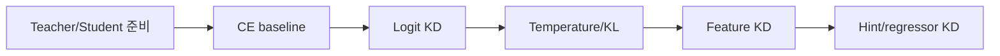

# On-Device AI Practice 03 — Knowledge Distillation 셀별 코드 학습 가이드

> 오른쪽에는 원본 노트북 HTML을 띄우고, 왼쪽은 **모든 셀을 따라가는 해설 지도**로 쓴다. 이 문서는 원본 코드를 대체하지 않고, 각 셀이 왜 필요한지/무슨 shape로 움직이는지/직접 구현할 때 어디를 봐야 하는지 설명한다.

- 기준 교안: `ODAI-1 Chapter 4 Knowledge Distillation`
- 원본 노트북: `On-Device AI 강의자료/실습/3. Knowledge Distillation.ipynb`
- 학습 목표: 큰 teacher의 logits/feature 표현을 작은 student에 전달하는 KD 손실을 직접 구현하고 CE 학습과 비교한다.

## 0. 그림으로 먼저 잡기

### 실습 전체에서 계속 붙잡을 수식

$\mathcal{L}=\alpha T^2 KL(p_T^t\Vert p_T^s)+(1-\alpha)CE(y,p^s)$

### 핵심 shape 표

| 대상 | Shape / 표현 | 의미 |
|---|---|---|
| image batch | `[B, 3, 32, 32]` | CIFAR-10 입력 |
| logits | `[B, 10]` | teacher/student class score |
| soft targets | `softmax(logits/T)` | class 간 유사도 정보 |
| feature map | `[B, C, H, W]` | representation-level KD 대상 |

## 1. 노트북 전체 지도

| 구간 | 셀 범위 | 오른쪽에서 보이는 제목 | 여기서 잡아야 할 것 |
|---:|---:|---|---|
| 1 | 001-001 | Assignment 3. Knowledge Distillation | distillation |
| 2 | 002-002 | Goals | teacher, student, distillation, temperature |
| 3 | 003-004 | Environment Setup | CIFAR-10 데이터, distillation, OPT |
| 4 | 005-007 | Data Loading: CIFAR-10 | 재현성, CIFAR-10 데이터, DataLoader, distillation |
| 5 | 008-009 | Load Pretrained Model Weights (VGG on CIFAR-10) | CIFAR-10 데이터, VGG 모델, teacher, distillation |
| 6 | 010-011 | Define Teacher and Student Models | 재현성, CIFAR-10 데이터, VGG 모델, fine-grained |
| 7 | 012-012 | 3.1. Baseline 학습 (Cross-Entropy Loss) | 변수 흐름, shape, 평가값 |
| 8 | 013-014 | Train & Test Functions | 학습 루프, 모델 크기, vector-level, 스케줄링 |
| 9 | 015-016 | Load & Evaluate Teacher Model | CIFAR-10 데이터, VGG 모델, 평가 루프, teacher |
| 10 | 017-018 | 모델 초기화 일관성 확인 | CIFAR-10 데이터, VGG 모델, student, distillation |
| 11 | 019-020 | 모델 파라미터 수 비교 | 모델 크기, teacher, student, distillation |
| 12 | 021-022 | Student 모델 단독 학습 (Cross-Entropy Only) | CIFAR-10 데이터, VGG 모델, 학습 루프, teacher |
| 13 | 023-024 | 정확도 결과 요약 | teacher, student |
| 14 | 025-025 | 3.2. Knowledge Distillation (Soft Targets) | distillation |
| 15 | 026-027 | [실습 1] Knowledge Distillation 학습 함수 정의 | 학습 루프, 모델 크기, 스케줄링, scale |
| 16 | 028-029 | Knowledge Distillation 학습 수행 | CIFAR-10 데이터, VGG 모델, teacher, student |
| 17 | 030-031 | 정확도 결과 요약 | teacher, student |
| 18 | 032-032 | 3.3. Cosine Loss Minimization (Cosine Loss) | cosine feature loss |
| 19 | 033-034 | Cosine Similarity 기반 KD 모델 정의 | 재현성, CIFAR-10 데이터, VGG 모델, teacher |
| 20 | 035-036 | Cosine Loss 기반 KD를 위한 모델 초기화 | CIFAR-10 데이터, VGG 모델, teacher, student |
| 21 | 037-038 | Cosine Distillation을 위한 Representation 차원 확인 | vector-level, teacher, student, distillation |
| 22 | 039-040 | [실습 2] Cosine Similarity 기반 KD 학습 함수 정의 | 학습 루프, 모델 크기, vector-level, 스케줄링 |
| 23 | 041-042 | Cosine Similarity 기반 Knowledge Distillation 실험 | CIFAR-10 데이터, VGG 모델, vector-level, teacher |
| 24 | 043-044 | 정확도 결과 요약 | teacher, student, cosine feature loss |
| 25 | 045-045 | 3.4. Intermediate Regressor (Regressor + MSE) | MSE feature loss |
| 26 | 046-047 | Feature Map Shape 비교 | teacher, student, distillation, MSE feature loss |
| 27 | 048-049 | Hint-based KD를 위한 Regressor 포함 모델 정의 | 재현성, CIFAR-10 데이터, VGG 모델, teacher |
| 28 | 050-051 | Hint-based KD용 Teacher 모델 초기화 및 가중치 로딩 | CIFAR-10 데이터, VGG 모델, teacher, distillation |
| 29 | 052-053 | [실습 3] Hint-based Knowledge Distillation 학습 함수 정의 (MSE Loss 기반) | 학습 루프, 모델 크기, 스케줄링, zero-point |
| 30 | 054-055 | Hint-based KD (Regressor + MSE Loss) 실험 | CIFAR-10 데이터, VGG 모델, teacher, student |
| 31 | 056-057 | 정확도 결과 요약 | teacher, student, cosine feature loss, MSE feature loss |

## 2. 셀별 Walkthrough

아래 번호는 오른쪽 노트북의 cell 순서와 맞춘 것이다. Markdown 셀도 건너뛰지 않는다. Markdown 셀은 바로 다음 코드가 어떤 문제를 푸는지 정의하는 경우가 많기 때문이다.

### Cell 001 · Markdown · Assignment 3. Knowledge Distillation

- **현재 구간**: Assignment 3. Knowledge Distillation
- **오른쪽에서 읽을 내용**: # Assignment 3. Knowledge Distillation
- **무슨 작업인가**:
  - 이 셀은 뒤 코드가 왜 필요한지 알려주는 설명/문제 정의 셀이다. 오른쪽 노트북의 문장을 그냥 넘기지 말고, 바로 아래 코드 셀에서 어떤 변수·함수·측정값으로 구현되는지 연결해서 본다.
  - KD에서는 teacher가 만든 부드러운 확률분포나 feature를 student의 학습 신호로 쓴다. label 하나만 보는 CE보다 class 간 관계를 더 많이 전달한다.
- **수학/shape 관점**:
  - $\mathcal{L}=\alpha T^2 KL(p_T^t\Vert p_T^s)+(1-\alpha)CE(y,p^s)$
- **직접 구현할 때 체크**:
  - 이 셀 실행 후 새로 생긴 변수 1~2개를 다음 셀이 어떻게 사용하는지 추적한다.

### Cell 002 · Markdown · Goals

- **현재 구간**: Goals
- **오른쪽에서 읽을 내용**: ## Goals 이 실습의 목적은 **Knowledge Distillation**을 활용하여, 작은 모델(Student)이 큰 모델(Teacher)의 지식을 효과적으로 학습하는 방법을 이해하고 실험을 통해 비교하는 것입니다. ## Contents 1. **Baseline 학습 (Cross-Entropy Loss)** - Teacher 모델과 Student 모델을 각각 Cross-Entropy Loss만으로 학습시켜 정확도를 비교합니다. 2. **Knowledge Distillation (Soft Targets)** - Teacher의 softmax 출력을 활용한 Knowledge Distillation을 적용하고, temperature …
- **무슨 작업인가**:
  - 이 셀은 뒤 코드가 왜 필요한지 알려주는 설명/문제 정의 셀이다. 오른쪽 노트북의 문장을 그냥 넘기지 말고, 바로 아래 코드 셀에서 어떤 변수·함수·측정값으로 구현되는지 연결해서 본다.
  - KD에서는 teacher가 만든 부드러운 확률분포나 feature를 student의 학습 신호로 쓴다. label 하나만 보는 CE보다 class 간 관계를 더 많이 전달한다.
  - temperature `T`가 커지면 softmax가 완만해져 “2등/3등 class가 얼마나 그럴듯한지”가 드러난다. KL 손실에는 보통 `T^2` 보정이 붙는다.
  - feature-level KD는 logits뿐 아니라 중간 representation을 맞춘다. teacher/student 채널 수가 다르면 regressor로 shape를 맞춘 뒤 MSE/Cosine 손실을 적용한다.
- **수학/shape 관점**:
  - CNN 쪽 tensor는 이미지 `[B,3,32,32]`, feature map `[B,C,H,W]`, conv weight `[C_out,C_in,K_h,K_w]`로 읽는다.
  - logits `[B,num_classes]`에 softmax를 적용하면 class 확률분포가 된다. temperature는 softmax 전 logits를 `T`로 나누는 조절값이다.
- **직접 구현할 때 체크**:
  - 이 셀 실행 후 새로 생긴 변수 1~2개를 다음 셀이 어떻게 사용하는지 추적한다.

### Cell 003 · Markdown · Environment Setup

- **현재 구간**: Environment Setup
- **오른쪽에서 읽을 내용**: # Environment Setup 본 실습에서는 PyTorch와 Torchvision을 활용하여 Knowledge Distillation을 구현합니다. 먼저 필요한 라이브러리를 import하고, 실행 환경(GPU/CPU)을 설정합니다. ## Import Modules - `torch`, `torch.nn`, `torch.optim`: PyTorch의 핵심 기능 및 신경망, 최적화 알고리즘 - `torchvision.transforms`, `torchvision.datasets`: CIFAR-10 데이터셋 로딩 및 전처리를 위한 모듈 - `collections.OrderedDict`: 이후에 모델 구조 정의 시 순서를 보장하기 위한 di…
- **무슨 작업인가**:
  - 이 셀은 뒤 코드가 왜 필요한지 알려주는 설명/문제 정의 셀이다. 오른쪽 노트북의 문장을 그냥 넘기지 말고, 바로 아래 코드 셀에서 어떤 변수·함수·측정값으로 구현되는지 연결해서 본다.
  - 데이터셋을 mini-batch 단위로 모델에 공급한다. CNN은 이미지 batch `[B,3,32,32]`, LLM은 token sequence `[B,T]`로 들어간다는 점을 구분한다.
  - KD에서는 teacher가 만든 부드러운 확률분포나 feature를 student의 학습 신호로 쓴다. label 하나만 보는 CE보다 class 간 관계를 더 많이 전달한다.
- **수학/shape 관점**:
  - CNN 쪽 tensor는 이미지 `[B,3,32,32]`, feature map `[B,C,H,W]`, conv weight `[C_out,C_in,K_h,K_w]`로 읽는다.
  - Linear layer는 보통 `Y=XW^T+b`로 동작한다. LLM에서 `X`는 `[B,T,d_in]`, `W`는 `[d_out,d_in]`로 보면 된다.
- **직접 구현할 때 체크**:
  - 이 셀 실행 후 새로 생긴 변수 1~2개를 다음 셀이 어떻게 사용하는지 추적한다.

### Cell 004 · Code · import torch import torch.nn as nn import torch.optim as optim import torchvision.transforms as transforms import torchvision.datasets as datasets from collections import OrderedDict

- **현재 구간**: Environment Setup
- **오른쪽에서 볼 코드**: `import torch import torch.nn as nn import torch.optim as optim import torchvision.transforms as transforms import torchvision.datasets as datasets from collections import OrderedDict`
- **무슨 작업인가**:
  - 이 셀은 설명을 실제 PyTorch/Python 연산으로 바꾸는 실행 단위다. 실행 전후로 생성되는 변수, tensor shape, 모델 상태 변경 여부를 확인한다.
  - 핵심 키워드: OPT. 이 셀에서 해당 키워드가 코드 변수/함수로 어떻게 구현되는지 오른쪽 노트북에서 확인한다.
- **수학/shape 관점**:
  - Linear layer는 보통 `Y=XW^T+b`로 동작한다. LLM에서 `X`는 `[B,T,d_in]`, `W`는 `[d_out,d_in]`로 보면 된다.
- **직접 구현할 때 체크**:
  - 이 셀 실행 후 새로 생긴 변수 1~2개를 다음 셀이 어떻게 사용하는지 추적한다.
- **키워드**: OPT

### Cell 005 · Markdown · Data Loading: CIFAR-10

- **현재 구간**: Data Loading: CIFAR-10
- **오른쪽에서 읽을 내용**: ## Data Loading: CIFAR-10 본 실습에서는 CIFAR-10 데이터셋을 사용하여 Knowledge Distillation의 효과를 검증합니다. CIFAR-10은 10개의 클래스로 구성된 32x32 크기의 컬러 이미지 데이터셋입니다.
- **무슨 작업인가**:
  - 이 셀은 뒤 코드가 왜 필요한지 알려주는 설명/문제 정의 셀이다. 오른쪽 노트북의 문장을 그냥 넘기지 말고, 바로 아래 코드 셀에서 어떤 변수·함수·측정값으로 구현되는지 연결해서 본다.
  - 데이터셋을 mini-batch 단위로 모델에 공급한다. CNN은 이미지 batch `[B,3,32,32]`, LLM은 token sequence `[B,T]`로 들어간다는 점을 구분한다.
  - KD에서는 teacher가 만든 부드러운 확률분포나 feature를 student의 학습 신호로 쓴다. label 하나만 보는 CE보다 class 간 관계를 더 많이 전달한다.
- **수학/shape 관점**:
  - CNN 쪽 tensor는 이미지 `[B,3,32,32]`, feature map `[B,C,H,W]`, conv weight `[C_out,C_in,K_h,K_w]`로 읽는다.
- **직접 구현할 때 체크**:
  - 이 셀 실행 후 새로 생긴 변수 1~2개를 다음 셀이 어떻게 사용하는지 추적한다.

### Cell 006 · Code · Below we are preprocessing data for CIFAR-10. We use an arbitrary batch size of 128.

- **현재 구간**: Data Loading: CIFAR-10
- **오른쪽에서 볼 코드**: `transforms_cifar = transforms.Compose([ / train_dataset = datasets.CIFAR10(root='D:\\data', train=True, download=True, transform=transforms_cifar) / test_dataset = datasets.CIFAR10(root='D:\\data', train=False, download=`
- **무슨 작업인가**:
  - 이 셀은 설명을 실제 PyTorch/Python 연산으로 바꾸는 실행 단위다. 실행 전후로 생성되는 변수, tensor shape, 모델 상태 변경 여부를 확인한다.
  - 데이터셋을 mini-batch 단위로 모델에 공급한다. CNN은 이미지 batch `[B,3,32,32]`, LLM은 token sequence `[B,T]`로 들어간다는 점을 구분한다.
  - 학습/미세조정 루프다. forward → loss → backward → optimizer step 순서이며, pruning이면 step 이후 mask 유지, KD면 여러 loss 항의 비율을 확인한다.
- **수학/shape 관점**:
  - CNN 쪽 tensor는 이미지 `[B,3,32,32]`, feature map `[B,C,H,W]`, conv weight `[C_out,C_in,K_h,K_w]`로 읽는다.
- **직접 구현할 때 체크**:
  - 이 셀 실행 후 새로 생긴 변수 1~2개를 다음 셀이 어떻게 사용하는지 추적한다.
- **키워드**: CIFAR-10 데이터, DataLoader

### Cell 007 · Code · 시드 고정

- **현재 구간**: Data Loading: CIFAR-10
- **오른쪽에서 볼 코드**: `def set_seed(seed=44): / torch.backends.cudnn.deterministic = True / torch.backends.cudnn.benchmark = False`
- **정의되는 함수**: `set_seed, get_train_loader`
- **무슨 작업인가**:
  - 이 셀은 설명을 실제 PyTorch/Python 연산으로 바꾸는 실행 단위다. 실행 전후로 생성되는 변수, tensor shape, 모델 상태 변경 여부를 확인한다.
  - 난수 seed를 고정한다. pruning threshold, data augmentation, optimizer 순서가 바뀌면 비교가 흔들리므로 baseline과 실험 조건을 고정하는 역할이다.
  - 데이터셋을 mini-batch 단위로 모델에 공급한다. CNN은 이미지 batch `[B,3,32,32]`, LLM은 token sequence `[B,T]`로 들어간다는 점을 구분한다.
  - 학습/미세조정 루프다. forward → loss → backward → optimizer step 순서이며, pruning이면 step 이후 mask 유지, KD면 여러 loss 항의 비율을 확인한다.
- **수학/shape 관점**:
  - $\mathcal{L}=\alpha T^2 KL(p_T^t\Vert p_T^s)+(1-\alpha)CE(y,p^s)$
- **직접 구현할 때 체크**:
  - 입력 tensor와 model parameter가 같은 device에 있는지 확인한다. CPU/GPU mismatch는 이 실습에서 흔한 오류다.
- **키워드**: 재현성, DataLoader

### Cell 008 · Markdown · Load Pretrained Model Weights (VGG on CIFAR-10)

- **현재 구간**: Load Pretrained Model Weights (VGG on CIFAR-10)
- **오른쪽에서 읽을 내용**: ## Load Pretrained Model Weights (VGG on CIFAR-10) Knowledge Distillation에서 중요한 전제는 **강력한 성능을 가진 Teacher 모델**이 존재한다는 것입니다. 본 코드에서는 사전에 학습된 VGG 모델의 가중치를 불러와 Teacher 모델로 사용할 준비를 합니다.
- **무슨 작업인가**:
  - 이 셀은 뒤 코드가 왜 필요한지 알려주는 설명/문제 정의 셀이다. 오른쪽 노트북의 문장을 그냥 넘기지 말고, 바로 아래 코드 셀에서 어떤 변수·함수·측정값으로 구현되는지 연결해서 본다.
  - 데이터셋을 mini-batch 단위로 모델에 공급한다. CNN은 이미지 batch `[B,3,32,32]`, LLM은 token sequence `[B,T]`로 들어간다는 점을 구분한다.
  - 학습/미세조정 루프다. forward → loss → backward → optimizer step 순서이며, pruning이면 step 이후 mask 유지, KD면 여러 loss 항의 비율을 확인한다.
  - KD에서는 teacher가 만든 부드러운 확률분포나 feature를 student의 학습 신호로 쓴다. label 하나만 보는 CE보다 class 간 관계를 더 많이 전달한다.
- **수학/shape 관점**:
  - CNN 쪽 tensor는 이미지 `[B,3,32,32]`, feature map `[B,C,H,W]`, conv weight `[C_out,C_in,K_h,K_w]`로 읽는다.
- **직접 구현할 때 체크**:
  - 이 셀 실행 후 새로 생긴 변수 1~2개를 다음 셀이 어떻게 사용하는지 추적한다.

### Cell 009 · Code · state_dict_url = "https://github.com/SKKU-ESLAB/pytorch-models/releases/download/samsung/vgg.cifar.pretrained.pth" / state_dict = torch.hub.load_state_dict_from_url(state_dict_url, progress=True) / state_dict = state_dic

- **현재 구간**: Load Pretrained Model Weights (VGG on CIFAR-10)
- **오른쪽에서 볼 코드**: `state_dict_url = "https://github.com/SKKU-ESLAB/pytorch-models/releases/download/samsung/vgg.cifar.pretrained.pth" / state_dict = torch.hub.load_state_dict_from_url(state_dict_url, progress=True) / state_dict = state_dic`
- **무슨 작업인가**:
  - 이 셀은 설명을 실제 PyTorch/Python 연산으로 바꾸는 실행 단위다. 실행 전후로 생성되는 변수, tensor shape, 모델 상태 변경 여부를 확인한다.
  - 데이터셋을 mini-batch 단위로 모델에 공급한다. CNN은 이미지 batch `[B,3,32,32]`, LLM은 token sequence `[B,T]`로 들어간다는 점을 구분한다.
  - 학습/미세조정 루프다. forward → loss → backward → optimizer step 순서이며, pruning이면 step 이후 mask 유지, KD면 여러 loss 항의 비율을 확인한다.
- **수학/shape 관점**:
  - CNN 쪽 tensor는 이미지 `[B,3,32,32]`, feature map `[B,C,H,W]`, conv weight `[C_out,C_in,K_h,K_w]`로 읽는다.
- **직접 구현할 때 체크**:
  - 이 셀 실행 후 새로 생긴 변수 1~2개를 다음 셀이 어떻게 사용하는지 추적한다.
- **키워드**: CIFAR-10 데이터, VGG 모델

### Cell 010 · Markdown · Define Teacher and Student Models

- **현재 구간**: Define Teacher and Student Models
- **오른쪽에서 읽을 내용**: ## Define Teacher and Student Models Knowledge Distillation 실험을 위해 두 개의 모델 구조를 정의합니다. 두 모델은 VGG 스타일의 CNN 구조를 기반으로 하며, **Teacher (VGGCifar9)** 모델은 더 깊고 복잡한 구조, **Student (VGGCifar5)** 모델은 간단한 구조로 설계되어 있습니다.
- **무슨 작업인가**:
  - 이 셀은 뒤 코드가 왜 필요한지 알려주는 설명/문제 정의 셀이다. 오른쪽 노트북의 문장을 그냥 넘기지 말고, 바로 아래 코드 셀에서 어떤 변수·함수·측정값으로 구현되는지 연결해서 본다.
  - 데이터셋을 mini-batch 단위로 모델에 공급한다. CNN은 이미지 batch `[B,3,32,32]`, LLM은 token sequence `[B,T]`로 들어간다는 점을 구분한다.
  - KD에서는 teacher가 만든 부드러운 확률분포나 feature를 student의 학습 신호로 쓴다. label 하나만 보는 CE보다 class 간 관계를 더 많이 전달한다.
- **수학/shape 관점**:
  - CNN 쪽 tensor는 이미지 `[B,3,32,32]`, feature map `[B,C,H,W]`, conv weight `[C_out,C_in,K_h,K_w]`로 읽는다.
- **직접 구현할 때 체크**:
  - 이 셀 실행 후 새로 생긴 변수 1~2개를 다음 셀이 어떻게 사용하는지 추적한다.

### Cell 011 · Code · class VGGCifar9(nn.Module): / def __init__(self) -> None: / self.backbone = nn.Sequential(OrderedDict([

- **현재 구간**: Define Teacher and Student Models
- **오른쪽에서 볼 코드**: `class VGGCifar9(nn.Module): / def __init__(self) -> None: / self.backbone = nn.Sequential(OrderedDict([`
- **정의되는 class**: `VGGCifar9, VGGCifar5`
- **무슨 작업인가**:
  - 이 셀은 설명을 실제 PyTorch/Python 연산으로 바꾸는 실행 단위다. 실행 전후로 생성되는 변수, tensor shape, 모델 상태 변경 여부를 확인한다.
  - 난수 seed를 고정한다. pruning threshold, data augmentation, optimizer 순서가 바뀌면 비교가 흔들리므로 baseline과 실험 조건을 고정하는 역할이다.
  - 데이터셋을 mini-batch 단위로 모델에 공급한다. CNN은 이미지 batch `[B,3,32,32]`, LLM은 token sequence `[B,T]`로 들어간다는 점을 구분한다.
- **수학/shape 관점**:
  - CNN 쪽 tensor는 이미지 `[B,3,32,32]`, feature map `[B,C,H,W]`, conv weight `[C_out,C_in,K_h,K_w]`로 읽는다.
  - Linear layer는 보통 `Y=XW^T+b`로 동작한다. LLM에서 `X`는 `[B,T,d_in]`, `W`는 `[d_out,d_in]`로 보면 된다.
- **직접 구현할 때 체크**:
  - 이 셀 실행 후 새로 생긴 변수 1~2개를 다음 셀이 어떻게 사용하는지 추적한다.
- **키워드**: 재현성, CIFAR-10 데이터, VGG 모델, Linear layer

### Cell 012 · Markdown · 3.1. Baseline 학습 (Cross-Entropy Loss)

- **현재 구간**: 3.1. Baseline 학습 (Cross-Entropy Loss)
- **오른쪽에서 읽을 내용**: # 3.1. Baseline 학습 (Cross-Entropy Loss)
- **무슨 작업인가**:
  - 이 셀은 뒤 코드가 왜 필요한지 알려주는 설명/문제 정의 셀이다. 오른쪽 노트북의 문장을 그냥 넘기지 말고, 바로 아래 코드 셀에서 어떤 변수·함수·측정값으로 구현되는지 연결해서 본다.
  - 주변 셀과 이어지는 보조 단계다. 새로 생기는 변수 이름과 다음 셀에서 소비되는 값을 연결해서 보면 흐름이 끊기지 않는다.
- **수학/shape 관점**:
  - $\mathcal{L}=\alpha T^2 KL(p_T^t\Vert p_T^s)+(1-\alpha)CE(y,p^s)$
- **직접 구현할 때 체크**:
  - 이 셀 실행 후 새로 생긴 변수 1~2개를 다음 셀이 어떻게 사용하는지 추적한다.

### Cell 013 · Markdown · Train & Test Functions

- **현재 구간**: Train & Test Functions
- **오른쪽에서 읽을 내용**: ## Train & Test Functions 학습 및 검증은 아래 두 함수로 수행되며, Student/Teacher 모델 모두 동일한 루프 구조를 따릅니다.
- **무슨 작업인가**:
  - 이 셀은 뒤 코드가 왜 필요한지 알려주는 설명/문제 정의 셀이다. 오른쪽 노트북의 문장을 그냥 넘기지 말고, 바로 아래 코드 셀에서 어떤 변수·함수·측정값으로 구현되는지 연결해서 본다.
  - 학습/미세조정 루프다. forward → loss → backward → optimizer step 순서이며, pruning이면 step 이후 mask 유지, KD면 여러 loss 항의 비율을 확인한다.
  - KD에서는 teacher가 만든 부드러운 확률분포나 feature를 student의 학습 신호로 쓴다. label 하나만 보는 CE보다 class 간 관계를 더 많이 전달한다.
- **수학/shape 관점**:
  - $\mathcal{L}=\alpha T^2 KL(p_T^t\Vert p_T^s)+(1-\alpha)CE(y,p^s)$
- **직접 구현할 때 체크**:
  - 이 셀 실행 후 새로 생긴 변수 1~2개를 다음 셀이 어떻게 사용하는지 추적한다.

### Cell 014 · Code · def train(model, / criterion = nn.CrossEntropyLoss() / optimizer = optim.Adam(model.parameters(), lr=learning_rate)

- **현재 구간**: Train & Test Functions
- **오른쪽에서 볼 코드**: `def train(model, / criterion = nn.CrossEntropyLoss() / optimizer = optim.Adam(model.parameters(), lr=learning_rate)`
- **정의되는 함수**: `train, test`
- **무슨 작업인가**:
  - 이 셀은 설명을 실제 PyTorch/Python 연산으로 바꾸는 실행 단위다. 실행 전후로 생성되는 변수, tensor shape, 모델 상태 변경 여부를 확인한다.
  - 모델 품질을 숫자로 고정하는 평가 루프다. CNN은 accuracy, LLM은 PPL을 주로 본다. 압축 실험에서는 압축률만큼이나 이 기준값의 변화량이 중요하다.
  - 학습/미세조정 루프다. forward → loss → backward → optimizer step 순서이며, pruning이면 step 이후 mask 유지, KD면 여러 loss 항의 비율을 확인한다.
  - structured pruning 단위가 커질수록 실제 tensor 차원을 줄이거나 0-vector를 건너뛰기 쉬워진다. 대신 한 번에 제거되는 정보량이 커져 정확도 손실 위험이 커진다.
  - quantization은 실수 범위를 정수 grid로 근사한다. `scale`은 grid 간격, `zero_point`는 실수 0이 대응되는 정수 위치다.
- **수학/shape 관점**:
  - Linear layer는 보통 `Y=XW^T+b`로 동작한다. LLM에서 `X`는 `[B,T,d_in]`, `W`는 `[d_out,d_in]`로 보면 된다.
  - quantization에서는 실수 tensor 자체보다 `(integer tensor, scale, zero_point/group_size)` 묶음이 실제 표현이다.
- **직접 구현할 때 체크**:
  - 입력 tensor와 model parameter가 같은 device에 있는지 확인한다. CPU/GPU mismatch는 이 실습에서 흔한 오류다.
  - 평가/압축 적용 단계에서는 gradient를 끄는 이유를 확인한다. 메모리 절약과 accidental gradient 방지를 위한 장치다.
- **키워드**: 학습 루프, 모델 크기, vector-level, 스케줄링, zero-point, cosine feature loss

### Cell 015 · Markdown · Load & Evaluate Teacher Model

- **현재 구간**: Load & Evaluate Teacher Model
- **오른쪽에서 읽을 내용**: ## Load & Evaluate Teacher Model Knowledge Distillation의 기준이 되는 **Teacher 모델(VGGCifar9)** 을 초기화하고, 앞서 불러온 pretrained 가중치를 적용합니다. 이후, CIFAR-10 test set에 대해 성능을 평가합니다.
- **무슨 작업인가**:
  - 이 셀은 뒤 코드가 왜 필요한지 알려주는 설명/문제 정의 셀이다. 오른쪽 노트북의 문장을 그냥 넘기지 말고, 바로 아래 코드 셀에서 어떤 변수·함수·측정값으로 구현되는지 연결해서 본다.
  - 데이터셋을 mini-batch 단위로 모델에 공급한다. CNN은 이미지 batch `[B,3,32,32]`, LLM은 token sequence `[B,T]`로 들어간다는 점을 구분한다.
  - 모델 품질을 숫자로 고정하는 평가 루프다. CNN은 accuracy, LLM은 PPL을 주로 본다. 압축 실험에서는 압축률만큼이나 이 기준값의 변화량이 중요하다.
  - 학습/미세조정 루프다. forward → loss → backward → optimizer step 순서이며, pruning이면 step 이후 mask 유지, KD면 여러 loss 항의 비율을 확인한다.
  - KD에서는 teacher가 만든 부드러운 확률분포나 feature를 student의 학습 신호로 쓴다. label 하나만 보는 CE보다 class 간 관계를 더 많이 전달한다.
- **수학/shape 관점**:
  - CNN 쪽 tensor는 이미지 `[B,3,32,32]`, feature map `[B,C,H,W]`, conv weight `[C_out,C_in,K_h,K_w]`로 읽는다.
- **직접 구현할 때 체크**:
  - 이 셀 실행 후 새로 생긴 변수 1~2개를 다음 셀이 어떻게 사용하는지 추적한다.

### Cell 016 · Code · teacher_model = VGGCifar9().cuda() / test_accuracy_teacher = test(teacher_model, test_loader)

- **현재 구간**: Load & Evaluate Teacher Model
- **오른쪽에서 볼 코드**: `teacher_model = VGGCifar9().cuda() / test_accuracy_teacher = test(teacher_model, test_loader)`
- **무슨 작업인가**:
  - 이 셀은 설명을 실제 PyTorch/Python 연산으로 바꾸는 실행 단위다. 실행 전후로 생성되는 변수, tensor shape, 모델 상태 변경 여부를 확인한다.
  - 데이터셋을 mini-batch 단위로 모델에 공급한다. CNN은 이미지 batch `[B,3,32,32]`, LLM은 token sequence `[B,T]`로 들어간다는 점을 구분한다.
  - 모델 품질을 숫자로 고정하는 평가 루프다. CNN은 accuracy, LLM은 PPL을 주로 본다. 압축 실험에서는 압축률만큼이나 이 기준값의 변화량이 중요하다.
  - KD에서는 teacher가 만든 부드러운 확률분포나 feature를 student의 학습 신호로 쓴다. label 하나만 보는 CE보다 class 간 관계를 더 많이 전달한다.
- **수학/shape 관점**:
  - CNN 쪽 tensor는 이미지 `[B,3,32,32]`, feature map `[B,C,H,W]`, conv weight `[C_out,C_in,K_h,K_w]`로 읽는다.
- **직접 구현할 때 체크**:
  - 입력 tensor와 model parameter가 같은 device에 있는지 확인한다. CPU/GPU mismatch는 이 실습에서 흔한 오류다.
- **키워드**: CIFAR-10 데이터, VGG 모델, teacher

### Cell 017 · Markdown · 모델 초기화 일관성 확인

- **현재 구간**: 모델 초기화 일관성 확인
- **오른쪽에서 읽을 내용**: ## 모델 초기화 일관성 확인 Knowledge Distillation 실험에서 **공정한 비교**를 위해 Student 모델의 초기화 상태가 동일한지 확인하는 과정입니다. 여기서는 동일한 구조를 가진 두 개의 `VGGCifar5` 모델을 생성하고, 첫 번째 convolution layer의 weight norm을 비교합니다.
- **무슨 작업인가**:
  - 이 셀은 뒤 코드가 왜 필요한지 알려주는 설명/문제 정의 셀이다. 오른쪽 노트북의 문장을 그냥 넘기지 말고, 바로 아래 코드 셀에서 어떤 변수·함수·측정값으로 구현되는지 연결해서 본다.
  - 데이터셋을 mini-batch 단위로 모델에 공급한다. CNN은 이미지 batch `[B,3,32,32]`, LLM은 token sequence `[B,T]`로 들어간다는 점을 구분한다.
  - KD에서는 teacher가 만든 부드러운 확률분포나 feature를 student의 학습 신호로 쓴다. label 하나만 보는 CE보다 class 간 관계를 더 많이 전달한다.
- **수학/shape 관점**:
  - CNN 쪽 tensor는 이미지 `[B,3,32,32]`, feature map `[B,C,H,W]`, conv weight `[C_out,C_in,K_h,K_w]`로 읽는다.
- **직접 구현할 때 체크**:
  - 이 셀 실행 후 새로 생긴 변수 1~2개를 다음 셀이 어떻게 사용하는지 추적한다.

### Cell 018 · Code · Print the norm of the first layer of the initial lightweight model

- **현재 구간**: 모델 초기화 일관성 확인
- **오른쪽에서 볼 코드**: `student_model = VGGCifar5().cuda() / print("Norm of 1st layer of student_model:", torch.norm(student_model.backbone[0].weight).item()) / student_model_2 = VGGCifar5().cuda()`
- **무슨 작업인가**:
  - 이 셀은 설명을 실제 PyTorch/Python 연산으로 바꾸는 실행 단위다. 실행 전후로 생성되는 변수, tensor shape, 모델 상태 변경 여부를 확인한다.
  - 데이터셋을 mini-batch 단위로 모델에 공급한다. CNN은 이미지 batch `[B,3,32,32]`, LLM은 token sequence `[B,T]`로 들어간다는 점을 구분한다.
  - KD에서는 teacher가 만든 부드러운 확률분포나 feature를 student의 학습 신호로 쓴다. label 하나만 보는 CE보다 class 간 관계를 더 많이 전달한다.
- **수학/shape 관점**:
  - CNN 쪽 tensor는 이미지 `[B,3,32,32]`, feature map `[B,C,H,W]`, conv weight `[C_out,C_in,K_h,K_w]`로 읽는다.
- **직접 구현할 때 체크**:
  - 입력 tensor와 model parameter가 같은 device에 있는지 확인한다. CPU/GPU mismatch는 이 실습에서 흔한 오류다.
- **키워드**: CIFAR-10 데이터, VGG 모델, student

### Cell 019 · Markdown · 모델 파라미터 수 비교

- **현재 구간**: 모델 파라미터 수 비교
- **오른쪽에서 읽을 내용**: ## 모델 파라미터 수 비교 Teacher와 Student 모델 간의 **복잡도 차이**를 수치적으로 비교하기 위해 전체 파라미터 개수를 출력합니다. 이는 Knowledge Distillation의 핵심 가정인 "*성능은 높지만 무거운 Teacher → 가볍고 빠른 Student로 지식 이전*"을 정량적으로 뒷받침하는 자료가 됩니다.
- **무슨 작업인가**:
  - 이 셀은 뒤 코드가 왜 필요한지 알려주는 설명/문제 정의 셀이다. 오른쪽 노트북의 문장을 그냥 넘기지 말고, 바로 아래 코드 셀에서 어떤 변수·함수·측정값으로 구현되는지 연결해서 본다.
  - KD에서는 teacher가 만든 부드러운 확률분포나 feature를 student의 학습 신호로 쓴다. label 하나만 보는 CE보다 class 간 관계를 더 많이 전달한다.
- **수학/shape 관점**:
  - $\mathcal{L}=\alpha T^2 KL(p_T^t\Vert p_T^s)+(1-\alpha)CE(y,p^s)$
- **직접 구현할 때 체크**:
  - 이 셀 실행 후 새로 생긴 변수 1~2개를 다음 셀이 어떻게 사용하는지 추적한다.

### Cell 020 · Code · total_params_teacher = "{:,}".format(sum(p.numel() for p in teacher_model.parameters())) / print(f"Teaher model parameters: {total_params_teacher}") / total_params_student = "{:,}".format(sum(p.numel() for p in student_m

- **현재 구간**: 모델 파라미터 수 비교
- **오른쪽에서 볼 코드**: `total_params_teacher = "{:,}".format(sum(p.numel() for p in teacher_model.parameters())) / print(f"Teaher model parameters: {total_params_teacher}") / total_params_student = "{:,}".format(sum(p.numel() for p in student_m`
- **무슨 작업인가**:
  - 이 셀은 설명을 실제 PyTorch/Python 연산으로 바꾸는 실행 단위다. 실행 전후로 생성되는 변수, tensor shape, 모델 상태 변경 여부를 확인한다.
  - KD에서는 teacher가 만든 부드러운 확률분포나 feature를 student의 학습 신호로 쓴다. label 하나만 보는 CE보다 class 간 관계를 더 많이 전달한다.
- **수학/shape 관점**:
  - $\mathcal{L}=\alpha T^2 KL(p_T^t\Vert p_T^s)+(1-\alpha)CE(y,p^s)$
- **직접 구현할 때 체크**:
  - 이 셀 실행 후 새로 생긴 변수 1~2개를 다음 셀이 어떻게 사용하는지 추적한다.
- **키워드**: 모델 크기, teacher, student

### Cell 021 · Markdown · Student 모델 단독 학습 (Cross-Entropy Only)

- **현재 구간**: Student 모델 단독 학습 (Cross-Entropy Only)
- **오른쪽에서 읽을 내용**: ## Student 모델 단독 학습 (Cross-Entropy Only) 본 단계에서는 Student 모델을 **Teacher의 도움 없이** 단독으로 학습시킵니다. 이 실험은 이후 Knowledge Distillation을 적용했을 때 얼마나 성능이 향상되는지를 비교하기 위한 **Baseline** 성능을 확보하는 과정입니다.
- **무슨 작업인가**:
  - 이 셀은 뒤 코드가 왜 필요한지 알려주는 설명/문제 정의 셀이다. 오른쪽 노트북의 문장을 그냥 넘기지 말고, 바로 아래 코드 셀에서 어떤 변수·함수·측정값으로 구현되는지 연결해서 본다.
  - KD에서는 teacher가 만든 부드러운 확률분포나 feature를 student의 학습 신호로 쓴다. label 하나만 보는 CE보다 class 간 관계를 더 많이 전달한다.
- **수학/shape 관점**:
  - $\mathcal{L}=\alpha T^2 KL(p_T^t\Vert p_T^s)+(1-\alpha)CE(y,p^s)$
- **직접 구현할 때 체크**:
  - 이 셀 실행 후 새로 생긴 변수 1~2개를 다음 셀이 어떻게 사용하는지 추적한다.

### Cell 022 · Code · student_model = VGGCifar5().cuda() / test_accuracy_student_ce = test(student_model, test_loader)

- **현재 구간**: Student 모델 단독 학습 (Cross-Entropy Only)
- **오른쪽에서 볼 코드**: `student_model = VGGCifar5().cuda() / test_accuracy_student_ce = test(student_model, test_loader)`
- **무슨 작업인가**:
  - 이 셀은 설명을 실제 PyTorch/Python 연산으로 바꾸는 실행 단위다. 실행 전후로 생성되는 변수, tensor shape, 모델 상태 변경 여부를 확인한다.
  - 데이터셋을 mini-batch 단위로 모델에 공급한다. CNN은 이미지 batch `[B,3,32,32]`, LLM은 token sequence `[B,T]`로 들어간다는 점을 구분한다.
  - 모델 품질을 숫자로 고정하는 평가 루프다. CNN은 accuracy, LLM은 PPL을 주로 본다. 압축 실험에서는 압축률만큼이나 이 기준값의 변화량이 중요하다.
  - 학습/미세조정 루프다. forward → loss → backward → optimizer step 순서이며, pruning이면 step 이후 mask 유지, KD면 여러 loss 항의 비율을 확인한다.
  - KD에서는 teacher가 만든 부드러운 확률분포나 feature를 student의 학습 신호로 쓴다. label 하나만 보는 CE보다 class 간 관계를 더 많이 전달한다.
- **수학/shape 관점**:
  - CNN 쪽 tensor는 이미지 `[B,3,32,32]`, feature map `[B,C,H,W]`, conv weight `[C_out,C_in,K_h,K_w]`로 읽는다.
- **직접 구현할 때 체크**:
  - 입력 tensor와 model parameter가 같은 device에 있는지 확인한다. CPU/GPU mismatch는 이 실습에서 흔한 오류다.
- **키워드**: CIFAR-10 데이터, VGG 모델, 학습 루프, student

### Cell 023 · Markdown · 정확도 결과 요약

- **현재 구간**: 정확도 결과 요약
- **오른쪽에서 읽을 내용**: ## 정확도 결과 요약
- **무슨 작업인가**:
  - 이 셀은 뒤 코드가 왜 필요한지 알려주는 설명/문제 정의 셀이다. 오른쪽 노트북의 문장을 그냥 넘기지 말고, 바로 아래 코드 셀에서 어떤 변수·함수·측정값으로 구현되는지 연결해서 본다.
  - 주변 셀과 이어지는 보조 단계다. 새로 생기는 변수 이름과 다음 셀에서 소비되는 값을 연결해서 보면 흐름이 끊기지 않는다.
- **수학/shape 관점**:
  - $\mathcal{L}=\alpha T^2 KL(p_T^t\Vert p_T^s)+(1-\alpha)CE(y,p^s)$
- **직접 구현할 때 체크**:
  - 이 셀 실행 후 새로 생긴 변수 1~2개를 다음 셀이 어떻게 사용하는지 추적한다.

### Cell 024 · Code · print(f"Teacher accuracy: {test_accuracy_teacher:.2f}%") / print(f"Student accuracy without teacher: {test_accuracy_student_ce:.2f}%")

- **현재 구간**: 정확도 결과 요약
- **오른쪽에서 볼 코드**: `print(f"Teacher accuracy: {test_accuracy_teacher:.2f}%") / print(f"Student accuracy without teacher: {test_accuracy_student_ce:.2f}%")`
- **무슨 작업인가**:
  - 이 셀은 설명을 실제 PyTorch/Python 연산으로 바꾸는 실행 단위다. 실행 전후로 생성되는 변수, tensor shape, 모델 상태 변경 여부를 확인한다.
  - 모델 품질을 숫자로 고정하는 평가 루프다. CNN은 accuracy, LLM은 PPL을 주로 본다. 압축 실험에서는 압축률만큼이나 이 기준값의 변화량이 중요하다.
  - KD에서는 teacher가 만든 부드러운 확률분포나 feature를 student의 학습 신호로 쓴다. label 하나만 보는 CE보다 class 간 관계를 더 많이 전달한다.
- **수학/shape 관점**:
  - $\mathcal{L}=\alpha T^2 KL(p_T^t\Vert p_T^s)+(1-\alpha)CE(y,p^s)$
- **직접 구현할 때 체크**:
  - 이 셀 실행 후 새로 생긴 변수 1~2개를 다음 셀이 어떻게 사용하는지 추적한다.
- **키워드**: teacher, student

### Cell 025 · Markdown · 3.2. Knowledge Distillation (Soft Targets)

- **현재 구간**: 3.2. Knowledge Distillation (Soft Targets)
- **오른쪽에서 읽을 내용**: # 3.2. Knowledge Distillation (Soft Targets)
- **무슨 작업인가**:
  - 이 셀은 뒤 코드가 왜 필요한지 알려주는 설명/문제 정의 셀이다. 오른쪽 노트북의 문장을 그냥 넘기지 말고, 바로 아래 코드 셀에서 어떤 변수·함수·측정값으로 구현되는지 연결해서 본다.
  - KD에서는 teacher가 만든 부드러운 확률분포나 feature를 student의 학습 신호로 쓴다. label 하나만 보는 CE보다 class 간 관계를 더 많이 전달한다.
- **수학/shape 관점**:
  - $\mathcal{L}=\alpha T^2 KL(p_T^t\Vert p_T^s)+(1-\alpha)CE(y,p^s)$
- **직접 구현할 때 체크**:
  - 이 셀 실행 후 새로 생긴 변수 1~2개를 다음 셀이 어떻게 사용하는지 추적한다.

### Cell 026 · Markdown · [실습 1] Knowledge Distillation 학습 함수 정의

- **현재 구간**: [실습 1] Knowledge Distillation 학습 함수 정의
- **오른쪽에서 읽을 내용**: ## [실습 1] Knowledge Distillation 학습 함수 정의 아래 함수는 **Teacher 모델의 soft output**을 활용하여 Student 모델을 지도 학습하는 Knowledge Distillation (KD) 학습 루프입니다. 기존 Cross-Entropy 학습에 더해, soft target을 이용한 추가적인 loss를 도입하여 Student가 Teacher의 예측 구조까지 학습할 수 있도록 합니다. ### KD 핵심 개념 - **Soft Targets**: Teacher의 출력(logits)을 softmax로 부드럽게 만든 확률 분포 - **Temperature (T)**: softmax 분포의 평탄함을 제어하…
- **무슨 작업인가**:
  - 이 셀은 뒤 코드가 왜 필요한지 알려주는 설명/문제 정의 셀이다. 오른쪽 노트북의 문장을 그냥 넘기지 말고, 바로 아래 코드 셀에서 어떤 변수·함수·측정값으로 구현되는지 연결해서 본다.
  - KD에서는 teacher가 만든 부드러운 확률분포나 feature를 student의 학습 신호로 쓴다. label 하나만 보는 CE보다 class 간 관계를 더 많이 전달한다.
  - temperature `T`가 커지면 softmax가 완만해져 “2등/3등 class가 얼마나 그럴듯한지”가 드러난다. KL 손실에는 보통 `T^2` 보정이 붙는다.
- **수학/shape 관점**:
  - logits `[B,num_classes]`에 softmax를 적용하면 class 확률분포가 된다. temperature는 softmax 전 logits를 `T`로 나누는 조절값이다.
- **직접 구현할 때 체크**:
  - round 후 clamp 순서가 중요하다. 정수 범위를 넘으면 overflow/잘못된 dequantization이 생긴다.

### Cell 027 · Code · def train_knowledge_distillation(teacher, / ce_loss = nn.CrossEntropyLoss() / optimizer = optim.Adam(student.parameters(), lr=learning_rate)

- **현재 구간**: [실습 1] Knowledge Distillation 학습 함수 정의
- **오른쪽에서 볼 코드**: `def train_knowledge_distillation(teacher, / ce_loss = nn.CrossEntropyLoss() / optimizer = optim.Adam(student.parameters(), lr=learning_rate)`
- **무슨 작업인가**:
  - 이 셀은 설명을 실제 PyTorch/Python 연산으로 바꾸는 실행 단위다. 실행 전후로 생성되는 변수, tensor shape, 모델 상태 변경 여부를 확인한다.
  - 학습/미세조정 루프다. forward → loss → backward → optimizer step 순서이며, pruning이면 step 이후 mask 유지, KD면 여러 loss 항의 비율을 확인한다.
  - quantization은 실수 범위를 정수 grid로 근사한다. `scale`은 grid 간격, `zero_point`는 실수 0이 대응되는 정수 위치다.
  - KD에서는 teacher가 만든 부드러운 확률분포나 feature를 student의 학습 신호로 쓴다. label 하나만 보는 CE보다 class 간 관계를 더 많이 전달한다.
  - temperature `T`가 커지면 softmax가 완만해져 “2등/3등 class가 얼마나 그럴듯한지”가 드러난다. KL 손실에는 보통 `T^2` 보정이 붙는다.
- **수학/shape 관점**:
  - Linear layer는 보통 `Y=XW^T+b`로 동작한다. LLM에서 `X`는 `[B,T,d_in]`, `W`는 `[d_out,d_in]`로 보면 된다.
  - quantization에서는 실수 tensor 자체보다 `(integer tensor, scale, zero_point/group_size)` 묶음이 실제 표현이다.
  - logits `[B,num_classes]`에 softmax를 적용하면 class 확률분포가 된다. temperature는 softmax 전 logits를 `T`로 나누는 조절값이다.
- **직접 구현할 때 체크**:
  - `YOUR CODE` 위치는 직접 구현 대상이다. 오른쪽 코드의 앞뒤 변수 이름과 반환 shape를 먼저 맞춘다.
  - 입력 tensor와 model parameter가 같은 device에 있는지 확인한다. CPU/GPU mismatch는 이 실습에서 흔한 오류다.
  - 평가/압축 적용 단계에서는 gradient를 끄는 이유를 확인한다. 메모리 절약과 accidental gradient 방지를 위한 장치다.
- **키워드**: 학습 루프, 모델 크기, 스케줄링, scale, zero-point, teacher

### Cell 028 · Markdown · Knowledge Distillation 학습 수행

- **현재 구간**: Knowledge Distillation 학습 수행
- **오른쪽에서 읽을 내용**: ## Knowledge Distillation 학습 수행 앞서 정의한 `train_knowledge_distillation()` 함수를 이용하여, Teacher 모델의 soft prediction을 기반으로 Student 모델을 학습시킵니다. 이후, 테스트 정확도를 측정하여 **기존 CE-only 학습과의 성능 차이**를 비교합니다.
- **무슨 작업인가**:
  - 이 셀은 뒤 코드가 왜 필요한지 알려주는 설명/문제 정의 셀이다. 오른쪽 노트북의 문장을 그냥 넘기지 말고, 바로 아래 코드 셀에서 어떤 변수·함수·측정값으로 구현되는지 연결해서 본다.
  - 학습/미세조정 루프다. forward → loss → backward → optimizer step 순서이며, pruning이면 step 이후 mask 유지, KD면 여러 loss 항의 비율을 확인한다.
  - KD에서는 teacher가 만든 부드러운 확률분포나 feature를 student의 학습 신호로 쓴다. label 하나만 보는 CE보다 class 간 관계를 더 많이 전달한다.
- **수학/shape 관점**:
  - $\mathcal{L}=\alpha T^2 KL(p_T^t\Vert p_T^s)+(1-\alpha)CE(y,p^s)$
- **직접 구현할 때 체크**:
  - 이 셀 실행 후 새로 생긴 변수 1~2개를 다음 셀이 어떻게 사용하는지 추적한다.

### Cell 029 · Code · student_model = VGGCifar5().cuda() / student=student_model, / train_loader=get_train_loader(train_dataset),

- **현재 구간**: Knowledge Distillation 학습 수행
- **오른쪽에서 볼 코드**: `student_model = VGGCifar5().cuda() / student=student_model, / train_loader=get_train_loader(train_dataset),`
- **무슨 작업인가**:
  - 이 셀은 설명을 실제 PyTorch/Python 연산으로 바꾸는 실행 단위다. 실행 전후로 생성되는 변수, tensor shape, 모델 상태 변경 여부를 확인한다.
  - 데이터셋을 mini-batch 단위로 모델에 공급한다. CNN은 이미지 batch `[B,3,32,32]`, LLM은 token sequence `[B,T]`로 들어간다는 점을 구분한다.
  - 모델 품질을 숫자로 고정하는 평가 루프다. CNN은 accuracy, LLM은 PPL을 주로 본다. 압축 실험에서는 압축률만큼이나 이 기준값의 변화량이 중요하다.
  - 학습/미세조정 루프다. forward → loss → backward → optimizer step 순서이며, pruning이면 step 이후 mask 유지, KD면 여러 loss 항의 비율을 확인한다.
  - KD에서는 teacher가 만든 부드러운 확률분포나 feature를 student의 학습 신호로 쓴다. label 하나만 보는 CE보다 class 간 관계를 더 많이 전달한다.
- **수학/shape 관점**:
  - CNN 쪽 tensor는 이미지 `[B,3,32,32]`, feature map `[B,C,H,W]`, conv weight `[C_out,C_in,K_h,K_w]`로 읽는다.
- **직접 구현할 때 체크**:
  - 입력 tensor와 model parameter가 같은 device에 있는지 확인한다. CPU/GPU mismatch는 이 실습에서 흔한 오류다.
- **키워드**: CIFAR-10 데이터, VGG 모델, teacher, student, distillation

### Cell 030 · Markdown · 정확도 결과 요약

- **현재 구간**: 정확도 결과 요약
- **오른쪽에서 읽을 내용**: ## 정확도 결과 요약
- **무슨 작업인가**:
  - 이 셀은 뒤 코드가 왜 필요한지 알려주는 설명/문제 정의 셀이다. 오른쪽 노트북의 문장을 그냥 넘기지 말고, 바로 아래 코드 셀에서 어떤 변수·함수·측정값으로 구현되는지 연결해서 본다.
  - 주변 셀과 이어지는 보조 단계다. 새로 생기는 변수 이름과 다음 셀에서 소비되는 값을 연결해서 보면 흐름이 끊기지 않는다.
- **수학/shape 관점**:
  - $\mathcal{L}=\alpha T^2 KL(p_T^t\Vert p_T^s)+(1-\alpha)CE(y,p^s)$
- **직접 구현할 때 체크**:
  - 이 셀 실행 후 새로 생긴 변수 1~2개를 다음 셀이 어떻게 사용하는지 추적한다.

### Cell 031 · Code · print(f"Teacher accuracy: {test_accuracy_teacher:.2f}%") / print(f"Student accuracy without teacher: {test_accuracy_student_ce:.2f}%") / print(f"Student accuracy with CE + KD: {test_accuracy_student_ce_and_kd:.2f}%")

- **현재 구간**: 정확도 결과 요약
- **오른쪽에서 볼 코드**: `print(f"Teacher accuracy: {test_accuracy_teacher:.2f}%") / print(f"Student accuracy without teacher: {test_accuracy_student_ce:.2f}%") / print(f"Student accuracy with CE + KD: {test_accuracy_student_ce_and_kd:.2f}%")`
- **무슨 작업인가**:
  - 이 셀은 설명을 실제 PyTorch/Python 연산으로 바꾸는 실행 단위다. 실행 전후로 생성되는 변수, tensor shape, 모델 상태 변경 여부를 확인한다.
  - 모델 품질을 숫자로 고정하는 평가 루프다. CNN은 accuracy, LLM은 PPL을 주로 본다. 압축 실험에서는 압축률만큼이나 이 기준값의 변화량이 중요하다.
  - KD에서는 teacher가 만든 부드러운 확률분포나 feature를 student의 학습 신호로 쓴다. label 하나만 보는 CE보다 class 간 관계를 더 많이 전달한다.
- **수학/shape 관점**:
  - $\mathcal{L}=\alpha T^2 KL(p_T^t\Vert p_T^s)+(1-\alpha)CE(y,p^s)$
- **직접 구현할 때 체크**:
  - 이 셀 실행 후 새로 생긴 변수 1~2개를 다음 셀이 어떻게 사용하는지 추적한다.
- **키워드**: teacher, student

### Cell 032 · Markdown · 3.3. Cosine Loss Minimization (Cosine Loss)

- **현재 구간**: 3.3. Cosine Loss Minimization (Cosine Loss)
- **오른쪽에서 읽을 내용**: # 3.3. Cosine Loss Minimization (Cosine Loss)
- **무슨 작업인가**:
  - 이 셀은 뒤 코드가 왜 필요한지 알려주는 설명/문제 정의 셀이다. 오른쪽 노트북의 문장을 그냥 넘기지 말고, 바로 아래 코드 셀에서 어떤 변수·함수·측정값으로 구현되는지 연결해서 본다.
  - feature-level KD는 logits뿐 아니라 중간 representation을 맞춘다. teacher/student 채널 수가 다르면 regressor로 shape를 맞춘 뒤 MSE/Cosine 손실을 적용한다.
- **수학/shape 관점**:
  - $\mathcal{L}=\alpha T^2 KL(p_T^t\Vert p_T^s)+(1-\alpha)CE(y,p^s)$
- **직접 구현할 때 체크**:
  - 이 셀 실행 후 새로 생긴 변수 1~2개를 다음 셀이 어떻게 사용하는지 추적한다.

### Cell 033 · Markdown · Cosine Similarity 기반 KD 모델 정의

- **현재 구간**: Cosine Similarity 기반 KD 모델 정의
- **오른쪽에서 읽을 내용**: ## Cosine Similarity 기반 KD 모델 정의 본 실험에서는 **Teacher와 Student 모델의 내부 표현(hidden representation)** 을 정렬하여 학습 효과를 높이고자 합니다. 이를 위해 기존 VGG 구조를 변형하여 **flatten된 feature representation을 반환하는** 모델을 정의합니다.
- **무슨 작업인가**:
  - 이 셀은 뒤 코드가 왜 필요한지 알려주는 설명/문제 정의 셀이다. 오른쪽 노트북의 문장을 그냥 넘기지 말고, 바로 아래 코드 셀에서 어떤 변수·함수·측정값으로 구현되는지 연결해서 본다.
  - KD에서는 teacher가 만든 부드러운 확률분포나 feature를 student의 학습 신호로 쓴다. label 하나만 보는 CE보다 class 간 관계를 더 많이 전달한다.
  - feature-level KD는 logits뿐 아니라 중간 representation을 맞춘다. teacher/student 채널 수가 다르면 regressor로 shape를 맞춘 뒤 MSE/Cosine 손실을 적용한다.
- **수학/shape 관점**:
  - CNN 쪽 tensor는 이미지 `[B,3,32,32]`, feature map `[B,C,H,W]`, conv weight `[C_out,C_in,K_h,K_w]`로 읽는다.
- **직접 구현할 때 체크**:
  - 이 셀 실행 후 새로 생긴 변수 1~2개를 다음 셀이 어떻게 사용하는지 추적한다.

### Cell 034 · Code · class VGGCifar9_Cosine(nn.Module): / def __init__(self) -> None: / self.backbone = nn.Sequential(OrderedDict([

- **현재 구간**: Cosine Similarity 기반 KD 모델 정의
- **오른쪽에서 볼 코드**: `class VGGCifar9_Cosine(nn.Module): / def __init__(self) -> None: / self.backbone = nn.Sequential(OrderedDict([`
- **정의되는 class**: `VGGCifar9_Cosine, VGGCifar5_Cosine`
- **무슨 작업인가**:
  - 이 셀은 설명을 실제 PyTorch/Python 연산으로 바꾸는 실행 단위다. 실행 전후로 생성되는 변수, tensor shape, 모델 상태 변경 여부를 확인한다.
  - 난수 seed를 고정한다. pruning threshold, data augmentation, optimizer 순서가 바뀌면 비교가 흔들리므로 baseline과 실험 조건을 고정하는 역할이다.
  - 데이터셋을 mini-batch 단위로 모델에 공급한다. CNN은 이미지 batch `[B,3,32,32]`, LLM은 token sequence `[B,T]`로 들어간다는 점을 구분한다.
  - feature-level KD는 logits뿐 아니라 중간 representation을 맞춘다. teacher/student 채널 수가 다르면 regressor로 shape를 맞춘 뒤 MSE/Cosine 손실을 적용한다.
- **수학/shape 관점**:
  - CNN 쪽 tensor는 이미지 `[B,3,32,32]`, feature map `[B,C,H,W]`, conv weight `[C_out,C_in,K_h,K_w]`로 읽는다.
  - Linear layer는 보통 `Y=XW^T+b`로 동작한다. LLM에서 `X`는 `[B,T,d_in]`, `W`는 `[d_out,d_in]`로 보면 된다.
- **직접 구현할 때 체크**:
  - 이 셀 실행 후 새로 생긴 변수 1~2개를 다음 셀이 어떻게 사용하는지 추적한다.
- **키워드**: 재현성, CIFAR-10 데이터, VGG 모델, cosine feature loss, Linear layer

### Cell 035 · Markdown · Cosine Loss 기반 KD를 위한 모델 초기화

- **현재 구간**: Cosine Loss 기반 KD를 위한 모델 초기화
- **오른쪽에서 읽을 내용**: ## Cosine Loss 기반 KD를 위한 모델 초기화 앞서 정의한 **representation-level KD 구조**를 활용하여 Teacher와 Student 모델을 초기화합니다. Teacher는 기존 `VGGCifar9`의 학습된 가중치를 그대로 활용하며, Student는 새로 초기화하여 학습을 수행할 준비를 합니다.
- **무슨 작업인가**:
  - 이 셀은 뒤 코드가 왜 필요한지 알려주는 설명/문제 정의 셀이다. 오른쪽 노트북의 문장을 그냥 넘기지 말고, 바로 아래 코드 셀에서 어떤 변수·함수·측정값으로 구현되는지 연결해서 본다.
  - 데이터셋을 mini-batch 단위로 모델에 공급한다. CNN은 이미지 batch `[B,3,32,32]`, LLM은 token sequence `[B,T]`로 들어간다는 점을 구분한다.
  - KD에서는 teacher가 만든 부드러운 확률분포나 feature를 student의 학습 신호로 쓴다. label 하나만 보는 CE보다 class 간 관계를 더 많이 전달한다.
  - feature-level KD는 logits뿐 아니라 중간 representation을 맞춘다. teacher/student 채널 수가 다르면 regressor로 shape를 맞춘 뒤 MSE/Cosine 손실을 적용한다.
- **수학/shape 관점**:
  - CNN 쪽 tensor는 이미지 `[B,3,32,32]`, feature map `[B,C,H,W]`, conv weight `[C_out,C_in,K_h,K_w]`로 읽는다.
- **직접 구현할 때 체크**:
  - 이 셀 실행 후 새로 생긴 변수 1~2개를 다음 셀이 어떻게 사용하는지 추적한다.

### Cell 036 · Code · teacher_model_cosine = VGGCifar9_Cosine().cuda() / student_model_cosine = VGGCifar5_Cosine().cuda()

- **현재 구간**: Cosine Loss 기반 KD를 위한 모델 초기화
- **오른쪽에서 볼 코드**: `teacher_model_cosine = VGGCifar9_Cosine().cuda() / student_model_cosine = VGGCifar5_Cosine().cuda()`
- **무슨 작업인가**:
  - 이 셀은 설명을 실제 PyTorch/Python 연산으로 바꾸는 실행 단위다. 실행 전후로 생성되는 변수, tensor shape, 모델 상태 변경 여부를 확인한다.
  - 데이터셋을 mini-batch 단위로 모델에 공급한다. CNN은 이미지 batch `[B,3,32,32]`, LLM은 token sequence `[B,T]`로 들어간다는 점을 구분한다.
  - KD에서는 teacher가 만든 부드러운 확률분포나 feature를 student의 학습 신호로 쓴다. label 하나만 보는 CE보다 class 간 관계를 더 많이 전달한다.
  - feature-level KD는 logits뿐 아니라 중간 representation을 맞춘다. teacher/student 채널 수가 다르면 regressor로 shape를 맞춘 뒤 MSE/Cosine 손실을 적용한다.
- **수학/shape 관점**:
  - CNN 쪽 tensor는 이미지 `[B,3,32,32]`, feature map `[B,C,H,W]`, conv weight `[C_out,C_in,K_h,K_w]`로 읽는다.
- **직접 구현할 때 체크**:
  - 입력 tensor와 model parameter가 같은 device에 있는지 확인한다. CPU/GPU mismatch는 이 실습에서 흔한 오류다.
- **키워드**: CIFAR-10 데이터, VGG 모델, teacher, student, cosine feature loss

### Cell 037 · Markdown · Cosine Distillation을 위한 Representation 차원 확인

- **현재 구간**: Cosine Distillation을 위한 Representation 차원 확인
- **오른쪽에서 읽을 내용**: ## Cosine Distillation을 위한 Representation 차원 확인 CosineEmbeddingLoss를 적용하기 위해서는 Teacher와 Student 모델이 반환하는 **hidden representation**이 동일한 차원을 가져야 합니다. 아래 코드는 임의의 입력(batch) 데이터를 각각의 모델에 통과시켜, 출력되는 **logits**과 **flatten된 convolutional feature vector**의 shape을 출력합니다.
- **무슨 작업인가**:
  - 이 셀은 뒤 코드가 왜 필요한지 알려주는 설명/문제 정의 셀이다. 오른쪽 노트북의 문장을 그냥 넘기지 말고, 바로 아래 코드 셀에서 어떤 변수·함수·측정값으로 구현되는지 연결해서 본다.
  - structured pruning 단위가 커질수록 실제 tensor 차원을 줄이거나 0-vector를 건너뛰기 쉬워진다. 대신 한 번에 제거되는 정보량이 커져 정확도 손실 위험이 커진다.
  - KD에서는 teacher가 만든 부드러운 확률분포나 feature를 student의 학습 신호로 쓴다. label 하나만 보는 CE보다 class 간 관계를 더 많이 전달한다.
  - feature-level KD는 logits뿐 아니라 중간 representation을 맞춘다. teacher/student 채널 수가 다르면 regressor로 shape를 맞춘 뒤 MSE/Cosine 손실을 적용한다.
- **수학/shape 관점**:
  - CNN 쪽 tensor는 이미지 `[B,3,32,32]`, feature map `[B,C,H,W]`, conv weight `[C_out,C_in,K_h,K_w]`로 읽는다.
- **직접 구현할 때 체크**:
  - 이 셀 실행 후 새로 생긴 변수 1~2개를 다음 셀이 어떻게 사용하는지 추적한다.

### Cell 038 · Code · Create a sample input tensor

- **현재 구간**: Cosine Distillation을 위한 Representation 차원 확인
- **오른쪽에서 볼 코드**: `sample_input = torch.randn(128, 3, 32, 32).cuda() # Batch size: 128, Filters: 3, Image size: 32x32 / print("Student logits shape:", logits.shape) # batch_size x total_classes / print("Student hidden representation shape:`
- **무슨 작업인가**:
  - 이 셀은 설명을 실제 PyTorch/Python 연산으로 바꾸는 실행 단위다. 실행 전후로 생성되는 변수, tensor shape, 모델 상태 변경 여부를 확인한다.
  - KD에서는 teacher가 만든 부드러운 확률분포나 feature를 student의 학습 신호로 쓴다. label 하나만 보는 CE보다 class 간 관계를 더 많이 전달한다.
  - feature-level KD는 logits뿐 아니라 중간 representation을 맞춘다. teacher/student 채널 수가 다르면 regressor로 shape를 맞춘 뒤 MSE/Cosine 손실을 적용한다.
- **수학/shape 관점**:
  - $\mathcal{L}=\alpha T^2 KL(p_T^t\Vert p_T^s)+(1-\alpha)CE(y,p^s)$
- **직접 구현할 때 체크**:
  - 입력 tensor와 model parameter가 같은 device에 있는지 확인한다. CPU/GPU mismatch는 이 실습에서 흔한 오류다.
- **키워드**: teacher, student, cosine feature loss

### Cell 039 · Markdown · [실습 2] Cosine Similarity 기반 KD 학습 함수 정의

- **현재 구간**: [실습 2] Cosine Similarity 기반 KD 학습 함수 정의
- **오른쪽에서 읽을 내용**: ## [실습 2] Cosine Similarity 기반 KD 학습 함수 정의 이 함수는 **Teacher와 Student의 내부 표현(hidden representation)** 간 유사도를 **CosineEmbeddingLoss**를 통해 극대화하는 방식으로 Student를 학습시킵니다. 이는 soft-label 기반 KD와 달리 **representation-level distillation**으로 분류되며, Student의 feature extractor 품질 향상에 초점을 둡니다.
- **무슨 작업인가**:
  - 이 셀은 뒤 코드가 왜 필요한지 알려주는 설명/문제 정의 셀이다. 오른쪽 노트북의 문장을 그냥 넘기지 말고, 바로 아래 코드 셀에서 어떤 변수·함수·측정값으로 구현되는지 연결해서 본다.
  - KD에서는 teacher가 만든 부드러운 확률분포나 feature를 student의 학습 신호로 쓴다. label 하나만 보는 CE보다 class 간 관계를 더 많이 전달한다.
  - feature-level KD는 logits뿐 아니라 중간 representation을 맞춘다. teacher/student 채널 수가 다르면 regressor로 shape를 맞춘 뒤 MSE/Cosine 손실을 적용한다.
- **수학/shape 관점**:
  - $\mathcal{L}=\alpha T^2 KL(p_T^t\Vert p_T^s)+(1-\alpha)CE(y,p^s)$
- **직접 구현할 때 체크**:
  - 이 셀 실행 후 새로 생긴 변수 1~2개를 다음 셀이 어떻게 사용하는지 추적한다.

### Cell 040 · Code · def train_cosine_loss(teacher, / ce_loss = nn.CrossEntropyLoss() / cosine_loss = nn.CosineEmbeddingLoss()

- **현재 구간**: [실습 2] Cosine Similarity 기반 KD 학습 함수 정의
- **오른쪽에서 볼 코드**: `def train_cosine_loss(teacher, / ce_loss = nn.CrossEntropyLoss() / cosine_loss = nn.CosineEmbeddingLoss()`
- **무슨 작업인가**:
  - 이 셀은 설명을 실제 PyTorch/Python 연산으로 바꾸는 실행 단위다. 실행 전후로 생성되는 변수, tensor shape, 모델 상태 변경 여부를 확인한다.
  - 학습/미세조정 루프다. forward → loss → backward → optimizer step 순서이며, pruning이면 step 이후 mask 유지, KD면 여러 loss 항의 비율을 확인한다.
  - structured pruning 단위가 커질수록 실제 tensor 차원을 줄이거나 0-vector를 건너뛰기 쉬워진다. 대신 한 번에 제거되는 정보량이 커져 정확도 손실 위험이 커진다.
  - quantization은 실수 범위를 정수 grid로 근사한다. `scale`은 grid 간격, `zero_point`는 실수 0이 대응되는 정수 위치다.
  - KD에서는 teacher가 만든 부드러운 확률분포나 feature를 student의 학습 신호로 쓴다. label 하나만 보는 CE보다 class 간 관계를 더 많이 전달한다.
- **수학/shape 관점**:
  - Linear layer는 보통 `Y=XW^T+b`로 동작한다. LLM에서 `X`는 `[B,T,d_in]`, `W`는 `[d_out,d_in]`로 보면 된다.
  - quantization에서는 실수 tensor 자체보다 `(integer tensor, scale, zero_point/group_size)` 묶음이 실제 표현이다.
- **직접 구현할 때 체크**:
  - `YOUR CODE` 위치는 직접 구현 대상이다. 오른쪽 코드의 앞뒤 변수 이름과 반환 shape를 먼저 맞춘다.
  - 입력 tensor와 model parameter가 같은 device에 있는지 확인한다. CPU/GPU mismatch는 이 실습에서 흔한 오류다.
  - 평가/압축 적용 단계에서는 gradient를 끄는 이유를 확인한다. 메모리 절약과 accidental gradient 방지를 위한 장치다.
- **키워드**: 학습 루프, 모델 크기, vector-level, 스케줄링, zero-point, teacher

### Cell 041 · Markdown · Cosine Similarity 기반 Knowledge Distillation 실험

- **현재 구간**: Cosine Similarity 기반 Knowledge Distillation 실험
- **오른쪽에서 읽을 내용**: ## Cosine Similarity 기반 Knowledge Distillation 실험 이 실험에서는 Teacher와 Student의 **internal feature vector** 간 유사도를 기반으로 하는 **CosineEmbeddingLoss**를 적용하여 Student 모델을 학습시킵니다. 이 방법은 soft label이 아닌, feature-level에서의 표현력 유사성을 유도하는 방식으로 distillation을 수행합니다.
- **무슨 작업인가**:
  - 이 셀은 뒤 코드가 왜 필요한지 알려주는 설명/문제 정의 셀이다. 오른쪽 노트북의 문장을 그냥 넘기지 말고, 바로 아래 코드 셀에서 어떤 변수·함수·측정값으로 구현되는지 연결해서 본다.
  - structured pruning 단위가 커질수록 실제 tensor 차원을 줄이거나 0-vector를 건너뛰기 쉬워진다. 대신 한 번에 제거되는 정보량이 커져 정확도 손실 위험이 커진다.
  - KD에서는 teacher가 만든 부드러운 확률분포나 feature를 student의 학습 신호로 쓴다. label 하나만 보는 CE보다 class 간 관계를 더 많이 전달한다.
  - feature-level KD는 logits뿐 아니라 중간 representation을 맞춘다. teacher/student 채널 수가 다르면 regressor로 shape를 맞춘 뒤 MSE/Cosine 손실을 적용한다.
- **수학/shape 관점**:
  - $\mathcal{L}=\alpha T^2 KL(p_T^t\Vert p_T^s)+(1-\alpha)CE(y,p^s)$
- **직접 구현할 때 체크**:
  - 이 셀 실행 후 새로 생긴 변수 1~2개를 다음 셀이 어떻게 사용하는지 추적한다.

### Cell 042 · Code · Train and test the lightweight network with cross entropy loss

- **현재 구간**: Cosine Similarity 기반 Knowledge Distillation 실험
- **오른쪽에서 볼 코드**: `student_model_cosine = VGGCifar5_Cosine().cuda() / student=student_model_cosine, / train_loader=get_train_loader(train_dataset),`
- **무슨 작업인가**:
  - 이 셀은 설명을 실제 PyTorch/Python 연산으로 바꾸는 실행 단위다. 실행 전후로 생성되는 변수, tensor shape, 모델 상태 변경 여부를 확인한다.
  - 데이터셋을 mini-batch 단위로 모델에 공급한다. CNN은 이미지 batch `[B,3,32,32]`, LLM은 token sequence `[B,T]`로 들어간다는 점을 구분한다.
  - 모델 품질을 숫자로 고정하는 평가 루프다. CNN은 accuracy, LLM은 PPL을 주로 본다. 압축 실험에서는 압축률만큼이나 이 기준값의 변화량이 중요하다.
  - 학습/미세조정 루프다. forward → loss → backward → optimizer step 순서이며, pruning이면 step 이후 mask 유지, KD면 여러 loss 항의 비율을 확인한다.
  - KD에서는 teacher가 만든 부드러운 확률분포나 feature를 student의 학습 신호로 쓴다. label 하나만 보는 CE보다 class 간 관계를 더 많이 전달한다.
- **수학/shape 관점**:
  - CNN 쪽 tensor는 이미지 `[B,3,32,32]`, feature map `[B,C,H,W]`, conv weight `[C_out,C_in,K_h,K_w]`로 읽는다.
- **직접 구현할 때 체크**:
  - 입력 tensor와 model parameter가 같은 device에 있는지 확인한다. CPU/GPU mismatch는 이 실습에서 흔한 오류다.
- **키워드**: CIFAR-10 데이터, VGG 모델, teacher, student, cosine feature loss

### Cell 043 · Markdown · 정확도 결과 요약

- **현재 구간**: 정확도 결과 요약
- **오른쪽에서 읽을 내용**: ## 정확도 결과 요약
- **무슨 작업인가**:
  - 이 셀은 뒤 코드가 왜 필요한지 알려주는 설명/문제 정의 셀이다. 오른쪽 노트북의 문장을 그냥 넘기지 말고, 바로 아래 코드 셀에서 어떤 변수·함수·측정값으로 구현되는지 연결해서 본다.
  - 주변 셀과 이어지는 보조 단계다. 새로 생기는 변수 이름과 다음 셀에서 소비되는 값을 연결해서 보면 흐름이 끊기지 않는다.
- **수학/shape 관점**:
  - $\mathcal{L}=\alpha T^2 KL(p_T^t\Vert p_T^s)+(1-\alpha)CE(y,p^s)$
- **직접 구현할 때 체크**:
  - 이 셀 실행 후 새로 생긴 변수 1~2개를 다음 셀이 어떻게 사용하는지 추적한다.

### Cell 044 · Code · print(f"Teacher accuracy: {test_accuracy_teacher:.2f}%") / print(f"Student accuracy without teacher: {test_accuracy_student_ce:.2f}%") / print(f"Student accuracy with CE + KD: {test_accuracy_student_ce_and_kd:.2f}%")

- **현재 구간**: 정확도 결과 요약
- **오른쪽에서 볼 코드**: `print(f"Teacher accuracy: {test_accuracy_teacher:.2f}%") / print(f"Student accuracy without teacher: {test_accuracy_student_ce:.2f}%") / print(f"Student accuracy with CE + KD: {test_accuracy_student_ce_and_kd:.2f}%")`
- **무슨 작업인가**:
  - 이 셀은 설명을 실제 PyTorch/Python 연산으로 바꾸는 실행 단위다. 실행 전후로 생성되는 변수, tensor shape, 모델 상태 변경 여부를 확인한다.
  - 모델 품질을 숫자로 고정하는 평가 루프다. CNN은 accuracy, LLM은 PPL을 주로 본다. 압축 실험에서는 압축률만큼이나 이 기준값의 변화량이 중요하다.
  - KD에서는 teacher가 만든 부드러운 확률분포나 feature를 student의 학습 신호로 쓴다. label 하나만 보는 CE보다 class 간 관계를 더 많이 전달한다.
  - feature-level KD는 logits뿐 아니라 중간 representation을 맞춘다. teacher/student 채널 수가 다르면 regressor로 shape를 맞춘 뒤 MSE/Cosine 손실을 적용한다.
- **수학/shape 관점**:
  - $\mathcal{L}=\alpha T^2 KL(p_T^t\Vert p_T^s)+(1-\alpha)CE(y,p^s)$
- **직접 구현할 때 체크**:
  - 이 셀 실행 후 새로 생긴 변수 1~2개를 다음 셀이 어떻게 사용하는지 추적한다.
- **키워드**: teacher, student, cosine feature loss

### Cell 045 · Markdown · 3.4. Intermediate Regressor (Regressor + MSE)

- **현재 구간**: 3.4. Intermediate Regressor (Regressor + MSE)
- **오른쪽에서 읽을 내용**: # 3.4. Intermediate Regressor (Regressor + MSE)
- **무슨 작업인가**:
  - 이 셀은 뒤 코드가 왜 필요한지 알려주는 설명/문제 정의 셀이다. 오른쪽 노트북의 문장을 그냥 넘기지 말고, 바로 아래 코드 셀에서 어떤 변수·함수·측정값으로 구현되는지 연결해서 본다.
  - feature-level KD는 logits뿐 아니라 중간 representation을 맞춘다. teacher/student 채널 수가 다르면 regressor로 shape를 맞춘 뒤 MSE/Cosine 손실을 적용한다.
- **수학/shape 관점**:
  - $\mathcal{L}=\alpha T^2 KL(p_T^t\Vert p_T^s)+(1-\alpha)CE(y,p^s)$
- **직접 구현할 때 체크**:
  - 이 셀 실행 후 새로 생긴 변수 1~2개를 다음 셀이 어떻게 사용하는지 추적한다.

### Cell 046 · Markdown · Feature Map Shape 비교

- **현재 구간**: Feature Map Shape 비교
- **오른쪽에서 읽을 내용**: ## Feature Map Shape 비교 Hint-based Knowledge Distillation에서는 Teacher와 Student의 **중간 feature map**을 정렬(MSE 등)하기 위해, 서로의 **convolutional output shape**을 일치시키거나 맞춰주는 작업이 필요합니다. 아래 코드는 이 과정을 준비하기 위해 각 모델의 **backbone 출력 형태**를 비교합니다.
- **무슨 작업인가**:
  - 이 셀은 뒤 코드가 왜 필요한지 알려주는 설명/문제 정의 셀이다. 오른쪽 노트북의 문장을 그냥 넘기지 말고, 바로 아래 코드 셀에서 어떤 변수·함수·측정값으로 구현되는지 연결해서 본다.
  - KD에서는 teacher가 만든 부드러운 확률분포나 feature를 student의 학습 신호로 쓴다. label 하나만 보는 CE보다 class 간 관계를 더 많이 전달한다.
  - feature-level KD는 logits뿐 아니라 중간 representation을 맞춘다. teacher/student 채널 수가 다르면 regressor로 shape를 맞춘 뒤 MSE/Cosine 손실을 적용한다.
- **수학/shape 관점**:
  - CNN 쪽 tensor는 이미지 `[B,3,32,32]`, feature map `[B,C,H,W]`, conv weight `[C_out,C_in,K_h,K_w]`로 읽는다.
- **직접 구현할 때 체크**:
  - 이 셀 실행 후 새로 생긴 변수 1~2개를 다음 셀이 어떻게 사용하는지 추적한다.

### Cell 047 · Code · Pass the sample input only from the convolutional feature extractor

- **현재 구간**: Feature Map Shape 비교
- **오른쪽에서 볼 코드**: `convolutional_fe_output_student = student_model.backbone(sample_input) / convolutional_fe_output_teacher = teacher_model.backbone(sample_input) / print("Student's feature extractor output shape: ", convolutional_fe_outpu`
- **무슨 작업인가**:
  - 이 셀은 설명을 실제 PyTorch/Python 연산으로 바꾸는 실행 단위다. 실행 전후로 생성되는 변수, tensor shape, 모델 상태 변경 여부를 확인한다.
  - KD에서는 teacher가 만든 부드러운 확률분포나 feature를 student의 학습 신호로 쓴다. label 하나만 보는 CE보다 class 간 관계를 더 많이 전달한다.
  - feature-level KD는 logits뿐 아니라 중간 representation을 맞춘다. teacher/student 채널 수가 다르면 regressor로 shape를 맞춘 뒤 MSE/Cosine 손실을 적용한다.
- **수학/shape 관점**:
  - CNN 쪽 tensor는 이미지 `[B,3,32,32]`, feature map `[B,C,H,W]`, conv weight `[C_out,C_in,K_h,K_w]`로 읽는다.
- **직접 구현할 때 체크**:
  - 이 셀 실행 후 새로 생긴 변수 1~2개를 다음 셀이 어떻게 사용하는지 추적한다.
- **키워드**: teacher, student

### Cell 048 · Markdown · Hint-based KD를 위한 Regressor 포함 모델 정의

- **현재 구간**: Hint-based KD를 위한 Regressor 포함 모델 정의
- **오른쪽에서 읽을 내용**: ## Hint-based KD를 위한 Regressor 포함 모델 정의 이 실험에서는 Teacher의 중간 feature map과 Student의 feature map을 직접 정렬하기 위해 **trainable regressor**를 도입합니다. Teacher와 Student의 convolution output은 채널 수가 다르기 때문에, Student의 feature map을 **regressor**를 통해 변환하여 동일한 차원으로 맞춥니다.
- **무슨 작업인가**:
  - 이 셀은 뒤 코드가 왜 필요한지 알려주는 설명/문제 정의 셀이다. 오른쪽 노트북의 문장을 그냥 넘기지 말고, 바로 아래 코드 셀에서 어떤 변수·함수·측정값으로 구현되는지 연결해서 본다.
  - 학습/미세조정 루프다. forward → loss → backward → optimizer step 순서이며, pruning이면 step 이후 mask 유지, KD면 여러 loss 항의 비율을 확인한다.
  - KD에서는 teacher가 만든 부드러운 확률분포나 feature를 student의 학습 신호로 쓴다. label 하나만 보는 CE보다 class 간 관계를 더 많이 전달한다.
  - feature-level KD는 logits뿐 아니라 중간 representation을 맞춘다. teacher/student 채널 수가 다르면 regressor로 shape를 맞춘 뒤 MSE/Cosine 손실을 적용한다.
- **수학/shape 관점**:
  - CNN 쪽 tensor는 이미지 `[B,3,32,32]`, feature map `[B,C,H,W]`, conv weight `[C_out,C_in,K_h,K_w]`로 읽는다.
- **직접 구현할 때 체크**:
  - 이 셀 실행 후 새로 생긴 변수 1~2개를 다음 셀이 어떻게 사용하는지 추적한다.

### Cell 049 · Code · class VGGCifar9_Regressor(nn.Module): / def __init__(self) -> None: / self.backbone = nn.Sequential(OrderedDict([

- **현재 구간**: Hint-based KD를 위한 Regressor 포함 모델 정의
- **오른쪽에서 볼 코드**: `class VGGCifar9_Regressor(nn.Module): / def __init__(self) -> None: / self.backbone = nn.Sequential(OrderedDict([`
- **정의되는 class**: `VGGCifar9_Regressor, VGGCifar5_Regressor`
- **무슨 작업인가**:
  - 이 셀은 설명을 실제 PyTorch/Python 연산으로 바꾸는 실행 단위다. 실행 전후로 생성되는 변수, tensor shape, 모델 상태 변경 여부를 확인한다.
  - 난수 seed를 고정한다. pruning threshold, data augmentation, optimizer 순서가 바뀌면 비교가 흔들리므로 baseline과 실험 조건을 고정하는 역할이다.
  - 데이터셋을 mini-batch 단위로 모델에 공급한다. CNN은 이미지 batch `[B,3,32,32]`, LLM은 token sequence `[B,T]`로 들어간다는 점을 구분한다.
  - feature-level KD는 logits뿐 아니라 중간 representation을 맞춘다. teacher/student 채널 수가 다르면 regressor로 shape를 맞춘 뒤 MSE/Cosine 손실을 적용한다.
- **수학/shape 관점**:
  - CNN 쪽 tensor는 이미지 `[B,3,32,32]`, feature map `[B,C,H,W]`, conv weight `[C_out,C_in,K_h,K_w]`로 읽는다.
  - Linear layer는 보통 `Y=XW^T+b`로 동작한다. LLM에서 `X`는 `[B,T,d_in]`, `W`는 `[d_out,d_in]`로 보면 된다.
- **직접 구현할 때 체크**:
  - 이 셀 실행 후 새로 생긴 변수 1~2개를 다음 셀이 어떻게 사용하는지 추적한다.
- **키워드**: 재현성, CIFAR-10 데이터, VGG 모델, Linear layer

### Cell 050 · Markdown · Hint-based KD용 Teacher 모델 초기화 및 가중치 로딩

- **현재 구간**: Hint-based KD용 Teacher 모델 초기화 및 가중치 로딩
- **오른쪽에서 읽을 내용**: ## Hint-based KD용 Teacher 모델 초기화 및 가중치 로딩 Hint-based Knowledge Distillation에서는 Teacher 모델의 중간 feature map을 **지도 정보로 활용**합니다. 이를 위해 기존 학습된 `VGGCifar9`의 가중치를 기반으로 하되, **feature map 반환이 가능한 구조**로 변경한 `VGGCifar9_Regressor` 모델을 사용합니다.
- **무슨 작업인가**:
  - 이 셀은 뒤 코드가 왜 필요한지 알려주는 설명/문제 정의 셀이다. 오른쪽 노트북의 문장을 그냥 넘기지 말고, 바로 아래 코드 셀에서 어떤 변수·함수·측정값으로 구현되는지 연결해서 본다.
  - 데이터셋을 mini-batch 단위로 모델에 공급한다. CNN은 이미지 batch `[B,3,32,32]`, LLM은 token sequence `[B,T]`로 들어간다는 점을 구분한다.
  - KD에서는 teacher가 만든 부드러운 확률분포나 feature를 student의 학습 신호로 쓴다. label 하나만 보는 CE보다 class 간 관계를 더 많이 전달한다.
  - feature-level KD는 logits뿐 아니라 중간 representation을 맞춘다. teacher/student 채널 수가 다르면 regressor로 shape를 맞춘 뒤 MSE/Cosine 손실을 적용한다.
- **수학/shape 관점**:
  - CNN 쪽 tensor는 이미지 `[B,3,32,32]`, feature map `[B,C,H,W]`, conv weight `[C_out,C_in,K_h,K_w]`로 읽는다.
- **직접 구현할 때 체크**:
  - 이 셀 실행 후 새로 생긴 변수 1~2개를 다음 셀이 어떻게 사용하는지 추적한다.

### Cell 051 · Code · teacher_model_reg = VGGCifar9_Regressor().cuda()

- **현재 구간**: Hint-based KD용 Teacher 모델 초기화 및 가중치 로딩
- **오른쪽에서 볼 코드**: `teacher_model_reg = VGGCifar9_Regressor().cuda()`
- **무슨 작업인가**:
  - 이 셀은 설명을 실제 PyTorch/Python 연산으로 바꾸는 실행 단위다. 실행 전후로 생성되는 변수, tensor shape, 모델 상태 변경 여부를 확인한다.
  - 데이터셋을 mini-batch 단위로 모델에 공급한다. CNN은 이미지 batch `[B,3,32,32]`, LLM은 token sequence `[B,T]`로 들어간다는 점을 구분한다.
  - KD에서는 teacher가 만든 부드러운 확률분포나 feature를 student의 학습 신호로 쓴다. label 하나만 보는 CE보다 class 간 관계를 더 많이 전달한다.
  - feature-level KD는 logits뿐 아니라 중간 representation을 맞춘다. teacher/student 채널 수가 다르면 regressor로 shape를 맞춘 뒤 MSE/Cosine 손실을 적용한다.
- **수학/shape 관점**:
  - CNN 쪽 tensor는 이미지 `[B,3,32,32]`, feature map `[B,C,H,W]`, conv weight `[C_out,C_in,K_h,K_w]`로 읽는다.
- **직접 구현할 때 체크**:
  - 입력 tensor와 model parameter가 같은 device에 있는지 확인한다. CPU/GPU mismatch는 이 실습에서 흔한 오류다.
- **키워드**: CIFAR-10 데이터, VGG 모델, teacher

### Cell 052 · Markdown · [실습 3] Hint-based Knowledge Distillation 학습 함수 정의 (MSE Loss 기반)

- **현재 구간**: [실습 3] Hint-based Knowledge Distillation 학습 함수 정의 (MSE Loss 기반)
- **오른쪽에서 읽을 내용**: ## [실습 3] Hint-based Knowledge Distillation 학습 함수 정의 (MSE Loss 기반) 이 함수는 **중간 feature map**을 기준으로 Teacher와 Student의 표현을 정렬하기 위해 **Mean Squared Error (MSE) Loss**를 사용하는 Hint-based KD 학습 방식입니다. 이를 통해 Student의 feature extractor가 Teacher의 중간 표현력을 모방하도록 유도합니다. **학습 개념 요약** | 손실 종류 | 역할 | |----------------|--------------------------------------------| | CrossEntro…
- **무슨 작업인가**:
  - 이 셀은 뒤 코드가 왜 필요한지 알려주는 설명/문제 정의 셀이다. 오른쪽 노트북의 문장을 그냥 넘기지 말고, 바로 아래 코드 셀에서 어떤 변수·함수·측정값으로 구현되는지 연결해서 본다.
  - KD에서는 teacher가 만든 부드러운 확률분포나 feature를 student의 학습 신호로 쓴다. label 하나만 보는 CE보다 class 간 관계를 더 많이 전달한다.
  - feature-level KD는 logits뿐 아니라 중간 representation을 맞춘다. teacher/student 채널 수가 다르면 regressor로 shape를 맞춘 뒤 MSE/Cosine 손실을 적용한다.
- **수학/shape 관점**:
  - $\mathcal{L}=\alpha T^2 KL(p_T^t\Vert p_T^s)+(1-\alpha)CE(y,p^s)$
- **직접 구현할 때 체크**:
  - 이 셀 실행 후 새로 생긴 변수 1~2개를 다음 셀이 어떻게 사용하는지 추적한다.

### Cell 053 · Code · def train_mse_loss(teacher, / ce_loss = nn.CrossEntropyLoss() / mse_loss = nn.MSELoss()

- **현재 구간**: [실습 3] Hint-based Knowledge Distillation 학습 함수 정의 (MSE Loss 기반)
- **오른쪽에서 볼 코드**: `def train_mse_loss(teacher, / ce_loss = nn.CrossEntropyLoss() / mse_loss = nn.MSELoss()`
- **무슨 작업인가**:
  - 이 셀은 설명을 실제 PyTorch/Python 연산으로 바꾸는 실행 단위다. 실행 전후로 생성되는 변수, tensor shape, 모델 상태 변경 여부를 확인한다.
  - 학습/미세조정 루프다. forward → loss → backward → optimizer step 순서이며, pruning이면 step 이후 mask 유지, KD면 여러 loss 항의 비율을 확인한다.
  - quantization은 실수 범위를 정수 grid로 근사한다. `scale`은 grid 간격, `zero_point`는 실수 0이 대응되는 정수 위치다.
  - KD에서는 teacher가 만든 부드러운 확률분포나 feature를 student의 학습 신호로 쓴다. label 하나만 보는 CE보다 class 간 관계를 더 많이 전달한다.
  - feature-level KD는 logits뿐 아니라 중간 representation을 맞춘다. teacher/student 채널 수가 다르면 regressor로 shape를 맞춘 뒤 MSE/Cosine 손실을 적용한다.
- **수학/shape 관점**:
  - Linear layer는 보통 `Y=XW^T+b`로 동작한다. LLM에서 `X`는 `[B,T,d_in]`, `W`는 `[d_out,d_in]`로 보면 된다.
  - quantization에서는 실수 tensor 자체보다 `(integer tensor, scale, zero_point/group_size)` 묶음이 실제 표현이다.
- **직접 구현할 때 체크**:
  - `YOUR CODE` 위치는 직접 구현 대상이다. 오른쪽 코드의 앞뒤 변수 이름과 반환 shape를 먼저 맞춘다.
  - 입력 tensor와 model parameter가 같은 device에 있는지 확인한다. CPU/GPU mismatch는 이 실습에서 흔한 오류다.
  - 평가/압축 적용 단계에서는 gradient를 끄는 이유를 확인한다. 메모리 절약과 accidental gradient 방지를 위한 장치다.
- **키워드**: 학습 루프, 모델 크기, 스케줄링, zero-point, teacher, student

### Cell 054 · Markdown · Hint-based KD (Regressor + MSE Loss) 실험

- **현재 구간**: Hint-based KD (Regressor + MSE Loss) 실험
- **오른쪽에서 읽을 내용**: ## Hint-based KD (Regressor + MSE Loss) 실험 이 실험에서는 Student가 Teacher의 **중간 feature map**을 직접 모방하도록 유도하는 **Hint-based Knowledge Distillation**을 수행합니다. 이를 위해 Student에 **trainable regressor layer**를 도입하고, Teacher의 표현을 **MSE Loss**로 정렬합니다.
- **무슨 작업인가**:
  - 이 셀은 뒤 코드가 왜 필요한지 알려주는 설명/문제 정의 셀이다. 오른쪽 노트북의 문장을 그냥 넘기지 말고, 바로 아래 코드 셀에서 어떤 변수·함수·측정값으로 구현되는지 연결해서 본다.
  - 학습/미세조정 루프다. forward → loss → backward → optimizer step 순서이며, pruning이면 step 이후 mask 유지, KD면 여러 loss 항의 비율을 확인한다.
  - KD에서는 teacher가 만든 부드러운 확률분포나 feature를 student의 학습 신호로 쓴다. label 하나만 보는 CE보다 class 간 관계를 더 많이 전달한다.
  - feature-level KD는 logits뿐 아니라 중간 representation을 맞춘다. teacher/student 채널 수가 다르면 regressor로 shape를 맞춘 뒤 MSE/Cosine 손실을 적용한다.
- **수학/shape 관점**:
  - $\mathcal{L}=\alpha T^2 KL(p_T^t\Vert p_T^s)+(1-\alpha)CE(y,p^s)$
- **직접 구현할 때 체크**:
  - 이 셀 실행 후 새로 생긴 변수 1~2개를 다음 셀이 어떻게 사용하는지 추적한다.

### Cell 055 · Code · student_model_reg = VGGCifar5_Regressor().cuda() / student=student_model_reg, / train_loader=get_train_loader(train_dataset),

- **현재 구간**: Hint-based KD (Regressor + MSE Loss) 실험
- **오른쪽에서 볼 코드**: `student_model_reg = VGGCifar5_Regressor().cuda() / student=student_model_reg, / train_loader=get_train_loader(train_dataset),`
- **무슨 작업인가**:
  - 이 셀은 설명을 실제 PyTorch/Python 연산으로 바꾸는 실행 단위다. 실행 전후로 생성되는 변수, tensor shape, 모델 상태 변경 여부를 확인한다.
  - 데이터셋을 mini-batch 단위로 모델에 공급한다. CNN은 이미지 batch `[B,3,32,32]`, LLM은 token sequence `[B,T]`로 들어간다는 점을 구분한다.
  - 모델 품질을 숫자로 고정하는 평가 루프다. CNN은 accuracy, LLM은 PPL을 주로 본다. 압축 실험에서는 압축률만큼이나 이 기준값의 변화량이 중요하다.
  - 학습/미세조정 루프다. forward → loss → backward → optimizer step 순서이며, pruning이면 step 이후 mask 유지, KD면 여러 loss 항의 비율을 확인한다.
  - KD에서는 teacher가 만든 부드러운 확률분포나 feature를 student의 학습 신호로 쓴다. label 하나만 보는 CE보다 class 간 관계를 더 많이 전달한다.
- **수학/shape 관점**:
  - CNN 쪽 tensor는 이미지 `[B,3,32,32]`, feature map `[B,C,H,W]`, conv weight `[C_out,C_in,K_h,K_w]`로 읽는다.
- **직접 구현할 때 체크**:
  - 입력 tensor와 model parameter가 같은 device에 있는지 확인한다. CPU/GPU mismatch는 이 실습에서 흔한 오류다.
- **키워드**: CIFAR-10 데이터, VGG 모델, teacher, student, MSE feature loss

### Cell 056 · Markdown · 정확도 결과 요약

- **현재 구간**: 정확도 결과 요약
- **오른쪽에서 읽을 내용**: ## 정확도 결과 요약
- **무슨 작업인가**:
  - 이 셀은 뒤 코드가 왜 필요한지 알려주는 설명/문제 정의 셀이다. 오른쪽 노트북의 문장을 그냥 넘기지 말고, 바로 아래 코드 셀에서 어떤 변수·함수·측정값으로 구현되는지 연결해서 본다.
  - 주변 셀과 이어지는 보조 단계다. 새로 생기는 변수 이름과 다음 셀에서 소비되는 값을 연결해서 보면 흐름이 끊기지 않는다.
- **수학/shape 관점**:
  - $\mathcal{L}=\alpha T^2 KL(p_T^t\Vert p_T^s)+(1-\alpha)CE(y,p^s)$
- **직접 구현할 때 체크**:
  - 이 셀 실행 후 새로 생긴 변수 1~2개를 다음 셀이 어떻게 사용하는지 추적한다.

### Cell 057 · Code · print(f"Teacher accuracy: {test_accuracy_teacher:.2f}%") / print(f"Student accuracy without teacher: {test_accuracy_student_ce:.2f}%") / print(f"Student accuracy with CE + KD: {test_accuracy_student_ce_and_kd:.2f}%")

- **현재 구간**: 정확도 결과 요약
- **오른쪽에서 볼 코드**: `print(f"Teacher accuracy: {test_accuracy_teacher:.2f}%") / print(f"Student accuracy without teacher: {test_accuracy_student_ce:.2f}%") / print(f"Student accuracy with CE + KD: {test_accuracy_student_ce_and_kd:.2f}%")`
- **무슨 작업인가**:
  - 이 셀은 설명을 실제 PyTorch/Python 연산으로 바꾸는 실행 단위다. 실행 전후로 생성되는 변수, tensor shape, 모델 상태 변경 여부를 확인한다.
  - 모델 품질을 숫자로 고정하는 평가 루프다. CNN은 accuracy, LLM은 PPL을 주로 본다. 압축 실험에서는 압축률만큼이나 이 기준값의 변화량이 중요하다.
  - KD에서는 teacher가 만든 부드러운 확률분포나 feature를 student의 학습 신호로 쓴다. label 하나만 보는 CE보다 class 간 관계를 더 많이 전달한다.
  - feature-level KD는 logits뿐 아니라 중간 representation을 맞춘다. teacher/student 채널 수가 다르면 regressor로 shape를 맞춘 뒤 MSE/Cosine 손실을 적용한다.
- **수학/shape 관점**:
  - $\mathcal{L}=\alpha T^2 KL(p_T^t\Vert p_T^s)+(1-\alpha)CE(y,p^s)$
- **직접 구현할 때 체크**:
  - 이 셀 실행 후 새로 생긴 변수 1~2개를 다음 셀이 어떻게 사용하는지 추적한다.
- **키워드**: teacher, student, cosine feature loss, MSE feature loss

## 3. 실습 후 스스로 확인할 질문

1. 이 노트북에서 baseline metric은 무엇이고, 압축 후 얼마만큼 변했는가?
2. in-place로 model weight를 바꾸는 셀은 어디이며, 원본 복구/reset은 어떻게 하는가?
3. 핵심 함수 하나를 빈 파일에 다시 구현한다면 입력/출력 shape를 주석으로 쓸 수 있는가?
4. 정확도/PPL 손실이 생겼을 때 원인이 range 추정, mask 단위, scale 선택, calibration 부족 중 어디에 가까운가?
5. 실제 hardware speedup으로 이어지려면 단순 parameter 감소 외에 어떤 조건이 필요한가?
