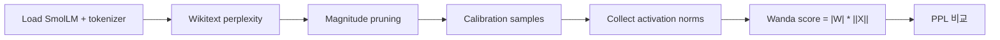

# On-Device AI Practice 04 — Pruning for LLM 코드 학습 가이드

> 오른쪽 원본 노트북 `4. Pruning for LLM.ipynb`를 보면서, 왼쪽에서는 LLM pruning이 CNN pruning과 어떻게 다른지 집중해서 보면 된다.

- 기준 교안: `ODAI-2 Chapter 1. LLM Pruning`
- 핵심 목표: causal language model에서 **perplexity 평가 → magnitude pruning → calibration activation 수집 → Wanda pruning**을 구현 관점으로 이해한다.

## 0. 전체 흐름



### 핵심 수식

Magnitude pruning:

$$
score_{ij}=|W_{ij}|
$$

Wanda pruning:

$$
score_{ij}=|W_{ij}|\cdot \|X_j\|_2
$$

여기서 $X_j$는 해당 input channel activation이다. 같은 weight magnitude라도 자주/크게 활성화되는 channel에 연결된 weight는 더 중요하다고 본다.

### 핵심 shape 표

| 대상 | Shape | 의미 |
|---|---|---|
| token ids | `[B, T]` | tokenizer 출력 |
| hidden states | `[B, T, d_model]` | Linear layer 입력 activation |
| Linear weight | `[d_out, d_in]` | pruning 대상 |
| activation norm | `[d_in]` | input channel별 중요도 |
| perplexity | scalar | 언어모델 품질 지표 |

## 1. 노트북 전체 지도

| 구간 | 셀 범위 | 주제 | 공부 포인트 |
|---:|---:|---|---|
| 1 | 001-009 | setup / Wikitext PPL / SmolLM load | tokenizer, causal LM, PPL 기준값 |
| 2 | 010-013 | magnitude pruning | `nn.Linear` weight magnitude 기준 제거 |
| 3 | 014-018 | calibration data와 activation 수집 | Pile validation sample, hook, input norm |
| 4 | 019-021 | Wanda pruning 구현과 평가 | activation-aware score, PPL 비교 |

## Cells 001-009 — LLM 로딩과 perplexity 평가

LLM은 classification accuracy 대신 perplexity(PPL)를 주로 본다.

$$
PPL=\exp\left(-\frac{1}{N}\sum_t \log p(x_t|x_{<t})\right)
$$

- 낮을수록 다음 token 예측이 좋다.
- pruning 후 PPL이 크게 오르면 모델 품질이 나빠진 것이다.

`AutoTokenizer`는 text를 token ids `[B,T]`로 바꾼다. `AutoModelForCausalLM`은 다음 token logits `[B,T,V]`를 만든다.

Cell 009에서 SmolLM-135M을 로드하고 baseline PPL을 측정한다. 이후 pruning 결과는 이 baseline과 비교한다.

## Cells 010-013 — Magnitude-based pruning

Magnitude pruning은 `nn.Linear` weight 중 절댓값이 작은 것을 제거한다.

```text
for each Linear layer except lm_head:
  threshold = quantile(abs(weight), sparsity)
  mask = abs(weight) > threshold
  weight *= mask
```

`lm_head`를 제외하는 이유는 vocabulary logits에 직접 연결된 출력층이 손상되면 PPL이 크게 나빠질 수 있기 때문이다.

Magnitude 기준의 한계:

- weight 자체만 본다.
- 어떤 input channel이 실제로 자주 쓰이는지 모른다.
- LLM에서는 activation outlier와 channel importance가 중요하다.

## Cells 014-018 — Calibration dataset과 activation norm

Wanda는 activation-aware pruning이다. 그래서 calibration sample을 모델에 넣어 각 Linear layer input activation을 수집한다.

Hook 구조:

```text
Linear input X: [B, T, d_in]
flatten tokens -> [B*T, d_in]
channel norm -> [d_in]
```

activation norm은 보통 L2 norm으로 계산한다.

$$
\|X_j\|_2=\sqrt{\sum_{samples,tokens}X_{t,j}^2}
$$

이 값이 큰 channel은 모델이 실제 데이터에서 자주/강하게 사용한다는 뜻이다.

## Cells 019-021 — Wanda pruning

Wanda score는 weight magnitude와 activation norm을 곱한다.

$$
score_{ij}=|W_{ij}|\cdot \|X_j\|_2
$$

구현 흐름:

1. Linear layer weight `W`를 가져온다.
2. 해당 layer input activation norm `[d_in]`을 가져온다.
3. broadcasting으로 score `[d_out,d_in]`을 만든다.
4. score가 작은 weight를 0으로 만든다.
5. PPL을 다시 측정한다.

Magnitude pruning보다 Wanda가 유리한 이유는 “작은 weight지만 중요한 activation channel에 연결된 weight”를 덜 자르기 때문이다.

## 직접 구현 체크리스트

1. baseline PPL을 먼저 저장한다.
2. pruning 대상은 `nn.Linear` 중심으로 제한한다.
3. `lm_head` 제외 여부를 명확히 한다.
4. calibration sample 수와 sequence length를 기록한다.
5. hook으로 모은 activation이 layer 이름과 정확히 매칭되는지 확인한다.
6. activation norm shape `[d_in]`이 weight shape `[d_out,d_in]`에 broadcast되는지 확인한다.
7. pruning 후 GPU memory를 정리하고 PPL을 다시 측정한다.

## 시험 대비 핵심 문장

- LLM pruning 평가는 accuracy보다 perplexity를 주로 사용한다.
- Magnitude pruning은 weight 절댓값만 보고 제거한다.
- Wanda는 weight magnitude와 input activation norm을 함께 사용한다.
- Calibration data는 activation-aware pruning에서 layer별 channel importance를 추정하는 데 필요하다.
- LLM에서는 Linear projection layer가 주요 pruning 대상이다.
