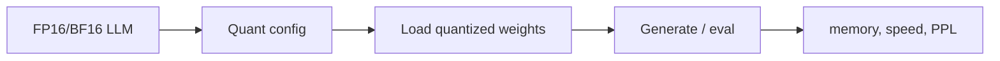

# On-Device AI Practice 05 — Quantization for LLM 코드 기준 학습 가이드


## 그림으로 먼저 잡기



| 체크 지점 | 코드에서 보는 값 | 의미 |
|---|---|---|
| bit-width | 8bit / 4bit | weight 저장량 감소 |
| compute dtype | fp16 / bf16 | 정수 weight를 어떤 dtype으로 계산하는지 |
| device map | GPU/CPU 배치 | 실제 메모리 병목 위치 |

> 같이 볼 원본 노트북: `On-Device AI 강의자료/실습/5. Quantization for LLM.ipynb`  
> 핵심 목표: **LLM weight-only quantization, AWQ, SmoothQuant, GPTQ 계열 아이디어를 코드 흐름과 matrix shape 기준으로 이해한다.**

## 0. 왜 LLM quantization은 CNN과 다르게 느껴지는가?

LLM inference는 batch가 작고 sequence를 한 token씩 생성하는 경우가 많다. decoding 단계에서 Linear 연산은 GEMV에 가깝다.

$$
[1,d_{in}]\times[d_{in},d_{out}] \rightarrow [1,d_{out}]
$$

이때 병목은 계산량보다 weight를 메모리에서 읽는 bandwidth인 경우가 많다. 그래서 **weight-only quantization**이 중요하다.

| 방식 | Weight | Activation | 특징 |
|---|---|---|---|
| FP16 baseline | fp16 | fp16 | 정확하지만 큼 |
| Weight-only | int4/int3 | fp16 | LLM decoding에 유리 |
| W8A8 | int8 | int8 | activation outlier 처리 필요 |
| GPTQ/AWQ | low-bit weight | 보통 fp16 activation | calibration 기반 정확도 보존 |

## 1. LLMModel wrapper와 PPL/size 평가

노트북의 `LLMModel`은 모델 로딩, reset, perplexity 평가, model size 계산을 묶는다.

핵심 shape:

| 객체 | Shape | 의미 |
|---|---:|---|
| token ids | `[B,T]` | tokenizer output |
| hidden state | `[B,T,d_model]` | transformer 내부 표현 |
| Linear weight | `[d_out,d_in]` | projection weight |
| logits | `[B,T,V]` | vocabulary logits |

모델 크기 계산은 dtype bitwidth를 반영한다.

$$
\text{memory}\approx \sum_l N_l \times b_l
$$

FP16은 16bit, int4는 4bit이므로 weight 저장량만 보면 1/4이다.

## 2. Pseudo quantization

`pseudo_quantize_tensor(w, n_bit=4, q_group_size=...)`는 실제 int storage로 바꾸기보다 quantize 후 dequantize한 값을 FP tensor에 다시 담는다.

$$
q = \text{round}\left(\frac{w}{s}\right)+z
$$

$$
\hat{w}=s(q-z)
$$

이렇게 하면 실제 kernel 없이도 “low-bit로 표현했을 때 정확도가 얼마나 떨어지는지”를 시뮬레이션할 수 있다.

### Group-wise quantization

LLM에서는 row 전체에 scale 하나를 쓰면 outlier 때문에 precision이 나빠질 수 있다. 그래서 group size를 둔다.

```text
W row: [w1 w2 ... w128 | w129 ... w256 | ...]
각 group마다 scale/zero-point 계산
```

| 설정 | scale 수 | 정확도 | metadata |
|---|---:|---|---|
| per-tensor | 적음 | 낮을 수 있음 | 적음 |
| per-channel | 중간 | 좋음 | 중간 |
| group-wise | 많음 | 더 좋음 | 많음 |

## 3. AWQ: Activation-aware Weight Quantization

AWQ는 모든 weight를 똑같이 quantize하지 않는다. activation이 크게 쓰는 channel은 더 중요하게 본다.

중요도 직관:

$$
\text{importance}_j \propto \mathbb{E}[|x_j|]
$$

입력 activation이 큰 channel과 연결된 weight는 quantization error가 output에 더 크게 반영된다.

$$
\Delta y = \Delta W x
$$

그래서 AWQ는 salient channel을 보호하거나 scale을 조정해 quantization error를 줄인다.

## 4. Scale search / salient channel

노트북의 “Scale 1% salient channels” 계열 코드는 activation 통계를 기반으로 일부 중요한 channel의 scale을 조절한다.

개념적으로는:

1. calibration data로 activation 통계 수집
2. 중요한 input channel 선택
3. weight/activation scale balancing
4. quantization 후 PPL 비교

수학적으로는 diagonal scaling을 생각할 수 있다.

$$
y = xW = (xS)(S^{-1}W)
$$

원래 연산 결과는 같지만, $S$를 적절히 고르면 quantization하기 좋은 weight 분포가 된다.

## 5. SmoothQuant

SmoothQuant도 activation outlier를 weight 쪽으로 이동시키는 아이디어다.

$$
Y = XW = (X \operatorname{diag}(s)^{-1})(\operatorname{diag}(s)W)
$$

- activation outlier를 줄이면 activation quantization이 쉬워진다.
- 대신 weight range가 커질 수 있다.
- $\alpha$로 activation과 weight 사이 trade-off를 조절한다.

온디바이스에서는 activation quantization까지 하면 runtime kernel 이득이 커질 수 있지만, outlier 처리가 어려워진다.

## 6. GPTQ 계열 직관

GPTQ는 단순히 round하는 대신 calibration data에서 output error를 줄이는 방향으로 weight를 양자화한다.

목표는 대략 다음이다.

$$
\min_{\hat{W}} \|XW-X\hat{W}\|_2^2
$$

- $X$: calibration activation
- $W$: 원래 weight
- $\hat{W}$: quantized weight

Hessian 또는 근사 inverse를 이용해 어떤 weight를 quantize했을 때 생기는 error를 보정한다. 코드에서는 완전한 이론보다 “calibration 기반 layer-wise quantization” 흐름을 보는 것이 중요하다.

## 7. 실제 구현에서 dtype/storage를 구분해야 한다

Pseudo quantization은 값은 low-bit grid에 맞지만 tensor dtype은 여전히 float일 수 있다. 실제 메모리 절감은 int4 packing이 있어야 한다.

| 구분 | 의미 |
|---|---|
| simulated quantization | 정확도 영향 확인 |
| fake quantization | QAT/실험용 forward simulation |
| packed quantization | 실제 int4/int3 storage와 kernel 필요 |

노트북은 주로 개념과 정확도 영향을 실험한다. 실제 on-device 가속은 runtime/kernel 지원까지 연결되어야 한다.

## 8. 직접 구현 체크리스트

1. baseline PPL과 model size를 먼저 기록한다.
2. `n_bit`, `q_group_size`, symmetric/asymmetric 설정을 명시한다.
3. scale shape가 group reshape 후 원래 weight shape로 broadcast되는지 확인한다.
4. pseudo quantization 후 dequantized weight의 min/max를 확인한다.
5. calibration sample 수와 sequence length를 고정한다.
6. activation outlier channel을 선택하는 기준을 출력한다.
7. AWQ/SmoothQuant는 scaling 전후 output equivalence를 확인한다.
8. low-bit 결과는 PPL 증가량과 memory 감소량을 함께 본다.

## 9. 시험 대비 핵심 문장

- LLM decoding은 memory bandwidth 병목이 크기 때문에 weight-only quantization이 효과적이다.
- Group-wise quantization은 작은 group마다 scale을 둬 low-bit에서도 정확도를 보존한다.
- AWQ는 activation이 큰 channel과 연결된 weight를 더 중요하게 다루는 activation-aware 방법이다.
- SmoothQuant는 activation outlier를 weight scaling으로 옮겨 activation quantization을 쉽게 만든다.
- Pseudo quantization은 정확도 영향 실험이고, 실제 메모리/속도 이득은 packed storage와 kernel 지원이 필요하다.
