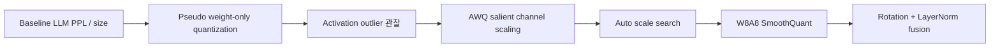

# On-Device AI Practice 05 — Quantization for LLM 코드 학습 가이드

> 오른쪽 원본 노트북 `5. Quantization for LLM.ipynb`를 보면서, 왼쪽에서는 LLM quantization의 병목인 **weight bandwidth, activation outlier, SmoothQuant/AWQ/rotation**을 따라가면 된다.

- 기준 교안: `ODAI-2 Chapter 2. LLM Quantization`
- 핵심 목표: OPT/TinyLlama 계열 LLM에서 **weight-only quantization → AWQ → W8A8/SmoothQuant → rotation-based quantization** 흐름을 구현 관점으로 이해한다.

## 0. 전체 흐름



### 핵심 수식

Uniform quantization:

$$
q=\mathrm{clip}\left(\mathrm{round}(w/s), q_{min}, q_{max}\right), \qquad \hat w=sq
$$

AWQ의 equivalent scaling 직관:

$$
y = Wx = (W\operatorname{diag}(s)) (\operatorname{diag}(s)^{-1}x)
$$

SmoothQuant의 핵심도 비슷하다. activation의 어려움을 weight 쪽으로 옮겨 W8A8 quantization을 쉽게 만든다.

### 핵심 shape 표

| 대상 | Shape | 의미 |
|---|---|---|
| token ids | `[B, T]` | LLM 입력 |
| Linear weight | `[out_features, in_features]` | weight-only / W8A8 quantization 대상 |
| group | `q_group_size` column 묶음 | group-wise scale 공유 단위 |
| activation | `[B, T, d_model]` | outlier channel 관찰 대상 |
| rotation matrix | `[d_model, d_model]` | hidden dimension을 섞는 직교행렬 |

## 1. 노트북 전체 지도

| 구간 | 셀 범위 | 주제 | 공부 포인트 |
|---:|---:|---|---|
| 1 | 001-012 | setup / LLMModel / OPT baseline | PPL, model size, group size 기준 |
| 2 | 013-020 | weight-only quantization / pseudo quant | 3-bit group-wise quantization과 PPL 악화 |
| 3 | 021-036 | AWQ salient channel scaling / auto scale | activation outlier, important channel 보호 |
| 4 | 037-046 | W8A8 quantization | weight와 activation을 모두 8-bit로 근사 |
| 5 | 047-060 | SmoothQuant | activation difficulty를 weight로 migration |
| 6 | 061-072 | rotation-based quantization | TinyLlama, orthogonal rotation, LayerNorm fusion |

---

## Cells 001-012 — setup, LLMModel, OPT baseline

LLM은 parameter 수가 크기 때문에 FP16이어도 메모리 대역폭 병목이 크다. `LLMModel` wrapper는 다음을 묶는다.

- model/tokenizer 로딩
- PPL 평가
- model size 계산
- quantization 후 모델 교체/복구

Cell 012에서 OPT-125M baseline PPL과 size를 측정한다. 이후 모든 quantization 결과는 이 baseline과 비교한다.

## Cells 013-020 — Weight-only quantization과 pseudo quantization

Weight-only quantization은 weight만 저비트로 저장하고, 계산 시 dequantize해서 FP 연산하거나 전용 kernel을 쓴다.

장점:

- batch size가 작고 memory bandwidth가 병목인 autoregressive decoding에서 유리하다.
- activation quantization보다 안정적이다.

단점:

- dequantization overhead가 있다.
- 너무 낮은 bitwidth는 PPL을 크게 악화시킨다.

`pseudo_quantize_tensor`는 실제 int 저장 대신 quantize → dequantize를 수행해 양자화 오차만 시뮬레이션한다.

Group-wise quantization:

```text
W: [out, in]
in dimension을 q_group_size 단위로 나눔
각 group마다 scale/zero point 계산
```

Cell 020의 3-bit 결과는 “크기는 줄었지만 PPL이 크게 나빠질 수 있음”을 보여준다.

## Cells 021-036 — AWQ: activation-aware weight quantization

AWQ의 관찰: LLM activation에는 일부 channel outlier가 있고, 이 channel이 모든 token에서 지속적으로 중요할 수 있다.

### Cells 021-025: calibration feature 수집

Calibration dataset을 모델에 넣고 Linear layer input activation을 저장한다.

확인할 shape:

```text
input_feat[layer_name][sample] ≈ [T, hidden_dim]
```

Cell 025는 layer별 activation channel magnitude를 plot한다. 특정 channel이 반복적으로 큰 값이면 outlier channel이다.

### Cells 026-031: salient channel scaling

중요 channel 상위 1%를 찾아 weight를 scaling한다. 목적은 중요한 channel의 quantization error를 줄이는 것이다.

직관:

- 중요한 channel weight를 크게 만들면 quantization grid에서 상대적으로 덜 뭉개질 수 있다.
- 단, 너무 크게 scaling하면 다른 부분과 balance가 깨질 수 있다.

Cell 030은 scale factor 후보 `[1, 1.5, 2, 2.5, 3]`를 비교한다.

### Cells 032-036: auto scale search

수동 scale factor 대신 block별로 좋은 scale을 찾는다.

핵심은 equivalent transformation이다.

$$
Wx = (W s)(x/s)
$$

FP에서는 같은 함수지만 quantization error는 달라질 수 있다. search는 PPL 또는 reconstruction error가 작은 scale을 찾는다.

## Cells 037-046 — W8A8 quantization

Weight와 activation을 모두 8-bit로 양자화하는 흐름이다.

- W8A8은 INT8 GEMM 가속을 기대할 수 있다.
- 하지만 activation outlier가 있으면 activation scale이 커져 대부분 값의 해상도가 나빠진다.

Cell 043-044는 quantized Linear module과 weight quantization 함수를 정의한다. Cell 046은 OPT 모델을 W8A8로 바꾸고 PPL/size를 평가한다.

## Cells 047-060 — SmoothQuant

SmoothQuant는 activation quantization 난이도를 weight 쪽으로 옮긴다.

$$
Y = XW = (X / s)(sW)
$$

- activation outlier를 줄이면 activation int8 quantization이 쉬워진다.
- weight 쪽 range는 커질 수 있지만 weight는 per-channel/group-wise로 더 잘 다룰 수 있다.

### Cells 049-054: fixed scale migration

여러 scale factor를 직접 넣어 PPL 변화를 본다. scale이 너무 작거나 크면 한쪽 quantization error가 커진다.

### Cells 055-060: sampled activation scale 기반 SmoothQuant

`get_act_scales`는 calibration sample로 layer별 activation channel max를 추정한다. `smooth_lm`은 OPT block의 LayerNorm과 Linear layer에 scale을 반영한다.

확인할 것:

1. LayerNorm weight/bias가 scale에 맞게 조정되는지.
2. q/k/v projection과 MLP linear들이 같은 hidden channel 기준으로 조정되는지.
3. smoothing 후 W8A8 PPL이 개선되는지.

## Cells 061-072 — Rotation-based quantization: QuaRot / SpinQuant 직관

Rotation 기반 방법은 hidden dimension에 직교행렬을 곱해 outlier를 분산시킨다.

직교행렬 $R$은 다음 성질을 가진다.

$$
R^TR=I
$$

정보량은 보존하면서 값 분포를 더 양자화하기 쉽게 만들 수 있다.

### Cells 061-064: TinyLlama와 rotation 준비

TinyLlama 모델을 로드하고 random orthogonal matrix를 만든다. `torch.linalg.qr`은 임의 행렬에서 직교행렬을 만든다.

### Cells 065-066: LayerNorm ↔ Linear fusion

Rotation을 적용하려면 LayerNorm/Linear 주변 구조를 정리해야 한다. LayerNorm fusion은 scale/bias를 인접 Linear weight에 흡수해 그래프를 단순화한다.

### Cells 067-072: R1 rotation 적용과 비교

`rotate_model_weight`는 embedding, Linear, output head 등에 rotation을 적용한다. 이후 다음을 비교한다.

1. original model PPL
2. quantization only PPL
3. rotation + quantization PPL
4. hidden state 2D plot 변화

Rotation이 잘 작동하면 outlier가 완화되어 quantization 후 PPL 악화가 줄어든다.

---

## 직접 구현 체크리스트

1. baseline PPL과 model size를 먼저 저장한다.
2. pseudo quantization은 quantize/dequantize 효과만 시뮬레이션한다는 점을 구분한다.
3. group-wise quantization에서 group reshape가 원래 shape로 정확히 돌아오는지 확인한다.
4. calibration feature는 layer 이름과 정확히 매칭되어야 한다.
5. AWQ scale factor는 너무 크면 오히려 나빠질 수 있다.
6. W8A8은 activation outlier 때문에 weight-only보다 어렵다.
7. SmoothQuant는 activation range를 줄이고 weight range를 키우는 trade-off다.
8. rotation matrix는 직교행렬이어야 정보 보존 성질이 유지된다.
9. LayerNorm fusion 전후 FP 출력이 크게 달라지지 않는지 확인한다.

## 시험 대비 핵심 문장

- LLM weight-only quantization은 decoding의 memory bandwidth 병목을 줄이는 데 유리하다.
- AWQ는 중요한 activation channel을 고려해 weight quantization error를 줄인다.
- SmoothQuant는 activation quantization 난이도를 weight로 이전해 W8A8을 가능하게 한다.
- Rotation 기반 방법은 outlier를 hidden dimension에 분산시켜 quantization을 쉽게 만든다.
- PPL은 LLM quantization 품질을 판단하는 핵심 지표다.
