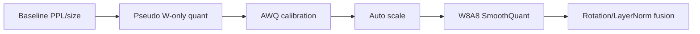

# On-Device AI Practice 05 — Quantization for LLM 셀별 코드 학습 가이드

> 오른쪽에는 원본 노트북 HTML을 띄우고, 왼쪽은 **모든 셀을 따라가는 해설 지도**로 쓴다. 이 문서는 원본 코드를 대체하지 않고, 각 셀이 왜 필요한지/무슨 shape로 움직이는지/직접 구현할 때 어디를 봐야 하는지 설명한다.

- 기준 교안: `ODAI-2 Chapter 2 LLM Quantization`
- 원본 노트북: `On-Device AI 강의자료/실습/5. Quantization for LLM.ipynb`
- 학습 목표: OPT/TinyLlama에서 weight-only quantization, AWQ, W8A8/SmoothQuant, rotation 기반 quantization을 구현 흐름으로 정리한다.

## 0. 그림으로 먼저 잡기

### 실습 전체에서 계속 붙잡을 수식

$Q(w)=s\cdot(\mathrm{round}(w/s)-z),\quad s_q=(\alpha-\beta)/(2^b-1)$

### 핵심 shape 표

| 대상 | Shape / 표현 | 의미 |
|---|---|---|
| weight matrix | `[out_features, in_features]` | group-wise quantization 대상 |
| group | `q_group_size` columns | scale/zero-point를 공유하는 단위 |
| activation outlier | `channel-wise max` | AWQ/SmoothQuant가 다루는 핵심 문제 |
| rotation matrix | `[d_model, d_model]` | outlier를 섞어 양자화 난이도를 낮추는 직교행렬 |

## 1. 노트북 전체 지도

| 구간 | 셀 범위 | 오른쪽에서 보이는 제목 | 여기서 잡아야 할 것 |
|---:|---:|---|---|
| 1 | 001-001 | Assignment 5. Quantization for LLM | 양자화 |
| 2 | 002-002 | Goals | 양자화 |
| 3 | 003-003 | Contents | 양자화, activation, AWQ, SmoothQuant |
| 4 | 004-012 | Setup | 평가 루프, 모델 크기, vector-level, tokenizer |
| 5 | 013-014 | 4.1. Weight-only Quantization (AWQ) | 양자화, activation, AWQ |
| 6 | 015-016 | AWQ | 양자화, scale, zero-point, AWQ |
| 7 | 017-025 | Pseudo Quantization | 재현성, 평가 루프, 양자화, scale |
| 8 | 026-031 | [실습 1] Scale 1% salient channels | 평가 루프, 마스크, channel-level, 양자화 |
| 9 | 032-036 | [실습 2] Scale factor search | 평가 루프, 모델 크기, fine-grained, 양자화 |
| 10 | 037-041 | 4.2. Weight and Activation Quantization | 양자화, scale, zero-point, activation |
| 11 | 042-048 | Pseudo Quantization | 평가 루프, channel-level, 양자화, scale |
| 12 | 049-049 | Migrate the quantization difficulty from activations to weights | channel-level, 양자화, activation, SmoothQuant |
| 13 | 050-054 | [실습 3] Quantization difficulty migration | 평가 루프, 양자화, scale, perplexity |
| 14 | 055-060 | [실습 4] Scale factor sampling | 재현성, 평가 루프, 모델 크기, channel-level |
| 15 | 061-064 | Rotation Based Quantization | vector-level, 양자화, rotation, Linear layer |
| 16 | 065-066 | Layernorm ↔ Linear Fusion | 모델 크기, zero-point, rotation, LayerNorm |
| 17 | 067-072 | [실습 5] Rotate Matrix 적용 | 평가 루프, channel-level, 양자화, perplexity |

## 2. 셀별 Walkthrough

아래 번호는 오른쪽 노트북의 cell 순서와 맞춘 것이다. Markdown 셀도 건너뛰지 않는다. Markdown 셀은 바로 다음 코드가 어떤 문제를 푸는지 정의하는 경우가 많기 때문이다.

### Cell 001 · Markdown · Assignment 5. Quantization for LLM

- **현재 구간**: Assignment 5. Quantization for LLM
- **오른쪽에서 읽을 내용**: # Assignment 5. Quantization for LLM
- **무슨 작업인가**:
  - 이 셀은 뒤 코드가 왜 필요한지 알려주는 설명/문제 정의 셀이다. 오른쪽 노트북의 문장을 그냥 넘기지 말고, 바로 아래 코드 셀에서 어떤 변수·함수·측정값으로 구현되는지 연결해서 본다.
  - quantization은 실수 범위를 정수 grid로 근사한다. `scale`은 grid 간격, `zero_point`는 실수 0이 대응되는 정수 위치다.
- **수학/shape 관점**:
  - Linear layer는 보통 `Y=XW^T+b`로 동작한다. LLM에서 `X`는 `[B,T,d_in]`, `W`는 `[d_out,d_in]`로 보면 된다.
  - quantization에서는 실수 tensor 자체보다 `(integer tensor, scale, zero_point/group_size)` 묶음이 실제 표현이다.
- **직접 구현할 때 체크**:
  - 이 셀 실행 후 새로 생긴 변수 1~2개를 다음 셀이 어떻게 사용하는지 추적한다.

### Cell 002 · Markdown · Goals

- **현재 구간**: Goals
- **오른쪽에서 읽을 내용**: ## Goals 본 실습에서는 대형 언어 모델(Large Language Model, LLM)에 대해 양자화(Quantization)을 수행하여 모델을 압축하는 방법을 실습합니다. LLM은 파라미터의 개수가 매우 많기 때문에 일반적으로 FP16으로 관리합니다. 그럼에도 파라미터의 크기가 많이 크며, LLaMA-2 7B와 같이 작은 모델에 대해서도 모바일 환경에서 수행하고자 하는 경우 FP16에서도 최소 14GB 이상의 메모리를 요구하며 이는 실제로 돌리기에 무리가 있습니다. 따라서, 양자화를 통해 모델의 weight를 더 낮은 precision으로 압축하는 것이 가능합니다.
- **무슨 작업인가**:
  - 이 셀은 뒤 코드가 왜 필요한지 알려주는 설명/문제 정의 셀이다. 오른쪽 노트북의 문장을 그냥 넘기지 말고, 바로 아래 코드 셀에서 어떤 변수·함수·측정값으로 구현되는지 연결해서 본다.
  - quantization은 실수 범위를 정수 grid로 근사한다. `scale`은 grid 간격, `zero_point`는 실수 0이 대응되는 정수 위치다.
- **수학/shape 관점**:
  - Linear layer는 보통 `Y=XW^T+b`로 동작한다. LLM에서 `X`는 `[B,T,d_in]`, `W`는 `[d_out,d_in]`로 보면 된다.
  - quantization에서는 실수 tensor 자체보다 `(integer tensor, scale, zero_point/group_size)` 묶음이 실제 표현이다.
- **직접 구현할 때 체크**:
  - 이 셀 실행 후 새로 생긴 변수 1~2개를 다음 셀이 어떻게 사용하는지 추적한다.

### Cell 003 · Markdown · Contents

- **현재 구간**: Contents
- **오른쪽에서 읽을 내용**: ## Contents 1. Weight-only Quantization - Weight만 quantization을 적용합니다. - 장점: 매우 낮은 bit-width로 weight를 양자화할 수 있으며, 단일 배치 추론 환경에서 유리합니다. - 단점: Dequantization 후 FP16 연산을 수행해야 합니다. - 예시: AWQ (W3A16, W4A16) 2. Weight and Activation Quantization - Weight와 activation 모두 quantization을 적용합니다. - 장점: 낮은 precision의 연산을 통해 가속 가능하며, 대규모 배치 추론 환경에서 유리합니다. - 단점: weight의 bit…
- **무슨 작업인가**:
  - 이 셀은 뒤 코드가 왜 필요한지 알려주는 설명/문제 정의 셀이다. 오른쪽 노트북의 문장을 그냥 넘기지 말고, 바로 아래 코드 셀에서 어떤 변수·함수·측정값으로 구현되는지 연결해서 본다.
  - quantization은 실수 범위를 정수 grid로 근사한다. `scale`은 grid 간격, `zero_point`는 실수 0이 대응되는 정수 위치다.
  - AWQ는 LLM activation outlier 때문에 단순 weight quantization이 깨지는 문제를 다룬다. 중요한 channel을 scale로 보호해 weight-only 저비트 양자화 오차를 줄인다.
  - SmoothQuant는 activation의 어려움을 weight 쪽으로 일부 이전한다. 수식상 equivalent transformation이라 FP 결과는 유지하되 W8A8 quantization이 쉬워진다.
- **수학/shape 관점**:
  - quantization에서는 실수 tensor 자체보다 `(integer tensor, scale, zero_point/group_size)` 묶음이 실제 표현이다.
- **직접 구현할 때 체크**:
  - 이 셀 실행 후 새로 생긴 변수 1~2개를 다음 셀이 어떻게 사용하는지 추적한다.

### Cell 004 · Markdown · Setup

- **현재 구간**: Setup
- **오른쪽에서 읽을 내용**: ## Setup
- **무슨 작업인가**:
  - 이 셀은 뒤 코드가 왜 필요한지 알려주는 설명/문제 정의 셀이다. 오른쪽 노트북의 문장을 그냥 넘기지 말고, 바로 아래 코드 셀에서 어떤 변수·함수·측정값으로 구현되는지 연결해서 본다.
  - 주변 셀과 이어지는 보조 단계다. 새로 생기는 변수 이름과 다음 셀에서 소비되는 값을 연결해서 보면 흐름이 끊기지 않는다.
- **수학/shape 관점**:
  - $Q(w)=s\cdot(\mathrm{round}(w/s)-z),\quad s_q=(\alpha-\beta)/(2^b-1)$
- **직접 구현할 때 체크**:
  - 이 셀 실행 후 새로 생긴 변수 1~2개를 다음 셀이 어떻게 사용하는지 추적한다.

### Cell 005 · Markdown · 실습에 필요한 패키지를 설치합니다.

- **현재 구간**: Setup
- **오른쪽에서 읽을 내용**: 실습에 필요한 패키지를 설치합니다.
- **무슨 작업인가**:
  - 이 셀은 뒤 코드가 왜 필요한지 알려주는 설명/문제 정의 셀이다. 오른쪽 노트북의 문장을 그냥 넘기지 말고, 바로 아래 코드 셀에서 어떤 변수·함수·측정값으로 구현되는지 연결해서 본다.
  - 주변 셀과 이어지는 보조 단계다. 새로 생기는 변수 이름과 다음 셀에서 소비되는 값을 연결해서 보면 흐름이 끊기지 않는다.
- **수학/shape 관점**:
  - $Q(w)=s\cdot(\mathrm{round}(w/s)-z),\quad s_q=(\alpha-\beta)/(2^b-1)$
- **직접 구현할 때 체크**:
  - 이 셀 실행 후 새로 생긴 변수 1~2개를 다음 셀이 어떻게 사용하는지 추적한다.

### Cell 006 · Code · print("Setting up environment...")

- **현재 구간**: Setup
- **오른쪽에서 볼 코드**: `print("Setting up environment...") / BASE_DIR = os.getcwd() / DATA_DIR = os.path.join(BASE_DIR, "data")`
- **무슨 작업인가**:
  - 이 셀은 설명을 실제 PyTorch/Python 연산으로 바꾸는 실행 단위다. 실행 전후로 생성되는 변수, tensor shape, 모델 상태 변경 여부를 확인한다.
  - 핵심 키워드: tokenizer, OPT. 이 셀에서 해당 키워드가 코드 변수/함수로 어떻게 구현되는지 오른쪽 노트북에서 확인한다.
- **수학/shape 관점**:
  - Linear layer는 보통 `Y=XW^T+b`로 동작한다. LLM에서 `X`는 `[B,T,d_in]`, `W`는 `[d_out,d_in]`로 보면 된다.
- **직접 구현할 때 체크**:
  - 입력 tensor와 model parameter가 같은 device에 있는지 확인한다. CPU/GPU mismatch는 이 실습에서 흔한 오류다.
- **키워드**: tokenizer, OPT

### Cell 007 · Markdown · 실습에 필요한 모듈을 로드합니다.

- **현재 구간**: Setup
- **오른쪽에서 읽을 내용**: 실습에 필요한 모듈을 로드합니다.
- **무슨 작업인가**:
  - 이 셀은 뒤 코드가 왜 필요한지 알려주는 설명/문제 정의 셀이다. 오른쪽 노트북의 문장을 그냥 넘기지 말고, 바로 아래 코드 셀에서 어떤 변수·함수·측정값으로 구현되는지 연결해서 본다.
  - 주변 셀과 이어지는 보조 단계다. 새로 생기는 변수 이름과 다음 셀에서 소비되는 값을 연결해서 보면 흐름이 끊기지 않는다.
- **수학/shape 관점**:
  - $Q(w)=s\cdot(\mathrm{round}(w/s)-z),\quad s_q=(\alpha-\beta)/(2^b-1)$
- **직접 구현할 때 체크**:
  - 이 셀 실행 후 새로 생긴 변수 1~2개를 다음 셀이 어떻게 사용하는지 추적한다.

### Cell 008 · Code · import torch import gc import numpy as np import matplotlib.pyplot as plt from tqdm import tqdm from torch import nn from transformers import AutoModelForCausalLM, AutoTokenizer, AutoConfig from datasets import load_data…

- **현재 구간**: Setup
- **오른쪽에서 볼 코드**: `import torch import gc import numpy as np import matplotlib.pyplot as plt from tqdm import tqdm from torch import nn from transformers import AutoModelForCausalLM, AutoTokenizer, AutoConfig from datasets import load_data…`
- **무슨 작업인가**:
  - 이 셀은 설명을 실제 PyTorch/Python 연산으로 바꾸는 실행 단위다. 실행 전후로 생성되는 변수, tensor shape, 모델 상태 변경 여부를 확인한다.
  - 데이터셋을 mini-batch 단위로 모델에 공급한다. CNN은 이미지 batch `[B,3,32,32]`, LLM은 token sequence `[B,T]`로 들어간다는 점을 구분한다.
- **수학/shape 관점**:
  - Linear layer는 보통 `Y=XW^T+b`로 동작한다. LLM에서 `X`는 `[B,T,d_in]`, `W`는 `[d_out,d_in]`로 보면 된다.
- **직접 구현할 때 체크**:
  - 이 셀 실행 후 새로 생긴 변수 1~2개를 다음 셀이 어떻게 사용하는지 추적한다.
- **키워드**: tokenizer, OPT

### Cell 009 · Markdown · 다음 코드는 모델 크기를 계산하는 데 사용됩니다.

- **현재 구간**: Setup
- **오른쪽에서 읽을 내용**: 다음 코드는 모델 크기를 계산하는 데 사용됩니다.
- **무슨 작업인가**:
  - 이 셀은 뒤 코드가 왜 필요한지 알려주는 설명/문제 정의 셀이다. 오른쪽 노트북의 문장을 그냥 넘기지 말고, 바로 아래 코드 셀에서 어떤 변수·함수·측정값으로 구현되는지 연결해서 본다.
  - 주변 셀과 이어지는 보조 단계다. 새로 생기는 변수 이름과 다음 셀에서 소비되는 값을 연결해서 보면 흐름이 끊기지 않는다.
- **수학/shape 관점**:
  - $Q(w)=s\cdot(\mathrm{round}(w/s)-z),\quad s_q=(\alpha-\beta)/(2^b-1)$
- **직접 구현할 때 체크**:
  - 이 셀 실행 후 새로 생긴 변수 1~2개를 다음 셀이 어떻게 사용하는지 추적한다.

### Cell 010 · Code · class LLMModel: / def __init__(self, model_name, weights_path=None): / self.model_name = model_name

- **현재 구간**: Setup
- **오른쪽에서 볼 코드**: `class LLMModel: / def __init__(self, model_name, weights_path=None): / self.model_name = model_name`
- **정의되는 class**: `LLMModel`
- **무슨 작업인가**:
  - 이 셀은 설명을 실제 PyTorch/Python 연산으로 바꾸는 실행 단위다. 실행 전후로 생성되는 변수, tensor shape, 모델 상태 변경 여부를 확인한다.
  - 데이터셋을 mini-batch 단위로 모델에 공급한다. CNN은 이미지 batch `[B,3,32,32]`, LLM은 token sequence `[B,T]`로 들어간다는 점을 구분한다.
  - 모델 품질을 숫자로 고정하는 평가 루프다. CNN은 accuracy, LLM은 PPL을 주로 본다. 압축 실험에서는 압축률만큼이나 이 기준값의 변화량이 중요하다.
  - 학습/미세조정 루프다. forward → loss → backward → optimizer step 순서이며, pruning이면 step 이후 mask 유지, KD면 여러 loss 항의 비율을 확인한다.
- **수학/shape 관점**:
  - Linear layer는 보통 `Y=XW^T+b`로 동작한다. LLM에서 `X`는 `[B,T,d_in]`, `W`는 `[d_out,d_in]`로 보면 된다.
  - PPL은 `exp(average cross entropy)`다. 낮을수록 다음 token 예측이 좋다.
- **직접 구현할 때 체크**:
  - 입력 tensor와 model parameter가 같은 device에 있는지 확인한다. CPU/GPU mismatch는 이 실습에서 흔한 오류다.
  - 비교 실험 전 원본 model state를 복구하는지 확인한다. pruning/quantization은 in-place 변경이 많다.
  - 평가/압축 적용 단계에서는 gradient를 끄는 이유를 확인한다. 메모리 절약과 accidental gradient 방지를 위한 장치다.
- **키워드**: 평가 루프, 모델 크기, tokenizer, perplexity, Wikitext

### Cell 011 · Markdown · 먼저 FP32 모델의 혼란도(perflexity)와 모델 크기를 평가해봅시다. LLaMA-65B 모델의 디코딩 단계에서 단일 배치 추론을 수행할 때, 우리는 $[1, 8192] \times [8192, 8192]$ 형태의 GEMV(General Matrix-Vector Multiplication)연산을 수행해야 합니다. NVIDIA A100 80G의 경우, **half-precision(FP…

- **현재 구간**: Setup
- **오른쪽에서 읽을 내용**: 먼저 FP32 모델의 혼란도(perflexity)와 모델 크기를 평가해봅시다. LLaMA-65B 모델의 디코딩 단계에서 단일 배치 추론을 수행할 때, 우리는 $[1, 8192] \times [8192, 8192]$ 형태의 GEMV(General Matrix-Vector Multiplication)연산을 수행해야 합니다. NVIDIA A100 80G의 경우, **half-precision(FP16)** 에서의 성능은 312TFLOPS이며, memory bandwidth는 약 2000GB/s 입니다. 이를 바탕으로, **계산 집약도(computation intensity)** 를 계산할 수 있습니다: $$ \frac{\text{FLOP}}{…
- **무슨 작업인가**:
  - 이 셀은 뒤 코드가 왜 필요한지 알려주는 설명/문제 정의 셀이다. 오른쪽 노트북의 문장을 그냥 넘기지 말고, 바로 아래 코드 셀에서 어떤 변수·함수·측정값으로 구현되는지 연결해서 본다.
  - structured pruning 단위가 커질수록 실제 tensor 차원을 줄이거나 0-vector를 건너뛰기 쉬워진다. 대신 한 번에 제거되는 정보량이 커져 정확도 손실 위험이 커진다.
- **수학/shape 관점**:
  - $Q(w)=s\cdot(\mathrm{round}(w/s)-z),\quad s_q=(\alpha-\beta)/(2^b-1)$
- **직접 구현할 때 체크**:
  - 이 셀 실행 후 새로 생긴 변수 1~2개를 다음 셀이 어떻게 사용하는지 추적한다.

### Cell 012 · Code · LLMModel 인스턴스 생성 시 가중치 파일 경로도 함께 전달 (위에서 정의한 weights_path)

- **현재 구간**: Setup
- **오른쪽에서 볼 코드**: `model_path = "facebook/opt-125m" / llm_model = LLMModel(model_path, weights_path) / llm_model.model_evaluate(data_width=32, group_size=128)`
- **무슨 작업인가**:
  - 이 셀은 설명을 실제 PyTorch/Python 연산으로 바꾸는 실행 단위다. 실행 전후로 생성되는 변수, tensor shape, 모델 상태 변경 여부를 확인한다.
  - 모델 품질을 숫자로 고정하는 평가 루프다. CNN은 accuracy, LLM은 PPL을 주로 본다. 압축 실험에서는 압축률만큼이나 이 기준값의 변화량이 중요하다.
- **수학/shape 관점**:
  - Linear layer는 보통 `Y=XW^T+b`로 동작한다. LLM에서 `X`는 `[B,T,d_in]`, `W`는 `[d_out,d_in]`로 보면 된다.
- **직접 구현할 때 체크**:
  - 이 셀 실행 후 새로 생긴 변수 1~2개를 다음 셀이 어떻게 사용하는지 추적한다.
- **키워드**: 평가 루프, OPT

### Cell 013 · Markdown · 4.1. Weight-only Quantization (AWQ)

- **현재 구간**: 4.1. Weight-only Quantization (AWQ)
- **오른쪽에서 읽을 내용**: # 4.1. Weight-only Quantization (AWQ) AWQ (activation aware weight only quantization)
- **무슨 작업인가**:
  - 이 셀은 뒤 코드가 왜 필요한지 알려주는 설명/문제 정의 셀이다. 오른쪽 노트북의 문장을 그냥 넘기지 말고, 바로 아래 코드 셀에서 어떤 변수·함수·측정값으로 구현되는지 연결해서 본다.
  - quantization은 실수 범위를 정수 grid로 근사한다. `scale`은 grid 간격, `zero_point`는 실수 0이 대응되는 정수 위치다.
  - AWQ는 LLM activation outlier 때문에 단순 weight quantization이 깨지는 문제를 다룬다. 중요한 channel을 scale로 보호해 weight-only 저비트 양자화 오차를 줄인다.
- **수학/shape 관점**:
  - quantization에서는 실수 tensor 자체보다 `(integer tensor, scale, zero_point/group_size)` 묶음이 실제 표현이다.
- **직접 구현할 때 체크**:
  - 이 셀 실행 후 새로 생긴 변수 1~2개를 다음 셀이 어떻게 사용하는지 추적한다.

### Cell 014 · Markdown · 대형 언어 모델(LLM)은 다양한 작업에서 뛰어난 성능을 보여주고 있지만, 엄청난 모델 크기로 인해 하드웨어적 장벽(메모리 크기)이 높아지고, 토큰 생성 속도가 느려집니다(메모리 대역폭). LLM의 크기와 계산량은 기하급수적으로 증가하고 있는 반면, 메모리 대역폭은 느리게 증가하고 있습니다. 이 격차는 LLM 성능에서 중요한 병목 현상입니다. 이번 실습에서는 **새로운 양자화 알고리즘(AWQ…

- **현재 구간**: 4.1. Weight-only Quantization (AWQ)
- **오른쪽에서 읽을 내용**: 대형 언어 모델(LLM)은 다양한 작업에서 뛰어난 성능을 보여주고 있지만, 엄청난 모델 크기로 인해 하드웨어적 장벽(메모리 크기)이 높아지고, 토큰 생성 속도가 느려집니다(메모리 대역폭). LLM의 크기와 계산량은 기하급수적으로 증가하고 있는 반면, 메모리 대역폭은 느리게 증가하고 있습니다. 이 격차는 LLM 성능에서 중요한 병목 현상입니다. 이번 실습에서는 **새로운 양자화 알고리즘(AWQ)**을 사용하여 LLM의 메모리 사용량을 줄이고 추론 속도를 가속화하는 방법을 탐구할 것입니다.
- **무슨 작업인가**:
  - 이 셀은 뒤 코드가 왜 필요한지 알려주는 설명/문제 정의 셀이다. 오른쪽 노트북의 문장을 그냥 넘기지 말고, 바로 아래 코드 셀에서 어떤 변수·함수·측정값으로 구현되는지 연결해서 본다.
  - AWQ는 LLM activation outlier 때문에 단순 weight quantization이 깨지는 문제를 다룬다. 중요한 channel을 scale로 보호해 weight-only 저비트 양자화 오차를 줄인다.
- **수학/shape 관점**:
  - Linear layer는 보통 `Y=XW^T+b`로 동작한다. LLM에서 `X`는 `[B,T,d_in]`, `W`는 `[d_out,d_in]`로 보면 된다.
- **직접 구현할 때 체크**:
  - 이 셀 실행 후 새로 생긴 변수 1~2개를 다음 셀이 어떻게 사용하는지 추적한다.

### Cell 015 · Markdown · AWQ

- **현재 구간**: AWQ
- **오른쪽에서 읽을 내용**: ## AWQ
- **무슨 작업인가**:
  - 이 셀은 뒤 코드가 왜 필요한지 알려주는 설명/문제 정의 셀이다. 오른쪽 노트북의 문장을 그냥 넘기지 말고, 바로 아래 코드 셀에서 어떤 변수·함수·측정값으로 구현되는지 연결해서 본다.
  - AWQ는 LLM activation outlier 때문에 단순 weight quantization이 깨지는 문제를 다룬다. 중요한 channel을 scale로 보호해 weight-only 저비트 양자화 오차를 줄인다.
- **수학/shape 관점**:
  - $Q(w)=s\cdot(\mathrm{round}(w/s)-z),\quad s_q=(\alpha-\beta)/(2^b-1)$
- **직접 구현할 때 체크**:
  - 이 셀 실행 후 새로 생긴 변수 1~2개를 다음 셀이 어떻게 사용하는지 추적한다.

### Cell 016 · Markdown · s_q = \frac{\alpha - \beta}{2^{b} - 1} \tag{1}, / z = -\text{Round}(\beta * scale) \tag{2} / w_q = \text{Clamp}(\text{Round}(\frac{w}{s_q}) + z) \tag{3},

- **현재 구간**: AWQ
- **오른쪽에서 읽을 내용**: Uniform quantization 은 실수 값을 range $[\beta, \alpha]$에서 $[0, 2^{b} - 1]$로 매핑하는 것입니다. Notation: - Quantized Weight: $w_q$ - Scale factor: $s_q$ - Zero Point: $z$ \begin{equation} s_q = \frac{\alpha - \beta}{2^{b} - 1} \tag{1}, \end{equation} \begin{equation} z = -\text{Round}(\beta * scale) \tag{2} \end{equation} \begin{equation} w_q = \text{Clamp}(\text{Round…
- **무슨 작업인가**:
  - 이 셀은 뒤 코드가 왜 필요한지 알려주는 설명/문제 정의 셀이다. 오른쪽 노트북의 문장을 그냥 넘기지 말고, 바로 아래 코드 셀에서 어떤 변수·함수·측정값으로 구현되는지 연결해서 본다.
  - quantization은 실수 범위를 정수 grid로 근사한다. `scale`은 grid 간격, `zero_point`는 실수 0이 대응되는 정수 위치다.
- **수학/shape 관점**:
  - quantization에서는 실수 tensor 자체보다 `(integer tensor, scale, zero_point/group_size)` 묶음이 실제 표현이다.
- **직접 구현할 때 체크**:
  - round 후 clamp 순서가 중요하다. 정수 범위를 넘으면 overflow/잘못된 dequantization이 생긴다.

### Cell 017 · Markdown · Pseudo Quantization

- **현재 구간**: Pseudo Quantization
- **오른쪽에서 읽을 내용**: ## Pseudo Quantization 아래 코드는 의사 양자화(pseudo quantization)을 위한 것입니다. Pseudo Quantization는 모델의 가중치를 실제로 양자화하지 않고, 양자화의 영향을 시뮬레이션하기 위해 사용됩니다. (즉, 가장 가까운 양자화된 값으로 반올림한 다음, **다시 부동 소수점으로 복원(dequantizing)하는** 것입니다.)
- **무슨 작업인가**:
  - 이 셀은 뒤 코드가 왜 필요한지 알려주는 설명/문제 정의 셀이다. 오른쪽 노트북의 문장을 그냥 넘기지 말고, 바로 아래 코드 셀에서 어떤 변수·함수·측정값으로 구현되는지 연결해서 본다.
  - quantization은 실수 범위를 정수 grid로 근사한다. `scale`은 grid 간격, `zero_point`는 실수 0이 대응되는 정수 위치다.
- **수학/shape 관점**:
  - quantization에서는 실수 tensor 자체보다 `(integer tensor, scale, zero_point/group_size)` 묶음이 실제 표현이다.
- **직접 구현할 때 체크**:
  - 이 셀 실행 후 새로 생긴 변수 1~2개를 다음 셀이 어떻게 사용하는지 추적한다.

### Cell 018 · Code · 핵심 양자화 함수 (simulated quantization, 즉 실제 비트 축소 없이 효과만 모사)

- **현재 구간**: Pseudo Quantization
- **오른쪽에서 볼 코드**: `def pseudo_quantize_tensor(w, n_bit=4, q_group_size=-1): / org_w_shape = w.shape / if q_group_size > 0:`
- **정의되는 함수**: `pseudo_quantize_tensor, pseudo_quantize_model_weight`
- **무슨 작업인가**:
  - 이 셀은 설명을 실제 PyTorch/Python 연산으로 바꾸는 실행 단위다. 실행 전후로 생성되는 변수, tensor shape, 모델 상태 변경 여부를 확인한다.
  - quantization은 실수 범위를 정수 grid로 근사한다. `scale`은 grid 간격, `zero_point`는 실수 0이 대응되는 정수 위치다.
- **수학/shape 관점**:
  - Linear layer는 보통 `Y=XW^T+b`로 동작한다. LLM에서 `X`는 `[B,T,d_in]`, `W`는 `[d_out,d_in]`로 보면 된다.
  - quantization에서는 실수 tensor 자체보다 `(integer tensor, scale, zero_point/group_size)` 묶음이 실제 표현이다.
- **직접 구현할 때 체크**:
  - 평가/압축 적용 단계에서는 gradient를 끄는 이유를 확인한다. 메모리 절약과 accidental gradient 방지를 위한 장치다.
  - round 후 clamp 순서가 중요하다. 정수 범위를 넘으면 overflow/잘못된 dequantization이 생긴다.
  - reshape/transpose 후 어떤 축이 channel/group/kernel 축인지 반드시 주석으로 적어보는 것이 좋다.
- **키워드**: 양자화, scale, zero-point, Linear layer

### Cell 019 · Markdown · 이제 quantized 3-bit 모델의 혼란도(perplexity)와 크기를 평가해 봅시다.

- **현재 구간**: Pseudo Quantization
- **오른쪽에서 읽을 내용**: 이제 quantized 3-bit 모델의 혼란도(perplexity)와 크기를 평가해 봅시다.
- **무슨 작업인가**:
  - 이 셀은 뒤 코드가 왜 필요한지 알려주는 설명/문제 정의 셀이다. 오른쪽 노트북의 문장을 그냥 넘기지 말고, 바로 아래 코드 셀에서 어떤 변수·함수·측정값으로 구현되는지 연결해서 본다.
  - 모델 품질을 숫자로 고정하는 평가 루프다. CNN은 accuracy, LLM은 PPL을 주로 본다. 압축 실험에서는 압축률만큼이나 이 기준값의 변화량이 중요하다.
  - quantization은 실수 범위를 정수 grid로 근사한다. `scale`은 grid 간격, `zero_point`는 실수 0이 대응되는 정수 위치다.
- **수학/shape 관점**:
  - quantization에서는 실수 tensor 자체보다 `(integer tensor, scale, zero_point/group_size)` 묶음이 실제 표현이다.
  - PPL은 `exp(average cross entropy)`다. 낮을수록 다음 token 예측이 좋다.
- **직접 구현할 때 체크**:
  - 이 셀 실행 후 새로 생긴 변수 1~2개를 다음 셀이 어떻게 사용하는지 추적한다.

### Cell 020 · Code · Evaluate the model

- **현재 구간**: Pseudo Quantization
- **오른쪽에서 볼 코드**: `llm_model.model_reset() / llm_model.model_changed = True / llm_model.model_evaluate(data_width=3, group_size=128)`
- **무슨 작업인가**:
  - 이 셀은 설명을 실제 PyTorch/Python 연산으로 바꾸는 실행 단위다. 실행 전후로 생성되는 변수, tensor shape, 모델 상태 변경 여부를 확인한다.
  - 모델 품질을 숫자로 고정하는 평가 루프다. CNN은 accuracy, LLM은 PPL을 주로 본다. 압축 실험에서는 압축률만큼이나 이 기준값의 변화량이 중요하다.
  - quantization은 실수 범위를 정수 grid로 근사한다. `scale`은 grid 간격, `zero_point`는 실수 0이 대응되는 정수 위치다.
- **수학/shape 관점**:
  - Linear layer는 보통 `Y=XW^T+b`로 동작한다. LLM에서 `X`는 `[B,T,d_in]`, `W`는 `[d_out,d_in]`로 보면 된다.
  - quantization에서는 실수 tensor 자체보다 `(integer tensor, scale, zero_point/group_size)` 묶음이 실제 표현이다.
- **직접 구현할 때 체크**:
  - 비교 실험 전 원본 model state를 복구하는지 확인한다. pruning/quantization은 in-place 변경이 많다.
- **키워드**: 평가 루프, 양자화

### Cell 021 · Markdown · 모델 크기가 줄어든 것은 확인할 수 있지만, 혼란도(perplexity)는 상당히 증가했습니다.

- **현재 구간**: Pseudo Quantization
- **오른쪽에서 읽을 내용**: 모델 크기가 줄어든 것은 확인할 수 있지만, 혼란도(perplexity)는 상당히 증가했습니다.
- **무슨 작업인가**:
  - 이 셀은 뒤 코드가 왜 필요한지 알려주는 설명/문제 정의 셀이다. 오른쪽 노트북의 문장을 그냥 넘기지 말고, 바로 아래 코드 셀에서 어떤 변수·함수·측정값으로 구현되는지 연결해서 본다.
  - 모델 품질을 숫자로 고정하는 평가 루프다. CNN은 accuracy, LLM은 PPL을 주로 본다. 압축 실험에서는 압축률만큼이나 이 기준값의 변화량이 중요하다.
- **수학/shape 관점**:
  - PPL은 `exp(average cross entropy)`다. 낮을수록 다음 token 예측이 좋다.
- **직접 구현할 때 체크**:
  - 이 셀 실행 후 새로 생긴 변수 1~2개를 다음 셀이 어떻게 사용하는지 추적한다.

### Cell 022 · Markdown · 논문에서의 관찰에 따르면 LLM의 활성화(activations)에서 일부 채널에 **아웃라이어(outliers)**가 소량 발생하고 있습니다. 특정 채널에 아웃라이어가 있는 경우, 이는 **모든 토큰에서 지속적으로 나타납니다.** 주어진 토큰에 대한 채널 간의 분산(variance)은 크지만(일부 채널의 활성화는 매우 크고, 대부분은 작습니다), 특정 채널의 크기(magnitude)가 토큰 …

- **현재 구간**: Pseudo Quantization
- **오른쪽에서 읽을 내용**: 논문에서의 관찰에 따르면 LLM의 활성화(activations)에서 일부 채널에 **아웃라이어(outliers)**가 소량 발생하고 있습니다. 특정 채널에 아웃라이어가 있는 경우, 이는 **모든 토큰에서 지속적으로 나타납니다.** 주어진 토큰에 대한 채널 간의 분산(variance)은 크지만(일부 채널의 활성화는 매우 크고, 대부분은 작습니다), 특정 채널의 크기(magnitude)가 토큰 간에 가지는 분산은 작습니다(아웃라이어 채널은 지속적으로 큽니다). AWQ(Activation Aware Weight Quantization)의 기법에 따르면, 활성화(activation) 아웃라이어에 해당하는 가중치 채널은 더 두드러지며, 이러한 두…
- **무슨 작업인가**:
  - 이 셀은 뒤 코드가 왜 필요한지 알려주는 설명/문제 정의 셀이다. 오른쪽 노트북의 문장을 그냥 넘기지 말고, 바로 아래 코드 셀에서 어떤 변수·함수·측정값으로 구현되는지 연결해서 본다.
  - 모델 품질을 숫자로 고정하는 평가 루프다. CNN은 accuracy, LLM은 PPL을 주로 본다. 압축 실험에서는 압축률만큼이나 이 기준값의 변화량이 중요하다.
  - quantization은 실수 범위를 정수 grid로 근사한다. `scale`은 grid 간격, `zero_point`는 실수 0이 대응되는 정수 위치다.
  - calibration/observer는 activation range를 샘플 데이터로 추정한다. range가 좁으면 clipping, 넓으면 resolution 손실이 생긴다.
  - AWQ는 LLM activation outlier 때문에 단순 weight quantization이 깨지는 문제를 다룬다. 중요한 channel을 scale로 보호해 weight-only 저비트 양자화 오차를 줄인다.
- **수학/shape 관점**:
  - Linear layer는 보통 `Y=XW^T+b`로 동작한다. LLM에서 `X`는 `[B,T,d_in]`, `W`는 `[d_out,d_in]`로 보면 된다.
  - quantization에서는 실수 tensor 자체보다 `(integer tensor, scale, zero_point/group_size)` 묶음이 실제 표현이다.
  - PPL은 `exp(average cross entropy)`다. 낮을수록 다음 token 예측이 좋다.
- **직접 구현할 때 체크**:
  - 이 셀 실행 후 새로 생긴 변수 1~2개를 다음 셀이 어떻게 사용하는지 추적한다.

### Cell 023 · Code · def get_calib_dataset(tokenizer=None, n_samples=256, block_size=512): / dataset = load_dataset("mit-han-lab/pile-val-backup", split="validation") / dataset = dataset.shuffle(seed=42)

- **현재 구간**: Pseudo Quantization
- **오른쪽에서 볼 코드**: `def get_calib_dataset(tokenizer=None, n_samples=256, block_size=512): / dataset = load_dataset("mit-han-lab/pile-val-backup", split="validation") / dataset = dataset.shuffle(seed=42)`
- **정의되는 함수**: `get_calib_dataset, get_calib_feat`
- **무슨 작업인가**:
  - 이 셀은 설명을 실제 PyTorch/Python 연산으로 바꾸는 실행 단위다. 실행 전후로 생성되는 변수, tensor shape, 모델 상태 변경 여부를 확인한다.
  - 난수 seed를 고정한다. pruning threshold, data augmentation, optimizer 순서가 바뀌면 비교가 흔들리므로 baseline과 실험 조건을 고정하는 역할이다.
  - 데이터셋을 mini-batch 단위로 모델에 공급한다. CNN은 이미지 batch `[B,3,32,32]`, LLM은 token sequence `[B,T]`로 들어간다는 점을 구분한다.
  - quantization은 실수 범위를 정수 grid로 근사한다. `scale`은 grid 간격, `zero_point`는 실수 0이 대응되는 정수 위치다.
  - calibration/observer는 activation range를 샘플 데이터로 추정한다. range가 좁으면 clipping, 넓으면 resolution 손실이 생긴다.
- **수학/shape 관점**:
  - Linear layer는 보통 `Y=XW^T+b`로 동작한다. LLM에서 `X`는 `[B,T,d_in]`, `W`는 `[d_out,d_in]`로 보면 된다.
  - quantization에서는 실수 tensor 자체보다 `(integer tensor, scale, zero_point/group_size)` 묶음이 실제 표현이다.
- **직접 구현할 때 체크**:
  - 입력 tensor와 model parameter가 같은 device에 있는지 확인한다. CPU/GPU mismatch는 이 실습에서 흔한 오류다.
  - 평가/압축 적용 단계에서는 gradient를 끄는 이유를 확인한다. 메모리 절약과 accidental gradient 방지를 위한 장치다.
  - reshape/transpose 후 어떤 축이 channel/group/kernel 축인지 반드시 주석으로 적어보는 것이 좋다.
- **키워드**: 재현성, scale, calibration, tokenizer, activation, Linear layer

### Cell 024 · Code · llm_model.model_reset() / input_feat = get_calib_feat(llm_model.model, llm_model.tokenizer)

- **현재 구간**: Pseudo Quantization
- **오른쪽에서 볼 코드**: `llm_model.model_reset() / input_feat = get_calib_feat(llm_model.model, llm_model.tokenizer)`
- **무슨 작업인가**:
  - 이 셀은 설명을 실제 PyTorch/Python 연산으로 바꾸는 실행 단위다. 실행 전후로 생성되는 변수, tensor shape, 모델 상태 변경 여부를 확인한다.
  - calibration/observer는 activation range를 샘플 데이터로 추정한다. range가 좁으면 clipping, 넓으면 resolution 손실이 생긴다.
- **수학/shape 관점**:
  - Linear layer는 보통 `Y=XW^T+b`로 동작한다. LLM에서 `X`는 `[B,T,d_in]`, `W`는 `[d_out,d_in]`로 보면 된다.
- **직접 구현할 때 체크**:
  - 비교 실험 전 원본 model state를 복구하는지 확인한다. pruning/quantization은 in-place 변경이 많다.
- **키워드**: calibration, tokenizer

### Cell 025 · Code · print(len(input_feat['model.decoder.layers.0.self_attn.q_proj'])) / print(input_feat['model.decoder.layers.0.self_attn.q_proj'][0].shape) / plt.figure(figsize=(20, 8), dpi=150)

- **현재 구간**: Pseudo Quantization
- **오른쪽에서 볼 코드**: `print(len(input_feat['model.decoder.layers.0.self_attn.q_proj'])) / print(input_feat['model.decoder.layers.0.self_attn.q_proj'][0].shape) / plt.figure(figsize=(20, 8), dpi=150)`
- **무슨 작업인가**:
  - 이 셀은 설명을 실제 PyTorch/Python 연산으로 바꾸는 실행 단위다. 실행 전후로 생성되는 변수, tensor shape, 모델 상태 변경 여부를 확인한다.
  - 핵심 키워드: activation. 이 셀에서 해당 키워드가 코드 변수/함수로 어떻게 구현되는지 오른쪽 노트북에서 확인한다.
- **수학/shape 관점**:
  - $Q(w)=s\cdot(\mathrm{round}(w/s)-z),\quad s_q=(\alpha-\beta)/(2^b-1)$
- **직접 구현할 때 체크**:
  - 이 셀 실행 후 새로 생긴 변수 1~2개를 다음 셀이 어떻게 사용하는지 추적한다.
- **키워드**: activation

### Cell 026 · Markdown · [실습 1] Scale 1% salient channels

- **현재 구간**: [실습 1] Scale 1% salient channels
- **오른쪽에서 읽을 내용**: # [실습 1] Scale 1% salient channels 1%의 가중치를 FP16으로 유지하면 모델 크기(총 비트 수로 측정)를 크게 늘리지 않고도 양자화 성능을 향상시킬 수 있지만, 이러한 혼합 정밀도 데이터 유형은 시스템 구현을 어렵게 만듭니다. 따라서 중요한 가중치를 실제로 FP16으로 유지하지 않고 중요한 가중치를 보호할 수 있는 방법을 찾아야 합니다.
- **무슨 작업인가**:
  - 이 셀은 뒤 코드가 왜 필요한지 알려주는 설명/문제 정의 셀이다. 오른쪽 노트북의 문장을 그냥 넘기지 말고, 바로 아래 코드 셀에서 어떤 변수·함수·측정값으로 구현되는지 연결해서 본다.
  - structured pruning 단위가 커질수록 실제 tensor 차원을 줄이거나 0-vector를 건너뛰기 쉬워진다. 대신 한 번에 제거되는 정보량이 커져 정확도 손실 위험이 커진다.
  - quantization은 실수 범위를 정수 grid로 근사한다. `scale`은 grid 간격, `zero_point`는 실수 0이 대응되는 정수 위치다.
- **수학/shape 관점**:
  - quantization에서는 실수 tensor 자체보다 `(integer tensor, scale, zero_point/group_size)` 묶음이 실제 표현이다.
- **직접 구현할 때 체크**:
  - 이 셀 실행 후 새로 생긴 변수 1~2개를 다음 셀이 어떻게 사용하는지 추적한다.

### Cell 027 · Markdown · AWQ의 방법론에 따르면, 중요한 가중치 채널을 단순히 스케일링하여(특정한 값을 곱해 주어) 보호할 수 있습니다. 원리는 다음과 같습니다: - Linear layer channel $\mathbf{y} = \mathbf{w}x$ (from $\mathbf{W}x$)일 때, 우리가 주목해야 할 것은 양자화 함수 $Q(\mathbf{w})x$으로 발생하는 quantization error입니다.…

- **현재 구간**: [실습 1] Scale 1% salient channels
- **오른쪽에서 읽을 내용**: AWQ의 방법론에 따르면, 중요한 가중치 채널을 단순히 스케일링하여(특정한 값을 곱해 주어) 보호할 수 있습니다. 원리는 다음과 같습니다: - Linear layer channel $\mathbf{y} = \mathbf{w}x$ (from $\mathbf{W}x$)일 때, 우리가 주목해야 할 것은 양자화 함수 $Q(\mathbf{w})x$으로 발생하는 quantization error입니다. - Quantization function $Q(\mathbf{w})$ = $Δ\cdot Round(\frac{\mathbf{w}}{Δ})$, $Δ = \frac{\max(|w|)}{2^{N - 1}}$. - Quantization error $Er…
- **무슨 작업인가**:
  - 이 셀은 뒤 코드가 왜 필요한지 알려주는 설명/문제 정의 셀이다. 오른쪽 노트북의 문장을 그냥 넘기지 말고, 바로 아래 코드 셀에서 어떤 변수·함수·측정값으로 구현되는지 연결해서 본다.
  - 모델 품질을 숫자로 고정하는 평가 루프다. CNN은 accuracy, LLM은 PPL을 주로 본다. 압축 실험에서는 압축률만큼이나 이 기준값의 변화량이 중요하다.
  - structured pruning 단위가 커질수록 실제 tensor 차원을 줄이거나 0-vector를 건너뛰기 쉬워진다. 대신 한 번에 제거되는 정보량이 커져 정확도 손실 위험이 커진다.
  - quantization은 실수 범위를 정수 grid로 근사한다. `scale`은 grid 간격, `zero_point`는 실수 0이 대응되는 정수 위치다.
  - AWQ는 LLM activation outlier 때문에 단순 weight quantization이 깨지는 문제를 다룬다. 중요한 channel을 scale로 보호해 weight-only 저비트 양자화 오차를 줄인다.
- **수학/shape 관점**:
  - Linear layer는 보통 `Y=XW^T+b`로 동작한다. LLM에서 `X`는 `[B,T,d_in]`, `W`는 `[d_out,d_in]`로 보면 된다.
  - quantization에서는 실수 tensor 자체보다 `(integer tensor, scale, zero_point/group_size)` 묶음이 실제 표현이다.
  - PPL은 `exp(average cross entropy)`다. 낮을수록 다음 token 예측이 좋다.
- **직접 구현할 때 체크**:
  - round 후 clamp 순서가 중요하다. 정수 범위를 넘으면 overflow/잘못된 dequantization이 생긴다.

### Cell 028 · Code · @torch.no_grad() / def pseudo_quantize_model_weight_scaleup( / for n, m in model.named_modules():

- **현재 구간**: [실습 1] Scale 1% salient channels
- **오른쪽에서 볼 코드**: `@torch.no_grad() / def pseudo_quantize_model_weight_scaleup( / for n, m in model.named_modules():`
- **무슨 작업인가**:
  - 이 셀은 설명을 실제 PyTorch/Python 연산으로 바꾸는 실행 단위다. 실행 전후로 생성되는 변수, tensor shape, 모델 상태 변경 여부를 확인한다.
  - pruning 구현의 핵심은 중요도 점수로 mask를 만들고 `W *= M`을 적용하는 것이다. 실제 속도 개선은 mask 형태가 hardware-friendly한지까지 봐야 한다.
  - quantization은 실수 범위를 정수 grid로 근사한다. `scale`은 grid 간격, `zero_point`는 실수 0이 대응되는 정수 위치다.
  - AWQ는 LLM activation outlier 때문에 단순 weight quantization이 깨지는 문제를 다룬다. 중요한 channel을 scale로 보호해 weight-only 저비트 양자화 오차를 줄인다.
- **수학/shape 관점**:
  - Linear layer는 보통 `Y=XW^T+b`로 동작한다. LLM에서 `X`는 `[B,T,d_in]`, `W`는 `[d_out,d_in]`로 보면 된다.
  - mask는 대상 weight와 같은 shape다. nonzero 비율은 `count_nonzero / numel`, sparsity는 `1 - nonzero_ratio`다.
  - quantization에서는 실수 tensor 자체보다 `(integer tensor, scale, zero_point/group_size)` 묶음이 실제 표현이다.
- **직접 구현할 때 체크**:
  - `YOUR CODE` 위치는 직접 구현 대상이다. 오른쪽 코드의 앞뒤 변수 이름과 반환 shape를 먼저 맞춘다.
  - 평가/압축 적용 단계에서는 gradient를 끄는 이유를 확인한다. 메모리 절약과 accidental gradient 방지를 위한 장치다.
- **키워드**: 마스크, 양자화, scale, Linear layer

### Cell 029 · Markdown · 스케일링을 통해서 중요한 가중치를 보호함과 동시에, 모든 가중치를 3bit로 유지할 수 있었습니다.

- **현재 구간**: [실습 1] Scale 1% salient channels
- **오른쪽에서 읽을 내용**: 스케일링을 통해서 중요한 가중치를 보호함과 동시에, 모든 가중치를 3bit로 유지할 수 있었습니다.
- **무슨 작업인가**:
  - 이 셀은 뒤 코드가 왜 필요한지 알려주는 설명/문제 정의 셀이다. 오른쪽 노트북의 문장을 그냥 넘기지 말고, 바로 아래 코드 셀에서 어떤 변수·함수·측정값으로 구현되는지 연결해서 본다.
  - 주변 셀과 이어지는 보조 단계다. 새로 생기는 변수 이름과 다음 셀에서 소비되는 값을 연결해서 보면 흐름이 끊기지 않는다.
- **수학/shape 관점**:
  - $Q(w)=s\cdot(\mathrm{round}(w/s)-z),\quad s_q=(\alpha-\beta)/(2^b-1)$
- **직접 구현할 때 체크**:
  - 이 셀 실행 후 새로 생긴 변수 1~2개를 다음 셀이 어떻게 사용하는지 추적한다.

### Cell 030 · Code · for scale_factor in [1, 1.5, 2, 2.5, 3]: / print(f"=========== Scale_factor : {scale_factor} ===========") / llm_model.model_reset()

- **현재 구간**: [실습 1] Scale 1% salient channels
- **오른쪽에서 볼 코드**: `for scale_factor in [1, 1.5, 2, 2.5, 3]: / print(f"=========== Scale_factor : {scale_factor} ===========") / llm_model.model_reset()`
- **무슨 작업인가**:
  - 이 셀은 설명을 실제 PyTorch/Python 연산으로 바꾸는 실행 단위다. 실행 전후로 생성되는 변수, tensor shape, 모델 상태 변경 여부를 확인한다.
  - 모델 품질을 숫자로 고정하는 평가 루프다. CNN은 accuracy, LLM은 PPL을 주로 본다. 압축 실험에서는 압축률만큼이나 이 기준값의 변화량이 중요하다.
  - quantization은 실수 범위를 정수 grid로 근사한다. `scale`은 grid 간격, `zero_point`는 실수 0이 대응되는 정수 위치다.
- **수학/shape 관점**:
  - Linear layer는 보통 `Y=XW^T+b`로 동작한다. LLM에서 `X`는 `[B,T,d_in]`, `W`는 `[d_out,d_in]`로 보면 된다.
  - quantization에서는 실수 tensor 자체보다 `(integer tensor, scale, zero_point/group_size)` 묶음이 실제 표현이다.
- **직접 구현할 때 체크**:
  - 비교 실험 전 원본 model state를 복구하는지 확인한다. pruning/quantization은 in-place 변경이 많다.
- **키워드**: 평가 루프, 양자화, scale

### Cell 031 · Markdown · 코드에서 서로 다른 스케일링 팩터 $s$를 시도하고 혼란도(perplexity)의 변화를 관찰해보세요. 혼란도(perplexity)가 먼저 감소하다가 다시 증가하는 것을 관찰했나요? 너무 큰 팩터로 스케일링하면 그룹 내 최대 값이 증가할 수 있습니다(즉,$Δ$가 증가함). 이는 다른 채널의 양자화에 영향을 미칠 수 있습니다.

- **현재 구간**: [실습 1] Scale 1% salient channels
- **오른쪽에서 읽을 내용**: 코드에서 서로 다른 스케일링 팩터 $s$를 시도하고 혼란도(perplexity)의 변화를 관찰해보세요. 혼란도(perplexity)가 먼저 감소하다가 다시 증가하는 것을 관찰했나요? 너무 큰 팩터로 스케일링하면 그룹 내 최대 값이 증가할 수 있습니다(즉,$Δ$가 증가함). 이는 다른 채널의 양자화에 영향을 미칠 수 있습니다.
- **무슨 작업인가**:
  - 이 셀은 뒤 코드가 왜 필요한지 알려주는 설명/문제 정의 셀이다. 오른쪽 노트북의 문장을 그냥 넘기지 말고, 바로 아래 코드 셀에서 어떤 변수·함수·측정값으로 구현되는지 연결해서 본다.
  - 모델 품질을 숫자로 고정하는 평가 루프다. CNN은 accuracy, LLM은 PPL을 주로 본다. 압축 실험에서는 압축률만큼이나 이 기준값의 변화량이 중요하다.
- **수학/shape 관점**:
  - PPL은 `exp(average cross entropy)`다. 낮을수록 다음 token 예측이 좋다.
- **직접 구현할 때 체크**:
  - 이 셀 실행 후 새로 생긴 변수 1~2개를 다음 셀이 어떻게 사용하는지 추적한다.

### Cell 032 · Markdown · [실습 2] Scale factor search

- **현재 구간**: [실습 2] Scale factor search
- **오른쪽에서 읽을 내용**: # [실습 2] Scale factor search 지금까지 우리는 스케일링 팩터$s$를 직접 정의해 주었습니다. 그러나 Fine-tuning의 불안정성 때문에, 미리 정의된 검색 공간 내에서 최적의 $s$를 찾는 것이 더 나은 선택이 될 것입니다. 우리는 중요한 가중치를 보호하면서 다른 값을 고려하기 위해 검색 공간 내에서 최적의 스케일을 찾을 수 있습니다. 실제로, 논문에서는 활성화만 고려하는 것으로도 좋은 결과를 얻을 수 있음을 관찰할 수 있습니다. 우리는 스케일링 팩터 $s$를 활성화의 L1-norm (즉, acviation matrix의 절댓값들의 평균)의 $\alpha$제곱으로 설정할 것입니다. $\alpha$의 값은 grid…
- **무슨 작업인가**:
  - 이 셀은 뒤 코드가 왜 필요한지 알려주는 설명/문제 정의 셀이다. 오른쪽 노트북의 문장을 그냥 넘기지 말고, 바로 아래 코드 셀에서 어떤 변수·함수·측정값으로 구현되는지 연결해서 본다.
  - 모델 품질을 숫자로 고정하는 평가 루프다. CNN은 accuracy, LLM은 PPL을 주로 본다. 압축 실험에서는 압축률만큼이나 이 기준값의 변화량이 중요하다.
  - quantization은 실수 범위를 정수 grid로 근사한다. `scale`은 grid 간격, `zero_point`는 실수 0이 대응되는 정수 위치다.
- **수학/shape 관점**:
  - quantization에서는 실수 tensor 자체보다 `(integer tensor, scale, zero_point/group_size)` 묶음이 실제 표현이다.
  - PPL은 `exp(average cross entropy)`다. 낮을수록 다음 token 예측이 좋다.
- **직접 구현할 때 체크**:
  - 이 셀 실행 후 새로 생긴 변수 1~2개를 다음 셀이 어떻게 사용하는지 추적한다.

### Cell 033 · Markdown · $$ 𝐋(\mathbf{s})=\lVert Q(\mathbf{W}\cdot \mathbf{s}) (\mathbf{s^{-1}} \cdot \mathbf{X}) - \mathbf{W}\mathbf{X} \rVert, \quad\mathbf{s}= \mathbf{s_X}^{\alpha}, \mathbf{s_X} = \|X\|_1 $$ $$ \mathbf{s}^* = \text{argmin}_{\…

- **현재 구간**: [실습 2] Scale factor search
- **오른쪽에서 읽을 내용**: $$ 𝐋(\mathbf{s})=\lVert Q(\mathbf{W}\cdot \mathbf{s}) (\mathbf{s^{-1}} \cdot \mathbf{X}) - \mathbf{W}\mathbf{X} \rVert, \quad\mathbf{s}= \mathbf{s_X}^{\alpha}, \mathbf{s_X} = \|X\|_1 $$ $$ \mathbf{s}^* = \text{argmin}_{\mathbf{s}} 𝐋(\mathbf{s}),\quad \alpha^*=\text{argmin}_{\alpha} 𝐋(\mathbf{s_X}^{\alpha}) $$
- **무슨 작업인가**:
  - 이 셀은 뒤 코드가 왜 필요한지 알려주는 설명/문제 정의 셀이다. 오른쪽 노트북의 문장을 그냥 넘기지 말고, 바로 아래 코드 셀에서 어떤 변수·함수·측정값으로 구현되는지 연결해서 본다.
  - 주변 셀과 이어지는 보조 단계다. 새로 생기는 변수 이름과 다음 셀에서 소비되는 값을 연결해서 보면 흐름이 끊기지 않는다.
- **수학/shape 관점**:
  - $Q(w)=s\cdot(\mathrm{round}(w/s)-z),\quad s_q=(\alpha-\beta)/(2^b-1)$
- **직접 구현할 때 체크**:
  - 이 셀 실행 후 새로 생긴 변수 1~2개를 다음 셀이 어떻게 사용하는지 추적한다.

### Cell 034 · Code · @torch.no_grad() / def scale_ln_fcs(ln, fcs, scales): / if not isinstance(fcs, list):

- **현재 구간**: [실습 2] Scale factor search
- **오른쪽에서 볼 코드**: `@torch.no_grad() / def scale_ln_fcs(ln, fcs, scales): / if not isinstance(fcs, list):`
- **정의되는 함수**: `scale_ln_fcs, scale_fc_fc`
- **무슨 작업인가**:
  - 이 셀은 설명을 실제 PyTorch/Python 연산으로 바꾸는 실행 단위다. 실행 전후로 생성되는 변수, tensor shape, 모델 상태 변경 여부를 확인한다.
  - quantization은 실수 범위를 정수 grid로 근사한다. `scale`은 grid 간격, `zero_point`는 실수 0이 대응되는 정수 위치다.
  - feature-level KD는 logits뿐 아니라 중간 representation을 맞춘다. teacher/student 채널 수가 다르면 regressor로 shape를 맞춘 뒤 MSE/Cosine 손실을 적용한다.
- **수학/shape 관점**:
  - Linear layer는 보통 `Y=XW^T+b`로 동작한다. LLM에서 `X`는 `[B,T,d_in]`, `W`는 `[d_out,d_in]`로 보면 된다.
  - quantization에서는 실수 tensor 자체보다 `(integer tensor, scale, zero_point/group_size)` 묶음이 실제 표현이다.
- **직접 구현할 때 체크**:
  - 입력 tensor와 model parameter가 같은 device에 있는지 확인한다. CPU/GPU mismatch는 이 실습에서 흔한 오류다.
  - 평가/압축 적용 단계에서는 gradient를 끄는 이유를 확인한다. 메모리 절약과 accidental gradient 방지를 위한 장치다.
  - reshape/transpose 후 어떤 축이 channel/group/kernel 축인지 반드시 주석으로 적어보는 것이 좋다.
- **키워드**: 모델 크기, scale, LayerNorm, Linear layer

### Cell 035 · Code · @torch.no_grad() / def auto_scale_block(module, name, w_bit, / def _search_module_scale(block, linears2scale: list, x, kwargs={}):

- **현재 구간**: [실습 2] Scale factor search
- **오른쪽에서 볼 코드**: `@torch.no_grad() / def auto_scale_block(module, name, w_bit, / def _search_module_scale(block, linears2scale: list, x, kwargs={}):`
- **무슨 작업인가**:
  - 이 셀은 설명을 실제 PyTorch/Python 연산으로 바꾸는 실행 단위다. 실행 전후로 생성되는 변수, tensor shape, 모델 상태 변경 여부를 확인한다.
  - quantization은 실수 범위를 정수 grid로 근사한다. `scale`은 grid 간격, `zero_point`는 실수 0이 대응되는 정수 위치다.
- **수학/shape 관점**:
  - Linear layer는 보통 `Y=XW^T+b`로 동작한다. LLM에서 `X`는 `[B,T,d_in]`, `W`는 `[d_out,d_in]`로 보면 된다.
  - quantization에서는 실수 tensor 자체보다 `(integer tensor, scale, zero_point/group_size)` 묶음이 실제 표현이다.
- **직접 구현할 때 체크**:
  - `YOUR CODE` 위치는 직접 구현 대상이다. 오른쪽 코드의 앞뒤 변수 이름과 반환 shape를 먼저 맞춘다.
  - 입력 tensor와 model parameter가 같은 device에 있는지 확인한다. CPU/GPU mismatch는 이 실습에서 흔한 오류다.
  - 평가/압축 적용 단계에서는 gradient를 끄는 이유를 확인한다. 메모리 절약과 accidental gradient 방지를 위한 장치다.
- **키워드**: 모델 크기, 양자화, scale, Linear layer, OPT

### Cell 036 · Code · Evaluate and delete the model

- **현재 구간**: [실습 2] Scale factor search
- **오른쪽에서 볼 코드**: `llm_model.model_reset() / llm_model.model_changed = True / llm_model.model_evaluate(data_width=3, group_size=128)`
- **무슨 작업인가**:
  - 이 셀은 설명을 실제 PyTorch/Python 연산으로 바꾸는 실행 단위다. 실행 전후로 생성되는 변수, tensor shape, 모델 상태 변경 여부를 확인한다.
  - 모델 품질을 숫자로 고정하는 평가 루프다. CNN은 accuracy, LLM은 PPL을 주로 본다. 압축 실험에서는 압축률만큼이나 이 기준값의 변화량이 중요하다.
  - quantization은 실수 범위를 정수 grid로 근사한다. `scale`은 grid 간격, `zero_point`는 실수 0이 대응되는 정수 위치다.
- **수학/shape 관점**:
  - Linear layer는 보통 `Y=XW^T+b`로 동작한다. LLM에서 `X`는 `[B,T,d_in]`, `W`는 `[d_out,d_in]`로 보면 된다.
  - quantization에서는 실수 tensor 자체보다 `(integer tensor, scale, zero_point/group_size)` 묶음이 실제 표현이다.
- **직접 구현할 때 체크**:
  - 비교 실험 전 원본 model state를 복구하는지 확인한다. pruning/quantization은 in-place 변경이 많다.
- **키워드**: 평가 루프, 양자화, scale

### Cell 037 · Markdown · 4.2. Weight and Activation Quantization

- **현재 구간**: 4.2. Weight and Activation Quantization
- **오른쪽에서 읽을 내용**: # 4.2. Weight and Activation Quantization
- **무슨 작업인가**:
  - 이 셀은 뒤 코드가 왜 필요한지 알려주는 설명/문제 정의 셀이다. 오른쪽 노트북의 문장을 그냥 넘기지 말고, 바로 아래 코드 셀에서 어떤 변수·함수·측정값으로 구현되는지 연결해서 본다.
  - quantization은 실수 범위를 정수 grid로 근사한다. `scale`은 grid 간격, `zero_point`는 실수 0이 대응되는 정수 위치다.
- **수학/shape 관점**:
  - quantization에서는 실수 tensor 자체보다 `(integer tensor, scale, zero_point/group_size)` 묶음이 실제 표현이다.
- **직접 구현할 때 체크**:
  - 이 셀 실행 후 새로 생긴 변수 1~2개를 다음 셀이 어떻게 사용하는지 추적한다.

### Cell 038 · Markdown · 대형 언어 모델(LLM)은 다양한 작업에서 뛰어난 성능을 보여주고 있지만, 엄청난 모델 크기로 인해 하드웨어적 장벽(메모리 크기)이 높아지고, 토큰 생성 속도가 느려집니다(메모리 대역폭). LLM의 크기와 계산량은 기하급수적으로 증가하고 있는 반면, 메모리 대역폭은 느리게 증가하고 있습니다. 이 격차는 LLM 성능에서 중요한 병목 현상입니다. 이번 실습에서는 **새로운 양자화 알고리즘(AWQ…

- **현재 구간**: 4.2. Weight and Activation Quantization
- **오른쪽에서 읽을 내용**: 대형 언어 모델(LLM)은 다양한 작업에서 뛰어난 성능을 보여주고 있지만, 엄청난 모델 크기로 인해 하드웨어적 장벽(메모리 크기)이 높아지고, 토큰 생성 속도가 느려집니다(메모리 대역폭). LLM의 크기와 계산량은 기하급수적으로 증가하고 있는 반면, 메모리 대역폭은 느리게 증가하고 있습니다. 이 격차는 LLM 성능에서 중요한 병목 현상입니다. 이번 실습에서는 **새로운 양자화 알고리즘(AWQ)**을 사용하여 LLM의 메모리 사용량을 줄이고 추론 속도를 가속화하는 방법을 탐구할 것입니다.
- **무슨 작업인가**:
  - 이 셀은 뒤 코드가 왜 필요한지 알려주는 설명/문제 정의 셀이다. 오른쪽 노트북의 문장을 그냥 넘기지 말고, 바로 아래 코드 셀에서 어떤 변수·함수·측정값으로 구현되는지 연결해서 본다.
  - AWQ는 LLM activation outlier 때문에 단순 weight quantization이 깨지는 문제를 다룬다. 중요한 channel을 scale로 보호해 weight-only 저비트 양자화 오차를 줄인다.
- **수학/shape 관점**:
  - Linear layer는 보통 `Y=XW^T+b`로 동작한다. LLM에서 `X`는 `[B,T,d_in]`, `W`는 `[d_out,d_in]`로 보면 된다.
- **직접 구현할 때 체크**:
  - 이 셀 실행 후 새로 생긴 변수 1~2개를 다음 셀이 어떻게 사용하는지 추적한다.

### Cell 039 · Markdown · 이전 수업에서는 양자화(Quantization)의 기본 방법들을 배웠습니다. 양자화에는 두 가지 유형이 있습니다: - 가중치(weight)와 활성화(activation) 모두 양자화 - 계산 한계가 있는 시나리오에서 더 유리합니다: 예를 들어 컨텍스트 단계나 대규모 배치 추론 - 예시: SmoothQuant(W8A8 quantization) - 가중치(weight)만 양자화 - 메모리 한계가…

- **현재 구간**: 4.2. Weight and Activation Quantization
- **오른쪽에서 읽을 내용**: 이전 수업에서는 양자화(Quantization)의 기본 방법들을 배웠습니다. 양자화에는 두 가지 유형이 있습니다: - 가중치(weight)와 활성화(activation) 모두 양자화 - 계산 한계가 있는 시나리오에서 더 유리합니다: 예를 들어 컨텍스트 단계나 대규모 배치 추론 - 예시: SmoothQuant(W8A8 quantization) - 가중치(weight)만 양자화 - 메모리 한계가 있는 시나리오에서 더 유리합니다: 예를 들어 디코딩 단계나 단일 배치 추론. - 예시: AWQ(W4A16 quantization)
- **무슨 작업인가**:
  - 이 셀은 뒤 코드가 왜 필요한지 알려주는 설명/문제 정의 셀이다. 오른쪽 노트북의 문장을 그냥 넘기지 말고, 바로 아래 코드 셀에서 어떤 변수·함수·측정값으로 구현되는지 연결해서 본다.
  - quantization은 실수 범위를 정수 grid로 근사한다. `scale`은 grid 간격, `zero_point`는 실수 0이 대응되는 정수 위치다.
  - AWQ는 LLM activation outlier 때문에 단순 weight quantization이 깨지는 문제를 다룬다. 중요한 channel을 scale로 보호해 weight-only 저비트 양자화 오차를 줄인다.
  - SmoothQuant는 activation의 어려움을 weight 쪽으로 일부 이전한다. 수식상 equivalent transformation이라 FP 결과는 유지하되 W8A8 quantization이 쉬워진다.
- **수학/shape 관점**:
  - quantization에서는 실수 tensor 자체보다 `(integer tensor, scale, zero_point/group_size)` 묶음이 실제 표현이다.
- **직접 구현할 때 체크**:
  - 이 셀 실행 후 새로 생긴 변수 1~2개를 다음 셀이 어떻게 사용하는지 추적한다.

### Cell 040 · Markdown · 이 노트북에서는 OPT-125m 모델을 사용하여 SmoothQuant가 가중치와 활성화 모두에 8비트를 사용하여 FP16 모델과 동일한 정확도를 달성할 수 있음을 보여줍니다. SmoothQuant는 Linear layer에서 완전한 INT8 GEMM을 가능하게 하고, 이상값을 나타내기 위해 고정밀도 숫자를 요구하지 않습니다.

- **현재 구간**: 4.2. Weight and Activation Quantization
- **오른쪽에서 읽을 내용**: 이 노트북에서는 OPT-125m 모델을 사용하여 SmoothQuant가 가중치와 활성화 모두에 8비트를 사용하여 FP16 모델과 동일한 정확도를 달성할 수 있음을 보여줍니다. SmoothQuant는 Linear layer에서 완전한 INT8 GEMM을 가능하게 하고, 이상값을 나타내기 위해 고정밀도 숫자를 요구하지 않습니다.
- **무슨 작업인가**:
  - 이 셀은 뒤 코드가 왜 필요한지 알려주는 설명/문제 정의 셀이다. 오른쪽 노트북의 문장을 그냥 넘기지 말고, 바로 아래 코드 셀에서 어떤 변수·함수·측정값으로 구현되는지 연결해서 본다.
  - quantization은 실수 범위를 정수 grid로 근사한다. `scale`은 grid 간격, `zero_point`는 실수 0이 대응되는 정수 위치다.
  - SmoothQuant는 activation의 어려움을 weight 쪽으로 일부 이전한다. 수식상 equivalent transformation이라 FP 결과는 유지하되 W8A8 quantization이 쉬워진다.
- **수학/shape 관점**:
  - Linear layer는 보통 `Y=XW^T+b`로 동작한다. LLM에서 `X`는 `[B,T,d_in]`, `W`는 `[d_out,d_in]`로 보면 된다.
  - quantization에서는 실수 tensor 자체보다 `(integer tensor, scale, zero_point/group_size)` 묶음이 실제 표현이다.
- **직접 구현할 때 체크**:
  - 이 셀 실행 후 새로 생긴 변수 1~2개를 다음 셀이 어떻게 사용하는지 추적한다.

### Cell 041 · Markdown · s_q = \frac{\alpha - \beta}{2^{b} - 1} \tag{1}, / z = -\text{Round}(\beta * scale) \tag{2} / w_q = \text{Clamp}(\text{Round}(\frac{w}{s_q}) + z) \tag{3},

- **현재 구간**: 4.2. Weight and Activation Quantization
- **오른쪽에서 읽을 내용**: Uniform quantization 은 실수 값을 range$[\beta, \alpha]$에서 $[0, 2^{b} - 1]$로 매핑하는 것입니다. Notation: - Quantized Weight: $w_q$ - Scale factor: $s_q$ - Zero Point: $z$ \begin{equation} s_q = \frac{\alpha - \beta}{2^{b} - 1} \tag{1}, \end{equation} \begin{equation} z = -\text{Round}(\beta * scale) \tag{2} \end{equation} \begin{equation} w_q = \text{Clamp}(\text{Round}…
- **무슨 작업인가**:
  - 이 셀은 뒤 코드가 왜 필요한지 알려주는 설명/문제 정의 셀이다. 오른쪽 노트북의 문장을 그냥 넘기지 말고, 바로 아래 코드 셀에서 어떤 변수·함수·측정값으로 구현되는지 연결해서 본다.
  - quantization은 실수 범위를 정수 grid로 근사한다. `scale`은 grid 간격, `zero_point`는 실수 0이 대응되는 정수 위치다.
- **수학/shape 관점**:
  - quantization에서는 실수 tensor 자체보다 `(integer tensor, scale, zero_point/group_size)` 묶음이 실제 표현이다.
- **직접 구현할 때 체크**:
  - round 후 clamp 순서가 중요하다. 정수 범위를 넘으면 overflow/잘못된 dequantization이 생긴다.

### Cell 042 · Markdown · Pseudo Quantization

- **현재 구간**: Pseudo Quantization
- **오른쪽에서 읽을 내용**: ## Pseudo Quantization 아래 코드는 의사 양자화(pseudo quantization)을 위한 클래스입니다. Pseudo Quantization는 모델의 weight와 activation을 실제로 양자화하지 않고, 양자화의 영향을 시뮬레이션하기 위해 사용됩니다. (즉, 가장 가까운 양자화된 값으로 반올림한 다음, **다시 부동 소수점으로 복원(dequantizing)**하는 것입니다.) 이 노트북에서는 실제 연산에서는 FP16을 사용하여 8비트 dynamic weight and activation qaunitzation을 시뮬레이션 합니다.
- **무슨 작업인가**:
  - 이 셀은 뒤 코드가 왜 필요한지 알려주는 설명/문제 정의 셀이다. 오른쪽 노트북의 문장을 그냥 넘기지 말고, 바로 아래 코드 셀에서 어떤 변수·함수·측정값으로 구현되는지 연결해서 본다.
  - quantization은 실수 범위를 정수 grid로 근사한다. `scale`은 grid 간격, `zero_point`는 실수 0이 대응되는 정수 위치다.
- **수학/shape 관점**:
  - quantization에서는 실수 tensor 자체보다 `(integer tensor, scale, zero_point/group_size)` 묶음이 실제 표현이다.
- **직접 구현할 때 체크**:
  - 이 셀 실행 후 새로 생긴 변수 1~2개를 다음 셀이 어떻게 사용하는지 추적한다.

### Cell 043 · Code · class W8A8Linear(nn.Module): / def __init__( / bias=True,

- **현재 구간**: Pseudo Quantization
- **오른쪽에서 볼 코드**: `class W8A8Linear(nn.Module): / def __init__( / bias=True,`
- **정의되는 class**: `W8A8Linear`
- **무슨 작업인가**:
  - 이 셀은 설명을 실제 PyTorch/Python 연산으로 바꾸는 실행 단위다. 실행 전후로 생성되는 변수, tensor shape, 모델 상태 변경 여부를 확인한다.
  - structured pruning 단위가 커질수록 실제 tensor 차원을 줄이거나 0-vector를 건너뛰기 쉬워진다. 대신 한 번에 제거되는 정보량이 커져 정확도 손실 위험이 커진다.
  - quantization은 실수 범위를 정수 grid로 근사한다. `scale`은 grid 간격, `zero_point`는 실수 0이 대응되는 정수 위치다.
  - feature-level KD는 logits뿐 아니라 중간 representation을 맞춘다. teacher/student 채널 수가 다르면 regressor로 shape를 맞춘 뒤 MSE/Cosine 손실을 적용한다.
- **수학/shape 관점**:
  - Linear layer는 보통 `Y=XW^T+b`로 동작한다. LLM에서 `X`는 `[B,T,d_in]`, `W`는 `[d_out,d_in]`로 보면 된다.
  - quantization에서는 실수 tensor 자체보다 `(integer tensor, scale, zero_point/group_size)` 묶음이 실제 표현이다.
- **직접 구현할 때 체크**:
  - 입력 tensor와 model parameter가 같은 device에 있는지 확인한다. CPU/GPU mismatch는 이 실습에서 흔한 오류다.
  - 평가/압축 적용 단계에서는 gradient를 끄는 이유를 확인한다. 메모리 절약과 accidental gradient 방지를 위한 장치다.
- **키워드**: channel-level, 양자화, zero-point, activation, Linear layer

### Cell 044 · Code · @torch.no_grad() / def quantize_weight_per_channel_absmax(w, n_bits=8): / scales = w.abs().max(dim=-1, keepdim=True)[0]

- **현재 구간**: Pseudo Quantization
- **오른쪽에서 볼 코드**: `@torch.no_grad() / def quantize_weight_per_channel_absmax(w, n_bits=8): / scales = w.abs().max(dim=-1, keepdim=True)[0]`
- **정의되는 함수**: `quantize_weight_per_channel_absmax, quantize_weight_per_tensor_absmax, quantize_activation_per_token_absmax, quantize_activation_per_tensor_absmax, quantize_opt`
- **무슨 작업인가**:
  - 이 셀은 설명을 실제 PyTorch/Python 연산으로 바꾸는 실행 단위다. 실행 전후로 생성되는 변수, tensor shape, 모델 상태 변경 여부를 확인한다.
  - structured pruning 단위가 커질수록 실제 tensor 차원을 줄이거나 0-vector를 건너뛰기 쉬워진다. 대신 한 번에 제거되는 정보량이 커져 정확도 손실 위험이 커진다.
  - quantization은 실수 범위를 정수 grid로 근사한다. `scale`은 grid 간격, `zero_point`는 실수 0이 대응되는 정수 위치다.
  - feature-level KD는 logits뿐 아니라 중간 representation을 맞춘다. teacher/student 채널 수가 다르면 regressor로 shape를 맞춘 뒤 MSE/Cosine 손실을 적용한다.
- **수학/shape 관점**:
  - Linear layer는 보통 `Y=XW^T+b`로 동작한다. LLM에서 `X`는 `[B,T,d_in]`, `W`는 `[d_out,d_in]`로 보면 된다.
  - quantization에서는 실수 tensor 자체보다 `(integer tensor, scale, zero_point/group_size)` 묶음이 실제 표현이다.
- **직접 구현할 때 체크**:
  - 평가/압축 적용 단계에서는 gradient를 끄는 이유를 확인한다. 메모리 절약과 accidental gradient 방지를 위한 장치다.
  - round 후 clamp 순서가 중요하다. 정수 범위를 넘으면 overflow/잘못된 dequantization이 생긴다.
  - reshape/transpose 후 어떤 축이 channel/group/kernel 축인지 반드시 주석으로 적어보는 것이 좋다.
- **키워드**: channel-level, 양자화, scale, activation, Linear layer, OPT

### Cell 045 · Markdown · 이제 quantized 8-bit 모델의 혼란도(perplexity)와 크기를 평가해 봅시다.

- **현재 구간**: Pseudo Quantization
- **오른쪽에서 읽을 내용**: 이제 quantized 8-bit 모델의 혼란도(perplexity)와 크기를 평가해 봅시다.
- **무슨 작업인가**:
  - 이 셀은 뒤 코드가 왜 필요한지 알려주는 설명/문제 정의 셀이다. 오른쪽 노트북의 문장을 그냥 넘기지 말고, 바로 아래 코드 셀에서 어떤 변수·함수·측정값으로 구현되는지 연결해서 본다.
  - 모델 품질을 숫자로 고정하는 평가 루프다. CNN은 accuracy, LLM은 PPL을 주로 본다. 압축 실험에서는 압축률만큼이나 이 기준값의 변화량이 중요하다.
  - quantization은 실수 범위를 정수 grid로 근사한다. `scale`은 grid 간격, `zero_point`는 실수 0이 대응되는 정수 위치다.
- **수학/shape 관점**:
  - quantization에서는 실수 tensor 자체보다 `(integer tensor, scale, zero_point/group_size)` 묶음이 실제 표현이다.
  - PPL은 `exp(average cross entropy)`다. 낮을수록 다음 token 예측이 좋다.
- **직접 구현할 때 체크**:
  - 이 셀 실행 후 새로 생긴 변수 1~2개를 다음 셀이 어떻게 사용하는지 추적한다.

### Cell 046 · Code · Evaluate and delete the model

- **현재 구간**: Pseudo Quantization
- **오른쪽에서 볼 코드**: `llm_model.model_reset() / model_w8a8 = quantize_opt(llm_model.model, quantize_bits=8) / print(model_w8a8)`
- **무슨 작업인가**:
  - 이 셀은 설명을 실제 PyTorch/Python 연산으로 바꾸는 실행 단위다. 실행 전후로 생성되는 변수, tensor shape, 모델 상태 변경 여부를 확인한다.
  - 모델 품질을 숫자로 고정하는 평가 루프다. CNN은 accuracy, LLM은 PPL을 주로 본다. 압축 실험에서는 압축률만큼이나 이 기준값의 변화량이 중요하다.
  - quantization은 실수 범위를 정수 grid로 근사한다. `scale`은 grid 간격, `zero_point`는 실수 0이 대응되는 정수 위치다.
- **수학/shape 관점**:
  - Linear layer는 보통 `Y=XW^T+b`로 동작한다. LLM에서 `X`는 `[B,T,d_in]`, `W`는 `[d_out,d_in]`로 보면 된다.
  - quantization에서는 실수 tensor 자체보다 `(integer tensor, scale, zero_point/group_size)` 묶음이 실제 표현이다.
- **직접 구현할 때 체크**:
  - 비교 실험 전 원본 model state를 복구하는지 확인한다. pruning/quantization은 in-place 변경이 많다.
- **키워드**: 평가 루프, 양자화, OPT

### Cell 047 · Markdown · 모델 크기가 줄어든 것은 확인할 수 있지만, 혼란도(perplexity)는 약간 증가했습니다.

- **현재 구간**: Pseudo Quantization
- **오른쪽에서 읽을 내용**: 모델 크기가 줄어든 것은 확인할 수 있지만, 혼란도(perplexity)는 약간 증가했습니다.
- **무슨 작업인가**:
  - 이 셀은 뒤 코드가 왜 필요한지 알려주는 설명/문제 정의 셀이다. 오른쪽 노트북의 문장을 그냥 넘기지 말고, 바로 아래 코드 셀에서 어떤 변수·함수·측정값으로 구현되는지 연결해서 본다.
  - 모델 품질을 숫자로 고정하는 평가 루프다. CNN은 accuracy, LLM은 PPL을 주로 본다. 압축 실험에서는 압축률만큼이나 이 기준값의 변화량이 중요하다.
- **수학/shape 관점**:
  - PPL은 `exp(average cross entropy)`다. 낮을수록 다음 token 예측이 좋다.
- **직접 구현할 때 체크**:
  - 이 셀 실행 후 새로 생긴 변수 1~2개를 다음 셀이 어떻게 사용하는지 추적한다.

### Cell 048 · Markdown · AWQ의 관찰에서와 마찬가지로, LLM의 활성화(activations)에서 일부 채널에 **아웃라이어(outliers)**가 소량 발생하고 있습니다. 특정 채널에 아웃라이어가 있는 경우, 이는 **모든 토큰에서 지속적으로 나타납니다.** 주어진 토큰에 대한 채널 간의 분산(variance)은 크지만(일부 채널의 활성화는 매우 크고, 대부분은 작습니다), 특정 채널의 크기(magnitude)가…

- **현재 구간**: Pseudo Quantization
- **오른쪽에서 읽을 내용**: AWQ의 관찰에서와 마찬가지로, LLM의 활성화(activations)에서 일부 채널에 **아웃라이어(outliers)**가 소량 발생하고 있습니다. 특정 채널에 아웃라이어가 있는 경우, 이는 **모든 토큰에서 지속적으로 나타납니다.** 주어진 토큰에 대한 채널 간의 분산(variance)은 크지만(일부 채널의 활성화는 매우 크고, 대부분은 작습니다), 특정 채널의 크기(magnitude)가 토큰 간에 가지는 분산은 작습니다(아웃라이어 채널은 지속적으로 큽니다). Smoothquant 논문의 관찰에 따르면, 이러한 현상은 activation에서만 발견되는 현상이며, weight에서는 발견되지 않습니다. 그렇기 떄문에, AWQ 기법과 같이…
- **무슨 작업인가**:
  - 이 셀은 뒤 코드가 왜 필요한지 알려주는 설명/문제 정의 셀이다. 오른쪽 노트북의 문장을 그냥 넘기지 말고, 바로 아래 코드 셀에서 어떤 변수·함수·측정값으로 구현되는지 연결해서 본다.
  - quantization은 실수 범위를 정수 grid로 근사한다. `scale`은 grid 간격, `zero_point`는 실수 0이 대응되는 정수 위치다.
  - AWQ는 LLM activation outlier 때문에 단순 weight quantization이 깨지는 문제를 다룬다. 중요한 channel을 scale로 보호해 weight-only 저비트 양자화 오차를 줄인다.
  - SmoothQuant는 activation의 어려움을 weight 쪽으로 일부 이전한다. 수식상 equivalent transformation이라 FP 결과는 유지하되 W8A8 quantization이 쉬워진다.
- **수학/shape 관점**:
  - Linear layer는 보통 `Y=XW^T+b`로 동작한다. LLM에서 `X`는 `[B,T,d_in]`, `W`는 `[d_out,d_in]`로 보면 된다.
  - quantization에서는 실수 tensor 자체보다 `(integer tensor, scale, zero_point/group_size)` 묶음이 실제 표현이다.
- **직접 구현할 때 체크**:
  - 이 셀 실행 후 새로 생긴 변수 1~2개를 다음 셀이 어떻게 사용하는지 추적한다.

### Cell 049 · Markdown · Migrate the quantization difficulty from activations to weights

- **현재 구간**: Migrate the quantization difficulty from activations to weights
- **오른쪽에서 읽을 내용**: ## Migrate the quantization difficulty from activations to weights 양자화 오류(quantization error)를 줄이기 위해서는 모든 채널에 대해 유효 양자화 비트수를 증가시켜야 합니다. 그러나 연산 과정에서 activation은 채널 차원이 아닌 토큰 차원에서 행렬 곱셈이 이루어지기 때문에, per-channel quantization을 도입하는 것으로는 속도의 향상을 불러올 수 없습니다. 대신 Smoothquant에서는 activation을 per-channel smoothing fator $\mathbf{s}$로 나누어 "smooth"하는 방법을 제안합니다. 이 방법은 각 a…
- **무슨 작업인가**:
  - 이 셀은 뒤 코드가 왜 필요한지 알려주는 설명/문제 정의 셀이다. 오른쪽 노트북의 문장을 그냥 넘기지 말고, 바로 아래 코드 셀에서 어떤 변수·함수·측정값으로 구현되는지 연결해서 본다.
  - structured pruning 단위가 커질수록 실제 tensor 차원을 줄이거나 0-vector를 건너뛰기 쉬워진다. 대신 한 번에 제거되는 정보량이 커져 정확도 손실 위험이 커진다.
  - quantization은 실수 범위를 정수 grid로 근사한다. `scale`은 grid 간격, `zero_point`는 실수 0이 대응되는 정수 위치다.
  - AWQ는 LLM activation outlier 때문에 단순 weight quantization이 깨지는 문제를 다룬다. 중요한 channel을 scale로 보호해 weight-only 저비트 양자화 오차를 줄인다.
  - SmoothQuant는 activation의 어려움을 weight 쪽으로 일부 이전한다. 수식상 equivalent transformation이라 FP 결과는 유지하되 W8A8 quantization이 쉬워진다.
- **수학/shape 관점**:
  - Linear layer는 보통 `Y=XW^T+b`로 동작한다. LLM에서 `X`는 `[B,T,d_in]`, `W`는 `[d_out,d_in]`로 보면 된다.
  - quantization에서는 실수 tensor 자체보다 `(integer tensor, scale, zero_point/group_size)` 묶음이 실제 표현이다.
- **직접 구현할 때 체크**:
  - 이 셀 실행 후 새로 생긴 변수 1~2개를 다음 셀이 어떻게 사용하는지 추적한다.

### Cell 050 · Markdown · [실습 3] Quantization difficulty migration

- **현재 구간**: [실습 3] Quantization difficulty migration
- **오른쪽에서 읽을 내용**: # [실습 3] Quantization difficulty migration 실습을 통해 weight에는 s를 곱하고, activation에는 s를 나누어 quantization 난이도를 분배해 준 다음, quantization을 진행해 혼란도(perplexity)의 변화를 관찰해보세요. 일반적인 Transformer의 레이어 구조는 다음과 같습니다: 1. Self-Attention Block Input → LayerNorm → Query/Key/Value 생성 (FC) → Attention 연산 → Softmax → Attention Output 2. Feed-Forward Network (FFN) Attention Output → L…
- **무슨 작업인가**:
  - 이 셀은 뒤 코드가 왜 필요한지 알려주는 설명/문제 정의 셀이다. 오른쪽 노트북의 문장을 그냥 넘기지 말고, 바로 아래 코드 셀에서 어떤 변수·함수·측정값으로 구현되는지 연결해서 본다.
  - 모델 품질을 숫자로 고정하는 평가 루프다. CNN은 accuracy, LLM은 PPL을 주로 본다. 압축 실험에서는 압축률만큼이나 이 기준값의 변화량이 중요하다.
  - quantization은 실수 범위를 정수 grid로 근사한다. `scale`은 grid 간격, `zero_point`는 실수 0이 대응되는 정수 위치다.
- **수학/shape 관점**:
  - quantization에서는 실수 tensor 자체보다 `(integer tensor, scale, zero_point/group_size)` 묶음이 실제 표현이다.
  - logits `[B,num_classes]`에 softmax를 적용하면 class 확률분포가 된다. temperature는 softmax 전 logits를 `T`로 나누는 조절값이다.
  - PPL은 `exp(average cross entropy)`다. 낮을수록 다음 token 예측이 좋다.
- **직접 구현할 때 체크**:
  - 이 셀 실행 후 새로 생긴 변수 1~2개를 다음 셀이 어떻게 사용하는지 추적한다.

### Cell 051 · Code · @torch.no_grad() / def smooth_lm_by_scale(model, scale): / for name, module in model.named_modules():

- **현재 구간**: [실습 3] Quantization difficulty migration
- **오른쪽에서 볼 코드**: `@torch.no_grad() / def smooth_lm_by_scale(model, scale): / for name, module in model.named_modules():`
- **정의되는 함수**: `smooth_lm_by_scale, smooth_ln_fcs_by_scale`
- **무슨 작업인가**:
  - 이 셀은 설명을 실제 PyTorch/Python 연산으로 바꾸는 실행 단위다. 실행 전후로 생성되는 변수, tensor shape, 모델 상태 변경 여부를 확인한다.
  - quantization은 실수 범위를 정수 grid로 근사한다. `scale`은 grid 간격, `zero_point`는 실수 0이 대응되는 정수 위치다.
  - SmoothQuant는 activation의 어려움을 weight 쪽으로 일부 이전한다. 수식상 equivalent transformation이라 FP 결과는 유지하되 W8A8 quantization이 쉬워진다.
- **수학/shape 관점**:
  - Linear layer는 보통 `Y=XW^T+b`로 동작한다. LLM에서 `X`는 `[B,T,d_in]`, `W`는 `[d_out,d_in]`로 보면 된다.
  - quantization에서는 실수 tensor 자체보다 `(integer tensor, scale, zero_point/group_size)` 묶음이 실제 표현이다.
- **직접 구현할 때 체크**:
  - `YOUR CODE` 위치는 직접 구현 대상이다. 오른쪽 코드의 앞뒤 변수 이름과 반환 shape를 먼저 맞춘다.
  - 평가/압축 적용 단계에서는 gradient를 끄는 이유를 확인한다. 메모리 절약과 accidental gradient 방지를 위한 장치다.
- **키워드**: scale, SmoothQuant, LayerNorm, Linear layer, OPT

### Cell 052 · Markdown · 스케일링을 통해서 가중치와 활성화의 양자화 난이도를 적절히 분배하고, 가중치와 활성화를 모두 8bit로 유지할 수 있었습니다.

- **현재 구간**: [실습 3] Quantization difficulty migration
- **오른쪽에서 읽을 내용**: 스케일링을 통해서 가중치와 활성화의 양자화 난이도를 적절히 분배하고, 가중치와 활성화를 모두 8bit로 유지할 수 있었습니다.
- **무슨 작업인가**:
  - 이 셀은 뒤 코드가 왜 필요한지 알려주는 설명/문제 정의 셀이다. 오른쪽 노트북의 문장을 그냥 넘기지 말고, 바로 아래 코드 셀에서 어떤 변수·함수·측정값으로 구현되는지 연결해서 본다.
  - 주변 셀과 이어지는 보조 단계다. 새로 생기는 변수 이름과 다음 셀에서 소비되는 값을 연결해서 보면 흐름이 끊기지 않는다.
- **수학/shape 관점**:
  - $Q(w)=s\cdot(\mathrm{round}(w/s)-z),\quad s_q=(\alpha-\beta)/(2^b-1)$
- **직접 구현할 때 체크**:
  - 이 셀 실행 후 새로 생긴 변수 1~2개를 다음 셀이 어떻게 사용하는지 추적한다.

### Cell 053 · Markdown · 이번에는 코드에서 서로 다른 다양한 스케일링 팩터 $s$(예: 0.001, 0.01, 1)을 시도하고 혼란도(perplexity)의 변화를 관찰해보겠습니다.

- **현재 구간**: [실습 3] Quantization difficulty migration
- **오른쪽에서 읽을 내용**: 이번에는 코드에서 서로 다른 다양한 스케일링 팩터 $s$(예: 0.001, 0.01, 1)을 시도하고 혼란도(perplexity)의 변화를 관찰해보겠습니다.
- **무슨 작업인가**:
  - 이 셀은 뒤 코드가 왜 필요한지 알려주는 설명/문제 정의 셀이다. 오른쪽 노트북의 문장을 그냥 넘기지 말고, 바로 아래 코드 셀에서 어떤 변수·함수·측정값으로 구현되는지 연결해서 본다.
  - 모델 품질을 숫자로 고정하는 평가 루프다. CNN은 accuracy, LLM은 PPL을 주로 본다. 압축 실험에서는 압축률만큼이나 이 기준값의 변화량이 중요하다.
- **수학/shape 관점**:
  - PPL은 `exp(average cross entropy)`다. 낮을수록 다음 token 예측이 좋다.
- **직접 구현할 때 체크**:
  - 이 셀 실행 후 새로 생긴 변수 1~2개를 다음 셀이 어떻게 사용하는지 추적한다.

### Cell 054 · Code · for scale_factor in [1, 10, 100, 1000]: / print(f"=========== Scale_factor : {scale_factor} ===========") / llm_model.model_reset()

- **현재 구간**: [실습 3] Quantization difficulty migration
- **오른쪽에서 볼 코드**: `for scale_factor in [1, 10, 100, 1000]: / print(f"=========== Scale_factor : {scale_factor} ===========") / llm_model.model_reset()`
- **무슨 작업인가**:
  - 이 셀은 설명을 실제 PyTorch/Python 연산으로 바꾸는 실행 단위다. 실행 전후로 생성되는 변수, tensor shape, 모델 상태 변경 여부를 확인한다.
  - 모델 품질을 숫자로 고정하는 평가 루프다. CNN은 accuracy, LLM은 PPL을 주로 본다. 압축 실험에서는 압축률만큼이나 이 기준값의 변화량이 중요하다.
  - quantization은 실수 범위를 정수 grid로 근사한다. `scale`은 grid 간격, `zero_point`는 실수 0이 대응되는 정수 위치다.
  - SmoothQuant는 activation의 어려움을 weight 쪽으로 일부 이전한다. 수식상 equivalent transformation이라 FP 결과는 유지하되 W8A8 quantization이 쉬워진다.
- **수학/shape 관점**:
  - Linear layer는 보통 `Y=XW^T+b`로 동작한다. LLM에서 `X`는 `[B,T,d_in]`, `W`는 `[d_out,d_in]`로 보면 된다.
  - quantization에서는 실수 tensor 자체보다 `(integer tensor, scale, zero_point/group_size)` 묶음이 실제 표현이다.
- **직접 구현할 때 체크**:
  - 비교 실험 전 원본 model state를 복구하는지 확인한다. pruning/quantization은 in-place 변경이 많다.
- **키워드**: 평가 루프, 양자화, scale, SmoothQuant, OPT

### Cell 055 · Markdown · [실습 4] Scale factor sampling

- **현재 구간**: [실습 4] Scale factor sampling
- **오른쪽에서 읽을 내용**: ## [실습 4] Scale factor sampling 스케일링 팩터 $s$값의 설정에 따라 혼란도(perplexity)가 먼저 변화하는 것을 관찰했나요? 우리의 목표는 각 채널별 스케일링 팩터 s를 선택하여 X̂ = Xdiag(s)⁻¹가 양자화하기 쉽도록 만드는 것입니다. 양자화 오류를 줄이기 위해 모든 채널의 유효 양자화 비트를 늘려야 합니다. 가장 간단한 선택은 채널별로 서로 다른 스케일링 팩터를 설정하는 것입니다. 스케일링 팩터를 weight의 최대값으로 설정하면 weight의 양자화 난이도가 쉬워집니다. 그러나 activation의 양자화는 어려워집니다. 반대로, 스케일링 팩터를 activation의 최대값으로 설정하면 wei…
- **무슨 작업인가**:
  - 이 셀은 뒤 코드가 왜 필요한지 알려주는 설명/문제 정의 셀이다. 오른쪽 노트북의 문장을 그냥 넘기지 말고, 바로 아래 코드 셀에서 어떤 변수·함수·측정값으로 구현되는지 연결해서 본다.
  - 모델 품질을 숫자로 고정하는 평가 루프다. CNN은 accuracy, LLM은 PPL을 주로 본다. 압축 실험에서는 압축률만큼이나 이 기준값의 변화량이 중요하다.
  - quantization은 실수 범위를 정수 grid로 근사한다. `scale`은 grid 간격, `zero_point`는 실수 0이 대응되는 정수 위치다.
- **수학/shape 관점**:
  - quantization에서는 실수 tensor 자체보다 `(integer tensor, scale, zero_point/group_size)` 묶음이 실제 표현이다.
  - PPL은 `exp(average cross entropy)`다. 낮을수록 다음 token 예측이 좋다.
- **직접 구현할 때 체크**:
  - 이 셀 실행 후 새로 생긴 변수 1~2개를 다음 셀이 어떻게 사용하는지 추적한다.

### Cell 056 · Code · @torch.no_grad() / def smooth_ln_fcs(ln, fcs, act_scales, alpha=0.5): / if not isinstance(fcs, list):

- **현재 구간**: [실습 4] Scale factor sampling
- **오른쪽에서 볼 코드**: `@torch.no_grad() / def smooth_ln_fcs(ln, fcs, act_scales, alpha=0.5): / if not isinstance(fcs, list):`
- **정의되는 함수**: `smooth_ln_fcs`
- **무슨 작업인가**:
  - 이 셀은 설명을 실제 PyTorch/Python 연산으로 바꾸는 실행 단위다. 실행 전후로 생성되는 변수, tensor shape, 모델 상태 변경 여부를 확인한다.
  - quantization은 실수 범위를 정수 grid로 근사한다. `scale`은 grid 간격, `zero_point`는 실수 0이 대응되는 정수 위치다.
  - feature-level KD는 logits뿐 아니라 중간 representation을 맞춘다. teacher/student 채널 수가 다르면 regressor로 shape를 맞춘 뒤 MSE/Cosine 손실을 적용한다.
  - SmoothQuant는 activation의 어려움을 weight 쪽으로 일부 이전한다. 수식상 equivalent transformation이라 FP 결과는 유지하되 W8A8 quantization이 쉬워진다.
- **수학/shape 관점**:
  - Linear layer는 보통 `Y=XW^T+b`로 동작한다. LLM에서 `X`는 `[B,T,d_in]`, `W`는 `[d_out,d_in]`로 보면 된다.
  - quantization에서는 실수 tensor 자체보다 `(integer tensor, scale, zero_point/group_size)` 묶음이 실제 표현이다.
- **직접 구현할 때 체크**:
  - `YOUR CODE` 위치는 직접 구현 대상이다. 오른쪽 코드의 앞뒤 변수 이름과 반환 shape를 먼저 맞춘다.
  - 입력 tensor와 model parameter가 같은 device에 있는지 확인한다. CPU/GPU mismatch는 이 실습에서 흔한 오류다.
  - 평가/압축 적용 단계에서는 gradient를 끄는 이유를 확인한다. 메모리 절약과 accidental gradient 방지를 위한 장치다.
- **키워드**: scale, activation, SmoothQuant, LayerNorm, Linear layer

### Cell 057 · Markdown · 여기서 활성화 범위는 동적이며 입력 샘플에 따라 달라집니다. 사전 훈련 데이터 세트의 보정 샘플을 사용하여 활성화 채널의 크기를 추정해보겠습니다. 아래 코드를 실행하면 512개의 사전 훈련 샘플 데이터 세트를 통해 자동으로 적절한 스케일링 팩터 $s$값을 찾아 양자화를 진행합니다.

- **현재 구간**: [실습 4] Scale factor sampling
- **오른쪽에서 읽을 내용**: 여기서 활성화 범위는 동적이며 입력 샘플에 따라 달라집니다. 사전 훈련 데이터 세트의 보정 샘플을 사용하여 활성화 채널의 크기를 추정해보겠습니다. 아래 코드를 실행하면 512개의 사전 훈련 샘플 데이터 세트를 통해 자동으로 적절한 스케일링 팩터 $s$값을 찾아 양자화를 진행합니다.
- **무슨 작업인가**:
  - 이 셀은 뒤 코드가 왜 필요한지 알려주는 설명/문제 정의 셀이다. 오른쪽 노트북의 문장을 그냥 넘기지 말고, 바로 아래 코드 셀에서 어떤 변수·함수·측정값으로 구현되는지 연결해서 본다.
  - 주변 셀과 이어지는 보조 단계다. 새로 생기는 변수 이름과 다음 셀에서 소비되는 값을 연결해서 보면 흐름이 끊기지 않는다.
- **수학/shape 관점**:
  - $Q(w)=s\cdot(\mathrm{round}(w/s)-z),\quad s_q=(\alpha-\beta)/(2^b-1)$
- **직접 구현할 때 체크**:
  - 이 셀 실행 후 새로 생긴 변수 1~2개를 다음 셀이 어떻게 사용하는지 추적한다.

### Cell 058 · Code · def get_act_scales(model, tokenizer, dataset_path, num_samples=512, seq_len=512): / model.eval() / device = next(model.parameters()).device

- **현재 구간**: [실습 4] Scale factor sampling
- **오른쪽에서 볼 코드**: `def get_act_scales(model, tokenizer, dataset_path, num_samples=512, seq_len=512): / model.eval() / device = next(model.parameters()).device`
- **정의되는 함수**: `get_act_scales`
- **무슨 작업인가**:
  - 이 셀은 설명을 실제 PyTorch/Python 연산으로 바꾸는 실행 단위다. 실행 전후로 생성되는 변수, tensor shape, 모델 상태 변경 여부를 확인한다.
  - 난수 seed를 고정한다. pruning threshold, data augmentation, optimizer 순서가 바뀌면 비교가 흔들리므로 baseline과 실험 조건을 고정하는 역할이다.
  - 데이터셋을 mini-batch 단위로 모델에 공급한다. CNN은 이미지 batch `[B,3,32,32]`, LLM은 token sequence `[B,T]`로 들어간다는 점을 구분한다.
  - 학습/미세조정 루프다. forward → loss → backward → optimizer step 순서이며, pruning이면 step 이후 mask 유지, KD면 여러 loss 항의 비율을 확인한다.
  - structured pruning 단위가 커질수록 실제 tensor 차원을 줄이거나 0-vector를 건너뛰기 쉬워진다. 대신 한 번에 제거되는 정보량이 커져 정확도 손실 위험이 커진다.
- **수학/shape 관점**:
  - Linear layer는 보통 `Y=XW^T+b`로 동작한다. LLM에서 `X`는 `[B,T,d_in]`, `W`는 `[d_out,d_in]`로 보면 된다.
  - quantization에서는 실수 tensor 자체보다 `(integer tensor, scale, zero_point/group_size)` 묶음이 실제 표현이다.
- **직접 구현할 때 체크**:
  - 입력 tensor와 model parameter가 같은 device에 있는지 확인한다. CPU/GPU mismatch는 이 실습에서 흔한 오류다.
  - reshape/transpose 후 어떤 축이 channel/group/kernel 축인지 반드시 주석으로 적어보는 것이 좋다.
- **키워드**: 재현성, 모델 크기, channel-level, 양자화, scale, tokenizer

### Cell 059 · Code · @torch.no_grad() / def smooth_lm(model, scales, alpha=0.5): / for name, module in model.named_modules():

- **현재 구간**: [실습 4] Scale factor sampling
- **오른쪽에서 볼 코드**: `@torch.no_grad() / def smooth_lm(model, scales, alpha=0.5): / for name, module in model.named_modules():`
- **정의되는 함수**: `smooth_lm`
- **무슨 작업인가**:
  - 이 셀은 설명을 실제 PyTorch/Python 연산으로 바꾸는 실행 단위다. 실행 전후로 생성되는 변수, tensor shape, 모델 상태 변경 여부를 확인한다.
  - quantization은 실수 범위를 정수 grid로 근사한다. `scale`은 grid 간격, `zero_point`는 실수 0이 대응되는 정수 위치다.
  - SmoothQuant는 activation의 어려움을 weight 쪽으로 일부 이전한다. 수식상 equivalent transformation이라 FP 결과는 유지하되 W8A8 quantization이 쉬워진다.
- **수학/shape 관점**:
  - Linear layer는 보통 `Y=XW^T+b`로 동작한다. LLM에서 `X`는 `[B,T,d_in]`, `W`는 `[d_out,d_in]`로 보면 된다.
  - quantization에서는 실수 tensor 자체보다 `(integer tensor, scale, zero_point/group_size)` 묶음이 실제 표현이다.
- **직접 구현할 때 체크**:
  - 평가/압축 적용 단계에서는 gradient를 끄는 이유를 확인한다. 메모리 절약과 accidental gradient 방지를 위한 장치다.
- **키워드**: scale, SmoothQuant, OPT

### Cell 060 · Code · Evaluate the model

- **현재 구간**: [실습 4] Scale factor sampling
- **오른쪽에서 볼 코드**: `llm_model.model_reset() / act_scales = get_act_scales( / llm_model.model, llm_model.tokenizer, datapath, 512, 512)`
- **무슨 작업인가**:
  - 이 셀은 설명을 실제 PyTorch/Python 연산으로 바꾸는 실행 단위다. 실행 전후로 생성되는 변수, tensor shape, 모델 상태 변경 여부를 확인한다.
  - 모델 품질을 숫자로 고정하는 평가 루프다. CNN은 accuracy, LLM은 PPL을 주로 본다. 압축 실험에서는 압축률만큼이나 이 기준값의 변화량이 중요하다.
  - quantization은 실수 범위를 정수 grid로 근사한다. `scale`은 grid 간격, `zero_point`는 실수 0이 대응되는 정수 위치다.
  - SmoothQuant는 activation의 어려움을 weight 쪽으로 일부 이전한다. 수식상 equivalent transformation이라 FP 결과는 유지하되 W8A8 quantization이 쉬워진다.
- **수학/shape 관점**:
  - Linear layer는 보통 `Y=XW^T+b`로 동작한다. LLM에서 `X`는 `[B,T,d_in]`, `W`는 `[d_out,d_in]`로 보면 된다.
  - quantization에서는 실수 tensor 자체보다 `(integer tensor, scale, zero_point/group_size)` 묶음이 실제 표현이다.
- **직접 구현할 때 체크**:
  - 입력 tensor와 model parameter가 같은 device에 있는지 확인한다. CPU/GPU mismatch는 이 실습에서 흔한 오류다.
  - 비교 실험 전 원본 model state를 복구하는지 확인한다. pruning/quantization은 in-place 변경이 많다.
- **키워드**: 평가 루프, 양자화, scale, tokenizer, SmoothQuant, OPT

### Cell 061 · Markdown · Rotation Based Quantization

- **현재 구간**: Rotation Based Quantization
- **오른쪽에서 읽을 내용**: # Rotation Based Quantization 최근에는 LLM Quantization의 Outlier 문제를 해결하기 위해 Rotation Matrix를 곱해서 Outlier를 제거하는 방법들이 제시되고 있습니다. (QuaRot, SpinQuant 등) 해당 기법들은 직교 행렬의 아래와 같은 특성을 활용합니다. 1. $$ R\,R^{T} = I $$ 2. 벡터 V에 직교 행렬 R을 곱하면, 길이는 같으나 방향이 바뀐 벡터 V'를 구할 수 있음 ## 수식 유도 1. 원래 연산 $$ y = x\,W $$ 2. 직교 행렬 $R$ 도입 $$ y = x\,I\,W = x\,(RR^{T})\,W = (x\,R)\,(R^{T}\,W) $$ 3…
- **무슨 작업인가**:
  - 이 셀은 뒤 코드가 왜 필요한지 알려주는 설명/문제 정의 셀이다. 오른쪽 노트북의 문장을 그냥 넘기지 말고, 바로 아래 코드 셀에서 어떤 변수·함수·측정값으로 구현되는지 연결해서 본다.
  - quantization은 실수 범위를 정수 grid로 근사한다. `scale`은 grid 간격, `zero_point`는 실수 0이 대응되는 정수 위치다.
  - AWQ는 LLM activation outlier 때문에 단순 weight quantization이 깨지는 문제를 다룬다. 중요한 channel을 scale로 보호해 weight-only 저비트 양자화 오차를 줄인다.
  - rotation 기반 방법은 직교행렬로 hidden dimension을 섞어 outlier를 완화한다. 직교변환은 정보량을 보존하지만 quantization grid에 더 잘 맞는 분포를 만들 수 있다.
- **수학/shape 관점**:
  - Linear layer는 보통 `Y=XW^T+b`로 동작한다. LLM에서 `X`는 `[B,T,d_in]`, `W`는 `[d_out,d_in]`로 보면 된다.
  - quantization에서는 실수 tensor 자체보다 `(integer tensor, scale, zero_point/group_size)` 묶음이 실제 표현이다.
- **직접 구현할 때 체크**:
  - 이 셀 실행 후 새로 생긴 변수 1~2개를 다음 셀이 어떻게 사용하는지 추적한다.

### Cell 062 · Code · llm_model = LLMModel("TinyLlama/TinyLlama-1.1B-Chat-v1.0")

- **현재 구간**: Rotation Based Quantization
- **오른쪽에서 볼 코드**: `llm_model = LLMModel("TinyLlama/TinyLlama-1.1B-Chat-v1.0")`
- **무슨 작업인가**:
  - 이 셀은 설명을 실제 PyTorch/Python 연산으로 바꾸는 실행 단위다. 실행 전후로 생성되는 변수, tensor shape, 모델 상태 변경 여부를 확인한다.
  - 핵심 키워드: TinyLlama. 이 셀에서 해당 키워드가 코드 변수/함수로 어떻게 구현되는지 오른쪽 노트북에서 확인한다.
- **수학/shape 관점**:
  - Linear layer는 보통 `Y=XW^T+b`로 동작한다. LLM에서 `X`는 `[B,T,d_in]`, `W`는 `[d_out,d_in]`로 보면 된다.
- **직접 구현할 때 체크**:
  - 이 셀 실행 후 새로 생긴 변수 1~2개를 다음 셀이 어떻게 사용하는지 추적한다.
- **키워드**: TinyLlama

### Cell 063 · Code · def get_orthogonal_matrix(size, mode="random", dtype=torch.float32, device="cpu"): / if mode == "random": / A = torch.randn(size, size, dtype=torch.float32, device=device)

- **현재 구간**: Rotation Based Quantization
- **오른쪽에서 볼 코드**: `def get_orthogonal_matrix(size, mode="random", dtype=torch.float32, device="cpu"): / if mode == "random": / A = torch.randn(size, size, dtype=torch.float32, device=device)`
- **정의되는 함수**: `get_orthogonal_matrix, plot_vector`
- **무슨 작업인가**:
  - 이 셀은 설명을 실제 PyTorch/Python 연산으로 바꾸는 실행 단위다. 실행 전후로 생성되는 변수, tensor shape, 모델 상태 변경 여부를 확인한다.
  - structured pruning 단위가 커질수록 실제 tensor 차원을 줄이거나 0-vector를 건너뛰기 쉬워진다. 대신 한 번에 제거되는 정보량이 커져 정확도 손실 위험이 커진다.
  - rotation 기반 방법은 직교행렬로 hidden dimension을 섞어 outlier를 완화한다. 직교변환은 정보량을 보존하지만 quantization grid에 더 잘 맞는 분포를 만들 수 있다.
- **수학/shape 관점**:
  - $Q(w)=s\cdot(\mathrm{round}(w/s)-z),\quad s_q=(\alpha-\beta)/(2^b-1)$
- **직접 구현할 때 체크**:
  - 입력 tensor와 model parameter가 같은 device에 있는지 확인한다. CPU/GPU mismatch는 이 실습에서 흔한 오류다.
  - round 후 clamp 순서가 중요하다. 정수 범위를 넘으면 overflow/잘못된 dequantization이 생긴다.
- **키워드**: vector-level, rotation

### Cell 064 · Code · def quantize_tinyllama( / for name, m in tqdm(model.model.named_modules()): / if isinstance(m, torch.nn.Linear):

- **현재 구간**: Rotation Based Quantization
- **오른쪽에서 볼 코드**: `def quantize_tinyllama( / for name, m in tqdm(model.model.named_modules()): / if isinstance(m, torch.nn.Linear):`
- **정의되는 함수**: `quantize_tinyllama`
- **무슨 작업인가**:
  - 이 셀은 설명을 실제 PyTorch/Python 연산으로 바꾸는 실행 단위다. 실행 전후로 생성되는 변수, tensor shape, 모델 상태 변경 여부를 확인한다.
  - quantization은 실수 범위를 정수 grid로 근사한다. `scale`은 grid 간격, `zero_point`는 실수 0이 대응되는 정수 위치다.
- **수학/shape 관점**:
  - Linear layer는 보통 `Y=XW^T+b`로 동작한다. LLM에서 `X`는 `[B,T,d_in]`, `W`는 `[d_out,d_in]`로 보면 된다.
  - quantization에서는 실수 tensor 자체보다 `(integer tensor, scale, zero_point/group_size)` 묶음이 실제 표현이다.
- **직접 구현할 때 체크**:
  - 이 셀 실행 후 새로 생긴 변수 1~2개를 다음 셀이 어떻게 사용하는지 추적한다.
- **키워드**: 양자화, Linear layer, TinyLlama

### Cell 065 · Markdown · Layernorm ↔ Linear Fusion

- **현재 구간**: Layernorm ↔ Linear Fusion
- **오른쪽에서 읽을 내용**: ## Layernorm ↔ Linear Fusion 실제 모델에서는 Rotation Matrix 사이에 Layernorm이 존재하는 경우가 많습니다. Normalization Layer의 영향으로 Rotation Matrix가 곱해지지 못해 정상적으로 제거되지 못하고 모델의 연산이 부정확해지는 문제가 발생할 수 있습니다. 따라서, Rotation 적용 이전에 Normalization Layer를 Linear Layer와 Fusion해야 합니다.
- **무슨 작업인가**:
  - 이 셀은 뒤 코드가 왜 필요한지 알려주는 설명/문제 정의 셀이다. 오른쪽 노트북의 문장을 그냥 넘기지 말고, 바로 아래 코드 셀에서 어떤 변수·함수·측정값으로 구현되는지 연결해서 본다.
  - rotation 기반 방법은 직교행렬로 hidden dimension을 섞어 outlier를 완화한다. 직교변환은 정보량을 보존하지만 quantization grid에 더 잘 맞는 분포를 만들 수 있다.
- **수학/shape 관점**:
  - Linear layer는 보통 `Y=XW^T+b`로 동작한다. LLM에서 `X`는 `[B,T,d_in]`, `W`는 `[d_out,d_in]`로 보면 된다.
- **직접 구현할 때 체크**:
  - 이 셀 실행 후 새로 생긴 변수 1~2개를 다음 셀이 어떻게 사용하는지 추적한다.

### Cell 066 · Code · Layer Norm Fusion Functions for TinyLlama

- **현재 구간**: Layernorm ↔ Linear Fusion
- **오른쪽에서 볼 코드**: `def fuse_ln_linear(layernorm, linear_layers): / for linear in linear_layers: / linear_dtype = linear.weight.dtype`
- **정의되는 함수**: `fuse_ln_linear, fuse_layer_norms_tinyllama`
- **무슨 작업인가**:
  - 이 셀은 설명을 실제 PyTorch/Python 연산으로 바꾸는 실행 단위다. 실행 전후로 생성되는 변수, tensor shape, 모델 상태 변경 여부를 확인한다.
  - quantization은 실수 범위를 정수 grid로 근사한다. `scale`은 grid 간격, `zero_point`는 실수 0이 대응되는 정수 위치다.
  - feature-level KD는 logits뿐 아니라 중간 representation을 맞춘다. teacher/student 채널 수가 다르면 regressor로 shape를 맞춘 뒤 MSE/Cosine 손실을 적용한다.
- **수학/shape 관점**:
  - Linear layer는 보통 `Y=XW^T+b`로 동작한다. LLM에서 `X`는 `[B,T,d_in]`, `W`는 `[d_out,d_in]`로 보면 된다.
  - quantization에서는 실수 tensor 자체보다 `(integer tensor, scale, zero_point/group_size)` 묶음이 실제 표현이다.
- **직접 구현할 때 체크**:
  - 입력 tensor와 model parameter가 같은 device에 있는지 확인한다. CPU/GPU mismatch는 이 실습에서 흔한 오류다.
- **키워드**: 모델 크기, zero-point, LayerNorm, Linear layer, TinyLlama

### Cell 067 · Markdown · [실습 5] Rotate Matrix 적용

- **현재 구간**: [실습 5] Rotate Matrix 적용
- **오른쪽에서 읽을 내용**: ## [실습 5] Rotate Matrix 적용 R1, R2, R3, R4 등 다양한 Rotation Matrix가 Quantization 정확도를 높이기 위해 사용됩니다. 그러나, R2는 R1과 유사하게 적용 가능하고, R3와 R4는 Online에서 구해지는 Matrix이기 때문에 구현 난이도를 낮추기 위해 R1만 사용하는 것으로 하겠습니다. QuaRot 혹은 SpinQuant 그림을 참고하셔서 각각의 연산에 R1이 어떻게 적용될 것인지 구현해보시기 바랍니다.
- **무슨 작업인가**:
  - 이 셀은 뒤 코드가 왜 필요한지 알려주는 설명/문제 정의 셀이다. 오른쪽 노트북의 문장을 그냥 넘기지 말고, 바로 아래 코드 셀에서 어떤 변수·함수·측정값으로 구현되는지 연결해서 본다.
  - quantization은 실수 범위를 정수 grid로 근사한다. `scale`은 grid 간격, `zero_point`는 실수 0이 대응되는 정수 위치다.
  - rotation 기반 방법은 직교행렬로 hidden dimension을 섞어 outlier를 완화한다. 직교변환은 정보량을 보존하지만 quantization grid에 더 잘 맞는 분포를 만들 수 있다.
- **수학/shape 관점**:
  - quantization에서는 실수 tensor 자체보다 `(integer tensor, scale, zero_point/group_size)` 묶음이 실제 표현이다.
- **직접 구현할 때 체크**:
  - 이 셀 실행 후 새로 생긴 변수 1~2개를 다음 셀이 어떻게 사용하는지 추적한다.

### Cell 068 · Code · def rotate_model_weight(model, R1): / for n, m in model.named_modules(): / if isinstance(m, nn.Embedding):

- **현재 구간**: [실습 5] Rotate Matrix 적용
- **오른쪽에서 볼 코드**: `def rotate_model_weight(model, R1): / for n, m in model.named_modules(): / if isinstance(m, nn.Embedding):`
- **무슨 작업인가**:
  - 이 셀은 설명을 실제 PyTorch/Python 연산으로 바꾸는 실행 단위다. 실행 전후로 생성되는 변수, tensor shape, 모델 상태 변경 여부를 확인한다.
  - structured pruning 단위가 커질수록 실제 tensor 차원을 줄이거나 0-vector를 건너뛰기 쉬워진다. 대신 한 번에 제거되는 정보량이 커져 정확도 손실 위험이 커진다.
  - quantization은 실수 범위를 정수 grid로 근사한다. `scale`은 grid 간격, `zero_point`는 실수 0이 대응되는 정수 위치다.
  - feature-level KD는 logits뿐 아니라 중간 representation을 맞춘다. teacher/student 채널 수가 다르면 regressor로 shape를 맞춘 뒤 MSE/Cosine 손실을 적용한다.
  - AWQ는 LLM activation outlier 때문에 단순 weight quantization이 깨지는 문제를 다룬다. 중요한 channel을 scale로 보호해 weight-only 저비트 양자화 오차를 줄인다.
- **수학/shape 관점**:
  - Linear layer는 보통 `Y=XW^T+b`로 동작한다. LLM에서 `X`는 `[B,T,d_in]`, `W`는 `[d_out,d_in]`로 보면 된다.
  - quantization에서는 실수 tensor 자체보다 `(integer tensor, scale, zero_point/group_size)` 묶음이 실제 표현이다.
- **직접 구현할 때 체크**:
  - `YOUR CODE` 위치는 직접 구현 대상이다. 오른쪽 코드의 앞뒤 변수 이름과 반환 shape를 먼저 맞춘다.
  - 입력 tensor와 model parameter가 같은 device에 있는지 확인한다. CPU/GPU mismatch는 이 실습에서 흔한 오류다.
- **키워드**: channel-level, 양자화, rotation, Linear layer

### Cell 069 · Code · print("\nOriginal 모델 성능 측정 중...") / llm_model.model_reset() / original_perplexity = llm_model.model_evaluate(data_width=16, group_size=128)

- **현재 구간**: [실습 5] Rotate Matrix 적용
- **오른쪽에서 볼 코드**: `print("\nOriginal 모델 성능 측정 중...") / llm_model.model_reset() / original_perplexity = llm_model.model_evaluate(data_width=16, group_size=128)`
- **무슨 작업인가**:
  - 이 셀은 설명을 실제 PyTorch/Python 연산으로 바꾸는 실행 단위다. 실행 전후로 생성되는 변수, tensor shape, 모델 상태 변경 여부를 확인한다.
  - 모델 품질을 숫자로 고정하는 평가 루프다. CNN은 accuracy, LLM은 PPL을 주로 본다. 압축 실험에서는 압축률만큼이나 이 기준값의 변화량이 중요하다.
- **수학/shape 관점**:
  - Linear layer는 보통 `Y=XW^T+b`로 동작한다. LLM에서 `X`는 `[B,T,d_in]`, `W`는 `[d_out,d_in]`로 보면 된다.
  - PPL은 `exp(average cross entropy)`다. 낮을수록 다음 token 예측이 좋다.
- **직접 구현할 때 체크**:
  - 입력 tensor와 model parameter가 같은 device에 있는지 확인한다. CPU/GPU mismatch는 이 실습에서 흔한 오류다.
  - 비교 실험 전 원본 model state를 복구하는지 확인한다. pruning/quantization은 in-place 변경이 많다.
- **키워드**: 평가 루프, perplexity

### Cell 070 · Code · Q_BITS = 8 / print("\nQuantization만 적용한 모델 성능 측정 중...") / llm_model.model_reset()

- **현재 구간**: [실습 5] Rotate Matrix 적용
- **오른쪽에서 볼 코드**: `Q_BITS = 8 / print("\nQuantization만 적용한 모델 성능 측정 중...") / llm_model.model_reset()`
- **무슨 작업인가**:
  - 이 셀은 설명을 실제 PyTorch/Python 연산으로 바꾸는 실행 단위다. 실행 전후로 생성되는 변수, tensor shape, 모델 상태 변경 여부를 확인한다.
  - 모델 품질을 숫자로 고정하는 평가 루프다. CNN은 accuracy, LLM은 PPL을 주로 본다. 압축 실험에서는 압축률만큼이나 이 기준값의 변화량이 중요하다.
  - quantization은 실수 범위를 정수 grid로 근사한다. `scale`은 grid 간격, `zero_point`는 실수 0이 대응되는 정수 위치다.
- **수학/shape 관점**:
  - Linear layer는 보통 `Y=XW^T+b`로 동작한다. LLM에서 `X`는 `[B,T,d_in]`, `W`는 `[d_out,d_in]`로 보면 된다.
  - quantization에서는 실수 tensor 자체보다 `(integer tensor, scale, zero_point/group_size)` 묶음이 실제 표현이다.
  - PPL은 `exp(average cross entropy)`다. 낮을수록 다음 token 예측이 좋다.
- **직접 구현할 때 체크**:
  - 입력 tensor와 model parameter가 같은 device에 있는지 확인한다. CPU/GPU mismatch는 이 실습에서 흔한 오류다.
  - 비교 실험 전 원본 model state를 복구하는지 확인한다. pruning/quantization은 in-place 변경이 많다.
- **키워드**: 평가 루프, 양자화, perplexity, TinyLlama

### Cell 071 · Code · print("\nRotation + Quantization 적용한 모델 성능 측정 중...") / llm_model.model_reset() / hidden_size = llm_model.model.config.hidden_size

- **현재 구간**: [실습 5] Rotate Matrix 적용
- **오른쪽에서 볼 코드**: `print("\nRotation + Quantization 적용한 모델 성능 측정 중...") / llm_model.model_reset() / hidden_size = llm_model.model.config.hidden_size`
- **무슨 작업인가**:
  - 이 셀은 설명을 실제 PyTorch/Python 연산으로 바꾸는 실행 단위다. 실행 전후로 생성되는 변수, tensor shape, 모델 상태 변경 여부를 확인한다.
  - 모델 품질을 숫자로 고정하는 평가 루프다. CNN은 accuracy, LLM은 PPL을 주로 본다. 압축 실험에서는 압축률만큼이나 이 기준값의 변화량이 중요하다.
  - quantization은 실수 범위를 정수 grid로 근사한다. `scale`은 grid 간격, `zero_point`는 실수 0이 대응되는 정수 위치다.
  - rotation 기반 방법은 직교행렬로 hidden dimension을 섞어 outlier를 완화한다. 직교변환은 정보량을 보존하지만 quantization grid에 더 잘 맞는 분포를 만들 수 있다.
- **수학/shape 관점**:
  - Linear layer는 보통 `Y=XW^T+b`로 동작한다. LLM에서 `X`는 `[B,T,d_in]`, `W`는 `[d_out,d_in]`로 보면 된다.
  - quantization에서는 실수 tensor 자체보다 `(integer tensor, scale, zero_point/group_size)` 묶음이 실제 표현이다.
  - PPL은 `exp(average cross entropy)`다. 낮을수록 다음 token 예측이 좋다.
- **직접 구현할 때 체크**:
  - 입력 tensor와 model parameter가 같은 device에 있는지 확인한다. CPU/GPU mismatch는 이 실습에서 흔한 오류다.
  - 비교 실험 전 원본 model state를 복구하는지 확인한다. pruning/quantization은 in-place 변경이 많다.
- **키워드**: 평가 루프, 양자화, perplexity, rotation, TinyLlama

### Cell 072 · Code · def plot_2d_layer_comparison(output1, output2, title1="Original", title2="Rotated", layer_range=None, seq_slice=(100, None)): / n_layers = min(len(hs1), len(hs2)) / if layer_range is None:

- **현재 구간**: [실습 5] Rotate Matrix 적용
- **오른쪽에서 볼 코드**: `def plot_2d_layer_comparison(output1, output2, title1="Original", title2="Rotated", layer_range=None, seq_slice=(100, None)): / n_layers = min(len(hs1), len(hs2)) / if layer_range is None:`
- **정의되는 함수**: `plot_2d_layer_comparison`
- **무슨 작업인가**:
  - 이 셀은 설명을 실제 PyTorch/Python 연산으로 바꾸는 실행 단위다. 실행 전후로 생성되는 변수, tensor shape, 모델 상태 변경 여부를 확인한다.
  - 핵심 키워드: activation. 이 셀에서 해당 키워드가 코드 변수/함수로 어떻게 구현되는지 오른쪽 노트북에서 확인한다.
- **수학/shape 관점**:
  - $Q(w)=s\cdot(\mathrm{round}(w/s)-z),\quad s_q=(\alpha-\beta)/(2^b-1)$
- **직접 구현할 때 체크**:
  - 이 셀 실행 후 새로 생긴 변수 1~2개를 다음 셀이 어떻게 사용하는지 추적한다.
- **키워드**: activation

## 3. 실습 후 스스로 확인할 질문

1. 이 노트북에서 baseline metric은 무엇이고, 압축 후 얼마만큼 변했는가?
2. in-place로 model weight를 바꾸는 셀은 어디이며, 원본 복구/reset은 어떻게 하는가?
3. 핵심 함수 하나를 빈 파일에 다시 구현한다면 입력/출력 shape를 주석으로 쓸 수 있는가?
4. 정확도/PPL 손실이 생겼을 때 원인이 range 추정, mask 단위, scale 선택, calibration 부족 중 어디에 가까운가?
5. 실제 hardware speedup으로 이어지려면 단순 parameter 감소 외에 어떤 조건이 필요한가?
