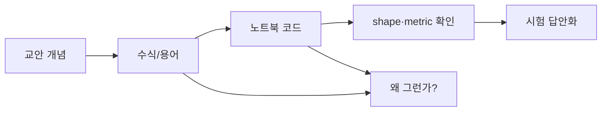

# On-Device AI 시험 대비 학습 준비 문맥

## 그림으로 보는 전체 학습 흐름

| 축 | 먼저 볼 것 | 코드에서 확인할 것 |
|---|---|---|
| Compression | pruning / quantization / KD | parameter count, bit-width, student loss |
| Vision | CNN, ViT, DETR, U-Net | tensor shape `[B,C,H,W]`, token shape `[B,N,D]` |
| LLM | tokenizer, attention, GPT, tuning | `[B,T]`, `[B,T,D]`, loss/PPL |

상태: 실제 학습 전 준비용.
자료 위치: `On-Device AI 강의자료/`

## 학습 원칙

각 챕터는 다음 순서로 본다.

1. PDF/슬라이드로 큰 그림을 잡는다.
2. base 실습 notebook을 직접 읽는다.
3. 코드 cell마다 shape, dtype, device, gradient 흐름을 해석한다.
4. 핵심 구현을 직접 다시 쓸 수 있는지 확인한다.
5. 시험 대비 비교표와 수식으로 마무리한다.

정답/Colab variant는 public viewer 범위에서 제외한다. 필요한 경우 로컬 검산용으로만 사용하고, 학습 노트는 base notebook과 PDF 흐름을 기준으로 정리한다.

## 공개 viewer 기준 자료 맵

### ODAI lecture notes

| 순서 | 주제 | 노트 |
|---:|---|---|
| ODAI-1 Ch.1 | On-Device AI 개요 | `on_device_ai/odai1_ch01_on_device_ai_key_points.md` |
| ODAI-1 Ch.2 | Network Pruning | `on_device_ai/odai1_ch02_network_pruning_key_points.md` |
| ODAI-1 Ch.3 | Quantization | `on_device_ai/odai1_ch03_quantization_key_points.md` |
| ODAI-1 Ch.4 | Knowledge Distillation | `on_device_ai/odai1_ch04_knowledge_distillation_key_points.md` |
| ODAI-2 Ch.1 | LLM Pruning / PEFT | `on_device_ai/odai2_ch01_llm_pruning_peft_key_points.md` |
| ODAI-2 Ch.2 | LLM Quantization | `on_device_ai/odai2_ch02_llm_quantization_key_points.md` |
| ODAI-2 Ch.3 | Efficient Inference | `on_device_ai/odai2_ch03_efficient_inference_key_points.md` |

### Practice notebooks

웹 viewer에서는 각 practice 항목이 **왼쪽 curated guide + 오른쪽 원본 notebook HTML** split view로 열린다.

| 순서 | base notebook | 학습 가이드 |
|---:|---|---|
| 01 | `1. Pruning for CNN.ipynb` | `on_device_ai/practice/01_pruning_cnn_practice_guide.md` |
| 02 | `2. Quantization for CNN.ipynb` | `on_device_ai/practice/02_quantization_cnn_practice_guide.md` |
| 03 | `3. Knowledge Distillation.ipynb` | `on_device_ai/practice/03_knowledge_distillation_practice_guide.md` |
| 04 | `4. Pruning for LLM.ipynb` | `on_device_ai/practice/04_pruning_llm_practice_guide.md` |
| 05 | `5. Quantization for LLM.ipynb` | `on_device_ai/practice/05_quantization_llm_practice_guide.md` |

## 챕터별 집중 포인트

| 챕터 | 반드시 설명할 수 있어야 하는 것 |
|---|---|
| Pruning CNN | mask, sparsity, fine-grained vs structured, one-shot vs iterative |
| Quantization CNN | scale, zero-point, per-tensor/per-channel, BN folding, QAT/PTQ |
| Knowledge Distillation | teacher/student, soft target, temperature, feature KD |
| Pruning LLM | perplexity, Linear pruning, calibration, Wanda score |
| Quantization LLM | weight-only quantization, group size, AWQ, SmoothQuant, pseudo vs packed quantization |

## 공부 중 체크리스트

- 수식의 각 term이 어떤 tensor/code 변수인지 연결한다.
- 모든 tensor는 shape를 적고 넘어간다.
- 속도 이득과 모델 크기 이득을 구분한다.
- 0으로 만드는 pruning과 실제 하드웨어 가속 사이의 간극을 계속 의식한다.
- low-bit 표현 실험과 실제 packed kernel 배포를 구분한다.
