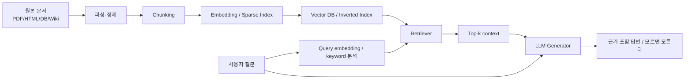
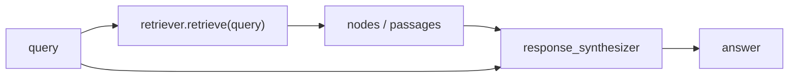

# RAG Day 1. Retrieval-Augmented Generation 깊은 복습

대상 원본: `rag/1일차/` 아래 RAG 1일차 PDF/HTML 자료와 실습 자료

목표: RAG를 “LLM에 외부 자료실을 붙이는 시스템”으로 보고, 검색 모델·청킹·랭킹·평가·생성 연결까지 한 번에 이해한다.

---

## 그림으로 먼저 잡기



| 단계 | 질문 | 대표 도구/개념 | 실패하면 생기는 일 |
|---|---|---|---|
| 문서 수집 | 무엇을 지식베이스에 넣나? | PDF, HTML, Wiki, DB | 최신/사내 지식 부재 |
| 청킹 | 어떤 단위로 자를까? | fixed, recursive, sentence, code splitter | 검색은 되지만 문맥이 잘림 |
| 인덱싱 | 어떻게 찾을 수 있게 저장하나? | TF-IDF, BM25, dense embedding, vector DB | 관련 문서를 못 찾음 |
| 검색 | 질문에 맞는 조각은? | top-k, hybrid, reranking | 엉뚱한 context 전달 |
| 생성 | 찾은 근거로 어떻게 답하나? | prompt, response synthesizer, citation | 환각, 근거 누락 |
| 평가 | 잘 찾고 잘 답했나? | Recall, MRR, NDCG, groundedness | 개선 방향을 모름 |

---

## 1. RAG가 필요한 이유

LLM은 파라미터 안에 들어 있는 지식으로 답한다. 그래서 다음 질문에 약하다.

- 학습 이후 생긴 최신 사실
- 회사 내부 문서, 사내 위키, 프로젝트 규칙
- 사용자가 방금 업로드한 PDF/표/코드
- 긴 원문을 정확히 인용해야 하는 질문

RAG는 질문이 들어올 때 관련 문서를 찾아 LLM prompt에 같이 넣는다. 비유하면 **닫힌 책 시험을 오픈북 시험으로 바꾸는 것**이다.

```text
기본 LLM: question -> model memory -> answer
RAG: question -> retrieve documents -> question + context -> answer
```

중요한 점은 RAG가 fine-tuning의 대체가 아니라는 것이다.

| 방식 | 바꾸는 것 | 좋은 경우 | 한계 |
|---|---|---|---|
| Fine-tuning | 모델의 행동/스타일/작업 패턴 | 형식 고정, 분류, 말투, 도메인 태스크 | 최신 문서 업데이트가 느림 |
| RAG | prompt에 넣는 외부 지식 | 사내 문서 QA, 최신 정보, citation | 검색 품질이 낮으면 답도 낮음 |

---

## 2. 인덱싱 파이프라인

인덱싱은 오프라인에서 미리 하는 준비다.

```text
문서 로드 -> 텍스트 정제 -> chunk 생성 -> embedding/keyword index -> 저장
```

### 2.1 문서 로드

PDF, HTML, Markdown, DB row, Wiki page 등은 그대로 검색하기 어렵다. 먼저 텍스트와 metadata로 바꾼다.

```text
Document = {
  text: "문서 내용",
  metadata: {source, page, section, url, updated_at}
}
```

metadata는 citation과 필터링에 중요하다. 답변에서 “어디를 근거로 했는지”를 보여주려면 source locator가 살아 있어야 한다.

### 2.2 청킹

긴 문서를 통째로 embedding하면 의미가 섞이고, 너무 잘게 자르면 문맥이 사라진다.

| 전략 | 예시 | 장점 | 주의점 |
|---|---|---|---|
| fixed-size | 500~1000 tokens, overlap 50~200 | 단순하고 안정적 | 절/표/코드가 중간에 잘림 |
| sentence/semantic | 문장·문단 중심 | 자연어 문맥 보존 | chunk 크기 상한 관리 필요 |
| recursive | 제목, 문단, 문장 순서로 재귀 분할 | Markdown/문서에 강함 | 표가 길면 깨질 수 있음 |
| code splitter | `class`, `def`, 함수 단위 | 코드 RAG에 유리 | 언어별 parser/구분자 필요 |

실무 체크:

1. chunk 하나만 봐도 질문에 답할 수 있는가?
2. 표 제목과 행이 같은 chunk에 남아 있는가?
3. 대명사 “그 회사/그 정책”의 antecedent가 남아 있는가?
4. chunk가 LLM context를 너무 많이 잡아먹지 않는가?

---

## 3. Sparse Retrieval: TF-IDF와 BM25

Sparse retrieval은 단어가 직접 겹치는지를 본다. 키워드가 명확한 검색에 강하다.

### 3.1 TF-IDF

TF-IDF는 “문서 안에서는 자주 나오고, 전체 문서에는 드문 단어”를 중요하게 본다.

$$
TFIDF(w,d,D)=TF(w,d)\times IDF(w,D)
$$

| 구성 | 의미 |
|---|---|
| TF | 해당 문서에서 단어가 얼마나 자주 나오는가 |
| DF | 전체 문서 중 그 단어가 등장한 문서 수 |
| IDF | 흔한 단어는 낮게, 드문 단어는 높게 |

“the”, “것”, “있다”처럼 모든 문서에 나오는 단어는 구분력이 낮다. 반면 “BM25”, “Dresden”, “DiskANN”처럼 특정 문서에만 나오는 단어는 검색 단서가 된다.

### 3.2 BM25

BM25는 TF-IDF를 실무 검색에 맞게 보정한 방식이다.

$$
score(w,d)=IDF(w) \cdot \frac{TF(w,d)(k+1)}{TF(w,d)+k(1-b+b\cdot |d|/avgdl)}
$$

| 파라미터 | 의미 |
|---|---|
| `k` | TF 포화 정도. 단어가 많이 나와도 점수가 무한히 커지지 않게 함 |
| `b` | 문서 길이 보정. 긴 문서가 단어를 많이 포함한다는 이유만으로 유리해지는 것을 막음 |
| `avgdl` | 평균 문서 길이 |

BM25 핵심은 **term frequency saturation**이다. 단어가 1번에서 2번 나올 때는 중요하지만, 20번에서 21번으로 늘어난다고 같은 만큼 중요해지지는 않는다.

---

## 4. Dense Retrieval: DPR과 embedding 검색

Dense retrieval은 query와 document를 벡터로 바꿔 의미 유사도를 본다.

```text
query -> EncQ -> q vector
document -> EncD -> d vector
score = q · d 또는 cosine(q, d)
```

| 방식 | 입력 | 장점 | 단점 |
|---|---|---|---|
| Cross-Encoder | `[CLS] query [SEP] doc [SEP]` | 정확한 relevance 판단 | 모든 query-doc 쌍을 BERT에 넣어야 해서 느림 |
| Bi-Encoder / DPR | query와 doc을 따로 encoding | 문서 벡터를 미리 저장 가능, 대규모 검색 빠름 | query-doc 상호작용이 약함 |

DPR류 모델은 positive 문서 점수를 높이고 negative 문서 점수를 낮추는 contrastive 학습을 한다.

$$
L=-\log \frac{\exp(score(q,d^+))}{\exp(score(q,d^+))+\sum_j \exp(score(q,d^-_j))}
$$

실무에서는 dense retrieval로 후보를 빠르게 찾고, cross-encoder reranker로 상위 후보를 다시 정렬하는 조합이 흔하다.

---

## 5. Hybrid Retrieval과 reranking

Sparse와 dense는 서로 잘하는 영역이 다르다.

| 질문 유형 | sparse 유리 | dense 유리 |
|---|---|---|
| 정확한 제품명/코드명 | 좋음 | 모델이 못 알면 약함 |
| 의미가 비슷한 표현 | 약함 | 좋음 |
| 숫자/고유명사 | 좋음 | embedding에서 희석 가능 |
| 긴 자연어 질문 | query expansion 없으면 약함 | 좋음 |

그래서 RAG에서는 다음 순서가 안정적이다.

```text
BM25 후보 + dense 후보 -> merge -> rerank -> top-k context -> LLM
```

reranker는 비싸지만 상위 20~100개 후보에만 적용하면 비용과 품질 균형이 좋다.

---

## 6. Top-k와 ranking 평가

검색은 “정답 문서를 상위에 올리는 문제”다.

| 지표 | 의미 | 언제 유용한가 |
|---|---|---|
| Success@k | 상위 k 안에 관련 문서가 하나라도 있나 | QA 근거 문서가 하나면 충분할 때 |
| Precision@k | 상위 k 중 관련 문서 비율 | context 낭비를 줄이고 싶을 때 |
| Recall@k | 전체 관련 문서 중 상위 k에 들어온 비율 | 관련 근거를 많이 모아야 할 때 |
| MRR | 첫 관련 문서가 몇 위인가 | 첫 근거 위치가 중요할 때 |
| NDCG@k | 관련도 등급과 순위를 함께 반영 | graded relevance 평가 |

RAG에서는 retrieval 평가와 generation 평가를 분리해야 한다.

```text
검색 실패: context 안에 답 근거가 없음 -> LLM이 맞히면 우연/parametric knowledge
생성 실패: context 안에 답 근거가 있는데 답을 잘못 구성
```

---

## 7. Query Engine과 Response Synthesizer

LlamaIndex 기준으로 Query Engine은 retriever와 response synthesizer를 묶은 인터페이스다.



Response mode에 따라 답변 방식이 달라진다.

| 모드/프롬프트 | 동작 | 주의점 |
|---|---|---|
| compact answer | 검색 문맥을 압축해 직접 답변 | context가 부족하면 환각 가능 |
| summary prompt | 문맥 요약 중심 | 질문에 대한 직접 답이 약해질 수 있음 |
| refine | 여러 chunk를 순서대로 보며 답변 개선 | 느리지만 긴 context 처리에 유리 |
| custom prompt | “근거 없으면 모른다” 등 정책 삽입 | prompt가 너무 길면 불안정 |

---

## 8. RAG-Sequence와 decoding 관점

RAG-Sequence는 여러 검색 문서를 latent variable처럼 두고 답변 확률을 합산하는 관점이다.

```text
p(y | x) = Σ_z p(z | x) p(y | x, z)
```

하지만 모든 문서 `z`를 다 볼 수 없으므로 top-k approximation을 쓴다.

```text
retrieve top-k documents -> 각 문서 조건부 생성 점수 계산 -> 합산/근사
```

실무 RAG에서도 같은 문제가 반복된다.

- top-k가 너무 작으면 필요한 근거가 빠진다.
- top-k가 너무 크면 LLM context가 오염되고 비용이 늘어난다.
- 서로 비슷한 chunk가 많으면 다양성이 낮아진다.

따라서 top-k는 “많을수록 좋다”가 아니라 **정답 근거를 포함하면서도 잡음을 최소화하는 값**이어야 한다.

---

## 9. ToolFormer와 RAG의 연결

ToolFormer는 LLM이 계산기, QA, 검색, 번역 같은 API 호출을 텍스트 중간에 삽입하는 법을 self-supervised로 배우는 접근이다.

RAG와 직접 같은 기술은 아니지만 공통 메시지는 같다.

```text
모델 파라미터만 믿지 말고, 필요한 순간 외부 도구/지식에 접근하게 한다.
```

| 비교 | RAG | ToolFormer |
|---|---|---|
| 외부 기능 | 문서 검색/지식 검색 | 계산기, QA, 위키검색, 번역 등 API |
| 호출 시점 | 주로 질문 처리 전/중 retrieval | 모델이 토큰 생성 중 API 호출 위치 학습 |
| 학습 여부 | 보통 시스템 구성으로 해결 | API 호출 데이터를 자동 생성해 fine-tuning |
| 핵심 판단 | 어떤 문서를 넣을까 | 언제 어떤 도구를 부를까 |

RAG 실무에서도 tool use와 결합된다. 예를 들어 “문서 검색 → SQL 실행 → 결과 요약”은 retrieval과 tool calling이 섞인 agentic RAG다.

---

## 10. 1일차 실습과 연결

1일차 실습은 두 축이다.

| 실습 | 핵심 |
|---|---|
| `1. Llama_index.ipynb` | Document → Index → Query Engine → insert/update/delete → custom query engine |
| `2. RAG.ipynb` | 기본 LLM의 한계 확인 → Wikipedia 문서 수집 → VectorStoreIndex RAG → chunk size/top-k/prompt 비교 |

실습을 볼 때는 다음을 계속 확인한다.

1. 지금 답변은 LLM parametric knowledge인가, retrieved context 근거인가?
2. retriever가 실제로 어떤 passage를 가져왔는가?
3. chunk size가 작아서 context가 잘렸는가?
4. top-k를 늘렸을 때 근거가 늘었는가, 잡음이 늘었는가?
5. response synthesizer/prompt를 바꾸면 답변 스타일이 어떻게 바뀌는가?

---

## 11. 시험/면접식 핵심 질문

1. RAG와 fine-tuning의 차이는 무엇인가?
2. BM25에서 TF가 무한히 점수를 올리지 못하게 하는 이유는?
3. dense retrieval에서 문서 embedding을 미리 계산할 수 있는 이유는?
4. Cross-Encoder가 Bi-Encoder보다 느리지만 정확할 수 있는 이유는?
5. chunk size가 너무 작거나 너무 클 때 각각 어떤 문제가 생기는가?
6. Recall@k와 Precision@k는 RAG에서 각각 무엇을 말해주는가?
7. LLM이 정답을 맞혔는데 retrieved passage에 근거가 없다면 어떻게 해석해야 하는가?
8. reranker는 왜 모든 문서가 아니라 후보 문서에만 적용하는가?
9. top-k를 늘리는 것이 항상 좋은가?
10. “근거 없으면 모른다”는 RAG의 어느 부분에서 강제해야 하는가?

---

## 12. 한 줄 요약

RAG Day 1의 핵심은 **문서를 잘게 잘라 잘 찾고, 찾은 근거만으로 답하게 만들며, 검색과 생성을 따로 평가하는 것**이다.
