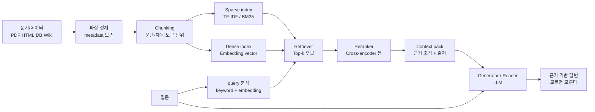
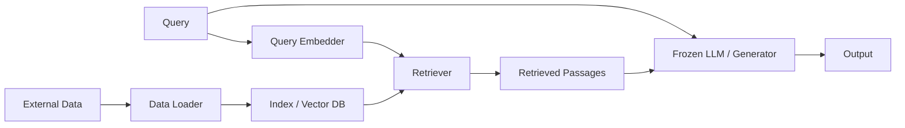
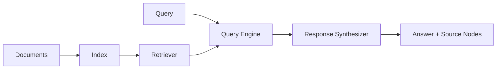

# RAG Day 1. Retrieval-Augmented Generation 깊은 복습

- 대상 원본
  - `rag/1일차/RAG (Samsung, final).pdf`
  - `rag/1일차/실습 자료/A Tutorial on Retrieval Augmented Generation.pptx.pdf`
  - `rag/1일차/RAG_Sequence Top-k Approximation Thorough Decoding.pdf`, `CrossEncoder.pdf`, `nearest neighbor - summary.pdf`
  - 실습 notebook: `rag/1일차/실습 자료/Code/1. Llama_index.ipynb`, `2. RAG.ipynb`
- 목표: RAG를 단순히 “LLM 앞에 검색을 붙이는 것”이 아니라, **정보검색(IR) + 표현학습 + 랭킹 평가 + 생성 모델 + 외부 지식베이스 운영**이 연결된 시스템으로 이해한다.

---

## 0. Day 1 전체 지도



| 큰 축 | Day1에서 보는 내용 | 왜 중요한가 |
|---|---|---|
| Classic IR | inverted index, TF-IDF, BM25 | “정확한 단어/고유명사” 검색의 기본기 |
| Neural IR | BERT, cross-encoder, DPR/bi-encoder | 의미가 비슷하지만 단어가 다른 질문을 찾기 위함 |
| Metrics | Success@k, MRR, Precision/Recall, AP/NDCG | 검색 품질과 생성 품질을 분리해서 평가 |
| RAG | retriever + generator, top-k context, citation | LLM hallucination과 지식 최신성 문제 완화 |
| LlamaIndex | data loader, index, retriever, query engine, response synthesizer | 실습에서 RAG 구성요소를 빠르게 연결하는 프레임워크 |
| Vector DB/ANN | LSH, PQ/ScaNN, HNSW, DiskANN | embedding 검색을 실제 규모에서 빠르게 수행 |

---

## 1. RAG가 필요한 이유: LLM의 기억과 외부 지식의 분리

LLM은 학습 시점까지의 패턴과 지식을 파라미터에 압축한다. 하지만 실제 서비스에서는 다음 문제가 계속 생긴다.

| 문제 | 예시 | RAG가 하는 일 |
|---|---|---|
| 최신성 | 어제 바뀐 정책, 사내 공지 | 최신 문서를 검색해서 prompt에 넣음 |
| 사내/개인 지식 | 비공개 매뉴얼, 회의록, 코드베이스 | 외부 지식베이스를 LLM 앞에 붙임 |
| 근거 부족 | 답은 그럴듯하지만 출처가 없음 | source metadata와 citation을 같이 전달 |
| 비용/속도 | 모든 지식을 fine-tuning하기 어려움 | 문서만 다시 indexing하면 반영 가능 |

```text
기본 LLM QA:
question -> model parametric memory -> answer

RAG QA:
question -> retrieve relevant passages -> question + passages -> grounded answer
```

중요한 구분:

| 방식 | 바꾸는 대상 | 좋은 경우 | 한계 |
|---|---|---|---|
| Fine-tuning | 모델 weight / 행동 패턴 | 말투, format, domain task, 분류 | 최신 문서 반영이 느림 |
| RAG | prompt에 넣는 외부 context | 사내 문서 QA, citation, 최신 정보 | retrieval이 틀리면 답도 흔들림 |
| Tool use | 모델이 호출하는 외부 API | 계산, DB 질의, 검색, 실행 | tool schema와 권한 설계 필요 |

RAG는 fine-tuning의 대체가 아니라 **지식 주입 위치를 prompt/context 쪽으로 옮기는 설계**다.

---

## 2. Classic IR 1: inverted index와 web indexing

강의 초반의 web indexing 예시는 RAG 이전의 검색 엔진 기본 구조다.

```text
문서 1: cat chases dog
문서 2: dog loves cat

토큰화 후 tuple:
(cat, 1), (chases, 1), (dog, 1), (dog, 2), (loves, 2), (cat, 2)

집계 후 inverted index:
cat -> [1, 2]
dog -> [1, 2]
chases -> [1]
loves -> [2]
```

| 단계 | 하는 일 | 분산 처리 관점 |
|---|---|---|
| Transform | document를 `(word, doc_id)` tuple로 변환 | 문서 단위로 병렬 처리 가능 |
| Shuffle / group | 같은 word를 같은 worker로 모음 | MapReduce의 shuffle과 유사 |
| Aggregate | posting list 생성 | word별 doc list를 압축/저장 |
| Query | query term의 posting list를 읽고 조합 | intersection/union/score 계산 |

RAG에서도 inverted index는 여전히 중요하다. embedding 검색이 좋아도 `BM25`, `DiskANN`, 제품명, 함수명, 에러 코드처럼 정확한 문자열은 sparse retrieval이 더 강할 수 있다.

---

## 3. Classic IR 2: Sparse retrieval, TF-IDF, BM25

Sparse retrieval은 query와 document를 vocabulary 차원의 희소 벡터로 본다.

```text
query:    what is nlp
Document: nlp is an acronym for natural language processing
```

### 3.1 TF-IDF

$$
TFIDF(w,d,D)=TF(w,d)\times IDF(w,D)
$$

| 구성 | 의미 | 직관 |
|---|---|---|
| TF | document 안에서 단어가 얼마나 자주 나오나 | 많이 나오면 해당 문서의 주제일 가능성 |
| DF | 전체 corpus 중 그 단어가 나온 문서 수 | 너무 흔한 단어인지 확인 |
| IDF | 흔한 단어의 가중치를 낮춤 | `the`, `is`보다 `BM25`, `DPR`이 중요 |

### 3.2 BM25

BM25는 TF-IDF에 document length normalization과 TF saturation을 더한 대표 ranking 함수다.

$$
score(w,d)=IDF(w)\frac{TF(w,d)(k+1)}{TF(w,d)+k(1-b+b\cdot |d|/avgdl)}
$$

| 파라미터 | 의미 | 커지거나 작아질 때 |
|---|---|---|
| `k` | term frequency 증가를 얼마나 빨리 포화시킬지 | 너무 크면 반복 단어가 과대평가될 수 있음 |
| `b` | document 길이 보정 강도 | 긴 문서가 유리/불리해지는 정도 조절 |
| `avgdl` | 평균 문서 길이 | corpus 전체 통계 |

실무 감각:

- BM25는 **정확한 키워드, 식별자, 숫자, 에러 메시지**에 강하다.
- embedding은 paraphrase에 강하지만 고유명사/숫자는 희석될 수 있다.
- 좋은 RAG는 BM25와 dense retrieval을 같이 쓰고, reranker로 정렬하는 경우가 많다.

---

## 4. IR 평가: 검색을 먼저 따로 평가한다

RAG 실패를 보면 두 가지가 섞인다.

```text
검색 실패: context 안에 답의 근거가 없음
생성 실패: context 안에 근거가 있는데 답을 잘못 구성함
```

따라서 RAG 평가는 최소한 retrieval 평가와 generation 평가를 분리해야 한다.

| 지표 | 계산 질문 | 좋은 사용처 |
|---|---|---|
| Success@k | top-k 안에 관련 문서가 하나라도 있는가? | 답 근거 하나면 충분한 QA |
| Precision@k | top-k 중 관련 문서 비율은? | context 오염/낭비를 줄이고 싶을 때 |
| Recall@k | 전체 관련 문서 중 top-k에 얼마나 들어왔나? | 근거를 빠뜨리면 안 되는 질문 |
| MRR | 첫 관련 문서가 몇 위에 나오는가? | 첫 근거가 빨리 나와야 하는 UX |
| Average Precision | 관련 문서들이 순위 전반에 잘 배치됐나? | 여러 관련 문서가 있을 때 |
| NDCG@k | 관련도 등급과 순위를 함께 반영 | graded relevance 평가 |

### 지표 선택 기준

| 상황 | 우선 지표 |
|---|---|
| top-1 근거만 LLM에 넣음 | MRR, Success@1 |
| top-5 context pack을 넣음 | Success@5, Recall@5, Precision@5 |
| 관련 문서가 여러 개이고 빠뜨리면 위험 | Recall@k, NDCG@k |
| latency가 중요 | quality 지표 + p95 latency 같이 봄 |

검색 평가 없이 LLM 답변만 보면, 모델이 parametric memory로 우연히 맞힌 것인지 retrieval이 잘 된 것인지 구분하기 어렵다.

---

## 5. Transformer/BERT가 Neural IR에 들어오는 이유

Classic IR은 단어 overlap에 강하지만 의미 표현에는 약하다. Transformer/BERT는 문맥화된 embedding을 만든다.

### 5.1 Self-attention 복습

각 token representation `x_i`에서 query/key/value를 만든다.

```text
q_i = W_Q x_i
k_i = W_K x_i
v_i = W_V x_i
score(i,j) = q_i · k_j / sqrt(d_k)
attention(i,j) = softmax_j(score(i,j))
r_i = Σ_j attention(i,j) v_j
```

| 객체 | shape 예시 | 의미 |
|---|---:|---|
| token embeddings | `[B,T,D]` | 입력 token 표현 |
| Q/K/V | `[B,H,T,d_h]` | head별 query/key/value |
| attention scores | `[B,H,T,T]` | token 간 참조 점수 |
| contextualized output | `[B,T,D]` | 문맥이 섞인 token 표현 |

### 5.2 BERT와 IR

BERT는 Transformer encoder stack으로 문장/문서 표현을 만든다. IR에서는 크게 두 방식이 나온다.

| 방식 | 입력 | 출력 | 장점 | 단점 |
|---|---|---|---|---|
| Cross-Encoder | `[CLS] query [SEP] doc [SEP]` | relevance score | query-doc interaction이 강함 | 모든 후보 쌍을 통과시켜야 해 느림 |
| Bi-Encoder / DPR | query와 doc을 따로 encode | vector dot product | 문서 embedding을 미리 저장 가능 | query-doc 상호작용이 약함 |

실무 RAG에서는 보통 다음 조합을 쓴다.

```text
1차 후보: BM25 + dense vector search로 top 50~200
2차 정렬: cross-encoder reranker로 top 5~20 재정렬
LLM 입력: 최종 top-k context pack
```

---

## 6. Dense retrieval, DPR, contrastive learning

Dense retrieval은 query와 document를 같은 vector space에 놓고 내적/cosine similarity로 검색한다.

```text
query -> EncQ -> q vector
document -> EncD -> d vector
score(q,d) = q · d  또는 cosine(q,d)
```

DPR(Dense Passage Retrieval)은 positive passage 점수를 높이고 negative passage 점수를 낮추도록 contrastive learning을 한다.

$$
L=-\log \frac{\exp(score(q,d^+))}{\exp(score(q,d^+))+\sum_j \exp(score(q,d^-_j))}
$$

| 구성 | 의미 |
|---|---|
| positive passage | 질문의 정답 근거 문서 |
| negative passage | 같은 batch나 sampling으로 만든 오답 문서 |
| in-batch negatives | batch 안의 다른 문서를 negative로 재사용 |
| score | query/document vector 유사도 |

### Cross-Encoder in-batch contrastive loss

Cross-Encoder 자료는 query/document pair를 함께 넣고 scalar score를 만드는 구조를 강조한다.

```text
[CLS] q [SEP] d [SEP] -> Transformer -> h_CLS -> score(q,d)
```

batch에 `(q_i, d_i^+)`가 `B`개 있으면, 모든 `s_{i,j}=score(q_i,d_j)`를 만들고 `d_i`가 `q_i`의 정답이 되도록 softmax loss를 건다. 정확도는 좋지만 비용이 커서 reranking 단계에 어울린다.

---

## 7. RAG architecture: component를 나눠서 보기

RAG 실습 PPT의 핵심 그림은 다음 구조다.



| Component | 입력 | 출력 | 책임 |
|---|---|---|---|
| Data Loader | PDF/HTML/text/DB | Document objects | 원본을 text + metadata로 변환 |
| Chunker / Node parser | 긴 문서 | chunks/nodes | 검색 가능한 단위로 분할 |
| Embedder | chunk/query text | vector | semantic retrieval용 표현 생성 |
| Vector DB / Index | vectors + metadata | searchable store | top-k 후보 검색 |
| Retriever | query | nodes/passages | 관련 context 후보 반환 |
| Generator / Reader | query + context | answer | 근거 기반 답변 생성 |
| Query Engine | query | response | retriever와 synthesizer를 묶은 인터페이스 |

RAG를 디버깅할 때도 component 단위로 봐야 한다.

| 증상 | 먼저 볼 곳 |
|---|---|
| 아예 관련 문서를 못 찾음 | chunking, embedding model, index, retriever top-k |
| 관련 문서는 있는데 답이 틀림 | prompt, response synthesizer, context ordering |
| 출처가 틀림 | metadata/source locator 보존 여부 |
| 답이 너무 장황/짧음 | response mode, prompt template |
| 느림 | vector DB latency, reranker 후보 수, LLM context 길이 |

---

## 8. RAG-Sequence와 top-k approximation

RAG 논문 관점에서는 검색 문서 `z`를 latent variable처럼 둔다.

$$
p(y|x)=\sum_z p(z|x)p(y|x,z)
$$

모든 문서를 합산할 수 없기 때문에 실제로는 top-k approximation을 쓴다.

```text
retrieve top-k documents
-> each document becomes possible evidence z
-> generator estimates p(y | x, z)
-> combine/approximate over top-k
```

| 설계값 | 너무 작을 때 | 너무 클 때 |
|---|---|---|
| `top_k` | 정답 근거가 빠짐 | context 오염, 비용 증가 |
| chunk size | 근거가 잘림 | 다른 주제가 섞임 |
| overlap | 문맥 연결 실패 | 중복 context 증가 |
| rerank 후보 수 | 좋은 문서를 놓침 | cross-encoder 비용 증가 |

RAG-Sequence 관점은 실무에도 그대로 연결된다. `top_k`는 “많을수록 좋다”가 아니라 **정답 근거를 포함하면서 잡음을 최소화하는 값**이다.

---

## 9. 언제 retrieve할 것인가?

강의 후반의 “When do we retrieve?” 질문은 RAG 시스템 설계에서 중요하다.

| 방식 | 설명 | 장점 | 단점 |
|---|---|---|---|
| 처음 한 번 검색 | question을 받아 generation 전 top-k 검색 | 구현 단순, 대부분 시스템 기본 | 생성 중 새로 필요한 정보 반영 어려움 |
| 여러 번 검색 | generation 중 필요할 때 다시 검색 | 긴 추론/멀티홉에 유리 | latency와 tool orchestration 증가 |
| search token/tool call | 모델이 검색 필요성을 표시 | agent/tool use와 연결 | 학습/프롬프트/권한 설계 필요 |
| uncertainty 기반 검색 | 모델 확신이 낮을 때 검색 | 불필요한 검색 절감 | uncertainty 추정이 어렵다 |

Day1 실습은 기본적으로 “처음 한 번 검색” 구조지만, ToolFormer나 agentic RAG로 가면 검색이 generation 과정 안으로 들어간다.

---

## 10. LlamaIndex 실습: Query Engine이 무엇을 감싸는가

LlamaIndex는 context-augmented LLM app을 빠르게 만들기 위한 프레임워크다. 실습에서 중요한 것은 “마법”이 아니라 어떤 component를 감싸는지 보는 것이다.



| LlamaIndex 객체 | RAG component | 확인할 것 |
|---|---|---|
| `Document` | 원본 text + metadata | source/page/section이 살아 있는가 |
| `Node` | chunk | chunk size와 overlap |
| `Index` | 검색 구조 | vector index인지 summary/tree index인지 |
| `Retriever` | top-k 후보 반환 | similarity_top_k, filters |
| `QueryEngine` | retriever + response synthesizer | response mode, prompt |
| `Response` | 답변 + source nodes | citation/debug 가능 여부 |

### Query Engine 없이 보기 vs Query Engine으로 보기

| 방식 | 장점 | 단점 |
|---|---|---|
| retriever 직접 호출 | 검색 결과를 눈으로 디버깅하기 좋음 | 답변 생성까지 직접 연결해야 함 |
| query engine 사용 | 질문→답변까지 빠르게 연결 | 내부 검색/합성 과정을 놓치기 쉬움 |

실습할 때는 먼저 retriever 결과를 출력해서 “맞는 chunk가 올라오는지” 확인한 뒤 query engine 답변을 보는 순서가 좋다.

---

## 11. External Knowledge Database Management

RAG는 한 번 indexing하고 끝나는 demo가 아니라, 외부 지식베이스를 계속 운영하는 시스템이다.

| 운영 작업 | 의미 | 주의점 |
|---|---|---|
| Insert | 새 문서 추가 | metadata/source id 부여 |
| Delete | 문서 삭제 | vector와 원문/chunk가 같이 지워져야 함 |
| Update | 문서 수정 | 기존 doc id 기준으로 delete 후 re-index 또는 versioning |
| Rebuild | embedding model/chunking 변경 | 전체 재색인 필요 가능 |
| Filter | 특정 source/date/tenant만 검색 | metadata schema가 중요 |

PPT의 database management 원칙은 “vector만 저장할지, 원문+embedding을 함께 저장할지”를 묻는다.

| 저장 방식 | 장점 | 단점 |
|---|---|---|
| vector만 저장 | 가볍다 | citation/재구성/디버깅이 어렵다 |
| 원문 chunk + vector + metadata | RAG 운영에 적합 | 저장량 증가 |
| raw source 별도 보관 + index에는 locator | 재처리 가능 | locator 안정성이 필요 |

좋은 RAG는 답변 순간뿐 아니라 “나중에 왜 이 답을 했는가”를 추적할 수 있어야 한다.

---

## 12. Chunking과 prompt/response configuration

실습 PPT는 changeable configuration으로 chunk size, retriever, custom query engine, summary/direct answer, prompt design을 제시한다.

### 12.1 Chunk size

| 설정 | 효과 | 실패 패턴 |
|---|---|---|
| 작은 chunk | 정밀한 검색, context 절약 | 표/문단이 쪼개져 답 근거 부족 |
| 큰 chunk | 문맥 보존 | embedding 의미가 섞이고 top-k 낭비 |
| overlap 있음 | 경계 문맥 보존 | 중복이 늘어 context pack 오염 |
| heading-aware chunk | 문서 구조 보존 | parser가 source format에 의존 |

실무 체크리스트:

1. chunk 하나만 보고 질문에 답할 수 있는가?
2. 표의 제목/열/행이 같은 chunk에 남아 있는가?
3. source/page/section metadata가 붙어 있는가?
4. 같은 문서의 중복 chunk가 top-k를 독점하지 않는가?

### 12.2 Response mode

| mode | 동작 | 좋은 경우 | 주의점 |
|---|---|---|---|
| direct / compact | top-k context를 모아 바로 답변 | 짧은 QA | 근거 부족 시 환각 가능 |
| summary | context 요약 중심 | 긴 문서 요약 | 질문에 대한 직접 답이 약할 수 있음 |
| refine | chunk를 순차적으로 보며 답변 개선 | 긴 context 처리 | 느리고 앞 chunk 편향 가능 |
| custom prompt | 정책/형식 제어 | “근거 없으면 모른다” 등 | prompt가 길면 불안정 |

---

## 13. ANN과 Vector DB: embedding 검색을 실제 규모로 빠르게 하기

Dense retrieval은 모든 document vector와 query vector를 brute-force 비교하면 비용이 크다. 그래서 ANN(Approximate Nearest Neighbor) 구조가 필요하다.

```text
입력: q ∈ R^D, database vectors x_1 ... x_N
목표: argmin ||q - x_n|| 또는 top-k nearest vectors
문제: N이 million/billion scale이면 전수 비교가 느림
```

| 계열 | 핵심 아이디어 | 예시 |
|---|---|---|
| Hashing | 비슷한 vector가 같은 bucket에 들어가게 함 | LSH |
| Tree/space partition | 공간을 나눠 후보를 줄임 | kd-tree, IVF |
| Quantization | vector를 압축해 거리 계산 가속 | PQ, OPQ, ScaNN |
| Graph traversal | 가까운 점끼리 graph edge를 만들고 탐색 | HNSW, NSG, Vamana/DiskANN |
| Managed Vector DB | algorithm + 저장/필터/운영 API 제공 | Milvus, Pinecone, Qdrant 등 |

### 13.1 LSH와 kd-tree

| 방식 | 장점 | 약점 |
|---|---|---|
| kd-tree | 저차원 공간 분할이 직관적 | 고차원에서 성능 저하 |
| LSH | 고차원 approximate search에 사용 가능 | recall/space/hash 설정 trade-off |

LSH는 random hyperplane 등으로 binary hash를 만들고, 같은 bin 또는 가까운 bin에서 후보를 찾는다.

### 13.2 Quantization / ScaNN

PQ(Product Quantization)는 vector를 여러 sub-vector로 나누고 각 부분을 codebook index로 압축한다. 장점은 메모리와 거리 계산 비용 감소, 단점은 approximation error다.

### 13.3 Graph-based search / HNSW / DiskANN

Graph search는 가까운 vector끼리 edge를 만들고 query에서 가까운 node를 따라가며 후보를 확장한다.

| 개념 | 의미 |
|---|---|
| candidate size | 탐색 중 유지하는 후보 수. 클수록 정확하지만 느림 |
| greedy search | 현재 가장 가까운 이웃만 따라감 |
| beam search | 여러 후보를 유지하며 탐색 |
| RNG-pruning | 너무 dense한 edge를 줄여 탐색 효율 개선 |
| HNSW | 계층적 graph로 coarse-to-fine 탐색 |
| DiskANN/Vamana | disk-friendly graph search 설계 |

Vector DB를 고를 때는 algorithm 이름만 보지 말고 다음 층위를 분리해야 한다.

| 층위 | 질문 |
|---|---|
| Algorithm | HNSW/PQ/IVF/ScaNN 등 어떤 검색 원리인가? |
| Library | FAISS, hnswlib처럼 로컬 검색 함수를 제공하는가? |
| Service / Vector DB | 저장, metadata filter, replication, backup, API를 제공하는가? |

---

## 14. Hybrid Retrieval과 reranking 설계 패턴

Sparse와 dense는 서로 보완적이다.

| 질문 유형 | sparse 유리 | dense 유리 |
|---|---|---|
| 정확한 제품명/함수명/에러 코드 | 매우 강함 | embedding에서 희석될 수 있음 |
| 의미가 비슷한 표현 | 약함 | 강함 |
| 숫자/날짜/버전 | 강함 | 종종 약함 |
| 긴 설명형 질문 | keyword만으로 부족 | semantic match 유리 |

추천 baseline:

```text
BM25 top 50
+ Dense top 50
-> merge/deduplicate
-> Cross-encoder rerank top 20
-> LLM context top 5~10
```

이 구조는 검색 recall과 최종 precision 사이의 균형을 잡기 쉽다.

---

## 15. Day1 실습과 연결해서 읽기

| 실습 | 파일 | 학습 포인트 |
|---|---|---|
| LlamaIndex Query Engine | `1. Llama_index.ipynb` | Document → Index → QueryEngine → Response/source nodes |
| RAG App | `2. RAG.ipynb` | city text를 knowledge base로 넣고 질문에 답하게 만드는 end-to-end 흐름 |
| city data | `city.txt`, `city_short.txt` | chunking/top-k가 답 품질에 미치는 영향 관찰 |

실습에서 꼭 찍어볼 것:

1. query를 넣기 전 index에 들어간 document/node 수를 확인한다.
2. query engine 답변만 보지 말고 source nodes를 출력한다.
3. `similarity_top_k`를 1, 3, 5로 바꿔 context가 어떻게 달라지는지 본다.
4. prompt에 “근거에 없으면 모른다고 답하라”를 넣고 hallucination이 줄어드는지 본다.
5. chunk size를 바꾼 뒤 같은 질문을 던져 검색 실패/생성 실패를 구분한다.

---

## 16. 시험/면접식 핵심 질문

| 질문 | 답변 방향 |
|---|---|
| RAG와 fine-tuning의 차이는? | weight를 바꾸는가, 외부 context를 넣는가로 구분 |
| BM25가 dense retrieval보다 나은 경우는? | 정확한 키워드, 고유명사, 숫자, 에러 코드 |
| Cross-Encoder와 Bi-Encoder 차이는? | query-doc joint encoding vs separate encoding/precomputed vectors |
| 왜 reranker를 쓰나? | 1차 검색 recall은 넓게, 최종 context precision은 높게 |
| top-k를 키우면 항상 좋은가? | 근거 포함 가능성은 늘지만 잡음/비용/환각 위험도 증가 |
| RAG 평가는 어떻게 나눠야 하나? | retrieval metric과 generation groundedness/answer quality 분리 |
| Vector DB는 알고리즘인가 서비스인가? | HNSW/PQ는 알고리즘, FAISS는 library, Qdrant/Pinecone/Milvus는 운영 기능 포함 서비스/DB |
| metadata가 왜 중요한가? | citation, filter, delete/update, tenant isolation, 디버깅에 필요 |

---

## 17. 한 장 요약

```text
RAG = Retrieval system + Knowledge DB operations + LLM generation policy

좋은 답변 = 좋은 검색 + 좋은 context 구성 + 좋은 생성 prompt
나쁜 답변을 고칠 때 = retriever / reranker / prompt / DB 운영을 분리해서 본다
```

- sparse retrieval은 여전히 필수다.
- dense retrieval은 의미 매칭을 강화한다.
- cross-encoder reranker는 비싸지만 final ranking 품질을 높인다.
- top-k, chunk size, overlap은 품질/비용 trade-off다.
- source locator와 metadata는 RAG 운영의 안전장치다.
- ANN/vector DB는 “embedding 검색을 빠르게 하는 인프라”이며, algorithm/library/service 층위를 구분해야 한다.
