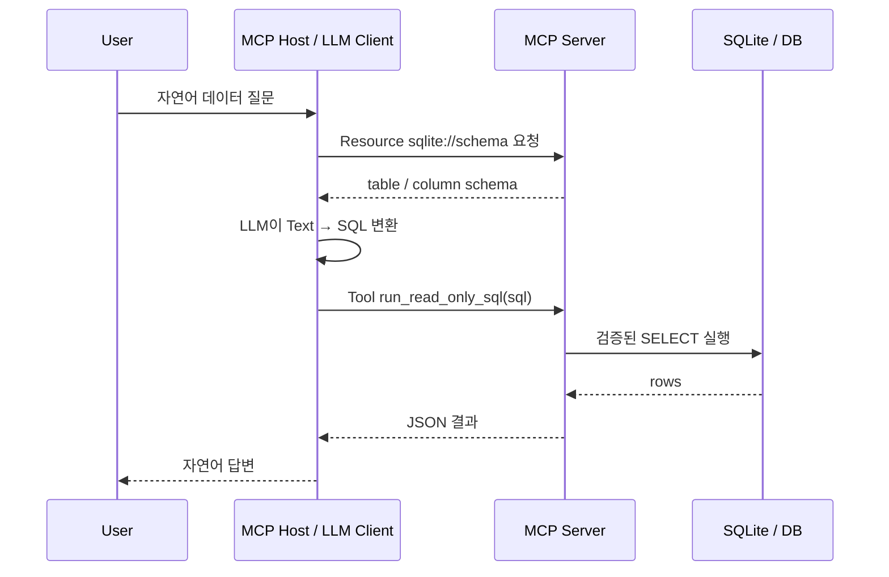

# RAG Day 2-1. MCP와 Text2SQL 깊은 복습

대상 자료: `rag/2일차/NL2SQL___mcp.pdf`, `rag/2일차/text2sql_mcp_lecture.html`, `rag/2일차/mcp-text2sql/`

목표: MCP를 단순한 “LLM 플러그인”이 아니라 **Host/Client와 Server 사이에서 Resource, Tool, Prompt를 표준화하는 프로토콜**로 이해하고, Text2SQL 실행 위치와 안전 경계를 설명한다.

## 1. 시험에서 먼저 복원할 전체 흐름



핵심은 **Text2SQL이 MCP Server 내부가 아니라 Host 쪽 LLM 호출에서 일어난다**는 점이다. Server는 schema를 읽게 하고, 허용된 SQL을 실행한다.

## 2. Host, Client, Server 책임 분리

| 구성요소 | 책임 | 하면 안 되는 착각 |
|---|---|---|
| MCP Host | UI, 대화 상태, LLM 호출, tool 사용 여부 결정 | Server가 질문 의도를 알아서 분류한다고 생각하기 |
| MCP Client | Server 연결, resource/tool/prompt 목록 조회, 호출 전달 | 비즈니스 로직 전체를 소유한다고 생각하기 |
| MCP Server | resource 제공, tool 실행, 입력 검증, 결과 반환 | LLM을 직접 호출해 Text2SQL을 한다고 생각하기 |
| Database | schema와 row 저장, SQL 실행 | LLM에게 직접 노출하기 |

## 3. MCP의 세 가지 핵심 요소

| 요소 | 성격 | Text2SQL 예시 | 호출 방식 |
|---|---|---|---|
| Resource | 읽기 전용 context | `sqlite://schema` | URI로 조회 |
| Tool | 실행 가능한 동작 | `run_read_only_sql(sql)` | schema에 맞춰 호출 |
| Prompt | 재사용 instruction template | SQL 생성 규칙 | 인자를 채워 사용 |

### Resource

```python
@mcp.resource("sqlite://schema")
def schema() -> str:
    ...
```

Resource는 함수처럼 “실행해서 효과를 만드는 것”이 아니다. 모델이 올바른 table/column을 사용하도록 grounding context를 제공한다.

### Tool

```python
@mcp.tool()
def run_read_only_sql(sql: str) -> list[dict]:
    ...
```

Tool은 외부 효과를 만들 수 있으므로 입력 검증과 권한 경계가 핵심이다. 시험에서는 decorator 이름보다 **왜 schema resource와 SQL execution tool을 분리하는지** 설명할 수 있어야 한다.

### Prompt

```python
@mcp.prompt()
def text2sql(user_question: str) -> str:
    return f"Use sqlite://schema and convert this question to SQL: {user_question}"
```

Prompt는 실행기가 아니라 Host/LLM이 일관된 방식으로 tool input을 만들도록 돕는 template이다.

## 4. Text2SQL 안전 설계

단순히 `sql.lower().startswith("select")`만 검사하면 부족하다.

1. read-only DB connection 또는 read-only transaction을 사용한다.
2. parser/AST로 statement type을 검사한다.
3. 여러 statement와 comment 우회를 금지한다.
4. 접근 가능한 table/column을 allowlist한다.
5. row limit, timeout, query cost limit을 둔다.
6. 실행 error를 구조화해 Host가 수정·재시도할 수 있게 한다.
7. 생성 SQL과 tool 호출을 audit log로 남긴다.

## 5. 일반 Chat과 Text2SQL 라우팅

```text
user message
  -> intent = CHAT | TEXT2SQL
  -> CHAT: 일반 LLM 호출
  -> TEXT2SQL: schema resource + SQL tool 노출
```

라우팅은 Host 책임이다. MCP Server는 같은 resource/tool을 유지하고, Host가 상황에 따라 어떤 tool set을 모델에 보여줄지 결정한다.

## 6. RAG와 MCP의 관계

| RAG 단계 | MCP로 확장되는 부분 |
|---|---|
| Retrieve | vector 검색뿐 아니라 KG/DB/API tool 호출 가능 |
| Augment | tool 결과와 resource를 context로 구성 |
| Generate | context와 query time을 사용해 답변 생성 |

MCP 자체가 RAG 알고리즘은 아니다. **검색·실행 능력을 표준화하여 RAG가 쓸 수 있는 외부 context source를 늘리는 연결 계층**이다.

## 7. 출제 예상 빈칸

```python
from mcp.server.fastmcp import FastMCP

mcp = FastMCP("Text2SQL Service")

@mcp.resource("sqlite://schema")
def schema() -> str:
    ...

@mcp.tool()
def run_read_only_sql(sql: str):
    ...
```

- `FastMCP` 초기화
- `@mcp.resource(...)`와 `@mcp.tool()` 구분
- Host가 schema를 읽는 순서
- LLM이 SQL을 생성하는 위치
- read-only SQL 검증
- MCP client가 tool list/resource를 조회하는 코드

## 8. 자가 점검

1. Host와 Server 중 누가 LLM을 호출하는가?
2. schema를 Tool이 아니라 Resource로 제공하는 이유는 무엇인가?
3. Text2SQL은 정확히 어느 단계에서 일어나는가?
4. SQL tool을 read-only로 제한하는 방법을 세 가지 말할 수 있는가?
5. MCP가 RAG의 retriever를 어떻게 확장하는지 설명할 수 있는가?
