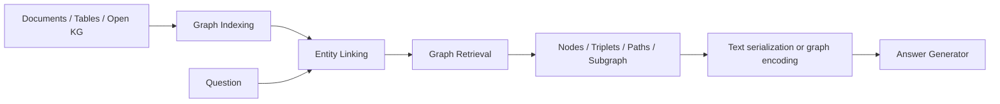

# RAG Day 2-2. GraphRAG와 CRAG 깊은 복습

대상 자료: `rag/2일차/Graph_RAG.pdf`, `rag/2일차/실습 자료/A Tutorial on Graph RAG  & Meta KDD cup.pptx.pdf`, `cypher.pdf`, `sparql.pdf`

목표: GraphRAG를 “vector 검색에 graph를 붙인 것”으로 외우지 않고, **graph indexing → graph-guided retrieval → graph-enhanced generation**의 세 단계와 CRAG 실습의 Web/KG 결합 흐름으로 이해한다.

## 1. Text RAG와 GraphRAG

| 비교 | Text RAG | GraphRAG |
|---|---|---|
| 기본 단위 | chunk / passage | node, edge, triplet, path, subgraph |
| 관계 표현 | 텍스트 안에 암묵적 | edge로 명시적 |
| 강점 | 단일 사실·문단 검색 | multi-hop 관계, entity 연결, 구조화 지식 |
| 주요 실패 | chunk 경계, semantic 유사도 오검색 | entity linking, 관계 누락, subgraph 폭발 |

Text-Attributed Graph는 다음처럼 볼 수 있다.

```text
G = (V, E, Xv, Xe)
V: node/entity
E: relation/edge
Xv: node text attribute
Xe: edge text attribute
```

Knowledge Graph에서는 보통 `subject - predicate -> object` triplet이 기본 단위다.

## 2. GraphRAG의 세 단계



### 2.1 Graph-Based Indexing

- Open KG: Wikidata, Freebase, ConceptNet 같은 기존 graph
- Domain KG: 금융·의료 등 특정 영역 graph
- Self-constructed graph: 문서에서 entity/relation을 추출해 구성
- Hybrid indexing: graph structure + text + vector를 함께 저장

### 2.2 Graph-Guided Retrieval

질문과 관련된 최적 graph element $G^*$를 찾는다.

$$
G^* = \arg\max_{G' \subseteq G} \operatorname{Sim}(q, G')
$$

검색 방식:

- non-parametric: BFS, shortest path, personalized PageRank 등
- LM-based: LLM이 entity/relation/path를 선택
- GNN-based: node/entity score를 학습해 subgraph 구성
- iterative/multi-stage: entity linking → 확장 → pruning 반복

### 2.3 Graph-Enhanced Generation

retrieved graph를 generator가 읽을 수 있게 바꾼다.

- triplet text로 직렬화
- path를 reasoning chain처럼 표현
- subgraph summary 생성
- graph encoder/GNN embedding 사용

## 3. Retrieval Granularity

| 단위 | 예 | 장점 | 위험 |
|---|---|---|---|
| Node | `NVIDIA` | 단순하고 빠름 | 관계 근거 부족 |
| Triplet | `NVIDIA --CEO--> Jensen Huang` | 관계가 명확 | multi-hop 부족 |
| Path | A→B→C | 추론 경로 제공 | 긴 path에 잡음 |
| Subgraph | 여러 path 결합 | 풍부한 관계 문맥 | context/token 폭증 |
| Hybrid | text + graph + vector | recall 보완 | 설계·평가 복잡 |

## 4. Cypher와 SPARQL의 역할

| 언어 | 대상 | 기본 사고방식 |
|---|---|---|
| Cypher | property graph | node/edge pattern을 `MATCH` |
| SPARQL | RDF graph | subject-predicate-object triple pattern |

Cypher 예:

```cypher
MATCH (c:Company)-[:HAS_CEO]->(p:Person)
WHERE c.name = $company
RETURN p.name
```

SPARQL 예:

```sparql
SELECT ?person WHERE {
  ?company :name ?companyName .
  ?company :hasCEO ?person .
  FILTER(?companyName = "NVIDIA")
}
```

시험에서는 문법 전체보다 **질문에서 entity와 relation을 뽑아 graph query로 연결하는 구조**가 중요하다.

## 5. CRAG Benchmark 실습 구조

CRAG는 질문에 다음 정보를 단계적으로 추가해 RAG 능력을 평가한다.

| Task | 사용 정보 | 핵심 구현 |
|---|---|---|
| Task 1 | Web search results | HTML parsing, chunking, embedding retrieval, Reader |
| Task 2 | Web + Mock KG/API | query generation, decision tree, KG execution |
| MCP upgrade | KG tools 표준화 | MCP client/tool discovery, agent tool calling |

CRAG Score의 강의 포인트:

$$
\text{CRAG Score} = \text{Exact Accuracy} + 0.5 \times \text{Accuracy} - \text{Hallucination Rate}
$$

“모르면 모른다고 답하는 것”이 hallucination penalty를 줄이는 전략이 될 수 있다.

## 6. Web + KG 결합 흐름

```text
query
  ├─ web search results -> HTML parse -> chunks -> embedding top-k
  └─ entity/query generation -> Mock KG API -> structured results
       ↓
references + query_time
       ↓
Reader -> final answer
```

KG는 precise structured fact에 강하고 Web은 coverage에 강하다. 두 결과를 합칠 때는 중복, 시간 기준, 충돌하는 값, context 길이를 관리해야 한다.

## 7. 출제 예상 빈칸

- HTML에서 text를 추출하는 `BeautifulSoup(...).get_text(...)`
- chunk embedding과 query embedding의 cosine similarity
- `topk` index 선택
- `Retriever → Reader` 조합 class
- entity extraction prompt와 JSON parsing
- query domain에 따른 Mock API decision tree
- `RAGWithKG`, `RAGWithSRKG`의 `inference` 흐름
- CRAG evaluation 결과 parser

## 8. 자가 점검

1. node, triplet, path, subgraph의 차이를 설명할 수 있는가?
2. entity linking이 틀리면 이후 retrieval이 왜 모두 무너지는가?
3. KG 결과와 Web 결과를 합칠 때 query time이 왜 중요한가?
4. GraphRAG의 indexing/retrieval/generation 각 단계 입력·출력은 무엇인가?
5. CRAG Score가 hallucination을 별도로 벌점 처리하는 이유는 무엇인가?
