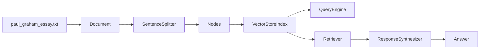

# RAG Practice 01. LlamaIndex Query Engine 코드 학습 가이드

<!-- aisp-exam-practice-notice -->
> **시험 대비 모드:** 오른쪽에는 원본 전체 코드 대신 핵심 셀을 `## 정답 입력`으로 비운 실습본이 표시됩니다.
> 원본은 `rag/1일차/실습 자료/Code/1. Llama_index.ipynb`, 정답과 출제 의도는 `study_notes/exam_answers/rag_code_answers.md`에서 확인합니다.


오른쪽 원본 노트북 `1. Llama_index.ipynb`를 보면서, 왼쪽에서는 LlamaIndex의 `Document → Index → Query Engine → Retriever/Synthesizer` 흐름을 잡는다.

기준 자료: `rag/1일차/실습 자료/Code/1. Llama_index.ipynb`

목표: 단일 텍스트 파일로 query engine을 만들고, 검색 실패/삽입/수정/삭제/custom query engine을 통해 RAG 내부 구성요소를 이해한다.

## 0. 전체 흐름



| 객체 | 대략 shape/구조 | 의미 |
|---|---|---|
| `Document` | text + metadata | 원본 자료 단위 |
| `Node` | chunk text + node id | 검색에 들어가는 조각 |
| embedding | `[d_model]` | node 의미 벡터 |
| `VectorStoreIndex` | node id → embedding/text | 검색 가능한 지식베이스 |
| `Retriever` | query → top-k nodes | 질문과 관련된 passage 선택 |
| `ResponseSynthesizer` | query + nodes → answer | LLM 답변 구성 |

## 1. 셀 지도

| 구간 | 셀 범위 | 주제 | 공부 포인트 |
|---:|---:|---|---|
| 1 | 001-005 | 설치/import/API key | OpenAI key는 노트북에 직접 저장하지 않기 |
| 2 | 006-014 | 데이터 다운로드와 Document 생성 | `SimpleDirectoryReader`, 원문 확인 |
| 3 | 015-031 | Index와 chunk/node/embedding | `SentenceSplitter`, chunk size, overlap |
| 4 | 032-055 | Query Engine 동작 관찰 | answerable/unanswerable/complex question |
| 5 | 056-073 | insert/update/delete | index 문서 관리와 ref doc id |
| 6 | 074-083 | custom query engine | retriever + synthesizer + prompt 분해 |

## 2. Cells 001-005 — 설치와 API key

노트북은 `llama_index`, `openai`, `streamlit` 등을 설치하고 OpenAI API key를 넣는다.

주의:

```python
os.environ["OPENAI_API_KEY"] = "sk-..."  # 실습용 자리표시자
```

실제 작업에서는 키를 노트북에 저장하지 말고 환경변수나 `.env`를 사용한다. 교안/웹에는 절대 실제 key가 들어가면 안 된다.

## 3. Cells 006-014 — 데이터 로드

Paul Graham essay 텍스트를 다운로드한 뒤 `Document`로 읽는다.

```text
raw txt file
  -> SimpleDirectoryReader("data").load_data()
  -> documents: list[Document]
```

복습 포인트:

- `Document`는 원문 전체를 담는 큰 단위다.
- 실제 검색은 보통 `Document` 전체가 아니라 split된 `Node` 단위로 일어난다.
- source path 같은 metadata를 보존해야 나중에 citation을 달 수 있다.

## 4. Cells 015-031 — Index, Node, Embedding

`VectorStoreIndex.from_documents(documents)`는 내부적으로 문서를 node로 나누고 embedding을 만든다.

```text
Document text
  -> SentenceSplitter(chunk_size, chunk_overlap)
  -> Node text chunks
  -> embedding vectors
  -> VectorStoreIndex
```

노트북에서 확인하는 것:

```python
node_id = index.index_struct.nodes_dict
index.vector_store.data.embedding_dict[node_example_id]
```

여기서 봐야 할 핵심은 “index는 텍스트 원문을 마법처럼 이해하는 것”이 아니라, **node id와 embedding/text를 관리하는 구조**라는 점이다.

### chunk size / overlap

```python
SentenceSplitter(chunk_size=1024, chunk_overlap=200)
SentenceSplitter(chunk_size=200, chunk_overlap=50)
```

| 설정 | 효과 |
|---|---|
| 큰 chunk | 문맥 보존 좋음, 잡음/비용 증가 |
| 작은 chunk | 검색 단위 명확, 문맥 손실 위험 |
| overlap | 경계에서 문맥 보존 | 너무 크면 중복 context 증가 |

## 5. Cells 032-055 — Query Engine 관찰

`index.as_query_engine()`은 검색과 생성을 한 번에 수행한다.

```python
query_engine = index.as_query_engine()
response = query_engine.query("...")
```

중요한 실험은 세 가지다.

### 5.1 answerable question

원문에 있는 내용을 묻는다. 이때는 retriever가 관련 passage를 가져오고, LLM이 그것을 요약한다.

### 5.2 unanswerable question

원문에 없는 내용을 묻는다. 여기서 RAG가 틀리면 두 가능성을 나눠야 한다.

```text
A. retriever가 관련 근거를 못 찾음
B. 원래 지식베이스에 근거가 없음
```

### 5.3 complex reasoning question

예: `Who author?`

원문에 “Paul Graham”이라는 직접 단서가 약하거나 검색되지 않아도 LLM의 parametric knowledge로 맞힐 수 있다. 이 경우 답이 맞더라도 **RAG가 근거 기반으로 맞힌 것인지** 따로 확인해야 한다.

```python
retriever = index.as_retriever()
ret_passages = retriever.retrieve("Who author?")
```

복습 질문: retrieved passage 안에 실제 근거가 없는데 답이 맞았다면, 시스템 평가는 성공인가 실패인가?

## 6. Cells 056-073 — Insert / Update / Delete

RAG 지식베이스는 만들고 끝이 아니라 관리해야 한다.

| 작업 | LlamaIndex 메서드 | 의미 |
|---|---|---|
| insert | `index.insert(docu)` | 새 문서 추가 |
| update | `index.update_ref_doc(docu)` | 같은 doc id 내용 갱신 |
| delete | `index.delete_ref_doc(id, delete_from_docstore=True)` | 문서 제거 |
| inspect | `index.ref_doc_info.keys()` | 현재 ref document 확인 |

이 구간은 “vector DB가 운영 데이터베이스처럼 lifecycle을 가진다”는 점을 보여준다.

주의: update/delete 후에는 같은 질문을 다시 던져서 답이 바뀌는지 확인해야 한다.

## 7. Cells 074-083 — Custom Query Engine

노트북 후반부는 query engine을 내부 구성요소로 분해한다.

```text
retriever.retrieve(query)
response_synthesizer.synthesize(query, nodes)
custom prompt로 답변 정책 제어
```

핵심 prompt 패턴:

```text
Context information below.
---------------------
{context_str}
---------------------
Given context information and not prior knowledge, answer the query.
```

이 문구는 LLM이 parametric knowledge로 막 답하지 않고 context 기반으로 답하게 만들기 위한 장치다. 그래도 완벽한 보장은 아니므로 retrieved passage와 답변을 함께 검증해야 한다.

## 8. 직접 구현 체크리스트

1. API key가 코드에 저장되지 않았는가?
2. `documents`가 실제로 비어 있지 않은가?
3. chunk 수와 chunk 예시를 확인했는가?
4. query engine 답변과 retriever passage를 따로 확인했는가?
5. 원문에 없는 질문에서 “모른다” 또는 근거 부족을 유도했는가?
6. insert/update/delete 후 `ref_doc_info.keys()`와 재질문으로 상태를 확인했는가?
7. custom prompt가 “context 기반 답변” 정책을 명확히 담고 있는가?

## 9. 한 줄 요약

이 노트북은 LlamaIndex의 query engine을 블랙박스로 쓰기보다, **문서가 node와 embedding으로 바뀌고 retriever/synthesizer를 거쳐 답변이 만들어지는 과정**을 눈으로 확인하는 실습이다.
