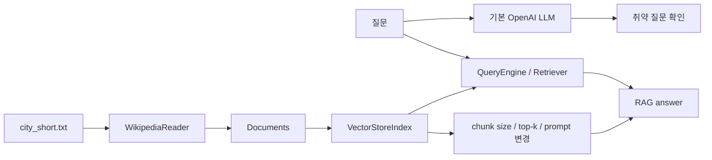

# RAG Practice 02. RAG App 구성 코드 학습 가이드

<!-- aisp-exam-practice-notice -->
> **시험 대비 모드:** 오른쪽에는 원본 전체 코드 대신 핵심 셀을 `## 정답 입력`으로 비운 실습본이 표시됩니다.
> 원본은 `rag/1일차/실습 자료/Code/2. RAG.ipynb`, 정답과 출제 의도는 `study_notes/exam_answers/rag_code_answers.md`에서 확인합니다.


오른쪽 원본 노트북 `2. RAG.ipynb`를 보면서, 왼쪽에서는 기본 LLM의 한계 → Wikipedia 기반 RAG 구축 → chunk/top-k/prompt 설정 비교 흐름을 잡는다.

기준 자료: `rag/1일차/실습 자료/Code/2. RAG.ipynb`

목표: RAG 앱의 성능이 LLM 하나가 아니라 **retriever, chunking, top-k, response synthesis, prompt**의 조합으로 결정된다는 것을 이해한다.

## 0. 전체 흐름



| 구성요소 | 노트북에서 보는 것 | 핵심 질문 |
|---|---|---|
| Base LLM | `generate_answer(question)` | 외부 지식 없이 어디까지 답하나? |
| Reader | `WikipediaReader()` | 어떤 문서를 지식베이스로 넣나? |
| Index | `VectorStoreIndex.from_documents` | 문서를 어떻게 검색 가능하게 만드나? |
| Retriever | `index.as_retriever()` | 어떤 passage가 실제로 뽑히나? |
| Query Engine | `index.as_query_engine()` | 검색 결과를 어떻게 답으로 합치나? |
| Config | chunk size, top-k, prompt | 품질이 왜 달라지나? |

## 1. 셀 지도

| 구간 | 셀 범위 | 주제 | 공부 포인트 |
|---:|---:|---|---|
| 1 | 001-020 | 기본 LLM 취약점 확인 | 오래된 정보, 최신 정보, 복잡/모호 질문 |
| 2 | 021-034 | Wikipedia 문서 로드와 index 구축 | `city_short.txt`, `WikipediaReader`, query engine |
| 3 | 035-043 | Retriever와 generator 연결 | retrieved passage 직접 출력 |
| 4 | 044-054 | chunk size와 top-k 비교 | 작은 chunk vs 큰 chunk, top-k 조절 |
| 5 | 055-067 | response synthesizer / prompt 변경 | summary vs answer, custom query engine |
| 6 | 068 | 개선 방향 정리 | RAG 성능은 설정 조합 문제 |

## 2. Cells 001-020 — 기본 LLM 한계 확인

처음에는 RAG 없이 OpenAI chat completion으로 질문에 답한다.

```python
def generate_answer(question):
    messages = [{"role": "user", "content": question}]
    response = openai.chat.completions.create(...)
    return response.choices[0].message.content
```

질문 유형:

| 유형 | 예시 | 관찰 포인트 |
|---|---|---|
| 오래된 정보 | 과거 사실 | 모델이 알고 있을 수 있음 |
| 최신 정보 | 2024년 사건 등 | 학습 시점 이후면 취약 |
| 단순 질문 | 명확한 factual QA | 잘 답할 가능성 높음 |
| 복잡 질문 | 여러 조건/추론 필요 | 근거 없이 그럴듯하게 답할 수 있음 |
| 모호 질문 | 지시가 불명확 | 질문 명확화가 필요 |

핵심: 기본 LLM 답변이 유창해도 근거가 없으면 신뢰하기 어렵다.

## 3. Cells 021-034 — Wikipedia 기반 지식베이스

도시 목록을 읽고 Wikipedia page를 가져온다.

```text
city_short.txt
  -> city_names
  -> WikipediaReader.load_data(city_names)
  -> documents
  -> VectorStoreIndex.from_documents(documents)
```

`query_engine.query("What's arts culture scene in Berlin?")`처럼 지식베이스 안에 있는 질문을 던지면 RAG가 문서를 찾아 답한다.

반대로 지식베이스에 없는 지역/사건을 물으면 답변이 약해진다. 이때는 “LLM이 못한다”보다 먼저 “KB에 근거가 없나?”를 확인해야 한다.

## 4. Cells 035-043 — Retriever와 Generator 연결

RAG는 두 단계다.

```text
1. retrieve(query) -> relevant passages
2. generate(query + passages) -> answer
```

노트북은 `query_engine.query(query)`로 한 번에 답하게도 하고, `index.as_retriever()`로 passage를 직접 확인하게도 한다.

```python
retriever = index.as_retriever()
ret = retriever.retrieve(city_question)
for node in ret:
    print(node.text)
```

이 출력은 RAG 디버깅에서 가장 중요하다.

| 상황 | 해석 |
|---|---|
| passage에 정답 근거가 있음, 답도 맞음 | 검색/생성 모두 성공 |
| passage에 근거가 있음, 답이 틀림 | 생성/prompt/synthesizer 문제 |
| passage에 근거가 없음, 답이 틀림 | retrieval/index/chunk 문제 |
| passage에 근거가 없음, 답이 맞음 | LLM prior knowledge일 수 있음 |

## 5. Cells 044-054 — chunk size와 top-k

노트북은 `SentenceSplitter` 설정을 바꿔 작은 chunk와 큰 chunk를 비교한다.

```python
text_splitter_short = SentenceSplitter(chunk_size=200, chunk_overlap=50)
text_splitter_long = SentenceSplitter(chunk_size=1024, chunk_overlap=200)
```

| 설정 | 장점 | 단점 |
|---|---|---|
| 작은 chunk | 특정 사실을 정확히 찾기 쉬움 | 답에 필요한 문맥이 잘릴 수 있음 |
| 큰 chunk | 문맥이 풍부함 | 관련 없는 내용이 섞이고 비용 증가 |
| top_k=1 | 가장 관련 높은 것만 봄 | 근거 누락 위험 |
| top_k=2+ | 보완 근거 확보 | 잡음 증가 가능 |

Antananarivo 질문처럼 답에 문맥이 필요한 경우, 작은 chunk는 핵심 문장이 잘려 답변 품질을 낮출 수 있다.

실무 감각:

```text
chunk size는 retrieval recall과 context precision의 균형점이다.
top-k는 근거 누락과 잡음 주입의 균형점이다.
```

## 6. Cells 055-067 — Response Synthesizer와 Prompt

후반부는 query engine을 직접 정의한다.

```python
class OurCustomQueryEngine(CustomQueryEngine):
    retriever: BaseRetriever
    response_synthesizer: BaseSynthesizer
    llm: OpenAI
    qa_prompt: PromptTemplate
```

비교하는 축:

| 설정 | 동작 | 결과 차이 |
|---|---|---|
| answer prompt | 질문에 직접 답 | 사용자 QA에 적합 |
| summary prompt | 검색 문맥 요약 | 정보 정리는 좋지만 질문 답이 약할 수 있음 |
| `response_mode="compact"` | context를 압축해 답변 | 일반 QA 기본값으로 무난 |
| `Refine_RAG` | 검색 결과를 바탕으로 답 개선 | 긴 문맥/여러 근거에 유리 |

여기서 중요한 것은 RAG 성능을 “모델 교체”만으로 해결하지 않는다는 점이다. 같은 LLM이어도 chunk, top-k, prompt, synthesizer가 바뀌면 결과가 달라진다.

## 7. 실습 중 보안/환경 주의

- OpenAI API key는 노트북에 저장하지 않는다.
- Wikipedia 요청은 네트워크와 rate limit 영향을 받는다.
- `llama-index==0.12.2`처럼 버전이 고정되어 있으므로 최신 API와 다를 수 있다.
- Windows 경로가 들어간 셀은 현재 환경에 맞게 상대 경로로 바꿔야 한다.
- 실습 HTML은 정적 읽기용이므로 브라우저에서 코드를 실행하지 않는다.

## 8. 직접 구현 체크리스트

1. 기본 LLM 답변과 RAG 답변을 같은 질문으로 비교했는가?
2. `city_short.txt`에서 어떤 도시가 KB에 들어가는지 확인했는가?
3. `retriever.retrieve()` 출력으로 실제 근거를 봤는가?
4. 작은 chunk와 큰 chunk의 passage 차이를 확인했는가?
5. top-k를 바꿨을 때 답변이 좋아졌는지, 잡음이 늘었는지 봤는가?
6. answer prompt와 summary prompt의 목적 차이를 설명할 수 있는가?
7. 답변이 맞더라도 context에 근거가 없으면 별도로 표시했는가?

## 9. 한 줄 요약

이 노트북은 RAG 앱을 “LLM 호출 코드”가 아니라 **자료 수집, chunking, retrieval, prompt/synthesis 설정을 조율하는 검색-생성 시스템**으로 보는 연습이다.
